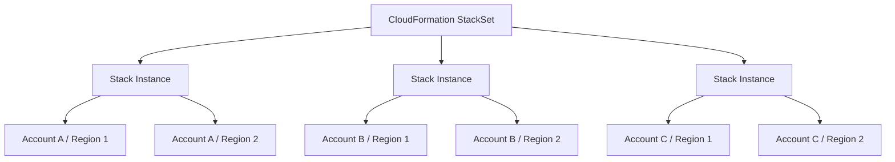
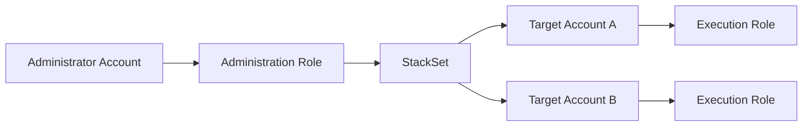
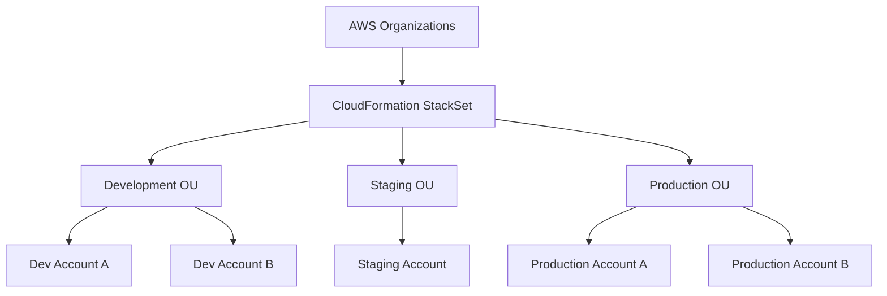
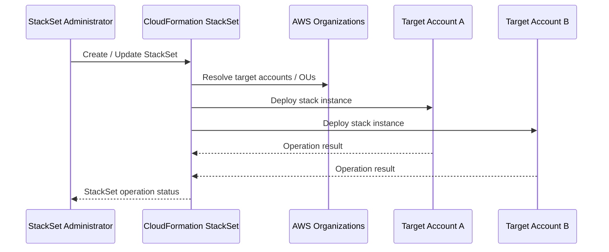
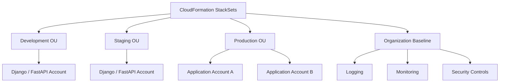
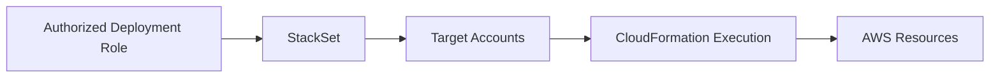
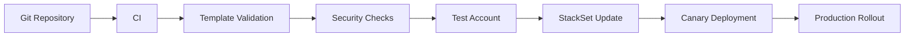

# 04- StackSets and Multi-Account Architecture

## Overview

AWS CloudFormation StackSets extend CloudFormation beyond a single account and Region. A StackSet provides a centralized definition from which CloudFormation can create, update, or delete stack instances across multiple AWS accounts and Regions. :contentReference[oaicite:0]{index=0}

This is particularly important in AWS Organizations environments where infrastructure must be standardized across development, staging, production, security, platform, or workload accounts.

A typical enterprise architecture looks like:

```text
                    AWS Organizations
                           |
                    CloudFormation
                       StackSet
                           |
          +----------------+----------------+
          |                |                |
          v                v                v
      Account A        Account B        Account C
          |                |                |
      us-east-1        us-east-1        us-east-1
      eu-west-1        eu-west-1        eu-west-1
```

The key distinction is:

```text
CloudFormation Stack
    → Infrastructure in one account / Region

CloudFormation StackSet
    → Same infrastructure definition across many accounts / Regions
```

---

## What StackSets Manage

A StackSet is a container for multiple stack instances. Each stack instance represents a deployment of the StackSet template into a particular target account and Region. :contentReference[oaicite:1]{index=1}

For example:

```text
StackSet: Organization-Logging

├── Account A / us-east-1
├── Account A / eu-west-1
├── Account B / us-east-1
├── Account B / eu-west-1
├── Account C / us-east-1
└── Account C / eu-west-1
```

All of these stack instances originate from the same StackSet template, although parameter values can be customized for individual stacks. :contentReference[oaicite:2]{index=2}

---

## Why StackSets Exist

Without StackSets, an organization managing 50 AWS accounts and three Regions might need to deploy infrastructure repeatedly:

```text
Account A
    ├── Region A
    ├── Region B
    └── Region C

Account B
    ├── Region A
    ├── Region B
    └── Region C

...

Account N
```

This creates operational problems:

- Repetitive deployments.
- Configuration inconsistency.
- Manual errors.
- Slow infrastructure rollout.
- Difficult compliance enforcement.
- Difficult organization-wide updates.

StackSets provide a centralized deployment mechanism:

```text
                StackSet
                   |
       +-----------+-----------+
       |           |           |
       v           v           v
    Account A   Account B   Account C
```

---

## StackSet Architecture



The StackSet acts as the centralized deployment definition.

The stack instances are the actual CloudFormation stacks deployed into target accounts and Regions.

---

## Core StackSet Components

| Component | Responsibility |
|---|---|
| StackSet | Central template and deployment configuration |
| Administrator Account | Account from which StackSet operations are managed |
| Target Account | Account receiving stack instances |
| Stack Instance | Specific StackSet deployment in an account and Region |
| Target OU | Organizational Unit targeted by service-managed StackSets |
| Region | AWS Region where the stack instance is deployed |
| Permission Model | Determines how cross-account deployment permissions work |
| Operation | Create, update, delete, drift detection, or other StackSet action |
| Operation Preferences | Controls concurrency, failure tolerance, and Region rollout |

An administrator account can be the AWS Organizations management account or a delegated administrator when using service-managed permissions. :contentReference[oaicite:3]{index=3}

---

## Multi-Account AWS Architecture

A mature AWS organization commonly separates workloads into multiple accounts.

```text
AWS Organization
│
├── Security Account
├── Log Archive Account
├── Network Account
├── Shared Services Account
│
├── Development OU
│   ├── Dev Account A
│   └── Dev Account B
│
├── Staging OU
│   └── Staging Account
│
└── Production OU
    ├── Production Account A
    └── Production Account B
```

StackSets can distribute standardized infrastructure across these accounts.

Examples include:

- CloudWatch configuration.
- IAM roles.
- AWS Config resources.
- Security baselines.
- Logging resources.
- Organization-wide operational resources.
- Standard networking components.
- Compliance controls.

---

## Permission Models

StackSets supports two permission models:

| Permission Model | Cross-Account Roles | AWS Organizations | Typical Use |
|---|---|---|---|
| `SELF_MANAGED` | Managed by you | Not required | Custom account relationships |
| `SERVICE_MANAGED` | Managed by CloudFormation | Required | AWS Organizations environments |

The permission model is selected when creating the StackSet. :contentReference[oaicite:4]{index=4}

---

## Self-Managed StackSets

With self-managed permissions, the organization creates and manages the IAM roles required for StackSet administration and execution.

The conceptual architecture is:



The required roles must be configured in the appropriate accounts.

This model provides explicit control over the trust relationships and permissions.

It is useful when:

- AWS Organizations is not being used.
- Accounts are managed independently.
- Custom trust relationships are required.
- A tightly controlled cross-account deployment model is needed.

However, it creates additional IAM administration overhead because the organization is responsible for maintaining the required roles. :contentReference[oaicite:5]{index=5}

---

## Service-Managed StackSets

Service-managed permissions integrate StackSets with AWS Organizations.

CloudFormation can create and manage the required IAM roles for deployments into organization accounts, eliminating the need to manually create the StackSet execution roles in every target account. :contentReference[oaicite:6]{index=6}

The architecture becomes:



This is generally the preferred model for centralized infrastructure management in an AWS Organizations environment.

---

## Delegated Administrator

Service-managed StackSets can be managed by a delegated administrator account rather than requiring all StackSet operations to originate from the AWS Organizations management account. :contentReference[oaicite:7]{index=7}

Conceptually:

```text
AWS Organizations Management Account
              |
              | delegates StackSet administration
              v
       StackSet Admin Account
              |
              v
        CloudFormation
              |
       +------+------+
       |             |
       v             v
   Member A       Member B
```

This supports separation of organizational management from infrastructure operations.

However, delegated administrators have broad StackSet deployment authority within the organization, so the organizational security model must account for this capability. :contentReference[oaicite:8]{index=8}

---

## Organizational Units as Deployment Targets

Service-managed StackSets can target Organizational Units rather than requiring every account to be listed individually. :contentReference[oaicite:9]{index=9}

For example:

```text
Production OU
├── Account A
├── Account B
└── Account C
```

A StackSet targeting the Production OU can deploy the defined stack to those accounts.

This makes OU structure an important part of StackSet architecture.

A well-designed organization might use:

```text
Development OU
Staging OU
Production OU
Security OU
Infrastructure OU
```

StackSets can then apply different infrastructure baselines to each organizational boundary.

---

## Automatic Deployment

Service-managed StackSets support automatic deployment to accounts added to targeted Organizations OUs. :contentReference[oaicite:10]{index=10}

For example:

```text
Production OU
│
├── Account A
├── Account B
└── Account C
```

A new account is created:

```text
Production OU
│
├── Account A
├── Account B
├── Account C
└── Account D  ← New
```

With automatic deployment configured, StackSets can automatically create the relevant stack instance for the new account.

This is useful for enforcing organization-wide infrastructure baselines.

---

## Account Removal Behavior

Automatic deployment also requires a deliberate decision about what happens when an account leaves a targeted OU or organization.

The available strategy should be chosen according to the lifecycle requirements of the resources.

Conceptually:

```text
Account leaves target OU
          |
          +----> Delete stack and resources
          |
          +----> Retain stack and resources
```

When stacks are retained, they become detached from the StackSet while remaining in the target account and Region. :contentReference[oaicite:11]{index=11}

This distinction matters for production resources where automatic deletion could be dangerous.

---

## StackSet Deployment Flow

A typical service-managed deployment looks like:



The StackSet operation coordinates deployment across the selected target accounts and Regions.

---

## Region Deployment

StackSets are regional resources, so the Region in which the StackSet is created matters when managing it. :contentReference[oaicite:12]{index=12}

A StackSet can deploy stack instances into multiple Regions.

For example:

```text
StackSet
│
├── Account A
│   ├── us-east-1
│   └── eu-west-1
│
└── Account B
    ├── us-east-1
    └── eu-west-1
```

Region rollout can be sequential or parallel.

Sequential deployment is useful when controlled rollout is more important than speed.

Parallel deployment is useful when faster multi-Region deployment is required and the failure model is well understood. :contentReference[oaicite:13]{index=13}

---

## Operation Preferences

StackSet operations provide controls for deployment concurrency and failure tolerance.

Important settings include:

- Maximum concurrent accounts.
- Failure tolerance.
- Concurrency mode.
- Region concurrency.
- Region deployment order.

:contentReference[oaicite:14]{index=14}

A conservative deployment might look like:

```text
Region A
    |
    +-- Account A
    |
    +-- Account B
    |
    +-- Account C

Region B
    |
    +-- Account A
    |
    +-- Account B
    |
    +-- Account C
```

This makes it easier to identify problems before rolling changes into every Region.

---

## Maximum Concurrent Accounts

Maximum concurrency controls how many target accounts can be processed at the same time. :contentReference[oaicite:15]{index=15}

For example:

```text
100 Target Accounts
        |
        +-- 5 accounts at a time
```

A lower value provides a more conservative rollout.

A higher value accelerates deployment but increases the number of accounts potentially affected by a faulty template.

CloudFormation may still reduce actual concurrency due to service throttling. :contentReference[oaicite:16]{index=16}

---

## Failure Tolerance

Failure tolerance determines how many stack operation failures are allowed before CloudFormation stops the operation for a Region. :contentReference[oaicite:17]{index=17}

For example:

```text
Failure Tolerance = 1

Account A → SUCCESS
Account B → SUCCESS
Account C → FAILED
Account D → FAILED
               ↑
          Operation stops
```

The exact behavior depends on the configured failure tolerance and concurrency mode.

A conservative production rollout often starts with a low failure tolerance.

---

## Concurrency Modes

StackSets supports concurrency behavior that determines how account concurrency reacts to failures.

The important modes are:

### Strict Failure Tolerance

Concurrency can be reduced as failures occur so the operation stays within the configured failure tolerance plus one. :contentReference[oaicite:18]{index=18}

This is useful when minimizing blast radius is more important than maximum deployment speed.

### Soft Failure Tolerance

The configured maximum concurrency is maintained even when failures occur. :contentReference[oaicite:19]{index=19}

This can provide faster rollout but potentially exposes more accounts to a faulty deployment.

---

## StackSet Dependencies

Service-managed StackSets can define dependencies between StackSets, with current AWS documentation allowing up to 10 dependencies. :contentReference[oaicite:20]{index=20}

For example:

```text
Security Baseline StackSet
          ↓
Logging StackSet
          ↓
Application Baseline StackSet
```

This can help coordinate organization-wide infrastructure where one StackSet must be available before another.

Dependencies should be used deliberately because they increase deployment coordination complexity.

---

## Multi-Account Backend Architecture

A backend platform may use separate AWS accounts for different environments.



For example, StackSets can deploy standardized CloudWatch or IAM infrastructure to all application accounts while application-specific CloudFormation stacks remain independently managed.

---

## What StackSets Should Deploy

StackSets are strongest when used for standardized infrastructure.

Good candidates include:

| Infrastructure | Why StackSets Fit |
|---|---|
| IAM roles | Standardized access |
| Logging configuration | Organization-wide baseline |
| CloudWatch resources | Consistent observability |
| AWS Config resources | Compliance |
| Security controls | Centralized baseline |
| Standard networking resources | Repeatable platform configuration |
| Organization-wide operational resources | Consistency |

Avoid using a single StackSet to deploy every application resource in every account.

Application infrastructure often requires account-specific ownership and release cycles.

---

## StackSets and Application Infrastructure

A useful separation is:

```text
StackSets
    ↓
Organization / Platform Baseline

Individual CloudFormation Stacks
    ↓
Application Infrastructure
```

For example:

```text
StackSet
├── CloudWatch baseline
├── IAM deployment role
└── Security configuration

Application Stack
├── ECS Service
├── ALB
├── RDS
└── Redis
```

The StackSet establishes the common platform foundation while application stacks remain independently deployable.

---

## Parameterization

A StackSet uses a common template while allowing parameter values to be customized.

For example:

```yaml
Parameters:

  Environment:
    Type: String

  LogRetentionDays:
    Type: Number
    Default: 30
```

Different stack instances can use different values when required.

This allows one infrastructure definition to support multiple deployment contexts without duplicating templates.

However, excessive parameterization can make the template difficult to understand.

Prefer parameters for genuine environmental differences rather than turning every configuration value into an input.

---

## StackSet Template Design

A StackSet template should be designed for repeatable deployment.

Prefer:

```yaml
Resources:

  ApplicationLogGroup:
    Type: AWS::Logs::LogGroup
    Properties:
      RetentionInDays: !Ref LogRetentionDays
```

over hardcoding environment-specific resource identifiers.

Good StackSet templates should be:

- Idempotent.
- Parameterized where necessary.
- Account-aware.
- Region-aware.
- Least-privilege.
- Small enough to represent one standardized capability.

AWS recommends keeping StackSet templates granular enough to balance standardization and control. :contentReference[oaicite:21]{index=21}

---

## StackSet Operations

Common StackSet operations include:

```text
Create StackSet
       ↓
Create Stack Instances
       ↓
Update StackSet
       ↓
Update Stack Instances
       ↓
Delete Stack Instances
       ↓
Delete StackSet
```

StackSet operations are asynchronous and can involve many accounts and Regions.

Operational visibility is therefore essential.

---

## AWS CLI

Create a service-managed StackSet:

```bash
aws cloudformation create-stack-set \
  --stack-set-name organization-logging \
  --template-url https://example-bucket.s3.amazonaws.com/logging.yaml \
  --permission-model SERVICE_MANAGED
```

AWS documents `SERVICE_MANAGED` and `SELF_MANAGED` as the two StackSet permission models. :contentReference[oaicite:22]{index=22}

Deploy stack instances to an OU:

```bash
aws cloudformation create-stack-instances \
  --stack-set-name organization-logging \
  --deployment-targets OrganizationalUnitIds=ou-example123 \
  --regions us-east-1 eu-west-1 \
  --operation-preferences \
    MaxConcurrentCount=1,FailureToleranceCount=0
```

The CLI supports deployment preferences such as maximum concurrency and failure tolerance. :contentReference[oaicite:23]{index=23}

Check StackSet operations:

```bash
aws cloudformation list-stack-set-operations \
  --stack-set-name organization-logging
```

Inspect a specific operation:

```bash
aws cloudformation describe-stack-set-operation \
  --stack-set-name organization-logging \
  --operation-id <operation-id>
```

List StackSets:

```bash
aws cloudformation list-stack-sets
```

---

## Production Rollout Strategy

For organization-wide infrastructure, avoid immediately deploying a new template to hundreds of accounts.

Use staged rollout.

```text
StackSet Template
       ↓
Test Account
       ↓
Test Region
       ↓
Small Production Group
       ↓
Additional Accounts
       ↓
Additional Regions
       ↓
Organization-Wide Deployment
```

AWS recommends testing updated StackSet templates against a smaller set of accounts before updating large numbers of stack instances. :contentReference[oaicite:24]{index=24}

A conservative rollout might be:

```text
Phase 1
1 account / 1 low-impact Region

Phase 2
small set of accounts

Phase 3
one production OU

Phase 4
remaining production OUs
```

This limits blast radius when a template contains an unexpected change.

---

## StackSet Updates

By default, updating a StackSet can update all of its stack instances. :contentReference[oaicite:25]{index=25}

For example:

```text
StackSet
    |
    +-- 20 Accounts
    |
    +-- 2 Regions
          |
          = 40 Stack Instances
```

A StackSet update can therefore affect all 40 instances.

This is why large StackSets require deliberate rollout controls.

For more granular update control, AWS recommends considering multiple StackSets rather than putting unrelated deployment groups into one massive StackSet. :contentReference[oaicite:26]{index=26}

---

## StackSet Granularity

Bad design:

```text
OrganizationEverythingStackSet
├── IAM
├── Logging
├── Security
├── Networking
├── Application
├── Database
└── Monitoring
```

A change to one capability potentially affects every account receiving the StackSet.

Better:

```text
SecurityBaselineStackSet
LoggingBaselineStackSet
MonitoringBaselineStackSet
PlatformBaselineStackSet
```

Each StackSet has a focused responsibility.

This makes:

- Deployment safer.
- Ownership clearer.
- Rollbacks easier.
- Change impact easier to understand.
- Permissions easier to control.

---

## Security Architecture

StackSets can become a highly privileged organization-wide deployment mechanism.

The architecture should therefore enforce strong controls.



Consider:

- Least-privilege administration.
- Dedicated deployment roles.
- Delegated administration where appropriate.
- Restricted template modification permissions.
- Code review.
- CI/CD approval gates.
- CloudTrail auditing.
- Controlled target OUs.
- Restricted Regions where appropriate.

A compromised StackSet administration role can potentially affect a large portion of an AWS organization.

Treat StackSet administration as a high-impact privilege.

---

## IAM Capabilities

If a StackSet template contains IAM resources, the appropriate CloudFormation capability acknowledgement may be required.

For example:

```bash
--capabilities CAPABILITY_IAM
```

or:

```bash
--capabilities CAPABILITY_NAMED_IAM
```

`CAPABILITY_NAMED_IAM` is required when IAM resources use custom names. :contentReference[oaicite:27]{index=27}

Production deployments should review the IAM permissions contained in StackSet templates before deployment.

---

## Reliability and Blast Radius

The major reliability concern with StackSets is deployment blast radius.

A faulty template can affect:

```text
100 Accounts
×
3 Regions
=
300 Stack Instances
```

Therefore, deployment controls matter as much as template correctness.

Use:

- Small initial concurrency.
- Low failure tolerance for critical changes.
- Region ordering.
- Test accounts.
- Progressive rollout.
- StackSet operation monitoring.
- Clear rollback procedures.

---

## Region Strategy

Multi-Region deployment should be intentional.

For example:

```text
Primary Region
    ↓
Secondary Region
    ↓
Disaster Recovery Region
```

A sequential rollout allows the organization to validate the first Region before continuing.

Parallel deployment:

```text
             StackSet
            /   |   \
           /    |    \
       Region A Region B Region C
```

reduces rollout time but increases simultaneous exposure.

Use parallel deployment only when the failure model and operational controls justify it.

---

## Monitoring

StackSet operations should be monitored at multiple levels.

```text
StackSet Operation
       |
       +-- Region Status
              |
              +-- Account Status
                     |
                     +-- Stack Status
                            |
                            +-- Resource Status
```

Useful CLI commands include:

```bash
aws cloudformation list-stack-set-operations \
  --stack-set-name organization-security
```

```bash
aws cloudformation describe-stack-set-operation \
  --stack-set-name organization-security \
  --operation-id <operation-id>
```

Individual stack events can then be inspected when a particular account or Region fails.

---

## Drift Detection

StackSets support drift detection across stack instances. :contentReference[oaicite:28]{index=28}

Drift detection is important in multi-account environments because manual changes can create inconsistent infrastructure.

Conceptually:

```text
Desired StackSet Template
          |
          v
Compare Against
          |
          +--> Account A → IN_SYNC
          +--> Account B → DRIFTED
          +--> Account C → IN_SYNC
```

A drifted stack should be investigated before blindly applying another StackSet update.

---

## Failure Handling

A StackSet operation can fail in one or more accounts or Regions.

A useful troubleshooting flow is:

```text
StackSet Operation Failed
          ↓
Identify Failed Region
          ↓
Identify Failed Account
          ↓
Inspect Stack Instance
          ↓
Inspect CloudFormation Events
          ↓
Identify Root Cause
          ↓
Fix Template / Permissions / Target
          ↓
Retry Operation
```

Do not treat a StackSet failure as a single global failure.

The failure may be isolated to a particular account, Region, resource, permission boundary, or organizational configuration.

---

## Account Gates and Progressive Deployment

For sensitive deployments, account gates can provide additional protection against automatically proceeding after unexpected failures.

A practical rollout model is:

```text
Test Accounts
     ↓
Validation
     ↓
Production Canary Accounts
     ↓
Validation Gate
     ↓
Production Accounts
```

This is similar to progressive application deployment.

The same engineering principle applies:

> Validate a small blast radius before increasing deployment scope.

---

## Cost Considerations

StackSets primarily orchestrate CloudFormation stacks; the infrastructure resources created by those stacks determine the majority of infrastructure cost.

However, organization-wide deployments can create unexpected cost if templates provision billable resources in every account and Region.

Before deploying a StackSet broadly, evaluate:

- Per-account resource cost.
- Per-Region resource cost.
- Idle development environments.
- Logging storage.
- Monitoring resources.
- NAT Gateway deployment.
- Data transfer.
- Replicated infrastructure.

A resource that costs little in one account can become significant when multiplied across dozens or hundreds of accounts.

---

## Disaster Recovery

StackSets can help reproduce standardized infrastructure across accounts and Regions.

For example:

```text
Primary Region
      |
      +── StackSet Infrastructure

DR Region
      |
      +── StackSet Infrastructure
```

However, StackSets do not automatically solve application data recovery.

Stateful services still require:

- Backups.
- Replication.
- Snapshot strategies.
- Recovery procedures.
- Data consistency planning.
- Recovery testing.

Infrastructure reproducibility is only one part of disaster recovery.

---

## StackSets and CI/CD

A production workflow should treat StackSet templates as version-controlled infrastructure code.



The pipeline should control:

- Who can modify StackSet templates.
- Which accounts can be targeted.
- Which Regions can be targeted.
- Deployment concurrency.
- Approval requirements.
- Rollback procedures.

Manual organization-wide StackSet changes should be avoided for critical infrastructure.

---

## Service-Managed vs Self-Managed

| Requirement | Service-Managed | Self-Managed |
|---|---|---|
| AWS Organizations | Required | Not required |
| IAM roles | CloudFormation manages required roles | You manage roles |
| OU targeting | Supported | Not the Organizations-integrated model |
| Automatic account deployment | Supported | Not the same Organizations automation |
| Operational overhead | Lower | Higher |
| Custom trust relationships | More constrained | More control |
| Enterprise Organizations | Strong fit | Usually unnecessary complexity |
| Standalone account relationships | Not suitable | Strong fit |

Service-managed permissions are generally the natural choice for AWS Organizations environments. Self-managed permissions remain useful where explicit cross-account IAM control is required. :contentReference[oaicite:29]{index=29}

---

## Nested Stacks and StackSets

Nested stacks and StackSets solve different problems.

| Technology | Primary Problem |
|---|---|
| Nested Stack | Modularize one CloudFormation deployment |
| Cross-Stack | Share values between independent stacks |
| StackSet | Deploy a common stack across accounts and Regions |

They can conceptually fit together, but service-managed StackSets currently do not support nested stacks. :contentReference[oaicite:30]{index=30}

Therefore, architecture should not assume that a service-managed StackSet can simply wrap an arbitrary nested-stack hierarchy.

---

## Common Mistakes

### Deploying Organization-Wide Immediately

A faulty template can affect many accounts and Regions.

**Avoid it:** start with test accounts and progressive rollout.

### Using One Giant StackSet

A single StackSet containing unrelated capabilities increases blast radius.

**Avoid it:** create focused StackSets based on ownership and lifecycle.

### Excessive Concurrency

High concurrency accelerates deployment but increases simultaneous exposure.

**Avoid it:** choose concurrency based on risk, not maximum speed.

### Ignoring Failure Tolerance

A deployment can continue through failures if failure tolerance is configured too aggressively.

**Avoid it:** use conservative failure tolerance for sensitive changes.

### Treating All Accounts as Identical

Accounts may have different Regions, permissions, quotas, or application requirements.

**Avoid it:** design templates and parameters for legitimate account-level variation.

### Giving Broad StackSet Permissions

StackSet administrators can potentially affect large portions of the organization.

**Avoid it:** tightly control StackSet administration and template modification.

### Ignoring Drift

Manual changes can cause stack instances to diverge from the intended configuration.

**Avoid it:** perform drift detection and establish clear remediation procedures.

### Deploying Expensive Resources Everywhere

A resource multiplied across 100 accounts can become a substantial cost.

**Avoid it:** perform organization-wide cost analysis before rollout.

---

## Interview Traps

### What Is the Difference Between a Stack and a StackSet?

A stack manages infrastructure in a specific deployment context.

A StackSet manages a collection of stacks across multiple AWS accounts and Regions.

### What Is a Stack Instance?

A stack instance represents a particular StackSet deployment in a specific AWS account and Region.

### Which Permission Model Is Preferred for AWS Organizations?

Service-managed permissions are generally the natural choice because they integrate with AWS Organizations and can target OUs. :contentReference[oaicite:31]{index=31}

### Why Use StackSets Instead of Copying Templates?

StackSets provide centralized deployment, update, and lifecycle management across many accounts and Regions.

### How Do You Reduce StackSet Blast Radius?

Use:

- Test accounts.
- Canary deployments.
- Low initial concurrency.
- Conservative failure tolerance.
- Sequential Region rollout.
- Separate StackSets by capability.

### Can StackSets Automatically Deploy to New Accounts?

Service-managed StackSets can automatically deploy to accounts added to targeted Organizations OUs when automatic deployment is enabled. :contentReference[oaicite:32]{index=32}

### Does StackSet Mean One Stack?

No.

A StackSet is the centralized deployment definition and can contain many stack instances across accounts and Regions.

---

## Production Best Practices

- Use service-managed StackSets for organization-wide infrastructure when AWS Organizations is the appropriate control plane.
- Use delegated administrators to separate infrastructure operations from the Organizations management account where appropriate.
- Keep StackSets granular and responsibility-focused.
- Treat StackSet administration as a high-impact privilege.
- Store templates in version control and preferably publish deployment artifacts through a controlled pipeline.
- Validate templates before organization-wide rollout.
- Test changes in a small number of accounts first.
- Use conservative concurrency for high-risk changes.
- Set failure tolerance deliberately.
- Prefer sequential Region rollout for sensitive changes.
- Use automatic deployment only when the lifecycle behavior is clearly understood.
- Plan account removal behavior carefully.
- Monitor StackSet operations and individual stack instances.
- Use drift detection to identify configuration divergence.
- Review organization-wide cost impact before deploying billable resources broadly.
- Avoid embedding unrelated application infrastructure into organization-wide baseline StackSets.
- Use separate StackSets when different teams, lifecycles, or rollout policies require independent control.
- Treat StackSet templates as production infrastructure code and subject them to code review and CI/CD controls.

---

## Key Takeaways

- CloudFormation StackSets provide centralized deployment of CloudFormation stacks across multiple AWS accounts and Regions.
- A StackSet is the deployment definition; a stack instance is a specific deployment in an account and Region.
- StackSets support self-managed and service-managed permission models.
- Service-managed permissions integrate with AWS Organizations and support OU-based targeting and automatic account deployment.
- Self-managed permissions provide more explicit control over cross-account IAM relationships but require additional operational management.
- StackSet operations can be controlled through concurrency, failure tolerance, concurrency mode, Region order, and Region concurrency.
- Large organization-wide deployments should use progressive rollout rather than immediate full-scale deployment.
- StackSet granularity is an important architectural decision; unrelated capabilities should generally not be forced into one StackSet.
- StackSet administration is a high-impact security boundary and should use least privilege, controlled access, and auditing.
- Drift detection is important for maintaining consistency across large numbers of stack instances.
- StackSets are particularly effective for standardized organization-wide baselines such as security, logging, monitoring, and platform infrastructure.
- Application-specific infrastructure can remain in independently managed CloudFormation stacks.
- Infrastructure cost must be evaluated at organizational scale because a small per-account cost can become significant when multiplied across accounts and Regions.
- StackSets improve infrastructure standardization, but they do not eliminate the need for careful deployment engineering, failure isolation, monitoring, and recovery planning.