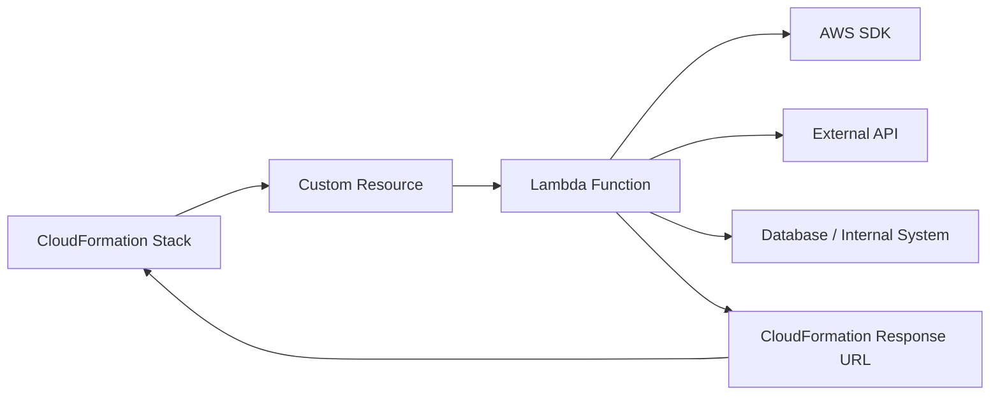
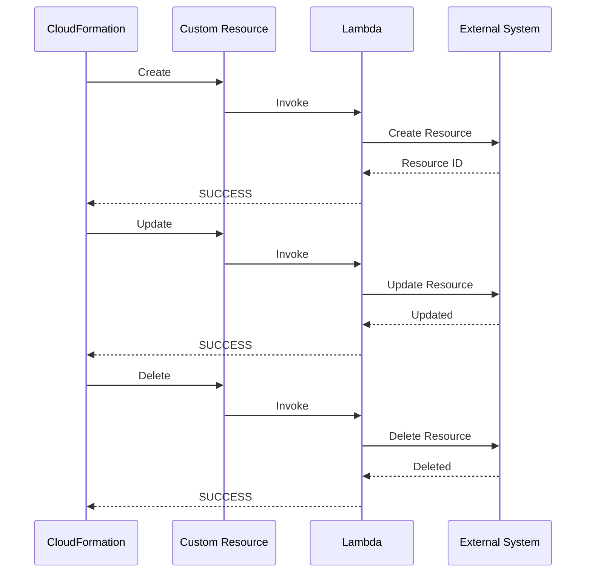
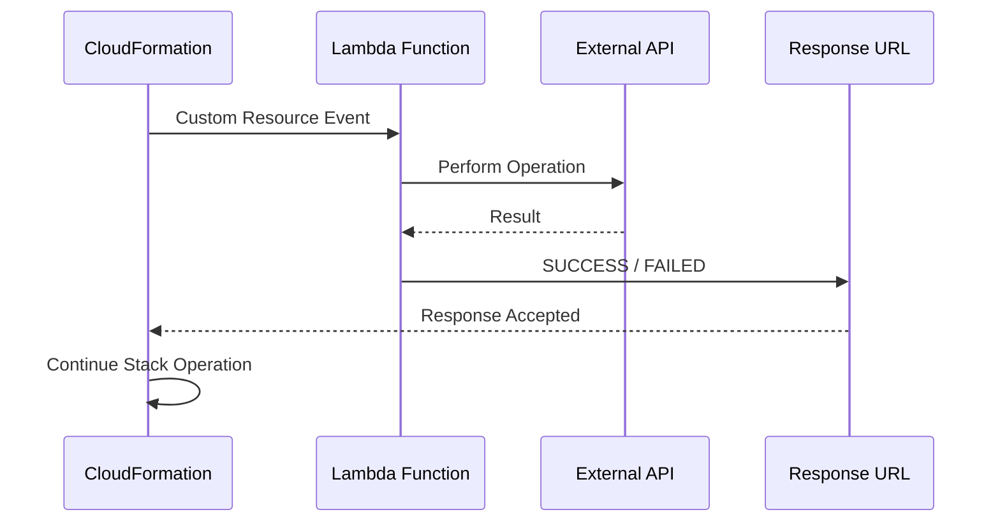
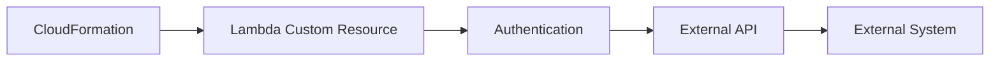
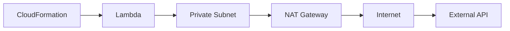
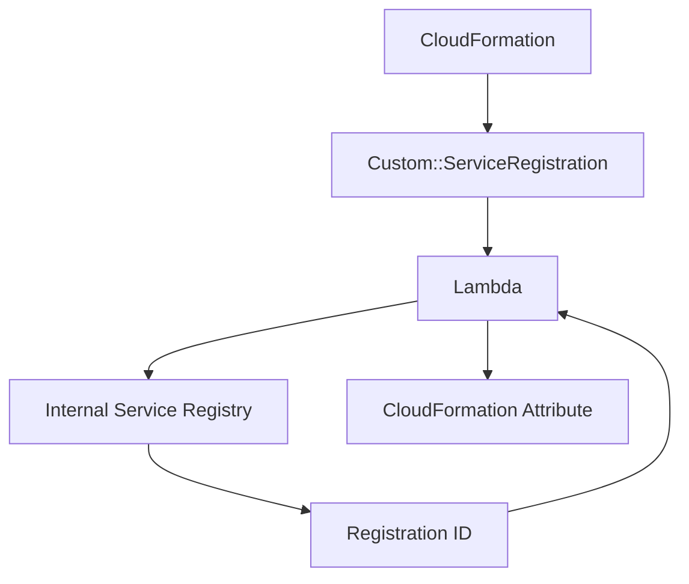

# 05- Custom Resource Architecture

## Overview

AWS CloudFormation Custom Resources extend CloudFormation when the native resource types do not provide the required infrastructure operation.

A custom resource allows a CloudFormation stack to invoke application-defined logic during stack lifecycle operations such as:

- Create
- Update
- Delete

The most common implementation is a Lambda-backed custom resource:

```text
CloudFormation
      |
      | Create / Update / Delete
      v
Custom Resource
      |
      v
Lambda Function
      |
      v
External API / AWS SDK / Custom Logic
```

Custom resources are powerful because they allow infrastructure deployment to interact with systems that CloudFormation does not natively manage. They also introduce application-level code into the infrastructure lifecycle, which makes reliability, idempotency, security, timeout handling, and observability critical.

---

## Why Custom Resources Exist

CloudFormation supports a large number of AWS resource types, but not every possible infrastructure operation can be represented as a native CloudFormation resource.

For example, a platform may need to:

- Call a third-party API.
- Create configuration in an external SaaS system.
- Generate a value dynamically.
- Perform an AWS API operation not directly exposed by the required CloudFormation resource.
- Register infrastructure with an internal platform.
- Configure a legacy system.
- Create or remove an external dependency as part of infrastructure deployment.

Without custom resources, engineers might need a separate deployment script:

```text
CloudFormation
      |
      v
AWS Infrastructure
      |
      v
Manual Script
      |
      v
External System
```

A custom resource brings that operation into the CloudFormation lifecycle:

```text
CloudFormation
      |
      v
Custom Resource
      |
      v
Lambda
      |
      v
External System
```

This allows the operation to participate in stack creation, update, and deletion.

---

## Custom Resource Architecture

A Lambda-backed custom resource typically consists of:



CloudFormation sends an event describing the requested lifecycle operation.

The Lambda function performs the required operation and must return a success or failure response to CloudFormation.

---

## Core Components

| Component | Responsibility |
|---|---|
| CloudFormation | Controls the infrastructure lifecycle |
| Custom Resource | Declares the custom operation in the template |
| Service Token | Identifies the custom resource implementation |
| Lambda | Executes custom provisioning logic |
| Event | Contains lifecycle and resource information |
| Physical Resource ID | Identifies the created external resource |
| Response URL | Used to return success or failure to CloudFormation |
| IAM Role | Controls Lambda permissions |
| External System | Optional system managed by the custom resource |

---

## Declaring a Custom Resource

A custom resource can be declared using a `Custom::` resource type.

Example:

```yaml
Resources:

  ExternalConfiguration:
    Type: Custom::ExternalConfiguration
    Properties:
      ServiceToken: !GetAtt CustomResourceFunction.Arn
      Environment: production
      ApplicationName: backend-api
```

The important properties are:

```yaml
Type: Custom::ExternalConfiguration
ServiceToken: !GetAtt CustomResourceFunction.Arn
```

`Custom::ExternalConfiguration` identifies the custom resource type.

`ServiceToken` tells CloudFormation which service should process the request.

For a Lambda-backed implementation, the service token is the Lambda function ARN.

---

## Lambda-Backed Custom Resource

A common architecture is:

```yaml
Resources:

  CustomResourceFunction:
    Type: AWS::Lambda::Function
    Properties:
      Runtime: python3.12
      Handler: index.handler
      Role: !GetAtt CustomResourceRole.Arn
      Code:
        ZipFile: |
          def handler(event, context):
              print(event)

  ExternalConfiguration:
    Type: Custom::ExternalConfiguration
    Properties:
      ServiceToken: !GetAtt CustomResourceFunction.Arn
      Environment: production
```

CloudFormation invokes the Lambda function whenever the custom resource lifecycle requires processing.

---

## Lifecycle Events

CloudFormation sends different request types to the custom resource implementation.

The primary lifecycle events are:

```text
Create
Update
Delete
```

The lifecycle flow is:



The implementation must understand which lifecycle operation it received and perform the appropriate action.

---

## Create Lifecycle

During `Create`, the custom resource should create or register the required external resource.

Example:

```text
CloudFormation
      |
      | RequestType = Create
      v
Lambda
      |
      v
External API
      |
      v
Create Resource
      |
      v
Resource ID
      |
      v
CloudFormation
```

The implementation should return a stable physical resource identifier.

For example:

```text
external-backend-production
```

or:

```text
external-resource-123456
```

---

## Update Lifecycle

When properties change, CloudFormation can send an `Update` request.

The Lambda function receives both old and new property values.

Conceptually:

```json
{
  "RequestType": "Update",
  "OldResourceProperties": {
    "Environment": "staging"
  },
  "ResourceProperties": {
    "Environment": "production"
  }
}
```

The implementation can compare the values and determine whether an external update is required.

A production implementation should explicitly define which property changes are:

- Mutable.
- Immutable.
- Replacement-triggering.
- Ignored.

---

## Delete Lifecycle

When CloudFormation deletes the custom resource, it sends a `Delete` request.

The Lambda function should remove or deregister the corresponding external resource when appropriate.

```text
Delete
  |
  v
Find PhysicalResourceId
  |
  v
Delete External Resource
  |
  v
SUCCESS
```

Delete handling is particularly important because CloudFormation may be unable to complete stack deletion if the custom resource does not respond successfully.

---

## Physical Resource ID

The physical resource ID is one of the most important concepts in custom resource design.

It represents the identity of the resource managed by the custom resource.

For example:

```text
PhysicalResourceId:
external-config-production
```

CloudFormation uses this identifier to track the resource across lifecycle operations.

A stable identifier is usually preferred:

```text
backend-api-production
```

rather than generating a new random identifier for every invocation.

---

## Physical Resource ID and Replacement

Changing the physical resource ID during an update can signal that the underlying resource identity changed.

Conceptually:

```text
Old Physical ID
       |
       v
New Physical ID
       |
       v
Resource Replacement Semantics
```

Therefore, physical resource ID generation must be deliberate.

If the external system resource is logically the same resource, retain the same physical ID.

If the update creates a fundamentally different resource, changing the physical ID can represent that replacement.

---

## Custom Resource Event Structure

A Lambda-backed custom resource receives an event containing information about the request.

A simplified event looks like:

```json
{
  "RequestType": "Create",
  "ResponseURL": "https://...",
  "StackId": "arn:aws:cloudformation:...",
  "RequestId": "request-id",
  "ResourceType": "Custom::ExternalConfiguration",
  "LogicalResourceId": "ExternalConfiguration",
  "ResourceProperties": {
    "Environment": "production",
    "ApplicationName": "backend-api"
  }
}
```

Important fields include:

| Field | Purpose |
|---|---|
| `RequestType` | Create, Update, or Delete |
| `ResponseURL` | Endpoint used to return the result |
| `StackId` | Identifies the CloudFormation stack |
| `RequestId` | Identifies the specific request |
| `ResourceType` | Custom resource type |
| `LogicalResourceId` | Logical ID from the template |
| `PhysicalResourceId` | Identifier of the managed resource |
| `ResourceProperties` | Properties supplied by the template |
| `OldResourceProperties` | Previous properties during update |

The exact event structure should be treated as part of the CloudFormation custom resource contract.

---

## Response Protocol

A Lambda-backed custom resource does not simply return a normal Lambda response and expect CloudFormation to interpret it as the deployment result.

The implementation must send a response to the `ResponseURL` supplied in the event.

The response communicates:

```text
SUCCESS
```

or:

```text
FAILED
```

A successful response can include:

- Physical resource ID.
- Data attributes.
- Status information.

Conceptually:

```json
{
  "Status": "SUCCESS",
  "PhysicalResourceId": "external-config-production",
  "Reason": "Operation completed",
  "Data": {
    "ConfigurationId": "config-123"
  }
}
```

---

## Response Flow



The response is therefore part of the custom resource protocol rather than an ordinary Lambda return value.

---

## Python Lambda Implementation

A minimal production-oriented response implementation can use Python's standard library:

```python
import json
import urllib.request


def send_response(event, context, status, physical_resource_id, data=None):
    response_body = {
        "Status": status,
        "Reason": (
            f"See CloudWatch Log Stream: {context.log_stream_name}"
        ),
        "PhysicalResourceId": physical_resource_id,
        "StackId": event["StackId"],
        "RequestId": event["RequestId"],
        "LogicalResourceId": event["LogicalResourceId"],
        "Data": data or {},
    }

    payload = json.dumps(response_body).encode("utf-8")

    request = urllib.request.Request(
        event["ResponseURL"],
        data=payload,
        method="PUT",
        headers={
            "content-type": "",
            "content-length": str(len(payload)),
        },
    )

    with urllib.request.urlopen(request, timeout=10):
        pass
```

The important architectural behavior is that the function sends the lifecycle result to the response URL.

---

## Handling Create, Update, and Delete

A custom resource handler should explicitly separate lifecycle operations.

```python
def handler(event, context):
    request_type = event["RequestType"]
    properties = event.get("ResourceProperties", {})

    if request_type == "Create":
        return handle_create(event, context, properties)

    if request_type == "Update":
        return handle_update(event, context, properties)

    if request_type == "Delete":
        return handle_delete(event, context, properties)

    raise ValueError(f"Unsupported request type: {request_type}")
```

The actual operation functions should be idempotent and should have clear error handling.

---

## Idempotency

Idempotency is one of the most important production requirements for custom resources.

CloudFormation operations can be retried or invoked again due to deployment failures, timeouts, or infrastructure events.

Bad implementation:

```text
Create request
    ↓
Always create new external resource
```

Repeated invocation:

```text
Resource A
Resource B
Resource C
```

This creates duplicates.

A better implementation is:

```text
Create request
    ↓
Check whether resource already exists
    ↓
Exists?
 ├── Yes → Reconcile / Return existing ID
 └── No  → Create
```

For example:

```python
def ensure_configuration(client, name):
    existing = find_configuration(client, name)

    if existing:
        return existing["id"]

    created = client.create_configuration(name=name)
    return created["id"]
```

The exact implementation depends on the external system.

---

## Idempotency Keys

When the external API supports idempotency keys, use them.

For example:

```text
StackId + LogicalResourceId
```

can be used to derive a deterministic operation identity.

Conceptually:

```text
CloudFormation Request
        |
        v
Idempotency Key
        |
        v
External API
        |
        +--> First request: Create
        |
        +--> Retry: Return existing result
```

This reduces duplicate resource creation during retries.

---

## Update Idempotency

Update operations should also be idempotent.

Bad:

```text
Update request
    ↓
Always create another configuration version
```

Better:

```text
Current State
     |
     v
Desired State
     |
     v
Compare
     |
     +--> Already correct → No-op
     |
     └--> Different → Update
```

This is consistent with the declarative nature of CloudFormation.

---

## Delete Idempotency

Delete operations should generally tolerate the resource already being absent.

For example:

```python
def delete_configuration(client, configuration_id):
    try:
        client.delete_configuration(configuration_id)
    except client.exceptions.NotFoundError:
        pass
```

The exact exception depends on the API client.

The principle is:

```text
Delete
  |
  +--> Exists → Delete
  |
  └--> Already absent → SUCCESS
```

A missing resource should not necessarily cause stack deletion to fail.

---

## External API Integration

A custom resource is often used to integrate with an external API.



Examples include:

- Internal platform APIs.
- SaaS APIs.
- DNS providers.
- Monitoring platforms.
- Configuration systems.
- Legacy infrastructure APIs.

The Lambda function becomes an integration boundary between CloudFormation and the external system.

---

## Authentication

External API credentials should never be hardcoded into the template or Lambda source code.

Avoid:

```python
API_KEY = "production-secret"
```

Prefer:

```text
Lambda
  |
  +--> AWS Secrets Manager
  |
  +--> Retrieve credential
  |
  +--> External API
```

The Lambda execution role should have permission to retrieve only the required secret.

For example:

```yaml
Statement:
  - Effect: Allow
    Action:
      - secretsmanager:GetSecretValue
    Resource:
      - !Ref ExternalApiSecret
```

Use secret rotation and short-lived credentials where the external system supports them.

---

## Network Architecture

If the custom resource Lambda needs to access an external API, networking must be considered.

For a Lambda deployed inside a VPC:



A VPC-attached Lambda does not automatically receive internet access.

If it needs to reach a public API, the architecture may require appropriate outbound connectivity such as NAT.

For AWS APIs, VPC endpoints can sometimes provide private connectivity without traversing the public internet.

---

## Timeout Architecture

Custom resources introduce multiple timeout boundaries:

```text
CloudFormation
      |
      v
Lambda Invocation
      |
      v
External API Request
```

Each layer needs an appropriate timeout strategy.

Do not allow an external API call to consume the entire Lambda execution window.

For example:

```python
with urllib.request.urlopen(request, timeout=10):
    ...
```

The external API timeout should be significantly smaller than the overall Lambda timeout so the function has time to handle the failure and notify CloudFormation.

---

## CloudFormation Wait Behavior

CloudFormation waits for the custom resource response before continuing the stack operation.

Therefore:

```text
Lambda starts
    |
    +--> API call succeeds
    |       |
    |       └--> SUCCESS
    |
    └--> API call fails
            |
            └--> FAILED
```

If the function fails to send a response, the CloudFormation operation can remain waiting until the custom resource operation times out.

This is one of the most important failure modes to design around.

---

## Failure Handling

A custom resource should distinguish between:

- Expected external API errors.
- Temporary network failures.
- Authentication failures.
- Invalid input.
- Permanent resource conflicts.
- Internal implementation errors.

Example:

```python
try:
    resource_id = create_resource(properties)

except TemporaryExternalError as exc:
    send_response(
        event,
        context,
        "FAILED",
        "custom-resource",
        {"Error": str(exc)},
    )
    raise

except InvalidConfigurationError as exc:
    send_response(
        event,
        context,
        "FAILED",
        "custom-resource",
        {"Error": str(exc)},
    )
    raise
```

The implementation should ensure that every lifecycle path eventually produces a CloudFormation response.

---

## Never Leave CloudFormation Waiting

A common implementation error is:

```python
def handler(event, context):
    try:
        create_resource()
    except Exception:
        print("failed")
```

The exception is logged, but CloudFormation may never receive the required failure response.

The safer pattern is:

```python
def handler(event, context):
    physical_id = determine_physical_id(event)

    try:
        result = process_event(event)

        send_response(
            event,
            context,
            "SUCCESS",
            physical_id,
            result,
        )

    except Exception as exc:
        send_response(
            event,
            context,
            "FAILED",
            physical_id,
            {"Error": str(exc)},
        )
        raise
```

The exact production implementation should additionally protect against failures while sending the response itself.

---

## Resource Data

A custom resource can return data that other resources in the same CloudFormation stack can consume.

For example:

```json
{
  "Status": "SUCCESS",
  "PhysicalResourceId": "config-123",
  "Data": {
    "ConfigurationId": "config-123",
    "Endpoint": "https://example.internal"
  }
}
```

CloudFormation can expose this information through resource attributes.

Conceptually:

```text
Custom Resource
      |
      +-- ConfigurationId
      |
      +-- Endpoint
      |
      v
Other CloudFormation Resources
```

This is useful when the custom operation dynamically discovers or creates values required by the rest of the stack.

---

## Reading Custom Resource Attributes

A custom resource can expose returned data through `Fn::GetAtt`.

For example:

```yaml
Resources:

  ExternalConfiguration:
    Type: Custom::ExternalConfiguration
    Properties:
      ServiceToken: !GetAtt CustomResourceFunction.Arn

Outputs:

  ConfigurationId:
    Value: !GetAtt ExternalConfiguration.ConfigurationId
```

The Lambda response must include:

```json
{
  "Data": {
    "ConfigurationId": "config-123"
  }
}
```

This creates a data flow:

```text
External API
     |
     v
Lambda
     |
     v
Custom Resource Data
     |
     v
CloudFormation Attribute
```

---

## Replacement Semantics

A custom resource does not automatically know which properties should trigger replacement in the same way that native CloudFormation resource specifications can model resource behavior.

The implementation must therefore explicitly reason about property changes.

For example:

```text
Property A
    ↓
Mutable → Update existing resource

Property B
    ↓
Immutable → Replace resource

Property C
    ↓
Operational only → No infrastructure change
```

This logic should be documented and tested.

---

## Example: External Configuration Registration

Consider a Django or FastAPI platform that must register each production deployment with an internal service registry.

The architecture could be:



The CloudFormation template might contain:

```yaml
Resources:

  ServiceRegistration:
    Type: Custom::ServiceRegistration
    Properties:
      ServiceToken: !GetAtt ServiceRegistrationFunction.Arn
      ServiceName: backend-api
      Environment: production
      Owner: backend-platform
```

The Lambda function registers the service and returns its identifier.

---

## Custom Resource with AWS SDK

Custom resources can also perform AWS API operations that are not directly represented by the desired CloudFormation resource model.

A Lambda implementation can use `boto3`:

```python
import boto3


ssm = boto3.client("ssm")


def create_parameter(name, value):
    response = ssm.put_parameter(
        Name=name,
        Value=value,
        Type="String",
        Overwrite=False,
    )

    return response["Version"]
```

The Lambda execution role must have only the required permission:

```yaml
Statement:
  - Effect: Allow
    Action:
      - ssm:PutParameter
    Resource:
      - !Sub arn:${AWS::Partition}:ssm:${AWS::Region}:${AWS::AccountId}:parameter/backend/*
```

The custom resource should not receive broad permissions such as `AdministratorAccess`.

---

## Custom Resources vs Native Resources

Prefer native CloudFormation resources whenever they provide the required behavior.

| Approach | Advantages | Limitations |
|---|---|---|
| Native Resource | Fully integrated lifecycle | Limited to supported resource model |
| Custom Resource | Arbitrary logic and integrations | More operational complexity |
| External Script | Flexible | Outside CloudFormation lifecycle |
| AWS SDK Deployment Code | Flexible | Requires separate orchestration |
| CloudFormation Registry Type | Stronger resource abstraction | More implementation overhead |

A custom resource should fill a genuine CloudFormation capability gap rather than becoming the default mechanism for provisioning ordinary AWS resources.

---

## Custom Resources vs CloudFormation Registry

There are two different extensibility approaches.

### Custom Resource

```text
CloudFormation
      ↓
Custom Resource
      ↓
Lambda
      ↓
Custom Logic
```

### Resource Type

```text
CloudFormation
      ↓
Registered Resource Type
      ↓
Resource Provider
```

A custom resource is often simpler for a localized infrastructure operation.

A CloudFormation resource type can be more appropriate when an organization needs a reusable, first-class infrastructure abstraction with a formal resource schema and lifecycle handlers.

---

## When to Use Custom Resources

Use a custom resource when:

- CloudFormation has no suitable native resource.
- An external system must participate in stack lifecycle.
- A small amount of custom provisioning logic is required.
- A dynamic value must be generated through controlled logic.
- A legacy system must be integrated into infrastructure deployment.
- A specialized AWS API operation needs to participate in stack lifecycle.

---

## When Not to Use Custom Resources

Avoid custom resources when a native CloudFormation resource already provides the required behavior.

Also avoid them when the operation is:

- Long-running.
- Highly stateful.
- Difficult to make idempotent.
- Better suited to an asynchronous workflow.
- Unrelated to infrastructure lifecycle.
- Better handled by application deployment logic.

For complex workflows, consider separating infrastructure provisioning from application orchestration.

---

## Long-Running Operations

A Lambda-backed custom resource is not an appropriate mechanism for arbitrary long-running workflows.

For example:

```text
CloudFormation
      ↓
Lambda
      ↓
External Workflow
      ↓
Hours of Processing
```

This creates an unreliable CloudFormation lifecycle dependency.

For long-running operations, an architecture may instead use:

```text
CloudFormation
      ↓
Custom Resource
      ↓
Start Workflow
      ↓
Asynchronous Workflow Engine
```

The implementation must still satisfy CloudFormation's lifecycle contract within its supported timing model.

Do not use a custom resource as a generic job queue.

---

## Security Architecture

A production custom resource should have at least three security boundaries:

```text
CloudFormation
      |
      v
Lambda Execution Role
      |
      v
External Resource / API
```

The Lambda role should:

- Use least privilege.
- Access only required AWS resources.
- Retrieve only required secrets.
- Avoid wildcard permissions where practical.
- Use resource-level restrictions.
- Have controlled deployment permissions.

If the custom resource accesses an external API, authentication credentials should be stored securely.

---

## Observability

Custom resources should be treated as production application code.

At minimum, monitor:

- Invocation count.
- Invocation duration.
- Errors.
- Timeouts.
- External API failures.
- Throttling.
- CloudFormation operation failures.
- Retry behavior.

CloudWatch Logs should include useful contextual information such as:

```text
RequestType
StackId
LogicalResourceId
Operation
External Resource ID
Failure Category
```

Do not log:

- API keys.
- Passwords.
- Access tokens.
- Sensitive request payloads.

---

## Structured Logging

A production Lambda can emit structured logs:

```python
import json
import logging


logger = logging.getLogger()
logger.setLevel(logging.INFO)


def log_event(event, message):
    logger.info(
        json.dumps(
            {
                "message": message,
                "request_type": event.get("RequestType"),
                "logical_resource_id": event.get("LogicalResourceId"),
                "stack_id": event.get("StackId"),
            }
        )
    )
```

This makes CloudWatch Logs easier to search and integrate with operational tooling.

---

## Metrics

Useful custom resource metrics include:

| Metric | Purpose |
|---|---|
| InvocationCount | Operation volume |
| SuccessCount | Successful lifecycle operations |
| FailureCount | Failed lifecycle operations |
| Duration | Performance |
| ExternalApiLatency | Dependency performance |
| ExternalApiErrors | Dependency reliability |
| TimeoutCount | Lifecycle reliability |

A high failure rate in the custom resource can directly translate into failed infrastructure deployments.

---

## High Availability

The Lambda function itself is managed by AWS and provides high availability at the service level.

However, the custom resource's actual availability depends on its dependencies.

For example:

```text
CloudFormation
      ↓
Lambda
      ↓
Internal API
      ↓
Database
```

If the internal API is unavailable, the custom resource can fail even though Lambda itself is healthy.

Therefore, custom resource reliability should be evaluated across the entire dependency chain.

---

## External Dependency Failure

Consider:

```text
CloudFormation
      ↓
Lambda
      ↓
Third-Party API
      X
   Unavailable
```

The custom resource should:

- Use bounded timeouts.
- Handle expected failures.
- Avoid uncontrolled retries.
- Return a deterministic failure.
- Log the dependency failure.
- Avoid leaving CloudFormation waiting indefinitely.

For transient failures, carefully bounded retries with exponential backoff may be appropriate.

---

## Retry Strategy

A typical external API retry strategy is:

```text
Attempt 1
   ↓
Failure
   ↓
Wait
   ↓
Attempt 2
   ↓
Failure
   ↓
Wait longer
   ↓
Attempt 3
   ↓
Failure
   ↓
FAILED
```

Use exponential backoff and jitter when appropriate.

Do not retry permanent failures such as:

- Invalid credentials.
- Invalid configuration.
- Resource policy denial.
- Malformed request.

Retries should be based on the failure category.

---

## Disaster Recovery

Custom resource implementations should be version controlled with the infrastructure templates.

A recovery package should include:

```text
CloudFormation Templates
Lambda Source
Dependencies
IAM Roles
Configuration
Secrets References
Deployment Pipeline
```

If the Lambda code disappears while the CloudFormation stack still references it, future stack updates or deletions can fail.

Therefore, custom resource Lambda code is part of the infrastructure dependency graph and should be treated as production infrastructure code.

---

## Deployment Strategy

Avoid changing custom resource code directly in production without version control.

A safer flow is:


When changing custom resource behavior, test all lifecycle operations:

```text
Create
Update
Delete
```

Testing only `Create` is insufficient.

---

## Testing Strategy

A custom resource should be tested at multiple levels.

### Unit Tests

Test:

- Event parsing.
- Property validation.
- Create logic.
- Update logic.
- Delete logic.
- Idempotency.
- Error handling.

### Integration Tests

Test:

- AWS API interactions.
- External API integration.
- IAM permissions.
- Network connectivity.
- Secret retrieval.

### CloudFormation Tests

Test actual:

```text
Create Stack
    ↓
Update Stack
    ↓
Delete Stack
```

This validates the complete lifecycle contract.

---

## Common Mistakes

### Forgetting the Response

If Lambda does not send a response to CloudFormation, the stack operation can remain waiting until timeout.

**Avoid it:** guarantee a success or failure response for every lifecycle path.

### Non-Idempotent Create

Repeated Create requests can create duplicate external resources.

**Avoid it:** identify existing resources before creating new ones and use idempotency keys where supported.

### Random Physical Resource IDs

Generating a new physical ID for every invocation can cause CloudFormation to interpret an update as a resource replacement.

**Avoid it:** use a stable resource identity.

### Ignoring Delete

The stack may fail to delete because the external resource remains or because the custom resource does not complete its delete lifecycle.

**Avoid it:** implement and test Delete explicitly.

### Hardcoding Secrets

Credentials in Lambda source code or CloudFormation templates can leak through source control or deployment artifacts.

**Avoid it:** use Secrets Manager or another appropriate secret-management mechanism.

### Excessive IAM Permissions

Granting the Lambda role broad permissions increases blast radius.

**Avoid it:** grant only the API actions and resources required.

### Long External API Calls

A slow dependency can consume the Lambda timeout and prevent CloudFormation from receiving a response.

**Avoid it:** use bounded timeouts and carefully designed retry policies.

### Treating Custom Resources as Generic Automation

Custom resources should represent infrastructure lifecycle operations.

**Avoid it:** use dedicated workflow systems for long-running application or operational workflows.

### Testing Only Create

Many implementations work during stack creation but fail during update or delete.

**Avoid it:** test the complete lifecycle.

---

## Production Checklist

Before using a custom resource in production, verify:

- [ ] Native CloudFormation resource was considered first.
- [ ] Create lifecycle is implemented.
- [ ] Update lifecycle is implemented.
- [ ] Delete lifecycle is implemented.
- [ ] Operations are idempotent.
- [ ] Physical resource ID is stable.
- [ ] Response is always sent.
- [ ] Failure responses contain useful diagnostics.
- [ ] Lambda timeout is appropriate.
- [ ] External API calls have bounded timeouts.
- [ ] Retries use appropriate backoff.
- [ ] Secrets are stored securely.
- [ ] IAM follows least privilege.
- [ ] CloudWatch logging is configured.
- [ ] Sensitive values are not logged.
- [ ] Metrics and alarms are considered.
- [ ] Network connectivity is validated.
- [ ] Create, Update, and Delete are integration-tested.
- [ ] Lambda code is version controlled.
- [ ] Deployment is managed through CI/CD.
- [ ] Recovery and rollback behavior is understood.

---

## Interview Traps

### Why Does a Custom Resource Need a Physical Resource ID?

The physical resource ID allows CloudFormation to identify the underlying resource across lifecycle operations and determine whether the logical resource represents the same physical resource.

### Does Lambda's Return Value Complete the CloudFormation Operation?

Not by itself.

A Lambda-backed custom resource must send the required response to the response URL supplied by CloudFormation.

### Why Is Idempotency Important?

CloudFormation operations can be retried or repeated. Without idempotency, the custom resource may create duplicate external resources or perform unintended side effects.

### What Happens If the Lambda Never Responds?

CloudFormation can wait for the custom resource operation until the operation times out, causing the stack operation to fail.

### Should Every AWS Resource Be Implemented as a Custom Resource?

No.

Use native CloudFormation resource types whenever they provide the required functionality.

### What Is the Most Dangerous Custom Resource Failure?

A common severe failure is an implementation that performs an external operation but fails to correctly communicate success or failure back to CloudFormation.

### Why Is Delete Important?

CloudFormation manages resource lifecycle. If the custom resource creates an external resource during Create but does not correctly remove or reconcile it during Delete, infrastructure can leak outside CloudFormation's control.

---

## Key Takeaways

- Custom resources extend CloudFormation when native resource types cannot satisfy an infrastructure requirement.
- Lambda-backed custom resources are the most common implementation pattern.
- CloudFormation sends Create, Update, and Delete lifecycle events to the custom resource implementation.
- The Lambda implementation must communicate the result back to CloudFormation through the response protocol.
- Physical resource IDs are critical for maintaining resource identity across lifecycle operations.
- Custom resource operations must be designed for idempotency because infrastructure operations can be retried.
- Create, Update, and Delete must all be implemented and tested.
- External API calls require bounded timeouts, appropriate retry behavior, and deterministic failure handling.
- Secrets should be stored in appropriate secret-management systems rather than source code or templates.
- Lambda execution roles should follow least privilege.
- Custom resources should be observable like production application code, with structured logging, metrics, and alarms.
- Native CloudFormation resources should be preferred when they already provide the required capability.
- Custom resources are best suited to focused infrastructure lifecycle operations, not long-running general-purpose workflows.
- A custom resource creates an additional dependency inside the CloudFormation deployment path, so its external systems must be treated as part of the infrastructure reliability boundary.