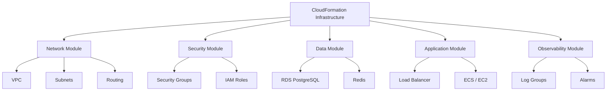
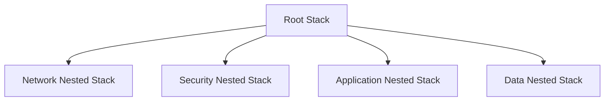
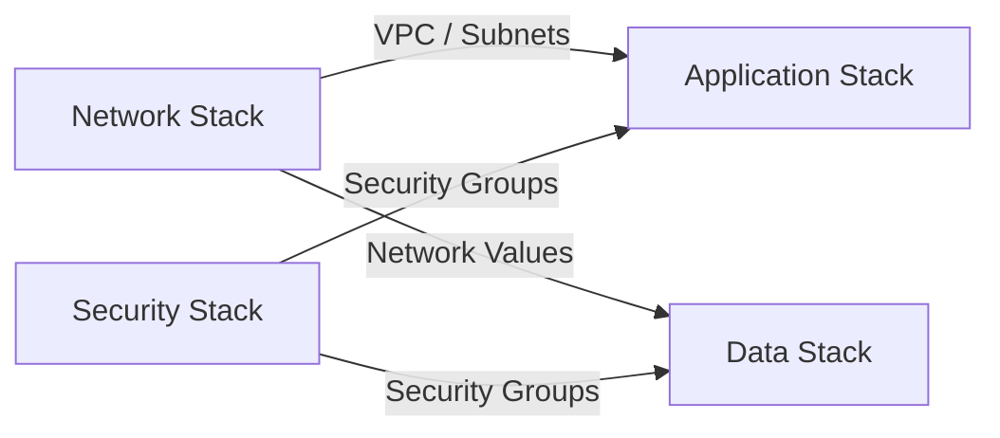
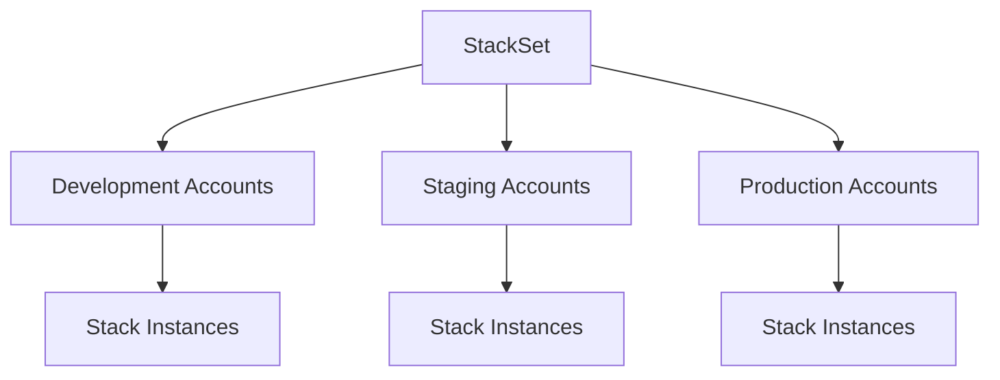
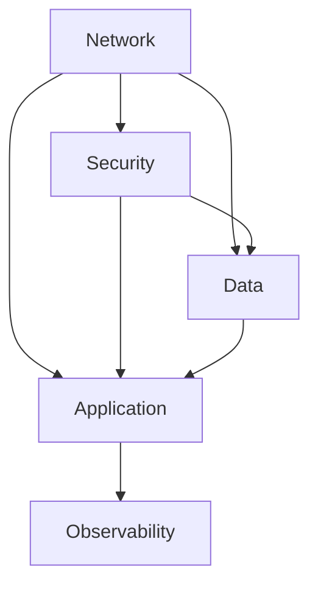
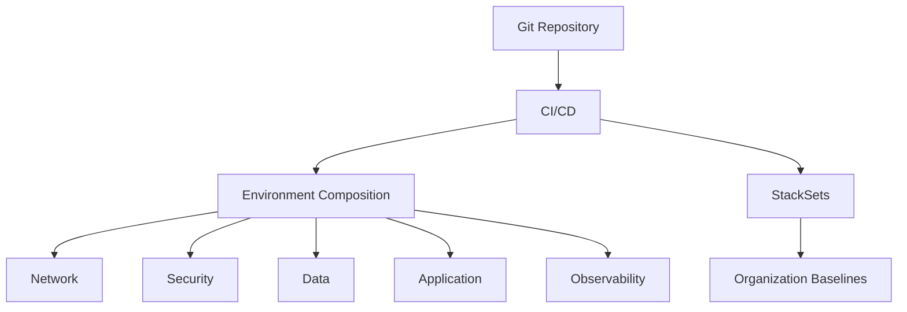

# 06- Modular CloudFormation Architecture

## Overview

Modular CloudFormation architecture is the practice of decomposing infrastructure into well-defined, reusable components instead of maintaining one large template containing every resource.

The objective is not simply to create more files or stacks. The objective is to establish clear boundaries around:

- Responsibility
- Ownership
- Lifecycle
- Dependencies
- Reuse
- Deployment
- Security
- Failure domains

A production CloudFormation architecture may combine several modularity mechanisms:

```text
                    CloudFormation Architecture
                             |
          +------------------+------------------+
          |                  |                  |
          v                  v                  v
    Nested Stacks       Cross-Stack         StackSets
          |              References              |
          v                  v                   v
    Template Module     Independent         Multi-Account
                        Stack Contracts       Deployment
```

A useful mental model is:

```text
Module
  =
Clearly defined infrastructure responsibility
  +
Small interface
  +
Predictable lifecycle
  +
Controlled dependencies
```

---

## Why Modularity Matters

A monolithic template may initially be easy to deploy:

```text
production.yaml

VPC
Subnets
Security Groups
IAM
Load Balancer
ECS
RDS
Redis
CloudWatch
S3
```

As infrastructure grows, the same structure becomes difficult to maintain.

Typical problems include:

- Large pull requests.
- Difficult code reviews.
- Unclear ownership.
- Large deployment blast radius.
- Complex dependency management.
- Difficult troubleshooting.
- Slow infrastructure changes.
- Poor reuse.
- Increased risk of accidental resource replacement.

A modular architecture instead separates infrastructure according to meaningful boundaries:

```text
Network
Security
Application
Data
Observability
```

This allows engineers to reason about infrastructure at the same level of abstraction used to reason about application architecture.

---

## Modularity Dimensions

CloudFormation modularity should be evaluated across several dimensions.

| Dimension | Question |
|---|---|
| Responsibility | What infrastructure does this module own? |
| Lifecycle | Which resources change together? |
| Ownership | Which team manages the module? |
| Dependency | What does the module require from others? |
| Interface | What values does it expose? |
| Reuse | Can the module be deployed in multiple environments? |
| Failure Domain | What happens if the module deployment fails? |
| Security | What permissions are required? |
| Deployment | How independently can it be released? |

A module that has unclear answers to these questions is usually not a strong architectural boundary.

---

## Modular Architecture

A typical backend platform can be structured as:



The architecture separates infrastructure by responsibility rather than by arbitrary resource count.

---

## What Makes a Good Module

A good CloudFormation module should have:

```text
Clear Responsibility
        |
        v
Small Interface
        |
        v
Predictable Inputs
        |
        v
Predictable Outputs
        |
        v
Minimal Dependencies
        |
        v
Independent Reasoning
```

For example:

```text
Network Module

Inputs:
    Environment
    VPC CIDR

Outputs:
    VPC ID
    Private Subnet IDs
    Public Subnet IDs
```

The consumer does not need to know how the VPC or subnets are internally constructed.

---

## Module Boundaries

Infrastructure should be grouped according to meaningful relationships.

A reasonable production structure is:

```text
Network
├── VPC
├── Subnets
├── Route Tables
└── NAT / Internet Gateway

Security
├── Security Groups
├── IAM Roles
└── Policies

Data
├── PostgreSQL
└── Redis

Application
├── Load Balancer
├── ECS / EC2
└── Application Resources

Observability
├── Log Groups
├── Alarms
└── Monitoring
```

This is preferable to splitting every resource into its own module:

```text
VPC Module
Subnet A Module
Subnet B Module
Route Table Module
Security Group Module
...
```

Excessive decomposition creates operational complexity without providing meaningful architectural value.

---

## Choosing the Right Boundary

The most important question is:

> Which resources should change together?

For example, a VPC and its subnets have a strong relationship:

```text
VPC
 |
 +-- Subnets
 |
 +-- Route Tables
 |
 +-- Network Gateways
```

They can reasonably belong to the same network module.

An application deployment, however, may have a completely different lifecycle:

```text
Network
    ↓
changes rarely

Application
    ↓
changes frequently
```

These should usually have separate deployment boundaries.

---

## Module Interfaces

A module should expose a small, stable interface.

For example:

```text
Network Module
-------------------------
Inputs
    Environment
    VPCCidr

Outputs
    VpcId
    PrivateSubnetA
    PrivateSubnetB
```

The application module consumes only what it needs:

```text
Application Module
-------------------------
Consumes
    VpcId
    PrivateSubnetA
    PrivateSubnetB
```

Avoid exposing internal implementation details such as:

```text
RouteTable1
RouteTable2
NatGateway1
NetworkAcl3
InternalResource4
```

unless another module genuinely needs those values.

---

## Input Design

CloudFormation modules should accept inputs that represent meaningful configuration.

Example:

```yaml
Parameters:

  Environment:
    Type: String
    AllowedValues:
      - development
      - staging
      - production

  VpcCidr:
    Type: String
    Default: 10.0.0.0/16
```

Good inputs:

```text
Environment
CIDR
Instance Type
Desired Capacity
Retention Period
Feature Configuration
```

Poor inputs:

```text
Every internal resource ID
Every internal route table
Every internal security group
Every implementation detail
```

A module with excessive parameters is usually too tightly coupled to its consumers.

---

## Output Design

Outputs should represent stable infrastructure contracts.

Example:

```yaml
Outputs:

  VpcId:
    Description: VPC identifier
    Value: !Ref ApplicationVPC

  PrivateSubnetA:
    Description: Private subnet A
    Value: !Ref PrivateSubnetA

  PrivateSubnetB:
    Description: Private subnet B
    Value: !Ref PrivateSubnetB
```

Consumers should depend on these outputs rather than reconstructing infrastructure relationships themselves.

---

## Modularization Mechanisms

CloudFormation provides several mechanisms that can participate in a modular architecture.

| Mechanism | Primary Purpose |
|---|---|
| Single Template | Small infrastructure deployments |
| Nested Stack | Decompose one deployment into child templates |
| Cross-Stack Reference | Connect independently managed stacks |
| StackSet | Deploy standardized stacks across accounts and Regions |
| CloudFormation Module | Reusable resource-level abstraction |
| Custom Resource | Extend CloudFormation with custom provisioning logic |

These mechanisms solve different problems and should not be treated as interchangeable.

---

## Nested Stack Modularity

Nested stacks are useful when modules should share the same lifecycle.



The parent stack coordinates the child stacks.

This is appropriate when:

```text
Modules are separate
       +
Modules should deploy together
       +
Modules share one lifecycle
```

A common repository structure is:

```text
infrastructure/
    root.yaml
    network.yaml
    security.yaml
    application.yaml
    data.yaml
```

---

## Cross-Stack Modularity

Independent stacks are better when modules have independent lifecycles.



The stacks can communicate through CloudFormation exports and imports.

For example:

```yaml
Outputs:

  VpcId:
    Value: !Ref ApplicationVPC
    Export:
      Name: production-network-vpc-id
```

A consumer can use:

```yaml
VpcId: !ImportValue production-network-vpc-id
```

This establishes an explicit infrastructure contract.

---

## Nested vs Cross-Stack Modularity

| Characteristic | Nested Stack | Cross-Stack |
|---|---|---|
| Lifecycle | Coupled | Independent |
| Deployment | Parent-controlled | Separate |
| Ownership | Usually centralized | Can be distributed |
| Reuse | Template composition | Shared infrastructure |
| Dependencies | Parent-child | Export/import |
| Failure isolation | Lower | Higher |
| Best Use | Components deployed together | Independently managed infrastructure |

The decision should be based primarily on lifecycle and ownership rather than file size.

---

## StackSet Modularity

StackSets solve a different modularity problem.

They allow a standardized infrastructure definition to be deployed across multiple AWS accounts and Regions.



For example:

```text
Security Baseline StackSet
Logging Baseline StackSet
Monitoring Baseline StackSet
```

Each StackSet should represent a focused organizational capability rather than the entire application platform.

---

## Modular Repository Structure

A production repository can reflect the architecture directly.

```text
infrastructure/
    root/
        root.yaml

    modules/
        network/
            network.yaml

        security/
            security.yaml

        data/
            data.yaml

        application/
            application.yaml

        observability/
            observability.yaml

    stacksets/
        security-baseline.yaml
        logging-baseline.yaml
```

A more mature repository may separate reusable templates from environment-specific composition:

```text
infrastructure/
    modules/
        network/
        security/
        data/
        application/

    environments/
        development/
        staging/
        production/

    stacksets/
        security/
        logging/
```

The exact structure should follow the team's deployment model.

---

## Environment Composition

Different environments often require different compositions.

For example:

```text
Development
├── Network
├── Security
├── Application
└── Lightweight Data

Production
├── Network
├── Security
├── Application
├── Highly Available Data
└── Observability
```

The modules can remain consistent while environment composition changes.

This is preferable to duplicating entire templates for every environment.

---

## Parameterization vs Duplication

Avoid maintaining:

```text
development.yaml
staging.yaml
production.yaml
```

with three copies of essentially the same infrastructure.

Instead, prefer reusable templates with controlled parameters:

```text
One Module
    |
    +-- Development parameters
    +-- Staging parameters
    +-- Production parameters
```

Example:

```yaml
Parameters:

  Environment:
    Type: String

  InstanceType:
    Type: String

  DesiredCapacity:
    Type: Number
```

Environment-specific configuration can then be supplied through the deployment mechanism.

---

## Avoid Over-Parameterization

Parameterization can also become excessive.

Bad design:

```text
Module
  ├── VpcCidr
  ├── SubnetACidr
  ├── SubnetBCidr
  ├── RouteTableA
  ├── RouteTableB
  ├── NatGatewayA
  ├── NatGatewayB
  ├── SecurityGroupA
  └── ...
```

This makes the module effectively a collection of externally controlled resources rather than an abstraction.

Prefer:

```text
Network Module

Inputs:
    Environment
    VpcCidr

Outputs:
    VpcId
    Subnet IDs
```

The module should own its internal implementation.

---

## Dependency Graph

A modular infrastructure architecture should have a clear dependency direction.



Avoid circular dependencies:

```text
Network
   ↓
Application
   ↓
Network
```

Circular dependencies make independent deployment impossible and can prevent CloudFormation from constructing a valid deployment graph.

---

## Dependency Inversion

Consumers should depend on module interfaces rather than internal implementation.

Bad:

```text
Application
   ↓
Network Route Table ID
   ↓
Network internal implementation
```

Better:

```text
Application
   ↓
Private Subnet IDs
   ↓
Network Module Interface
```

The application only needs the capability it consumes.

This is the infrastructure equivalent of interface-oriented application design.

---

## Application Backend Example

Consider a FastAPI service deployed on ECS.

The infrastructure could be modeled as:

```text
Network Module
    ↓
VPC + Private Subnets

Security Module
    ↓
ALB + ECS + Database Security Groups

Data Module
    ↓
PostgreSQL + Redis

Application Module
    ↓
ALB + ECS Service

Observability Module
    ↓
CloudWatch Logs + Alarms
```

The application module consumes:

```text
VPC ID
Private Subnet IDs
Application Security Group
Database Endpoint
```

It does not need to know how those resources were constructed.

---

## Modular CloudFormation and Microservices

A microservice architecture can benefit from similar infrastructure boundaries.

For example:

```text
Platform Infrastructure
│
├── Network
├── Security
├── Observability
│
├── Orders Service
│   ├── ECS
│   ├── IAM
│   └── Service Resources
│
├── Payments Service
│   ├── ECS
│   ├── IAM
│   └── Service Resources
│
└── Users Service
    ├── ECS
    ├── IAM
    └── Service Resources
```

However, infrastructure modularity should not blindly mirror application boundaries.

A shared VPC may be owned by a platform team while individual services have independent infrastructure stacks.

---

## Shared Infrastructure

Shared infrastructure should generally have a longer lifecycle than application infrastructure.

For example:

```text
Shared Network
      |
      +----------------+
      |                |
      v                v
Orders Service    Payments Service
```

The network should not need to be redeployed whenever Orders changes.

This is a strong argument for independent stack boundaries.

---

## Resource Ownership

Every module should have a clear owner.

Example:

| Module | Owner | Lifecycle |
|---|---|---|
| Network | Platform | Slow |
| Security | Security / Platform | Slow |
| Data | Data / Backend | Medium |
| Application | Backend Team | Fast |
| Observability | Platform | Medium |

This ownership model helps determine whether nested stacks or independent stacks are appropriate.

---

## Failure Domains

Modularity can reduce deployment blast radius.

Monolithic architecture:

```text
Application Change
       |
       v
Large Stack Update
       |
       +--> Network
       +--> Security
       +--> Database
       +--> Application
```

Modular architecture:

```text
Application Change
       |
       v
Application Stack
       |
       +--> Application Resources
```

The network and database stacks remain outside the deployment boundary.

This can significantly improve operational safety.

---

## Change Sets and Modular Architecture

Change Sets should be used to understand the impact of important infrastructure changes.

For a modular architecture:

```text
Network Change
    ↓
Network Change Set

Application Change
    ↓
Application Change Set
```

This makes infrastructure review more focused.

Instead of reviewing hundreds of resources, engineers can review the specific module being modified.

---

## Versioning Modules

Reusable modules should be versioned carefully.

Conceptually:

```text
Network Module
    v1
    v2
    v3
```

A consuming environment should not unexpectedly receive incompatible changes.

For example:

```text
Application
   |
   +--> Network Interface v2
```

A major interface change should be treated like an API contract change.

This is particularly important when modules are shared across multiple teams or accounts.

---

## Backward-Compatible Module Changes

Suppose a module currently exposes:

```text
VpcId
PrivateSubnetA
PrivateSubnetB
```

A safe change may add:

```text
PrivateSubnetC
```

without removing the existing outputs.

An unsafe change may remove:

```text
PrivateSubnetB
```

while consumers still depend on it.

The same principle used in API evolution applies to infrastructure contracts:

```text
Additive Change
    → Usually safer

Breaking Change
    → Requires migration
```

---

## Modular Security Architecture

Security should be designed as part of the module boundary.

For example:

```text
Security Module
├── Application Security Group
├── Database Security Group
├── IAM Roles
└── IAM Policies
```

The application module consumes only the required security identifiers.

This allows security ownership to remain centralized without requiring application teams to manage every security resource.

---

## Least Privilege

Module boundaries should also influence deployment permissions.

For example:

```text
Network Deployment Role
    ↓
Network Resources

Application Deployment Role
    ↓
Application Resources

Security Deployment Role
    ↓
Security Resources
```

This is stronger than giving every engineer unrestricted access to the entire infrastructure.

The deployment model should reflect organizational ownership.

---

## Custom Resources in Modular Architecture

Custom resources can be isolated into dedicated modules.

For example:

```text
Application Module
      |
      v
Custom Resource Module
      |
      v
External Service
```

This prevents custom provisioning logic from being scattered throughout unrelated infrastructure templates.

The custom resource module should have a small interface and clearly documented lifecycle behavior.

---

## Observability Module

Observability is another strong modular boundary.

```text
Observability Module
├── CloudWatch Log Groups
├── Alarms
├── Dashboards
└── Operational Metrics
```

Application stacks can expose:

```text
Application Log Group
Service ARN
Load Balancer ARN
```

The observability module can then build monitoring around those resources.

This avoids embedding every monitoring resource directly into application infrastructure.

---

## Production Architecture

A mature CloudFormation repository can look like:

```text
backend-infrastructure/
│
├── modules/
│   ├── network/
│   ├── security/
│   ├── data/
│   ├── application/
│   └── observability/
│
├── environments/
│   ├── development/
│   ├── staging/
│   └── production/
│
├── stacksets/
│   ├── security-baseline/
│   └── logging-baseline/
│
└── ci/
    └── deployment workflows
```

The resulting architecture is:



---

## CI/CD Architecture

Modularity should be reflected in the deployment pipeline.


A more mature pipeline can avoid redeploying unrelated infrastructure.

For example:

```text
Changed:
application/

Pipeline:
    Validate application
    Create application Change Set
    Deploy application

No change:
network/
data/
security/
```

This reduces deployment time and operational risk.

---

## Testing Modular Infrastructure

Each module should have validation appropriate to its responsibility.

### Network Module

Test:

- CIDR configuration.
- Subnets.
- Route tables.
- Gateway relationships.
- Availability Zone distribution.

### Security Module

Test:

- IAM policies.
- Security group rules.
- Least-privilege behavior.

### Application Module

Test:

- Load balancer.
- ECS / EC2 configuration.
- IAM roles.
- Networking integration.

### Data Module

Test:

- PostgreSQL configuration.
- Backup settings.
- Encryption.
- Network access.

Testing should occur both at module level and at integrated environment level.

---

## Security Considerations

Modularity can improve security when boundaries are well designed.

Use:

- Dedicated deployment roles.
- Least-privilege permissions.
- Controlled module ownership.
- Protected infrastructure repositories.
- Code review.
- Change Sets.
- Secure parameter handling.
- Secrets Manager for secrets.
- CloudTrail for infrastructure auditing.

Avoid allowing application modules to modify shared security or networking infrastructure unless there is a deliberate ownership model.

---

## Scalability Considerations

Modularity improves organizational scalability as infrastructure grows.

A small platform may start with:

```text
Network
Application
Database
```

A larger platform may evolve into:

```text
Network
Security
Identity
Data
Application
Messaging
Observability
Platform
```

The architecture can grow without requiring one massive CloudFormation template.

However, infrastructure should not be decomposed indefinitely.

Every module introduces:

- Deployment overhead.
- Interfaces.
- Dependencies.
- Monitoring requirements.
- Ownership decisions.

The optimal architecture minimizes unnecessary coupling while preserving clear boundaries.

---

## Reliability Considerations

Modularity can reduce the blast radius of changes.

For example:

```text
Application Deployment Failure
          |
          v
Application Stack Rollback

Network
   |
   └── Unchanged

Database
   |
   └── Unchanged
```

However, shared dependencies can still cause failures.

If the application depends on a network contract that is invalid, the application deployment can still fail.

Therefore:

```text
Modularity
    ≠
No Dependencies
```

The objective is controlled dependencies.

---

## Disaster Recovery

Modular infrastructure improves recovery planning by allowing components to be recreated independently.

For example:

```text
Network
    ↓
Security
    ↓
Data
    ↓
Application
```

A recovery process can restore the foundational layers first and application layers afterward.

However, stateful data requires separate recovery mechanisms.

CloudFormation templates provide infrastructure reproducibility but do not replace:

- Database backups.
- Replication.
- Snapshot management.
- Data restoration procedures.
- Recovery testing.

---

## Cost Considerations

Modularity itself does not significantly determine AWS resource cost, but architecture can influence operational cost.

Consider:

- NAT Gateway placement.
- Multi-AZ resources.
- Per-environment observability.
- Shared versus dedicated infrastructure.
- Development environment lifecycle.
- Resource duplication.

For example:

```text
Shared Redis
    ↓
Lower resource duplication

Dedicated Redis per service
    ↓
Higher isolation
Higher cost
```

The correct decision depends on availability, security, isolation, performance, and ownership requirements.

---

## Common Mistakes

### Splitting Every Resource into a Module

This creates excessive deployment and dependency overhead.

**Avoid it:** group resources that share a meaningful lifecycle or responsibility.

### Creating One Giant Module

A module containing network, security, database, application, and monitoring resources defeats the purpose of modularity.

**Avoid it:** establish boundaries around infrastructure responsibilities.

### Excessive Parameters

A module requiring dozens of internal resource IDs is tightly coupled.

**Avoid it:** expose a small input interface.

### Excessive Outputs

Returning every internal resource creates unnecessary contracts.

**Avoid it:** expose only stable values required by consumers.

### Mixing Ownership Boundaries

Allowing one team's deployment role to modify another team's infrastructure creates security and operational problems.

**Avoid it:** align module ownership with deployment permissions.

### Circular Dependencies

Circular module relationships make deployments difficult or impossible.

**Avoid it:** maintain a directional dependency graph.

### Duplicating Templates Per Environment

Maintaining separate copies for development, staging, and production creates configuration drift.

**Avoid it:** reuse modules and vary only legitimate environment configuration.

### Treating Reuse as the Only Goal

Highly reusable modules can become overly generic and difficult to understand.

**Avoid it:** optimize for clear ownership and maintainability first, reuse second.

### Ignoring Lifecycle Differences

Putting frequently changing application resources with rarely changing network resources creates unnecessary deployment coupling.

**Avoid it:** separate resources with materially different lifecycles.

---

## Interview Traps

### What Does Modular CloudFormation Mean?

It means decomposing infrastructure into well-defined components with clear responsibilities, interfaces, dependencies, and lifecycles.

### Is More Modules Always Better?

No.

Too few modules create large blast radius and poor maintainability.

Too many modules create dependency and operational complexity.

### How Do You Decide a Module Boundary?

Consider:

- Responsibility.
- Lifecycle.
- Ownership.
- Dependencies.
- Security boundary.
- Failure domain.
- Reuse requirements.

### Nested Stack or Cross-Stack?

Use nested stacks when components should share a lifecycle.

Use independent stacks and cross-stack references when components should be independently deployed.

### Should Every Microservice Have Its Own CloudFormation Stack?

Not necessarily.

A service-specific stack can be useful, but shared infrastructure such as networking and security often belongs to platform-owned stacks.

### What Is a Good Module Interface?

A small set of stable inputs and outputs that hides internal implementation details.

### What Is the Biggest Modularity Mistake?

Confusing decomposition with modularity.

Creating many files does not create a modular architecture if those components remain tightly coupled.

---

## Best Practices

- Define module boundaries around responsibility and lifecycle.
- Keep module interfaces small.
- Prefer stable inputs and outputs.
- Hide implementation details inside modules.
- Avoid circular dependencies.
- Separate shared infrastructure from application infrastructure.
- Align ownership with deployment permissions.
- Use nested stacks when modules should share a lifecycle.
- Use independent stacks when modules require independent deployment.
- Use StackSets for organization-wide standardized infrastructure.
- Avoid excessive parameterization.
- Avoid excessive outputs.
- Version shared infrastructure interfaces carefully.
- Treat breaking infrastructure interface changes like API breaking changes.
- Validate modules independently and test integrated environments.
- Use Change Sets for important production changes.
- Detect changed modules in CI/CD when practical.
- Keep custom resources isolated and observable.
- Design infrastructure modules around failure domains.
- Prefer clarity and operational safety over maximum reuse.

---

## Key Takeaways

- Modular CloudFormation architecture decomposes infrastructure into components with clear responsibilities, interfaces, ownership, and lifecycles.
- Modularity is about reducing coupling and blast radius, not simply creating more templates.
- Good modules hide implementation details and expose small, stable interfaces.
- Inputs should represent meaningful configuration rather than internal resource details.
- Outputs should represent stable infrastructure contracts required by consumers.
- Nested stacks are appropriate when modules should share a lifecycle.
- Cross-stack architecture is appropriate when modules require independent deployment and ownership.
- StackSets address organization-wide deployment across multiple AWS accounts and Regions.
- Shared infrastructure such as networking and security should generally have longer lifecycles than application infrastructure.
- Module boundaries should align with ownership and security boundaries where practical.
- Excessive decomposition creates dependency and operational overhead.
- Excessive parameterization and output exposure are common signs of tight coupling.
- CloudFormation modularity should be reflected in repository structure, testing, CI/CD, permissions, and operational procedures.
- The goal is a small number of meaningful infrastructure boundaries that are easy to understand, deploy, operate, and evolve.