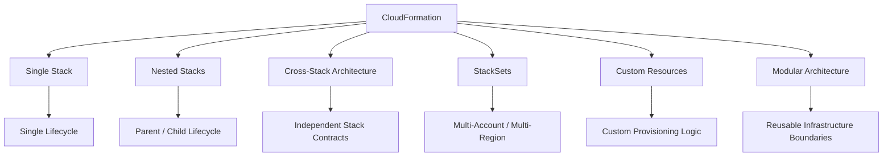

# AWS CloudFormation

## Overview

AWS CloudFormation provides infrastructure as code for defining, provisioning, and managing AWS resources through declarative templates.

This section focuses on **CloudFormation architecture**, progressing from the core architecture model to advanced production patterns such as nested stacks, cross-stack dependencies, StackSets, custom resources, and modular infrastructure design.

The goal is to understand not only how CloudFormation works, but how to structure it safely for production backend platforms, multi-account AWS environments, and CI/CD-driven infrastructure.

## Contents

| File | Topic | Focus |
|---|---|---|
| [01- CloudFormation Architecture.md](./01-%20CloudFormation%20Architecture.md) | CloudFormation Architecture | Core architecture, lifecycle, resource management, dependencies, and deployment model |
| [02- Nested Stack Architecture.md](./02-%20Nested%20Stack%20Architecture.md) | Nested Stack Architecture | Parent-child stacks, reusable templates, lifecycle coupling, and composition |
| [03- Cross Stack Architecture.md](./03-%20Cross%20Stack%20Architecture.md) | Cross Stack Architecture | Independent stacks, exports, imports, dependency contracts, and shared infrastructure |
| [04- StackSets and Multi-Account Architecture.md](./04-%20StackSets%20and%20Multi-Account%20Architecture.md) | StackSets and Multi-Account Architecture | Multi-account, multi-Region deployment, AWS Organizations, OUs, and StackSet operations |
| [05- Custom Resource Architecture.md](./05-%20Custom%20Resource%20Architecture.md) | Custom Resource Architecture | Lambda-backed custom resources, lifecycle events, external integrations, and idempotency |
| [06- Modular CloudFormation Architecture.md](./06-%20Modular%20CloudFormation%20Architecture.md) | Modular CloudFormation Architecture | Infrastructure boundaries, reusable modules, ownership, dependencies, and production structure |

## Architecture Progression

```text
CloudFormation Architecture
          |
          v
   Core Architecture
          |
          v
    Nested Stacks
          |
          v
    Cross-Stack Design
          |
          v
 StackSets / Multi-Account
          |
          v
   Custom Resources
          |
          v
 Modular Architecture
```

## Architecture Patterns

The documents in this section cover the primary ways CloudFormation infrastructure can be organized:



## Recommended Reading Order

Read the documents in numerical order.

1. **CloudFormation Architecture** — Establish the core CloudFormation architecture and lifecycle model.
2. **Nested Stack Architecture** — Understand template decomposition when components share a lifecycle.
3. **Cross Stack Architecture** — Learn how independently managed stacks exchange infrastructure values.
4. **StackSets and Multi-Account Architecture** — Extend CloudFormation across AWS accounts and Regions.
5. **Custom Resource Architecture** — Understand how CloudFormation can integrate with custom logic and external systems.
6. **Modular CloudFormation Architecture** — Combine these concepts into maintainable production infrastructure.

## Production Architecture Perspective

A mature CloudFormation implementation may combine multiple patterns:

```text
AWS Organization
│
├── StackSets
│   ├── Security Baseline
│   └── Logging Baseline
│
└── Application Account
    │
    ├── Network Stack
    │
    ├── Security Stack
    │
    ├── Data Stack
    │
    └── Application Stack
        │
        ├── Nested Infrastructure
        └── Custom Resources
```

The architectural decision should be based on:

- Lifecycle boundaries
- Ownership boundaries
- Deployment frequency
- Resource dependencies
- Security boundaries
- Failure domains
- Reusability
- Multi-account requirements
- Operational complexity

## Key Architectural Principles

- Prefer native CloudFormation resources whenever they satisfy the requirement.
- Use nested stacks when components should share a lifecycle.
- Use independent stacks when infrastructure requires independent ownership or deployment.
- Keep cross-stack interfaces small and stable.
- Use StackSets for standardized multi-account or multi-Region infrastructure.
- Use custom resources only when native CloudFormation capabilities are insufficient.
- Design custom resources for idempotency and complete lifecycle handling.
- Keep infrastructure modules focused on clear responsibilities.
- Avoid excessive template decomposition and unnecessary dependencies.
- Treat infrastructure interfaces like software APIs: stable, explicit, and versioned carefully.
- Use CI/CD and Change Sets for controlled production deployments.
- Minimize deployment blast radius through clear stack and module boundaries.