# README

## Overview

This section documents **Amazon VPC architecture from foundational networking through production-grade AWS network design**.

The focus is not only on creating a VPC, but on understanding how production systems use VPCs to provide:

- Network isolation
- Workload segmentation
- High availability
- Secure Internet access
- Private service communication
- Multi-AZ resilience
- Multi-account connectivity
- Hybrid connectivity
- Encryption
- Centralized routing
- Operational visibility
- Disaster recovery

The documentation progresses from individual VPC components to complete production architectures.

---

## Quick Navigation

| # | Topic | Coverage |
|---|---|---|
| 01 | [VPC Network Architecture](01-%20VPC.md) | VPC fundamentals, CIDR, routing, and isolation. |
| 02 | [Subnets](02-%20Subnets.md) | Public, private, and subnet-level network segmentation. |
| 03 | [Multi-AZ VPC Architecture](03-%20Multi-AZ%20VPC%20Architecture.md) | Availability Zones, redundancy, and failure domains. |
| 04 | [Three-Tier VPC Architecture](04-%20Three-Tier%20VPC%20Architecture.md) | Public, application, and data tiers. |
| 05 | [Private-Only VPC Architecture](05-%20Private-Only%20VPC%20Architecture.md) | Designing VPCs without directly exposed workloads. |
| 06 | [Multi-Account VPC Architecture](06-%20Multi-Account%20VPC%20Architecture.md) | AWS Organizations, account isolation, and shared networking. |
| 07 | [VPC Peering](07-%20VPC%20Peering.md) | Direct private connectivity between VPCs. |
| 08 | [Transit Gateway Architecture](08-%20Transit%20Gateway%20Architecture.md) | Centralized connectivity between VPCs and networks. |
| 09 | [Hybrid Connectivity Architecture](09-%20Hybrid%20Connectivity%20Architecture.md) | AWS-to-corporate and on-premises connectivity. |
| 10 | [Site-to-Site VPN](10-%20Site-to-Site%20VPN.md) | IPsec-based connectivity between AWS and external networks. |
| 11 | [AWS Direct Connect](11-%20AWS%20Direct%20Connect.md) | Dedicated private connectivity to AWS. |
| 12 | [Direct Connect and VPN High Availability](12-%20Direct%20Connect%20and%20VPN%20High%20Availability.md) | Redundant hybrid network paths. |
| 13 | [Direct Connect and VPN Encryption](13-%20Direct%20Connect%20and%20VPN%20Encryption.md) | Encryption models and security considerations. |
| 14 | [Production VPC Design](14-%20Production%20VPC%20Design.md) | End-to-end production network architecture. |

---

## Recommended Learning Path

The files are ordered so that networking concepts build progressively.

```mermaid
flowchart LR
    VPC["VPC Fundamentals"]
    SUBNETS["Subnets"]
    MULTIAZ["Multi-AZ"]
    THREE["Three-Tier"]
    PRIVATE["Private-Only"]
    MULTIACCOUNT["Multi-Account"]
    PEERING["VPC Peering"]
    TGW["Transit Gateway"]
    HYBRID["Hybrid Connectivity"]
    VPN["Site-to-Site VPN"]
    DX["Direct Connect"]
    HA["DX + VPN High Availability"]
    ENC["DX + VPN Encryption"]
    PROD["Production VPC Design"]

    VPC --> SUBNETS
    SUBNETS --> MULTIAZ
    MULTIAZ --> THREE
    THREE --> PRIVATE
    PRIVATE --> MULTIACCOUNT
    MULTIACCOUNT --> PEERING
    PEERING --> TGW
    TGW --> HYBRID
    HYBRID --> VPN
    HYBRID --> DX
    VPN --> HA
    DX --> HA
    HA --> ENC
    ENC --> PROD
```



The recommended progression is:

1. Understand the VPC networking model.
2. Understand subnet segmentation and routing.
3. Introduce Availability Zones and failure domains.
4. Build three-tier architectures.
5. Understand private-only workload designs.
6. Move from single-account to multi-account networking.
7. Learn VPC Peering and its scaling limitations.
8. Learn Transit Gateway for centralized connectivity.
9. Understand hybrid AWS and corporate networking.
10. Learn Site-to-Site VPN.
11. Learn Direct Connect.
12. Design redundant Direct Connect and VPN paths.
13. Understand encryption across hybrid connectivity.
14. Apply everything to production VPC design.

---

## Architecture Layers

The documentation can be understood as several layers.

### VPC Foundation

```text
VPC
 |
 +-- CIDR
 |
 +-- Subnets
 |
 +-- Route Tables
 |
 +-- Internet Gateway
 |
 +-- NAT Gateway
 |
 +-- Security Groups
 |
 +-- Network ACLs
```

These components establish the basic network boundary.

### Application Architecture

```text
Internet
   |
   v
Public Tier
   |
   v
Private Application Tier
   |
   v
Private Data Tier
```

This introduces workload isolation.

### Availability Architecture

```text
Region
 |
 +-- AZ-A
 |
 +-- AZ-B
 |
 +-- AZ-C
```

This introduces redundancy and failure isolation.

### Organizational Architecture

```text
AWS Organization
 |
 +-- Network Account
 +-- Security Account
 +-- Production Account
 +-- Staging Account
 +-- Development Account
```

This introduces account-level isolation and centralized governance.

### Connectivity Architecture

```text
VPC
 |
 +-- VPC Peering
 |
 +-- Transit Gateway
 |
 +-- Site-to-Site VPN
 |
 +-- Direct Connect
```

This introduces communication between independent networks.

### Production Architecture

```text
                    Internet
                       |
                CloudFront / WAF
                       |
                       v
                  Load Balancer
                       |
              Private Application
                 /     |      \
                /      |       \
           PostgreSQL Redis    Kafka
                |
          Private AWS Services
                |
          VPC Endpoints

Corporate Network
       |
Direct Connect / VPN
       |
Transit Gateway
       |
Production VPC
```

---

## Key AWS Networking Components

| Component | Primary responsibility |
|---|---|
| VPC | Logical network boundary |
| Subnet | Network segmentation inside a VPC |
| Route Table | Determines packet routing |
| Internet Gateway | Internet connectivity for VPC resources |
| NAT Gateway | Outbound Internet access for private resources |
| Security Group | Stateful resource-level traffic control |
| Network ACL | Stateless subnet-level traffic control |
| VPC Endpoint | Private connectivity to supported AWS services |
| VPC Peering | Direct private connectivity between VPCs |
| Transit Gateway | Centralized network connectivity |
| Site-to-Site VPN | Encrypted IPsec connectivity |
| Direct Connect | Dedicated connectivity to AWS |
| Direct Connect Gateway | Connectivity between Direct Connect and multiple VPC-related resources |
| Network Firewall | Managed network traffic inspection |
| Route 53 | DNS and traffic routing |
| VPC Flow Logs | Network traffic metadata visibility |

---

## Core Architecture Principles

### Design for Failure

Production networking should assume that components can fail.

Questions to ask:

- What happens if an Availability Zone fails?
- What happens if a NAT Gateway fails?
- What happens if a VPN tunnel fails?
- What happens if Direct Connect fails?
- What happens if a Transit Gateway attachment fails?
- What happens if a database becomes unavailable?

A resilient architecture should have an explicit answer to each question.

### Minimize Public Exposure

Prefer:

```text
Internet
   |
   v
Controlled Ingress
   |
   v
Private Application
```

over:

```text
Internet
   |
   v
Public Application Server
```

Applications, workers, databases, caches, and internal services should generally remain private unless public exposure is an explicit requirement.

### Design CIDRs Before Connectivity

CIDR planning should happen before connecting networks.

Avoid:

```text
VPC A: 10.0.0.0/16
VPC B: 10.0.0.0/16
Corporate: 10.0.0.0/8
```

Overlapping ranges can make future connectivity difficult or impossible without network renumbering or translation.

### Treat Network Infrastructure as Code

Production networking should be reproducible through infrastructure-as-code tooling.

Common choices include:

- Terraform
- AWS CloudFormation
- AWS CDK

Network changes should go through version control, review, validation, planning, and controlled deployment.

### Separate Network and Application Responsibilities

The VPC provides network boundaries and connectivity.

The application still needs to handle:

- Authentication
- Authorization
- TLS
- Service-level security
- Input validation
- Application logging
- Rate limiting
- Failure handling

A private network does not automatically make an application secure.

---

## Backend Engineering Context

A typical Python backend platform might use:

```text
                    Internet
                       |
                 Route 53 / CDN
                       |
                      WAF
                       |
                      ALB
                       |
          +------------+------------+
          |            |            |
        AZ-A         AZ-B         AZ-C
          |            |            |
       Django       Django       Django
       FastAPI      FastAPI      FastAPI
          |            |            |
          +------------+------------+
                       |
              +--------+--------+
              |        |        |
          PostgreSQL  Redis    Kafka
```

Supporting services may include:

```text
Celery
    |
    v
Redis / Kafka
```

and:

```text
AWS APIs
    |
    v
VPC Endpoints
```

while external APIs may use:

```text
Private Application
       |
       v
NAT Gateway
       |
       v
External API
```

This makes VPC architecture directly relevant to Django, FastAPI, microservices, Celery, Redis, Kafka, PostgreSQL, Docker, and Kubernetes deployments.

---

## Production Architecture Checklist

Before considering a VPC design production-ready, validate:

### Network

- [ ] CIDR capacity is sufficient.
- [ ] CIDRs do not overlap with required connected networks.
- [ ] Subnets span appropriate Availability Zones.
- [ ] Route tables are intentionally designed.
- [ ] Public and private routing boundaries are explicit.
- [ ] Subnet IP utilization is monitored.

### Security

- [ ] Application workloads are private where practical.
- [ ] Databases are not publicly exposed.
- [ ] Security Groups follow least privilege.
- [ ] Administrative access is controlled.
- [ ] Network ACLs are intentionally configured.
- [ ] Encryption requirements are documented.
- [ ] VPC Flow Logs are configured where required.

### Availability

- [ ] Application workloads span multiple AZs.
- [ ] Load balancers span multiple AZs.
- [ ] Critical egress paths have appropriate redundancy.
- [ ] Database HA matches application requirements.
- [ ] Hybrid connectivity has redundancy where required.
- [ ] Failure scenarios have been tested.

### Connectivity

- [ ] VPC Peering is used only where appropriate.
- [ ] Transit Gateway routing is explicitly controlled.
- [ ] VPN tunnels are monitored.
- [ ] Direct Connect redundancy is considered.
- [ ] Hybrid CIDRs do not overlap.
- [ ] Cross-account routes are documented.

### Operations

- [ ] Infrastructure is managed through IaC.
- [ ] Network changes are reviewed.
- [ ] Flow Logs and relevant service metrics are available.
- [ ] Cost drivers are monitored.
- [ ] Disaster recovery procedures are documented.
- [ ] Recovery procedures are tested.

---

## Common Production Pitfalls

| Pitfall | Why it is a problem |
|---|---|
| Overlapping CIDRs | Prevents or complicates network connectivity |
| Single-AZ application | Creates an unnecessary failure domain |
| Single NAT dependency | Can introduce AZ dependency |
| Public database | Significantly increases attack surface |
| Broad Security Groups | Weakens workload isolation |
| No subnet capacity planning | Scaling can fail due to IP exhaustion |
| Excessive cross-AZ traffic | Can increase latency and cost |
| Uncontrolled routing | Makes troubleshooting and security difficult |
| No hybrid redundancy | A single network path can become a production dependency |
| Manual VPC changes | Makes recovery and auditing difficult |
| Treating private networking as encryption | Private routing does not automatically provide application-layer encryption |

---

## Interview Focus

The most important architectural questions around VPC design are not simply:

> "What is a VPC?"

Senior-level discussions should cover reasoning such as:

- Why are application servers placed in private subnets?
- How does a private subnet access the Internet?
- Why use one NAT Gateway per AZ?
- What happens when an AZ fails?
- Why are overlapping CIDRs problematic?
- When should VPC Peering be replaced with Transit Gateway?
- When should VPN be used instead of Direct Connect?
- How would you provide hybrid connectivity redundancy?
- How would you secure a PostgreSQL database?
- How would you monitor rejected network traffic?
- How would you design networking for EKS?
- How would you design a multi-account AWS network?
- How would you reduce NAT Gateway costs?
- How would you recover the network after a regional failure?

The objective is to explain **trade-offs and failure modes**, not merely list AWS services.

---

## Documentation Scope

This directory focuses specifically on **VPC architecture and network connectivity**.

It does not attempt to document every AWS networking service exhaustively. The emphasis is on the networking decisions that backend engineers and system designers encounter when deploying production applications.

The expected outcome is the ability to reason about an architecture such as:

```text
Users
  |
  v
Internet
  |
CloudFront / WAF
  |
ALB
  |
Private Application Subnets
  |
  +--> PostgreSQL
  +--> Redis
  +--> Kafka
  +--> AWS Services
  |
Transit Gateway
  |
  +--> Other VPCs
  +--> Shared Services
  +--> Corporate Network
          |
          +--> Direct Connect
          +--> Site-to-Site VPN
```

---

## Key Takeaways

- The VPC documentation progresses from **core network primitives to multi-AZ, multi-account, hybrid, and production architectures**.
- Production VPC design is primarily about **security boundaries, routing, failure domains, scalability, and operational control**.
- CIDR planning, private workload placement, least-privilege Security Groups, and multi-AZ design form the foundation of a resilient backend network.
- VPC Peering, Transit Gateway, Site-to-Site VPN, and Direct Connect solve different connectivity problems and should be selected based on topology, scale, reliability, and operational requirements.
- The final production design should be reproducible with IaC, observable, cost-aware, secure, and capable of recovering from expected infrastructure failures.