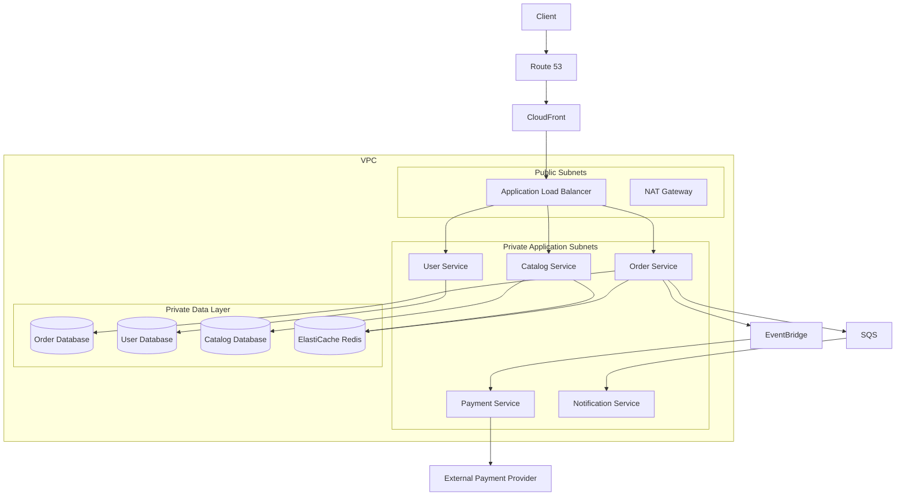
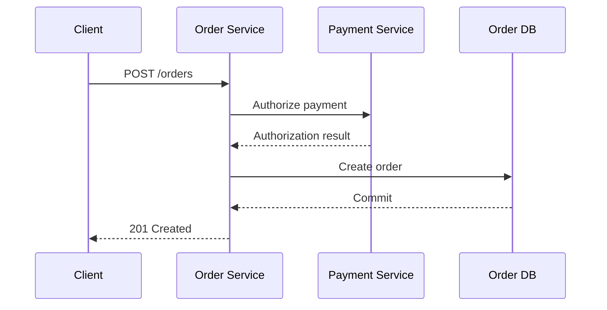
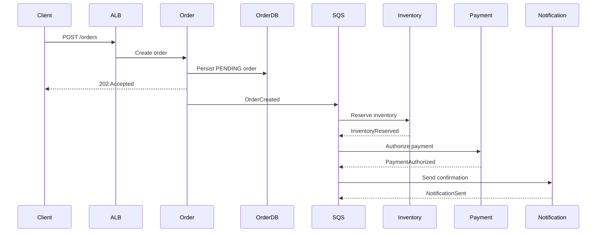

# 01- Microservices Architecture on AWS

## Overview

Microservices architecture decomposes an application into independently deployable services, where each service owns a well-defined business capability and exposes explicit contracts to other services.

On AWS, microservices can be implemented using multiple compute, networking, messaging, data, and observability services. The architectural challenge is not simply splitting a monolith into smaller applications. The challenge is operating a distributed system where failures, latency, consistency, deployment, security, and data ownership become first-class concerns.

A production AWS microservices architecture typically combines:

- Compute such as Amazon ECS, Amazon EKS, AWS Lambda, or EC2
- Application load balancing and API routing
- Amazon VPC networking
- REST or gRPC for synchronous communication
- Amazon SQS, SNS, EventBridge, or Kafka for asynchronous communication
- Independent data stores or schemas
- Redis for caching where appropriate
- IAM-based service permissions
- Centralized logging, metrics, tracing, and alerting
- CI/CD pipelines for independent service deployment

The core architectural principle is:

> A microservice should own a business capability, its operational lifecycle, and ideally its data.

---

## Why Microservices Exist

A monolith is not inherently a bad architecture. For many systems, a well-structured modular monolith is simpler and more reliable than a distributed microservices platform.

Microservices become useful when organizational, scaling, deployment, or domain boundaries justify the additional distributed-system complexity.

Typical drivers include:

- Independent deployment requirements
- Different scaling characteristics between components
- Clear business-domain boundaries
- Independent team ownership
- Fault isolation
- Technology independence
- Large codebase organization
- Independent release velocity

For example, an e-commerce platform might contain:

```text
                    E-Commerce Platform
                           |
        +------------------+------------------+
        |                  |                  |
        v                  v                  v
   User Service       Order Service      Catalog Service
        |                  |                  |
        v                  v                  v
     User DB           Order DB          Catalog DB
                           |
                           v
                    Payment Service
                           |
                           v
                    Payment Provider
```

Each service can scale and deploy independently.

However, every service boundary also introduces a network boundary, which means the architecture must handle distributed-system concerns.

---

## When Microservices Are Appropriate

Microservices are a strong fit when several of the following are true:

| Requirement | Why Microservices Help |
|---|---|
| Independent deployment | Services can be released separately |
| Uneven scaling | High-load services can scale independently |
| Strong domain boundaries | Business capabilities map naturally to services |
| Multiple teams | Teams can own services independently |
| Fault isolation | Failures can be contained |
| Different technology requirements | Services can use different runtimes |
| Large organizational scale | Ownership can be distributed across teams |

Microservices are less attractive when:

- The application is small.
- The team is small.
- Domain boundaries are unclear.
- Deployment independence is unnecessary.
- Operational maturity is low.
- Distributed consistency is a dominant requirement.
- The primary motivation is simply "modern architecture."

A modular monolith is often the better starting point when service boundaries are not yet understood.

---

## Core Microservices Principles

### Single Business Responsibility

A service should represent a meaningful business capability rather than an arbitrary technical layer.

Prefer:

```text
Order Service
Payment Service
Inventory Service
Notification Service
```

over:

```text
Database Service
Validation Service
Utility Service
Generic Service
```

The former represents domain ownership. The latter often creates distributed coupling around technical abstractions.

---

### Independent Deployability

A service should ideally be deployable without requiring simultaneous deployment of unrelated services.

This requires:

- Backward-compatible APIs
- Versioned contracts where necessary
- Independent CI/CD pipelines
- Database migration strategies
- Feature flags where appropriate
- Contract testing

A deployment should not require:

```text
Deploy Service A
    |
    v
Deploy Service B
    |
    v
Deploy Service C
    |
    v
Deploy Service D
```

unless the change genuinely requires coordinated evolution.

---

### Explicit Contracts

Every service boundary should have an explicit contract.

Synchronous contracts may use:

- REST
- gRPC

Asynchronous contracts may use:

- Event schemas
- Message schemas
- Command schemas

Example REST contract:

```http
POST /orders
Content-Type: application/json

{
  "customer_id": "cus_123",
  "items": [
    {
      "product_id": "prod_456",
      "quantity": 2
    }
  ]
}
```

The contract should specify:

- Request format
- Response format
- Error semantics
- Authentication requirements
- Idempotency behavior
- Timeout expectations
- Compatibility rules

---

## AWS Reference Architecture

A typical production architecture can look like:



The exact implementation varies by workload, but the architectural responsibilities remain similar.

---

## Service Boundaries

Service boundaries are one of the most important microservices design decisions.

A good boundary usually follows a business capability or bounded context.

For an e-commerce system:

```text
Customer
    |
    +--> Identity
    |
    +--> Orders
    |
    +--> Inventory
    |
    +--> Payments
    |
    +--> Shipping
    |
    +--> Notifications
```

Each service should minimize knowledge about the internal implementation of other services.

### Good Boundary

```text
Order Service
    |
    | Order API
    v
Payment Service
```

### Poor Boundary

```text
Order Service
    |
    +--> Payment database tables
    +--> Payment internal classes
    +--> Payment repository
```

Direct access to another service's database breaks ownership boundaries and creates hidden coupling.

---

## Database Per Service

A common microservices principle is:

> Each service owns its data.

This does not necessarily mean every service must use a completely different database technology.

For example:

```text
Order Service
    |
    v
PostgreSQL
    |
    +--> orders
    +--> order_items

Payment Service
    |
    v
PostgreSQL
    |
    +--> payments
    +--> transactions
```

The databases could physically reside in the same PostgreSQL infrastructure while remaining logically isolated, depending on operational requirements.

The important property is ownership.

### Why Shared Databases Are Dangerous

Consider:

```text
Order Service ----+
                  |
Payment Service --+--> Shared Database
                  |
Inventory Service-+
```

Now a schema change for one service can break multiple services.

This creates:

- Deployment coupling
- Schema coupling
- Ownership ambiguity
- Increased blast radius
- Difficult independent scaling
- Difficult migration management

A shared database can be acceptable during migration from a monolith, but it should be treated as an explicit architectural compromise.

---

## Synchronous Communication

Synchronous communication means the caller waits for a response.

Typical technologies:

- REST over HTTP
- gRPC
- Internal HTTP APIs
- ALB-routed service endpoints

Example:



Synchronous communication is appropriate when the result is required before continuing.

### Advantages

- Simple request/response model
- Immediate feedback
- Easy to understand initially
- Suitable for queries and short operations

### Limitations

Every synchronous dependency adds latency and another failure point.

```text
Request
  |
  v
Service A
  |
  v
Service B
  |
  v
Service C
  |
  v
Database
```

The request can fail because any dependency is slow or unavailable.

---

## REST vs gRPC

| Characteristic | REST | gRPC |
|---|---|---|
| Protocol | HTTP | HTTP/2 |
| Payload | Commonly JSON | Protocol Buffers |
| Human readability | High | Low |
| Browser compatibility | Excellent | More limited |
| Internal service communication | Good | Excellent |
| Streaming | Possible | Strong support |
| Contract definition | OpenAPI commonly used | `.proto` files |
| Performance | Good | Generally efficient |
| Best fit | Public APIs and general integrations | Internal service-to-service communication |

A practical architecture often uses REST at external boundaries and gRPC internally where its capabilities provide meaningful value.

---

## Asynchronous Communication

Asynchronous communication allows the producer to continue without waiting for the consumer to complete processing.

AWS services commonly used include:

- Amazon SQS
- Amazon SNS
- Amazon EventBridge
- Amazon MSK
- Amazon Kinesis

Example:

```text
Order Service
     |
     | OrderCreated
     v
   SQS
     |
     +---------> Notification Service
     |
     +---------> Analytics Service
     |
     +---------> Inventory Service
```

This provides temporal decoupling.

If Notification Service is temporarily unavailable, the message can remain queued instead of causing the order request to fail.

---

## Queue-Based Load Leveling

Queues can absorb traffic spikes.

Without a queue:

```text
Traffic Spike
     |
     v
Application
     |
     v
Database
     |
     X
Overload
```

With a queue:

```text
Traffic Spike
     |
     v
Producer
     |
     v
SQS
     |
     v
Controlled Consumers
     |
     v
Database
```

Consumers can process work at a sustainable rate.

Important metrics include:

- Queue depth
- Message age
- Consumer throughput
- Processing latency
- Failed messages
- DLQ depth

---

## Event-Driven Microservices

Events communicate facts that have already occurred.

Example:

```text
Order Service
     |
     | OrderCreated
     v
EventBridge
     |
     +----------+-----------+
     |          |           |
     v          v           v
Inventory   Notification  Analytics
```

The producer does not need to know every consumer.

This reduces coupling but introduces:

- Eventual consistency
- Duplicate events
- Event ordering concerns
- Schema evolution
- Replay requirements
- More difficult debugging

Consumers should therefore be designed to be idempotent.

---

## Service Discovery and Routing

Services need a reliable way to locate one another.

Possible AWS approaches include:

- Application Load Balancers
- Network Load Balancers
- Amazon ECS Service Connect
- AWS Cloud Map
- API Gateway
- Kubernetes Services
- Internal DNS

The choice depends on the compute platform and communication model.

For example:

```text
Order Service
      |
      | HTTP/gRPC
      v
internal-payment-service
      |
      v
Payment Service
```

Service discovery should abstract infrastructure locations from application code.

Avoid hard-coding:

```python
PAYMENT_SERVICE_URL = "10.0.4.27:8080"
```

Infrastructure addresses can change during scaling, deployments, or failover.

---

## AWS Compute Choices

AWS provides multiple ways to run microservices.

| Platform | Best Fit | Operational Burden | Scaling |
|---|---|---:|---|
| ECS Fargate | Containerized services without managing servers | Low | High |
| ECS on EC2 | Container workloads requiring infrastructure control | Medium | High |
| EKS | Kubernetes-based platforms | High | High |
| Lambda | Event-driven or short-lived workloads | Low | Automatic |
| EC2 | Specialized infrastructure requirements | Higher | Application-managed |

### ECS Fargate

ECS with Fargate is often a strong default for teams that want:

- Docker-based deployments
- AWS-native orchestration
- Reduced infrastructure management
- Service-level scaling
- Load balancer integration

Typical architecture:

```text
ALB
 |
 +--> ECS Service: Orders
 |
 +--> ECS Service: Payments
 |
 +--> ECS Service: Catalog
```

### EKS

EKS is appropriate when Kubernetes capabilities are a genuine requirement.

Use it when the organization benefits from:

- Kubernetes ecosystem
- Existing Kubernetes expertise
- Advanced scheduling
- Kubernetes-native tooling
- Multi-cloud portability requirements

Do not introduce Kubernetes merely because the system contains multiple services.

---

## API Gateway vs Application Load Balancer

Both can participate in microservices architectures, but they solve different problems.

| Capability | API Gateway | ALB |
|---|---|---|
| Public API entry point | Strong | Strong |
| REST APIs | Strong | Strong |
| Authentication integration | Strong | Good |
| Request transformation | Strong | Limited |
| Lambda integration | Excellent | Supported |
| Container routing | Possible | Excellent |
| Layer 7 routing | Yes | Yes |
| Private internal service routing | Possible | Strong |
| WebSockets | Supported | Supported |
| Simplicity for ECS services | Moderate | Strong |

A common pattern is:

```text
Internet
   |
   v
API Gateway / CloudFront
   |
   v
ALB
   |
   +--> ECS Service A
   +--> ECS Service B
   +--> ECS Service C
```

The architecture should avoid unnecessary layers when they provide no meaningful capability.

---

## Networking Architecture

Microservices should generally run inside a VPC with clear network segmentation.

A typical structure is:

```text
VPC
|
+-- Public Subnets
|     |
|     +-- ALB
|     +-- NAT Gateway
|
+-- Private Application Subnets
|     |
|     +-- ECS Tasks
|     +-- EKS Pods
|     +-- Internal Load Balancers
|
+-- Private Data Subnets
      |
      +-- RDS
      +-- ElastiCache
```

The application tier should generally not require direct public internet exposure.

---

## Security Groups

Security groups should permit only required traffic.

Example:

```text
ALB Security Group
    |
    | TCP 443
    v
Application Security Group
    |
    | TCP 5432
    v
Database Security Group
```

Avoid:

```text
0.0.0.0/0 -> Database Port
```

Instead, permit traffic from the specific application security group.

This creates an infrastructure-level trust boundary.

---

## IAM and Service-to-Service Authorization

Each service should operate with its own AWS identity and minimum permissions.

For example:

```text
Order Task Role
    |
    +--> sqs:SendMessage
    +--> events:PutEvents
    +--> secretsmanager:GetSecretValue

Payment Task Role
    |
    +--> secretsmanager:GetSecretValue
```

Avoid granting:

```text
AdministratorAccess
```

to application workloads.

IAM should follow least privilege.

---

## Secrets Management

Secrets should not be hard-coded in:

- Python source code
- Dockerfiles
- Git repositories
- CI/CD configuration files
- Kubernetes manifests

Use appropriate AWS mechanisms such as:

- AWS Secrets Manager
- AWS Systems Manager Parameter Store
- IAM roles for AWS service authentication

Example application configuration:

```text
DATABASE_HOST
DATABASE_NAME
DATABASE_USER
DATABASE_PASSWORD
```

The application receives these values through its runtime configuration rather than storing credentials in source control.

---

## Resilience at Service Boundaries

Every synchronous dependency should have:

- Connection timeout
- Read timeout
- Appropriate retry policy
- Exponential backoff
- Jitter
- Circuit breaking where appropriate
- Maximum retry attempts
- Failure handling

For example:

```python
import random
import time


def retry_with_backoff(operation, max_attempts: int = 4) -> object:
    for attempt in range(max_attempts):
        try:
            return operation()
        except TimeoutError:
            if attempt == max_attempts - 1:
                raise

            delay = min(2**attempt, 10)
            jitter = random.uniform(0, 0.5)
            time.sleep(delay + jitter)

    raise RuntimeError("Operation failed")
```

Retries should only be used for operations where retrying is safe.

A retry on a non-idempotent operation can create duplicate business actions.

---

## Idempotency

Distributed systems frequently deliver requests or messages more than once.

For example:

```text
Client
  |
  | POST /payments
  v
Payment Service
  |
  | Payment succeeds
  v
Network timeout
  |
  v
Client retries
  |
  v
Payment Service
```

Without idempotency, the payment could potentially be processed twice.

An idempotency key can provide protection:

```http
POST /payments
Idempotency-Key: 7d9d4b6f-9e2e-4a7a-bd93-123456789abc
```

The service stores the result associated with the key and returns the previous result when the same request is received again.

Idempotency is especially important for:

- Payments
- Order creation
- Resource creation
- Message processing
- Event consumers
- Retryable commands

---

## Distributed Transactions

A traditional database transaction:

```text
BEGIN
  update orders
  update payments
  update inventory
COMMIT
```

does not work cleanly when each domain has its own database.

Instead, a distributed workflow may use a Saga:

```text
Create Order
    |
    v
Reserve Inventory
    |
    v
Authorize Payment
    |
    v
Confirm Order
```

If payment fails:

```text
Authorize Payment
       |
       X
       |
       v
Release Inventory
       |
       v
Cancel Order
```

The compensating actions must be designed as part of the business workflow.

---

## Database Ownership

A service should own its database operations.

Example:

```text
Order Service
     |
     v
Order Database

Payment Service
     |
     v
Payment Database

Inventory Service
     |
     v
Inventory Database
```

Other services should communicate through APIs or events.

Avoid:

```text
Inventory Service
       |
       v
Order Database
```

because this bypasses the Order Service's business rules.

---

## Caching

Redis or Amazon ElastiCache can reduce repeated database access.

Typical flow:

```text
Request
   |
   v
Service
   |
   v
Redis
   |
   +---- Hit ----> Response
   |
   +---- Miss
          |
          v
       Database
          |
          v
       Redis
          |
          v
       Response
```

Cache carefully around:

- TTL
- invalidation
- stale data
- cache stampedes
- memory limits
- key design

Caching should not become a hidden source of correctness problems.

---

## Observability

Distributed systems require stronger observability than monoliths.

At minimum, collect:

### Logs

Use structured logs.

```json
{
  "timestamp": "2026-08-24T14:30:00Z",
  "service": "order-service",
  "request_id": "req_123",
  "trace_id": "trace_456",
  "level": "ERROR",
  "event": "payment_timeout",
  "latency_ms": 3200
}
```

### Metrics

Track:

- Request rate
- Error rate
- Latency
- CPU
- Memory
- Container restarts
- Queue depth
- Database connections
- Cache hit rate
- Dependency failures

### Distributed Tracing

A request may cross:

```text
API Gateway
    |
    v
Order Service
    |
    v
Payment Service
    |
    v
Database
```

A distributed trace should allow engineers to follow that request across the entire path.

AWS-native observability can use CloudWatch and tracing capabilities, while OpenTelemetry can provide portable instrumentation.

---

## Health Checks

Services should expose health information appropriate for their runtime.

A basic endpoint might be:

```http
GET /health
```

But production systems often distinguish:

```http
GET /health/live
GET /health/ready
```

### Liveness

Answers:

> Is the process functioning?

### Readiness

Answers:

> Is the service capable of receiving traffic?

A service might be alive but not ready because:

- Database connection is unavailable
- Required configuration is missing
- Critical dependency is unavailable
- Startup initialization is incomplete

Incorrect health checks can cause unhealthy instances to receive traffic or healthy instances to be removed unnecessarily.

---

## Deployment Architecture

Each service should ideally have its own CI/CD lifecycle.


A typical pipeline may perform:

1. Static analysis
2. Unit tests
3. Integration tests
4. Security scanning
5. Container build
6. Image push
7. Deployment
8. Health verification
9. Progressive rollout

GitHub Actions can be used to automate this lifecycle.

---

## Deployment Strategies

### Rolling Deployment

Gradually replace old instances with new ones.

```text
Version A: A A A A
Version B: A A B B
Version C: A B B B
Version D: B B B B
```

Simple and cost-effective, but an incompatible release can affect existing traffic.

### Blue-Green Deployment

Maintain two environments:

```text
Blue  -> Current
Green -> New
```

Traffic switches after validation.

Advantages:

- Simple rollback
- Strong isolation
- Easy pre-production validation

Limitation:

- Higher infrastructure cost during deployment

### Canary Deployment

Send a small percentage of traffic to the new version.

```text
Traffic
  |
  +--> 95% Version A
  |
  +--> 5% Version B
```

If metrics remain healthy, increase Version B traffic.

This is useful for reducing deployment blast radius.

---

## Backward Compatibility

A microservice ecosystem may contain multiple versions simultaneously.

For example:

```text
Order Service v2
       |
       v
Payment Service v1
```

Therefore, API changes should generally be backward compatible.

Prefer additive changes:

```json
{
  "id": "ord_123",
  "status": "confirmed",
  "created_at": "2026-08-24T14:30:00Z"
}
```

over immediately removing or renaming fields that existing consumers depend on.

Database migrations should follow a compatible sequence:

```text
Expand
  |
  v
Deploy application
  |
  v
Migrate data
  |
  v
Switch usage
  |
  v
Contract
```

Avoid destructive schema changes in the same deployment that introduces the new application behavior.

---

## Failure Isolation

A microservice architecture should prevent one unhealthy service from exhausting another service's resources.

Useful patterns include:

- Timeouts
- Circuit breakers
- Bulkheads
- Bounded connection pools
- Queue buffering
- Rate limiting
- Concurrency limits
- Dead letter queues

For example:

```text
Order Service
     |
     +---- Payment
     |
     +---- Inventory
     |
     +---- Notification
```

A Notification failure should not prevent order creation if notification is not part of the critical transaction.

Instead:

```text
Order Created
     |
     +----> Commit Order
     |
     +----> Publish Event
                 |
                 v
            Notification
```

This is a key distinction between critical and non-critical dependencies.

---

## Eventual Consistency

Microservices often sacrifice immediate global consistency in favor of autonomy and availability.

Example:

```text
Order DB
   |
   | OrderCreated
   v
Event Bus
   |
   v
Inventory DB
```

There may be a short period where:

```text
Order = CREATED
Inventory = not yet RESERVED
```

This is not necessarily incorrect.

The system must define acceptable consistency boundaries and expose appropriate states to clients.

For example:

```text
PENDING
CONFIRMED
FAILED
CANCELLED
```

is often better than pretending every distributed operation is immediately atomic.

---

## Security Architecture

Security should be applied at multiple layers.

```text
Client
  |
  v
CloudFront / API Gateway / ALB
  |
  v
Service Authentication
  |
  v
Service Authorization
  |
  v
Application
  |
  v
Database
```

Important controls include:

- TLS everywhere appropriate
- IAM least privilege
- Security groups
- Private subnets
- Secrets Manager
- KMS encryption
- Encryption at rest
- Encryption in transit
- API authentication
- Authorization
- Network segmentation
- Audit logging
- Dependency and container scanning

Do not assume that a private subnet alone provides application-level authorization.

---

## Cost Considerations

Microservices can increase infrastructure cost because each service may require:

- Compute capacity
- Load balancing
- Logging
- Metrics
- Tracing
- Database resources
- Network traffic
- NAT gateways
- CI/CD resources

There can also be significant inter-service network traffic.

A design such as:

```text
A -> B -> C -> D -> E
```

can generate more latency and network cost than:

```text
Monolith -> Database
```

Architecture reviews should therefore consider both operational and financial cost.

---

## Performance Considerations

A microservices system adds network boundaries.

For example:

```text
Monolith:

API -> Business Logic -> Database


Microservices:

API
 |
 v
Order
 |
 v
Payment
 |
 v
Inventory
 |
 v
Database
```

The second architecture may have:

- More network hops
- Serialization/deserialization
- TLS overhead
- Additional latency
- More connection pools
- More failure points

Performance engineering should therefore consider the complete request path rather than optimizing one service in isolation.

---

## Scalability Considerations

Each service should scale according to its own workload.

Example:

```text
Catalog Service
10 instances

Order Service
8 instances

Payment Service
4 instances

Notification Service
2 instances
```

This is one of the main advantages of service decomposition.

However, scaling consumers without scaling dependencies can create bottlenecks.

For example:

```text
100 application instances
        |
        v
PostgreSQL
        |
        X
Connection exhaustion
```

Database connection pooling, read replicas, caching, partitioning, and workload isolation may be required.

---

## AWS Architecture Patterns

| Requirement | Common AWS Pattern |
|---|---|
| Public API | API Gateway + Lambda/ECS |
| Container microservices | ECS Fargate + ALB |
| Kubernetes microservices | EKS |
| Async processing | SQS + workers |
| Event distribution | EventBridge |
| Fan-out | SNS + SQS |
| Caching | ElastiCache Redis |
| Relational database | RDS/Aurora |
| Object storage | S3 |
| Service authentication | IAM / application identity |
| Secrets | Secrets Manager |
| Observability | CloudWatch + tracing |
| Container registry | ECR |
| CDN | CloudFront |
| DNS | Route 53 |
| Workflow orchestration | Step Functions |

---

## Example: Order Processing Architecture

Consider an order system with:

- Order management
- Inventory reservation
- Payment authorization
- Notifications

A robust design can separate synchronous and asynchronous operations.



The actual implementation may use EventBridge, Step Functions, SNS/SQS, or direct service calls depending on workflow requirements.

The important architectural decision is identifying which operations need immediate completion and which can be processed asynchronously.

---

## Django and FastAPI Microservices

Python services can be implemented using frameworks such as Django REST Framework or FastAPI.

A typical service might look like:

```text
order-service/
├── app/
│   ├── api/
│   ├── domain/
│   ├── services/
│   ├── repositories/
│   ├── models/
│   └── settings/
├── tests/
├── Dockerfile
├── requirements.txt
└── pyproject.toml
```

A FastAPI service might expose:

```python
from fastapi import FastAPI

app = FastAPI()


@app.get("/health")
async def health() -> dict[str, str]:
    return {"status": "ok"}
```

The framework is not the architecture.

A FastAPI application can still be poorly designed if:

- Service boundaries are wrong
- Database ownership is violated
- APIs are tightly coupled
- Retries are unsafe
- Failures are not isolated
- Observability is missing

Microservices architecture exists above the framework level.

---

## Docker and Containerization

A service should have a reproducible runtime artifact.

Example:

```dockerfile
FROM python:3.12-slim

ENV PYTHONDONTWRITEBYTECODE=1 \
    PYTHONUNBUFFERED=1

WORKDIR /app

COPY pyproject.toml .
COPY uv.lock .

RUN pip install --no-cache-dir uv \
    && uv sync --frozen --no-dev

COPY app ./app

CMD ["uv", "run", "--no-dev", "uvicorn", "app.main:app", "--host", "0.0.0.0", "--port", "8000"]
```

Production containers should:

- Run as non-root where practical
- Use minimal base images
- Pin dependencies
- Avoid embedding secrets
- Produce structured logs
- Handle termination signals
- Expose appropriate health endpoints

---

## Kubernetes Considerations

When using EKS, Kubernetes adds another abstraction layer.

A typical architecture becomes:

```text
AWS
 |
 +-- VPC
 |
 +-- EKS
      |
      +-- Ingress
      |
      +-- Service
      |
      +-- Deployment
      |
      +-- Pods
```

Kubernetes provides powerful capabilities but introduces operational complexity around:

- Cluster management
- Networking
- Ingress
- Scheduling
- Resource limits
- Autoscaling
- Security
- Upgrades
- Observability

EKS should therefore be selected because Kubernetes capabilities provide meaningful value.

---

## Monitoring and Alerting

Monitor each service independently and the system as a whole.

### Service-Level Metrics

Track:

```text
Request Rate
Error Rate
Latency
CPU
Memory
Restarts
Concurrency
```

### Dependency Metrics

Track:

```text
Database connections
Database latency
Redis hit rate
External API failures
Queue depth
Message age
```

### Business Metrics

Technical metrics alone are insufficient.

Also monitor:

- Orders created
- Payments authorized
- Orders failed
- Inventory reservation failures
- Successful notifications
- Checkout conversion

A service can be technically healthy while the business workflow is broken.

---

## Common Microservices Mistakes

### Splitting by Technical Layer

Avoid creating:

```text
Controller Service
Database Service
Validation Service
```

Prefer business capabilities.

### Shared Database Access

Avoid allowing multiple services to directly modify the same tables.

### Excessive Synchronous Calls

A long dependency chain creates latency and cascading failure risk.

### No Timeout

Every network call should have an explicit timeout.

A missing timeout can cause threads, workers, or event loops to become exhausted.

### Blind Retries

Retries can amplify outages.

```text
Failure
  |
  +--> Retry
  |
  +--> Retry
  |
  +--> Retry
  |
  v
Dependency overload
```

Use bounded retries with backoff and jitter.

### Ignoring Idempotency

At-least-once delivery means consumers may receive the same message multiple times.

Design handlers accordingly.

### Shared Business Logic

Copying business logic between services creates divergent behavior.

Business ownership should remain explicit.

### Excessive Service Count

Ten poorly defined services are not automatically better than one well-structured application.

### No Distributed Tracing

Without tracing, debugging a request across multiple services becomes significantly harder.

### Treating Events as Perfectly Ordered

Distributed event systems may introduce:

- Duplicate delivery
- Delayed delivery
- Reordering
- Consumer failures

Consumers should handle these conditions explicitly.

---

## Production Checklist

Before deploying a microservices architecture, verify:

### Service Design

- [ ] Each service owns a clear business capability.
- [ ] Service boundaries are documented.
- [ ] Data ownership is explicit.
- [ ] APIs have defined contracts.
- [ ] Backward compatibility is considered.

### Networking

- [ ] Services use private networking where appropriate.
- [ ] Security groups are restrictive.
- [ ] Public exposure is minimized.
- [ ] TLS is used appropriately.
- [ ] Service discovery is reliable.

### Resilience

- [ ] Network timeouts are configured.
- [ ] Retry policies are bounded.
- [ ] Exponential backoff and jitter are used where appropriate.
- [ ] Critical dependencies have failure handling.
- [ ] Circuit breaking or bulkheads are used where justified.
- [ ] Queues have DLQs where appropriate.

### Data

- [ ] Services do not bypass data ownership.
- [ ] Database migrations are backward compatible.
- [ ] Connection pools are bounded.
- [ ] Backups are configured.
- [ ] Recovery procedures are tested.

### Security

- [ ] IAM follows least privilege.
- [ ] Secrets are not stored in source code.
- [ ] Application authentication is implemented.
- [ ] Authorization is enforced.
- [ ] Data is encrypted appropriately.
- [ ] Audit logs are available.

### Observability

- [ ] Structured logging is enabled.
- [ ] Metrics are collected.
- [ ] Distributed tracing is available.
- [ ] Health checks are implemented.
- [ ] Alerts cover critical failure modes.
- [ ] Business metrics are monitored.

### Deployment

- [ ] Services can be deployed independently.
- [ ] CI/CD pipelines are automated.
- [ ] Container images are scanned.
- [ ] Rollback procedures are tested.
- [ ] Database migrations are deployment-safe.
- [ ] Progressive deployment is considered for critical services.

---

## Interview-Level Architecture Questions

When discussing microservices in a system design interview, be prepared to explain:

### Why Microservices?

Explain the specific business or technical requirement that justifies decomposition.

### How Are Services Bound?

Discuss business capabilities, bounded contexts, ownership, and coupling.

### How Do Services Communicate?

Explain when you would choose:

- REST
- gRPC
- SQS
- SNS
- EventBridge
- Kafka

### How Do You Handle Failure?

Discuss:

- Timeouts
- Retries
- Backoff
- Jitter
- Circuit breakers
- Bulkheads
- DLQs
- Idempotency

### How Do You Handle Transactions?

Explain:

- Local transactions
- Eventual consistency
- Saga
- Compensation
- Idempotency

### How Do You Deploy?

Discuss:

- CI/CD
- ECR
- ECS/EKS/Lambda
- Rolling deployment
- Blue-green deployment
- Canary deployment
- Rollback

### How Do You Debug Distributed Requests?

Discuss:

- Correlation IDs
- Trace IDs
- Structured logging
- Metrics
- Distributed tracing

### How Does the System Scale?

Explain scaling at every layer:

```text
Client
  |
  v
Load Balancer
  |
  v
Services
  |
  +--> Cache
  |
  +--> Queue
  |
  v
Databases
```

Never answer scaling questions by simply saying:

> "Add more instances."

The dependency layer must scale as well.

---

## Architectural Trade-offs

| Dimension | Monolith | Microservices |
|---|---|---|
| Deployment | Simple | Independent |
| Network complexity | Low | High |
| Scaling | Application-level | Service-level |
| Data ownership | Simple | Distributed |
| Debugging | Easier | Harder |
| Infrastructure | Simpler | More complex |
| Team autonomy | Lower | Higher |
| Fault isolation | Lower | Potentially higher |
| Operational cost | Lower initially | Higher |
| Consistency | Easier | More difficult |
| Technology diversity | Lower | Higher |
| Organizational scalability | Limited at scale | Stronger |

Microservices should therefore be treated as a trade-off, not an automatic architectural upgrade.

---

## Key Takeaways

- Microservices should be organized around business capabilities and ownership boundaries, not arbitrary technical layers.
- AWS provides multiple implementation options such as ECS, EKS, Lambda, API Gateway, ALB, SQS, EventBridge, and managed databases; select them based on workload and operational requirements.
- Every service boundary introduces distributed-system concerns including network latency, timeouts, retries, partial failures, eventual consistency, idempotency, and observability.
- Database ownership, explicit service contracts, backward-compatible deployments, and independent CI/CD are fundamental to maintaining service autonomy.
- A production microservices architecture must optimize the entire system—security, resilience, scalability, observability, deployment, recovery, and cost—not merely the individual services.