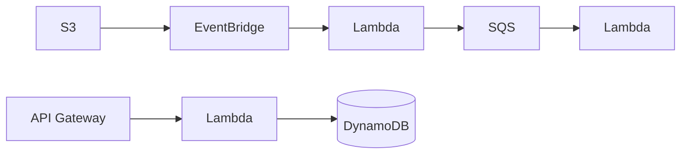
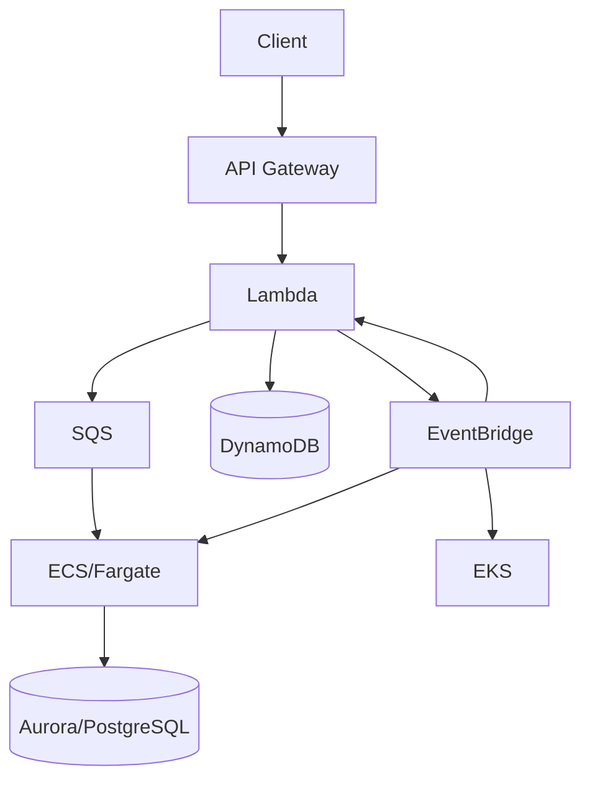

# 02- Serverless Architecture Patterns and Trade-offs

## Overview

Serverless architecture is an application architecture in which the cloud provider manages the underlying server infrastructure, including provisioning, capacity management, patching, and much of the scaling behavior. The application developer primarily manages code, configuration, event sources, permissions, and application-level behavior.

On AWS, serverless architecture commonly combines services such as:

- AWS Lambda for compute
- Amazon API Gateway for HTTP APIs
- Amazon EventBridge for event routing
- Amazon SQS for asynchronous work queues
- Amazon SNS for publish-subscribe and fan-out
- AWS Step Functions for workflow orchestration
- Amazon DynamoDB for serverless-oriented NoSQL workloads
- Amazon S3 for object storage and event-driven processing
- Amazon Aurora Serverless for relational workloads
- Amazon Cognito for managed identity use cases
- Amazon CloudWatch for monitoring and operational visibility

A serverless architecture is not simply "using Lambda." It is a set of architectural decisions around event-driven execution, managed infrastructure, automatic capacity management, asynchronous processing, stateless compute, and operational ownership.

A typical backend request path is:

```text
Client
   |
   v
API Gateway
   |
   v
Lambda
   |
   +----> DynamoDB
   |
   +----> S3
   |
   +----> SQS
   |
   +----> EventBridge
```

The main engineering trade-off is:

> Serverless reduces infrastructure management but does not eliminate architectural complexity.

It shifts responsibility from managing servers toward designing for execution limits, event semantics, distributed workflows, observability, security, and cost behavior.

---

## What Serverless Actually Means

The term "serverless" does not mean that servers do not exist.

Servers still execute the workload. The difference is that AWS manages most of the server lifecycle on behalf of the application owner.

With traditional infrastructure:

```text
Engineer
   |
   +--> EC2
   +--> OS
   +--> Patching
   +--> Capacity
   +--> Scaling
   +--> Networking
   +--> Runtime
   +--> Application
```

With Lambda:

```text
Engineer
   |
   +--> Function Code
   +--> Configuration
   +--> IAM Permissions
   +--> Event Integration
   |
   v
AWS-managed execution infrastructure
```

This reduces infrastructure operations but introduces platform-specific execution semantics.

---

## Core Serverless Characteristics

| Characteristic | Traditional Application | Serverless |
|---|---|---|
| Infrastructure management | Application team | Mostly cloud provider |
| Capacity planning | Explicit | Mostly provider-managed |
| Scaling | Application-controlled | Often automatic |
| Billing | Usually provisioned capacity | Often usage-based |
| Execution model | Long-running process | Event/request-driven |
| Server lifecycle | Application-managed | Provider-managed |
| Deployment unit | VM/container/application | Function or managed service |
| Operational model | Infrastructure-centric | Application/event-centric |
| Failure model | Host/process failures | Invocation/event/dependency failures |

Serverless is especially effective when workload characteristics align with event-driven and elastic execution.

---

## Why Serverless Exists

Serverless addresses several recurring infrastructure problems:

- Over-provisioning
- Idle infrastructure cost
- Manual scaling
- Infrastructure maintenance
- Operational overhead
- Event-driven workload management
- Rapid application deployment

Consider an API receiving highly variable traffic.

A traditional architecture might require:

```text
Load Balancer
     |
     v
Auto Scaling Group
     |
     +--> EC2
     +--> EC2
     +--> EC2
     |
     v
Application
```

A serverless architecture can use:

```text
API Gateway
     |
     v
Lambda
     |
     v
Database
```

The infrastructure required to handle capacity is substantially different.

---

## When Serverless Is a Strong Fit

Serverless is particularly effective for workloads with one or more of these characteristics:

- Highly variable traffic
- Bursty workloads
- Event-driven processing
- Short-lived operations
- Asynchronous jobs
- Scheduled tasks
- File processing
- Lightweight APIs
- Webhooks
- Automation workflows
- Background processing
- Infrastructure with significant idle periods

Examples include:

```text
S3 Object Created
       |
       v
Lambda
       |
       v
Image Processing
```

```text
API Request
    |
    v
API Gateway
    |
    v
Lambda
    |
    v
DynamoDB
```

```text
EventBridge Schedule
       |
       v
Lambda
       |
       v
Daily Processing
```

---

## When Serverless May Be a Poor Fit

Serverless is not automatically the correct architecture.

It may be less suitable for:

- Long-running compute
- Stateful processes
- Extremely latency-sensitive workloads requiring predictable execution
- Applications requiring specialized operating-system control
- Workloads with sustained high utilization where containers may be more economical
- Applications requiring persistent local processes
- Complex workloads requiring unusual runtime dependencies
- Systems that require deep infrastructure customization

For example:

```text
24/7 CPU-intensive processing
        |
        v
Always-running container
        |
        v
ECS / EKS / EC2
```

may be more appropriate than invoking Lambda continuously.

---

## Lambda Execution Model

AWS Lambda executes functions in response to events.

A simplified lifecycle is:

```text
Event
  |
  v
Lambda Service
  |
  v
Execution Environment
  |
  +--> Initialize runtime
  |
  +--> Load application code
  |
  +--> Execute handler
  |
  +--> Return result
  |
  v
Environment may be reused or terminated
```

The important distinction is that the execution environment is not something the application should assume will persist indefinitely.

Lambda functions should therefore generally be designed to be:

- Stateless
- Idempotent
- Horizontally scalable
- Explicit about external state
- Resilient to retries
- Efficient during initialization

---

## Lambda Cold Starts

A cold start occurs when Lambda needs to initialize a new execution environment before invoking the function.

The initialization can involve:

```text
Create execution environment
        |
        v
Initialize runtime
        |
        v
Load dependencies
        |
        v
Initialize application
        |
        v
Execute handler
```

Cold-start latency depends on factors such as:

- Runtime
- Dependency size
- Initialization work
- Memory configuration
- Network configuration
- Packaging strategy
- Provisioned concurrency configuration

For latency-sensitive APIs, cold starts must be treated as a performance consideration rather than ignored.

---

## Warm Invocations

If an execution environment is reused, initialization work may not need to happen again.

For example:

```python
import boto3

dynamodb = boto3.resource("dynamodb")
table = dynamodb.Table("orders")


def handler(event, context):
    response = table.get_item(
        Key={"order_id": event["order_id"]}
    )
    return response.get("Item")
```

The client initialization occurs outside the handler and may be reused when the execution environment is reused.

However, code must not depend on reuse for correctness.

The environment can disappear at any time.

---

## Statelessness

Serverless functions should not rely on local memory or filesystem state for durable application state.

Avoid:

```python
cache = {}

def handler(event, context):
    cache[event["id"]] = event
```

The cache may disappear when the execution environment is terminated.

Instead, durable state should live in services such as:

- DynamoDB
- S3
- RDS/Aurora
- ElastiCache
- SQS
- EventBridge

The local `/tmp` filesystem can be useful for temporary processing, but it should not be treated as durable storage.

---

## API Gateway and Serverless APIs

A common serverless REST architecture is:

```text
Client
   |
   v
API Gateway
   |
   v
Lambda
   |
   +--> DynamoDB
   |
   +--> SQS
   |
   +--> EventBridge
```

API Gateway provides the HTTP boundary while Lambda provides compute.

Typical responsibilities include:

- HTTP routing
- Authentication integration
- Request validation
- Throttling
- Authorization integration
- Request/response handling
- API lifecycle management

The API layer should remain thin where possible.

Business logic should live in application code rather than becoming deeply embedded in infrastructure configuration.

---

## REST API Example

A FastAPI/Django-style traditional architecture might be:

```text
Nginx / ALB
     |
     v
Application Container
     |
     v
PostgreSQL
```

A serverless implementation might be:

```text
API Gateway
     |
     v
Lambda
     |
     v
DynamoDB
```

A Lambda handler can expose a simple API operation:

```python
import json


def handler(event, context):
    order_id = event["pathParameters"]["order_id"]

    return {
        "statusCode": 200,
        "headers": {
            "Content-Type": "application/json"
        },
        "body": json.dumps({
            "order_id": order_id,
            "status": "confirmed"
        })
    }
```

In production, authentication, validation, structured logging, error handling, idempotency, and observability must be implemented explicitly.

---

## Event-Driven Serverless Architecture

Serverless becomes particularly powerful when combined with events.



Different services can trigger functions independently.

Examples:

| Event Source | Example Lambda Workload |
|---|---|
| API Gateway | REST API |
| S3 | File processing |
| SQS | Background worker |
| EventBridge | Event processing |
| SNS | Fan-out consumer |
| DynamoDB Streams | Change processing |
| Kinesis | Stream processing |
| CloudWatch/EventBridge Scheduler | Scheduled job |

This model reduces coupling between producers and consumers.

---

## Queue-Based Serverless Processing

SQS is commonly used to decouple synchronous requests from background processing.

Without a queue:

```text
Client
  |
  v
API
  |
  v
Expensive Processing
  |
  v
Response
```

The client remains blocked while processing occurs.

With SQS:

```text
Client
  |
  v
API
  |
  v
SQS
  |
  v
Lambda Consumer
  |
  v
Processing
```

The API can acknowledge the request quickly while processing occurs asynchronously.

This is especially useful for:

- Email
- Image processing
- Report generation
- Data transformation
- External API integration
- Background notifications

---

## Queue-Based Load Leveling

A queue can absorb bursts.

Suppose:

```text
Normal traffic: 100 jobs/minute
Burst traffic: 10,000 jobs/minute
```

Direct processing may overwhelm downstream dependencies.

A queue provides buffering:

```text
10,000 jobs
      |
      v
     SQS
      |
      v
Lambda consumers
      |
      v
Controlled downstream load
```

Lambda can scale consumers while downstream capacity constraints still need to be respected.

Automatic scaling does not mean unlimited downstream capacity.

---

## EventBridge

EventBridge is useful when multiple systems need to react to business events.

Example:

```text
Order Service
      |
      | OrderCreated
      v
EventBridge
      |
      +----> Payment Processing
      |
      +----> Inventory
      |
      +----> Notifications
      |
      +----> Analytics
```

The producer does not need direct knowledge of every consumer.

This improves extensibility.

However, event-driven architectures introduce:

- Eventual consistency
- Duplicate delivery handling
- Event schema evolution
- Event observability requirements
- Replay and recovery considerations

---

## SNS and Fan-Out

SNS is useful when one published message should be distributed to multiple subscribers.

```text
                 SNS
                  |
       +----------+----------+
       |          |          |
       v          v          v
     SQS A      SQS B      SQS C
       |          |          |
       v          v          v
   Service A  Service B  Service C
```

Using SQS queues behind SNS gives each consumer independent buffering and failure handling.

This is generally more resilient than having one synchronous producer call multiple consumers.

---

## Step Functions

Complex workflows should not always be implemented as deeply chained Lambda functions.

For example:

```text
Order Created
     |
     v
Validate
     |
     v
Reserve Inventory
     |
     v
Authorize Payment
     |
     v
Confirm Order
     |
     v
Notify Customer
```

AWS Step Functions can explicitly represent workflow state and transitions.

Conceptually:

```text
START
  |
  v
Validate
  |
  v
Reserve Inventory
  |
  +---- Failure ----> Compensate
  |
  v
Authorize Payment
  |
  +---- Failure ----> Release Inventory
  |
  v
Confirm Order
  |
  v
END
```

This is preferable to building complicated orchestration logic entirely inside application code.

---

## Serverless and Databases

The database layer is often the most important constraint in a serverless architecture.

Lambda can scale rapidly:

```text
10 Lambda invocations
        |
        v
100 Lambda invocations
        |
        v
1,000 Lambda invocations
        |
        v
Database
```

The database may not scale at the same rate.

This can produce:

- Connection exhaustion
- Increased database latency
- Lock contention
- CPU saturation
- Connection pool pressure

Serverless scaling therefore requires database-aware architecture.

---

## DynamoDB

DynamoDB is frequently used with Lambda because it provides:

- Managed infrastructure
- High scalability
- Low-latency key-value access
- Flexible capacity models
- Native AWS integration
- Streams for change events

The architectural mindset is different from PostgreSQL.

PostgreSQL encourages relational modeling and flexible queries.

DynamoDB requires access-pattern-driven modeling.

Example:

```text
Access Pattern:
Get order by customer

Possible key design:
PK = CUSTOMER#123
SK = ORDER#456
```

DynamoDB should not be selected simply because Lambda is being used.

---

## Serverless with PostgreSQL

Serverless applications can still use PostgreSQL.

A common architecture is:

```text
API Gateway
      |
      v
Lambda
      |
      v
RDS / Aurora PostgreSQL
```

However, Lambda concurrency can create large numbers of database connections.

Connection management therefore becomes critical.

Depending on the architecture, managed connection pooling or proxying can help protect the database.

The general principle is:

> Application concurrency must be compatible with database connection capacity.

---

## Caching in Serverless Systems

Redis or ElastiCache can be used for:

- Frequently accessed data
- Session-related workloads
- Rate limiting
- Distributed locks where appropriate
- Expensive computation results

Example:

```text
Lambda
  |
  v
Redis
  |
  +---- Hit ----> Response
  |
  +---- Miss
        |
        v
     Database
```

However, introducing Redis adds:

- Network latency
- Connection management
- Cost
- Another dependency
- Cache invalidation complexity

Do not add a cache merely because serverless is being used.

---

## VPC Integration

Lambda functions can access private VPC resources when configured for VPC connectivity.

A common architecture is:

```text
API Gateway
      |
      v
Lambda
      |
      v
Private Subnet
      |
      +----> RDS
      |
      +----> ElastiCache
```

This can introduce networking considerations such as:

- Subnet configuration
- Security groups
- Routing
- NAT requirements for outbound internet access
- DNS
- IP address consumption

Putting every Lambda into a VPC is not automatically beneficial.

The decision should be driven by the resources the function needs to access.

---

## Cold Starts vs Provisioned Concurrency

For workloads where predictable startup latency matters, provisioned concurrency can keep execution environments initialized.

Conceptually:

```text
Without Provisioned Concurrency

Request
  |
  v
Cold Start
  |
  v
Handler
```

With provisioned concurrency:

```text
Pre-initialized environments
        |
        v
Request
        |
        v
Handler
```

The trade-off is increased cost.

Use it when latency requirements justify the additional expense.

---

## Concurrency Controls

Lambda can scale rapidly, but unbounded concurrency can overload dependencies.

Important controls include:

- Reserved concurrency
- Provisioned concurrency
- SQS batch sizing
- Event source scaling configuration
- Downstream connection limits

Example:

```text
Lambda
  |
  | 1000 concurrent executions
  v
PostgreSQL
  |
  X
Connection exhaustion
```

A production architecture should establish explicit concurrency boundaries.

---

## Idempotency

Serverless workloads frequently interact with retrying event sources.

For example:

```text
SQS Message
    |
    v
Lambda
    |
    v
Database Write
    |
    X
Invocation failure
    |
    v
Message delivered again
```

If the operation is not idempotent, duplicate processing can occur.

A common approach is to maintain an idempotency record:

```text
Request ID
    |
    v
Idempotency Store
    |
    +---- Already processed --> Return previous result
    |
    +---- New request --------> Process
```

Idempotency is particularly important for:

- Payments
- Order creation
- External API calls
- Message consumers
- Event handlers

---

## Retry Behavior

Retries exist at multiple layers.

For example:

```text
Client
  |
  v
API Gateway
  |
  v
Lambda
  |
  v
SQS
  |
  v
External API
```

A retry at every layer can multiply traffic.

This can create a retry storm:

```text
Failure
  |
  +--> Client retry
  |
  +--> Application retry
  |
  +--> Queue redelivery
  |
  +--> External service retry
  |
  v
Dependency overload
```

Retries should therefore be:

- Bounded
- Selective
- Exponential
- Jittered
- Applied only to retry-safe operations

---

## Dead Letter Queues

Failed asynchronous messages should not necessarily retry forever.

A common pattern is:

```text
SQS
 |
 v
Lambda
 |
 +---- Success ----> Delete message
 |
 +---- Failure -----> Retry
                         |
                         v
                        DLQ
```

The DLQ allows operators to inspect and recover failed messages.

Monitor:

- DLQ message count
- Oldest message age
- Failure reason
- Retry count
- Processing latency

A DLQ is useful only if there is an operational process for investigating and replaying failed work.

---

## Serverless Security

Security responsibilities remain with the application team even though infrastructure management is reduced.

Important controls include:

- IAM least privilege
- API authentication
- Authorization
- Input validation
- Secrets management
- Encryption
- Security groups
- Private networking where appropriate
- Dependency scanning
- CloudTrail auditing
- Structured application logging

Each Lambda function should have a narrowly scoped execution role.

Avoid giving every function:

```text
AdministratorAccess
```

A better model is:

```text
Order Lambda Role
    |
    +--> dynamodb:GetItem
    +--> dynamodb:PutItem
    +--> sqs:SendMessage
```

while another function receives only the permissions it requires.

---

## Serverless Observability

Serverless systems require visibility into both function execution and event flow.

Monitor:

### Lambda Metrics

- Invocation count
- Error count
- Duration
- Throttles
- Concurrent executions
- Iterator age where applicable

### API Metrics

- Request count
- 4xx errors
- 5xx errors
- Latency
- Integration failures

### Queue Metrics

- Approximate queue depth
- Message age
- DLQ depth
- Processing failures

### Database Metrics

- CPU
- Connections
- Read/write latency
- Throttling
- Capacity utilization

### Business Metrics

Technical health is not enough.

Also monitor:

- Orders created
- Payments completed
- Failed transactions
- Files processed
- Messages successfully delivered

---

## Structured Logging

Avoid unstructured logs such as:

```text
payment failed
```

Prefer structured data:

```json
{
  "level": "ERROR",
  "service": "payment-handler",
  "event": "payment_failed",
  "request_id": "req_123",
  "order_id": "ord_456",
  "error_type": "PaymentTimeout"
}
```

This allows CloudWatch Logs and downstream observability systems to filter and aggregate events efficiently.

---

## Distributed Tracing

A serverless request can cross many managed services:

```text
API Gateway
    |
    v
Lambda
    |
    v
SQS
    |
    v
Lambda
    |
    v
DynamoDB
```

Without correlation and tracing, diagnosing latency becomes difficult.

Use:

- Request IDs
- Correlation IDs
- Trace IDs
- Structured logs
- Distributed tracing

The goal is to answer:

> What happened to this request across the entire system?

---

## Cost Model

One of serverless architecture's biggest advantages is usage-based economics.

Traditional infrastructure often looks like:

```text
Provisioned Capacity
      |
      v
Hourly Cost
      |
      v
Whether used or not
```

Serverless often looks more like:

```text
Requests
   +
Execution Duration
   +
Memory / Resource Configuration
   +
Other Managed Service Usage
```

This can be highly economical for intermittent workloads.

However, serverless is not always cheaper.

A continuously busy workload can sometimes be more economical on:

- ECS
- EC2
- EKS
- Other provisioned compute

Cost must therefore be evaluated using actual workload characteristics.

---

## Serverless Cost Trap

A common mistake is assuming:

> Serverless means cheap.

Consider a function invoked millions of times with expensive downstream operations.

The Lambda compute cost may be small compared with:

- API Gateway
- DynamoDB
- NAT Gateway
- RDS/Aurora
- SQS
- EventBridge
- CloudWatch Logs
- Data transfer

The entire architecture must be cost-modeled.

---

## NAT Gateway Cost Considerations

A common serverless architecture places Lambda in private subnets.

If Lambda needs internet access, traffic may flow through a NAT Gateway:

```text
Lambda
  |
  v
Private Subnet
  |
  v
NAT Gateway
  |
  v
Internet
```

This can introduce significant network processing cost at scale.

Before adding NAT, determine whether the function actually requires public internet access and whether AWS service endpoints or alternative architecture patterns can eliminate unnecessary traffic.

---

## Serverless Scalability

Serverless platforms can automatically scale compute execution, but scalability is end-to-end.

Consider:

```text
API Gateway
     |
     v
Lambda
     |
     +----> DynamoDB
     |
     +----> RDS
     |
     +----> External API
```

If Lambda scales from 10 to 1,000 concurrent executions:

- DynamoDB capacity may change
- RDS connections may become constrained
- External APIs may rate-limit
- SQS traffic may increase
- Downstream costs may increase

Therefore:

> Scaling the compute layer without analyzing dependency capacity is not scalable architecture.

---

## Asynchronous vs Synchronous Serverless

| Requirement | Prefer |
|---|---|
| Immediate API response | API Gateway + Lambda |
| Long-running background work | SQS + Lambda |
| Fan-out | SNS + SQS |
| Event routing | EventBridge |
| Complex workflow | Step Functions |
| Scheduled execution | EventBridge Scheduler |
| File processing | S3 + Lambda |
| Streaming workloads | Kinesis + Lambda |
| High-volume relational workloads | RDS/Aurora with appropriate architecture |
| Key-value access at scale | DynamoDB |

The correct choice depends on workload semantics rather than the popularity of a service.

---

## Serverless vs Containers

| Dimension | Serverless Functions | Containers |
|---|---|---|
| Infrastructure management | Very low | Moderate |
| Scaling | Provider-managed | Application/platform-managed |
| Startup model | Invocation-based | Long-running |
| Runtime control | Limited | High |
| Long-running workloads | Poor fit | Strong fit |
| Operational overhead | Lower | Higher |
| Predictability | Variable | Often more predictable |
| Cost at low utilization | Often attractive | Can incur idle cost |
| Cost at sustained high utilization | May be higher | Often competitive |
| Stateful processes | Poor fit | Better |
| Deployment granularity | Function | Service/container |

A mature architecture may use both.

For example:

```text
                  Application
                      |
        +-------------+-------------+
        |                           |
        v                           v
Serverless                     Containers
        |                           |
        +--> Event processing       +--> Core API
        +--> Background jobs        +--> Long-running workers
        +--> Scheduled tasks        +--> gRPC services
```

This is often more practical than forcing the entire platform into one compute model.

---

## Serverless vs Kubernetes

| Requirement | Serverless | Kubernetes |
|---|---|---|
| Minimal infrastructure management | Strong | Weak |
| Fine-grained runtime control | Limited | Strong |
| Long-running services | Limited | Strong |
| Kubernetes ecosystem | No | Yes |
| Operational simplicity | Strong | Lower |
| Custom networking | Limited | Strong |
| Event-driven workloads | Excellent | Good |
| Platform portability | Lower | Higher |
| Infrastructure customization | Limited | Strong |

EKS may be appropriate when Kubernetes itself is an important platform requirement.

Lambda is generally preferable when the workload can benefit from managed event-driven execution without requiring Kubernetes capabilities.

---

## Serverless and Python

Python is commonly used for Lambda workloads because it is well suited to:

- API handlers
- Automation
- Event processing
- Data transformation
- S3 processing
- Scheduled jobs
- Lightweight backend services

A production Python Lambda should avoid unnecessary initialization work.

Example:

```python
import json
import logging

logger = logging.getLogger()
logger.setLevel(logging.INFO)


def handler(event, context):
    request_id = context.aws_request_id

    logger.info(
        "Processing request",
        extra={
            "request_id": request_id,
        },
    )

    return {
        "statusCode": 200,
        "body": json.dumps({"status": "ok"}),
    }
```

Application architecture should still separate:

```text
Handler
   |
   v
Application Service
   |
   v
Repository / Client
   |
   v
AWS Managed Service
```

Avoid placing the entire application inside one large Lambda handler.

---

## Packaging and Dependencies

Large dependency bundles increase deployment size and can increase initialization overhead.

Strategies include:

- Keep dependencies minimal
- Use Lambda layers where appropriate
- Use container images for larger workloads
- Avoid importing unnecessary libraries
- Perform initialization outside the handler when safe
- Keep deployment artifacts reproducible

A good dependency strategy improves both deployment and runtime characteristics.

---

## Lambda Layers

Layers can share dependencies between functions.

Conceptually:

```text
                 Shared Layer
                /     |      \
               /      |       \
              v       v        v
         Function A Function B Function C
```

Layers can be useful for common dependencies, but excessive use can make dependency management difficult.

For independently versioned services, a self-contained deployment artifact is often easier to reason about.

---

## Lambda Container Images

Lambda can also run container images.

This is useful when:

- Dependencies are large
- Existing container tooling is valuable
- Specialized runtime packaging is required

However, using a container image does not turn Lambda into ECS.

The execution model remains Lambda's invocation-based model.

The platform still controls:

- Instance lifecycle
- Scaling
- Execution environment
- Invocation behavior

---

## Serverless Architecture Patterns

### API Backend

```text
Client
  |
  v
API Gateway
  |
  v
Lambda
  |
  v
DynamoDB
```

Best for:

- CRUD APIs
- Lightweight backend services
- Variable traffic

---

### Event Processor

```text
S3
 |
 v
Lambda
 |
 v
Processed Object
```

Best for:

- Image processing
- File validation
- Metadata extraction
- ETL steps

---

### Queue Worker

```text
Producer
   |
   v
SQS
   |
   v
Lambda
   |
   v
Database / External API
```

Best for:

- Background jobs
- Retryable workloads
- Load leveling

---

### Event Fan-Out

```text
Producer
   |
   v
EventBridge / SNS
   |
   +----> Consumer A
   |
   +----> Consumer B
   |
   +----> Consumer C
```

Best for:

- Domain events
- Notifications
- Analytics
- Independent downstream processing

---

### Workflow Orchestration

```text
Start
  |
  v
Lambda A
  |
  v
Validate
  |
  v
Lambda B
  |
  v
Persist
  |
  v
Lambda C
  |
  v
Notify
```

Use Step Functions when the workflow needs explicit state, branching, retries, compensation, or operational visibility.

---

## Common Serverless Mistakes

### Treating Lambda as a Tiny EC2 Instance

Lambda is not simply a small server.

Do not assume:

- Permanent process lifetime
- Stable local state
- Unlimited execution duration
- Unlimited concurrency
- Persistent local filesystem state

---

### Putting Everything in One Lambda

A large function can become a monolith:

```text
Lambda
 |
 +--> Authentication
 +--> Orders
 +--> Payments
 +--> Inventory
 +--> Notifications
 +--> Reporting
```

Function decomposition should follow meaningful responsibilities rather than arbitrary fragmentation.

---

### Ignoring Database Connections

Rapid Lambda concurrency can overwhelm traditional relational databases.

Always model:

```text
Lambda Concurrency
        |
        v
Connection Demand
        |
        v
Database Capacity
```

---

### Using Retries Everywhere

Multiple retry layers can amplify an outage.

Use bounded retries and understand the retry semantics of every AWS service involved.

---

### Ignoring Idempotency

At-least-once delivery means duplicate processing is possible.

Design event consumers and retryable operations accordingly.

---

### Assuming Automatic Scaling Means Infinite Scaling

AWS-managed scaling does not remove:

- Service quotas
- Database limits
- External API limits
- Network limits
- Account-level limits
- Business constraints

---

### Overusing VPC Connectivity

Putting Lambda in a VPC introduces additional networking considerations.

Use VPC integration when access to private resources requires it, not simply because the architecture "looks more secure."

---

### Ignoring Observability

A distributed serverless architecture can be harder to debug than a traditional application if logs, metrics, and traces are incomplete.

---

### Building Complex Workflows Inside Handlers

Avoid deeply nested orchestration code when a workflow engine such as Step Functions can represent the state explicitly.

---

### Ignoring Cost at Architecture Level

Do not evaluate Lambda cost independently.

Evaluate:

```text
Lambda
+
API Gateway
+
DynamoDB
+
SQS
+
EventBridge
+
CloudWatch
+
NAT
+
Data Transfer
```

as one system.

---

## Production Design Checklist

### Architecture

- [ ] Serverless is justified by workload characteristics.
- [ ] Stateless execution is used where appropriate.
- [ ] Event-driven boundaries are explicit.
- [ ] Synchronous and asynchronous operations are intentionally separated.
- [ ] Long-running workloads use appropriate compute.

### Lambda

- [ ] Functions have clear responsibilities.
- [ ] Initialization work is minimized.
- [ ] Concurrency is understood.
- [ ] Timeouts are configured.
- [ ] Memory allocation is tested.
- [ ] Dependencies are controlled.
- [ ] Idempotency is implemented where required.

### Data

- [ ] Database capacity matches application concurrency.
- [ ] DynamoDB access patterns are designed explicitly.
- [ ] Relational connection management is controlled.
- [ ] Caching is justified by workload requirements.
- [ ] Data durability is not dependent on Lambda local state.

### Messaging

- [ ] Queues are used for appropriate asynchronous workloads.
- [ ] DLQs are configured where appropriate.
- [ ] Consumers are idempotent.
- [ ] Event schemas are versioned or evolved compatibly.
- [ ] Retry behavior is understood.

### Security

- [ ] IAM uses least privilege.
- [ ] Secrets are externalized.
- [ ] APIs are authenticated and authorized.
- [ ] Input validation is implemented.
- [ ] Encryption requirements are satisfied.
- [ ] Network exposure is minimized.

### Observability

- [ ] Structured logs are enabled.
- [ ] Request IDs are available.
- [ ] Distributed tracing is implemented where useful.
- [ ] Lambda errors and throttles are monitored.
- [ ] Queue depth and message age are monitored.
- [ ] Business-level failures are observable.

### Cost

- [ ] Function execution cost is understood.
- [ ] API Gateway costs are considered.
- [ ] Database costs are included.
- [ ] NAT Gateway usage is evaluated.
- [ ] Logging volume is controlled.
- [ ] Architecture-wide cost is modeled.

### Reliability

- [ ] Critical workflows have explicit failure handling.
- [ ] Retries are bounded.
- [ ] Backoff and jitter are used where appropriate.
- [ ] DLQs are operationally monitored.
- [ ] Recovery procedures are documented.
- [ ] Service quotas are understood.

---

## Interview-Level Questions

### Why use serverless?

The strongest answer focuses on workload characteristics rather than saying "AWS manages servers."

Discuss:

- Variable traffic
- Event-driven processing
- Reduced operational overhead
- Automatic scaling
- Usage-based economics

---

### When would you avoid Lambda?

Discuss:

- Long-running workloads
- High sustained utilization
- Specialized runtime requirements
- Stateful applications
- Predictable always-on workloads
- Requirements incompatible with Lambda execution semantics

---

### How do you prevent Lambda from overwhelming PostgreSQL?

Discuss:

- Concurrency controls
- Connection pooling
- RDS Proxy where appropriate
- Bounded worker concurrency
- Queue buffering
- Caching
- Database scaling

---

### How do you handle duplicate messages?

Discuss:

- Idempotency keys
- Deduplication
- Conditional writes
- Idempotent database operations
- Event processing state

---

### How do you handle long-running workflows?

Discuss:

- SQS for asynchronous jobs
- Step Functions for explicit orchestration
- ECS/Fargate for genuinely long-running workloads

---

### How do you control serverless cost?

Discuss:

- Invocation volume
- Execution duration
- Memory configuration
- Provisioned concurrency
- API Gateway
- Database utilization
- NAT traffic
- Logging
- Data transfer
- Overall architecture

---

## Architectural Trade-offs

| Dimension | Serverless | Containers | VMs |
|---|---|---|---|
| Infrastructure management | Lowest | Medium | Highest |
| Scaling automation | Strong | Strong | Variable |
| Runtime control | Lower | High | Highest |
| Operational complexity | Lower | Medium | Higher |
| Long-running workloads | Weak | Strong | Strong |
| Bursty workloads | Excellent | Good | Moderate |
| Idle cost | Often low | Possible | Common |
| Predictability | Moderate | High | High |
| Vendor coupling | Higher | Moderate | Lower |
| Deployment model | Function/event | Container/service | VM/application |
| Best use case | Event-driven workloads | Long-running services | Infrastructure control |

There is no universally superior compute model.

A production platform may combine all three.

---

## Hybrid Architecture

A mature AWS platform can use serverless and traditional compute together.



For example:

- Lambda handles lightweight APIs and event processing.
- SQS buffers background work.
- ECS handles long-running workers.
- EKS runs Kubernetes-specific workloads.
- PostgreSQL handles relational transactional data.
- DynamoDB handles high-scale key-value access.

This avoids forcing every workload into one architectural model.

---

## Key Takeaways

- Serverless reduces infrastructure management but shifts complexity toward event semantics, execution behavior, observability, security, and distributed-system design.
- Lambda works best for stateless, event-driven, short-lived, and highly variable workloads; long-running or highly specialized workloads may be better suited to ECS, EKS, or EC2.
- Serverless scalability is end-to-end: Lambda concurrency must be compatible with database connections, external API limits, queue throughput, and other downstream dependencies.
- Production serverless systems require idempotency, bounded retries, dead letter queues, explicit timeouts, least-privilege IAM, structured observability, and architecture-wide cost analysis.
- A hybrid architecture is often the strongest production solution because serverless, containers, and managed databases can each be used where their operational and workload characteristics provide the best trade-off.