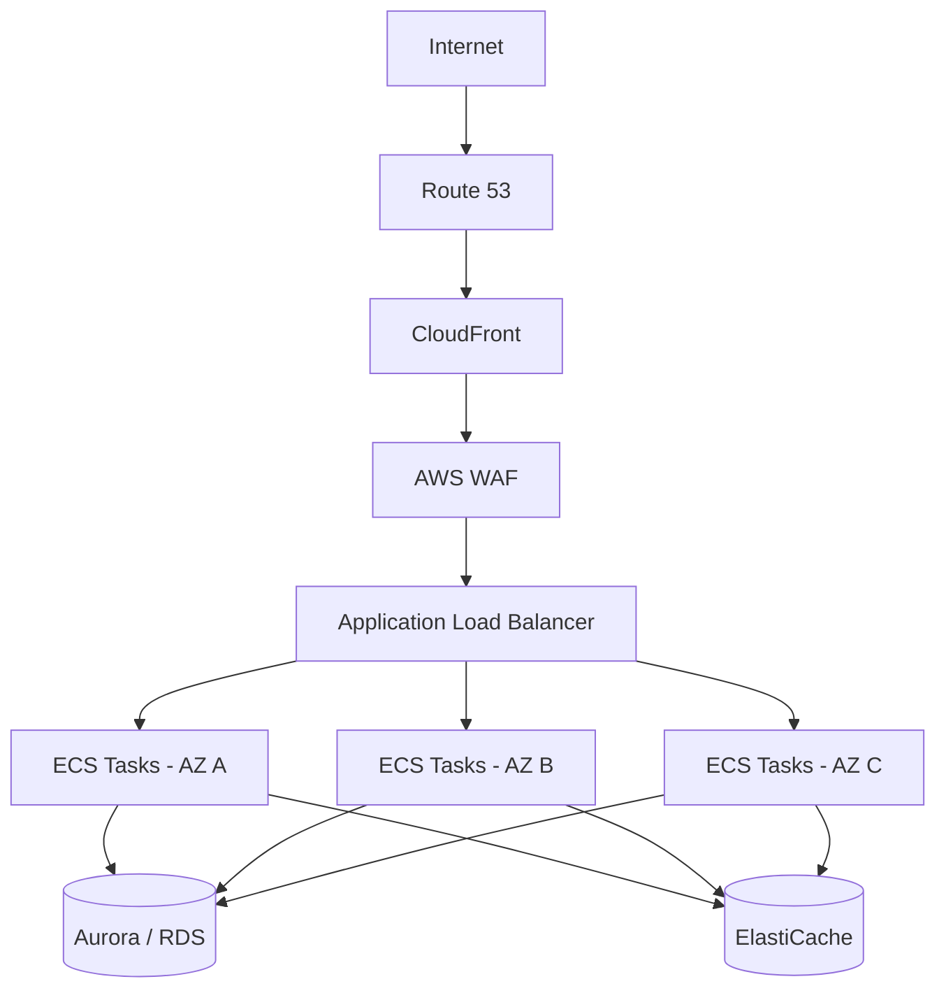
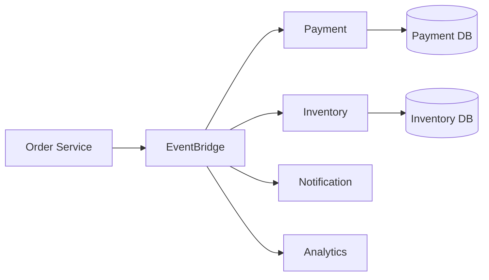
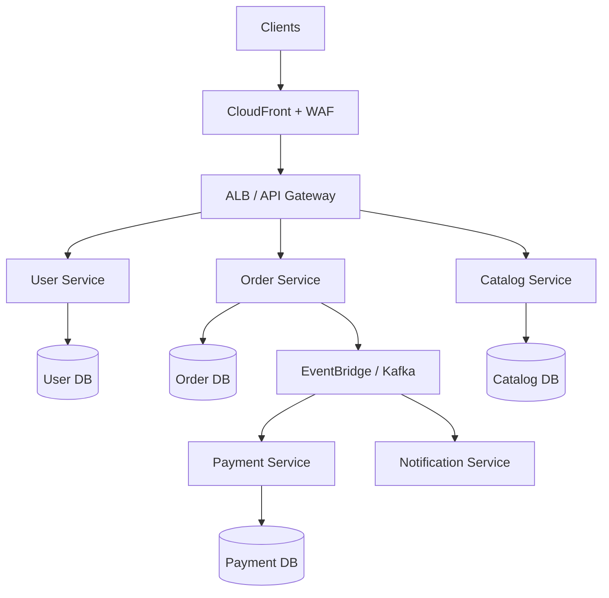
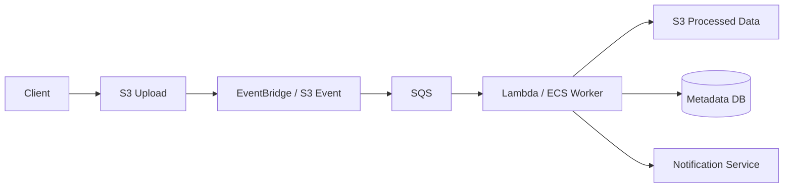
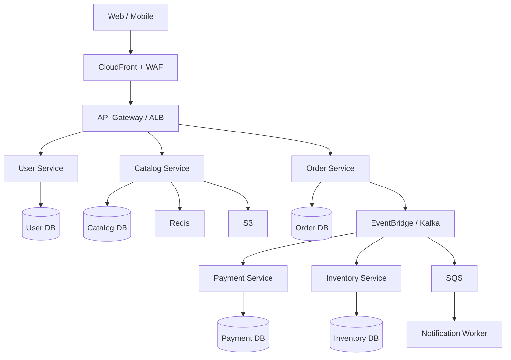

# 03- Real-World Reference Architectures

## Overview

Reference architectures translate individual AWS services and architectural patterns into complete systems that solve realistic backend engineering problems.

The goal is not to memorize AWS service combinations. The goal is to understand why a particular architecture works, where its boundaries are, what happens under failure, and how it changes as traffic, reliability, security, and operational requirements increase.

A production architecture should be evaluated across several dimensions:

| Dimension | Questions |
|---|---|
| Compute | How does application code execute and scale? |
| Networking | How does traffic enter, traverse, and leave the system? |
| Data | Where is state stored and how is it accessed? |
| Reliability | What happens when a component fails? |
| Scalability | What becomes the bottleneck as traffic increases? |
| Security | Where are authentication, authorization, encryption, and isolation enforced? |
| Observability | How are failures and performance problems diagnosed? |
| Cost | Which components dominate infrastructure cost? |
| Operations | How are deployments, migrations, rollback, and recovery performed? |
| Disaster recovery | How does the system recover from regional or data-loss events? |

A strong AWS architecture is therefore not the one containing the most services. It is the simplest architecture that satisfies the system's functional and non-functional requirements.

---

## Architecture Design Principles

Before selecting AWS services, establish the system requirements.

Typical inputs include:

- Expected request rate
- Peak traffic
- Latency requirements
- Availability target
- Data durability requirements
- Consistency requirements
- Recovery Point Objective (RPO)
- Recovery Time Objective (RTO)
- Security requirements
- Compliance requirements
- Deployment frequency
- Team operational maturity
- Budget constraints

For example:

```text
Requirements
     |
     v
Workload Characteristics
     |
     v
Architectural Constraints
     |
     v
Service Selection
     |
     v
Capacity + Failure Analysis
     |
     v
Operational Design
```

Service selection should happen after requirements are understood.

---

## Common AWS Building Blocks

Most production architectures are assembled from a relatively small set of primitives.

| Layer | Common AWS Services |
|---|---|
| DNS | Route 53 |
| CDN | CloudFront |
| WAF | AWS WAF |
| Networking | VPC |
| Load balancing | ALB, NLB |
| Compute | EC2, ECS, EKS, Lambda |
| Containers | ECS, EKS, ECR |
| API | API Gateway |
| Messaging | SQS, SNS, EventBridge |
| Workflows | Step Functions |
| Relational database | RDS, Aurora |
| NoSQL | DynamoDB |
| Cache | ElastiCache |
| Object storage | S3 |
| Streaming | Kinesis, MSK |
| Secrets | Secrets Manager |
| Configuration | Systems Manager Parameter Store |
| Identity | IAM, Cognito |
| Monitoring | CloudWatch |
| Audit | CloudTrail |
| Encryption | KMS |
| Infrastructure as Code | CloudFormation, CDK, Terraform |

The architecture should use only the services necessary to satisfy the requirements.

---

## Reference Architecture: Highly Available Web Application

A conventional production web application can use:

```text
                         Internet
                            |
                            v
                       Route 53
                            |
                            v
                       CloudFront
                            |
                            v
                          WAF
                            |
                            v
                           ALB
                            |
                +-----------+-----------+
                |                       |
                v                       v
          Availability Zone A     Availability Zone B
                |                       |
             ECS/EC2                 ECS/EC2
                |                       |
                +-----------+-----------+
                            |
                            v
                       Aurora/RDS
```

Supporting services commonly include:

```text
ECR
 |
 v
Container Images

Secrets Manager
 |
 v
Application Secrets

CloudWatch
 |
 v
Logs + Metrics + Alarms

CloudTrail
 |
 v
Audit Events
```

This architecture is appropriate for:

- Django applications
- FastAPI applications
- REST APIs
- Server-rendered applications
- Long-running backend services

---

## Request Lifecycle

A request may travel through several layers:

```text
Client
  |
  | HTTPS
  v
Route 53
  |
  v
CloudFront
  |
  v
AWS WAF
  |
  v
Application Load Balancer
  |
  v
ECS Task
  |
  v
Redis / Database
  |
  v
Response
```

Each layer has a distinct responsibility.

### Route 53

Provides DNS resolution and traffic routing.

### CloudFront

Provides edge caching, TLS termination, and global distribution.

### WAF

Filters HTTP requests based on configured security rules.

### ALB

Routes HTTP/HTTPS traffic to healthy application targets.

### ECS

Runs the application containers.

### Database

Stores durable transactional state.

### Redis

Optionally handles caching, ephemeral state, or other low-latency workloads.

---

## Multi-AZ Application Architecture

A single availability zone introduces unnecessary failure concentration.

A production application should generally distribute critical compute across multiple Availability Zones.



The application should not depend on a specific Availability Zone.

If one zone becomes unavailable, traffic can be routed to healthy targets in the remaining zones.

---

## Why Multi-AZ Matters

Multi-AZ addresses failures such as:

- Hardware failure
- Power disruption
- Network disruption
- Availability Zone impairment
- Application instance failure

It does not automatically provide protection against:

- Application bugs
- Bad database migrations
- Data corruption
- Credential compromise
- Region-wide failures
- Operator mistakes

This distinction is important:

> High availability and disaster recovery solve different failure domains.

---

## Reference Architecture: Django or FastAPI on ECS

A production containerized backend can use ECS with Fargate.

```text
Developer
   |
   v
GitHub
   |
   v
GitHub Actions
   |
   +--> Test
   +--> Build
   +--> Security Scan
   |
   v
Amazon ECR
   |
   v
ECS Service
   |
   +--> Fargate Task
   +--> Fargate Task
   +--> Fargate Task
           |
           v
      Aurora/RDS
```

Traffic enters through:

```text
Route 53
   |
CloudFront
   |
WAF
   |
ALB
   |
ECS
```

This architecture is a strong default for applications that:

- Already use Docker
- Require long-running processes
- Need predictable application runtime
- Use Django or FastAPI
- Require background workers
- Need more runtime control than Lambda provides

---

## Django/FastAPI Container Architecture

A typical service layout is:

```text
ALB
 |
 +--> Web/API Tasks
 |
 +--> Web/API Tasks
 |
 +--> Web/API Tasks
          |
          +--> PostgreSQL
          |
          +--> Redis
          |
          +--> S3
          |
          +--> SQS
```

Background processing can be separated:

```text
Application
    |
    v
   SQS
    |
    v
Celery / Worker Tasks
    |
    +--> Database
    +--> External APIs
    +--> S3
```

This prevents expensive background operations from consuming API capacity.

---

## CI/CD Architecture

A production deployment pipeline can be:

```mermaid
flowchart LR
    Dev[Developer] --> Git[GitHub]
    Git --> CI[GitHub Actions]

    CI --> Test[Unit + Integration Tests]
    Test --> Build[Build Docker Image]
    Build --> Scan[Security Scan]
    Scan --> ECR[Amazon ECR]

    ECR --> Deploy[ECS Deployment]
    Deploy --> Health[Health Checks]
    Health --> Verify[Deployment Verification]
```



A mature pipeline should include:

- Automated tests
- Dependency scanning
- Container scanning
- Infrastructure validation
- Immutable artifacts
- Controlled deployment
- Health checks
- Rollback capability

The deployment process should not require manually SSHing into production servers.

---

## Blue/Green and Rolling Deployments

ECS deployments can use controlled replacement of application versions.

Conceptually:

```text
Version A
   |
   | Existing production
   v
ALB
   |
   +----> Tasks A

Deploy Version B
   |
   v
Tasks B
   |
   v
Health Checks
   |
   v
Traffic Shift
   |
   v
Tasks B
```

The deployment strategy should account for:

- Startup time
- Health checks
- Database compatibility
- Connection draining
- Rollback speed
- Backward compatibility

Database migrations are often the hardest part of application rollback.

---

## Reference Architecture: Serverless REST API

A serverless API can use:

```text
Client
  |
  v
Route 53
  |
  v
CloudFront
  |
  v
API Gateway
  |
  v
Lambda
  |
  +----> DynamoDB
  |
  +----> S3
  |
  +----> SQS
  |
  +----> EventBridge
```

This architecture is well suited to:

- Variable traffic
- Lightweight APIs
- Event-driven applications
- Low-operations teams
- Short-lived request processing

---

## Serverless API Request Flow

```text
HTTP Request
    |
    v
API Gateway
    |
    v
Authentication / Authorization
    |
    v
Lambda
    |
    +--> Validate input
    |
    +--> Execute business logic
    |
    +--> Read/write data
    |
    v
HTTP Response
```

For expensive work:

```text
API Gateway
    |
    v
Lambda
    |
    v
SQS
    |
    v
Worker Lambda
    |
    v
Database
```

This keeps synchronous API latency independent from background processing time.

---

## Reference Architecture: Event-Driven Order Platform

Consider an e-commerce backend.

A synchronous architecture could become tightly coupled:

```text
Order Service
    |
    +--> Payment Service
    |
    +--> Inventory Service
    |
    +--> Notification Service
    |
    +--> Analytics Service
```

An event-driven architecture can use:



The order service publishes:

```text
OrderCreated
```

Consumers independently react to the event.

This reduces direct runtime coupling.

---

## Event-Driven Order Processing

A more resilient implementation can use queues:

```text
Order Service
      |
      v
EventBridge
      |
      +----> Payment SQS
      |          |
      |          v
      |      Payment Worker
      |
      +----> Inventory SQS
      |          |
      |          v
      |      Inventory Worker
      |
      +----> Notification SQS
                 |
                 v
             Notification Worker
```

Each consumer gets:

- Independent retry behavior
- Independent scaling
- Independent failure isolation
- Independent processing rate

This is a strong pattern for microservices.

---

## Reference Architecture: Microservices Platform

A production microservices platform might look like:



A key microservices principle is:

> Each service should own its data and business boundaries.

Avoid building:

```text
10 microservices
      |
      v
One shared PostgreSQL schema
```

because this often creates a distributed monolith.

---

## Service-to-Service Communication

Microservices commonly use two communication styles.

### Synchronous

```text
Order Service
     |
     | REST / gRPC
     v
Payment Service
```

Use when the caller requires an immediate response.

### Asynchronous

```text
Order Service
     |
     | Event
     v
Kafka / EventBridge / SNS
     |
     v
Payment Service
```

Use when the operation can proceed independently.

A practical architecture often uses both.

---

## REST vs gRPC in AWS

| Requirement | REST | gRPC |
|---|---|---|
| Public APIs | Strong | Less common |
| Browser clients | Strong | More complex |
| Human-readable payloads | Strong | Weak |
| Internal service communication | Strong | Strong |
| Strict contracts | Good | Excellent |
| Streaming | Limited | Strong |
| Low-latency internal calls | Good | Excellent |
| Polyglot support | Excellent | Excellent |

Do not introduce gRPC simply because a system is microservices-based.

Use it when its contract, performance, or streaming characteristics provide measurable value.

---

## Reference Architecture: Data-Heavy Backend

A data-intensive backend can separate transactional, analytical, and object workloads.

```text
                 Application
                     |
          +----------+----------+
          |          |          |
          v          v          v
      PostgreSQL   Redis       S3
          |                     |
          v                     v
   Transactional Data      Raw Objects
          |
          v
      CDC / Events
          |
          v
   Streaming / ETL
          |
          v
   Analytics Platform
```

This avoids forcing one database to serve every workload.

---

## PostgreSQL + Redis + S3

A common backend architecture is:

```text
FastAPI / Django
      |
      +----> PostgreSQL
      |
      +----> Redis
      |
      +----> S3
```

Use PostgreSQL for:

- Transactions
- Relational data
- Constraints
- Complex queries

Use Redis for:

- Caching
- Rate limiting
- Ephemeral state
- Short-lived coordination

Use S3 for:

- Images
- Documents
- Backups
- Large objects
- Data exports

Avoid storing large binary objects directly in PostgreSQL unless there is a strong reason.

---

## Reference Architecture: File Processing Pipeline

S3 can be used as the entry point for asynchronous processing.



This pattern is useful for:

- Image resizing
- PDF processing
- Virus scanning
- Document extraction
- Data transformation
- Media transcoding

The upload operation does not need to remain connected while processing occurs.

---

## Presigned Upload Architecture

Large files should generally not pass through the application server unnecessarily.

Instead:

```text
Client
  |
  | Request upload authorization
  v
API
  |
  v
Generate Presigned S3 URL
  |
  v
Client
  |
  | Direct upload
  v
S3
```

Then:

```text
S3
 |
 v
Event
 |
 v
Processing Pipeline
```

This reduces application bandwidth and compute requirements.

---

## Reference Architecture: High-Traffic API

For a high-traffic public API:

```text
                     Internet
                         |
                         v
                    Route 53
                         |
                         v
                    CloudFront
                         |
                         v
                       WAF
                         |
                         v
                        ALB
                         |
             +-----------+-----------+
             |                       |
             v                       v
          ECS/EKS                 ECS/EKS
             |                       |
             +-----------+-----------+
                         |
                  +------+------+
                  |             |
                  v             v
                Redis       PostgreSQL
                  |             |
                  +------+------+ 
                         |
                         v
                      S3/SQS
```

Important scaling mechanisms include:

- CDN caching
- Horizontal application scaling
- Database read scaling
- Redis caching
- Asynchronous processing
- Connection management
- Rate limiting

---

## Handling One Million Requests per Second

A system receiving extremely high traffic cannot simply scale the application tier.

Consider the complete request path:

```text
1M requests/sec
       |
       v
CloudFront
       |
       v
WAF
       |
       v
API Layer
       |
       v
Compute
       |
       +----> Cache
       |
       +----> Database
       |
       +----> Queue
```

The first architectural question should be:

> How many requests actually need to reach the origin?

Caching can eliminate a large percentage of origin requests.

For dynamic requests, evaluate:

- Request distribution
- Hot keys
- Database access patterns
- Cache hit rate
- Connection limits
- Network throughput
- Regional distribution
- Service quotas

---

## Reference Architecture: Background Processing Platform

A backend using Celery can separate API traffic from workers.

```text
Client
  |
  v
ALB
  |
  v
Django / FastAPI
  |
  v
Redis / SQS
  |
  v
Worker Fleet
  |
  +--> PostgreSQL
  +--> External APIs
  +--> S3
```

For Celery:

```text
Django/FastAPI
     |
     v
Redis
     |
     v
Celery Workers
```

For AWS-native queueing:

```text
Django/FastAPI
     |
     v
SQS
     |
     v
ECS / Lambda Workers
```

The appropriate choice depends on existing application requirements and operational preferences.

---

## Reference Architecture: Scheduled Data Processing

A scheduled job can use EventBridge Scheduler.

```text
EventBridge Scheduler
          |
          v
Lambda / Step Functions
          |
          v
Data Processing
          |
          +----> S3
          |
          +----> PostgreSQL
          |
          +----> External API
```

For complex jobs:

```text
Scheduler
    |
    v
Step Functions
    |
    +--> Extract
    |
    +--> Transform
    |
    +--> Validate
    |
    +--> Load
    |
    v
Success / Failure
```

Step Functions becomes valuable when intermediate state and failure handling matter.

---

## Reference Architecture: Multi-Region Application

A multi-region architecture introduces a second failure domain.

```text
                    Global Traffic
                         |
                         v
                    Route 53
                         |
              +----------+----------+
              |                     |
              v                     v
          Region A              Region B
              |                     |
          CloudFront             CloudFront
              |                     |
          Application            Application
              |                     |
          Database              Database
```

Traffic can be routed using mechanisms such as:

- Route 53 routing policies
- CloudFront
- AWS Global Accelerator

The hardest problem is usually not compute.

It is data consistency and recovery.

---

## Active-Passive Multi-Region

In active-passive architecture:

```text
Region A
  |
  +--> Primary Application
  +--> Primary Database

Region B
  |
  +--> Standby Application
  +--> Replicated / Recovery Data
```

Normal traffic goes to Region A.

During a regional failure, traffic can be redirected to Region B.

Advantages:

- Lower operational complexity
- Lower cost than active-active
- Easier consistency model

Limitations:

- Failover process must be tested
- Standby capacity must be sufficient
- Recovery may take longer
- Data replication lag can affect RPO

---

## Active-Active Multi-Region

Both regions serve traffic:

```text
                 Global Traffic
                  /           \
                 v             v
             Region A      Region B
                 |             |
             Application   Application
                 |             |
              Database      Database
```

Advantages:

- Better global latency
- Higher availability
- Better utilization of both regions

Challenges:

- Data consistency
- Conflict resolution
- Cross-region networking
- Deployment coordination
- Operational complexity
- Higher cost

Active-active should be justified by requirements, not treated as the default definition of a highly available system.

---

## Reference Architecture: Disaster Recovery

A practical disaster recovery architecture can combine:

```text
Primary Region
     |
     +--> Application
     +--> Database
     +--> S3
     |
     v
Backups / Replication
     |
     v
Secondary Region
     |
     +--> Recovery Infrastructure
     +--> Replicated Data
```

Common DR strategies include:

| Strategy | Recovery Speed | Cost | Complexity |
|---|---:|---:|---:|
| Backup and restore | Lowest | Lowest | Lower |
| Pilot light | Moderate | Low/Medium | Medium |
| Warm standby | Fast | Medium/High | Higher |
| Active-active | Fastest | Highest | Highest |

The correct strategy depends on RTO and RPO.

---

## Reference Architecture: Secure Public API

Security should be layered.

```text
Internet
   |
   v
Route 53
   |
   v
CloudFront
   |
   v
AWS WAF
   |
   v
ALB / API Gateway
   |
   v
Application
   |
   v
Private Database
```

The database should generally not be directly accessible from the public internet.

A common VPC layout is:

```text
VPC
 |
 +--> Public Subnets
 |       |
 |       +--> ALB
 |
 +--> Private Application Subnets
 |       |
 |       +--> ECS / EKS
 |
 +--> Private Data Subnets
         |
         +--> RDS / Aurora
         +--> ElastiCache
```

Security groups should permit only the required traffic paths.

---

## Reference Architecture: Secure Serverless Backend

A serverless backend can use:

```text
Internet
   |
   v
CloudFront
   |
   v
WAF
   |
   v
API Gateway
   |
   v
Lambda
   |
   +----> DynamoDB
   |
   +----> S3
   |
   +----> SQS
```

Security controls include:

- API authentication
- IAM policies
- Resource policies
- KMS encryption
- S3 bucket policies
- DynamoDB access policies
- CloudTrail
- CloudWatch logging

Serverless does not mean security is automatic.

---

## Reference Architecture: SaaS Multi-Tenant Application

A multi-tenant backend can use:

```text
                    Client
                      |
                      v
                 API Gateway
                      |
                      v
                  Application
                      |
          +-----------+-----------+
          |           |           |
          v           v           v
       Tenant A    Tenant B    Tenant C
          |           |           |
          +-----------+-----------+
                      |
                      v
                  Data Layer
```

Tenant isolation can be implemented using:

- Separate databases
- Separate schemas
- Shared tables with tenant IDs
- Separate DynamoDB partition strategies
- Separate AWS accounts for strong isolation

The correct model depends on:

- Compliance
- Tenant size
- Isolation requirements
- Cost
- Operational complexity

---

## Multi-Tenant Database Trade-offs

| Model | Isolation | Cost | Operational Complexity |
|---|---|---|---|
| Database per tenant | Strong | High | High |
| Schema per tenant | Strong | Medium | Medium/High |
| Shared tables + tenant ID | Lower | Low | Lower |
| Dedicated infrastructure for large tenants | Very strong | Very high | High |

For shared-table designs, tenant isolation must be enforced consistently.

A missing tenant filter can become a severe data-isolation vulnerability.

---

## Reference Architecture: Observability

A production platform should provide observability across infrastructure and application layers.

```text
Applications
    |
    +--> Logs
    +--> Metrics
    +--> Traces
    |
    v
CloudWatch / Observability Platform
    |
    +--> Dashboards
    +--> Alarms
    +--> Alerts
    +--> Incident Investigation
```

Monitor both technical and business signals.

Technical:

- CPU
- Memory
- Latency
- Error rates
- Saturation
- Queue depth
- Database connections

Business:

- Orders per minute
- Payment success rate
- Failed jobs
- User registration rate
- Checkout conversion
- File-processing success rate

---

## Reference Architecture: Production Monitoring

A useful monitoring hierarchy is:

```text
Business Metrics
       |
       v
Application Metrics
       |
       v
Service Metrics
       |
       v
Infrastructure Metrics
       |
       v
Logs + Traces
```

When an alert fires, engineers should be able to move from:

```text
Business Impact
      |
      v
Affected Service
      |
      v
Affected Dependency
      |
      v
Root Cause
```

rather than searching thousands of unrelated logs.

---

## Reference Architecture: Caching Strategy

A common API architecture uses multiple caching layers:

```text
Client
  |
  v
CloudFront
  |
  v
API
  |
  v
Redis
  |
  v
Database
```

Each layer has different characteristics.

| Layer | Purpose |
|---|---|
| Browser | Client-side caching |
| CloudFront | Edge caching |
| Application cache | Frequently used application data |
| Redis | Distributed low-latency cache |
| Database | Durable source of truth |

Caching should be based on access patterns and invalidation requirements.

---

## Reference Architecture: Search System

A relational database should not necessarily serve every search requirement.

A common architecture is:

```text
Application
    |
    v
PostgreSQL
    |
    | Change Events / CDC
    v
Search Pipeline
    |
    v
Search Engine
    |
    v
Search API
```

PostgreSQL remains the transactional source of truth.

A specialized search engine handles:

- Full-text search
- Ranking
- Filtering
- Faceting
- Search-oriented indexing

The search index can be rebuilt from authoritative data if necessary.

---

## Reference Architecture: Kafka-Based Event Platform

For high-throughput event streaming:

```text
                 Producers
                     |
       +-------------+-------------+
       |             |             |
       v             v             v
    Service A     Service B     Service C
       |             |             |
       +-------------+-------------+
                     |
                     v
                   Kafka
                     |
          +----------+----------+
          |          |          |
          v          v          v
      Consumer A Consumer B Consumer C
          |          |          |
          v          v          v
       Database   Analytics   Notifications
```

Kafka is appropriate when the system requires capabilities such as:

- High-throughput streaming
- Durable event logs
- Consumer groups
- Replay
- Ordered processing within partitions
- Multiple independent consumers

Kafka is not simply a replacement for every SQS workload.

---

## AWS-Native Messaging vs Kafka

| Requirement | SQS | SNS/EventBridge | Kafka |
|---|---|---|---|
| Simple asynchronous queue | Excellent | Good | Often excessive |
| Pub-sub | Limited alone | Excellent | Excellent |
| Event routing | Limited | Excellent | Good |
| High-throughput streaming | Limited | Limited | Excellent |
| Replay | Limited | Depends on service/design | Strong |
| Consumer groups | No | No | Strong |
| Operational complexity | Low | Low | Higher |
| AWS-native integration | Excellent | Excellent | Strong with MSK |

The messaging technology should match the delivery and processing semantics required by the system.

---

## Reference Architecture: E-Commerce Platform

A realistic e-commerce architecture may combine several patterns:



This architecture demonstrates:

- Service boundaries
- Independent data ownership
- Caching
- Event-driven communication
- Asynchronous processing
- Object storage
- Independent scaling

The architecture should still be simplified if the actual workload does not justify this complexity.

---

## Reference Architecture: Banking or Financial Transaction System

Financial systems require stronger consistency and auditability.

A conceptual architecture is:

```text
Client
  |
  v
API Gateway / ALB
  |
  v
Transaction Service
  |
  v
Relational Database
  |
  +--> Transaction Ledger
  |
  +--> Audit Records
  |
  v
Outbox / Event Stream
  |
  +--> Notifications
  +--> Reporting
  +--> Fraud Detection
```

The transactional database remains authoritative.

Asynchronous consumers should not become the source of truth for financial balances.

Important considerations include:

- Idempotency
- Strong transactional boundaries
- Auditability
- Immutable transaction records
- Reconciliation
- Encryption
- Least privilege
- Controlled deployments
- Disaster recovery

---

## Reference Architecture: Notification Platform

A notification platform can use event-driven fan-out:

```text
Business Event
      |
      v
EventBridge / SNS
      |
      +----> Email Queue
      |
      +----> SMS Queue
      |
      +----> Push Queue
      |
      +----> In-App Queue
```

Each channel can scale independently.

For example:

```text
Email Queue
    |
    v
Email Workers
    |
    v
Email Provider
```

External provider failures should not block the original business transaction.

Retries and DLQs should isolate provider failures.

---

## Reference Architecture: Image Processing Platform

```text
Client
  |
  v
API
  |
  v
Presigned S3 URL
  |
  v
S3
  |
  v
Event
  |
  v
SQS
  |
  v
Lambda / ECS Worker
  |
  +--> Resize
  +--> Optimize
  +--> Generate Thumbnail
  |
  v
S3
```

The metadata can be stored separately:

```text
PostgreSQL
 |
 +--> image_id
 +--> object_key
 +--> dimensions
 +--> processing_status
 +--> created_at
```

This separates large object storage from transactional metadata.

---

## Reference Architecture: API Rate Limiting

Rate limiting can be implemented at multiple layers:

```text
Client
  |
  v
CloudFront / WAF
  |
  v
API Gateway / ALB
  |
  v
Application
  |
  v
Redis
```

Use the earliest appropriate layer to reject abusive traffic.

Application-level rate limiting can use Redis for distributed counters.

Conceptually:

```text
Request
  |
  v
Redis Counter
  |
  +---- Under Limit ----> Application
  |
  +---- Over Limit -----> HTTP 429
```

Rate limits should consider:

- Client identity
- API key
- User ID
- IP address
- Endpoint
- Tenant
- Time window

---

## Reference Architecture: Zero-Downtime Database Migration

Application deployment and database migration should be coordinated.

A safer pattern is:

```text
Old Application
      |
      v
Backward-Compatible Schema
      |
      v
Deploy New Application
      |
      v
Migrate Data
      |
      v
Remove Old Schema
```

Avoid:

```text
Deploy Code
    |
    v
Immediately Drop Column
    |
    X
Old Application Still Running
```

For rolling deployments, schema compatibility must span both old and new application versions.

---

## Reference Architecture: Outbox Pattern

When a service must atomically update its database and publish an event, an outbox can prevent inconsistent state.

```text
Transaction
    |
    +--> Business Data
    |
    +--> Outbox Event
            |
            v
       Commit Together
            |
            v
      Event Publisher
            |
            v
      Kafka / EventBridge
```

The database transaction guarantees that the business update and event record are committed together.

A background publisher then forwards the outbox event.

This is useful when direct dual writes would create a consistency gap.

---

## Reference Architecture: Saga-Based Workflow

Distributed transactions can use a Saga:

```text
Order Created
     |
     v
Reserve Inventory
     |
     v
Authorize Payment
     |
     v
Confirm Order
```

If payment fails:

```text
Payment Failed
      |
      v
Release Inventory
      |
      v
Cancel Order
```

The important principle is:

> Distributed workflows usually use compensating actions instead of relying on a single ACID transaction across services.

---

## Architecture Selection Matrix

| Workload | Recommended Starting Architecture |
|---|---|
| Django/FastAPI CRUD API | ALB + ECS/Fargate + RDS |
| Highly variable lightweight API | API Gateway + Lambda |
| Static frontend | S3 + CloudFront |
| File processing | S3 + SQS + Lambda/ECS |
| Background jobs | SQS + Lambda/ECS |
| Event routing | EventBridge |
| Pub-sub fan-out | SNS + SQS |
| Complex workflow | Step Functions |
| High-throughput streaming | Kafka/MSK |
| Relational transactions | Aurora/RDS |
| Key-value workloads | DynamoDB |
| Low-latency caching | ElastiCache |
| Global content delivery | CloudFront |
| Public API protection | WAF + API Gateway/ALB |
| Kubernetes workloads | EKS |
| Long-running containers | ECS/Fargate |
| Disaster recovery | Backup/replication + secondary region |
| Global active-active | Multi-region architecture |

This table is a starting point, not a service-selection algorithm.

---

## Architecture Evolution

Production systems rarely start with the final architecture.

A practical evolution might be:

```text
Stage 1
Django + PostgreSQL
       |
       v
Single Application

Stage 2
Django/FastAPI
       |
       +--> Redis
       +--> S3
       +--> Background Workers

Stage 3
Containerized Application
       |
       +--> ECS
       +--> RDS
       +--> SQS

Stage 4
Service Decomposition
       |
       +--> User Service
       +--> Order Service
       +--> Payment Service

Stage 5
Event-Driven Platform
       |
       +--> EventBridge/Kafka
       +--> Independent Scaling
       +--> Multi-AZ

Stage 6
Multi-Region
       |
       +--> Regional Applications
       +--> Replication
       +--> Global Traffic Management
```

Architecture should evolve when requirements justify it.

Premature distribution creates operational complexity without necessarily improving the system.

---

## Production Architecture Review Checklist

### Traffic

- [ ] Traffic entry points are clearly defined.
- [ ] TLS termination is intentional.
- [ ] CDN usage is evaluated.
- [ ] WAF protection is evaluated.
- [ ] Rate limiting exists where required.
- [ ] Load balancing spans multiple Availability Zones.

### Compute

- [ ] Compute is selected based on workload characteristics.
- [ ] Horizontal scaling is supported.
- [ ] Health checks are configured.
- [ ] Deployment rollback is possible.
- [ ] Resource limits are understood.

### Data

- [ ] The source of truth is clearly defined.
- [ ] Database scaling strategy is documented.
- [ ] Connection limits are understood.
- [ ] Backups are automated.
- [ ] Restore procedures are tested.
- [ ] Data access is private where appropriate.

### Messaging

- [ ] Synchronous and asynchronous boundaries are deliberate.
- [ ] Consumers are idempotent.
- [ ] Retry behavior is understood.
- [ ] DLQs exist where appropriate.
- [ ] Event schemas can evolve safely.

### Security

- [ ] IAM follows least privilege.
- [ ] Secrets are managed centrally.
- [ ] Public exposure is minimized.
- [ ] Encryption requirements are satisfied.
- [ ] Audit logging is enabled.
- [ ] Network boundaries are intentional.

### Reliability

- [ ] Critical services span multiple Availability Zones.
- [ ] Dependency failures are handled.
- [ ] Timeouts exist.
- [ ] Retries are bounded.
- [ ] Circuit-breaking or isolation exists where appropriate.
- [ ] Disaster recovery requirements are documented.

### Observability

- [ ] Logs are structured.
- [ ] Metrics exist for critical components.
- [ ] Traces are available for distributed requests.
- [ ] Alerts represent actionable conditions.
- [ ] Business metrics are monitored.

### Cost

- [ ] Compute cost is understood.
- [ ] Database cost is understood.
- [ ] Data transfer is considered.
- [ ] NAT Gateway usage is evaluated.
- [ ] Logging volume is controlled.
- [ ] Cross-region traffic is considered.

---

## Common Architecture Mistakes

### Choosing Services Before Requirements

Bad approach:

```text
"I know Lambda, DynamoDB, and EventBridge.
Let's build everything with them."
```

Better approach:

```text
Requirements
    |
    v
Workload Characteristics
    |
    v
Constraints
    |
    v
Architecture
    |
    v
AWS Services
```

AWS service knowledge should support architecture decisions rather than drive them.

---

### Overusing Microservices

Not every application needs:

```text
20 services
20 databases
Kafka
EventBridge
EKS
Service Mesh
```

A modular monolith can be a better starting point.

---

### Single-AZ Production Systems

Running every critical component in one Availability Zone creates unnecessary failure concentration.

---

### Public Databases

A database should generally reside in private subnets and be reachable only by authorized application resources.

---

### Shared Database Across Microservices

A shared database can create:

- Tight coupling
- Schema coordination
- Deployment dependencies
- Ownership ambiguity
- Distributed-monolith characteristics

---

### Synchronous Calls Everywhere

A chain such as:

```text
API
 |
 v
Order
 |
 v
Payment
 |
 v
Inventory
 |
 v
Notification
```

increases latency and failure propagation.

Asynchronous communication should be considered where immediate consistency is not required.

---

### Asynchronous Communication Everywhere

The opposite mistake is equally dangerous.

Making every operation asynchronous can introduce:

- Eventual consistency
- Complex debugging
- Delayed user feedback
- More operational state

Use asynchronous communication where its benefits justify the complexity.

---

### Ignoring Failure Domains

Always ask:

> What happens if this component disappears?

Then expand the question:

> What happens if the Availability Zone disappears?

And:

> What happens if the Region disappears?

And finally:

> What happens if the data itself becomes corrupted?

These represent different failure domains.

---

### Ignoring Operational Complexity

Every additional AWS service introduces:

- Configuration
- IAM policies
- Monitoring
- Cost
- Failure modes
- Deployment concerns
- Operational knowledge

Architecture complexity is a real production cost.

---

## Interview Architecture Framework

When asked to design an AWS system, use a structured process.

### Establish Requirements

Ask about:

- Users
- Traffic
- Peak load
- Latency
- Availability
- Data volume
- Consistency
- Security
- RPO
- RTO

### Define the API and Workflows

Identify:

```text
Synchronous operations
Asynchronous operations
Read-heavy operations
Write-heavy operations
Long-running operations
```

### Define Data Ownership

Determine:

```text
What data exists?
Who owns it?
What is the source of truth?
How is it accessed?
What consistency is required?
```

### Define Scaling Strategy

Identify likely bottlenecks:

```text
Compute
Database
Cache
Network
External APIs
Queues
Storage
```

### Define Failure Handling

For every critical component:

```text
What happens if it fails?
How does traffic recover?
How does data recover?
How does the operator know?
```

### Add Security

Cover:

- Authentication
- Authorization
- IAM
- Encryption
- Network isolation
- Secrets
- Audit

### Add Observability

Cover:

- Metrics
- Logs
- Traces
- Alerts
- Business KPIs

### Evaluate Cost

Finally ask:

```text
What is expensive?
What is provisioned?
What scales with traffic?
What crosses Availability Zones?
What crosses Regions?
```

This approach demonstrates architectural reasoning rather than simple AWS service memorization.

---

## Key Takeaways

- Reference architectures should start with workload requirements and failure domains, then map those requirements to AWS services rather than selecting services first.
- Production AWS systems commonly combine managed networking, multi-AZ compute, private data layers, asynchronous messaging, caching, observability, and automated CI/CD.
- Serverless, containers, microservices, event-driven systems, and multi-region designs solve different problems; architectural complexity should be introduced only when the requirements justify it.
- The most important architecture decisions concern scalability bottlenecks, data ownership, consistency, failure handling, security boundaries, operational complexity, and recovery objectives.
- A strong senior-level architecture explains not only how the system works under normal conditions, but also how it behaves during dependency failures, deployments, traffic spikes, data corruption, and regional outages.