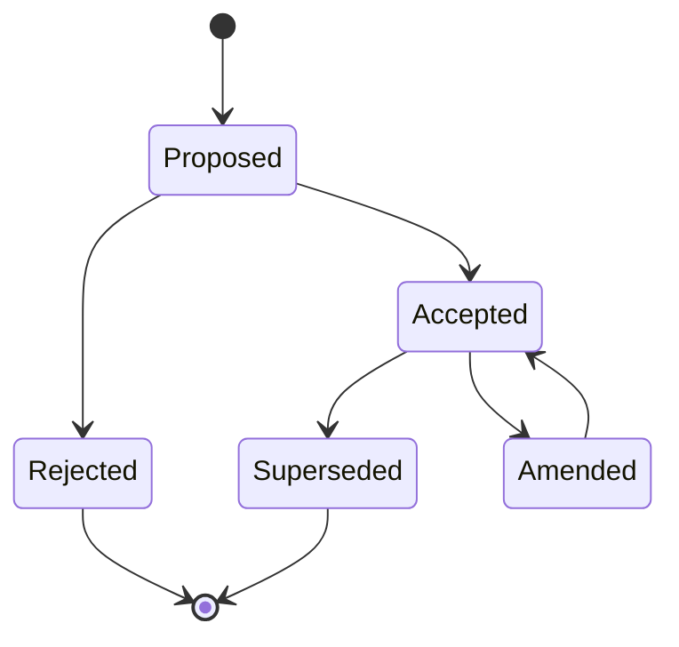
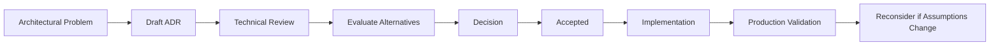

# 04- Architecture Decision Records

## Overview

Architecture Decision Records (ADRs) are lightweight documents that capture significant architectural decisions, the reasoning behind them, and the consequences that follow.

An architecture diagram shows **what a system looks like**. An ADR explains **why it looks that way**.

This distinction becomes increasingly important as systems evolve. AWS architectures often involve decisions such as:

- ECS vs EKS vs Lambda
- RDS/Aurora vs DynamoDB
- REST vs gRPC
- SQS vs Kafka
- Synchronous vs asynchronous communication
- Multi-AZ vs Multi-Region
- Shared database vs database-per-service
- Redis caching vs database-only access
- Monolith vs microservices
- Active-passive vs active-active disaster recovery

Without decision records, architectural context tends to disappear when the original engineers leave or when the system changes significantly.

An ADR should therefore preserve the reasoning that future engineers need to understand, operate, modify, or challenge an architecture.

---

## What an ADR Is

An ADR records a meaningful architectural decision at a particular point in time.

A typical ADR captures:

```text
Context
   |
   v
Problem / Constraints
   |
   v
Options Considered
   |
   v
Decision
   |
   v
Consequences
```

The decision is not necessarily permanent.

An ADR represents:

> The best decision we made given the information, constraints, and requirements available at that time.

This distinction matters because architecture changes as:

- Traffic increases
- Requirements change
- AWS services evolve
- Costs change
- Team expertise changes
- Reliability requirements increase
- Compliance requirements change
- New technologies become available

---

## Why ADRs Matter

Architecture decisions are often more valuable than architecture diagrams because they preserve the reasoning behind the design.

Consider a system using ECS instead of EKS.

A diagram may show:

```text
ALB
 |
 v
ECS
 |
 v
RDS
```

It does not explain:

- Why ECS was selected
- Why EKS was rejected
- Whether Kubernetes was considered
- Whether operational complexity influenced the decision
- Whether the choice was based on team expertise
- Whether the decision depends on traffic volume
- When the decision should be reconsidered

An ADR captures that context.

---

## ADRs and Institutional Knowledge

Without ADRs, engineers may encounter an existing decision and assume:

> "This is just how the system works."

That can lead to accidental architectural changes.

For example:

```text
Original Decision
      |
      v
Use SQS for asynchronous processing
      |
      v
New Engineer
      |
      v
"Kafka is better"
      |
      v
Replaces SQS
      |
      v
Operational complexity increases
```

An ADR exposes the original constraints:

```text
Why SQS?
- Moderate event volume
- Simple queue semantics
- AWS-native integration
- No replay requirement
- Low operational overhead
```

The engineer can then determine whether those assumptions are still valid.

---

## When to Create an ADR

Create an ADR when a decision has meaningful architectural consequences.

Typical examples include:

| Decision | ADR Usually Appropriate? |
|---|---|
| Choose ECS over EKS | Yes |
| Choose Lambda for API workloads | Yes |
| Choose PostgreSQL over DynamoDB | Yes |
| Introduce Kafka | Yes |
| Introduce Redis as a distributed cache | Yes |
| Adopt microservices | Yes |
| Select Multi-Region architecture | Yes |
| Choose REST vs gRPC | Yes |
| Choose SQS vs Kafka | Yes |
| Change database ownership model | Yes |
| Introduce event sourcing | Yes |
| Change deployment strategy | Sometimes |
| Rename a variable | No |
| Fix a typo | No |
| Change an internal function name | No |

The decision should be significant enough that a future engineer might reasonably ask:

> "Why did we choose this?"

---

## When Not to Create an ADR

Not every engineering decision deserves documentation.

Avoid creating ADRs for:

- Routine implementation details
- Formatting conventions
- Small refactors
- Bug fixes
- Temporary debugging changes
- Obvious configuration changes
- Decisions already fully covered by an existing ADR

Too many ADRs reduce their value.

The objective is not maximum documentation.

The objective is preserving **important architectural reasoning**.

---

## Characteristics of a Good ADR

A strong ADR is:

- Specific
- Concise
- Context-rich
- Decision-oriented
- Honest about trade-offs
- Easy to scan
- Version-controlled
- Immutable after acceptance except through superseding decisions

A good ADR should allow a new engineer to understand:

```text
What problem existed?
        |
        v
What constraints mattered?
        |
        v
What alternatives were evaluated?
        |
        v
What was selected?
        |
        v
Why was it selected?
        |
        v
What trade-offs were accepted?
```

---

## ADR Lifecycle

ADRs typically have a lifecycle.



Common statuses include:

| Status | Meaning |
|---|---|
| Proposed | Decision is under discussion |
| Accepted | Decision has been approved and implemented or scheduled |
| Rejected | Option was evaluated but not selected |
| Superseded | A newer ADR replaced this decision |
| Deprecated | Decision is no longer recommended |
| Amended | Decision remains valid but has been modified |

The exact vocabulary can vary between organizations.

---

## Recommended ADR Structure

A practical ADR template is:

```markdown
# ADR Title

- Status: Proposed
- Date: YYYY-MM-DD
- Decision Owners: Team / Architecture Group
- Supersedes: ADR-XXX
- Superseded By: ADR-XXX

## Context

Describe the problem, requirements, constraints, and relevant system conditions.

## Decision

State the selected architectural approach.

## Alternatives Considered

Describe the realistic alternatives and why they were not selected.

## Consequences

Describe positive and negative consequences.

## Production Considerations

Describe reliability, scalability, security, operations, and cost implications.

## Migration and Rollout

Describe how the decision will be introduced safely.

## Reconsideration Criteria

Describe conditions that would justify revisiting the decision.
```

Not every ADR requires every section, but significant production decisions benefit from this structure.

---

## Context

The Context section establishes the problem.

It should describe:

- Existing architecture
- Business requirements
- Technical requirements
- Constraints
- Traffic characteristics
- Reliability requirements
- Security requirements
- Operational constraints
- Cost constraints

Avoid turning the context into a complete system-design document.

The objective is to provide enough information to understand the decision.

### Weak Context

```text
We need a message queue.
Kafka and SQS were considered.
We chose SQS.
```

### Stronger Context

```text
The order service must process payment and fulfillment work
asynchronously. Traffic is expected to remain below a few thousand
messages per second, and the system does not currently require event
replay or long-term event retention.

The team already operates several AWS-managed services and wants to
minimize infrastructure operations.
```

The second version provides the reasoning context needed by future engineers.

---

## Constraints

Explicitly documenting constraints makes the decision easier to understand.

Typical constraints include:

| Constraint | Example |
|---|---|
| Latency | API p95 must remain below 200 ms |
| Availability | 99.99% service availability |
| RPO | Maximum 5 minutes of data loss |
| RTO | Recovery within 30 minutes |
| Traffic | 10,000 requests/sec peak |
| Team | No dedicated Kubernetes platform team |
| Cost | Infrastructure budget must remain below a defined threshold |
| Compliance | Data must remain within a specific region |
| Consistency | Financial transactions require strong consistency |
| Integration | Existing systems expose REST APIs |

Constraints often explain architectural decisions better than technology preferences.

---

## Decision

The Decision section should be unambiguous.

Avoid:

```text
We may use ECS depending on requirements.
```

Prefer:

```text
The application will run on Amazon ECS using Fargate.
The service will be deployed across multiple Availability Zones
behind an Application Load Balancer.
```

A decision should make the intended architecture clear enough for implementation.

---

## Alternatives Considered

An ADR should document realistic alternatives.

For example:

```text
Decision:
ECS/Fargate

Alternatives:
- EKS
- EC2 Auto Scaling
- Lambda
```

The alternatives should not be artificial choices.

For each meaningful alternative, explain why it was considered and why it was rejected.

---

## Example: ECS vs EKS

| Criterion | ECS/Fargate | EKS |
|---|---|---|
| Operational complexity | Lower | Higher |
| Kubernetes compatibility | Limited | Excellent |
| AWS integration | Excellent | Excellent |
| Platform control | Moderate | High |
| Team expertise required | Lower | Higher |
| Portability | Lower | Higher |
| Cluster management | AWS-managed | Kubernetes control plane managed by AWS |
| Workload flexibility | High | Very high |

A decision might state:

```text
ECS/Fargate was selected because the workload requires container
orchestration but does not currently require Kubernetes-specific
features. The team prioritizes lower operational overhead over
Kubernetes portability.
```

The ADR should also document when this decision should be reconsidered.

---

## Consequences

Every architectural decision creates trade-offs.

An ADR should explicitly document both positive and negative consequences.

### Positive Consequences

Examples:

- Lower operational overhead
- Better scalability
- Improved fault isolation
- Stronger security boundary
- Lower latency
- Easier deployment

### Negative Consequences

Examples:

- Higher AWS cost
- Eventual consistency
- Additional infrastructure
- More complex debugging
- Increased operational responsibility
- Vendor dependency

Ignoring negative consequences produces incomplete architectural documentation.

---

## Production Considerations

For significant decisions, explicitly evaluate:

### Reliability

Consider:

- Availability Zones
- Failure isolation
- Retry behavior
- Timeouts
- Dead-letter queues
- Backups
- Recovery procedures

### Scalability

Consider:

- Horizontal scaling
- Vertical scaling
- AWS quotas
- Database bottlenecks
- Queue throughput
- Cache capacity

### Security

Consider:

- IAM
- Network isolation
- Encryption
- Secrets management
- Authentication
- Authorization
- Auditability

### Observability

Consider:

- Logs
- Metrics
- Traces
- Alerts
- Dashboards
- Business metrics

### Cost

Consider:

- Compute
- Storage
- Data transfer
- NAT Gateway
- Logging
- Cross-region traffic
- Managed-service pricing

---

## Example ADR: Choose ECS Over EKS

```markdown
# Use ECS with Fargate for Application Compute

- Status: Accepted
- Date: 2026-08-24

## Context

The backend consists of containerized Python services built with
Django and FastAPI. The services require long-running processes,
background workers, horizontal scaling, and integration with AWS
networking and managed databases.

The team does not currently require Kubernetes-specific capabilities.
Operational simplicity is a priority because the team does not have a
dedicated Kubernetes platform group.

The system must support multi-AZ deployment and automated deployments
through CI/CD.

## Decision

Use Amazon ECS with Fargate for production application workloads.

Applications will run as container images stored in Amazon ECR and
will be deployed as ECS services across multiple Availability Zones.
Application traffic will enter through an Application Load Balancer.

## Alternatives Considered

### EKS

Rejected because Kubernetes-specific capabilities are not currently
required and the additional platform complexity is not justified.

### EC2 Auto Scaling

Rejected because managing the underlying instances adds operational
responsibility without providing a current requirement for host-level
control.

### Lambda

Rejected for long-running workloads and services that require
persistent worker processes.

## Consequences

### Positive

- Reduced infrastructure management
- Native AWS integration
- Straightforward container deployment
- Horizontal scaling
- Multi-AZ deployment

### Negative

- Greater AWS-specific coupling than Kubernetes
- Less control over the underlying host environment
- ECS-specific operational knowledge is required

## Reconsideration Criteria

Reevaluate the decision if the platform requires:

- Kubernetes-specific operators
- Kubernetes-native tooling
- Significant multi-cloud portability
- Advanced cluster-level scheduling
- Existing organizational adoption of Kubernetes
```

The ADR records the decision without pretending that ECS is universally better than EKS.

---

## ADR Numbering

A repository can use sequential identifiers:

```text
docs/
└── decisions/
    ├── ADR-001-use-postgresql.md
    ├── ADR-002-use-redis-cache.md
    ├── ADR-003-use-ecs-fargate.md
    └── ADR-004-use-sqs-for-background-processing.md
```

Sequential numbering provides:

- Stable references
- Easy linking
- Historical ordering
- Simple discussion references

Avoid renumbering existing ADRs.

Once an ADR is published, its identifier should remain stable.

---

## ADR Naming

Use names that describe the decision.

Good:

```text
ADR-001-use-postgresql-for-transactional-data.md
ADR-002-use-redis-for-distributed-caching.md
ADR-003-use-ecs-fargate-for-container-workloads.md
ADR-004-use-sqs-for-asynchronous-processing.md
```

Avoid:

```text
ADR-001-database.md
ADR-002-cache.md
ADR-003-aws.md
ADR-004-architecture.md
```

A filename should be understandable without opening the file.

---

## ADR Metadata

A practical metadata block can contain:

```markdown
- Status: Accepted
- Date: 2026-08-24
- Decision Owners: Backend Platform Team
- Reviewers: Architecture Group
- Supersedes: ADR-002
- Superseded By: -
```

Additional metadata may include:

- Service
- Repository
- Related RFC
- Related incident
- Related architecture diagram
- Risk level

Do not add metadata that the team will not maintain.

---

## ADRs and Architecture Diagrams

ADRs and diagrams serve different purposes.

```text
Architecture Diagram
        |
        | What exists?
        v
System Structure

ADR
        |
        | Why does it exist?
        v
Decision Context
```

A diagram might show:

```text
ALB
 |
 v
ECS
 |
 v
RDS
```

The corresponding ADR might explain:

```text
ECS selected over EKS because:
- Kubernetes capabilities were unnecessary
- Team operational maturity favored ECS
- Deployment requirements were satisfied
- Lower platform complexity was preferred
```

Both artifacts should be linked where practical.

---

## ADRs and System Design Documents

Do not duplicate entire system-design documents inside ADRs.

Use the system-design document for:

- Architecture
- Components
- Data flow
- APIs
- Capacity planning
- Operational design

Use the ADR for:

- Significant decisions
- Alternatives
- Constraints
- Rationale
- Trade-offs
- Reconsideration criteria

A useful relationship is:

```text
System Design
     |
     +----> ADR: ECS vs EKS
     |
     +----> ADR: PostgreSQL vs DynamoDB
     |
     +----> ADR: SQS vs Kafka
     |
     +----> ADR: Multi-AZ vs Multi-Region
```

---

## ADRs and Architecture Principles

Architecture principles define broad rules.

Examples:

```text
Principle:
Production data stores must not be publicly accessible.

ADR:
Use private subnets for RDS and allow access only from application
security groups.
```

Principles answer:

> What should generally be true?

ADRs answer:

> What specific decision did we make for this system?

Do not use ADRs as a replacement for engineering standards.

---

## ADRs and RFCs

ADRs and Request for Comments (RFCs) solve related but different problems.

| Artifact | Primary Purpose |
|---|---|
| RFC | Discuss and evaluate a proposed change |
| ADR | Record the final architectural decision |
| Design document | Explain how the system will work |
| Runbook | Explain how to operate the system |
| Incident report | Explain what failed and why |
| Architecture diagram | Visualize system structure |

A typical workflow is:

```text
Problem
   |
   v
RFC / Design Discussion
   |
   v
Alternatives
   |
   v
Decision
   |
   v
ADR
   |
   v
Implementation
```

The RFC can contain extensive discussion. The ADR should preserve the final decision and essential reasoning.

---

## Immutability and Superseding Decisions

Avoid silently editing historical decisions.

Suppose ADR-003 states:

```text
Use SQS for asynchronous processing.
```

Later, the platform requires event replay and high-throughput streaming.

Do not rewrite ADR-003 to pretend Kafka was always the decision.

Instead create:

```text
ADR-003
Use SQS for asynchronous processing
Status: Superseded

        |
        v

ADR-012
Use Kafka for high-throughput event streaming
Status: Accepted
```

This preserves architectural history.

---

## Superseding an ADR

The original ADR should indicate:

```markdown
- Status: Superseded
- Superseded By: ADR-012
```

The new ADR should indicate:

```markdown
- Status: Accepted
- Supersedes: ADR-003
```

Then explain why the original assumptions no longer hold.

---

## Reconsideration Criteria

A senior-level ADR should describe when its decision should be revisited.

For example:

```markdown
## Reconsideration Criteria

Reevaluate this decision if:

- Peak traffic exceeds 50,000 requests/sec.
- Kubernetes-specific capabilities become mandatory.
- Multi-cloud portability becomes a strategic requirement.
- Platform engineering resources become available.
- ECS operational limitations become a measurable bottleneck.
```

This prevents decisions from becoming permanent simply because nobody knows when to question them.

---

## ADR Quality: Assumptions vs Facts

Distinguish facts from assumptions.

Weak:

```text
ECS is easier to operate.
```

Better:

```text
The team currently operates ECS workloads and does not operate
Kubernetes clusters. Introducing EKS would require additional
platform ownership and operational tooling.
```

The second statement identifies the actual organizational constraint.

---

## Quantitative Decision Making

Where possible, use measurable criteria.

Instead of:

```text
Redis is faster.
```

Document:

```text
The API requires sub-20 ms cache access for frequently accessed
objects. Current PostgreSQL access patterns produce materially higher
latency under peak load, so a distributed cache is justified.
```

Useful measurements include:

- p50 latency
- p95 latency
- p99 latency
- Requests/sec
- Queue depth
- Error rate
- Cache hit ratio
- Database connections
- CPU utilization
- Memory utilization
- Monthly infrastructure cost

Architectural decisions become stronger when supported by measurable requirements.

---

## Example: SQS vs Kafka ADR

```markdown
# Use SQS for Asynchronous Background Processing

- Status: Accepted
- Date: 2026-08-24

## Context

The application requires asynchronous processing for email delivery,
report generation, and external API synchronization.

The expected workload is moderate and does not currently require
ordered event streams, long-term event replay, or multiple independent
consumers reading the same historical event log.

The team wants a managed AWS-native solution with minimal operational
overhead.

## Decision

Use Amazon SQS for background job processing.

Each workload will have an independent queue and dead-letter queue.
Consumers will be designed to process messages idempotently.

## Alternatives Considered

### Kafka

Kafka provides stronger streaming and replay capabilities but adds
significant operational and architectural complexity that is not
currently required.

### RabbitMQ

RabbitMQ provides flexible messaging semantics but introduces another
messaging platform to operate without a current requirement that
justifies it.

## Consequences

### Positive

- Low operational overhead
- AWS-native integration
- Built-in scaling capabilities
- Straightforward retry and DLQ patterns
- Good fit for independent background jobs

### Negative

- Not a replacement for a durable event-streaming platform
- Event replay capabilities are more limited than Kafka
- Ordering and delivery semantics require careful design

## Reconsideration Criteria

Reevaluate the decision if:

- Event replay becomes a core requirement.
- Multiple consumers need independent historical replay.
- Streaming throughput becomes a primary requirement.
- Ordered partitioned event processing becomes necessary.
```

---

## Example: REST vs gRPC ADR

```markdown
# Use REST for Public APIs and gRPC for Selected Internal APIs

- Status: Accepted
- Date: 2026-08-24

## Context

The platform exposes APIs to browser clients, mobile applications,
external integrations, and internal backend services.

Public consumers benefit from HTTP-based APIs with broad client
compatibility and human-readable payloads. Some internal services
require strongly typed contracts and efficient service-to-service
communication.

## Decision

Use REST/JSON for public-facing APIs.

Use gRPC for internal service-to-service communication when strict
contracts, low latency, or streaming provide measurable benefits.

## Consequences

### Positive

- Broad public API compatibility
- Strong internal service contracts
- Efficient internal communication
- Clear separation between external and internal interfaces

### Negative

- Two communication technologies must be maintained
- Engineers must understand both API models
- Observability and debugging must support both protocols

## Reconsideration Criteria

Reevaluate if the number of internal gRPC services becomes too small
to justify the additional platform complexity or if organizational API
standards change.
```

---

## ADR Review Process

A practical review workflow is:



Reviewers should challenge:

- Requirements
- Assumptions
- Alternatives
- Failure modes
- Security implications
- Operational burden
- Cost
- Migration complexity

The objective is not to eliminate disagreement.

The objective is to make the decision explicit and reviewable.

---

## Production ADR Checklist

Before accepting an ADR, verify:

### Context

- [ ] The architectural problem is clearly defined.
- [ ] Relevant constraints are documented.
- [ ] Important assumptions are explicit.
- [ ] Requirements are measurable where possible.

### Alternatives

- [ ] Realistic alternatives were considered.
- [ ] Alternatives were evaluated against meaningful criteria.
- [ ] Rejected alternatives have documented reasons.

### Decision

- [ ] The selected architecture is unambiguous.
- [ ] The scope is clear.
- [ ] Dependencies are understood.

### Consequences

- [ ] Positive consequences are documented.
- [ ] Negative consequences are documented.
- [ ] Operational complexity is acknowledged.
- [ ] Cost implications are considered.

### Production

- [ ] Reliability is considered.
- [ ] Scalability is considered.
- [ ] Security is considered.
- [ ] Observability is considered.
- [ ] Disaster recovery implications are considered.

### Lifecycle

- [ ] Migration strategy is understood.
- [ ] Rollback implications are understood.
- [ ] Reconsideration criteria are documented.
- [ ] Related ADRs are linked.

---

## Common ADR Mistakes

### Writing ADRs After the Decision Without Context

An ADR written months later often contains:

```text
We selected Kafka.
```

but not:

```text
Why?
What alternatives were evaluated?
What constraints existed?
```

Write the ADR while the decision is still fresh.

---

### Recording Technology Instead of Decisions

Weak:

```text
# Redis
```

Better:

```text
# Use Redis for Distributed API Caching
```

The ADR should represent a decision, not simply document a technology.

---

### Listing Alternatives Without Explaining Them

This is insufficient:

```text
Alternatives:
- ECS
- EKS
- Lambda
```

Explain why each meaningful alternative was accepted or rejected.

---

### Ignoring Negative Consequences

Every architecture has trade-offs.

If an ADR says:

```text
Advantages:
- Faster
- More scalable
- More reliable
```

but contains no drawbacks, the analysis is probably incomplete.

---

### Making ADRs Too Long

An ADR should preserve architectural reasoning, not become a complete implementation manual.

Move detailed implementation information into:

- System-design documents
- Runbooks
- Service documentation
- API documentation
- Infrastructure documentation

---

### Making ADRs Too Short

This is also problematic:

```text
Decision:
Use DynamoDB.

Reason:
Scalability.
```

A future engineer cannot determine whether the decision still applies.

---

### Treating an ADR as Permanent Truth

Architecture evolves.

A decision should be challenged when its assumptions change.

Use superseding ADRs rather than rewriting history.

---

### Ignoring Organizational Constraints

Architecture is influenced by:

- Team expertise
- Operational ownership
- On-call capabilities
- Deployment maturity
- Existing infrastructure

These are legitimate architectural constraints.

For example, choosing EKS solely because Kubernetes is technically powerful may be inappropriate if the organization cannot operate it reliably.

---

## ADR Repository Organization

A backend engineering repository can organize ADRs as:

```text
docs/
├── architecture/
│   ├── diagrams/
│   ├── reference-architectures/
│   └── decisions/
│       ├── ADR-001-use-postgresql.md
│       ├── ADR-002-use-redis-for-caching.md
│       ├── ADR-003-use-ecs-fargate.md
│       └── ADR-004-use-sqs-for-background-processing.md
│
├── operations/
│   ├── deployment.md
│   ├── disaster-recovery.md
│   └── incident-response.md
│
└── services/
    ├── user-service.md
    ├── order-service.md
    └── payment-service.md
```

The exact structure can vary, but architectural decisions should remain easy to discover.

---

## ADR Index

Maintain an index when the number of ADRs becomes significant.

Example:

```markdown
# Architecture Decisions

| ID | Decision | Status |
|---|---|---|
| ADR-001 | Use PostgreSQL for transactional data | Accepted |
| ADR-002 | Use Redis for distributed caching | Accepted |
| ADR-003 | Use ECS/Fargate for container workloads | Accepted |
| ADR-004 | Use SQS for asynchronous processing | Accepted |
| ADR-005 | Use REST for public APIs | Accepted |
| ADR-006 | Use gRPC for selected internal APIs | Accepted |
| ADR-007 | Adopt multi-region disaster recovery | Proposed |
```

This provides a quick architectural map.

---

## ADRs in CI/CD

ADRs are documentation artifacts, but they should still be treated as version-controlled engineering assets.

Recommended practices:

- Store ADRs in Git
- Review ADRs through pull requests
- Keep identifiers stable
- Link ADRs from relevant architecture documents
- Link implementation changes to ADRs when useful
- Do not automatically modify accepted ADRs
- Keep supersession relationships explicit

A change might reference:

```text
Implements ADR-003
```

This creates traceability:

```text
Requirement
    |
    v
ADR
    |
    v
Pull Request
    |
    v
Implementation
    |
    v
Production
```

---

## ADRs and Git History

Git history tells you:

> What changed?

An ADR tells you:

> Why was the architectural decision made?

They complement each other.

For example:

```text
Git Commit
"Replace SQS consumer with Kafka consumer"

ADR-012
"Adopt Kafka for high-throughput event streaming"
```

The Git history provides implementation details while the ADR provides architectural rationale.

---

## ADRs and Incidents

Incidents can reveal that an architectural assumption is no longer valid.

Example:

```text
Incident
   |
   v
Database saturation
   |
   v
Architecture assumption invalidated
   |
   v
New design decision
   |
   v
New ADR
```

An incident should not automatically result in an ADR.

Create one when the incident leads to a significant architectural change.

---

## Security Decisions as ADRs

Security architecture can also require ADRs.

Examples:

- Private vs public database architecture
- Multi-account isolation
- IAM role strategy
- Encryption model
- Customer-managed KMS keys
- Network segmentation
- Tenant isolation
- Secrets management

For example:

```markdown
# Keep Production Databases in Private Subnets

- Status: Accepted

## Context

Production databases contain application and customer data and do not
need direct inbound internet connectivity.

## Decision

RDS and Aurora instances will be deployed in private data subnets.
Application security groups will provide the only application-level
network path to the databases.

## Consequences

Direct internet exposure is reduced, but engineers require controlled
administrative access mechanisms for operational troubleshooting.
```

Security decisions should be explicit because future architecture changes can accidentally weaken security boundaries.

---

## Cost Decisions as ADRs

Cost can be a valid architectural constraint.

For example:

```text
Decision:
Use S3 for large objects instead of PostgreSQL.

Reason:
Large binary objects increase database storage, backup, and transfer
requirements without benefiting from relational database capabilities.
```

Cost-related ADRs should identify:

- Current expected workload
- Cost drivers
- Alternatives
- Expected trade-offs
- Conditions that may change the decision

Avoid optimizing tiny infrastructure costs at the expense of significant operational complexity.

---

## Senior-Level ADR Thinking

At a senior engineering level, the key question is not:

> "Which AWS service is best?"

The better question is:

> "Which architectural decision best satisfies the system requirements under the current constraints?"

That requires considering multiple dimensions simultaneously.

```text
Requirements
    |
    +--> Performance
    +--> Reliability
    +--> Security
    +--> Scalability
    +--> Cost
    +--> Operations
    +--> Team Capability
    |
    v
Trade-offs
    |
    v
Architectural Decision
    |
    v
Consequences
    |
    v
Reconsideration Criteria
```

This is the core purpose of an ADR.

---

## Interview Perspective

ADRs are useful when explaining architecture decisions in system-design interviews.

Instead of saying:

> "I would use Kafka."

Explain:

```text
Requirement:
Multiple independent consumers need the same events.

Constraint:
Events must be replayable.

Alternative:
SQS provides strong queue semantics but is not the primary fit for
long-lived replayable event streams.

Decision:
Use Kafka because durable event retention and independent consumer
replay are important requirements.

Trade-off:
Kafka introduces higher operational complexity than SQS.
```

This demonstrates architectural reasoning rather than service memorization.

---

## Practical ADR Template

Use the following as a reusable starting point:

```markdown
# [Decision Title]

- Status: Proposed
- Date: YYYY-MM-DD
- Decision Owners: [Team / Person]
- Supersedes: [ADR-ID or N/A]
- Superseded By: [ADR-ID or N/A]

## Context

Describe the problem being solved.

Include:

- Business requirements
- Technical requirements
- Current architecture
- Constraints
- Traffic characteristics
- Reliability requirements
- Security requirements
- Cost considerations

## Decision

Clearly state the selected architectural approach.

Describe the scope of the decision and the important implementation
constraints.

## Alternatives Considered

### Alternative A

Describe the option.

Explain its advantages, disadvantages, and why it was not selected.

### Alternative B

Describe the option.

Explain its advantages, disadvantages, and why it was not selected.

## Consequences

### Positive

- Consequence
- Consequence

### Negative

- Consequence
- Consequence

## Production Considerations

### Reliability

Describe failure handling and availability implications.

### Scalability

Describe scaling behavior and bottlenecks.

### Security

Describe authentication, authorization, encryption, and isolation.

### Observability

Describe logging, metrics, tracing, and alerting.

### Cost

Describe major cost implications.

## Migration and Rollout

Describe:

- Deployment strategy
- Data migration
- Backward compatibility
- Rollback
- Validation

## Reconsideration Criteria

Revisit this decision if:

- Condition
- Condition
- Condition
```

---

## Key Takeaways

- An ADR records the **why** behind an important architectural decision, including context, constraints, alternatives, trade-offs, and consequences.
- Good ADRs are specific, version-controlled, concise, and explicit about both positive and negative consequences.
- Accepted decisions should generally remain historically intact; when assumptions change, create a new ADR that supersedes the old one.
- Senior-level ADRs evaluate technical requirements together with reliability, scalability, security, cost, operational complexity, and team capabilities.
- ADRs complement architecture diagrams, system-design documents, RFCs, Git history, and runbooks rather than replacing them.