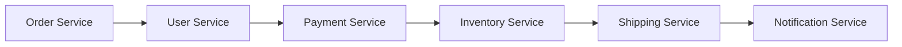
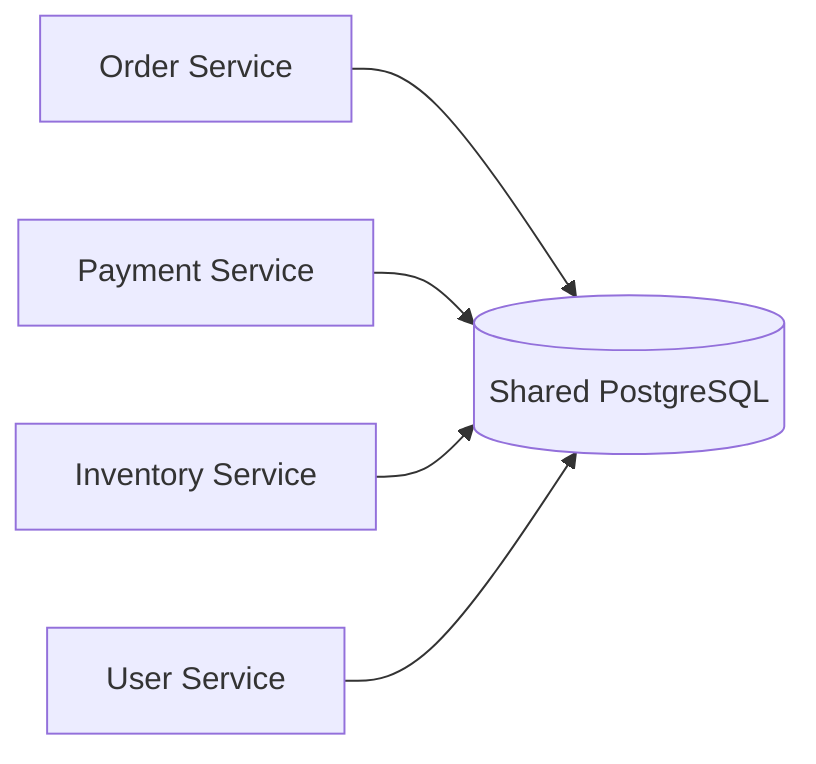
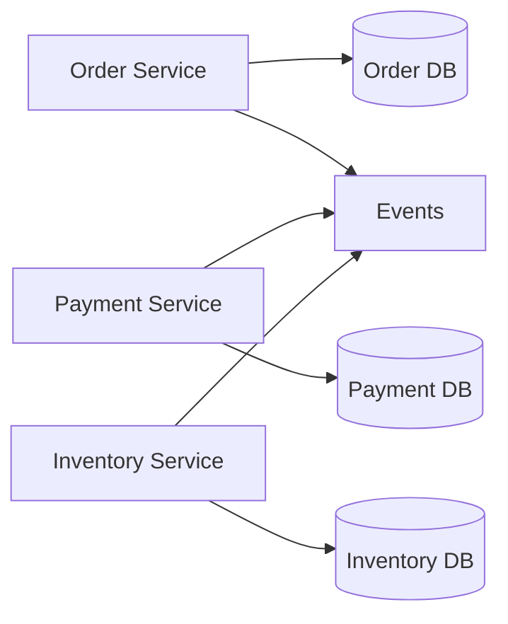
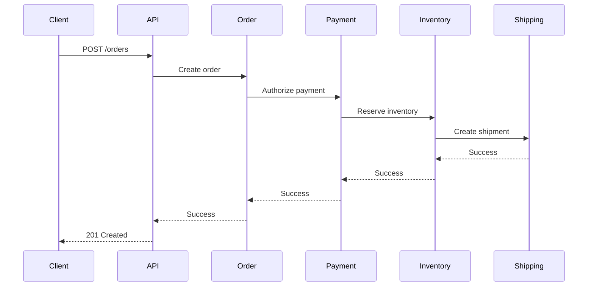
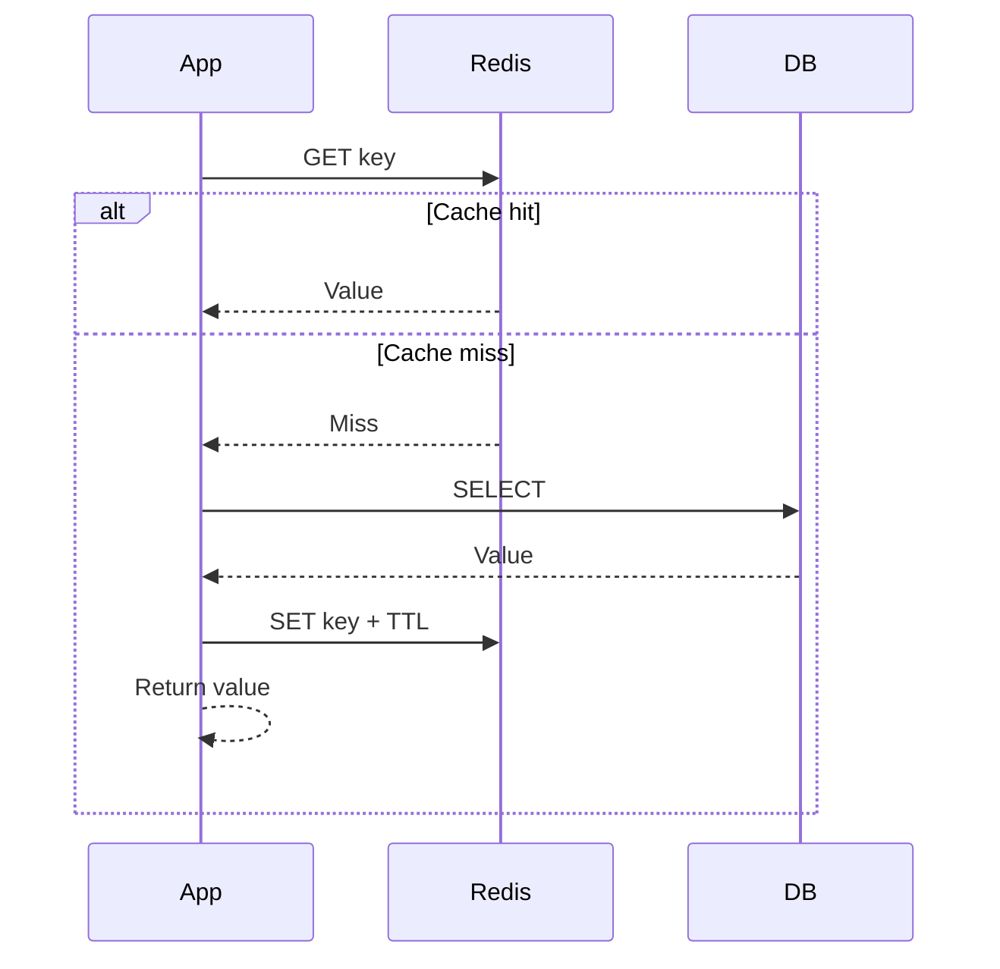
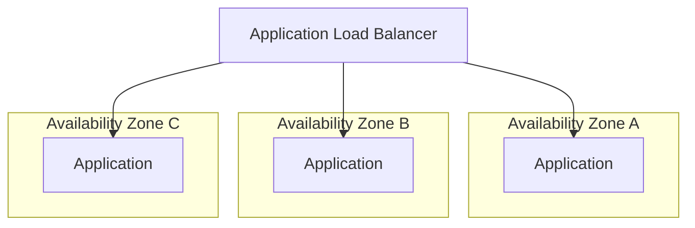
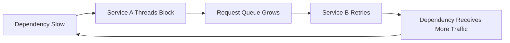

# 05- Common Architecture Anti-Patterns

## Overview

Architecture anti-patterns are recurring design approaches that appear reasonable in isolation but create significant problems when applied to production systems.

An anti-pattern is not simply a "bad technology choice." A design becomes an anti-pattern when it consistently produces undesirable consequences such as:

- Poor scalability
- Tight coupling
- Fragile deployments
- Excessive operational complexity
- Poor fault isolation
- Difficult debugging
- Security exposure
- Unpredictable costs
- Data inconsistency
- Slow development
- Low availability

AWS provides highly scalable managed services, but using more AWS services does not automatically produce a better architecture. A system can be built entirely from managed services and still suffer from poor boundaries, excessive coupling, uncontrolled data flows, and operational fragility.

Senior-level architecture work therefore requires recognizing not only **which architecture works**, but also **which architectural patterns should be avoided, under which conditions, and why**.

A useful mental model is:

```text
Requirement
    |
    v
Architecture Decision
    |
    v
Trade-offs
    |
    v
Operational Reality
    |
    +--------------------+
    |                    |
    v                    v
Good Fit            Anti-Pattern
    |                    |
    v                    v
Predictable         Complexity /
Behavior            Fragility /
                    Cost
```

An anti-pattern is often a reasonable solution applied outside the conditions where it works well.

---

## What Makes an Architecture an Anti-Pattern

A design becomes problematic when its costs consistently outweigh its benefits.

For example, synchronous communication between services is not inherently bad.

```text
Service A ---> Service B
```

It becomes problematic when:

- Service A depends on many downstream services.
- Each dependency must be available.
- Latency accumulates across the call chain.
- A downstream failure propagates upstream.
- Retries multiply traffic.
- The entire request becomes dependent on remote services.

The same design that works well for two tightly related services can become dangerous when expanded into dozens of services.

This is why architecture must be evaluated in context.

---

## Common AWS Architecture Anti-Patterns

| Anti-Pattern | Primary Risk |
|---|---|
| Distributed monolith | Microservices complexity without independence |
| Over-microservices | Excessive operational and network complexity |
| Shared database across services | Tight data coupling |
| Synchronous service chains | Cascading failures and latency |
| Distributed transaction overuse | High coordination complexity |
| Chatty service communication | Network and latency overhead |
| Event-driven everything | Difficult debugging and consistency |
| Kafka as a generic queue | Unnecessary operational complexity |
| Lambda for every workload | Poor workload fit and operational surprises |
| Serverless without limits | Uncontrolled concurrency and cost |
| Shared mutable cache | Hidden coupling and stale data |
| Cache as primary database | Data loss and consistency problems |
| Overuse of NAT Gateways | High and unnecessary networking cost |
| Publicly accessible databases | Security exposure |
| Single-AZ production workloads | Availability risk |
| Multi-Region without requirements | Complexity without meaningful benefit |
| S3 used as a database | Poor query and transaction semantics |
| DynamoDB used like SQL | Poor data-model fit |
| Over-normalized microservice boundaries | Excessive cross-service communication |
| Under-normalized relational data | Duplication and consistency problems |
| Global synchronous dependencies | Regional failure propagation |
| Retry storms | Traffic amplification |
| Missing idempotency | Duplicate side effects |
| Missing backpressure | Resource exhaustion |
| No observability strategy | Slow incident diagnosis |
| Infrastructure without ownership | Operational ambiguity |
| Architecture by service catalog | Complexity without requirements |

---

## Distributed Monolith

A distributed monolith is one of the most common microservices anti-patterns.

It occurs when an application is technically split into multiple services but those services remain tightly coupled.



The services are separate deployment units, but the request still depends on the entire chain.

### Why It Happens

Teams often decompose a monolith by splitting modules into services without redesigning ownership and communication boundaries.

The result is:

```text
Monolith
   |
   +--> Service A
   +--> Service B
   +--> Service C
```

instead of genuinely independent services.

### Problems

- Deployments remain coupled.
- Failures propagate.
- Network latency replaces function-call latency.
- Debugging becomes harder.
- Local development becomes more complicated.
- Teams cannot independently evolve services.
- Service boundaries become artificial.

### Production Guidance

A service should own a meaningful business capability and its data.

Good:

```text
Order Service
    |
    +--> Owns order lifecycle
    +--> Owns order database
    +--> Publishes order events
```

Bad:

```text
Order Service
    |
    +--> Reads User DB
    +--> Reads Inventory DB
    +--> Reads Payment DB
    +--> Writes Shipping DB
```

---

## Over-Microservices

Microservices are often introduced too early.

A system with:

```text
100 services
50 databases
20 queues
10 event streams
```

is not necessarily more scalable than a modular monolith.

Each service introduces operational overhead:

- Deployment
- Monitoring
- Logging
- Networking
- Authentication
- Authorization
- Configuration
- Secrets
- CI/CD
- On-call ownership
- Testing
- Service discovery
- Failure handling

### Warning Sign

If creating one simple feature requires changes across five services, the service boundaries may be wrong.

### Better Approach

Start with clear modular boundaries.

```text
Modular Monolith
      |
      v
Measure boundaries
      |
      v
Identify independent scaling/deployment needs
      |
      v
Extract services selectively
```

Microservices should solve a specific scaling, ownership, deployment, or isolation problem.

---

## Shared Database Across Microservices

A shared database is one of the strongest forms of hidden coupling.



The services may have independent codebases, but they share the same persistence boundary.

### Problems

One service can accidentally depend on another service's tables.

For example:

```sql
SELECT *
FROM payments
WHERE order_id = 123;
```

The Order Service now knows the Payment Service's database schema.

Changing the Payment schema can break the Order Service.

### Better Boundary



Services communicate through APIs or events rather than directly accessing another service's database.

### Important Nuance

Database-per-service does not necessarily mean one physical database server per service.

It means **logical ownership** should be clear.

Several services may share an RDS cluster while maintaining strict schema and access boundaries if that is an intentional transitional architecture.

---

## Synchronous Service Chains

A long synchronous request chain is a major reliability risk.



The overall request is now dependent on every downstream component.

If each dependency has 99.9% availability, chaining several dependencies reduces the effective availability of the overall operation.

### Problems

- Latency accumulation
- Cascading failures
- Increased timeout complexity
- Retry amplification
- Difficult capacity planning

### Better Approach

Use asynchronous processing where the business workflow allows it.

```text
API
 |
 v
Order Service
 |
 v
Event / Queue
 |
 +--> Payment Worker
 +--> Inventory Worker
 +--> Notification Worker
```

Do not make everything asynchronous blindly. Operations requiring an immediate response may still require synchronous communication.

---

## Chatty Service Communication

Chatty communication occurs when a service makes many small remote calls.

Bad:

```text
GET /order/123

Order Service
    |
    +--> User Service
    +--> Product Service
    +--> Pricing Service
    +--> Inventory Service
    +--> Shipping Service
    +--> Promotion Service
```

One API request generates many network requests.

### Why It Is Expensive

A local function call might take microseconds.

A remote call involves:

```text
DNS / service discovery
        |
        v
Connection
        |
        v
Network transmission
        |
        v
Remote processing
        |
        v
Serialization
        |
        v
Response transmission
```

At scale, this adds latency and infrastructure cost.

### Better Strategies

- Design APIs around business operations.
- Aggregate related data at appropriate boundaries.
- Use batch APIs.
- Cache stable reference data.
- Use asynchronous events where immediate consistency is unnecessary.

---

## Event-Driven Everything

Event-driven architecture is powerful, but using events for every interaction can make systems difficult to reason about.

Bad:

```text
UserCreated
    |
    v
ProfileCreated
    |
    v
PreferencesCreated
    |
    v
NotificationCreated
    |
    v
AnalyticsUpdated
    |
    v
RecommendationUpdated
```

A simple operation becomes a distributed workflow with eventual consistency.

### Problems

- Difficult debugging
- Event ordering concerns
- Duplicate events
- Replay complexity
- Schema evolution
- Eventual consistency
- Harder local development
- Difficult tracing

### Use Events When

Events are especially useful when:

- Consumers are independently interested in the information.
- Producers should not know consumers.
- Asynchronous processing is acceptable.
- Durable event history has value.
- Work can tolerate eventual consistency.

Do not replace every API call with an event simply because event-driven systems are considered scalable.

---

## Kafka as a Generic Queue

Kafka and traditional queues solve overlapping but different problems.

Using Kafka for every background job can be an anti-pattern.

### Kafka Is Well-Suited For

- Event streams
- High-throughput pipelines
- Durable event history
- Multiple independent consumers
- Replay
- Stream processing

### SQS Is Often Better For

- Background jobs
- Work queues
- Independent task processing
- Retry/DLQ workflows
- AWS-native asynchronous processing

| Requirement | SQS | Kafka |
|---|---:|---:|
| Simple task queue | Excellent | Possible but unnecessary |
| Event replay | Limited | Excellent |
| Independent consumer groups | Limited | Excellent |
| Stream processing | Limited | Excellent |
| Operational simplicity | Higher | Lower |
| High-throughput event streaming | Good | Excellent |

The anti-pattern is not "using Kafka."

The anti-pattern is introducing Kafka without a requirement that justifies its complexity.

---

## Lambda for Every Workload

Serverless does not mean every workload should run on Lambda.

Lambda works particularly well for:

- Event-driven workloads
- Short-lived processing
- API endpoints with variable traffic
- Scheduled tasks
- S3-triggered processing
- Queue consumers
- Lightweight automation

It may be less suitable for:

- Long-running processes
- Specialized runtime requirements
- Persistent connections
- Workloads requiring predictable sustained compute
- Applications with incompatible execution models

### Common Problem

A team converts every backend component into Lambda functions:

```text
Function A
Function B
Function C
Function D
Function E
Function F
```

The application can become functionally distributed without actually becoming simpler.

### Production Considerations

Evaluate:

- Invocation rate
- Execution duration
- Memory requirements
- Concurrency
- Cold-start sensitivity
- Dependency size
- Downstream service capacity
- Observability requirements

---

## Serverless Without Concurrency Controls

A serverless system can scale rapidly.

That is useful until downstream systems cannot.

```text
Traffic Spike
     |
     v
Lambda concurrency increases
     |
     v
Database connections increase
     |
     v
RDS connection limit reached
     |
     v
Requests fail
```

This is a classic serverless failure mode.

### Mitigation

Use:

- Reserved concurrency where appropriate
- Provisioned concurrency when justified
- Queue-based buffering
- RDS Proxy for appropriate Lambda-to-RDS workloads
- Connection management
- Rate limiting
- Backpressure

Scaling the compute layer does not automatically mean the entire architecture can scale.

---

## Cache as Primary Database

Redis is excellent for caching, but using a cache as the authoritative data store creates reliability and consistency problems.

Bad:

```text
Application
    |
    v
Redis
    |
    v
No durable source of truth
```

If the cache is flushed, data disappears.

### Better

```text
Application
    |
    +--> PostgreSQL
    |
    +--> Redis Cache
```

PostgreSQL remains authoritative while Redis improves read performance.

### Cache-Aside

A common pattern is:



The cache should generally be treated as disposable infrastructure unless its durability semantics are explicitly part of the system design.

---

## Shared Mutable Cache State

Multiple services writing the same cache keys can create hidden coupling.

```text
Order Service ----+
                  |
                  v
               Redis
                  ^
                  |
Payment Service --+
```

If both services interpret:

```text
order:123
```

differently, cache corruption or inconsistent behavior can result.

### Better

Define ownership and namespaces:

```text
order-service:order:123
payment-service:payment:456
```

Even better, avoid using a shared cache as an integration mechanism between services.

---

## Excessive NAT Gateway Usage

NAT Gateways are useful for allowing private resources to reach public AWS services and the internet.

However, routing large volumes of AWS service traffic through NAT can produce unnecessary cost and network complexity.

Bad:

```text
Private Subnet
      |
      v
NAT Gateway
      |
      v
S3
```

when an appropriate VPC endpoint can be used.

### Better

```text
Private Subnet
      |
      +------> S3 VPC Endpoint
      |
      +------> DynamoDB VPC Endpoint
      |
      +------> NAT Gateway ---> Internet
```

Use VPC endpoints for supported AWS services when appropriate.

### Production Considerations

Evaluate:

- NAT data processing charges
- Cross-AZ routing
- Number of NAT Gateways
- VPC endpoint costs
- Availability requirements
- Route-table design

Do not optimize NAT costs by sacrificing availability without understanding the trade-off.

---

## Publicly Accessible Databases

A production database rarely needs direct internet exposure.

Bad:

```text
Internet
   |
   v
RDS Public Endpoint
```

Better:

```text
Internet
   |
   v
ALB
   |
   v
Private Application Subnet
   |
   v
Private Database Subnet
```

Security should be enforced through multiple layers:

- Private subnets
- Security groups
- IAM where applicable
- Encryption
- Secrets management
- Network ACLs where appropriate
- Auditing
- Least privilege

A database being password-protected does not make public exposure a good architecture.

---

## Single-AZ Production Architecture

A production application running in one Availability Zone has a significant failure domain.

Bad:

```text
AZ-a
 |
 +--> EC2
 +--> RDS
 +--> Redis
```

An AZ-level failure can impact the entire application.

Better:



For stateful components, use services and configurations that support the required availability model.

---

## Multi-Region Without a Requirement

Multi-Region architecture is not automatically better than Multi-AZ.

It introduces:

- Cross-region replication
- Data consistency challenges
- Traffic routing complexity
- Deployment complexity
- Higher costs
- Operational complexity
- More difficult incident response

Before implementing Multi-Region, define:

- RTO
- RPO
- Regional failure requirements
- Data residency requirements
- Expected downtime tolerance
- Operational maturity

### Comparison

| Architecture | Complexity | Typical Use |
|---|---:|---|
| Single-AZ | Low | Development / non-critical workloads |
| Multi-AZ | Moderate | Most production workloads |
| Multi-Region active-passive | High | Strong DR requirements |
| Multi-Region active-active | Very high | Extreme availability / global workloads |

A Multi-Region architecture without a business requirement is often an expensive form of over-engineering.

---

## Global Synchronous Dependencies

A particularly dangerous Multi-Region pattern is making regions synchronously dependent on each other.

```text
Region A
   |
   | synchronous request
   v
Region B
```

If Region B becomes slow or unavailable, Region A is affected.

A resilient design generally minimizes cross-region synchronous dependencies.

Prefer:

```text
Region A
   |
   v
Local processing
   |
   v
Asynchronous replication
   |
   v
Region B
```

The exact architecture depends on consistency requirements.

---

## S3 Used as a Database

S3 is an object store, not a general-purpose transactional database.

Bad:

```text
Application
    |
    v
S3
    |
    +--> Search records
    +--> Update individual rows
    +--> Maintain transactions
```

S3 is excellent for:

- Documents
- Images
- Backups
- Data lakes
- Large objects
- Static assets
- Event archives

Use a database when the workload requires:

- Transactions
- Complex queries
- Row-level updates
- Relational constraints
- Low-latency indexed lookups

A common architecture is:

```text
PostgreSQL
    |
    +--> Metadata

S3
    |
    +--> Large Object
```

---

## Treating DynamoDB Like a Relational Database

DynamoDB requires access-pattern-driven data modeling.

A common anti-pattern is designing DynamoDB tables as if they were PostgreSQL tables.

Relational mindset:

```text
Users
Orders
Products
```

followed by arbitrary queries.

DynamoDB mindset:

```text
What queries must be fast?

Get orders by customer
Get order by ID
Get active orders by status
```

The table design should support those access patterns.

### Common Mistakes

- Excessive scans
- Missing appropriate keys
- Ignoring hot partitions
- Poor item-size management
- Assuming joins exist
- Designing tables before defining access patterns

---

## Over-Normalized Microservice Boundaries

A service boundary can become too granular.

For example:

```text
Customer Name Service
Customer Address Service
Customer Email Service
Customer Preference Service
```

A customer profile request now requires many network calls.

A better boundary may be:

```text
Customer Service
    |
    +--> Profile
    +--> Address
    +--> Preferences
```

Service boundaries should reflect business capabilities rather than individual database tables or classes.

---

## Under-Defined Service Ownership

A service should have clear ownership.

Bad:

```text
Order Service
Payment Service
User Service

Who owns:
- Customer status?
- Order pricing?
- Payment state?
- Inventory reservation?
```

Ambiguous ownership produces:

- Duplicate data
- Conflicting writes
- Inconsistent business rules
- Difficult debugging

Define ownership explicitly.

```text
Order Service
    Owns:
    - Order state
    - Order lifecycle

Payment Service
    Owns:
    - Payment state
    - Payment lifecycle
```

---

## Distributed Transactions Everywhere

Distributed transactions are expensive to coordinate.

Trying to make multiple independent databases behave like one ACID transaction can create significant complexity.

Bad:

```text
BEGIN
 |
 +--> Order DB
 |
 +--> Payment DB
 |
 +--> Inventory DB
 |
COMMIT
```

If one participant fails, the system needs distributed coordination.

Prefer patterns such as:

- Saga
- Transactional outbox
- Idempotent consumers
- Compensating actions
- Event-driven workflows

Example:

```text
Create Order
    |
    v
Reserve Inventory
    |
    v
Authorize Payment
    |
    v
Confirm Order
```

If payment fails:

```text
Payment Failed
    |
    v
Release Inventory
    |
    v
Cancel Order
```

Distributed transactions should be used only when the consistency requirements genuinely justify the complexity.

---

## Retry Storms

Retries are necessary in distributed systems, but uncontrolled retries can amplify failures.

```text
100 requests
    |
    v
Service B fails
    |
    v
Each request retries 3 times
    |
    v
300 requests
```

If the downstream service is already overloaded, retries make the outage worse.

### Better Retry Strategy

Use:

- Exponential backoff
- Jitter
- Maximum retry counts
- Dead-letter queues
- Circuit breakers where appropriate
- Request deadlines
- Idempotency

Example:

```text
Initial request
      |
      v
Failure
      |
      v
Wait 100 ms + jitter
      |
      v
Retry
      |
      v
Wait 200 ms + jitter
      |
      v
Retry
      |
      v
Stop
```

Do not retry every error.

Authentication failures, validation failures, and many client errors should not be retried.

---

## Missing Timeouts

A remote request without a bounded timeout can consume resources indefinitely.

Bad:

```python
response = requests.get(url)
```

Better:

```python
import requests

response = requests.get(
    url,
    timeout=(2, 5),
)
response.raise_for_status()
```

For production systems, timeout policies should be consistent across service clients.

Timeouts should account for:

- Connection establishment
- Request processing
- Dependency latency
- Overall request deadline

A timeout should prevent resource exhaustion, not simply hide slow dependencies.

---

## Retry Without Idempotency

Consider:

```text
POST /payments
```

The client sends a payment request.

The server processes the payment, but the response is lost.

The client retries.

Without idempotency, the payment may be charged twice.

### Better

Use an idempotency key:

```http
POST /payments
Idempotency-Key: 8b3c7a7f-5d32-4e6f-9a7e-123456789abc
```

The server stores the result associated with the key.

```text
Request 1
   |
   v
Process payment
   |
   v
Store result
   |
   v
Response lost

Request 2
   |
   v
Same idempotency key
   |
   v
Return existing result
```

Idempotency is essential for many distributed operations.

---

## Missing Backpressure

Backpressure prevents a fast producer from overwhelming a slower consumer.

Bad:

```text
Producer
   |
   | unlimited traffic
   v
Consumer
   |
   v
CPU / memory exhaustion
```

Better:

```text
Producer
   |
   v
Queue
   |
   v
Controlled Consumers
```

Useful mechanisms include:

- SQS
- Kafka
- Rate limits
- Bounded worker pools
- Queue depth thresholds
- Consumer concurrency limits

Backpressure is especially important when processing:

- Large workloads
- External APIs
- Database-heavy jobs
- Expensive CPU operations

---

## Unbounded Queues

A queue can hide overload instead of solving it.

```text
Producer: 10,000 msg/sec
Consumer: 1,000 msg/sec

Queue:
1,000
2,000
3,000
...
10,000,000
```

Eventually the queue becomes a delayed-failure mechanism.

Monitor:

- Queue depth
- Oldest message age
- Consumer throughput
- Processing latency
- Error rate

Define operational thresholds and scaling policies.

---

## No Dead-Letter Queue

Messages can fail repeatedly.

Without a DLQ:

```text
Message
   |
   v
Consumer
   |
   v
Failure
   |
   v
Retry
   |
   v
Failure
   |
   v
Retry forever
```

A dead-letter queue isolates poison messages.

```text
Main Queue
    |
    v
Consumer
    |
    +---- Success
    |
    +---- Failure
             |
             v
        Retry Policy
             |
             v
            DLQ
```

DLQs should be monitored and have an operational recovery procedure.

---

## Missing Observability

Distributed systems without observability are extremely difficult to operate.

A system may have:

```text
Django
FastAPI
ECS
Lambda
SQS
Kafka
Redis
RDS
ALB
```

but if logs and traces cannot connect a request across components, diagnosing failures becomes guesswork.

### Minimum Observability Model

```text
Logs
  +
Metrics
  +
Distributed Tracing
  +
Correlation IDs
  |
  v
Operational Visibility
```

Track at minimum:

- Request rate
- Error rate
- Latency
- Saturation
- Queue depth
- Database health
- Cache hit ratio
- Dependency failures

---

## Missing Correlation IDs

A request might pass through:

```text
ALB
 |
 v
API
 |
 v
Order Service
 |
 v
Payment Service
 |
 v
SQS
 |
 v
Worker
```

Without correlation metadata, connecting logs is difficult.

Use a request/correlation identifier:

```text
X-Request-ID: 7b3c...
```

Propagate it through service calls and asynchronous processing where appropriate.

For distributed tracing, use standards such as W3C Trace Context where supported.

---

## Logging Sensitive Data

A common security anti-pattern is logging:

```text
Authorization: Bearer <token>
password=...
credit_card=...
secret=...
```

Logs are often replicated into centralized systems and retained for significant periods.

Do not log:

- Passwords
- Access tokens
- Private keys
- Session secrets
- Sensitive payment information
- Unnecessary personal information

Use structured logging and explicit redaction policies.

---

## Secrets in Source Code

Bad:

```python
DATABASE_PASSWORD = "super-secret-password"
```

Secrets committed to Git can remain in repository history even after the line is deleted.

Prefer managed secret storage such as:

- AWS Secrets Manager
- AWS Systems Manager Parameter Store
- Kubernetes Secrets with appropriate controls
- CI/CD secret stores

Applications should retrieve secrets securely at runtime.

---

## Overly Broad IAM Permissions

This is an example of excessive privilege:

```json
{
  "Effect": "Allow",
  "Action": "*",
  "Resource": "*"
}
```

Prefer least privilege.

For example:

```json
{
  "Effect": "Allow",
  "Action": [
    "s3:GetObject"
  ],
  "Resource": "arn:aws:s3:::application-bucket/uploads/*"
}
```

IAM permissions should match the application's actual operations.

Review:

- Service roles
- Task roles
- Lambda execution roles
- CI/CD roles
- Human access
- Cross-account access

---

## Public S3 Buckets by Default

A static website or public asset requirement does not justify broadly public access to an entire bucket.

Prefer:

```text
Client
   |
   v
CloudFront
   |
   v
S3
```

with controlled access to the origin where applicable.

Separate:

- Public assets
- Private application data
- Backups
- Logs

Do not use a single bucket policy for unrelated data classes.

---

## Architecture by AWS Service Catalog

A common beginner mistake is designing systems around AWS services instead of requirements.

Bad thought process:

```text
"I need an architecture."

Lambda
API Gateway
DynamoDB
SQS
SNS
EventBridge
Kinesis
Step Functions
ECS
CloudFront
```

This is service-driven architecture.

Better:

```text
Requirements
    |
    +--> Traffic
    +--> Consistency
    +--> Availability
    +--> Latency
    +--> Security
    +--> Cost
    +--> Operations
    |
    v
Architecture
    |
    v
AWS Services
```

AWS services should implement architectural requirements, not define them.

---

## Overengineering

Overengineering occurs when a system introduces complexity without a corresponding requirement.

Example:

```text
Requirement:
Internal API with 500 requests/sec

Architecture:
Multi-region active-active
Kafka
EKS
Service mesh
Event sourcing
CQRS
DynamoDB
Redis Cluster
Global Accelerator
```

The architecture may be technically impressive but operationally unjustified.

A simpler architecture might be:

```text
ALB
 |
 v
ECS
 |
 +--> RDS
 +--> Redis
```

Start with the simplest architecture that satisfies the requirements and evolve it when measured constraints justify additional complexity.

---

## Underengineering

The opposite problem is also common.

Example:

```text
Production payment system

Architecture:
Single EC2
SQLite
No backups
No monitoring
Public database
Manual deployment
```

Simplicity is valuable only when it satisfies requirements.

The objective is not:

> Use the fewest components.

The objective is:

> Use the minimum necessary complexity to satisfy reliability, security,
> performance, scalability, and operational requirements.

---

## Premature Optimization

Architecture decisions should be based on actual requirements and measured bottlenecks.

Examples of premature optimization:

- Introducing Kafka before queue throughput requires it
- Introducing Redis before database performance is measured
- Introducing Kubernetes before container orchestration complexity exists
- Introducing Multi-Region before RTO/RPO requirements justify it
- Introducing sharding before database capacity requires it

Use measurement:

```text
Requirement
    |
    v
Baseline
    |
    v
Measure bottleneck
    |
    v
Optimize
    |
    v
Measure again
```

---

## No Capacity Planning

A system can work perfectly at current traffic and still fail under expected growth.

Estimate:

- Requests/sec
- Peak requests/sec
- Payload size
- Database operations/sec
- Queue throughput
- Storage growth
- Network traffic
- Concurrent users
- Background processing rate

Example:

```text
Average:
1,000 req/sec

Peak:
5,000 req/sec

Expected annual growth:
2x
```

Architecture should be evaluated against peak and growth requirements, not only today's average.

---

## Ignoring AWS Service Quotas

AWS services have quotas and limits.

An architecture can fail because a service limit was never considered.

Examples include:

- Lambda concurrency
- API Gateway limits
- ECS quotas
- VPC limits
- NAT Gateway throughput characteristics
- SQS throughput characteristics
- RDS connections
- DynamoDB capacity
- KMS request quotas

Production architecture should identify important quotas early and monitor or request increases where appropriate.

---

## Single Dependency Bottlenecks

A highly available architecture can still contain a single critical dependency.

Example:

```text
Multi-AZ Application
      |
      v
Single external API
```

If the external API fails, the entire workflow may fail.

Review dependencies across:

- AWS services
- Databases
- External APIs
- DNS
- Authentication providers
- Payment providers
- Messaging systems

High availability is a property of the entire dependency graph, not one component.

---

## Cascading Failures

A failure in one component can propagate through the system.



This creates a feedback loop.

Mitigation includes:

- Timeouts
- Circuit breakers
- Bulkheads
- Rate limits
- Backpressure
- Bounded concurrency
- Graceful degradation
- Asynchronous processing

---

## Resource Contention

Different workloads sharing the same resources can interfere with each other.

For example:

```text
ECS Cluster
 |
 +--> API Service
 +--> CPU-heavy Worker
 +--> Report Generator
```

A report-generation workload may consume CPU and degrade API latency.

Possible solutions include:

- Separate ECS services
- Separate capacity providers
- Resource reservations
- Dedicated worker pools
- Queue-based workload isolation

This is the **bulkhead principle**: isolate failure and resource domains where necessary.

---

## No Failure Isolation

A failure should not consume the entire system's resources.

Bad:

```text
One worker type
    |
    v
Shared worker pool
    |
    +--> Email
    +--> Reports
    +--> Payments
    +--> Data imports
```

A large report-generation workload can starve payment processing.

Better:

```text
SQS Email Queue ----> Email Workers
SQS Report Queue ---> Report Workers
SQS Payment Queue --> Payment Workers
```

Separate critical workloads from non-critical workloads.

---

## Treating Availability as a Single Number

Saying:

```text
"Our system is highly available."
```

is not enough.

Evaluate:

- Application availability
- Database availability
- Dependency availability
- Deployment availability
- Data durability
- Recovery capability
- Regional availability

Also distinguish:

```text
Availability
```

from:

```text
Durability
```

A durable database can preserve data while being temporarily unavailable.

---

## No Disaster Recovery Strategy

Backups alone do not constitute disaster recovery.

A complete DR strategy should define:

- RTO
- RPO
- Backup frequency
- Backup retention
- Restore procedures
- Recovery environment
- DNS/traffic failover
- Data replication
- Validation procedures
- Ownership

A backup that has never been restored should not be treated as a proven recovery mechanism.

---

## Untested Backups

A common anti-pattern is:

```text
Backup enabled
    |
    v
Assume recovery works
```

Better:

```text
Backup
   |
   v
Restore Test
   |
   v
Application Validation
   |
   v
Recovery Measurement
```

Test:

- Backup integrity
- Restore time
- Database recovery
- Application startup
- Configuration recovery
- Secrets availability
- DNS routing
- Dependent services

---

## Blue-Green Without Data Compatibility

Blue-green deployment can fail if the new application version is incompatible with the existing database schema.

```text
Blue Application ---> Database <--- Green Application
```

If Green expects a schema that Blue cannot understand, rollback becomes unsafe.

Prefer backward-compatible migrations:

```text
Expand
   |
   v
Deploy Compatible Application
   |
   v
Migrate Data
   |
   v
Contract
```

Database migrations should be designed with deployment and rollback strategy in mind.

---

## Deployment Coupling

If every service must be deployed together, service independence is mostly theoretical.

Bad:

```text
Service A changed
    |
    v
Deploy A + B + C + D + E
```

Better:

```text
Service A
    |
    v
Independent CI/CD pipeline
```

Independent deployment requires:

- Backward-compatible contracts
- Stable APIs
- Versioning where necessary
- Independent testing
- Clear ownership

---

## Breaking API Contracts

A producer should not suddenly remove fields consumed by existing clients.

Bad:

```json
{
  "customer_name": "Alice"
}
```

becoming:

```json
{
  "name": "Alice"
}
```

without compatibility planning.

Safer evolution:

```json
{
  "customer_name": "Alice",
  "name": "Alice"
}
```

Consumers can migrate before the old field is removed.

Contract testing can help detect incompatible changes.

---

## Tight Coupling Through Shared Libraries

Shared libraries can become a hidden distributed coupling mechanism.

For example:

```text
Service A
   |
   v
shared-business-library v4

Service B
   |
   v
shared-business-library v4
```

A small change can require multiple service upgrades.

Shared libraries are useful for:

- Security primitives
- Logging
- Observability
- Common infrastructure utilities
- Stable technical abstractions

Avoid using them to share large amounts of business logic between independently owned services.

---

## Configuration Anti-Patterns

Hard-coded environment-specific configuration creates deployment problems.

Bad:

```python
DATABASE_HOST = "production-db.internal"
```

Prefer environment or managed configuration:

```python
import os

DATABASE_HOST = os.environ["DATABASE_HOST"]
```

For production systems, configuration should be managed through controlled mechanisms such as:

- ECS task configuration
- AWS Systems Manager Parameter Store
- AWS Secrets Manager
- Kubernetes configuration
- CI/CD environment configuration

Do not commit environment-specific secrets or infrastructure endpoints unnecessarily.

---

## No Environment Isolation

Development, staging, and production should have appropriate isolation.

Bad:

```text
Development ---> Production Database
```

A developer mistake can affect production data.

Use appropriate separation:

```text
Development
    |
    v
Dev AWS Account / Environment

Staging
    |
    v
Staging AWS Account / Environment

Production
    |
    v
Production AWS Account / Environment
```

AWS Organizations and multi-account strategies are commonly used for stronger isolation.

---

## Excessive Cross-Account Complexity

Account separation is valuable for isolation, but excessive cross-account dependencies can become difficult to operate.

Evaluate:

- IAM roles
- Resource policies
- Network connectivity
- DNS
- KMS keys
- Logging
- Deployment permissions

Use account boundaries intentionally rather than creating them without an ownership or security reason.

---

## No Ownership Model

Every production component should have an owner.

For example:

| Component | Owner |
|---|---|
| Order Service | Orders Team |
| Payment Service | Payments Team |
| RDS Cluster | Database Platform |
| Kafka | Platform Team |
| CI/CD | Developer Platform |
| VPC | Cloud Platform |

An architecture without ownership becomes operational debt.

Ownership should cover:

- Deployment
- Monitoring
- Incidents
- Security
- Capacity
- Documentation
- Lifecycle management

---

## Architecture Drift

Architecture documentation can become stale.

Example:

```text
Architecture Diagram:
ECS -> RDS

Actual:
ECS -> Redis -> RDS
     -> SQS
     -> External API
```

Stale documentation creates operational risk.

Keep important architecture artifacts version-controlled and update them as part of meaningful architectural changes.

ADRs are particularly useful for preserving architectural history.

---

## Ignoring Operational Complexity

A design may look elegant but be difficult to operate.

Consider:

```text
Technology Complexity
        +
Operational Complexity
        +
Organizational Complexity
```

For example:

```text
EKS
+ Service Mesh
+ Kafka
+ Multi-Region
+ Event Sourcing
+ CQRS
```

may be technically valid while exceeding the operational maturity of the organization.

Architecture should be evaluated against the team's ability to operate it.

---

## Using Service Mesh Prematurely

Service meshes can provide:

- Traffic management
- mTLS
- Observability
- Policy enforcement
- Retries
- Routing

But they also introduce:

- Sidecars or equivalent data-plane components
- Control-plane complexity
- Additional networking layers
- Debugging complexity
- Resource overhead

Do not introduce a service mesh simply because the architecture uses microservices.

Introduce it when concrete requirements justify it.

---

## Overusing API Gateways

An API Gateway is useful for:

- Authentication integration
- Rate limiting
- Routing
- API management
- External API exposure

It can become an anti-pattern when every internal service communication must pass through a centralized gateway.

Bad:

```text
Service A
   |
   v
API Gateway
   |
   v
Service B
```

for every internal call.

Internal service-to-service communication may be better handled through direct private networking, service discovery, or an appropriate service mesh depending on requirements.

---

## One Giant API Gateway

A gateway can become a centralized bottleneck for:

- Routing
- Authentication
- Business logic
- Transformation
- Aggregation
- Authorization
- Rate limiting

If the gateway contains significant business logic, it can become another monolith.

Prefer keeping the gateway focused on cross-cutting concerns.

---

## Nginx as an Application Layer

Nginx is excellent for:

- Reverse proxying
- TLS termination
- Load balancing
- Static assets
- Request routing

It should not become a place where complex business rules accumulate.

Bad:

```text
Nginx
 |
 +--> Authentication logic
 +--> Business rules
 +--> Database access
 +--> Complex request transformation
```

Business logic belongs in application services.

---

## No Graceful Degradation

A system does not always need every dependency to function.

For example:

```text
Product API
    |
    +--> Recommendation Service
```

If recommendations fail, the product page may still be usable.

Better:

```text
Recommendation Service unavailable
        |
        v
Return product data without recommendations
```

Graceful degradation can significantly improve resilience.

---

## No Rate Limiting

Public APIs without rate limiting can be overwhelmed by:

- Accidental traffic spikes
- Misbehaving clients
- Abuse
- Bots
- Retry loops

Implement rate limiting at appropriate layers:

```text
Client
  |
  v
CloudFront / WAF / API Gateway / ALB
  |
  v
Application
```

The appropriate layer depends on the traffic pattern and architecture.

---

## No Protection Against Thundering Herds

A cache expiration can cause many requests to simultaneously query the database.

```text
Cache expires
    |
    +--> Request 1 --> DB
    +--> Request 2 --> DB
    +--> Request 3 --> DB
    +--> Request 4 --> DB
    +--> ...
```

This is the thundering herd problem.

Mitigations include:

- Randomized TTLs
- Request coalescing
- Distributed locks where appropriate
- Cache warming
- Stale-while-revalidate strategies

Do not add distributed locks automatically; they introduce their own failure modes.

---

## No Connection Pooling

Opening a new database connection for every request is inefficient.

Bad:

```text
HTTP Request
    |
    v
Open DB connection
    |
    v
Query
    |
    v
Close connection
```

Prefer connection pooling where supported and appropriate.

However, connection pooling must be sized carefully.

If:

```text
100 application instances
x
20 DB connections
=
2,000 possible connections
```

the database may become overloaded.

Scaling application instances can therefore create database connection pressure.

---

## Database as a Bottleneck

Adding more application servers does not necessarily increase system capacity.

```text
100 ECS Tasks
      |
      v
Single RDS Instance
```

If the database is the bottleneck, application scaling can make the problem worse.

Monitor:

- CPU
- Memory
- IOPS
- Connections
- Lock contention
- Query latency
- Buffer/cache behavior
- Replication lag

Scale the actual bottleneck rather than blindly scaling application compute.

---

## Read Replica Misuse

Read replicas can improve read scalability, but they introduce replication lag.

A request immediately after a write may read stale data.

```text
Write
  |
  v
Primary
  |
  | replication
  v
Replica
```

Do not route every read to replicas if the application requires read-after-write consistency.

Use replicas where eventual consistency is acceptable.

---

## Ignoring Data Ownership

Multiple services writing the same business entity creates conflicting authority.

Bad:

```text
Order Service ---> orders.status
Payment Service -> orders.status
Admin Service ---> orders.status
```

Who owns the state transition?

Better:

```text
Order Service
     |
     v
Order State
```

Other services request changes through APIs or events.

Clear ownership reduces data corruption and inconsistent business rules.

---

## Overusing Synchronous Database Reads

A service should not perform expensive database queries for every request when the information can safely be cached or derived.

However, caching should be based on measured access patterns.

Evaluate:

- Query latency
- Query frequency
- Data volatility
- Cache hit ratio
- Consistency requirements

Caching is a performance optimization, not a default architecture requirement.

---

## Common Architecture Anti-Pattern Detection Questions

When reviewing a design, ask:

### Boundaries

- Who owns this data?
- Can this service be deployed independently?
- Does this service depend directly on another service's database?

### Communication

- Which calls are synchronous?
- Which operations can be asynchronous?
- What happens if the dependency is unavailable?
- Are timeouts defined?
- Are retries bounded?

### Data

- What is the source of truth?
- What consistency model is required?
- Can stale data be tolerated?
- How is data recovered?

### Scalability

- What is the bottleneck?
- What happens at 10x traffic?
- What AWS quotas apply?
- Can one workload starve another?

### Reliability

- What happens when an Availability Zone fails?
- What happens when a dependency becomes slow?
- What happens when a queue grows indefinitely?
- What happens when a database becomes unavailable?

### Security

- Is anything unnecessarily public?
- Are IAM permissions least-privilege?
- Are secrets protected?
- Is sensitive data logged?

### Operations

- Who owns each component?
- How is it monitored?
- How is it deployed?
- How is it rolled back?
- How is it recovered?

### Cost

- What are the major cost drivers?
- Is cross-AZ traffic significant?
- Is NAT traffic significant?
- Is Multi-Region actually required?

---

## Architecture Review Heuristics

A useful architecture review can be organized around these dimensions:

```text
                    Architecture
                         |
       +-----------------+-----------------+
       |                 |                 |
   Reliability       Scalability        Security
       |                 |                 |
       +-----------------+-----------------+
                         |
                    Operations
                         |
                    Cost / Trade-offs
```

A design should be evaluated holistically.

Optimizing one dimension can damage another.

For example:

```text
More replication
      |
      v
Higher availability
      |
      v
Higher cost + consistency complexity
```

There is rarely a universally optimal architecture.

---

## Anti-Pattern vs Trade-Off

Not every undesirable property is an anti-pattern.

For example:

```text
Synchronous communication
```

is not automatically an anti-pattern.

It becomes one when synchronous coupling creates unacceptable:

- Latency
- Failure propagation
- Scaling constraints
- Availability dependencies

Similarly:

```text
Monolith
```

is not automatically an anti-pattern.

A well-designed modular monolith can be simpler and more reliable than an unnecessarily distributed microservice architecture.

The important question is:

> Does the architecture satisfy the requirements at an acceptable level of complexity and operational risk?

---

## Practical Architecture Review Checklist

Use this checklist during system-design reviews.

### Architecture

- [ ] Are service boundaries based on business capabilities?
- [ ] Is the architecture no more complex than necessary?
- [ ] Are deployment boundaries meaningful?
- [ ] Is ownership clearly defined?

### Communication

- [ ] Are synchronous dependencies intentional?
- [ ] Are timeouts configured?
- [ ] Are retries bounded?
- [ ] Is idempotency implemented where needed?
- [ ] Is backpressure present?

### Data

- [ ] Does each domain have a clear source of truth?
- [ ] Are database boundaries explicit?
- [ ] Is the consistency model appropriate?
- [ ] Are replication and recovery requirements understood?

### AWS

- [ ] Are workloads deployed across appropriate Availability Zones?
- [ ] Are private resources actually private?
- [ ] Are AWS service quotas understood?
- [ ] Are unnecessary NAT/data-transfer costs avoided?
- [ ] Are IAM permissions least-privilege?

### Scalability

- [ ] Is the real bottleneck understood?
- [ ] Can compute scale independently?
- [ ] Can the database handle peak load?
- [ ] Can queues absorb bursts safely?
- [ ] Are concurrency limits defined?

### Reliability

- [ ] Are dependencies isolated?
- [ ] Are circuit breakers or equivalent controls needed?
- [ ] Are DLQs configured where appropriate?
- [ ] Are backups tested?
- [ ] Are RTO and RPO defined?

### Observability

- [ ] Are logs structured?
- [ ] Are sensitive values redacted?
- [ ] Are metrics available?
- [ ] Is distributed tracing available where useful?
- [ ] Can requests be correlated across services?

### Operations

- [ ] Does every component have an owner?
- [ ] Is deployment automated?
- [ ] Is rollback understood?
- [ ] Are architecture decisions documented through ADRs?
- [ ] Are operational runbooks available?

---

## Key Takeaways

- Architecture anti-patterns are usually failures of **context, boundaries, trade-offs, or operational design**, not simply bad technology choices.
- Avoid distributed monoliths, shared databases, excessive synchronous dependencies, uncontrolled retries, and unnecessary microservices because they create coupling and failure propagation.
- AWS managed services do not eliminate architecture responsibility; service quotas, networking, IAM, data consistency, cost, and operational ownership still matter.
- Prefer the simplest architecture that satisfies measurable requirements, then introduce complexity only when scalability, reliability, security, or organizational constraints justify it.
- A production architecture review should evaluate **boundaries, communication, data ownership, reliability, scalability, security, observability, operations, and cost together**.