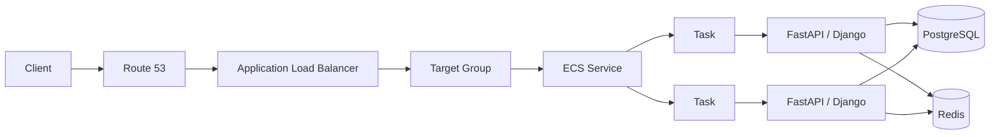
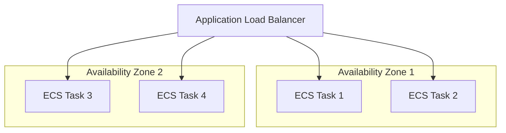

# 01- ECS Architecture

## Overview

Amazon Elastic Container Service (Amazon ECS) is a managed container orchestration service for running Docker containers on AWS. ECS manages the lifecycle of containers, service scheduling, networking, health checks, deployments, scaling, and integration with other AWS services.

For backend systems, ECS is commonly used to deploy Django, FastAPI, REST, gRPC, Celery workers, background services, and microservices without operating a Kubernetes control plane.

An ECS architecture typically separates the following responsibilities:

- **Cluster** — logical boundary for ECS workloads.
- **Task definition** — immutable blueprint describing how containers should run.
- **Task** — a running instance of a task definition.
- **Service** — maintains the desired number of task instances and manages deployments.
- **Container** — the application process running inside a task.
- **Networking** — determines how tasks communicate with clients and other services.
- **Load balancer** — distributes incoming traffic across healthy tasks.
- **IAM** — controls what ECS tasks and ECS infrastructure can access.
- **CloudWatch** — provides logs, metrics, and operational visibility.

ECS supports two primary compute models:

| Model | Responsibility | Typical Use |
|---|---|---|
| Fargate | AWS manages the underlying compute infrastructure | Most new containerized applications |
| EC2 | You manage the EC2 instances running ECS tasks | Specialized workloads, cost optimization, custom infrastructure requirements |

A production ECS architecture is therefore more than "running Docker containers." The important engineering decisions involve networking, task placement, scaling, deployment strategy, security boundaries, observability, and failure handling.

## ECS Architecture Model

The core relationship between ECS resources is:

```text
ECS Cluster
    |
    +-- ECS Service
    |      |
    |      +-- Task
    |      |     +-- Container
    |      |     +-- Container
    |      |
    |      +-- Task
    |            +-- Container
    |            +-- Container
    |
    +-- ECS Service
           |
           +-- Task
                 +-- Container
```

A **cluster** can contain multiple services. A service maintains multiple tasks. A task can contain one or more containers.

For a typical backend application, one task may contain a single application container:

```text
ECS Service
    |
    +-- Task
    |     |
    |     +-- FastAPI Container
    |
    +-- Task
    |     |
    |     +-- FastAPI Container
    |
    +-- Task
          |
          +-- FastAPI Container
```

For tightly coupled containers, a task can contain multiple containers. This is useful when containers need to share lifecycle, networking, or storage characteristics.

## Core Components

### ECS Cluster

An ECS cluster is a logical grouping of ECS services and standalone tasks.

The cluster itself is not equivalent to a Kubernetes cluster in terms of infrastructure ownership. With Fargate, AWS manages the underlying compute infrastructure. With ECS on EC2, the cluster schedules tasks onto ECS container instances backed by EC2.

A cluster may contain unrelated workloads:

```text
Production ECS Cluster
    |
    +-- API Service
    |
    +-- Worker Service
    |
    +-- Scheduler Service
    |
    +-- Notification Service
```

For larger organizations, separate clusters can be useful for isolation between environments, teams, compliance boundaries, or operational domains.

However, creating a cluster for every individual service is usually unnecessary.

### Task Definition

A task definition is the deployment blueprint for an ECS task.

It specifies configuration such as:

- Container images
- CPU and memory
- Container ports
- Environment variables
- Secrets
- IAM roles
- Logging configuration
- Health checks
- Volumes
- Networking-related settings
- Linux capabilities and runtime configuration

Conceptually:

```text
Task Definition
    |
    +-- Container Image
    +-- CPU / Memory
    +-- Port Configuration
    +-- Environment Variables
    +-- Secrets
    +-- IAM Roles
    +-- Logging
    +-- Health Check
    +-- Storage
```

Task definitions are versioned. A deployment normally creates a new task definition revision rather than modifying already-running tasks in place.

This gives ECS a reproducible deployment model:

```text
Task Definition Revision 1
        |
        v
    Running Tasks

Task Definition Revision 2
        |
        v
    New Deployment
        |
        v
    New Running Tasks
```

This versioning is important for rollback and deployment auditing.

### Task

A task is a running instance of a task definition.

If a service has a desired count of three:

```text
Desired Count = 3

Task 1
Task 2
Task 3
```

ECS attempts to maintain that desired capacity.

If Task 2 crashes, the service scheduler can start a replacement task:

```text
Task 1     Running
Task 2     Stopped
Task 3     Running
             |
             v
       Replacement Task
             |
             v
          Running
```

This is one of the fundamental reliability properties of ECS services.

### Container

A container is the actual application process defined within the task.

For example:

```text
Task
    |
    +-- FastAPI Container
```

A task can also contain multiple containers:

```text
Task
    |
    +-- Application Container
    |
    +-- Sidecar Container
```

Multiple containers within a task are appropriate when the containers have a strong lifecycle relationship. They should not be used merely as a convenient way to deploy unrelated services.

### ECS Service

An ECS service maintains a desired number of running tasks.

For example:

```text
Service Configuration

Desired Count: 4

Task 1 -> Running
Task 2 -> Running
Task 3 -> Running
Task 4 -> Running
```

The service is responsible for maintaining that desired state and can integrate with:

- Application Load Balancer
- Auto Scaling
- Service discovery
- Deployment configuration
- Health checks
- Capacity providers

A service is normally the primary ECS abstraction used for long-running backend applications.

Standalone tasks are more appropriate for one-off jobs, administrative operations, migrations, or batch processing.

## ECS Request Flow

A common production architecture for a backend API looks like this:



The request path is typically:

1. Client resolves the application domain through Route 53.
2. DNS resolves to the load balancer.
3. The Application Load Balancer receives the HTTP/HTTPS request.
4. The listener evaluates the configured listener rules.
5. The target group selects a healthy ECS task.
6. The request reaches the application container.
7. The application communicates with dependencies such as PostgreSQL or Redis.
8. The response travels back through the load balancer to the client.

The load balancer should normally route traffic only to healthy tasks.

## ECS Networking Architecture

Networking is one of the most important ECS architecture decisions.

With the `awsvpc` networking mode, ECS tasks receive their own network interface and private IP address within the VPC.

A simplified architecture is:

```text
VPC
|
+-- Public Subnets
|     |
|     +-- Application Load Balancer
|
+-- Private Subnets
      |
      +-- ECS Task
      |     |
      |     +-- FastAPI
      |
      +-- ECS Task
      |     |
      |     +-- FastAPI
      |
      +-- RDS PostgreSQL
      |
      +-- ElastiCache Redis
```

A common production design places:

- Load balancers in public subnets.
- ECS tasks in private subnets.
- Databases in private subnets.
- Redis in private subnets.
- NAT Gateway or appropriate VPC endpoints for outbound dependencies.

The application should generally not require a public IP address simply to receive application traffic.

### Network Security Groups

Security groups should represent application communication requirements rather than broad network access.

For example:

```text
Internet
    |
    v
ALB Security Group
    |
    | TCP 443
    v
ECS Security Group
    |
    +---- TCP 5432 ----> PostgreSQL Security Group
    |
    +---- TCP 6379 ----> Redis Security Group
```

A useful rule is to allow the ECS security group to access the database security group rather than allowing database access from an entire VPC CIDR.

This creates an explicit application-level network boundary.

## Load Balancing

An Application Load Balancer is commonly placed in front of ECS services that expose HTTP or HTTPS APIs.

```text
                    +----------------+
                    |      ALB       |
                    +-------+--------+
                            |
                 +----------+----------+
                 |                     |
                 v                     v
             ECS Task 1           ECS Task 2
             FastAPI              FastAPI
```

The load balancer provides:

- TLS termination
- Request routing
- Health checks
- Distribution across tasks
- Host-based routing
- Path-based routing

For example:

```text
api.example.com/users/*    -> User Service
api.example.com/orders/*   -> Order Service
api.example.com/payments/* -> Payment Service
```

This can allow multiple ECS services to share one Application Load Balancer.

## Health Checks

Health checks operate at multiple levels.

### Container Health Check

A container health check evaluates whether the process inside the container is functioning correctly.

For an HTTP API:

```text
GET /health
```

The endpoint should ideally perform a lightweight application-level check.

Avoid making health checks unnecessarily dependent on slow or fragile downstream services.

### Load Balancer Health Check

The ALB independently checks whether a task is suitable to receive traffic.

```text
ALB
 |
 +-- Health Check --> Task 1
 |
 +-- Health Check --> Task 2
 |
 +-- Health Check --> Task 3
```

A task can be running but still be unhealthy from the load balancer's perspective.

For example:

```text
Task State: RUNNING
Application: Unhealthy
ALB Target: Unhealthy
Traffic: Not Routed
```

This distinction is important during deployment and incident diagnosis.

## Fargate Architecture

Fargate removes the need to manage ECS container instances.

```text
AWS Account
    |
    +-- ECS Cluster
          |
          +-- ECS Service
                |
                +-- Fargate Task
                |     +-- Application Container
                |
                +-- Fargate Task
                      +-- Application Container
```

You define task-level CPU and memory requirements, and AWS manages the underlying compute capacity.

Fargate is generally a strong default when:

- You want minimal infrastructure management.
- Workloads are containerized.
- You do not need host-level customization.
- Operational simplicity is more important than squeezing out every infrastructure cost.

The trade-off is that Fargate pricing and resource allocation need to be evaluated against EC2-based ECS for predictable or large-scale workloads.

## ECS on EC2 Architecture

With ECS on EC2, your tasks run on EC2 instances registered with the ECS cluster.

```text
ECS Cluster
    |
    +-- EC2 Instance
    |     |
    |     +-- Task
    |     +-- Task
    |
    +-- EC2 Instance
          |
          +-- Task
          +-- Task
```

You are responsible for additional infrastructure concerns:

- EC2 capacity
- AMIs
- Instance scaling
- Instance patching
- ECS agent lifecycle
- Capacity planning
- Host-level security
- Instance failures

ECS on EC2 can be useful when you need:

- Specialized instance types.
- GPU workloads.
- Host-level control.
- Custom daemon processes.
- Predictable high utilization.
- Specific cost optimization strategies.

## Fargate vs ECS on EC2

| Area | Fargate | ECS on EC2 |
|---|---|---|
| Infrastructure management | AWS-managed | Customer-managed |
| Host management | None | Required |
| Scaling | Task-level | Instance and task-level |
| Operational complexity | Lower | Higher |
| Host customization | Limited | High |
| Cost optimization at scale | Depends on workload | More control |
| GPU/specialized workloads | Limited by supported options | More flexibility |
| Patch management | AWS responsibility | Customer responsibility |
| Best fit | General container workloads | Specialized or highly optimized workloads |

For most standard Django/FastAPI microservices, Fargate is often the simpler starting point.

## Multi-AZ Architecture

Production ECS services should normally run across multiple Availability Zones.



If every task runs in one Availability Zone, an AZ-level failure can remove the entire application capacity.

A better configuration distributes tasks across multiple AZs.

For example:

```text
Desired Count = 6

AZ-a -> 3 tasks
AZ-b -> 3 tasks
```

The exact distribution depends on workload characteristics and placement configuration.

Multi-AZ deployment improves availability but does not automatically make the entire system highly available. Dependencies such as databases, caches, queues, and external services also need appropriate availability architecture.

## Deployment Architecture

ECS services support rolling deployments where new task revisions are introduced while old tasks are gradually removed.

```text
Version 1
    |
    +-- Task 1
    +-- Task 2
    +-- Task 3
    +-- Task 4
          |
          v
     New Deployment
          |
          +-- Version 2 Task
          +-- Version 2 Task
          +-- Version 1 Task
          +-- Version 1 Task
          |
          v
     Health Checks Pass
          |
          v
     Version 1 Removed
```

Deployment configuration should account for:

- Minimum healthy task percentage
- Maximum task percentage during deployment
- Health check startup time
- Grace periods
- Application startup duration
- Database migration compatibility
- Rollback strategy

A common production mistake is deploying a new version that requires a database schema change that is incompatible with the currently running application version.

A safer approach is to use backward-compatible migrations:

```text
Deploy schema change
        |
        v
Deploy application version
        |
        v
Migrate traffic
        |
        v
Remove old application version
```

This is particularly important for rolling deployments.

## ECS with Backend Microservices

A typical microservices architecture can use one ECS service per independently deployable application:

```text
                    Application Load Balancer
                             |
          +------------------+------------------+
          |                  |                  |
          v                  v                  v
     User Service       Order Service      Payment Service
          |                  |                  |
          v                  v                  v
      PostgreSQL          PostgreSQL         PostgreSQL
```

Internal service communication may use:

- HTTP/REST
- gRPC
- Service discovery
- Internal load balancing

For asynchronous processing:

```text
API Service
    |
    v
Amazon SQS / Kafka
    |
    v
ECS Worker Service
    |
    v
Database
```

This is a common architecture for separating request-serving workloads from background processing.

For example, a FastAPI API should not necessarily perform expensive document processing synchronously if the operation can take several minutes.

Instead:

```text
Client
  |
  v
FastAPI ECS Service
  |
  +----> Store Job
  |
  +----> Queue
             |
             v
       ECS Worker Service
             |
             v
        Process Job
```

## ECS Service Discovery

Internal services may need to locate one another without exposing them publicly.

For example:

```text
Order Service
     |
     | HTTP/gRPC
     v
Payment Service
```

Service discovery can provide internal service naming so that application services can communicate using stable service identities rather than hard-coded task IP addresses.

This is important because ECS tasks are ephemeral.

A task may be replaced at any time:

```text
Task IP: 10.0.2.17
     |
     X
  Task stops
     |
     v
New Task
10.0.3.42
```

Applications should therefore never depend on a specific ECS task IP.

## ECS Storage Architecture

Containers are generally treated as ephemeral.

A container's local filesystem should not be considered durable application storage.

For persistent data, use appropriate external services:

| Requirement | Typical AWS Service |
|---|---|
| Relational database | Amazon RDS / Aurora |
| Object storage | Amazon S3 |
| Shared filesystem | Amazon EFS |
| Cache | ElastiCache |
| Queue | Amazon SQS |
| Streaming | Amazon MSK / Kafka |

For example:

```text
ECS Task
   |
   +-- Temporary filesystem
   |
   +-- S3 --> Persistent object storage
   |
   +-- RDS --> Persistent relational data
   |
   +-- Redis --> Cache
```

A common mistake is storing uploaded files or important application state only inside the container filesystem.

When the task is replaced, that local state may disappear.

## ECS and Observability

Production ECS services require visibility into both infrastructure and application behavior.

A useful observability architecture is:

```text
ECS Task
   |
   +-- Application Logs ----> CloudWatch Logs
   |
   +-- Container Metrics ---> CloudWatch
   |
   +-- ALB Metrics ---------> CloudWatch
   |
   +-- Application Metrics -> CloudWatch / Observability Platform
```

Important metrics include:

- CPU utilization
- Memory utilization
- Running task count
- Desired task count
- Deployment failures
- Task restart frequency
- ALB request count
- ALB latency
- HTTP 4xx responses
- HTTP 5xx responses
- Target health
- Queue depth for worker services

For a FastAPI or Django application, application-level metrics are also important because infrastructure metrics alone cannot explain every failure.

For example:

```text
CPU = 35%
Memory = 40%
Tasks = Healthy

But:

HTTP 5xx = Increasing
Database latency = Increasing
```

The ECS infrastructure may appear healthy while the application is degraded.

## ECS Auto Scaling

ECS service auto scaling adjusts the desired task count based on workload.

```text
Low Traffic
    |
    v
2 Tasks

Traffic Increases
    |
    v
4 Tasks

Traffic Increases Further
    |
    v
8 Tasks
```

Scaling can use signals such as:

- CPU utilization
- Memory utilization
- ALB request count per target
- Custom CloudWatch metrics

For APIs, CPU utilization is not always the best scaling metric.

Consider an I/O-heavy FastAPI service:

```text
CPU = 20%
Requests = Very High
Database Latency = High
```

CPU-based scaling may fail to detect the actual workload pressure.

A better architecture may use request-based or application-specific metrics.

## Worker-Based ECS Architecture

ECS is also suitable for background workers.

For example:

```text
                    API Service
                        |
                        v
                  Message Queue
                        |
          +-------------+-------------+
          |                           |
          v                           v
    ECS Worker 1                ECS Worker 2
          |                           |
          +-------------+-------------+
                        |
                        v
                    Database
```

A Python backend might use Celery with Redis or another broker, while a production AWS architecture could also use SQS for queue-based workloads.

The important architectural distinction is:

```text
API Service
    |
    | Handles synchronous requests
    v

Worker Service
    |
    | Handles asynchronous jobs
    v
Background Processing
```

This prevents long-running background work from consuming API-serving capacity.

## ECS Security Architecture

A production ECS architecture should apply least privilege at multiple layers.

```text
Internet
   |
   v
ALB
   |
   v
ECS Service
   |
   +-- IAM Task Role
   |
   +-- Security Group
   |
   +-- Secrets
   |
   v
AWS Services
```

The ECS task should receive only the permissions required by the application.

For example, an application that uploads files to a specific S3 bucket should not receive unrestricted S3 access.

Separate the following IAM responsibilities:

- **Task execution role** — allows ECS infrastructure to perform actions such as pulling images and writing logs.
- **Task role** — permissions used by the application running inside the container.

This separation is an important security boundary.

Secrets should not be hard-coded into Docker images or committed to Git.

Use appropriate mechanisms such as:

- AWS Secrets Manager
- AWS Systems Manager Parameter Store
- IAM roles
- Environment-specific configuration

## ECS Architecture for Django

A production Django deployment can separate the web application and background workers:

```text
                         Internet
                            |
                            v
                           ALB
                            |
                            v
                     Django ECS Service
                            |
             +--------------+--------------+
             |                             |
             v                             v
        PostgreSQL                       Redis
             |
             v
        Persistent Data


Celery ECS Service
        |
        v
      Redis
        |
        v
    Background Jobs
```

The Django application should remain stateless where possible.

Static and media files should normally use durable storage such as S3 rather than the container filesystem.

Django migrations should also be handled deliberately during deployment rather than allowing every application task to independently run migrations at startup.

## ECS Architecture for FastAPI

A FastAPI service can be deployed similarly:

```text
Client
   |
   v
ALB
   |
   +---------------------+
   |                     |
   v                     v
FastAPI Task          FastAPI Task
   |                     |
   +----------+----------+
              |
       +------+------+
       |             |
       v             v
   PostgreSQL      Redis
```

The application container might run Uvicorn with an appropriate worker configuration.

Container-level concurrency should be designed together with ECS task scaling.

Adding more Uvicorn workers inside one container and adding more ECS tasks solve different scaling problems:

```text
Single ECS Task
    |
    +-- Uvicorn Worker
    +-- Uvicorn Worker
    +-- Uvicorn Worker

Multiple ECS Tasks
    |
    +-- Task 1
    +-- Task 2
    +-- Task 3
```

At production scale, horizontal task scaling provides stronger failure isolation than depending entirely on increasing process count within a single task.

## ECS Architecture with CI/CD

A typical CI/CD pipeline is:


A deployment pipeline commonly performs:

1. Run unit and integration tests.
2. Build the Docker image.
3. Scan the image where applicable.
4. Push the image to Amazon ECR.
5. Create or update the ECS task definition.
6. Deploy the new service revision.
7. Wait for deployment health.
8. Verify application behavior.
9. Roll back if the deployment fails.

GitHub Actions can automate this process.

The image should be immutable and identified by a version or commit SHA rather than relying exclusively on a mutable `latest` tag.

For example:

```text
my-api:8f31c2a
```

is more reliable for deployment traceability than:

```text
my-api:latest
```

## ECS Failure Domains

A production architecture should consider failures at multiple levels:

```text
Application Process
       |
       v
Container
       |
       v
Task
       |
       v
Availability Zone
       |
       v
AWS Service Dependency
       |
       v
Region
```

Examples:

| Failure | ECS Response / Design |
|---|---|
| Container crashes | Task replacement |
| Task becomes unhealthy | Service replaces task |
| AZ failure | Multi-AZ task distribution |
| Deployment failure | Deployment rollback strategy |
| Instance failure | ECS rescheduling with available capacity |
| Database failure | Database HA architecture |
| Region failure | Multi-region architecture if required |

ECS cannot compensate for an unavailable dependency automatically.

If the database is unavailable, restarting ECS tasks repeatedly will not solve the underlying problem.

## Reliability Considerations

A reliable ECS architecture should generally include:

- Multiple tasks for production services.
- Multi-AZ deployment.
- Load balancer health checks.
- Graceful application shutdown.
- Appropriate health check grace periods.
- Auto scaling.
- Deployment rollback strategy.
- External durable storage.
- Centralized logging.
- Monitoring and alerting.
- Proper dependency timeouts.
- Retry policies with backoff.
- Idempotent background jobs.

Graceful shutdown is particularly important for APIs and workers.

During deployment:

```text
Task receives termination signal
        |
        v
Stop accepting new work
        |
        v
Finish or safely interrupt active work
        |
        v
Close connections
        |
        v
Process exits
```

Applications that immediately terminate can cause dropped requests or partially processed jobs.

## Cost Considerations

ECS cost depends on the compute model and surrounding AWS services.

Important cost drivers include:

- Fargate CPU and memory allocation
- EC2 instance utilization
- Number of running tasks
- NAT Gateway usage
- Application Load Balancer
- CloudWatch Logs
- ECR storage and data transfer
- Cross-AZ traffic
- Database and cache capacity

A common architectural mistake is optimizing only ECS task cost while ignoring surrounding infrastructure.

For example:

```text
ECS Cost
   +
ALB Cost
   +
NAT Gateway Cost
   +
CloudWatch Cost
   +
RDS Cost
   +
Data Transfer
```

The total system cost matters more than the container compute line item.

## Common Architecture Mistakes

### Running Only One Production Task

```text
Service
   |
   +-- Task 1
```

This creates a single failure point.

Prefer multiple tasks distributed across Availability Zones.

### Giving Tasks Public IPs Unnecessarily

A public IP is often unnecessary when the application receives traffic through an ALB.

Prefer:

```text
Internet
   |
   v
ALB
   |
   v
Private ECS Tasks
```

rather than exposing application tasks directly.

### Treating Container Storage as Persistent

Containers are replaceable.

Do not store critical application data only inside the task filesystem.

Use S3, RDS, EFS, Redis, or other appropriate managed services.

### Running Database Migrations from Every Task

If every task executes migrations during startup, simultaneous deployments can create race conditions.

Handle schema changes through a controlled deployment process.

### Using `latest` as the Only Image Version

Mutable image tags reduce deployment traceability.

Prefer immutable image identifiers such as commit SHA or release version.

### Scaling Only on CPU

CPU may not represent workload pressure for I/O-heavy applications.

Consider request rate, queue depth, latency, or application-specific metrics.

### Ignoring Dependency Failures

A healthy ECS task does not guarantee a healthy application.

The application depends on databases, caches, queues, external APIs, and AWS services.

Health checks and monitoring should reflect meaningful application health without creating fragile dependency chains.

## Production Architecture Checklist

| Area | Recommended Practice |
|---|---|
| Compute | Choose Fargate or EC2 based on workload requirements |
| Availability | Run production tasks across multiple AZs |
| Networking | Prefer private subnets for ECS tasks |
| Traffic | Use ALB for HTTP/HTTPS services |
| Security | Apply least-privilege IAM and security groups |
| Secrets | Use Secrets Manager or Parameter Store |
| Storage | Keep containers stateless where possible |
| Deployment | Use versioned task definitions and immutable images |
| Scaling | Configure ECS service auto scaling |
| Health | Configure container and load balancer health checks |
| Logging | Centralize application and container logs |
| Monitoring | Monitor application and infrastructure metrics |
| Rollback | Maintain a tested rollback strategy |
| Cost | Evaluate total architecture cost |
| Reliability | Design for task, AZ, and dependency failures |

## ECS vs Kubernetes

ECS and Kubernetes solve similar orchestration problems but have different operational models.

| Area | ECS | Kubernetes |
|---|---|---|
| AWS integration | Native | Requires additional integration |
| Control plane | AWS-managed | Managed with EKS or self-managed |
| Operational complexity | Lower | Higher |
| Portability | AWS-oriented | Strong multi-cloud/on-prem portability |
| Ecosystem | AWS-centric | Very large cloud-native ecosystem |
| Learning curve | Lower | Higher |
| Infrastructure control | Moderate | High |
| Best fit | AWS-focused container platforms | Kubernetes-standard environments |

For an AWS-focused backend team, ECS can provide a simpler operational model than Kubernetes.

If the organization requires Kubernetes portability, advanced Kubernetes ecosystem capabilities, or already operates Kubernetes extensively, EKS may be more appropriate.

The decision should be driven by organizational and workload requirements rather than assuming Kubernetes is automatically the more advanced choice.

## Interview Traps

### Is an ECS Task the Same as an ECS Service?

No.

A task is a running instance of a task definition. A service manages the desired number of tasks and their lifecycle.

### Does ECS Automatically Make an Application Highly Available?

No.

ECS can replace failed tasks, but high availability also depends on:

- Task distribution
- Availability Zones
- Load balancing
- Database architecture
- Cache architecture
- External dependencies
- Deployment strategy

### Are ECS Tasks Persistent?

No.

Tasks are designed to be replaceable. Persistent state should normally live outside the container.

### What Is the Difference Between a Task Role and Execution Role?

The execution role is used by ECS infrastructure for operations such as image retrieval and logging.

The task role provides AWS permissions to the application running inside the container.

### Why Use an ALB if ECS Already Manages Tasks?

ECS manages task lifecycle and scheduling. The ALB manages application traffic distribution and health-based routing.

They solve different problems.

### Why Use Multiple ECS Tasks?

Multiple tasks provide:

- Horizontal scalability
- Failure isolation
- Higher availability
- Better rolling deployments
- Traffic distribution

### Why Not Put Everything in One Task?

Multiple containers in one task are appropriate when they share a strong lifecycle relationship.

Unrelated microservices should generally be separate ECS services.

## Key Takeaways

- ECS separates workload definition, task execution, and service management through **task definitions, tasks, and services**.
- Production ECS services should normally use **multiple tasks across Availability Zones**, with load balancing and health checks providing traffic-level failure isolation.
- Treat ECS tasks as **ephemeral and stateless**; persistent data belongs in managed storage such as RDS, S3, EFS, or Redis.
- A production ECS architecture requires more than container orchestration: **networking, IAM, observability, autoscaling, deployment strategy, and dependency reliability** must be designed together.
- Fargate is usually the simpler operational choice, while ECS on EC2 provides greater **infrastructure control and workload-specific optimization**.