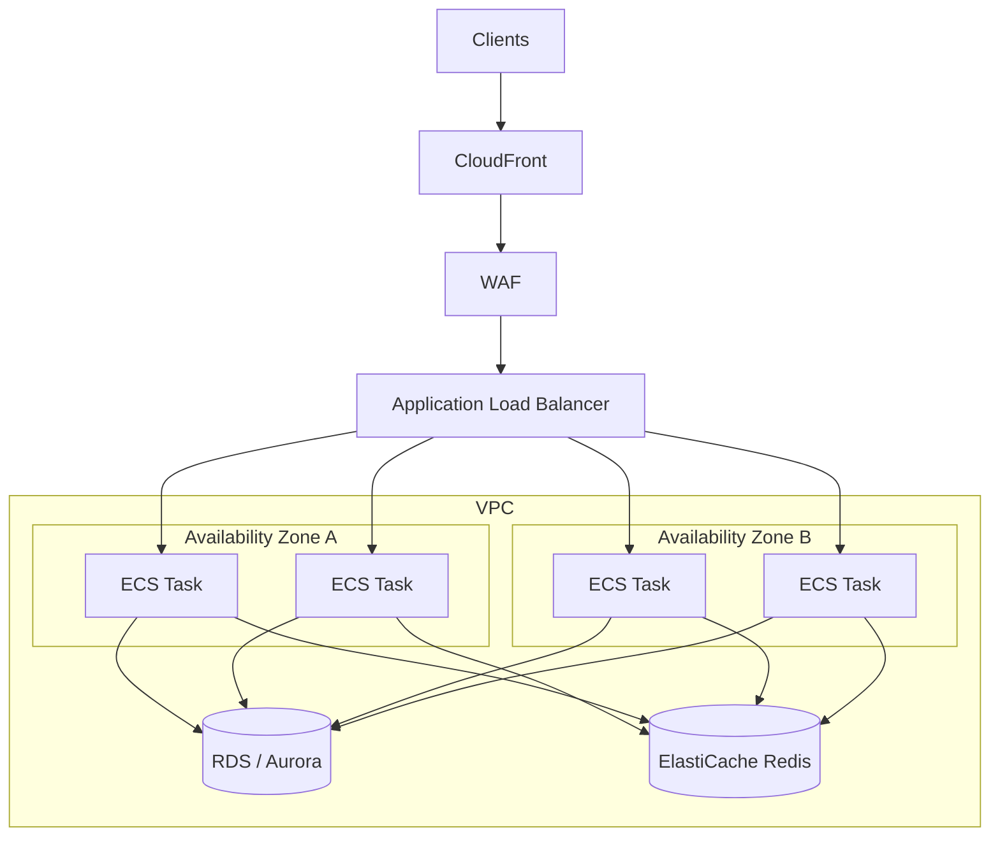
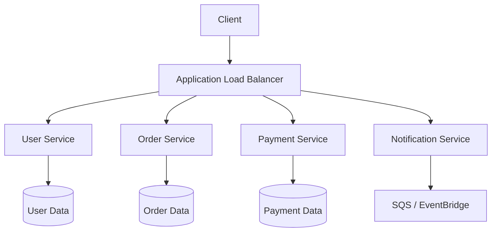
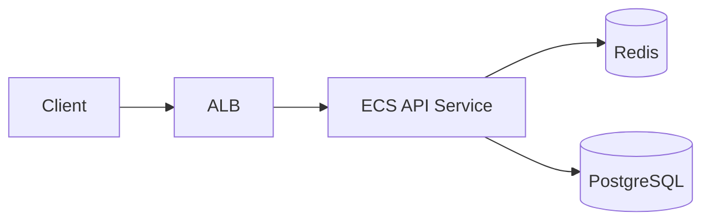
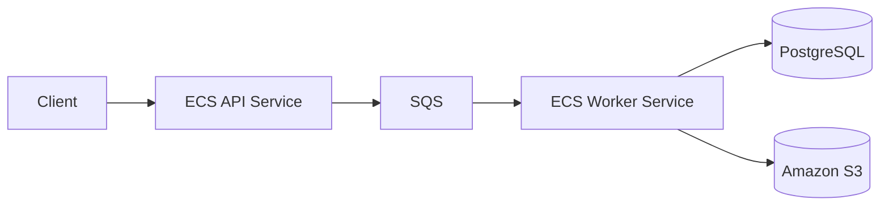
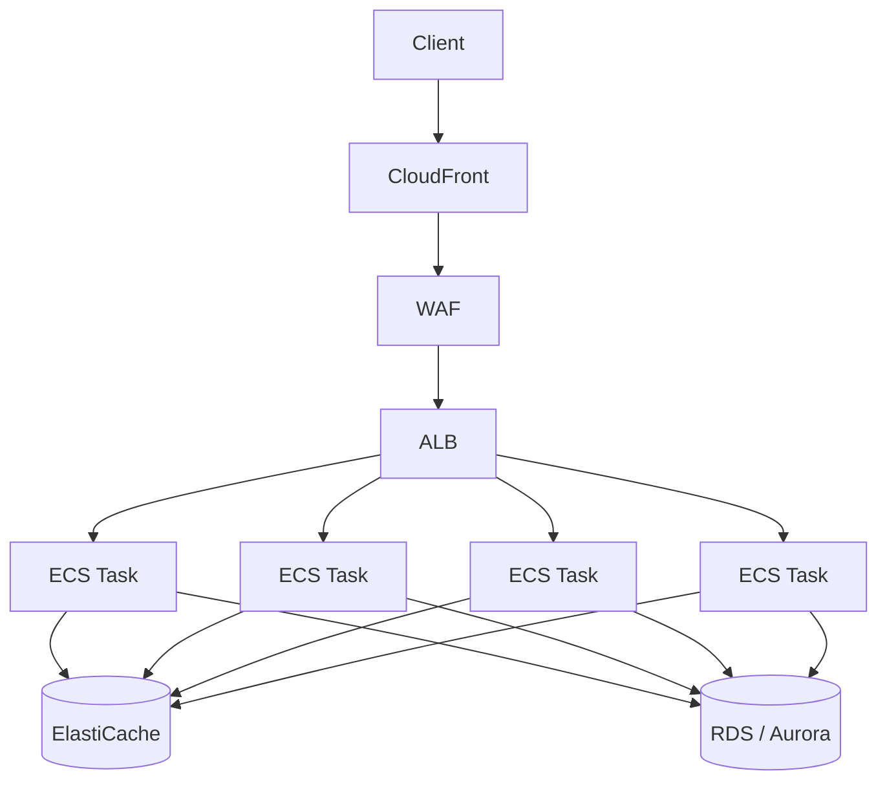
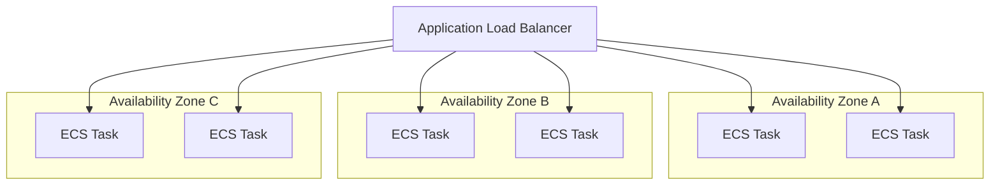
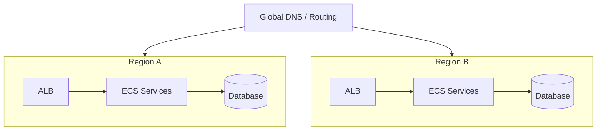
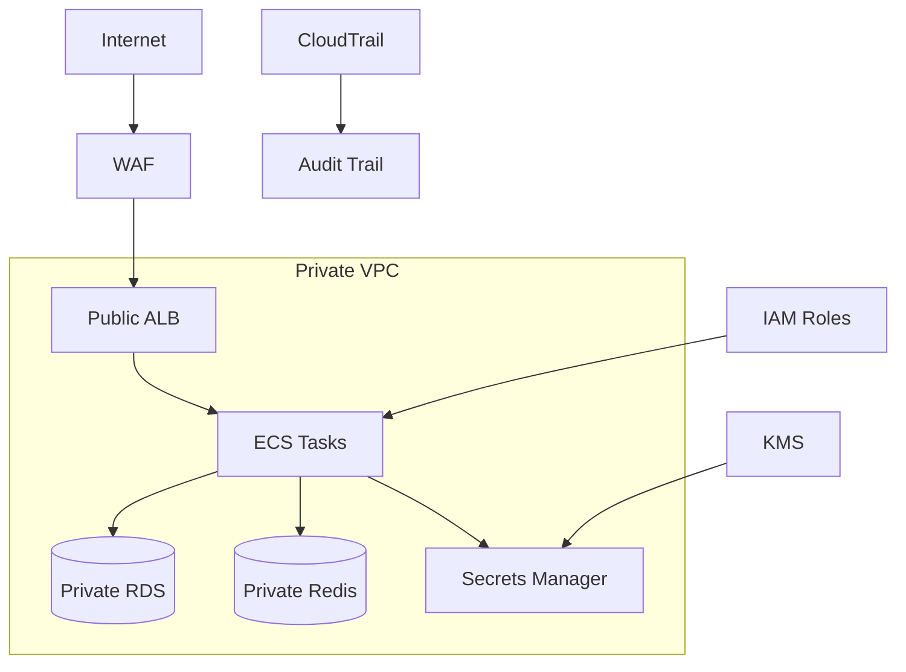
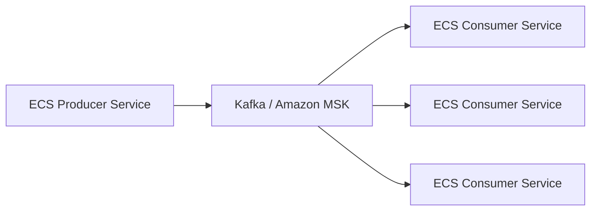

# 02- Production Architectures

## Overview

Amazon ECS can support architectures ranging from a small monolithic API to multi-service, multi-AZ, event-driven, and multi-region platforms. The important architectural decision is not which AWS services can be combined, but which combination satisfies the application's availability, scalability, security, performance, operational, and cost requirements.

A production ECS architecture commonly looks like:

```text
                         Internet
                            |
                        CloudFront
                            |
                           WAF
                            |
                           ALB
                            |
                +-----------+-----------+
                |                       |
             AZ-A                    AZ-B
                |                       |
          ECS Service              ECS Service
          +---------+              +---------+
          | Task    |              | Task    |
          | Task    |              | Task    |
          +---------+              +---------+
                |                       |
                +-----------+-----------+
                            |
                 +----------+----------+
                 |                     |
              RDS/Aurora             Redis
```

The architecture can then be extended with S3, SQS, EventBridge, Kafka, CloudWatch, Secrets Manager, and other services based on workload requirements.

The goal is to keep the architecture as simple as possible while meeting the required service-level objectives.

## Architecture Design Principles

Before selecting an ECS architecture, establish the actual requirements.

| Requirement | Questions to Answer |
|---|---|
| Traffic | How many requests per second? What are peak patterns? |
| Availability | What downtime is acceptable? |
| Latency | What response-time target must the API meet? |
| Scalability | Is traffic predictable, bursty, or continuously growing? |
| Data | What consistency and durability requirements exist? |
| Security | Which workloads require private networking or strict isolation? |
| Deployment | How frequently will services be released? |
| Recovery | What are the RTO and RPO requirements? |
| Cost | What infrastructure budget is acceptable? |
| Team | Can the team operate a distributed system reliably? |

A useful architectural rule is:

> Choose the simplest architecture that satisfies the business and engineering requirements.

Using microservices, multi-region deployment, or multiple AWS services without a corresponding requirement increases operational complexity without necessarily improving the system.

## Baseline Production Architecture

A strong default architecture for a typical backend API is:



This architecture works well for:

- Django applications
- FastAPI services
- REST APIs
- gRPC services
- SaaS backends
- Internal APIs
- Web applications

The ECS tasks should normally run in private subnets, while the load balancer provides the controlled entry point for application traffic.

## Monolith on ECS

A monolith can be deployed as a single ECS service:

```text
Internet
    |
    v
   ALB
    |
    v
Django / FastAPI ECS Service
    |
    v
PostgreSQL
```

The service may contain multiple identical tasks:

```text
ECS Service
    |
    +-- Task 1
    +-- Task 2
    +-- Task 3
```

### When to Use

A monolith is often appropriate for:

- Small engineering teams
- Early-stage products
- Moderate traffic
- Rapid product development
- Applications without independently scaling components
- Systems where operational simplicity is more valuable than service isolation

### Advantages

- Simple deployment model
- Simple debugging
- Fewer network boundaries
- Lower operational overhead
- Easier local development
- Straightforward transactions

### Limitations

- Large deployments can have a broad blast radius.
- Individual components cannot scale independently.
- Teams become more coupled as the codebase grows.
- A failure in one resource-intensive component can affect the entire application.

A monolith is not inherently an inferior architecture. A well-structured monolith can be significantly easier to operate than an unnecessarily distributed system.

## Microservices on ECS

As an application grows, independently deployable services can be hosted as separate ECS services.



Each ECS service can have its own:

- Task definition
- Deployment lifecycle
- Scaling policy
- CPU and memory allocation
- IAM permissions
- Security group
- Database or data ownership

### When to Use

Microservices become useful when there is a real need for:

- Independent scaling
- Independent deployments
- Clear team ownership
- Strong service boundaries
- Different technology requirements
- Failure isolation

### Advantages

- Independent deployment
- Independent scaling
- Smaller service boundaries
- Team autonomy
- Better isolation of resource-intensive workloads

### Limitations

Distributed systems introduce:

- Network failures
- Distributed tracing requirements
- Service discovery
- Authentication between services
- More deployment pipelines
- More infrastructure
- Eventual consistency
- Operational complexity

The architectural cost is therefore not just the number of ECS services. Every service introduces another operational boundary.

## API Gateway + ECS

For public APIs, API Gateway can be placed in front of ECS:

```text
Client
   |
   v
API Gateway
   |
   v
ECS Services
   |
   +---- PostgreSQL
   +---- Redis
   +---- SQS
```

This can be useful when API-management capabilities are required, such as:

- Authentication and authorization
- API keys
- Usage plans
- Throttling
- Request transformation
- Public API lifecycle management

An ALB remains useful for direct application load balancing and ECS integration.

The choice between API Gateway and ALB should be based on requirements rather than treating one as a universal replacement for the other.

## ALB + ECS + PostgreSQL

This is one of the most common ECS architectures:

```text
Internet
    |
    v
   ALB
    |
    v
ECS Service
    |
    v
RDS PostgreSQL
```

For production, the simplified diagram should normally become:

```text
                    Internet
                       |
                       v
                      ALB
                       |
              +--------+--------+
              |                 |
             AZ-A              AZ-B
              |                 |
           ECS Task          ECS Task
              |                 |
              +--------+--------+
                       |
                       v
                 RDS / Aurora
```

### Why It Works

The architecture separates:

- Traffic management
- Application compute
- Persistent data

ECS handles application compute while RDS/Aurora manages database durability and availability.

The application should not treat ECS container storage as its primary database.

## ECS + Redis + PostgreSQL

Redis can reduce database load and improve latency for frequently accessed data.



A common cache-aside flow is:

```text
Request
   |
   v
Check Redis
   |
   +---- Cache Hit ----> Return Data
   |
   +---- Cache Miss
             |
             v
        Query PostgreSQL
             |
             v
        Store in Redis
             |
             v
        Return Data
```

Redis can be useful for:

- Frequently accessed objects
- Session data
- Rate limiting
- Short-lived computed results
- Distributed locks where appropriate

Caching should not be introduced merely because Redis is available. Cache invalidation, stale data, memory pressure, and cache failure behavior must be designed.

## Event-Driven ECS Architecture

ECS services can participate in event-driven architectures using EventBridge, SQS, or Kafka.

A simple EventBridge architecture is:

```text
Order Service
     |
     v
EventBridge
     |
     +----------+----------+
     |          |          |
     v          v          v
Email       Analytics    Audit
Service      Service     Service
```

The producer does not need to synchronously call every consumer.

This reduces coupling and allows consumers to scale independently.

### When to Use

Event-driven communication is useful when:

- Work does not need to complete within the request.
- Multiple consumers need the same event.
- Consumers have different processing speeds.
- Loose coupling is valuable.
- Asynchronous processing is acceptable.

### Important Trade-Off

Event-driven systems introduce eventual consistency.

A request that creates an order may return successfully before downstream consumers finish processing the corresponding event.

Applications must therefore be designed around asynchronous state transitions.

## Background Worker Architecture

Long-running operations should generally be separated from latency-sensitive API workloads.



Typical workloads include:

- Email processing
- PDF generation
- Image processing
- Data synchronization
- Report generation
- ETL operations
- Long-running business workflows

For Python systems, the worker may be implemented using Celery or a purpose-built worker process.

The important architectural principle is workload isolation:

```text
API Tasks
    |
    +-- Serve user requests

Worker Tasks
    |
    +-- Process asynchronous jobs
```

A CPU-intensive worker should not consume all of the resources required by the API service.

## Batch Processing Architecture

Scheduled jobs can use EventBridge to start ECS tasks:

```text
EventBridge Scheduler
        |
        v
   ECS Task
        |
        v
Batch Processing
        |
        +---- PostgreSQL
        +---- S3
```

This is useful when the workload does not require a continuously running ECS service.

Examples:

- Daily reports
- Data synchronization
- Cleanup jobs
- Scheduled exports
- Periodic analytics processing

A one-off ECS task can be preferable to maintaining an always-running worker service for infrequent workloads.

## High-Traffic API Architecture

A high-traffic API may introduce multiple layers of caching and scaling:



Scaling considerations include:

- ECS service auto scaling
- ALB request rate
- Redis capacity
- Database connection limits
- Database read scaling
- CloudFront caching
- API latency
- Downstream dependency capacity

### Database Connection Management

Adding ECS tasks can unintentionally increase database connections.

For example:

```text
10 ECS Tasks
    |
    +-- 20 DB connections/task
              |
              v
       200 DB connections
```

If auto scaling increases the service to 50 tasks:

```text
50 Tasks × 20 Connections
= 1,000 Connections
```

The database may become the bottleneck before ECS compute capacity is exhausted.

Connection pooling and database capacity planning are therefore part of ECS scaling design.

## Multi-AZ ECS Architecture

High-availability production services should normally distribute tasks across multiple Availability Zones.



For six desired tasks, an even distribution could be:

| Availability Zone | Tasks |
|---|---:|
| AZ-A | 2 |
| AZ-B | 2 |
| AZ-C | 2 |

The exact distribution depends on capacity, placement constraints, and workload requirements.

Multi-AZ deployment protects against an Availability Zone failure, but only if dependent services are also appropriately designed.

## Multi-AZ Database Architecture

The application tier and database tier should be evaluated independently.

```text
                 ECS Tasks
                    |
                    v
              RDS / Aurora
               /         \
              v           v
        Primary DB     Standby / Replica
```

For production workloads, database high availability should be designed using the capabilities of the selected database service.

The application should also handle transient database connectivity failures through appropriate timeouts, retries, and connection management.

## Multi-Region Architecture

Multi-region ECS architectures are justified when a single AWS Region does not satisfy availability, disaster recovery, or latency requirements.



The two primary approaches are active-passive and active-active.

## Active-Passive Architecture

One region serves production traffic while another is maintained as a recovery environment.

```text
                DNS
                 |
          +------+------+
          |             |
          v             v
       Region A       Region B
        ACTIVE         STANDBY
          |             |
         ECS           ECS
```

### Advantages

- Lower cost than active-active
- Simpler traffic management
- Easier operational model
- Suitable for many disaster recovery requirements

### Limitations

- Standby capacity may not serve production traffic continuously.
- Failover requires operational procedures.
- Recovery time depends on how much infrastructure must be activated.
- Data replication becomes a critical design problem.

## Active-Active Architecture

Both regions serve production traffic:

```text
                  Global Routing
                  /            \
                 v              v
             Region A        Region B
                |                |
               ECS              ECS
                |                |
             Database        Database
```

### Advantages

- Lower user latency for geographically distributed users
- Both regions actively contribute capacity
- Better resilience against regional failure

### Limitations

- Higher cost
- More complicated data replication
- More complicated deployments
- Cross-region consistency challenges
- More difficult operational debugging

Active-active should be introduced only when the business requirements justify its complexity.

## SaaS Multi-Tenant Architecture

A SaaS application can use ECS as the shared compute layer.

```text
                    ALB
                     |
                     v
                ECS Services
                     |
        +------------+------------+
        |                         |
        v                         v
   Shared Database          Tenant Data
```

There are several tenant-isolation strategies.

| Strategy | Isolation | Cost | Operational Complexity |
|---|---|---|---|
| Shared database | Lower | Lower | Lower |
| Shared DB with tenant partitioning | Medium | Lower | Medium |
| Database per tenant | High | Higher | High |
| Dedicated infrastructure per tenant | Very high | Highest | Highest |

The correct choice depends on:

- Compliance requirements
- Customer isolation requirements
- Tenant size
- Data sensitivity
- Operational budget
- Recovery requirements

A shared database does not mean tenants should be able to access each other's records. Application and database-level controls must enforce tenant boundaries.

## Security-Focused ECS Architecture

A security-focused architecture typically keeps application tasks and databases private.



Important controls include:

- Private ECS subnets
- Security groups with least privilege
- IAM task roles
- Secrets Manager or Parameter Store
- Encryption with AWS KMS where appropriate
- WAF for internet-facing applications
- CloudTrail for API auditing
- Centralized logging
- Image scanning and controlled container registries

Avoid giving ECS tasks broad permissions such as unrestricted access to all S3 buckets or all AWS resources.

## Internal Service-to-Service Architecture

Microservices do not need to expose every service publicly.

A common pattern is:

```text
                 Public ALB
                     |
                     v
                 API Service
                     |
                     v
              Internal Service
                     |
                     v
              Payment Service
```

Internal communication can use:

- Private networking
- Internal load balancers
- Service discovery
- HTTP/REST
- gRPC

For synchronous service-to-service communication, gRPC can be useful when strongly typed contracts and efficient internal communication are important.

For operations that do not need an immediate response, SQS, EventBridge, or Kafka can reduce synchronous coupling.

## ECS Architecture with Nginx

Nginx can be used inside an ECS architecture when it provides a specific application-level requirement.

For example:

```text
Internet
   |
   v
ALB
   |
   v
Nginx Container
   |
   v
Application Container
```

This can be useful for:

- Specialized reverse proxy behavior
- Static content handling
- Application-specific routing
- Compatibility with an existing deployment architecture

However, adding Nginx between ALB and the application creates another operational layer.

If ALB already provides the required routing and TLS capabilities, Nginx may not add meaningful value.

## ECS Architecture with Kafka

For event streaming workloads:



Kafka is appropriate when the system needs capabilities such as:

- High-throughput event streaming
- Durable event retention
- Multiple independent consumers
- Consumer groups
- Replayable event streams

Kafka is operationally more complex than a simple queue.

For straightforward asynchronous job processing, SQS is often the simpler choice.

## Architecture Selection Matrix

| Requirement | Suitable Starting Architecture |
|---|---|
| Small backend | Monolith + ECS |
| Standard REST API | ALB + ECS + RDS |
| Cached API | ALB + ECS + Redis + RDS |
| Background processing | API + SQS + ECS Worker |
| Scheduled jobs | EventBridge + ECS Task |
| Public managed API | API Gateway + ECS |
| Large application with independent teams | ECS Microservices |
| Event-driven workflows | ECS + EventBridge/SQS |
| High-throughput streaming | ECS + Kafka/MSK |
| High availability | Multi-AZ ECS + HA database |
| Regional disaster recovery | Multi-region ECS |
| Global active traffic | Active-active multi-region |

## Deployment Architecture

Production architectures should be designed together with deployment strategy.

A rolling deployment can gradually replace tasks:

```text
Version 1
    |
    +-- Task A
    +-- Task B
    +-- Task C
    |
    v
Version 2
    |
    +-- Task A'
    +-- Task B'
    +-- Task C'
```

For higher-risk releases, blue/green deployment provides stronger isolation:

```text
                 ALB
                  |
           +------+------+
           |             |
           v             v
        Blue           Green
        v1              v2
        |                |
      100%              0%
```

Traffic can then be shifted after validation.

For critical systems, deployment architecture should consider:

- Health checks
- Minimum healthy capacity
- Temporary deployment capacity
- Database compatibility
- Automated rollback
- Application metrics
- Error rates
- Latency
- Business-level validation

## Observability Architecture

Production ECS architecture should include observability from the beginning.

```text
ECS Tasks
   |
   +---- Logs ------> CloudWatch Logs
   |
   +---- Metrics ---> CloudWatch
   |
   +---- Traces ----> Tracing Platform
   |
   +---- Events ----> EventBridge
```

Monitor at least:

- Task count
- CPU utilization
- Memory utilization
- Task restart frequency
- Deployment status
- ALB request count
- ALB latency
- HTTP 4xx/5xx
- Target health
- Database latency
- Database connections
- Redis memory and evictions
- Queue depth

Infrastructure health and application health should be monitored separately.

A service can show healthy ECS tasks while returning HTTP 500 responses because the actual failure exists in the database or another downstream dependency.

## Cost-Optimized Architecture

A cost-conscious architecture might look like:

```text
ALB
 |
 v
ECS
 |
 v
RDS
```

with scaling and caching added only when justified.

Possible optimization techniques include:

- Right-size ECS CPU and memory
- Scale task count based on workload
- Use appropriate Fargate pricing options
- Evaluate Fargate Spot for interruptible workloads
- Reduce unnecessary NAT Gateway traffic
- Use VPC endpoints where appropriate
- Control CloudWatch log retention
- Optimize container image size
- Avoid over-provisioning idle services

Cost optimization should not remove redundancy required by the application's availability objectives.

A cheaper single-AZ architecture is not a successful optimization if an outage violates the business requirement.

## Reliability and Failure Isolation

A production architecture should identify its failure domains.

```text
Container
    |
    v
Task
    |
    v
ECS Service
    |
    v
Availability Zone
    |
    v
Region
    |
    v
External Dependency
```

Each level requires a different mitigation.

| Failure | Typical Mitigation |
|---|---|
| Container crash | Task restart/replacement |
| Unhealthy task | Health checks + replacement |
| Task capacity issue | Service scaling |
| AZ failure | Multi-AZ deployment |
| Database failure | HA database configuration |
| Queue backlog | Worker scaling |
| Region failure | Multi-region DR |
| Deployment failure | Circuit breaker / rollback |
| External API failure | Timeout, retry, fallback |

The important senior-level principle is that redundancy should exist across the actual failure domain.

Running ten tasks in one Availability Zone does not provide the same resilience as distributing those tasks across multiple Availability Zones.

## Disaster Recovery Architecture

High availability and disaster recovery solve different problems.

### High Availability

The goal is to continue serving traffic during localized failures.

```text
AZ-A Failure
     |
     v
AZ-B + AZ-C
     |
     v
Continue Serving
```

### Disaster Recovery

The goal is to recover from larger failures such as a regional outage or major data-loss event.

```text
Region A Failure
       |
       v
Region B
       |
       v
Restore / Fail Over
```

The architecture should be selected based on RTO and RPO requirements.

| Requirement | Architectural Impact |
|---|---|
| High RTO | More recovery automation required |
| Low RTO | Warm or active standby capacity |
| High RPO tolerance | Less replication complexity |
| Very low RPO | Strong data replication strategy |
| Region-level resilience | Multi-region architecture |

DR is not complete until the recovery process has been tested.

A documented but untested failover process should not be treated as reliable disaster recovery.

## Architecture Trade-Offs

There is no universally optimal ECS architecture.

Every architecture balances:

```text
Cost
Performance
Availability
Security
Complexity
Operational Burden
```

For example:

| Architecture | Main Benefit | Main Cost |
|---|---|---|
| Monolith | Simplicity | Limited independent scaling |
| Microservices | Independent scaling/deployment | Distributed-system complexity |
| Multi-AZ | High availability | Additional capacity/cost |
| Multi-region | Regional resilience | Significant operational complexity |
| Redis caching | Lower latency/database load | Cache consistency and operations |
| Event-driven | Loose coupling | Eventual consistency |
| Blue/green | Safer deployment | Temporary duplicate capacity |
| Active-active | Strong regional resilience | Highest complexity |

The correct architecture is the one whose benefits directly address real requirements.

## Production Decision Framework

Before introducing another architectural component, ask:

### Is There a Business Requirement?

Do not introduce multi-region deployment simply because it is technically possible.

### Is the Failure Domain Covered?

Identify what happens when:

- A task fails.
- An AZ fails.
- A database fails.
- A deployment fails.
- A region fails.

### Can the Team Operate It?

A technically sophisticated architecture that the team cannot debug or recover is a reliability risk.

### Is the System Observable?

Every important production component should have:

- Logs
- Metrics
- Alerts
- Health signals
- Operational runbooks

### Can It Be Rolled Back?

Deployment and infrastructure changes should have a known recovery path.

## Common Production Mistakes

### Starting With Microservices

A team may split an application into many ECS services before service boundaries are understood.

This increases:

- Network calls
- Deployment pipelines
- Monitoring requirements
- Failure modes
- Operational overhead

Start with clear boundaries and extract services when there is a measurable reason.

### Putting ECS Tasks in Public Subnets by Default

Publicly accessible application tasks increase the attack surface.

Prefer:

```text
Internet
   |
   v
Public ALB
   |
   v
Private ECS Tasks
```

### Scaling ECS Without Scaling the Database

Increasing task count does not help if PostgreSQL becomes the bottleneck.

Always evaluate:

```text
ECS Capacity
      +
Database Capacity
      +
Redis Capacity
      +
Downstream Capacity
```

### Ignoring Cross-AZ Traffic

Distributed architectures can introduce additional network costs and latency.

Architecture should consider where data is stored and where traffic flows.

### Treating Multi-AZ as Disaster Recovery

Multi-AZ protects against Availability Zone failures.

It does not automatically protect against:

- Region failure
- Data corruption
- Application-wide destructive changes
- Incorrect deployments

### Introducing Too Many Managed Services

Managed services reduce infrastructure work but still introduce:

- Configuration
- IAM
- Monitoring
- Cost
- Failure modes

Use them when they solve a real architectural problem.

## Senior Engineer Perspective

Production ECS architecture is primarily an exercise in trade-off management.

A senior engineer should be able to explain why a system uses:

```text
Monolith vs Microservices
ALB vs API Gateway
SQS vs Kafka
Single-AZ vs Multi-AZ
Active-Passive vs Active-Active
Redis vs Database-Only
Rolling vs Blue/Green
Fargate vs EC2
```

The strongest architecture is not the one containing the largest number of AWS services.

It is the architecture that provides the required reliability, scalability, security, and operational characteristics while keeping complexity proportional to the actual problem.

## Key Takeaways

- Start with the **simplest ECS architecture that satisfies explicit availability, scalability, security, and operational requirements**.
- Production APIs commonly use **ALB + multi-AZ ECS tasks + managed data services**, with private application networking and centralized observability.
- Microservices, event-driven systems, caching, and multi-region architectures provide specific benefits but introduce significant **distributed-system and operational complexity**.
- ECS scalability must be evaluated end-to-end because **databases, caches, queues, and downstream services can become bottlenecks before ECS does**.
- High availability and disaster recovery are different concerns; **multi-AZ protects against localized failures, while multi-region strategies address regional failures and stronger recovery requirements**.