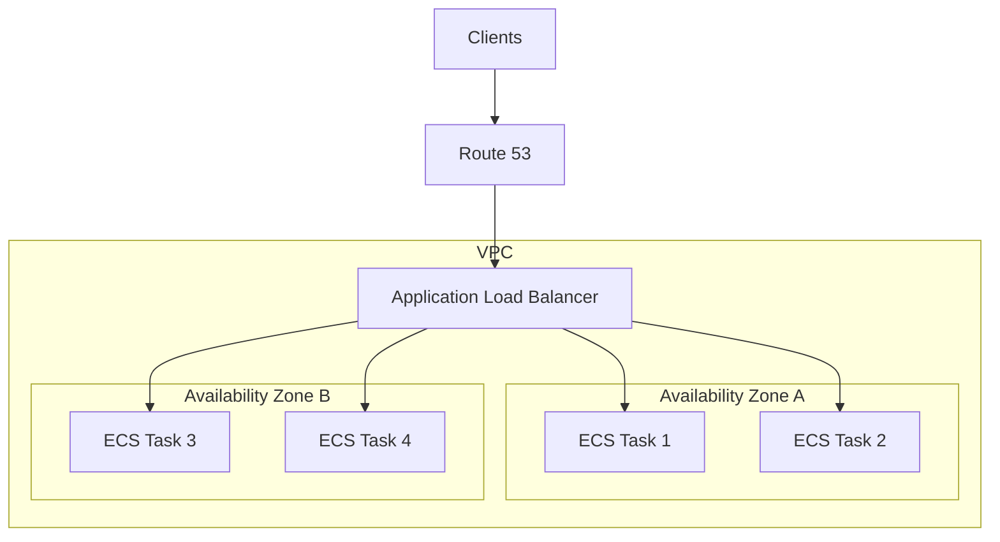
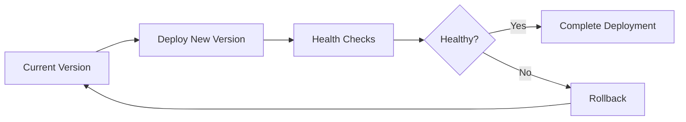
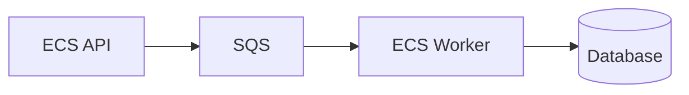
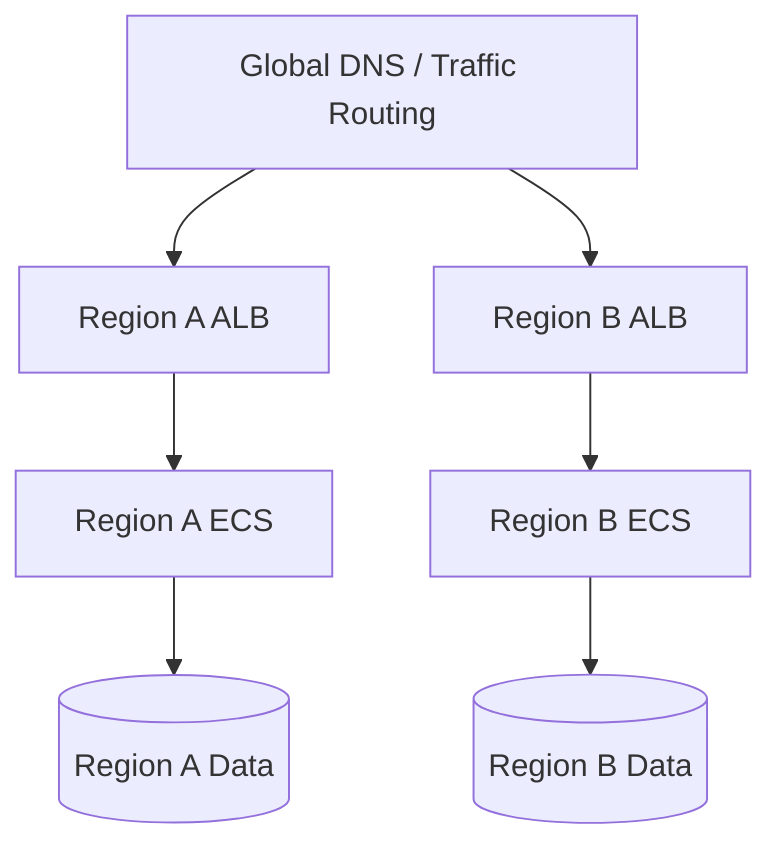

# 03- High Availability and Disaster Recovery

## Overview

High availability (HA) and disaster recovery (DR) are related but distinct concerns in Amazon ECS architecture.

**High availability** focuses on keeping the application available when individual components fail, such as a container, ECS task, Availability Zone, or infrastructure instance.

**Disaster recovery** focuses on restoring service after larger failures, such as a regional outage, major data corruption event, or destructive operational mistake.

A production ECS architecture should therefore be designed around explicit **failure domains**, **Recovery Time Objective (RTO)**, and **Recovery Point Objective (RPO)** rather than simply increasing the number of ECS tasks.

A typical highly available ECS architecture looks like:

```text
                         Internet
                            |
                         Route 53
                            |
                           ALB
                     /             \
                    /               \
              Availability       Availability
                Zone A             Zone B
                   |                  |
              ECS Task 1          ECS Task 3
              ECS Task 2          ECS Task 4
                   |                  |
                   +--------+---------+
                            |
                       RDS / Aurora
                            |
                    Multi-AZ Database
```

The important principle is:

> Redundancy must exist across the failure domain you are trying to survive.

Running four ECS tasks in one Availability Zone provides more process redundancy, but it does not provide Availability Zone resilience.

## High Availability vs Disaster Recovery

| Concern | High Availability | Disaster Recovery |
|---|---|---|
| Primary goal | Continue serving traffic | Restore service after major failure |
| Typical failure | Task, instance, AZ | Region, major data loss, destructive event |
| Recovery approach | Automatic failover | Failover, restoration, or rebuild |
| Expected downtime | Minimal | Depends on RTO |
| Data concern | Availability | Availability + recoverability |
| Typical architecture | Multi-AZ | Multi-region or backup/restore |
| Testing | Continuous health checks | Scheduled recovery exercises |

These concerns should not be conflated.

For example, deploying ECS tasks across three Availability Zones improves HA, but it does not protect against a regional outage.

Similarly, having database backups provides DR capability but does not necessarily provide high availability during a database failure.

## Failure Domains

A useful way to design HA and DR is to reason through progressively larger failure domains.

```text
Application Process
        |
        v
Container
        |
        v
ECS Task
        |
        v
Compute Capacity
        |
        v
Availability Zone
        |
        v
AWS Region
        |
        v
External Dependency
```

Each failure domain requires a different mitigation strategy.

| Failure Domain | Example Failure | Typical Mitigation |
|---|---|---|
| Process | Application crash | Container restart |
| Container | Container exits | ECS task replacement |
| Task | Task becomes unhealthy | ECS service replacement |
| Compute | EC2 host failure | Task rescheduling |
| AZ | AZ infrastructure outage | Multi-AZ deployment |
| Region | Regional outage | Multi-region DR |
| Data | Corruption/deletion | Backups and point-in-time recovery |
| Deployment | Bad release | Rollback / deployment circuit breaker |
| External dependency | Third-party API outage | Timeout, retry, fallback |

A senior engineer should always ask:

> "What failure are we designing against?"

Without that question, "high availability" becomes an ambiguous architectural label.

## ECS High Availability Architecture

For a production ECS service, tasks should normally be distributed across multiple Availability Zones.



The load balancer routes requests only to healthy targets.

If one task fails:

```text
Task 1 -> Failed
Task 2 -> Healthy
Task 3 -> Healthy
Task 4 -> Healthy
```

ECS can replace the failed task:

```text
Task 1 -> Failed
           |
           v
      Replacement
           |
           v
       Task 5 -> Healthy
```

The service can continue serving traffic while the replacement task starts.

## Multi-AZ Task Distribution

Suppose an application requires six running tasks.

A resilient distribution might be:

```text
AZ-A
    Task 1
    Task 2

AZ-B
    Task 3
    Task 4

AZ-C
    Task 5
    Task 6
```

If AZ-B becomes unavailable:

```text
AZ-A
    Task 1
    Task 2

AZ-B
    X X X X

AZ-C
    Task 5
    Task 6
```

The application still has four tasks available.

The exact number of tasks required after an AZ failure depends on the application's capacity requirements.

This leads to an important distinction:

> Multi-AZ distribution provides resilience only if the remaining capacity can handle the surviving workload.

For example, an application normally running at 30% CPU across six tasks may survive an AZ failure comfortably. An application running at 85% CPU across six tasks may become overloaded after losing one-third of its capacity.

## ECS Service Desired Count

The ECS service desired count determines how many tasks the service attempts to keep running.

For example:

```text
Desired Count = 6

AZ-A -> 2 tasks
AZ-B -> 2 tasks
AZ-C -> 2 tasks
```

If an AZ failure removes two tasks, the remaining four tasks may not be enough.

A resilient architecture therefore considers:

```text
Normal Capacity
        |
        v
Failure Capacity
        |
        v
Required Capacity
```

Capacity planning should account for expected failure scenarios, not just normal traffic.

## Load Balancer Health Checks

The Application Load Balancer should use meaningful health checks.

```text
                    ALB
                     |
          +----------+----------+
          |          |          |
          v          v          v
        Task 1     Task 2     Task 3
        Healthy    Unhealthy  Healthy
          |                     |
          +---------------------+
                    |
              Traffic Routed
```

An unhealthy target should stop receiving application traffic.

A common API health endpoint is:

```http
GET /health
```

For FastAPI:

```python
from fastapi import FastAPI

app = FastAPI()


@app.get("/health")
async def health() -> dict[str, str]:
    return {"status": "ok"}
```

The health endpoint should generally be lightweight.

A common mistake is making the load balancer health check execute expensive database queries or depend on every external service.

If a non-critical dependency temporarily fails, the entire application could otherwise appear unhealthy and be removed from the load balancer.

## Health Check Design

There are usually multiple health signals:

| Health Signal | Purpose |
|---|---|
| Container health check | Determines whether the container process is functioning |
| ALB target health | Determines whether traffic should reach the task |
| Application metrics | Determines whether the application is behaving correctly |
| Dependency health | Determines whether downstream systems are available |

These signals should not automatically be treated as interchangeable.

For example:

```text
Container: Healthy
ALB Target: Healthy
HTTP 5xx: Increasing
Database Latency: Increasing
```

The ECS infrastructure may be healthy while the application is degraded.

This is why observability must extend beyond ECS task health.

## Deployment High Availability

Deployments can temporarily reduce available capacity.

Suppose a service has:

```text
Desired Count = 4
```

A deployment replaces version 1 with version 2.

If the new tasks are started too aggressively:

```text
Version 1
    Task 1
    Task 2

Version 2
    Task 3
    Task 4
```

The application may have fewer healthy targets while the new tasks initialize.

Production deployment configuration should account for:

- Minimum healthy capacity
- Maximum deployment capacity
- Container startup time
- Health check grace period
- Dependency initialization
- Application warm-up time

The deployment strategy should preserve sufficient healthy capacity throughout the rollout.

## Deployment Failure and Rollback

A production deployment should assume that releases can fail.

A typical lifecycle is:



Failures may include:

- Container startup failure
- Image pull failure
- Missing environment variable
- IAM permission failure
- Database incompatibility
- Health check failure
- Application crash
- Dependency connectivity failure

Automated rollback is preferable to relying exclusively on manual intervention.

## Database High Availability

ECS task redundancy does not make the database highly available.

Consider:

```text
ECS Task 1
ECS Task 2
ECS Task 3
ECS Task 4
       |
       v
Single Database Instance
```

If the database fails, all ECS tasks can become unusable.

The database layer therefore needs its own HA strategy.

For AWS-managed relational workloads, services such as Amazon RDS and Aurora provide database-specific high-availability capabilities.

The architecture becomes:

```text
                    ECS Tasks
                 /     |     \
                /      |      \
               v       v       v
             RDS / Aurora
                  |
          Multi-AZ Architecture
```

The application should also implement:

- Connection timeouts
- Appropriate retry behavior
- Connection pooling
- Transaction handling
- Failure-aware error handling

Retries must be bounded and should not create retry storms.

## Database Connection Scaling

ECS horizontal scaling can create database pressure.

Suppose:

```text
1 ECS Task
    |
    +-- 20 DB connections
```

Scaling to 20 tasks produces:

```text
20 Tasks × 20 Connections
= 400 Database Connections
```

If the database supports only a smaller practical connection capacity, ECS scaling can make the system less reliable rather than more reliable.

For Django and FastAPI applications, database connection configuration should therefore be considered part of ECS capacity planning.

The scaling relationship should be evaluated as:

```text
ECS Task Count
      |
      v
Application Workers
      |
      v
Database Connections
      |
      v
Database Capacity
```

## Redis High Availability

Redis may become another dependency in the application architecture.

```text
ECS Tasks
    |
    v
Redis
```

If Redis is used only as a cache, the application should generally be able to recover when cached data disappears.

The application should not treat a cache as the authoritative source of durable business data unless the architecture explicitly requires Redis to serve that role.

A resilient cache architecture should define:

- What happens when Redis is unavailable?
- Can the application fall back to the database?
- How much additional database load can the fallback generate?
- What happens during a cache restart?
- Are cache writes mandatory or best effort?

For example:

```text
Request
   |
   v
Redis
   |
   +---- Hit ----> Return
   |
   +---- Failure
          |
          v
      PostgreSQL
```

This pattern can preserve availability, but it can also overload PostgreSQL during a large cache outage.

## Queue-Based Resilience

Queues can isolate temporary downstream failures.



If workers temporarily fail:

```text
API
 |
 v
Queue
 |
 +-- Messages retained
 |
 v
Workers recover
 |
 v
Process messages
```

This provides buffering between producers and consumers.

Important production concerns include:

- Visibility timeout
- Retry behavior
- Dead-letter queues
- Idempotent processing
- Queue depth monitoring
- Worker auto scaling

For example, if a worker fails after partially processing a message, the message may be delivered again.

The operation should therefore be designed to tolerate duplicate processing.

## Graceful Shutdown

ECS deployments and task replacement can terminate tasks.

Applications should handle shutdown signals correctly.

```text
Task Running
     |
     v
Termination Signal
     |
     v
Stop Accepting New Work
     |
     v
Finish / Cancel Active Work
     |
     v
Close Connections
     |
     v
Exit
```

For HTTP APIs, graceful shutdown reduces dropped requests.

For workers, it reduces the risk of partially processed jobs.

Python applications should use framework-appropriate shutdown hooks and ensure long-running operations have bounded execution times.

## Auto Scaling and Availability

Auto scaling should maintain enough capacity to handle both normal traffic and expected failures.

Consider:

```text
Normal Traffic
     |
     v
4 Tasks

Traffic Spike
     |
     v
8 Tasks
```

But also consider:

```text
8 Tasks
   |
   +-- AZ failure
   |
   v
5-6 Tasks Remaining
```

A strong scaling policy therefore considers:

- Normal workload
- Peak workload
- Scale-out latency
- Task startup time
- AZ failure capacity
- Database capacity
- Queue depth
- Application latency

Scaling is not instantaneous.

If a service needs several minutes to launch and warm up a task, the system needs sufficient baseline capacity to survive short traffic spikes.

## Scaling Based on the Right Signal

CPU utilization is useful but not universally sufficient.

For a CPU-heavy application:

```text
CPU -> Good Scaling Signal
```

For an I/O-heavy API:

```text
CPU = 20%
Requests = 10,000 RPS
Latency = Increasing
```

CPU-based scaling may fail to react quickly enough.

Other signals can include:

- ALB request count per target
- Request latency
- Queue depth
- Custom application metrics
- Number of active jobs

The scaling metric should represent the actual resource bottleneck.

## Stateless Application Design

Stateless services are easier to scale and recover.

Prefer:

```text
Task 1
Task 2
Task 3
   |
   +---- Shared External State
```

rather than:

```text
Task 1
   |
   +---- Local Session State

Task 2
   |
   +---- Local Session State
```

When a task disappears, the replacement should be able to serve requests without depending on state stored inside the old container.

For Django applications, this commonly means externalizing:

- Sessions where required
- Media files
- Static assets
- Shared application state

For example:

```text
Django ECS
   |
   +-- PostgreSQL
   +-- Redis
   +-- S3
```

## Disaster Recovery Strategy

Disaster recovery should be selected based on RTO and RPO.

### RTO

**Recovery Time Objective** defines how quickly the service must be restored after a failure.

Example:

```text
RTO = 30 minutes
```

The organization expects the service to be operational within approximately 30 minutes of a qualifying disaster.

### RPO

**Recovery Point Objective** defines how much data loss is acceptable.

Example:

```text
RPO = 5 minutes
```

The organization can tolerate losing up to approximately five minutes of data, depending on the recovery mechanism.

| Requirement | Architectural Implication |
|---|---|
| Low RTO | Pre-provisioned recovery infrastructure |
| Very low RTO | Warm or active standby |
| Low RPO | Frequent or continuous data replication |
| High RPO tolerance | Backup and restore may be sufficient |
| Zero/near-zero downtime | Active-active or equivalent architecture |

The correct architecture depends on the business requirement rather than the technology preference.

## Disaster Recovery Patterns

Common DR patterns include:

| Pattern | Recovery Speed | Cost | Complexity |
|---|---|---|---|
| Backup and restore | Slowest | Lowest | Low |
| Pilot light | Moderate | Low to moderate | Moderate |
| Warm standby | Fast | Moderate to high | Moderate |
| Active-passive | Fast | High | High |
| Active-active | Fastest | Highest | Highest |

The terminology can vary between organizations, but the underlying trade-off remains:

```text
Faster Recovery
      ^
      |
      |        Higher Cost
      |
      +------------------------>
```

## Backup and Restore

The simplest DR strategy is to maintain backups and rebuild the environment when required.

```text
Production Region
       |
       v
Backups
       |
       v
Disaster
       |
       v
Recovery Environment
       |
       v
Restore Data
       |
       v
Application Available
```

This is appropriate when the RTO can tolerate infrastructure and database restoration time.

The recovery process should cover:

- ECS infrastructure
- Task definitions
- Container images
- Configuration
- Secrets
- Databases
- S3 data
- DNS
- IAM
- Networking

A backup is useful only if it can actually be restored.

## Infrastructure as Code for DR

Infrastructure should be reproducible.

Terraform, AWS CloudFormation, or AWS CDK can define:

- VPC
- Subnets
- Security groups
- ECS clusters
- ECS services
- Load balancers
- IAM roles
- Databases
- Supporting infrastructure

The principle is:

```text
Infrastructure Code
        |
        v
Recreate Environment
        |
        v
Deploy Application
        |
        v
Restore Data
```

This is substantially more reliable than maintaining a manually configured recovery environment.

## Container Image Recovery

A DR architecture must account for container images.

If the production environment depends on an image that cannot be retrieved during recovery, ECS cannot start the application.

Use a reliable container registry strategy and retain the versions required for rollback and recovery.

Prefer immutable image identifiers:

```text
my-api:8f31c2a
```

over relying exclusively on:

```text
my-api:latest
```

A deployment should be reproducible from a known image version.

## Secrets and Configuration Recovery

Secrets are part of the application's recovery dependencies.

A recovered ECS environment needs access to:

- Database credentials
- API credentials
- Encryption keys
- Application configuration
- Third-party credentials

Do not solve this by embedding secrets inside container images.

Use services such as:

- AWS Secrets Manager
- Systems Manager Parameter Store
- IAM roles

The DR procedure should explicitly verify that the recovery environment can access required secrets.

## DNS Failover

For multi-region architectures, DNS can participate in failover.

```text
                    Route 53
                   /        \
                  v          v
             Region A     Region B
                |             |
               ALB           ALB
                |             |
               ECS           ECS
```

Possible routing strategies include:

- Failover routing
- Weighted routing
- Latency-based routing
- Geolocation routing

The routing strategy should correspond to the recovery architecture.

DNS failover alone does not create disaster recovery. The target region must actually be capable of serving the workload.

## Active-Passive ECS Architecture

In an active-passive design:

```text
                    DNS
                     |
              +------+------+
              |             |
              v             v
          Region A       Region B
           ACTIVE         STANDBY
              |             |
             ECS           ECS
              |             |
             DB          Replica
```

Region B may contain minimal or partially provisioned infrastructure.

During a regional failure:

```text
Region A
    |
    X
    |
    v
DNS Failover
    |
    v
Region B
    |
    v
ECS Capacity
    |
    v
Production Traffic
```

The standby environment must be tested regularly.

## Active-Active ECS Architecture

In active-active:



Both regions serve traffic under normal conditions.

This provides strong regional resilience but introduces difficult data architecture problems.

Questions include:

- Where is authoritative data stored?
- How is data replicated?
- What happens during network partition?
- How are writes reconciled?
- What consistency model is acceptable?
- How are duplicate events handled?

The compute layer is often easier to make active-active than the database layer.

## Data Replication

Data replication is usually the hardest part of multi-region DR.

For example:

```text
Region A
   |
   | Replication
   v
Region B
```

Replication can be:

- Synchronous
- Asynchronous
- Application-level
- Database-level
- Event-driven

Asynchronous replication can introduce a recovery point gap:

```text
Primary
   |
   | 5-minute replication lag
   v
Replica

RPO ~= replication lag
```

The actual RPO depends on the complete recovery architecture, not merely the presence of a replica.

## Disaster Recovery Testing

A DR plan that has never been tested is not a reliable recovery mechanism.

Testing should verify:

- Infrastructure recreation
- ECS service deployment
- Container image availability
- IAM permissions
- Secret access
- Database restoration
- DNS changes
- Application startup
- External dependency connectivity
- Monitoring and alerting
- Rollback procedures

A useful test flow is:

```text
Declare Recovery Scenario
        |
        v
Activate Recovery Environment
        |
        v
Restore / Promote Data
        |
        v
Deploy ECS Services
        |
        v
Validate Health
        |
        v
Route Traffic
        |
        v
Measure RTO / RPO
```

The results should be recorded and used to improve the recovery process.

## Chaos and Failure Testing

High availability should also be tested at smaller failure domains.

Examples:

- Stop an ECS task.
- Terminate an EC2-backed ECS container instance.
- Simulate an unhealthy target.
- Increase application latency.
- Create queue backlog.
- Temporarily block a dependency.
- Test deployment rollback.
- Validate database failover.

The goal is to verify that the architecture behaves as designed.

A system should not be considered highly available merely because its architecture diagram contains multiple Availability Zones.

## Monitoring for HA and DR

Important metrics include:

### ECS

- Desired task count
- Running task count
- Pending task count
- Deployment failures
- Task restart rate
- CPU utilization
- Memory utilization

### ALB

- Healthy target count
- Unhealthy target count
- Request count
- Target response time
- HTTP 4xx
- HTTP 5xx

### Database

- Connection count
- CPU utilization
- Storage
- Read/write latency
- Replica lag
- Failover events

### Queue

- Approximate message count
- Oldest message age
- Consumer throughput
- Dead-letter queue depth

### Application

- Request latency
- Error rate
- Throughput
- Dependency failures
- Business-level failures

Alerting should focus on conditions that require action rather than generating alerts for every metric fluctuation.

## Security During Disaster Recovery

Security controls must survive failover.

A common DR mistake is building a recovery environment with weaker security controls because it is considered temporary.

The recovery environment should maintain:

- IAM least privilege
- Network isolation
- Security group restrictions
- Encryption
- Secrets management
- Logging
- Auditability
- Image security
- Access control

A disaster should not become a reason to bypass security architecture.

## Cost Considerations

HA and DR increase infrastructure cost.

For example:

```text
Single AZ
    |
    +-- Lower cost
    +-- Lower resilience

Multi-AZ
    |
    +-- Higher cost
    +-- Better availability

Multi-Region
    |
    +-- Highest cost
    +-- Regional resilience
```

The cost should be evaluated against the business impact of downtime and data loss.

A service with an RTO of several hours may not justify a continuously running active-active architecture.

A financial transaction system with strict availability requirements may justify the additional cost.

## Common Mistakes

### Assuming Multiple Tasks Equal High Availability

Multiple tasks in one AZ still share the same AZ failure domain.

**Better:**

```text
AZ-A -> Tasks
AZ-B -> Tasks
AZ-C -> Tasks
```

### Making Health Checks Too Deep

A health endpoint that requires every downstream dependency to be available can cause healthy application tasks to be removed from service during a partial dependency outage.

Use layered health signals instead.

### Ignoring Database Capacity

Scaling ECS tasks can overwhelm the database with connections and queries.

Always model application capacity and database capacity together.

### Treating Redis as Durable Storage

If Redis is a cache, the application should tolerate cache loss.

Do not store the only copy of critical business data in a cache.

### Assuming Backups Are Enough

Backups address data recovery but do not automatically satisfy a low RTO.

Recovery time must include:

```text
Restore
+
Infrastructure Provisioning
+
Deployment
+
Configuration
+
Validation
+
DNS / Traffic Failover
```

### Never Testing Failover

A recovery process can fail because of:

- Expired credentials
- Missing IAM permissions
- Broken infrastructure code
- Missing container images
- Incorrect DNS
- Database restore issues
- Unavailable secrets

Regular testing exposes these problems before an actual disaster.

### Building Multi-Region Too Early

Multi-region architectures introduce substantial complexity.

Do not implement them unless the business requirement justifies the operational cost.

### Ignoring Recovery of Dependencies

Recovering ECS alone is insufficient.

A real recovery plan must account for:

```text
ECS
+
Database
+
Cache
+
Queues
+
Storage
+
Secrets
+
DNS
+
IAM
+
Monitoring
```

## HA and DR Checklist

| Area | Production Requirement |
|---|---|
| ECS Tasks | Multiple tasks for production workloads |
| Availability Zones | Distribute capacity across AZs |
| Load Balancing | Health-aware traffic routing |
| Scaling | Automatic scale-out and scale-in |
| Deployment | Safe rollout and rollback |
| Application | Stateless where practical |
| Database | HA and tested recovery |
| Cache | Defined behavior during cache failure |
| Queues | Retries, DLQ, and idempotent consumers |
| Storage | Durable external storage |
| Images | Immutable and recoverable container images |
| Secrets | Recoverable and securely managed |
| Monitoring | Application and infrastructure observability |
| Backups | Automated and retention-controlled |
| DR | Explicit RTO and RPO |
| Infrastructure | Reproducible through IaC |
| Testing | Regular failover and recovery exercises |

## Interview Traps

### Is Multi-AZ the Same as Multi-Region?

No.

Multi-AZ protects against Availability Zone-level failures within a region.

Multi-region architecture addresses regional failures.

### Does ECS Automatically Replace Failed Tasks?

For an ECS service maintaining a desired task count, ECS can replace failed or unhealthy tasks.

However, successful replacement depends on available capacity, networking, IAM, image availability, dependencies, and other infrastructure conditions.

### Does ECS Provide Database High Availability?

No.

ECS manages containerized workloads. Database HA must be designed separately using the selected database service.

### What Is the Difference Between RTO and RPO?

**RTO** answers:

> How quickly must the system recover?

**RPO** answers:

> How much data loss can the business tolerate?

### Is Multi-Region Always Better?

No.

Multi-region improves regional resilience but introduces additional cost, operational complexity, data replication challenges, and consistency concerns.

### Can Auto Scaling Solve an AZ Failure?

Not by itself.

Auto scaling can replace or add capacity, but there must be available capacity in surviving Availability Zones and the rest of the architecture must also remain functional.

### Why Is Statelessness Important for ECS HA?

Tasks are replaceable.

If application state is stored only inside a task, replacing that task can lose the state required to serve the next request.

Externalizing state makes task replacement safer and horizontal scaling practical.

## Key Takeaways

- High availability requires **redundancy across failure domains**, with production ECS tasks normally distributed across multiple Availability Zones.
- ECS task redundancy alone is insufficient; **load balancing, database HA, dependency resilience, scaling, and deployment rollback** must work together.
- Disaster recovery should be designed around explicit **RTO and RPO requirements**, with backup/restore, warm standby, active-passive, or active-active selected accordingly.
- Multi-region recovery is primarily a **data and operational problem**, not simply a matter of deploying ECS services in another region.
- HA and DR must be **tested regularly**; infrastructure-as-code, recoverable images, secrets, data, DNS, and documented failover procedures are essential for reliable recovery.