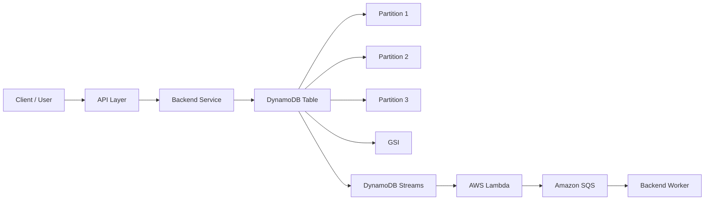
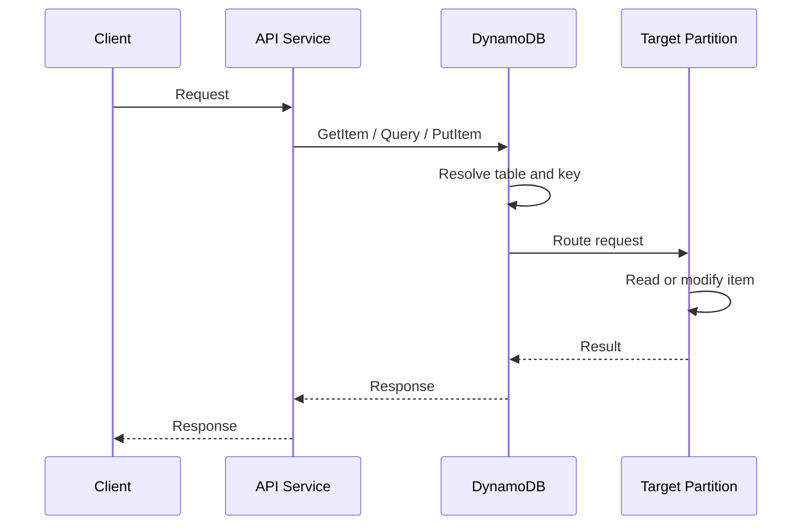
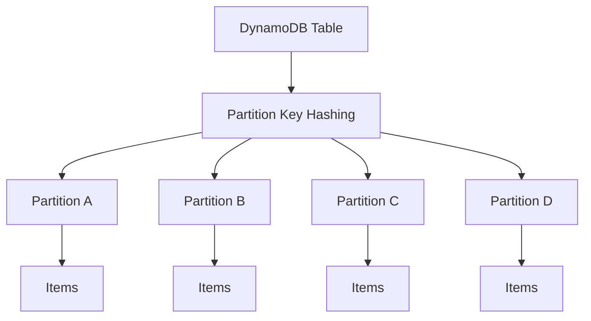
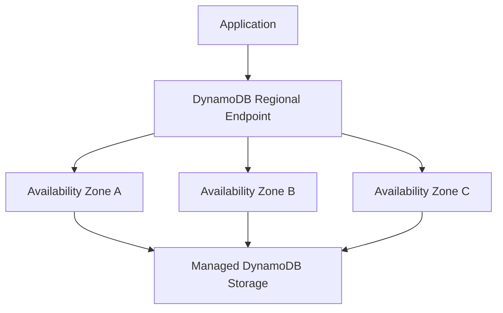
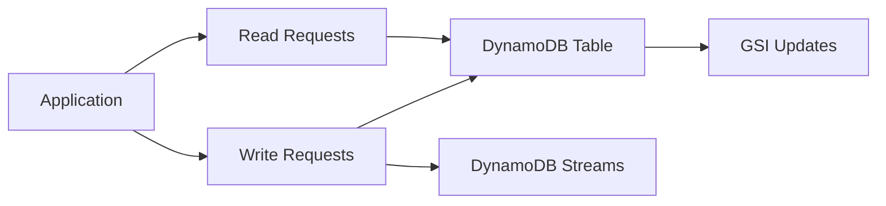
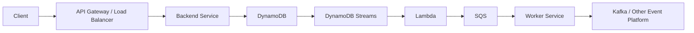
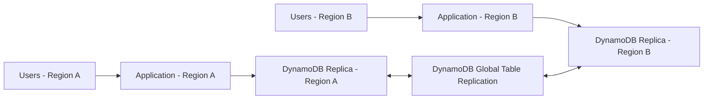
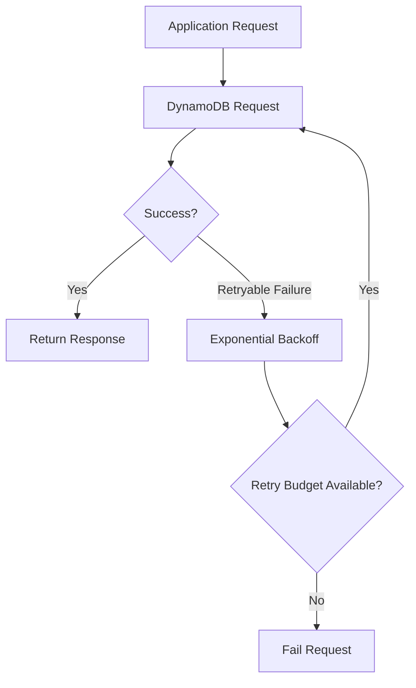
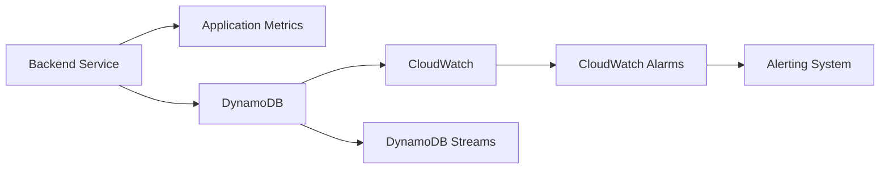
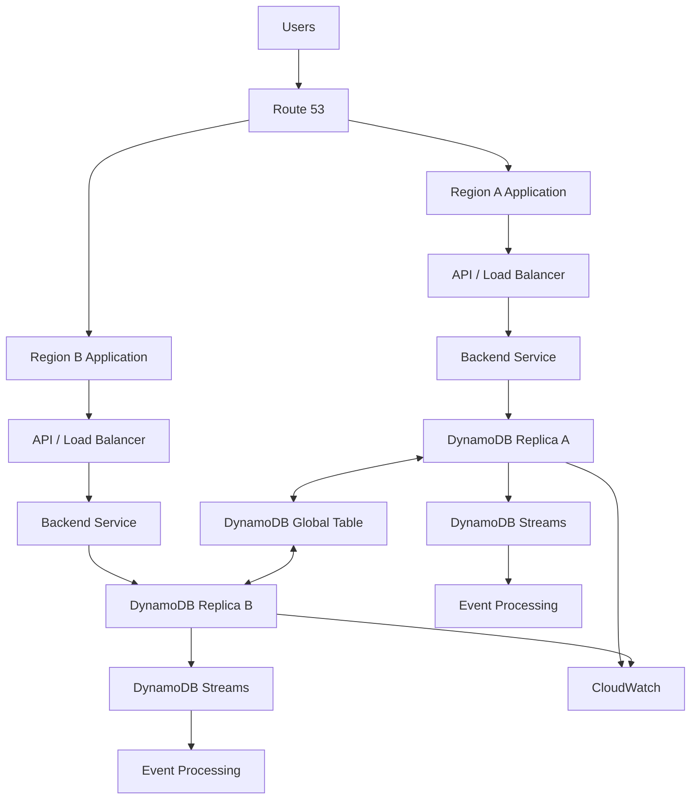

Perfect. **Your original tracked DynamoDB content has now been restored.** ✅

The remaining output:

```
```
?? "01- Concepts/09- AWS DynamoDB/"
?? "02- Architecture/09- AWS DynamoDB/"
?? "04- Operations/09- AWS DynamoDB/"
?? "05- Security/08- AWS DynamoDB/"
?? "07- Troubleshooting/08- AWS DynamoDB/"
?? "08- Interview Questions/09- AWS DynamoDB/"
?? "09- Integrations/02- AWS DynamoDB/"
?? "12- Advanced Features/"
```
```

means these are **untracked folders created by NIM**. They are not part of your original Git-tracked structure.

### First, safely see exactly what would be deleted

Run:

```
Bash


```
git clean -nd
```
```

This is a **dry run**. It will not delete anything.

You should see files/folders belonging to those NIM-created directories.

### If the output contains only the NIM-generated DynamoDB changes

Then run:

```
Bash


```
git clean -fd
```
```

That will remove the untracked NIM-generated files and folders.

Then:

```
Bash


```
git status --short
```
```

You want the result to be **completely empty**.

### Important

Do **not** use:

```
Bash


```
git clean -fdx
```
```

because `-x` can remove ignored files such as `.env`, local configuration, etc.

Use only:

```
Bash


```
git clean -fd
```
```

At that point you'll be back to the **original committed DynamoDB documentation**, with its original content and original filenames.

The next step should be to give NIM a **rename-only prompt**, and we should make it operate on the existing tracked structure rather than asking it to reorganize/recreate the DynamoDB folders.

Yes — that dry run confirms exactly what we expected. Those **8 directories are the untracked NIM-generated content**.

Your original tracked files have already been restored by:

```
Bash


```
git restore -- .
```
```

Now it is safe to remove the untracked NIM-generated directories.

Run:

```
Bash


```
git clean -fd
```
```

Then verify:

```
Bash


```
git status --short
```
```

### Expected result

`git status --short` should return **nothing**.

That means:

* ✅ Original DynamoDB files restored
* ✅ Original file contents restored
* ✅ Original filenames restored
* ✅ NIM-generated files removed
* ✅ No committed changes affected
* ✅ `03- CLI` untouched
* ✅ Working tree clean

**Do not run NIM again yet.** After `git status --short` is empty, we can make the NIM prompt much stricter so it performs **only filename renames + README generation**, without recreating or rewriting your documentation.

```
Markdown


```
# 01- Core Architecture

## Overview

Amazon DynamoDB is a fully managed NoSQL database designed for predictable low-latency access at large scale. Its architecture is built around tables, items, primary keys, partitions, indexes, capacity management, and distributed replication rather than relational concepts such as joins and normalized schemas.

A useful mental model is that DynamoDB is an **access-pattern-driven distributed key-value/document database**. Application requests are routed to the partition responsible for the requested key, allowing DynamoDB to distribute storage and request traffic horizontally.

For backend systems, the most important architectural decision is therefore not simply *where to store data*, but **how access patterns map to keys and partitions**.

A production DynamoDB architecture typically looks like:



The application normally interacts with a Regional DynamoDB endpoint. DynamoDB internally manages partition placement, replication, storage, scaling, and infrastructure availability.

---

## Core Architectural Components

At the logical level, DynamoDB is composed of several important building blocks.

| Component | Responsibility |
|---|---|
| Table | Logical container for application data |
| Item | Individual record stored in a table |
| Attribute | Data field within an item |
| Primary key | Determines how an item is uniquely identified and accessed |
| Partition key | Determines the logical partition placement of an item |
| Sort key | Enables ordered and range-based access within a partition-key value |
| GSI | Provides an additional access pattern with a different key schema |
| LSI | Provides an alternate sort-key access pattern within the same partition key |
| Partition | Physical storage and throughput unit managed by DynamoDB |
| Streams | Captures item-level changes |
| Global table | Replicates a table across multiple AWS Regions |

DynamoDB's fundamental model is intentionally simple: tables contain items, items contain attributes, and primary keys uniquely identify items. :contentReference[oaicite:0]{index=0}

---

## Request Flow

A typical request path is:



The application should normally interact with DynamoDB through the AWS SDK or an application abstraction layer rather than attempting to manage physical partitions directly.

For example, a Python backend might use `boto3`:

```python
import boto3

dynamodb = boto3.resource("dynamodb")
table = dynamodb.Table("Orders")

response = table.get_item(
    Key={
        "customer_id": "customer-123",
        "order_id": "order-456",
    }
)

item = response.get("Item")
```

The application specifies the logical key. DynamoDB handles the underlying partition routing.

---

## Partition-Based Architecture

DynamoDB distributes table data across partitions. A partition is a physical storage and throughput boundary managed by the service.

The partition key is therefore an architectural decision, not merely a schema field.

Conceptually:



A well-designed partition key distributes requests and storage sufficiently across partitions.

A poor partition key can concentrate a large percentage of traffic on a small number of partitions, creating a **hot partition**.

### Why this matters

Suppose an application uses:

```text
tenant_id = "tenant-123"
```

as the partition key and one tenant generates most of the application's traffic.

A large amount of traffic may repeatedly target the same logical partition-key value.

The problem is not that DynamoDB cannot scale horizontally. The problem is that **the workload may not be distributed sufficiently across the available partition space**.

This is why DynamoDB data modeling starts with access patterns and traffic distribution rather than traditional normalization.

---

## Primary Keys and Data Placement

DynamoDB supports two primary-key designs:

| Primary key | Behavior |
|---|---|
| Simple primary key | Partition key only |
| Composite primary key | Partition key + sort key |

A simple primary key might be:

```text
user_id
```

A composite primary key might be:

```text
PK = customer_id
SK = order_id
```

The composite design allows multiple items to share the same partition-key value while being differentiated and ordered by the sort key.

For example:

```text
PK              SK
-----------------------------
customer-123    order-001
customer-123    order-002
customer-123    order-003
customer-456    order-004
```

This enables access patterns such as:

```text
Get all orders for customer-123
```

using a single DynamoDB `Query` operation.

---

## Logical Data Model vs Physical Architecture

One of DynamoDB's important architectural characteristics is that the logical data model does not expose traditional physical database administration concepts.

You define:

```text
Table
  ↓
Primary Key
  ↓
Indexes
  ↓
Access Patterns
```

DynamoDB manages:

```text
Storage
Partition placement
Infrastructure
Replication within the Region
Hardware replacement
Scaling of the managed service
```

This abstraction is a major advantage for backend teams because operational ownership is reduced.

However, it does **not** eliminate architecture responsibilities.

The application team remains responsible for:

- Partition-key design
- Access patterns
- Index design
- Capacity configuration
- Traffic distribution
- Consistency requirements
- Retry behavior
- Data lifecycle
- Cost control
- Multi-Region strategy

---

## High Availability Architecture

A standard DynamoDB table is a Regional resource and is designed to remain resilient to infrastructure and Availability Zone failures within the Region. :contentReference[oaicite:1]{index=1}

The application should therefore normally be designed around the Regional DynamoDB endpoint rather than attempting to manage individual Availability Zones.

A simplified architecture is:



The important architectural principle is:

> Do not build application-level logic around individual DynamoDB Availability Zones.

DynamoDB abstracts that infrastructure layer.

Instead, focus application-level resilience on:

- Retries
- Timeouts
- Idempotency
- Capacity management
- Failure isolation
- Multi-Region architecture when required

---

## Scaling Architecture

DynamoDB is designed to scale horizontally by distributing workload across partitions.

The application should therefore avoid assuming that a single logical entity can absorb unlimited traffic.

For example, this design can become problematic:

```text
PK = "global"
SK = event_timestamp
```

if nearly all writes target the same partition-key value.

A better design may distribute writes using a carefully designed partition-key strategy, depending on the application's access patterns.

### Scaling decisions

When designing a high-throughput DynamoDB workload, evaluate:

| Concern | Architectural question |
|---|---|
| Partition distribution | Are requests distributed across partition-key values? |
| Item size | Are items unnecessarily large? |
| Access pattern | Can the request be satisfied with a key-based Query? |
| Indexes | Are GSIs receiving disproportionate traffic? |
| Capacity | Is the selected capacity mode appropriate? |
| Hot keys | Does one key receive abnormal traffic? |
| Write amplification | Are writes also consuming capacity on indexes? |
| Read pattern | Are expensive scans being used where queries are possible? |

---

## Capacity Architecture

DynamoDB supports two primary capacity modes:

- On-demand
- Provisioned

The choice is an architectural and operational decision.

### On-demand capacity

On-demand mode is useful when traffic is unpredictable or when minimizing capacity-management overhead is more important than optimizing for a stable workload.

Typical use cases include:

- New applications
- Variable workloads
- Development environments
- Workloads with unpredictable traffic patterns
- Systems where operational simplicity is important

### Provisioned capacity

Provisioned mode is useful when workload characteristics are predictable and the team wants explicit capacity management.

It can be combined with Application Auto Scaling.

Typical use cases include:

- Stable production workloads
- Predictable traffic
- Workloads with known capacity requirements
- Cost-sensitive systems with consistent utilization

Capacity decisions should be based on actual workload characteristics rather than choosing one mode universally.

---

## Read and Write Architecture

DynamoDB separates read and write throughput.

Conceptually:



A write may have additional architectural consequences when indexes or streams are involved.

For example:

```text
Application Write
       |
       v
DynamoDB Table
       |
       +----> GSI
       |
       +----> Stream
```

Therefore, measuring only the application's direct table write volume can underestimate the overall workload generated by the design.

---

## Index Architecture

Indexes provide alternative access paths.

A GSI can have a different partition key and sort key from the base table, allowing the application to support an additional access pattern.

For example:

```text
Base table:

PK = customer_id
SK = order_id

GSI:

PK = status
SK = created_at
```

This supports two different access patterns:

```text
Get all orders for a customer
```

and:

```text
Get recent orders with status = SHIPPED
```

The important architectural principle is:

> Design indexes around access patterns, not around fields that merely look useful.

Every index introduces additional storage, capacity, operational, and cost considerations.

---

## Data Modeling as Architecture

DynamoDB data modeling is inseparable from system architecture.

A relational design might begin with:

```text
Users
Orders
Products
Payments
```

and then derive queries through joins.

A DynamoDB design should instead begin with:

```text
What requests must the system support?
```

For example:

```text
Get customer
Get customer's recent orders
Get order by ID
Find pending orders
Get orders for a tenant
Get events for an order
```

Then design keys and indexes to satisfy those access patterns efficiently.

This approach is often called **access-pattern-first design**.

---

## Single-Table Architecture

Single-table design places multiple entity types in one DynamoDB table when doing so provides efficient access patterns.

Example:

```text
PK              SK
--------------------------------
CUSTOMER#123    CUSTOMER#123
CUSTOMER#123    ORDER#001
CUSTOMER#123    ORDER#002
ORDER#001       PAYMENT#001
ORDER#001       ITEM#001
ORDER#001       ITEM#002
```

This can allow related data to be retrieved efficiently using a small number of queries.

A backend request might become:

```text
Query:
PK = CUSTOMER#123
```

instead of requiring multiple relational-style queries.

### Advantages

- Fewer tables to manage
- Efficient access to related entities
- Reduced need for joins
- Can support highly scalable access patterns
- Can simplify certain transactional workflows

### Limitations

- Schema design becomes less intuitive
- Access patterns must be understood upfront
- Ad-hoc querying is limited
- Poor key design can affect multiple entity types
- Changes to access patterns may require additional indexes or redesign

Single-table design should therefore be used when it produces a meaningful access-pattern advantage, not simply because it is considered a DynamoDB best practice.

---

## Service Integration Architecture

DynamoDB commonly forms the persistence layer of event-driven backend systems.

A typical architecture is:



Possible responsibilities include:

- DynamoDB for transactional application state
- Streams for change capture
- Lambda for event processing
- SQS for asynchronous work
- Kafka for broader event-streaming architectures

Do not introduce asynchronous infrastructure merely because DynamoDB Streams exists. Use it when decoupling, event processing, integration, or eventual consistency provides a concrete architectural benefit.

---

## DynamoDB Streams Architecture

DynamoDB Streams captures changes made to items.

A typical flow is:

```text
Application
    |
    v
DynamoDB
    |
    v
DynamoDB Stream
    |
    v
Lambda
    |
    +----> Search index
    +----> Cache invalidation
    +----> Notification
    +----> Audit processing
```

This is useful for implementing event-driven workflows without requiring the application to synchronously perform every downstream operation.

However, stream processing introduces:

- Eventual consistency
- Retry behavior
- Duplicate processing considerations
- Failure handling
- Ordering considerations
- Consumer scaling concerns

Consumers should therefore be designed to tolerate retries and repeated processing where applicable.

---

## Multi-Region Architecture

A single-Region DynamoDB table is often sufficient for applications whose availability requirements are satisfied within one Region.

For applications requiring multi-Region availability or geographically distributed access, DynamoDB Global Tables provide multi-Region replication.

A typical architecture is:



Global Tables are multi-Region and multi-active. Applications can read and write against Regional replicas. :contentReference[oaicite:2]{index=2}

A key architectural rule is to keep an application homed in a Region using the local DynamoDB endpoint rather than deliberately sending database requests across Regions. :contentReference[oaicite:3]{index=3}

---

## Global Tables Consistency Modes

Current DynamoDB Global Tables support two consistency modes:

| Mode | Replication | Strong reads across Regions | Primary trade-off |
|---|---|---:|---|
| MREC | Asynchronous | No | Lower write latency and eventual cross-Region consistency |
| MRSC | Synchronous across participating Regions | Yes | Stronger cross-Region consistency with higher write-latency considerations |

MREC is the default mode. MRSC is designed for workloads that require strongly consistent reads across Regions and has stricter architectural requirements, including a three-Region deployment using either three replicas or two replicas plus a witness. :contentReference[oaicite:4]{index=4}

For MREC, concurrent writes to the same item in different Regions can create conflicts, which DynamoDB resolves using a last-writer-wins reconciliation mechanism. :contentReference[oaicite:5]{index=5}

This means multi-Region active-active architecture should not be treated as simply "copy the database everywhere." The application must explicitly consider:

- Conflict behavior
- Write ownership
- Request routing
- User affinity
- Consistency requirements
- Failover
- Replication latency
- Data sovereignty
- Recovery objectives

---

## Global Tables Request Routing

Avoid this architecture:

```text
Application - Region A
        |
        +----> DynamoDB Region A
        |
        +----> DynamoDB Region B
```

unless there is a specific reason to do so.

Prefer:

```text
Users - Region A --> Application - Region A --> DynamoDB - Region A

Users - Region B --> Application - Region B --> DynamoDB - Region B
```

Global Tables replicate the underlying data between replicas.

This keeps application traffic local and allows regional application stacks to operate against their local DynamoDB replica. AWS specifically recommends avoiding cross-Region DynamoDB calls from a Region-homed application. :contentReference[oaicite:6]{index=6}

---

## Reliability Architecture

DynamoDB reliability should be considered at multiple layers.

| Layer | Reliability mechanism |
|---|---|
| Infrastructure | Managed AWS infrastructure and Regional resilience |
| Storage | Managed durable storage |
| Application | Retries, timeouts, idempotency |
| Capacity | On-demand or provisioned capacity with appropriate scaling |
| Data recovery | Backups and Point-in-Time Recovery |
| Event processing | Retry-safe consumers |
| Region failure | Global Tables where required |
| Deployment | Infrastructure as Code and controlled changes |

A highly available database does not automatically produce a highly available application.

For example, an API can still fail if:

- Connection handling is poor
- Requests have excessive timeouts
- Retry storms overload the service
- Capacity is misconfigured
- Hot keys cause throttling
- Downstream dependencies fail
- Event consumers continuously retry failed messages

---

## Retry and Failure Handling

DynamoDB requests should be designed with appropriate timeout and retry behavior.

A common backend pattern is:



Retries should not be unlimited.

Production services should establish:

- Maximum retry attempts
- Maximum retry duration
- Exponential backoff
- Jitter where appropriate
- Request deadlines
- Idempotency requirements
- Error classification

A retry mechanism that retries every failure indefinitely can amplify an outage.

---

## Security Architecture

DynamoDB security should be layered.

```text
Application Identity
        |
        v
IAM Authorization
        |
        v
DynamoDB Resource
        |
        +----> Encryption at Rest
        |
        +----> CloudTrail
        |
        +----> Resource Policies
        |
        +----> VPC Endpoint Controls
```

Important controls include:

- IAM least privilege
- Resource-based policies where appropriate
- Encryption at rest
- AWS KMS for customer-managed key requirements
- CloudTrail auditing
- VPC endpoints for private application-to-service connectivity
- Fine-grained access controls where required

Do not embed AWS access keys in application source code.

Applications running on AWS should generally use IAM roles and temporary credentials through the appropriate AWS identity mechanism.

---

## Monitoring Architecture

DynamoDB should be monitored as part of the complete application stack.

A useful production monitoring model is:



Monitor both application and DynamoDB-level signals.

Important areas include:

- Consumed read capacity
- Consumed write capacity
- Throttled requests
- Latency
- Errors
- Successful request counts
- Item collection behavior where applicable
- GSI utilization
- Stream processing health
- Replication latency for Global Tables
- Application-level request latency

For MREC Global Tables, CloudWatch exposes `ReplicationLatency`, which measures replication delay between source and destination Regions. :contentReference[oaicite:7]{index=7}

Do not rely exclusively on infrastructure metrics. A service can show healthy DynamoDB metrics while the application's access pattern is still producing unacceptable latency or business-level failures.

---

## Cost Architecture

DynamoDB cost is influenced by several architectural decisions:

- Capacity mode
- Read/write volume
- Item size
- Indexes
- Data storage
- Streams
- Backups
- Global Tables
- Data transfer
- Additional AWS integrations

Indexes can increase both storage and write-related costs because changes to the base table can also require index updates.

Global Tables introduce additional replication and regional resource costs. :contentReference[oaicite:8]{index=8}

Cost optimization should therefore happen during data-model design rather than only after deployment.

### Practical cost questions

Before adding a GSI, ask:

```text
What access pattern does this index enable?
How frequently is that access pattern used?
Could the base table key design satisfy it?
What storage does the index add?
What write amplification does it introduce?
What happens to cost at 10x traffic?
```

---

## Disaster Recovery Architecture

Disaster recovery should distinguish between:

- Accidental deletion
- Application bugs
- Corrupted writes
- Table-level failures
- Availability Zone failures
- Regional failures

Point-in-Time Recovery can help recover from accidental or unwanted changes within the supported recovery window.

Backups provide another recovery mechanism.

Global Tables address a different problem: **Regional availability and multi-Region continuity**.

These mechanisms should not be treated as interchangeable.

```text
PITR / Backups
    |
    +----> Data recovery

Global Tables
    |
    +----> Multi-Region availability
```

A production DR strategy should explicitly define:

| Requirement | Question |
|---|---|
| RPO | How much data loss is acceptable? |
| RTO | How quickly must service recover? |
| Regional failure | Must the application continue operating? |
| Data recovery | Can operators restore individual historical states? |
| Traffic failover | How will users be routed to another Region? |
| Consistency | Is eventual consistency acceptable during regional operation? |

---

## Infrastructure as Code

Production DynamoDB resources should generally be managed through Infrastructure as Code.

Common choices include:

- AWS CloudFormation
- AWS CDK
- Terraform

A production definition should consider more than table creation.

Typical configuration includes:

```text
Table
Primary key
Indexes
Capacity mode
Auto scaling
Encryption
Point-in-Time Recovery
Deletion protection
Streams
Tags
Resource policies
Alarms
Global Table replicas
```

Global Tables require additional care with infrastructure management because multi-Region resources have coordination requirements. AWS recommends using the current Global Tables architecture and notes specific CloudFormation considerations for multi-Region resource coordination. :contentReference[oaicite:9]{index=9}

---

## Production Architecture Example

A production backend might use the following architecture:



This architecture is appropriate only when multi-Region availability provides sufficient business value to justify its additional operational and consistency complexity.

For many applications, a single-Region DynamoDB architecture is simpler and sufficient.

---

## Architecture Decision Framework

When designing a DynamoDB architecture, work through the following sequence:

```text
Business requirements
        ↓
Required access patterns
        ↓
Data model
        ↓
Primary key design
        ↓
Partition distribution
        ↓
Indexes
        ↓
Capacity mode
        ↓
Consistency requirements
        ↓
Failure handling
        ↓
Monitoring
        ↓
Security
        ↓
Disaster recovery
        ↓
Multi-Region requirements
```

This prevents teams from starting with infrastructure features before understanding the application's workload.

---

## Common Architecture Mistakes

### Treating DynamoDB Like PostgreSQL

DynamoDB is not a relational database with joins added later.

Trying to reproduce normalized relational schemas without considering access patterns often leads to excessive requests, inefficient scans, or unnecessary application-side joins.

### Choosing Partition Keys Based Only on Uniqueness

A unique key is not automatically a good partition key.

The key should provide both:

- Correct item identity
- Appropriate workload distribution

### Using Scans for Normal Application Requests

A `Scan` reads through table or index data rather than directly targeting the required key space.

For high-scale application paths, design access patterns around `GetItem` and `Query` whenever possible.

### Creating GSIs Without a Workload Justification

Every index should correspond to a real access pattern.

Unused indexes increase operational and cost overhead.

### Ignoring Hot Keys

A workload can throttle even when the overall table capacity appears sufficient if traffic is concentrated on a small number of keys.

Monitor traffic distribution rather than looking only at aggregate throughput.

### Assuming Global Tables Solve Every DR Problem

Global Tables improve multi-Region availability, but they introduce consistency, conflict, routing, and operational considerations.

They are not a replacement for backups or a complete disaster recovery plan.

### Building Cross-Region Database Calls into the Application

Applications should generally use the local DynamoDB Regional endpoint and allow Global Tables to handle replication. :contentReference[oaicite:10]{index=10}

### Designing Retries Without Idempotency

Retries can duplicate application actions if the operation is not designed to be safely repeated.

For write-heavy APIs, explicitly consider idempotency keys and conditional writes where appropriate.

---

## Senior-Level Architecture Considerations

At senior backend level, DynamoDB architecture should be evaluated as a system rather than as an isolated database.

Important questions include:

- What are the application's dominant access patterns?
- What is the expected read/write distribution?
- Which partition-key values will receive the most traffic?
- What happens when traffic increases by 10x?
- Which requests require strong consistency?
- Which data can tolerate eventual consistency?
- Which GSIs are required and why?
- What is the expected write amplification?
- What happens when a downstream stream consumer fails?
- How will retries behave during throttling?
- What happens if one Region becomes unavailable?
- Are concurrent multi-Region writes possible?
- What is the conflict-resolution strategy?
- What are the RPO and RTO requirements?
- How will the schema evolve?
- How will the team detect hot keys before they become incidents?
- What is the cost at normal and peak traffic?

The most important architectural skill is being able to connect these questions back to the application's actual workload.

---

## Key Takeaways

- DynamoDB architecture is fundamentally **access-pattern-driven**; primary keys and indexes determine how efficiently application requests can be served.
- Partition-key design is critical for horizontal scalability because uneven traffic distribution can create hot partitions even when aggregate capacity appears sufficient.
- DynamoDB provides Regional resilience and managed infrastructure, while application teams remain responsible for retries, idempotency, capacity strategy, monitoring, and failure handling.
- Global Tables provide multi-Region capabilities, but consistency mode, conflict behavior, request routing, replication latency, and disaster recovery requirements must be explicitly designed.
- Production DynamoDB architecture should optimize for the complete system—**data access, scalability, reliability, security, observability, and cost**—rather than treating the database as an isolated component.
```
```