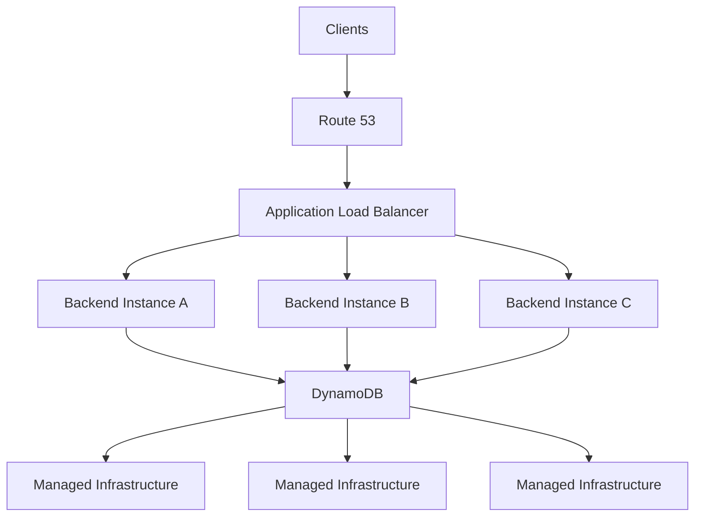
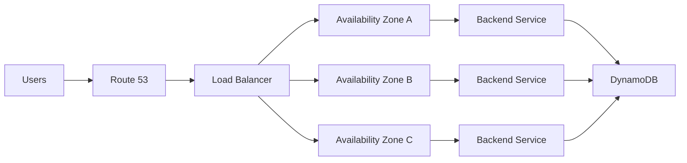
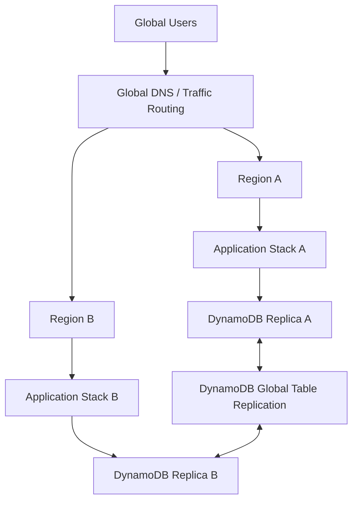
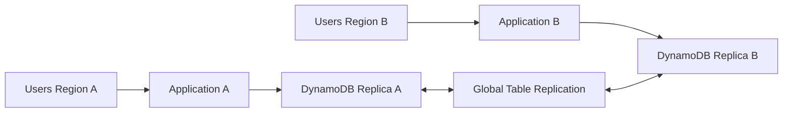
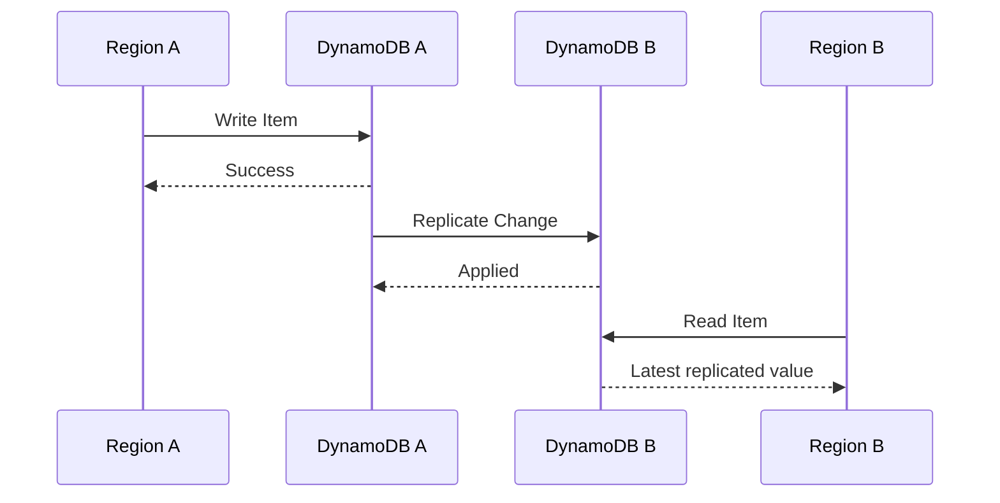
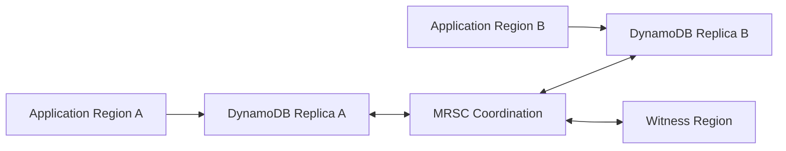
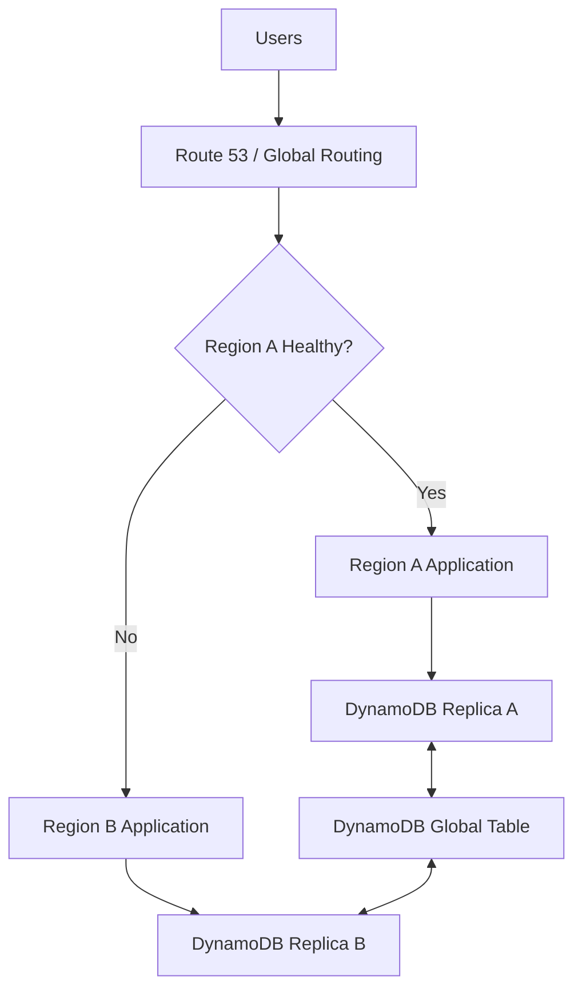
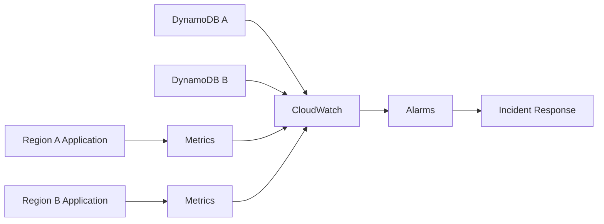

# 02- High Availability Architecture

## Overview

Amazon DynamoDB is designed as a highly available managed database service. A standard DynamoDB table is a Regional resource and is intrinsically resilient to infrastructure failures, including Availability Zone failures. AWS states that a single-Region DynamoDB table is designed for 99.99% availability. :contentReference[oaicite:0]{index=0}

High availability in DynamoDB should therefore be considered at two different levels:

- **Single-Region high availability** — resilience to infrastructure and Availability Zone failures within one AWS Region.
- **Multi-Region high availability** — resilience to a Regional failure by using DynamoDB Global Tables and application traffic failover.

The important architectural distinction is that **DynamoDB provides database-level availability, but the application must still provide end-to-end availability**. Load balancing, application replicas, health checks, routing, retries, timeouts, idempotency, dependency isolation, and disaster recovery all remain application architecture concerns.

---

## Single-Region High Availability

A single-Region DynamoDB table is already designed to remain available despite failures of underlying infrastructure and an Availability Zone. :contentReference[oaicite:1]{index=1}

A typical backend architecture can therefore be:



The application instances should be distributed across multiple Availability Zones, while DynamoDB abstracts the underlying database infrastructure.

### Key principle

Do not attempt to manually distribute DynamoDB table data across Availability Zones.

The application should interact with the DynamoDB Regional endpoint. AWS manages the underlying infrastructure required to provide Regional availability.

---

## What DynamoDB Handles vs What the Application Handles

High availability is a shared responsibility.

| Responsibility | DynamoDB | Application |
|---|---:|---:|
| Infrastructure resilience | Yes | No |
| Availability Zone resilience | Yes | No |
| Managed storage | Yes | No |
| Database endpoint | Yes | No |
| Partition distribution | Yes | Data-model dependent |
| Capacity configuration | Partially | Yes |
| Retry strategy | SDK support | Yes |
| Request timeouts | SDK support | Yes |
| Idempotency | No | Yes |
| API failover | No | Yes |
| Application health checks | No | Yes |
| Multi-Region traffic routing | No | Yes |
| Business-level recovery | No | Yes |
| Disaster recovery strategy | Supporting features | Yes |

This distinction is critical during incident analysis.

If a DynamoDB request fails because of a transient condition, the application should have appropriate retry behavior.

If the entire application stack in a Region becomes unavailable, DynamoDB alone cannot redirect users to another application Region.

---

## Single-Region Availability Architecture

A production single-Region architecture should normally distribute the application tier across multiple Availability Zones.



If one application Availability Zone becomes unavailable, the load balancer can stop routing traffic to unhealthy application instances while traffic continues through healthy instances.

DynamoDB remains the common Regional persistence layer.

---

## DynamoDB Availability Does Not Mean Application Availability

A common architectural mistake is assuming:

```text
DynamoDB is highly available
        =
My application is highly available
```

That is incorrect.

Consider:

```text
Client
  |
  v
Application
  |
  v
DynamoDB
```

If the application has only one EC2 instance and that instance fails, DynamoDB can remain completely healthy while the application is unavailable.

A highly available system therefore needs availability across the complete request path:

```text
Client
  |
  v
DNS / Routing
  |
  v
Load Balancer
  |
  +----> Application AZ A
  |
  +----> Application AZ B
  |
  +----> Application AZ C
             |
             v
         DynamoDB
```

---

## Failure Domains

A useful HA architecture starts by identifying failure domains.

| Failure | Typical response |
|---|---|
| Application process failure | Restart or replace instance |
| Application instance failure | Load balancer removes unhealthy instance |
| Application AZ failure | Route traffic to other AZs |
| DynamoDB infrastructure failure | DynamoDB managed resilience |
| Regional application failure | Redirect traffic to another Region |
| Regional DynamoDB failure | Use another Global Table replica |
| Data corruption | Restore from backup or PITR |
| Application bug | Roll back deployment and recover data if necessary |

The larger the failure domain, the more infrastructure and operational planning is required.

---

## Multi-Region High Availability

DynamoDB Global Tables replicate data between two or more AWS Regions. A multi-Region DynamoDB table is designed for 99.999% availability and can be used as part of an architecture resilient to Regional failures. :contentReference[oaicite:2]{index=2}

A multi-Region architecture can look like:



Each application Region accesses its local DynamoDB Regional endpoint.

DynamoDB does **not** provide a single global endpoint. AWS recommends that an application homed in one Region access the local DynamoDB endpoint rather than making cross-Region DynamoDB calls. :contentReference[oaicite:3]{index=3}

---

## Global Tables Architecture

A Global Table consists of replica tables in multiple AWS Regions. All replicas share the same table name, primary key schema, and item data. Writes made to one replica are automatically replicated to the other participating replicas. :contentReference[oaicite:4]{index=4}

Conceptually:

```text
                    Global Table
                         |
          +--------------+--------------+
          |                             |
          v                             v
   DynamoDB Region A             DynamoDB Region B
          |                             |
          v                             v
   Application A                 Application B
```

The application should normally use the local replica:

```text
Region A Application
        |
        v
DynamoDB Region A

Region B Application
        |
        v
DynamoDB Region B
```

Avoid:

```text
Region A Application
        |
        +------> DynamoDB Region A
        |
        +------> DynamoDB Region B
```

Cross-Region database calls add network latency and make the application more dependent on another Region.

---

## Active-Active Architecture

DynamoDB Global Tables support multi-Region active-active architectures.

With Multi-Region Eventual Consistency (MREC), each replica can accept reads and writes. A local write is asynchronously replicated to the other Regions. :contentReference[oaicite:5]{index=5}



This architecture provides low-latency local access while allowing multiple Regions to serve traffic.

However, active-active is not automatically the correct choice.

It introduces additional concerns:

- Concurrent writes to the same item
- Conflict resolution
- Regional routing
- Consistency
- Replication latency
- Data ownership
- Failover behavior
- Operational complexity

---

## MREC and MRSC

Current DynamoDB Global Tables support two consistency modes:

- Multi-Region Eventual Consistency (MREC)
- Multi-Region Strong Consistency (MRSC)

MREC is the default mode. MRSC was introduced to support workloads requiring strong consistency across Regions. :contentReference[oaicite:6]{index=6}

| Characteristic | MREC | MRSC |
|---|---|---|
| Replication | Asynchronous | Synchronous |
| Cross-Region read consistency | Eventual | Strong |
| Write latency | Lower | Higher |
| RPO | Replication-delay based | Zero |
| Multi-Region writes | Supported | Supported with stronger coordination |
| Availability trade-off | Favors latency | Favors global consistency |
| Default | Yes | No |

The choice should be driven by business requirements rather than simply selecting the strongest consistency option.

---

## Multi-Region Eventual Consistency

MREC asynchronously replicates item changes to participating Regions. Changes are typically propagated within about a second, although replication latency depends on the workload and Region topology. :contentReference[oaicite:7]{index=7}

Example:



For most applications, MREC provides a good balance between:

- Regional availability
- Low write latency
- Operational simplicity
- Multi-Region replication

The trade-off is that a recently written item may not immediately be visible in another Region.

---

## MREC Conflict Resolution

MREC is multi-active. The same item can be modified in multiple Regions.

If concurrent writes target the same item, DynamoDB resolves the conflict using a last-writer-wins mechanism based on internal timestamps. :contentReference[oaicite:8]{index=8}

For example:

```text
Region A:
Order #123 -> status = SHIPPED

Region B:
Order #123 -> status = CANCELLED
```

If these updates conflict during replication, the application must be designed with the possibility that one update will supersede another.

### Production recommendation

Avoid uncontrolled concurrent writes to the same logical entity from multiple Regions when the business operation cannot tolerate last-writer-wins semantics.

Instead, consider:

- Region affinity
- Single-writer ownership
- Conditional writes
- Version attributes
- Explicit conflict handling
- Business-level reconciliation

---

## Multi-Region Strong Consistency

MRSC provides strongly consistent reads across participating Regions. DynamoDB synchronously replicates item changes before the write returns. :contentReference[oaicite:9]{index=9}

MRSC is appropriate when the system requires global read consistency and can accept the associated latency and architectural constraints.

An MRSC global table can be configured with:

- Three replicas, or
- Two replicas and one witness

The witness does not serve application reads or writes; it participates in the consistency architecture. :contentReference[oaicite:10]{index=10}

A simplified architecture is:



MRSC should be selected only when the application's consistency requirements justify the additional latency and regional constraints.

---

## Choosing MREC vs MRSC

Use MREC when:

- Eventual consistency across Regions is acceptable.
- Low write latency is important.
- The application can tolerate a non-zero RPO.
- The system benefits from flexible Region selection.
- Concurrent multi-Region writes can be handled safely.

Use MRSC when:

- Strong consistency across Regions is required.
- The application requires an RPO of zero.
- Higher write latency is acceptable.
- The workload fits MRSC's supported Region topology and operational constraints. :contentReference[oaicite:11]{index=11}

A useful decision framework is:

```text
Do we need multi-Region availability?
            |
            +-- No --> Single-Region DynamoDB
            |
            +-- Yes
                 |
                 v
        Is cross-Region strong
        consistency required?
                 |
          +------+------+
          |             |
         No            Yes
          |             |
          v             v
        MREC           MRSC
```

---

## Regional Failover

Multi-Region DynamoDB does not automatically mean that user traffic is automatically routed to a healthy application Region.

The application architecture needs a traffic-routing mechanism.

For example:



Possible traffic-routing components include:

- Route 53
- AWS Global Accelerator
- CloudFront
- Application-level routing

The routing layer should be based on the actual failure model.

For example, an application can be unhealthy while DynamoDB remains healthy. Therefore, a DNS health check that only tests database availability may incorrectly keep routing users to a broken application stack.

---

## Failover vs Failback

Failover moves traffic away from an unhealthy Region.

Failback moves traffic back after the original Region has recovered.

A production design should explicitly define both.

```text
Normal Operation
      |
      v
Region A Active
Region B Standby / Active
      |
      v
Regional Failure
      |
      v
Traffic Shift
      |
      v
Region B Serves Traffic
      |
      v
Region A Recovery
      |
      v
Recovery Validation
      |
      v
Controlled Failback
```

Do not automatically fail back immediately after a Region becomes reachable.

The recovered Region should first be validated for:

- Application health
- DynamoDB replica health
- Replication status
- Dependency health
- Data consistency requirements
- Capacity
- Configuration
- Deployment version

---

## Regional Evacuation

A Regional evacuation is broader than a simple DNS change.

A production evacuation may involve:

1. Detecting the failure.
2. Determining whether the failure is isolated or Regional.
3. Redirecting application traffic.
4. Ensuring the destination application stack has sufficient capacity.
5. Verifying local DynamoDB connectivity.
6. Monitoring replication and errors.
7. Protecting against retry storms.
8. Validating downstream dependencies.
9. Maintaining the appropriate write strategy.
10. Restoring normal routing only after recovery validation.

AWS recommends planning routing and evacuation strategies based on the chosen Global Tables consistency mode and write mode. :contentReference[oaicite:12]{index=12}

---

## Write Modes and Regional Ownership

Multi-Region architecture should distinguish **consistency mode** from **write strategy**.

They are related but not identical.

A system may choose to:

- Accept writes in multiple Regions.
- Route writes to a preferred Region.
- Assign users or tenants to a home Region.
- Use Region-specific ownership for particular entities.

For example:

```text
Tenant A -> Region A owns writes
Tenant B -> Region B owns writes
```

This can reduce conflicting writes while preserving multi-Region availability.

For workloads where concurrent updates to the same entity are dangerous, a controlled write ownership strategy can be easier to reason about than unrestricted active-active writes.

---

## Application Failover Design

The application layer should avoid embedding assumptions such as:

```python
# Avoid hard-coding cross-region failover into every request.
if dynamodb_region_a_failed:
    call_region_b_dynamodb()
```

Instead, the application should normally use its configured local Regional endpoint.

For example:

```python
import boto3

dynamodb = boto3.resource(
    "dynamodb",
    region_name="ap-south-1",
)

table = dynamodb.Table("Orders")
```

If the entire application stack moves to another Region, the application deployed there should use that Region's DynamoDB replica.

This keeps Region failover primarily at the traffic and deployment layer rather than turning every database call into a cross-Region routing problem.

---

## Retry Strategy During Failover

Regional failover can create a temporary increase in traffic.

Suppose Region A fails:

```text
Normal:

Region A -> 50% traffic
Region B -> 50% traffic

Failure:

Region A -> 0%
Region B -> 100%
```

The surviving Region must have enough capacity to absorb the additional load.

Retry behavior can make this worse:

```text
Region A failure
      |
      v
Clients retry
      |
      v
More requests to Region B
      |
      v
Higher load
      |
      v
More latency
      |
      v
More retries
```

This is a retry storm.

Use:

- Exponential backoff
- Jitter
- Request deadlines
- Bounded retry budgets
- Circuit breakers where appropriate
- Idempotent operations
- Load shedding
- Capacity planning

---

## Capacity Planning for Regional Failover

A multi-Region architecture must consider **failover capacity**, not only normal capacity.

If each Region normally handles 50% of traffic, ask whether one Region can handle 100%.

For example:

| Region | Normal traffic | Failover capacity |
|---|---:|---:|
| Region A | 50% | 100% |
| Region B | 50% | 100% |

If Region B can handle only 70% of total traffic, the system is not fully prepared for Region A failure.

This applies to:

- API servers
- Kubernetes clusters
- ECS services
- Lambda concurrency
- DynamoDB capacity
- Redis
- Kafka consumers
- SQS workers
- External dependencies

DynamoDB availability does not remove the need for application capacity planning.

---

## Monitoring High Availability

High availability requires monitoring the complete failure path.

Important application-level signals include:

- Request error rate
- Request latency
- HTTP 5xx responses
- Load balancer target health
- Application CPU and memory
- Container health
- Lambda errors and throttles
- DynamoDB throttling
- DynamoDB request latency
- DynamoDB system errors
- Global Table replication health
- Regional traffic distribution

For MREC Global Tables, `ReplicationLatency` measures the elapsed time between a write in one replica and its appearance in another replica. :contentReference[oaicite:13]{index=13}

MRSC does not publish the MREC `ReplicationLatency` metric because replication is synchronous rather than asynchronous. :contentReference[oaicite:14]{index=14}

A practical monitoring architecture is:



---

## Failure Detection

Detection should occur at multiple levels.

### Application health

Check:

- HTTP success rate
- Request latency
- Dependency health
- Application readiness

### Database health

Check:

- Throttling
- Errors
- Latency
- Capacity utilization
- Replica status

### Regional health

Check:

- Application infrastructure
- Networking
- AWS service health
- Dependency availability
- Regional error rates

Do not define a Region as healthy merely because its DynamoDB replica is reachable.

A Region is healthy only when the **complete application stack can safely serve production traffic**.

---

## Disaster Recovery and RPO

High availability and disaster recovery overlap but are not identical.

A useful distinction is:

```text
High Availability
    |
    +--> Keep serving traffic during failures

Disaster Recovery
    |
    +--> Recover from larger failures or data-loss scenarios
```

For Global Tables:

- MREC has an RPO related to replication delay.
- MRSC supports an RPO of zero. :contentReference[oaicite:15]{index=15}

Backups and Point-in-Time Recovery solve different problems from Global Tables.

```text
Global Tables
    |
    +--> Regional continuity

PITR / Backups
    |
    +--> Data recovery
```

A production architecture may need both.

---

## Security During Regional Failover

Security controls must remain valid in every Region.

Verify that:

- IAM roles exist in each application environment.
- KMS configuration supports the selected architecture.
- Resource policies are correctly configured.
- VPC endpoints are available where required.
- Secrets are available in the failover Region.
- Network controls allow application-to-DynamoDB access.
- Audit logging covers all participating Regions.

DynamoDB Global Tables replicas use the same fundamental IAM and resource-based security mechanisms as single-Region tables. Global Tables also require appropriate permissions and service-linked roles for replication and management. :contentReference[oaicite:16]{index=16}

A failover that bypasses normal security controls is not a successful HA design.

---

## Cost Considerations

Multi-Region availability increases cost.

Global Tables incur replicated write charges in each Region containing a replica. :contentReference[oaicite:17]{index=17}

Additional costs can also come from:

- Duplicate application infrastructure
- Additional load balancers
- Additional monitoring
- Cross-Region replication
- Backups
- Increased provisioned capacity
- Failover capacity
- Operational tooling

A Region should not be added merely because it appears architecturally impressive.

The business requirement should justify:

```text
Additional availability
        +
Additional latency options
        +
Additional operational complexity
        +
Additional cost
```

---

## Testing High Availability

An HA architecture is incomplete until it has been tested.

Useful tests include:

- Application instance failure
- Availability Zone failure
- Dependency failure
- DynamoDB throttling
- Increased latency
- Application Region failure
- Traffic failover
- Traffic failback
- Global Table replication delay
- Application retry behavior
- Data consistency behavior
- Capacity exhaustion

For example:

```text
Test:
Region A application unavailable

Expected:
1. Health checks detect failure.
2. Traffic moves to Region B.
3. Region B has sufficient capacity.
4. Region B uses local DynamoDB.
5. Requests continue successfully.
6. Replication remains healthy.
7. No uncontrolled retry storm occurs.
8. Recovery and failback are performed safely.
```

AWS provides fault-injection testing guidance for Global Tables specifically to help validate multi-Region resilience. :contentReference[oaicite:18]{index=18}

---

## Common High Availability Mistakes

### Mistake: Treating DynamoDB as a Single-Server Database

DynamoDB is a managed distributed service. Designing application architecture around a single database server or Availability Zone is incorrect.

### Mistake: Using Cross-Region DynamoDB Calls as Failover

Cross-Region database calls increase latency and create additional dependencies.

Prefer local Regional access from each application Region. :contentReference[oaicite:19]{index=19}

### Mistake: Assuming Global Tables Automatically Fail Over Users

Global Tables replicate data, but application traffic still needs a routing and failover strategy.

### Mistake: Ignoring Failover Capacity

A Region that normally handles 50% of traffic must have enough capacity to handle the required percentage during a failure.

### Mistake: Using MREC Without Understanding Conflicts

MREC supports multi-active writes, but concurrent writes to the same item can conflict and are resolved using last-writer-wins behavior. :contentReference[oaicite:20]{index=20}

### Mistake: Choosing MRSC Without Evaluating Latency

MRSC provides stronger global consistency but introduces higher write and strongly consistent read latency compared with MREC. :contentReference[oaicite:21]{index=21}

### Mistake: Testing Only the Database

A database can remain healthy while the API, network, authentication layer, cache, queue, or application deployment is broken.

Test the complete system.

---

## Production HA Checklist

Before calling a DynamoDB architecture highly available, verify:

- Application instances span multiple Availability Zones.
- Load balancing removes unhealthy instances.
- DynamoDB is accessed through the appropriate Regional endpoint.
- Retry behavior uses bounded exponential backoff.
- Writes are idempotent where retries can duplicate operations.
- Capacity is sufficient for expected failure scenarios.
- Monitoring detects application and database failures.
- Alerts are connected to an incident response process.
- PITR and backup requirements are defined.
- RPO and RTO are documented.
- Multi-Region requirements are explicitly justified.
- Global Tables consistency mode is intentionally selected.
- Regional routing and evacuation procedures are documented.
- Failover and failback have been tested.
- Security controls work in every participating Region.
- The team understands MREC conflict behavior if using active-active writes.

---

## Key Takeaways

- DynamoDB provides strong single-Region availability and resilience to infrastructure and Availability Zone failures, but application-level high availability still requires multi-AZ application deployment and failure-aware operations.
- DynamoDB Global Tables extend the architecture to multi-Region availability, with applications normally accessing the local Regional replica rather than making cross-Region database calls.
- MREC favors lower latency and eventual cross-Region consistency, while MRSC provides strong cross-Region consistency and zero RPO at the cost of higher latency and stricter architectural requirements.
- Regional failover is an application architecture problem: traffic routing, capacity, retries, health detection, security, and failback must all be deliberately designed and tested.
- A production HA design should be validated through failure testing and measured against explicit RPO, RTO, availability, consistency, performance, and cost requirements.