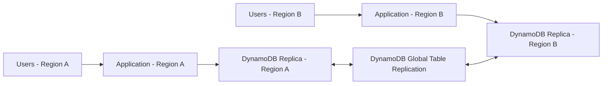
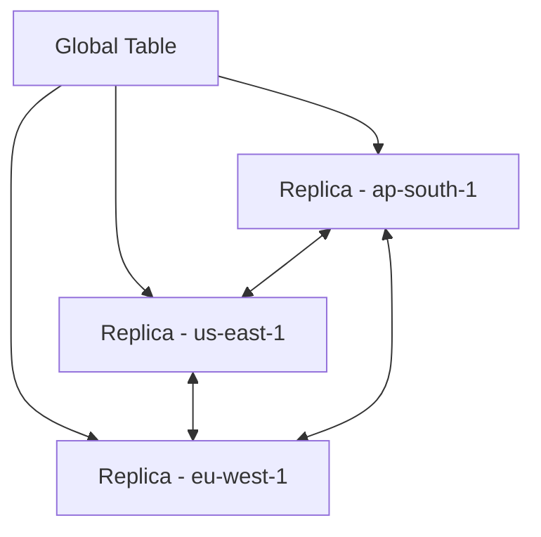
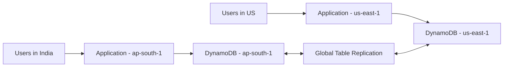
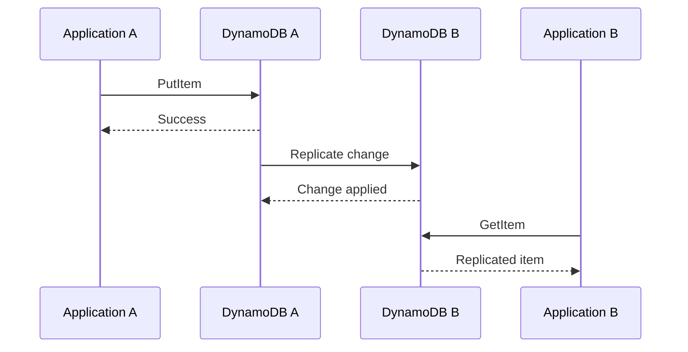
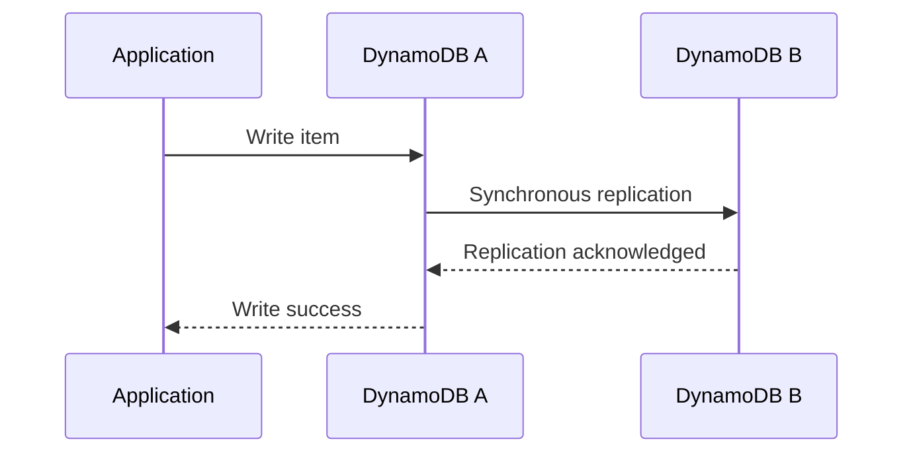
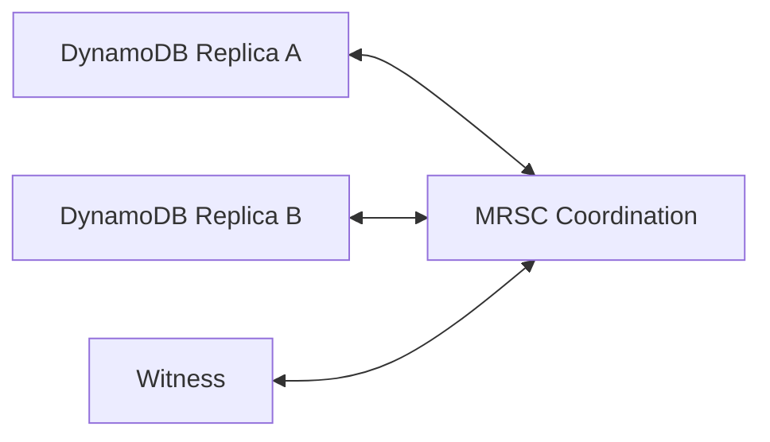
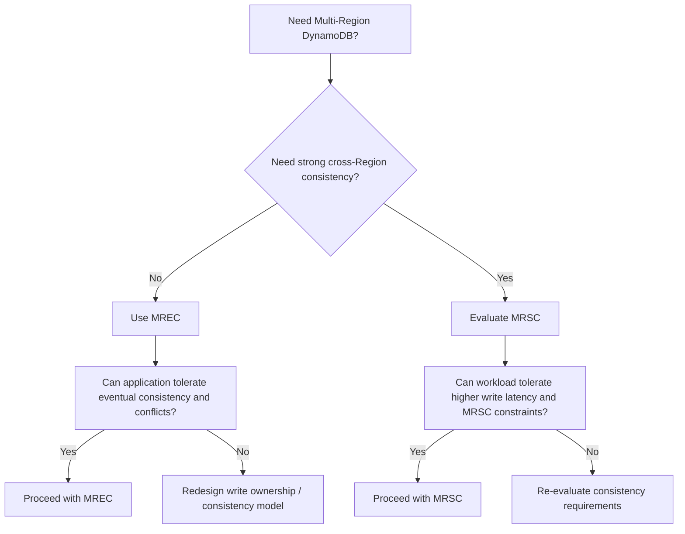
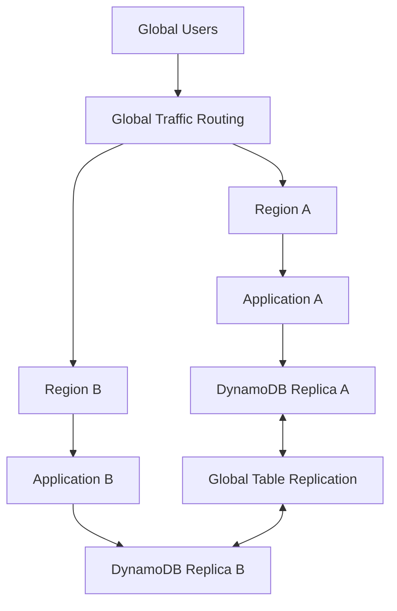
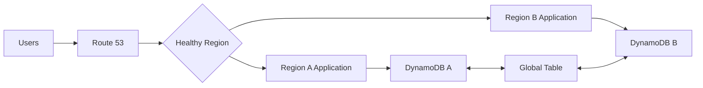
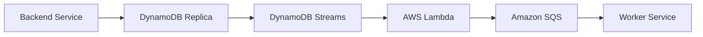

# 03- Global Tables Architecture

## Overview

Amazon DynamoDB Global Tables provide a multi-Region architecture for applications that require data availability across AWS Regions. A Global Table consists of DynamoDB replicas deployed in multiple Regions, with DynamoDB managing replication between replicas.

Global Tables are primarily useful when a system must continue serving users during a Regional failure, reduce database access latency for geographically distributed users, or support multi-Region application deployments.

A typical architecture is:



The key architectural principle is:

> Each application Region should normally access its local DynamoDB replica rather than making cross-Region database calls.

Global Tables do not eliminate the need for application-level routing, failover, consistency decisions, capacity planning, observability, and disaster recovery.

---

## Why Global Tables Exist

A single-Region DynamoDB table provides strong Regional availability, but applications that require Regional isolation or Regional disaster recovery may need replicas in multiple Regions.

Without Global Tables:

```text
Region A
    |
    v
DynamoDB A
```

If Region A becomes unavailable, the application must recover using another mechanism.

With Global Tables:

```text
Region A                       Region B
   |                              |
   v                              v
DynamoDB A  <---------------->  DynamoDB B
```

The application can deploy independent application stacks in multiple Regions and use the local DynamoDB replica in each Region.

Typical reasons to use Global Tables include:

- Regional disaster recovery
- Multi-Region application deployment
- Global user base
- Lower database access latency for geographically distributed users
- Regional data processing
- Multi-Region active-active architectures

Global Tables should not be introduced simply because an application is large. They add operational and consistency complexity and should be justified by explicit availability, latency, or geographic requirements.

---

## Global Tables Architecture

A Global Table consists of replicas of the same DynamoDB table in different AWS Regions.

Each replica uses the same fundamental table schema and participates in replication.



The exact number and placement of Regions should be driven by:

- User geography
- Availability requirements
- Regulatory requirements
- Latency requirements
- Disaster recovery objectives
- Consistency requirements
- Cost

A three-Region architecture is not automatically better than a two-Region architecture.

---

## Application-to-Replica Routing

A multi-Region application should normally use the DynamoDB replica located in the same Region as the application.

For example:



Avoid designing every application instance to randomly select a DynamoDB Region.

For example, this is generally undesirable:

```text
Application in ap-south-1
        |
        +----> DynamoDB ap-south-1
        |
        +----> DynamoDB us-east-1
```

Cross-Region database calls introduce:

- Additional network latency
- Additional failure dependencies
- More complicated retry behavior
- More difficult incident analysis
- Increased dependence on another Region

The preferred pattern is:

```text
Application Region A
        |
        v
DynamoDB Region A

Application Region B
        |
        v
DynamoDB Region B
```

DynamoDB handles replication between the replicas.

---

## Global Tables Consistency Modes

DynamoDB Global Tables currently support two consistency modes:

- Multi-Region Eventual Consistency (MREC)
- Multi-Region Strong Consistency (MRSC)

The consistency mode is an architectural decision because it affects latency, failure behavior, replication semantics, and application design.

| Characteristic | MREC | MRSC |
|---|---|---|
| Replication model | Asynchronous | Synchronous |
| Cross-Region consistency | Eventual | Strong |
| Write latency | Lower | Higher |
| Default mode | Yes | No |
| Multi-Region availability | Yes | Yes |
| Cross-Region RPO | Non-zero due to replication behavior | Zero |
| Conflict considerations | Important for concurrent writes | Stronger coordination |
| Architectural complexity | Lower | Higher |

MREC is appropriate for many globally distributed workloads where eventual consistency across Regions is acceptable.

MRSC is appropriate when the application requires strong cross-Region consistency and can accept its additional latency and architectural requirements.

---

## Multi-Region Eventual Consistency

MREC replicates changes asynchronously between replicas.

A write can be acknowledged by the local replica before the change is visible in another Region.



This model provides a good balance between:

- Low write latency
- Regional independence
- Multi-Region availability
- Operational flexibility

The trade-off is that applications must tolerate temporary differences between replicas.

### Example

Suppose an order is updated in `ap-south-1`:

```text
Order #1001
status = SHIPPED
```

Immediately afterward, a request reaches `us-east-1`.

The application in `us-east-1` may temporarily observe the previous value until replication completes.

This is acceptable for workloads where cross-Region eventual consistency is part of the design.

---

## MREC Conflict Resolution

MREC allows writes in multiple Regions.

That introduces the possibility of concurrent writes to the same item.

For example:

```text
Region A:
Order #1001 -> status = SHIPPED

Region B:
Order #1001 -> status = CANCELLED
```

If the updates conflict, DynamoDB uses last-writer-wins reconciliation for the conflicting item. ([docs.aws.amazon.com](https://docs.aws.amazon.com/amazondynamodb/latest/developerguide/V2globaltables_HowItWorks.html?utm_source=chatgpt.com))

This is one of the most important considerations when designing active-active systems.

### Production implication

Do not assume that active-active writes automatically preserve business semantics.

For business-critical entities, consider:

- Region ownership
- User affinity
- Conditional writes
- Version attributes
- Idempotency
- Conflict detection
- Application-level reconciliation
- Single-writer patterns

For example, an application could assign a customer's writes to a home Region:

```text
customer-123 -> ap-south-1
customer-456 -> us-east-1
```

This can reduce the probability of conflicting concurrent updates while retaining multi-Region read availability.

---

## Multi-Region Strong Consistency

MRSC provides strongly consistent cross-Region behavior by synchronously coordinating replication.

A simplified flow is:



The additional coordination means that the write path can have higher latency than an asynchronous replication model.

MRSC is therefore not simply a "better MREC." It represents a different consistency and availability trade-off.

Use it when strong cross-Region consistency is a genuine business requirement.

---

## MRSC Region Topology

MRSC has stricter topology requirements than MREC.

An MRSC global table can use:

- Three DynamoDB replicas, or
- Two replicas plus a witness

A witness participates in the consistency architecture but does not serve application reads and writes.

Conceptually:



This architecture exists because strong cross-Region consistency requires additional coordination and quorum behavior.

The exact Region topology should be selected based on the application's availability requirements, supported AWS Regions, and current DynamoDB Global Tables capabilities.

---

## MREC vs MRSC Decision

A practical decision process is:



### Choose MREC when

- Eventual cross-Region consistency is acceptable.
- Low write latency is important.
- The workload can tolerate replication delay.
- Multi-Region availability is the primary requirement.
- The application can handle concurrent-write conflicts.

### Choose MRSC when

- Strong cross-Region consistency is required.
- The application cannot tolerate stale cross-Region reads.
- The workload requires an RPO of zero.
- Additional write latency is acceptable.
- The application's Region topology satisfies MRSC requirements.

---

## Active-Active Architecture

MREC is commonly used for active-active architectures.

Both Regions can independently serve application traffic:



This provides several advantages:

- Both Regions can serve traffic.
- Capacity is utilized continuously.
- Regional failure does not require starting an unused application stack.
- Users can be routed to geographically closer infrastructure.

However, active-active architectures are significantly harder to operate.

The application must handle:

- Duplicate requests
- Concurrent writes
- Eventual consistency
- Conflict resolution
- Regional routing
- Failover
- Failback
- Data ownership

---

## Active-Passive Architecture

Global Tables can also support an active-passive disaster recovery strategy.

For example:

```text
Normal:

Users
  |
  v
Region A
  |
  v
DynamoDB A

DynamoDB A
    |
    v
DynamoDB B
```

During a Regional failure:

```text
Users
  |
  v
Region B
  |
  v
DynamoDB B
```

Region B can maintain replicated data while application traffic remains primarily in Region A during normal operation.

This approach can be operationally simpler than unrestricted active-active writes.

The trade-off is that standby infrastructure may be underutilized during normal operation.

---

## Active-Active vs Active-Passive

| Characteristic | Active-Active | Active-Passive |
|---|---|---|
| Normal traffic | Multiple Regions | Primarily one Region |
| Regional utilization | High | Lower in standby |
| Failover speed | Potentially faster | Requires traffic shift |
| Operational complexity | Higher | Lower |
| Conflict risk | Higher | Lower |
| Cost | Higher | Potentially lower |
| Global latency | Better | Depends on primary Region |
| Best fit | Global applications | DR-focused architectures |

The choice should be based on business requirements rather than infrastructure preference.

---

## Traffic Routing

Global Tables replicate data, but they do not by themselves decide where users should send HTTP or gRPC requests.

Traffic routing is an application architecture responsibility.

A typical architecture is:



Potential routing technologies include:

- Amazon Route 53
- AWS Global Accelerator
- Amazon CloudFront
- Application-level routing

The routing decision should be based on application health, not merely database availability.

A DynamoDB replica can be healthy while the application stack in the same Region is completely broken.

---

## Health Checks

A production health-check strategy should validate the application layer.

Avoid relying exclusively on:

```text
DynamoDB reachable = Region healthy
```

Instead, evaluate:

```text
DNS / routing
    ↓
Load balancer
    ↓
Application health
    ↓
Critical dependencies
    ↓
DynamoDB connectivity
```

A readiness check may validate:

- Application process health
- Required configuration
- Authentication dependencies
- DynamoDB connectivity
- Critical downstream dependencies

Avoid making health checks so deep that they themselves become expensive or unreliable.

---

## Regional Failover

Regional failover involves more than changing DNS.

A controlled failover typically includes:

```text
Detect Regional failure
        ↓
Confirm failure scope
        ↓
Stop / reduce traffic
        ↓
Route users to healthy Region
        ↓
Verify application capacity
        ↓
Verify DynamoDB replica health
        ↓
Monitor errors and latency
        ↓
Continue serving traffic
```

The failover mechanism should be automated where possible, but critical production systems should still provide operators with controlled override capabilities.

---

## Failover Capacity

A multi-Region architecture must account for the traffic load after failover.

Suppose:

```text
Region A = 50% traffic
Region B = 50% traffic
```

If Region A fails:

```text
Region B = 100% traffic
```

Region B therefore needs sufficient capacity for the failure scenario.

This applies to the entire stack:

- ECS services
- EKS workloads
- EC2 instances
- Lambda concurrency
- DynamoDB capacity
- Redis
- SQS workers
- Kafka consumers
- External dependencies

DynamoDB Global Tables do not automatically guarantee that the surviving application Region has sufficient compute capacity.

---

## Local Region Access

Each application deployment should generally be configured for its own Region.

For example, a Python service deployed in `ap-south-1` can configure its DynamoDB client using the local Region:

```python
import boto3

dynamodb = boto3.resource(
    "dynamodb",
    region_name="ap-south-1",
)

table = dynamodb.Table("Orders")
```

The corresponding application deployment in `us-east-1` would use:

```python
import boto3

dynamodb = boto3.resource(
    "dynamodb",
    region_name="us-east-1",
)

table = dynamodb.Table("Orders")
```

In production, the Region should normally come from deployment configuration rather than being hard-coded:

```python
import os

import boto3

region = os.environ["AWS_REGION"]

dynamodb = boto3.resource(
    "dynamodb",
    region_name=region,
)
```

This allows the same application artifact to run in multiple Regions.

---

## Infrastructure as Code

Global Tables should be managed carefully through Infrastructure as Code.

Common options include:

- AWS CloudFormation
- AWS CDK
- Terraform

A production definition should account for:

- Table schema
- Primary key
- Indexes
- Capacity mode
- Encryption
- Point-in-Time Recovery
- Streams
- Replicas
- Tags
- IAM
- Monitoring
- Alarms

For example, the conceptual configuration is:

```yaml
Resources:
  OrdersTable:
    Type: AWS::DynamoDB::GlobalTable
    Properties:
      TableName: Orders
      BillingMode: PAY_PER_REQUEST
      AttributeDefinitions:
        - AttributeName: customer_id
          AttributeType: S
        - AttributeName: order_id
          AttributeType: S
      KeySchema:
        - AttributeName: customer_id
          KeyType: HASH
        - AttributeName: order_id
          KeyType: RANGE
      Replicas:
        - Region: ap-south-1
        - Region: us-east-1
```

The exact CloudFormation configuration should follow the current AWS resource model and the selected Global Tables consistency mode.

Do not manually create and separately manage multiple unrelated tables when they are intended to represent one Global Table.

---

## Application Data Ownership

Multi-Region architectures benefit from clearly defined data ownership.

For example:

```text
Customer Region:

customer-001 -> ap-south-1
customer-002 -> ap-south-1
customer-003 -> eu-west-1
customer-004 -> us-east-1
```

The application can use the customer's home Region for writes while allowing other Regions to read replicated data.

This approach can reduce concurrent-write conflicts.

A more complex architecture might use:

```text
Entity
  |
  +-- Owner Region
  |
  +-- Read Regions
  |
  +-- Write Policy
```

The exact pattern depends on the business domain.

For systems such as financial transactions, inventory, reservations, or account balances, uncontrolled concurrent writes across Regions can be particularly dangerous.

---

## Consistency and Application Design

Application consistency requirements should be explicit.

Consider an API:

```text
POST /orders
```

The request creates an order in Region A.

Immediately afterward:

```text
GET /orders/{id}
```

may reach Region B.

With MREC, the second request may temporarily observe the previous state if replication has not completed.

Possible solutions include:

- Sticky regional routing
- Read-your-writes behavior through regional affinity
- Returning the newly created representation directly
- Explicit versioning
- Strong reads where appropriate
- Application-level consistency mechanisms

Do not automatically solve every consistency problem by switching the entire system to MRSC.

The better approach is to identify which operations actually require strong global consistency.

---

## Global Tables and Event-Driven Systems

Global Tables can integrate with DynamoDB Streams to build event-driven workflows.

A typical architecture is:



Use cases include:

- Cache invalidation
- Search indexing
- Notifications
- Audit processing
- Data synchronization
- Asynchronous business workflows

In multi-Region systems, event processing needs additional consideration.

An event consumer should be designed with:

- Idempotency
- Retry safety
- Duplicate tolerance
- Region awareness
- Failure handling
- Dead-letter processing where appropriate

Do not assume that distributed replication eliminates the need for event-processing safeguards.

---

## Monitoring Global Tables

Monitor both the base DynamoDB replicas and replication behavior.

Important areas include:

| Area | What to monitor |
|---|---|
| Requests | Read/write volume and errors |
| Capacity | Consumed and provisioned capacity |
| Throttling | Read/write throttling |
| Latency | Application and DynamoDB latency |
| Replication | Replication health and latency where applicable |
| Application | HTTP/gRPC errors and latency |
| Routing | Regional traffic distribution |
| Failover | Health state and traffic shifts |
| Streams | Iterator age and processing failures |
| Cost | Regional capacity and replicated workload |

For MREC, `ReplicationLatency` can be used to monitor replication delay between replicas. ([docs.aws.amazon.com](https://docs.aws.amazon.com/amazondynamodb/latest/developerguide/V2globaltables_HowItWorks.html?utm_source=chatgpt.com))

The monitoring architecture should detect both:

```text
DynamoDB problem
```

and:

```text
Application + routing + DynamoDB problem
```

The second is what users actually experience.

---

## Security Architecture

Every participating Region should have equivalent security controls.

Verify:

- IAM permissions
- KMS configuration
- Resource policies
- VPC endpoints
- CloudTrail
- Application roles
- Secrets
- Network controls

A common operational mistake is configuring the primary Region correctly and treating the failover Region as an afterthought.

The failover Region should be tested as a real production environment.

For example:

```text
Region A
    IAM ✓
    KMS ✓
    Network ✓
    Application ✓
    DynamoDB ✓

Region B
    IAM ✓
    KMS ✓
    Network ✓
    Application ✓
    DynamoDB ✓
```

Security parity is part of availability.

---

## Cost Considerations

Global Tables increase infrastructure and data replication costs.

Potential cost drivers include:

- Replicated writes
- DynamoDB storage in each Region
- Additional indexes
- Application infrastructure
- Load balancing
- Monitoring
- Backups
- Event processing
- Data transfer

Global Tables pricing depends on the selected capacity mode and workload. Replicated writes consume write capacity in the participating replicas, and multi-Region architectures should therefore be cost-modeled before deployment. ([docs.aws.amazon.com](https://docs.aws.amazon.com/amazondynamodb/latest/developerguide/global-tables-billing.html?utm_source=chatgpt.com))

A practical cost model should evaluate:

```text
Normal traffic
+
Peak traffic
+
Replication
+
Failover capacity
+
Storage
+
Indexes
+
Operational services
```

Do not evaluate Global Tables solely based on the DynamoDB table's normal monthly cost.

---

## Disaster Recovery

Global Tables and backups solve different disaster recovery problems.

Global Tables provide:

```text
Regional availability
+
Multi-Region data replication
```

Backups and Point-in-Time Recovery provide:

```text
Historical data recovery
+
Protection from accidental or unwanted changes
```

For example, if an application accidentally updates thousands of items incorrectly, Global Tables may replicate those incorrect changes to other Regions.

Global Tables are therefore **not a substitute for backups or Point-in-Time Recovery**.

A production architecture should define:

- RPO
- RTO
- Recovery procedures
- Backup retention
- PITR requirements
- Regional failover
- Application failback
- Data restoration testing

---

## Testing Global Tables

A Global Tables architecture should be tested under realistic failure scenarios.

Useful tests include:

- Application Region failure
- DynamoDB throttling
- Replication delay
- Concurrent writes
- Network failures
- Traffic routing failures
- Application capacity exhaustion
- Stream consumer failure
- Regional failover
- Regional failback
- Data recovery

Example test:

```text
Scenario:
Region A becomes unavailable.

Expected behavior:

1. Traffic routing detects the application failure.
2. Users are routed to Region B.
3. Region B has sufficient application capacity.
4. Region B accesses its local DynamoDB replica.
5. Requests continue successfully.
6. Replication state remains healthy.
7. Retry behavior does not create a traffic storm.
8. Operators can restore Region A safely.
9. Failback occurs only after validation.
```

A failover that works only on an architecture diagram is not a production-ready HA design.

---

## Common Global Tables Mistakes

### Treating Global Tables as a Backup

Global Tables replicate changes, including undesirable changes.

Use backups and PITR for data recovery.

### Assuming Replication Is Instantaneous

MREC replication is asynchronous.

Applications must tolerate temporary cross-Region differences.

### Ignoring Concurrent Writes

Active-active systems can produce conflicting writes.

Define data ownership and conflict behavior before enabling multi-Region writes.

### Sending Cross-Region Database Requests

Applications should generally use the local Regional replica.

Cross-Region database access adds latency and additional failure dependencies.

### Assuming Global Tables Handle Application Failover

Global Tables replicate data.

They do not automatically solve:

- DNS routing
- Application deployment
- Compute capacity
- Session management
- External dependencies
- Failback

### Choosing MRSC Without a Business Requirement

Strong global consistency has architectural and latency implications.

Use MRSC only when the workload genuinely requires it.

### Forgetting Failover Capacity

A Region that normally handles 30% of traffic may need to handle 100% during a Regional failure.

Capacity planning must account for the failure state.

### Failing Back Automatically

A recovered Region should be validated before receiving production traffic again.

Premature failback can cause repeated instability.

---

## Interview-Level Architecture Questions

### Why use DynamoDB Global Tables?

To provide multi-Region data replication and support applications that require Regional availability, geographic distribution, or lower database access latency from multiple Regions.

### Does Global Tables automatically fail over application traffic?

No. Global Tables replicate database data. Application traffic routing and Regional failover must be designed separately.

### What is the difference between MREC and MRSC?

MREC uses asynchronous replication and provides eventual cross-Region consistency. MRSC synchronously coordinates replicas to provide strong cross-Region consistency with additional latency and topology requirements.

### Why can active-active writes be dangerous?

Multiple Regions can update the same item concurrently. Under MREC, conflicts can occur and are reconciled using last-writer-wins behavior.

### Should an application call a remote DynamoDB Region during failure?

Generally no. The preferred architecture is to deploy the application in the destination Region and access its local DynamoDB replica.

### Are Global Tables a replacement for backups?

No. Global Tables provide Regional replication and availability. Backups and PITR provide historical data recovery.

### How do you design Global Tables for a high-scale backend?

Start with access patterns, design partition keys for distributed workload, define Region ownership and consistency requirements, choose MREC or MRSC deliberately, deploy application stacks across Regions, implement traffic failover, monitor replication and capacity, and test Regional failure scenarios.

---

## Production Design Checklist

Before deploying Global Tables, verify:

- Multi-Region availability is a real business requirement.
- Required Regions have been selected deliberately.
- MREC vs MRSC has been explicitly evaluated.
- Application deployments exist in the required Regions.
- Each application uses its local DynamoDB replica.
- Traffic routing and health checks are implemented.
- Failover capacity has been tested.
- Retry behavior is bounded and uses backoff.
- Writes are idempotent where necessary.
- Concurrent-write conflicts are understood.
- Data ownership is defined for critical entities.
- DynamoDB Streams consumers are retry-safe.
- Monitoring covers replication and application health.
- Security controls are equivalent across Regions.
- PITR and backup requirements are defined.
- RPO and RTO are documented.
- Failover has been tested.
- Failback has been tested.
- Global Tables costs have been modeled.
- Infrastructure is managed consistently through IaC.

---

## Key Takeaways

- DynamoDB Global Tables provide multi-Region replicas that enable geographically distributed applications and Regional disaster recovery.
- MREC provides asynchronous replication and eventual cross-Region consistency, while MRSC provides strong cross-Region consistency with additional latency and architectural constraints.
- Multi-Region applications should normally access their local DynamoDB replica; traffic routing and application failover must be designed separately from database replication.
- Active-active architectures require explicit handling of concurrent writes, conflict resolution, data ownership, idempotency, and eventual consistency.
- Global Tables provide Regional availability, but production disaster recovery still requires backups, monitoring, tested failover/failback procedures, security parity, and sufficient capacity in surviving Regions.