# 04- Event Driven Architecture

## Overview

Event-driven architecture (EDA) uses events to communicate that something has happened in a system rather than requiring every downstream operation to execute synchronously within the original request.

DynamoDB fits naturally into event-driven systems through **DynamoDB Streams**. A write to a DynamoDB table can produce a stream record that downstream consumers process asynchronously.

A typical architecture is:

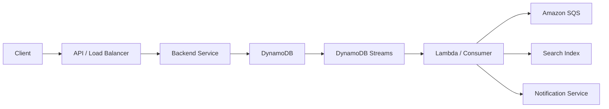

This architecture separates the transactional operation from secondary processing.

For example, an order API can persist the order synchronously:

```text
POST /orders
      |
      v
DynamoDB
      |
      v
Response to Client
```

Then process secondary actions asynchronously:

```text
DynamoDB
    |
    v
DynamoDB Streams
    |
    v
Consumer
    |
    +----> Send notification
    +----> Update search index
    +----> Publish integration event
    +----> Invalidate cache
```

The result is a backend architecture where the critical request path remains focused on the operation that must succeed immediately, while secondary work can be processed independently.

---

## What Is an Event-Driven Architecture?

An event-driven architecture organizes system communication around events.

An event represents a fact about something that has already happened.

Examples:

```text
OrderCreated
OrderPaid
OrderCancelled
UserRegistered
PaymentCompleted
InventoryUpdated
```

A typical synchronous architecture might look like:

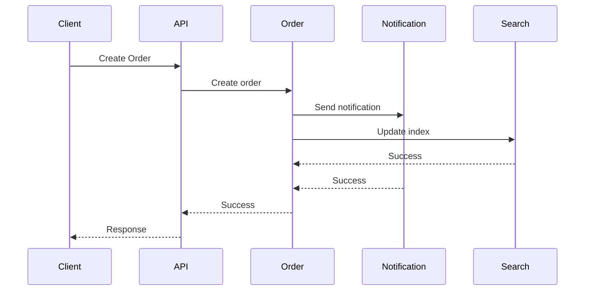

The request becomes coupled to every downstream operation.

An event-driven architecture can instead use:

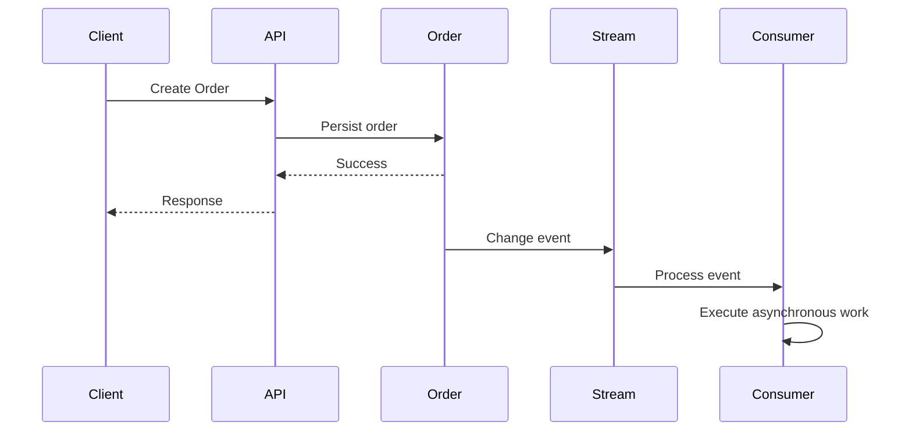

The initial API request does not need to wait for every downstream consumer.

---

## Why Use Event-Driven Architecture with DynamoDB?

DynamoDB is optimized for highly scalable key-based data access, while DynamoDB Streams provide a mechanism for reacting to item-level changes.

This combination is useful when the system needs to:

- Trigger asynchronous processing after database changes.
- Decouple secondary workloads from API requests.
- Build event-driven integrations.
- Maintain derived data.
- Invalidate caches.
- Update search indexes.
- Trigger notifications.
- Build audit pipelines.
- Process changes asynchronously.
- Connect DynamoDB with serverless workloads.

The architecture is particularly useful for microservices because the service responsible for the source of truth does not need to synchronously call every downstream service.

---

## DynamoDB Streams

DynamoDB Streams captures information about item-level modifications in a DynamoDB table.

A stream record can represent changes caused by operations such as:

- `PutItem`
- `UpdateItem`
- `DeleteItem`
- `BatchWriteItem`
- Transactional writes

The stream can be configured to capture different views of the affected item.

Common stream view types include:

| Stream view | Captured information |
|---|---|
| `KEYS_ONLY` | Only modified item's key attributes |
| `NEW_IMAGE` | Item after modification |
| `OLD_IMAGE` | Item before modification |
| `NEW_AND_OLD_IMAGES` | Item before and after modification |

Choose the smallest stream view that satisfies the consumer's requirements.

For example, a cache invalidation consumer may only need the item's key:

```text
KEYS_ONLY
```

A search-indexing consumer may require the complete updated item:

```text
NEW_IMAGE
```

---

## DynamoDB Stream Architecture

The basic architecture is:

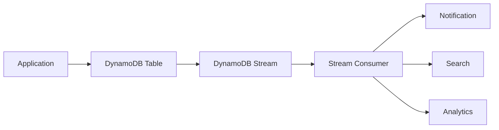

DynamoDB remains the source of truth.

The stream represents changes to that source of truth.

This distinction matters:

```text
DynamoDB
    |
    +----> Authoritative application state

DynamoDB Streams
    |
    +----> Change notification / event source
```

Do not design downstream consumers as independent sources of truth unless the architecture explicitly requires a derived data store.

---

## Request and Event Lifecycle

Consider an order creation API.

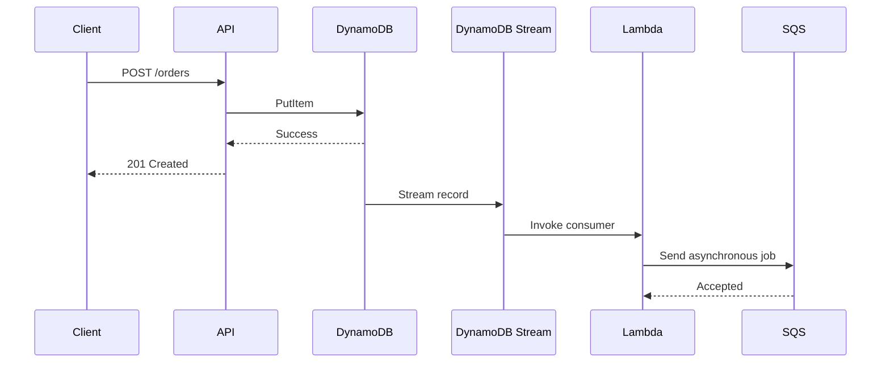

The important separation is:

```text
Critical request path
---------------------
Client
  ↓
API
  ↓
DynamoDB
  ↓
Response


Asynchronous path
-----------------
DynamoDB
  ↓
Stream
  ↓
Consumer
  ↓
Downstream systems
```

This can significantly reduce API latency when downstream operations are not required before responding to the client.

---

## DynamoDB as the Source of Truth

A common architecture is:

```text
DynamoDB
    |
    +----> Streams
             |
             +----> Search
             +----> Cache
             +----> Notifications
             +----> Analytics
```

The database stores authoritative state.

Consumers derive secondary state from changes.

For example:

```text
DynamoDB:
Order #123
status = SHIPPED
```

The stream can trigger:

```text
Search Index:
Order #123 -> searchable

Cache:
Order #123 -> invalidate

Notification:
Send shipping notification
```

This is often preferable to placing all of those responsibilities directly inside the API transaction.

---

## Event vs Database Change

A DynamoDB Stream record represents a database change.

That does not automatically mean it is a complete business event.

For example:

```text
DynamoDB change:

status:
PENDING -> PAID
```

A consumer may interpret this as:

```text
PaymentCompleted
```

However, the database mutation itself may not contain enough business context to represent a complete domain event.

This distinction is important in larger systems.

### Change event

```text
"DynamoDB item changed."
```

### Domain event

```text
"Order payment was successfully completed."
```

The correct approach depends on the architecture.

DynamoDB Streams are particularly useful when downstream systems need to react to persistence changes.

For cross-service business event contracts, an explicit event publishing mechanism may provide stronger control over event schema and ownership.

---

## Event Consumers

A consumer reads stream records and performs downstream work.

A common AWS architecture uses Lambda:

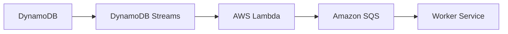

Lambda is useful when:

- Processing is event-driven.
- Workload is variable.
- Processing is relatively short-lived.
- Serverless operation is desirable.
- Operational overhead should remain low.

A dedicated consumer service can be preferable when:

- Processing is long-running.
- Custom concurrency control is required.
- The workload is continuously high.
- The team already operates containerized workers.
- More sophisticated consumer lifecycle management is required.

---

## Python Consumer Example

A Lambda handler can process DynamoDB Stream records:

```python
def lambda_handler(event, context):
    for record in event["Records"]:
        event_name = record["eventName"]

        if event_name == "INSERT":
            process_insert(record)

        elif event_name == "MODIFY":
            process_modify(record)

        elif event_name == "REMOVE":
            process_remove(record)
```

The consumer should not assume that processing a record is always successful.

Production processing should consider:

- Retries
- Partial failures
- Idempotency
- Poison records
- Logging
- Metrics
- Dead-letter handling where applicable
- Downstream service failures

---

## Idempotent Event Processing

Event consumers should generally be designed to tolerate repeated processing.

For example:

```text
DynamoDB Stream
      |
      v
Consumer
      |
      v
Send notification
```

If the consumer fails after sending the notification but before completing processing, the same event may be processed again.

Without idempotency:

```text
Event
  |
  +----> Notification #1
  |
  +----> Retry
          |
          +----> Notification #2
```

This can produce duplicate side effects.

A production consumer should use an idempotency mechanism appropriate to the operation.

For example:

```text
event_id = unique event identifier

processed_events
----------------
event_id
status
processed_at
```

The exact implementation can use DynamoDB, Redis, PostgreSQL, or another durable mechanism depending on the system.

---

## Conditional Writes for Idempotency

DynamoDB conditional writes can help implement idempotent processing.

Conceptually:

```python
import boto3
from botocore.exceptions import ClientError

dynamodb = boto3.resource("dynamodb")
table = dynamodb.Table("ProcessedEvents")


def claim_event(event_id: str) -> bool:
    try:
        table.put_item(
            Item={
                "event_id": event_id,
            },
            ConditionExpression="attribute_not_exists(event_id)",
        )
        return True

    except ClientError as exc:
        if exc.response["Error"]["Code"] == "ConditionalCheckFailedException":
            return False
        raise
```

The consumer can use this pattern to determine whether an event has already been claimed.

For high-throughput systems, the idempotency design itself must be capacity-planned and monitored.

---

## Event Ordering

Ordering is an important consideration in DynamoDB event processing.

Suppose an item changes:

```text
PENDING
   ↓
PAID
   ↓
SHIPPED
```

A downstream consumer may need to observe these changes in the correct order.

DynamoDB Streams provides ordering guarantees for modifications to the same item within the relevant stream/shard processing model, but consumers should not assume arbitrary global ordering across unrelated items.

Design consumers around the ordering guarantees actually required by the business operation.

For example, this is generally safer:

```text
Order #123
    |
    +---- PENDING
    +---- PAID
    +---- SHIPPED
```

than assuming:

```text
Order #123 event
Order #456 event
Order #123 event
```

has a meaningful global ordering relationship.

---

## Eventual Consistency

Event-driven DynamoDB architectures introduce eventual consistency by design.

The sequence can be:

```text
Write DynamoDB
      |
      v
API returns success
      |
      v
Stream processing
      |
      v
Search / Cache / Notification updated
```

There is therefore a period where:

```text
DynamoDB = updated
Search = old
Cache = old
```

This is not necessarily a problem.

It becomes a problem only when the business requirement expects those systems to be updated synchronously.

Before introducing asynchronous processing, classify each operation as:

- Must be synchronous
- Can be asynchronous
- Can tolerate eventual consistency
- Must be retried
- Must be idempotent

---

## Synchronous vs Event-Driven Processing

| Requirement | Synchronous | Event-driven |
|---|---:|---:|
| Immediate response required | Strong fit | Weak fit |
| Independent downstream processing | Poor fit | Strong fit |
| Loose coupling | Poor | Strong |
| Eventual consistency acceptable | Not required | Required |
| Long-running work | Poor | Strong |
| Failure isolation | Limited | Stronger |
| Operational simplicity | Often simpler initially | More complex |
| Debugging | Easier | More distributed |
| Retry handling | Usually simpler | Required |
| Duplicate processing | Less common | Must be handled |

A good architecture does not move every operation into an event-driven workflow.

Use asynchronous processing where it creates a concrete architectural advantage.

---

## DynamoDB Streams with SQS

A common production pattern is:

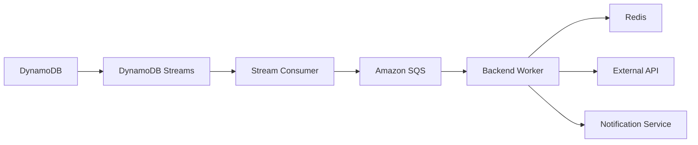

This introduces an additional buffering layer.

Advantages include:

- Backpressure
- Retry handling
- Consumer decoupling
- Workload smoothing
- Independent worker scaling

For example, a burst of DynamoDB changes can be converted into queued work rather than forcing the downstream service to process everything immediately.

---

## DynamoDB Streams with Lambda

Lambda provides a natural integration with DynamoDB Streams.

A typical flow is:

```text
DynamoDB
   |
   v
DynamoDB Streams
   |
   v
Lambda
   |
   +----> Process event
   +----> Call service
   +----> Publish message
```

Lambda should be kept focused.

Avoid turning a single stream consumer into a large orchestration layer:

```text
Lambda
  |
  +----> Payment
  +----> Email
  +----> Search
  +----> Analytics
  +----> Billing
  +----> External API
```

This can create:

- Long execution times
- Complex retry behavior
- Difficult failure isolation
- Coupled deployments
- Difficult observability

A better design can publish independent events or queue separate workloads.

---

## Fan-Out Architecture

When multiple independent consumers need the same change, consider a fan-out architecture.

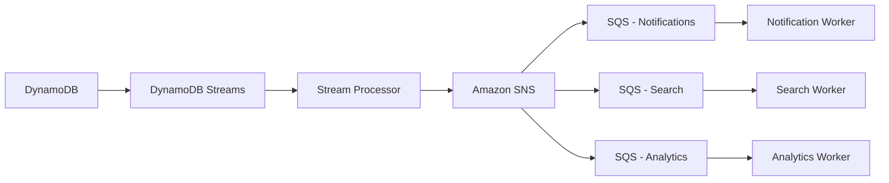

This provides stronger isolation than having one consumer synchronously perform every downstream operation.

Each consumer can then:

- Scale independently
- Retry independently
- Deploy independently
- Fail independently
- Maintain its own processing semantics

---

## DynamoDB and Kafka

DynamoDB Streams can also participate in architectures where Kafka is the broader event platform.

A conceptual architecture is:

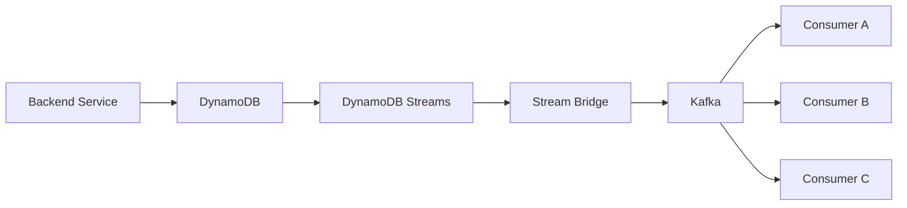

This can be useful when the organization already standardizes on Kafka for:

- Cross-service event distribution
- Long-lived event streams
- Multiple independent consumers
- Replayable event processing
- Stream processing
- Data pipelines

Do not introduce Kafka solely because the application uses DynamoDB.

If Lambda + SQS provides the required decoupling and operational behavior, adding Kafka may unnecessarily increase system complexity.

---

## DynamoDB and Celery

For Python applications using Celery, DynamoDB Streams can be used to trigger asynchronous Celery work indirectly.

For example:

```text
DynamoDB
    |
    v
DynamoDB Streams
    |
    v
Lambda / Consumer
    |
    v
Celery Broker
    |
    v
Celery Worker
```

The consumer should publish a compact task rather than attempting to perform the entire workload itself.

For example:

```python
process_order.delay(order_id)
```

The worker can then retrieve the latest authoritative state from DynamoDB.

This is often safer than putting the entire item state into a long-lived asynchronous task payload.

---

## Event Payload Design

Event payloads should contain enough information for the consumer to process the event without unnecessarily coupling consumers to internal database representation.

A simple event might look like:

```json
{
  "event_type": "OrderCreated",
  "event_id": "evt-123",
  "aggregate_id": "order-456",
  "occurred_at": "2026-08-26T12:00:00Z",
  "version": 1
}
```

Useful fields include:

| Field | Purpose |
|---|---|
| `event_id` | Idempotency and tracing |
| `event_type` | Consumer routing |
| `aggregate_id` | Identifies the business entity |
| `occurred_at` | Event timestamp |
| `version` | Event/schema evolution |
| `payload` | Business data required by consumer |

When DynamoDB Streams is the event source, the stream record contains DynamoDB-specific metadata and item images. A separate domain-event envelope may be appropriate when publishing events to external services.

---

## Event Schema Evolution

Events become contracts when multiple consumers depend on them.

Avoid breaking changes such as:

```json
{
  "customer_id": "123"
}
```

becoming:

```json
{
  "customer": {
    "id": "123"
  }
}
```

without a compatibility strategy.

Use:

- Explicit event versions
- Backward-compatible changes
- Consumer-driven testing
- Schema validation where appropriate
- Controlled rollout
- Deprecation periods

For example:

```json
{
  "event_type": "OrderCreated",
  "version": 2,
  "order_id": "order-123"
}
```

The version should represent the event contract rather than the DynamoDB table version.

---

## Change Data Capture vs Domain Events

DynamoDB Streams is effectively a change-data-capture mechanism for DynamoDB item changes.

It is excellent for use cases such as:

- Replicating changes
- Updating derived stores
- Cache invalidation
- Search indexing
- Audit processing
- Triggering asynchronous workflows

However, CDC and domain events solve different problems.

| CDC | Domain event |
|---|---|
| Describes data change | Describes business fact |
| Coupled to persistence | Independent business contract |
| Useful for derived data | Useful for service integration |
| Often database-specific | Usually service-owned |
| Reflects CRUD changes | Reflects domain semantics |

For example:

```text
CDC:
DynamoDB item modified

Domain event:
OrderPaymentCompleted
```

Do not assume that every DynamoDB Stream record should become a public domain event.

---

## Transactional Boundaries

A critical design question is:

> What must succeed atomically?

Suppose an order creation operation requires:

```text
Create order
Create payment record
```

If both must be committed atomically, use DynamoDB transactions where appropriate rather than relying on an asynchronous event to provide atomicity.

Then secondary work can happen asynchronously:

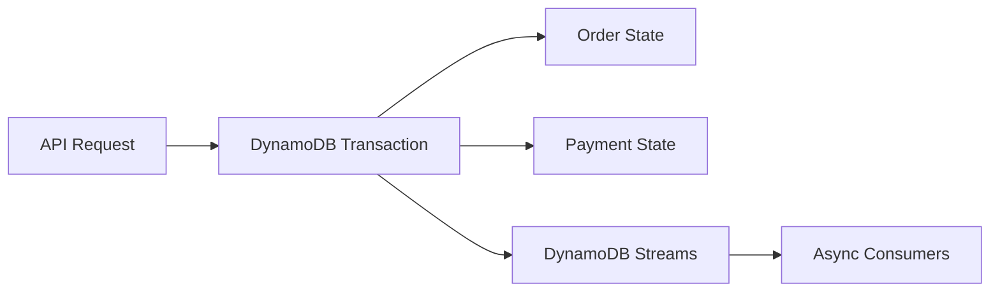

This separates:

```text
Transactional state
```

from:

```text
Asynchronous side effects
```

Do not use event-driven processing as a replacement for transactional guarantees.

---

## Failure Handling

Event-driven systems fail differently from synchronous systems.

Consider:

```text
DynamoDB
    |
    v
Stream
    |
    v
Consumer
    |
    v
External API
```

The external API may fail after the DynamoDB write has already succeeded.

The consumer must therefore retry without creating duplicate side effects.

A production failure strategy should include:

- Exponential backoff
- Jitter where appropriate
- Bounded retries
- Idempotency
- Dead-letter handling where supported
- Structured logging
- Metrics
- Alerting
- Manual replay procedures

---

## Poison Events

A poison event is an event that repeatedly fails processing because the underlying data or processing logic is invalid.

Example:

```text
Event
  |
  v
Consumer
  |
  v
Validation Error
  |
  v
Retry
  |
  v
Validation Error
  |
  v
Retry
```

Without a failure strategy, one problematic event can consume processing capacity indefinitely.

Handle poison events using appropriate mechanisms such as:

- Dead-letter queues
- Failure destinations
- Alerting
- Quarantine storage
- Manual remediation
- Controlled replay

The exact mechanism depends on the consumer architecture.

---

## Observability

Event-driven systems require stronger observability than simple request-response applications.

Track:

### Application metrics

- API latency
- API error rate
- DynamoDB errors
- DynamoDB throttling

### Stream metrics

- Records processed
- Processing latency
- Iterator age
- Consumer errors
- Retry counts

### Queue metrics

- Queue depth
- Message age
- Processing rate
- Consumer errors
- Dead-letter messages

### Business metrics

- Orders processed
- Notifications sent
- Failed payments
- Search indexing failures

A useful trace relationship is:

```text
HTTP Request
    |
    +---- request_id
          |
          v
DynamoDB Write
          |
          v
Stream Event
          |
          +---- event_id
                |
                v
Consumer
                |
                v
Downstream Service
```

Use correlation IDs and event IDs so operators can trace work across asynchronous boundaries.

---

## Security Considerations

DynamoDB event-driven architectures introduce additional IAM boundaries.

The system may contain:

```text
Application Role
      |
      +----> DynamoDB

Stream Consumer Role
      |
      +----> DynamoDB Streams
      +----> SQS
      +----> Other services

Worker Role
      |
      +----> DynamoDB
      +----> External dependencies
```

Apply least privilege independently to each component.

Avoid giving a stream-processing Lambda broad permissions such as:

```text
dynamodb:*
sqs:*
sns:*
```

unless there is a concrete requirement.

Prefer permissions scoped to:

- Specific DynamoDB tables
- Specific streams
- Specific queues
- Specific topics
- Specific downstream APIs

Sensitive data should also be carefully considered before being propagated into event payloads.

---

## Scalability

Event-driven architecture can improve scalability by separating workloads.

For example:

```text
API traffic
    |
    v
DynamoDB
    |
    v
Stream
    |
    v
Queue
    |
    +----> Worker pool
```

The API can continue accepting writes while workers process secondary tasks at their own rate.

However, asynchronous processing does not eliminate capacity constraints.

A downstream consumer can still become the bottleneck:

```text
DynamoDB
    |
    v
Stream
    |
    v
Consumer
    |
    v
Slow external API
```

The architecture should therefore support backpressure.

SQS is often useful as a buffer between a change consumer and a slow downstream system.

---

## Backpressure

Backpressure occurs when producers generate work faster than consumers can process it.

For example:

```text
DynamoDB changes:
10,000 events/sec

Consumer capacity:
2,000 events/sec
```

The system must absorb the difference.

A queue can provide buffering:

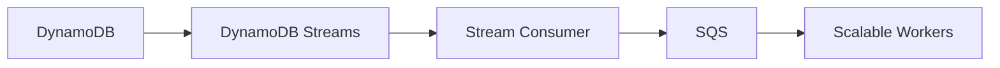

The important operational metric becomes:

```text
Queue depth
+
Oldest message age
```

A growing queue indicates that consumers cannot keep up.

---

## Cost Considerations

Event-driven architecture adds infrastructure and processing costs.

Potential cost sources include:

- DynamoDB Streams
- Lambda invocations
- SQS requests
- SNS
- Kafka
- Worker compute
- CloudWatch Logs
- Monitoring
- Data transfer

The architecture can still reduce overall cost by preventing synchronous application servers from performing expensive secondary work.

Evaluate:

```text
Infrastructure cost
+
Operational cost
+
Failure recovery cost
+
Engineering complexity
```

rather than optimizing one AWS service's bill in isolation.

---

## Common Architecture Mistakes

### Treating Streams as a Synchronous Notification Mechanism

A DynamoDB write should not assume that all stream consumers have already processed the event.

Stream processing is asynchronous.

### Ignoring Duplicate Processing

Consumers should be designed for idempotency.

A successful side effect followed by a consumer failure can result in repeated processing.

### Putting Too Much Logic in Lambda

Large stream-processing functions become difficult to test, observe, and operate.

Keep consumers focused and delegate long-running work to queues or workers when appropriate.

### Using Events for Atomic Operations

Events do not replace DynamoDB transactions.

Use transactions when multiple DynamoDB operations must succeed atomically.

### Treating CDC as a Domain Event

A database change does not automatically represent a business event.

Keep persistence-driven CDC and business-level event contracts conceptually separate.

### Ignoring Eventual Consistency

The DynamoDB write can succeed before downstream systems are updated.

Design APIs and user-facing behavior accordingly.

### No Poison-Event Strategy

A single invalid event can repeatedly fail and consume processing resources.

Implement appropriate failure isolation and replay mechanisms.

### No Event Schema Governance

Once multiple services consume an event, changing its structure without compatibility planning can break downstream systems.

Version event contracts deliberately.

---

## Production Architecture Example

A production backend might use DynamoDB as the source of truth and SQS as the asynchronous work buffer.

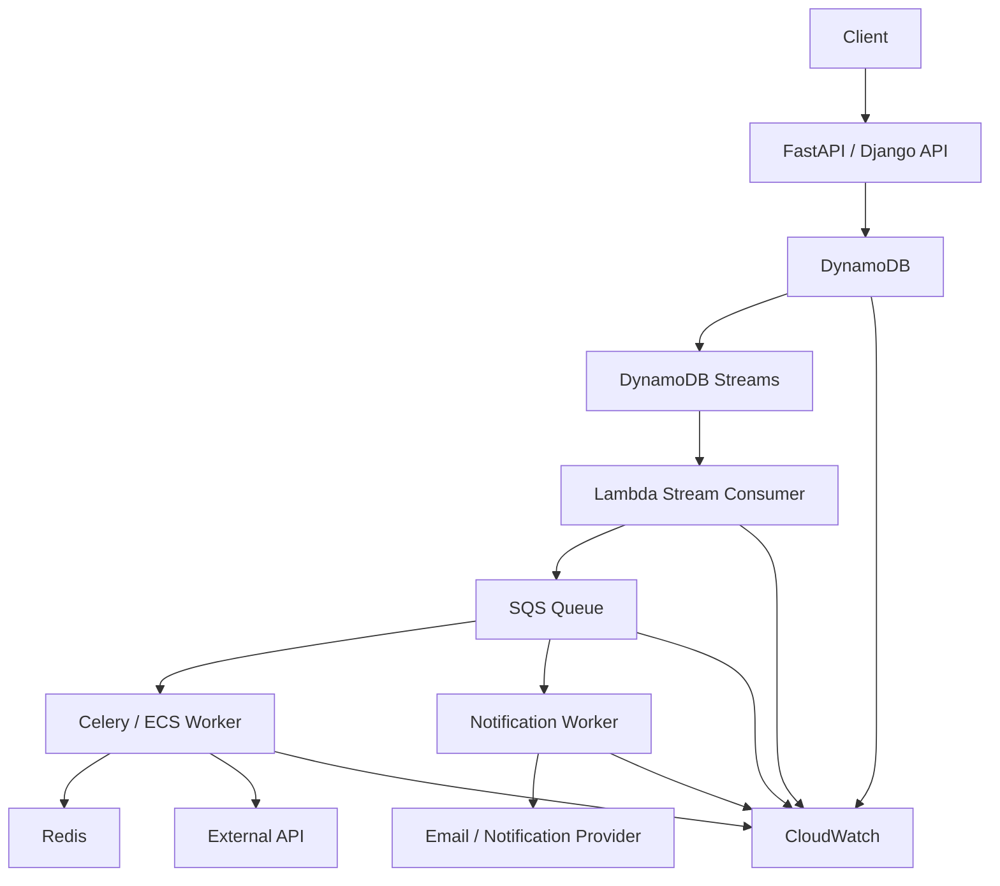

The responsibilities are separated:

| Component | Responsibility |
|---|---|
| API | Validate request and persist authoritative state |
| DynamoDB | Store application state |
| DynamoDB Streams | Capture item changes |
| Lambda | Convert changes into asynchronous work |
| SQS | Buffer and isolate downstream processing |
| Worker | Perform long-running or retryable work |
| Redis | Optional caching / coordination |
| CloudWatch | Monitoring and operational visibility |

This architecture is particularly useful when secondary operations are expensive or unreliable but should not prevent the primary database transaction from succeeding.

---

## When Not to Use Event-Driven Architecture

Event-driven architecture is not always the correct choice.

Avoid unnecessary asynchronous processing when:

- The caller requires an immediate result.
- The operation must be strongly consistent end-to-end.
- The downstream operation is cheap and tightly coupled.
- Eventual consistency would confuse users.
- The operational complexity outweighs the benefit.

For example:

```text
GET /customer/{id}
```

should generally not require:

```text
API
  ↓
DynamoDB
  ↓
Stream
  ↓
Queue
  ↓
Worker
  ↓
Response
```

That introduces unnecessary latency and complexity.

Use asynchronous architecture where it solves a real scalability, reliability, or decoupling problem.

---

## Interview-Level Questions

### Why are DynamoDB Streams useful?

They provide a change feed for DynamoDB item modifications, allowing downstream consumers to react asynchronously to database changes.

### Does a DynamoDB Stream make DynamoDB event-driven?

It provides an event source that can be used to build an event-driven architecture. The complete architecture still requires consumers and appropriate downstream processing.

### Why is idempotency important?

A consumer can process the same event more than once, especially when failures occur after a side effect but before successful completion.

### Should every DynamoDB Stream event become a domain event?

No. A stream record is a persistence change. A domain event represents a business fact. They can overlap, but they should not be treated as identical concepts.

### Why use SQS after a DynamoDB Stream?

SQS provides buffering, independent retry behavior, workload smoothing, and consumer decoupling.

### Can DynamoDB Streams replace Kafka?

Not generally. Streams are primarily a DynamoDB change-data-capture mechanism. Kafka provides a broader distributed event-streaming platform with different retention, replay, consumer, and ecosystem characteristics.

### Can DynamoDB Streams guarantee that all downstream systems are updated before an API response?

No. Stream processing is asynchronous. If downstream processing is required before responding, it belongs in the synchronous transaction path or another explicitly coordinated workflow.

---

## Production Checklist

Before deploying a DynamoDB event-driven architecture, verify:

- DynamoDB remains the authoritative source of state where appropriate.
- Stream configuration captures the required item information.
- Consumers are idempotent.
- Event processing failures are observable.
- Retry behavior is bounded.
- Poison events have an isolation strategy.
- Long-running workloads use an appropriate queue or worker architecture.
- Backpressure is measurable.
- Event schemas are versioned where necessary.
- Correlation IDs and event IDs are available.
- IAM permissions follow least privilege.
- Sensitive data is not unnecessarily propagated.
- Monitoring covers streams, queues, consumers, and downstream dependencies.
- Eventual consistency is explicitly accepted by affected workflows.
- DynamoDB transactions are used where atomicity is required.
- CDC and domain-event responsibilities are clearly separated.
- Replay and recovery procedures are documented.
- The architecture has been tested under downstream failure and traffic spikes.

---

## Key Takeaways

- DynamoDB Streams provide a change feed that allows DynamoDB writes to drive asynchronous, event-oriented workflows.
- Event-driven architecture separates the critical persistence path from secondary processing, improving decoupling, scalability, and failure isolation.
- Production consumers must be idempotent and designed for retries, duplicate processing, poison events, backpressure, and eventual consistency.
- DynamoDB Streams are a persistence change-data-capture mechanism; they should not automatically be treated as a replacement for domain events or Kafka.
- A robust DynamoDB event-driven architecture combines DynamoDB, Streams, appropriate consumers, queues or workers, observability, security, and explicit recovery strategies.