# 05- Production DynamoDB Architecture

## Overview

A production DynamoDB architecture is more than a DynamoDB table connected to an API. It must account for access patterns, data modeling, partition distribution, capacity, consistency, high availability, security, observability, failure handling, backups, cost, and operational workflows.

A typical production backend architecture can be structured as:

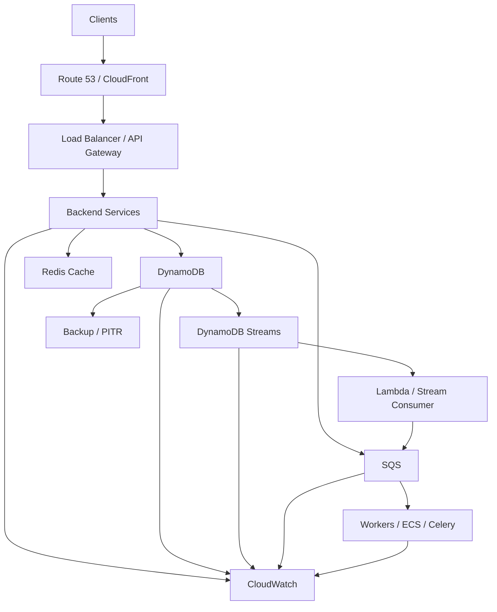

The objective is not to add every AWS service. The objective is to create a system where each component has a clear responsibility and the overall architecture remains scalable, observable, secure, and recoverable.

---

## Production Architecture Principles

A production DynamoDB design should begin with the application workload rather than with infrastructure configuration.

The primary questions are:

- What entities does the application store?
- How are those entities accessed?
- Which operations are read-heavy?
- Which operations are write-heavy?
- What is the expected request rate?
- Which access patterns require predictable latency?
- What consistency is required?
- What happens when a dependency fails?
- What is the required RPO and RTO?
- Does the workload require multi-Region availability?

A useful architecture model is:

```text
Business Requirements
        |
        v
Access Patterns
        |
        v
DynamoDB Data Model
        |
        v
Capacity + Performance
        |
        v
Application Architecture
        |
        v
Reliability + Security + Operations
```

DynamoDB design decisions should flow from workload requirements.

---

## Production Reference Architecture

A backend service can use DynamoDB as its primary operational datastore while using other systems for specialized responsibilities.

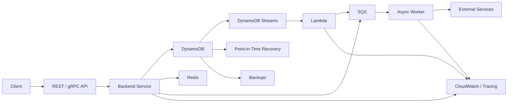

Each component has a specific purpose:

| Component | Primary responsibility |
|---|---|
| API | Request handling and validation |
| Backend service | Business logic |
| DynamoDB | Primary operational state |
| Redis | Optional low-latency cache |
| DynamoDB Streams | Change capture |
| Lambda | Event processing |
| SQS | Asynchronous buffering |
| Workers | Long-running or retryable work |
| PITR / Backups | Data recovery |
| CloudWatch | Monitoring and alerting |

Do not introduce Redis, Kafka, SQS, or another service unless the workload actually benefits from it.

---

## Application Layer

The application layer should remain stateless whenever possible.

A typical architecture is:

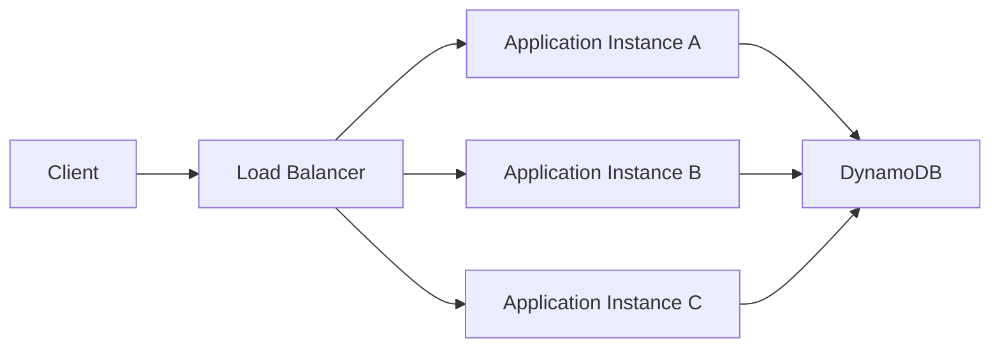

This allows the application tier to scale horizontally.

The application should not depend on local instance state for correctness.

For example, avoid storing critical session or workflow state only in:

```text
Application Instance A
```

while allowing requests to move freely between instances.

Use appropriate shared services for state that must survive instance replacement.

---

## Python Application Integration

A Python backend can create a DynamoDB client using the AWS SDK.

```python
import os

import boto3

dynamodb = boto3.resource(
    "dynamodb",
    region_name=os.environ["AWS_REGION"],
)

orders_table = dynamodb.Table(
    os.environ["ORDERS_TABLE_NAME"]
)
```

The application should generally obtain AWS credentials through the AWS runtime environment rather than embedding credentials in source code.

For example:

```text
ECS Task Role
EKS Pod Identity / IAM Role
EC2 Instance Role
Lambda Execution Role
```

Avoid:

```python
boto3.resource(
    "dynamodb",
    aws_access_key_id="...",
    aws_secret_access_key="...",
)
```

Production credentials should be managed through AWS IAM and the runtime credential provider chain.

---

## Data Modeling

DynamoDB data modeling should be driven by access patterns.

A relational design often begins with:

```text
Entities
    ↓
Relationships
    ↓
Normalized tables
```

DynamoDB design generally starts with:

```text
Access patterns
    ↓
Required queries
    ↓
Primary key design
    ↓
Indexes
    ↓
Item structure
```

For example:

```text
Access pattern:

Get all orders for a customer
Sort by creation time
```

A suitable key design might be:

```text
PK = CUSTOMER#<customer_id>
SK = ORDER#<created_at>#<order_id>
```

This allows the query to retrieve orders belonging to a customer without scanning the entire table.

---

## Single-Table Design

A production DynamoDB table can store multiple logical entity types.

For example:

```text
PK                  SK
------------------------------------------
CUSTOMER#123        PROFILE
CUSTOMER#123        ORDER#2026-001
CUSTOMER#123        ORDER#2026-002
ORDER#2026-001      DETAILS
ORDER#2026-001      PAYMENT
```

This can support multiple access patterns through carefully designed keys and indexes.

Single-table design can reduce the number of database requests required for related data.

However, it increases modeling complexity.

Use it when the access patterns justify it rather than applying it as a rule to every application.

---

## Partition Key Distribution

A production table must distribute traffic across partitions effectively.

A partition key with highly concentrated traffic can create a hot partition.

For example:

```text
PK = STATUS#PENDING
```

If millions of writes target the same partition key, traffic becomes concentrated.

A better design may distribute the workload:

```text
PK = STATUS#PENDING#00
PK = STATUS#PENDING#01
PK = STATUS#PENDING#02
...
```

The exact sharding strategy depends on the workload and access patterns.

The key principle is:

> High request volume should be distributed across partition keys rather than concentrated on a small number of keys.

---

## Hot Partition Prevention

Hot partitions can occur because of:

- Highly concentrated partition keys
- Sequential write patterns
- Popular entities
- Uneven tenant distribution
- Poorly designed indexes
- Traffic spikes

Production mitigation strategies include:

- Better partition-key cardinality
- Write sharding
- Randomized or distributed suffixes where appropriate
- Tenant-aware partitioning
- Workload distribution
- Monitoring throttling and latency

Do not add randomization blindly.

If the application needs to retrieve all items for a logical entity, excessive sharding can make reads more complicated.

---

## Capacity Mode

DynamoDB supports two primary capacity modes:

- On-demand
- Provisioned

| Characteristic | On-demand | Provisioned |
|---|---|---|
| Capacity management | AWS-managed | Application-managed |
| Traffic predictability | Good for variable workloads | Good for predictable workloads |
| Operational overhead | Lower | Higher |
| Cost model | Pay per request | Pay for provisioned capacity |
| Scaling configuration | Minimal | Capacity policies required |
| Best fit | Variable or unpredictable workloads | Stable, predictable workloads |

On-demand capacity is often a strong starting point for workloads with unpredictable traffic.

Provisioned capacity can be more economical for stable, predictable workloads when capacity can be planned effectively.

Capacity mode should be selected using actual workload characteristics and cost analysis.

---

## Auto Scaling

Provisioned DynamoDB tables can use Application Auto Scaling to adjust capacity.

A typical architecture is:

```text
Application
    |
    v
DynamoDB
    |
    v
Consumed Capacity
    |
    v
Auto Scaling
    |
    v
Provisioned Capacity
```

Auto scaling should not be treated as an instantaneous response mechanism for every traffic spike.

Applications should still be designed for:

- Burst traffic
- Sudden load changes
- Retry behavior
- Capacity limits
- Throttling

For unpredictable workloads, on-demand mode may be simpler.

---

## Read Consistency

DynamoDB provides multiple read consistency choices.

| Read type | Consistency | Cost / latency characteristics |
|---|---|---|
| Eventually consistent | May return recently stale data | Lower read cost |
| Strongly consistent | Reflects completed writes | Higher read cost |
| Transactional | Transaction semantics | Used for transactional operations |

Eventually consistent reads are often sufficient for:

- Product catalogs
- Activity feeds
- Search results
- Analytics views
- Non-critical dashboards

Strongly consistent reads may be appropriate when the application cannot tolerate a stale value within a Region.

Do not use strong consistency everywhere without a business requirement.

---

## Write Design

Production writes should be designed around:

- Idempotency
- Conditional expressions
- Transactions where necessary
- Correct retry behavior
- Conflict handling

For example, an order creation API should avoid creating duplicate orders when a client retries the same request.

A common pattern is to use an idempotency key:

```text
POST /orders

Idempotency-Key: 8b4c...
```

The application can associate that key with the resulting operation.

The important property is:

```text
Same logical request
        ↓
Repeated execution
        ↓
Same logical outcome
```

This is particularly important when network failures cause clients or SDKs to retry requests.

---

## Conditional Writes

Conditional writes are useful for enforcing application-level invariants.

For example:

```python
table.update_item(
    Key={
        "PK": "ORDER#123",
        "SK": "DETAILS",
    },
    UpdateExpression="SET #status = :paid",
    ConditionExpression="#status = :pending",
    ExpressionAttributeNames={
        "#status": "status",
    },
    ExpressionAttributeValues={
        ":pending": "PENDING",
        ":paid": "PAID",
    },
)
```

This prevents an update from succeeding when the item is no longer in the expected state.

Conditional writes are often preferable to:

```text
Read
  ↓
Check
  ↓
Write
```

when the check and write must be atomic.

---

## Transactions

DynamoDB transactions should be used when multiple operations must satisfy an atomic business rule.

For example:

```text
Create Order
+
Create Payment Record
+
Update Inventory
```

can require transactional coordination.

Conceptually:

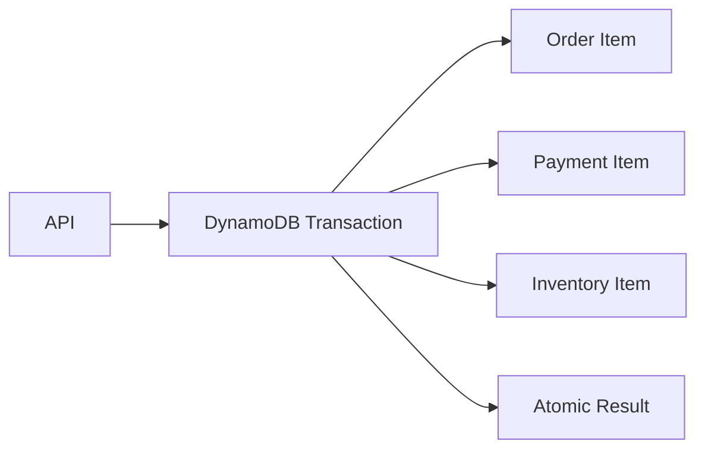

Transactions provide stronger guarantees but can increase latency, complexity, and cost.

Do not use transactions for every write.

Use them when atomicity is actually required.

---

## Caching with Redis

Redis can be useful when a DynamoDB-backed application has frequently requested, relatively stable data.

For example:

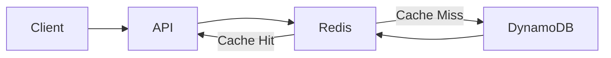

A cache-aside flow is:

```text
Request
   |
   v
Redis
   |
   +---- Hit ----> Return
   |
   +---- Miss
          |
          v
      DynamoDB
          |
          v
       Redis
          |
          v
       Return
```

Caching should not compromise correctness.

The source of truth remains DynamoDB.

Common cache problems include:

- Stale data
- Cache stampedes
- Incorrect invalidation
- Unbounded memory usage
- Redis failure affecting request latency

Use appropriate TTLs and failure handling.

---

## Event-Driven Processing

DynamoDB Streams can trigger asynchronous processing.


Common use cases include:

- Search indexing
- Notifications
- Cache invalidation
- Audit processing
- Analytics
- External integrations

The primary API request should not wait for secondary work unless the business operation explicitly requires it.

---

## Idempotent Consumers

DynamoDB Streams consumers must tolerate repeated processing.

Consider:

```text
Stream Event
    |
    v
Consumer
    |
    v
External API call
    |
    v
Consumer crashes
```

The event may be processed again.

Use an idempotency mechanism such as:

```text
event_id
    |
    v
Processed Event Store
```

The downstream operation should be safe to repeat whenever possible.

This is especially important for:

- Payments
- Notifications
- External API calls
- Inventory operations
- Workflow triggers

---

## Queue-Based Workloads

SQS can buffer work generated from DynamoDB changes.

```text
DynamoDB
    |
    v
Streams
    |
    v
Consumer
    |
    v
SQS
    |
    v
Workers
```

This architecture provides:

- Backpressure
- Retry isolation
- Workload smoothing
- Independent worker scaling
- Better failure isolation

For example, if an external API slows down, SQS can absorb pending work while workers process it at a controlled rate.

Monitor:

- Queue depth
- Oldest message age
- Processing rate
- Failed messages
- Dead-letter queue size

---

## High Availability

DynamoDB is a Regional managed service designed for high availability.

A production application should still distribute its application layer across multiple Availability Zones.

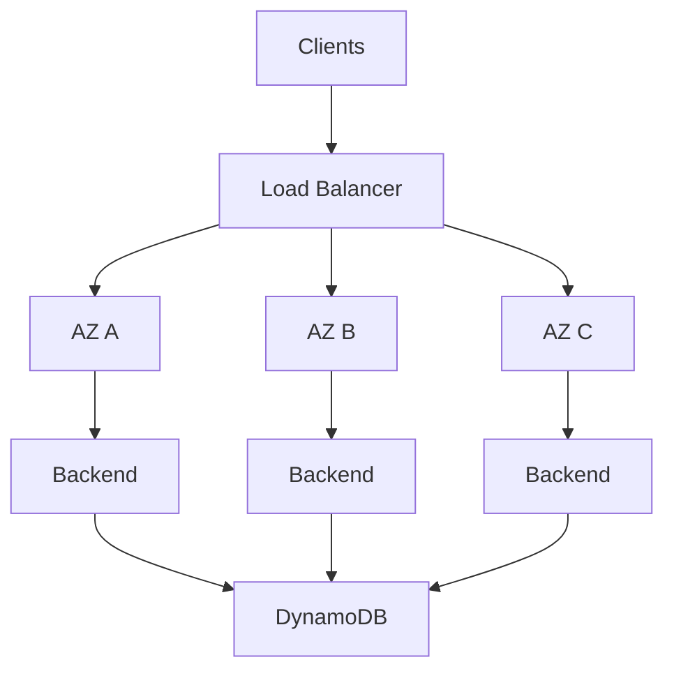

The application tier should not introduce a single point of failure even though DynamoDB is highly available.

---

## Multi-Region Architecture

When Regional failure resilience is required, use DynamoDB Global Tables.

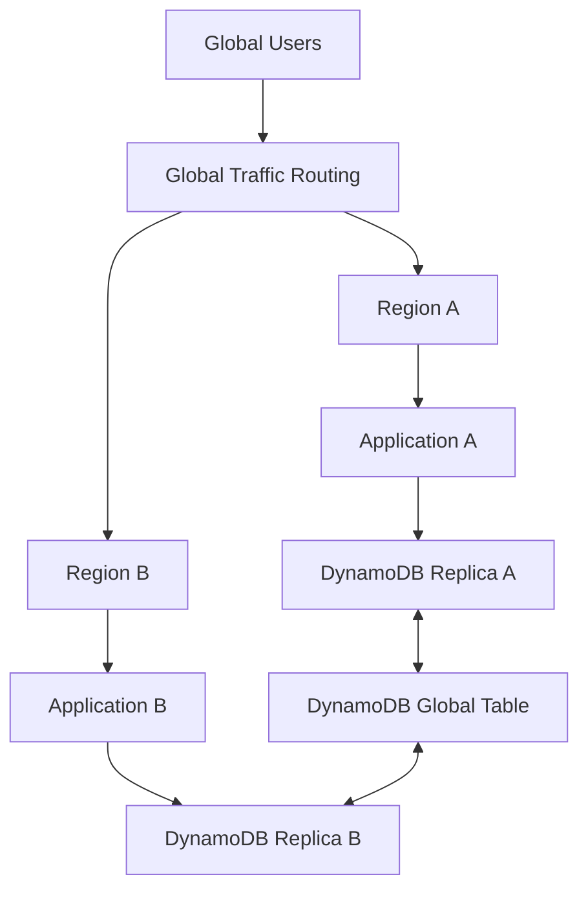

The application in each Region should normally access its local DynamoDB replica.

Multi-Region architecture introduces additional decisions around:

- MREC vs MRSC
- Regional traffic routing
- Failover capacity
- Concurrent writes
- Conflict resolution
- Data ownership
- Replication behavior
- Cost

Do not add Global Tables unless the availability or latency requirements justify the complexity.

---

## Disaster Recovery

Production DynamoDB systems should distinguish between:

```text
High availability
    |
    +----> Continue serving during infrastructure failures

Disaster recovery
    |
    +----> Recover from severe failures or data corruption
```

Use:

- Point-in-Time Recovery
- On-demand backups
- Global Tables where Regional continuity is required
- Documented restoration procedures

Global Tables are not a substitute for backups.

If an application accidentally deletes or corrupts data and that change is replicated, every replica may contain the incorrect state.

Backups and PITR provide a recovery path for these scenarios.

---

## Recovery Objectives

Define:

### RPO

Recovery Point Objective answers:

> How much data can the business afford to lose?

### RTO

Recovery Time Objective answers:

> How quickly must the service be restored?

Example:

```text
RPO = 5 minutes
RTO = 30 minutes
```

The architecture should be evaluated against those requirements.

A system requiring near-zero Regional data loss and rapid Regional recovery may justify Global Tables and multi-Region application infrastructure.

A lower-criticality workload may only require PITR and a documented restoration process.

---

## Backup Strategy

A production backup strategy should define:

- Backup retention
- PITR requirements
- On-demand backup requirements
- Restore testing
- Recovery ownership
- Data validation

A backup that has never been restored is not a proven recovery strategy.

Test:

```text
Backup
  ↓
Restore
  ↓
Validate schema
  ↓
Validate indexes
  ↓
Validate application access
  ↓
Measure recovery time
```

Restore testing should be performed in an isolated environment where possible.

---

## Security Architecture

A production DynamoDB architecture should use IAM roles and least-privilege permissions.

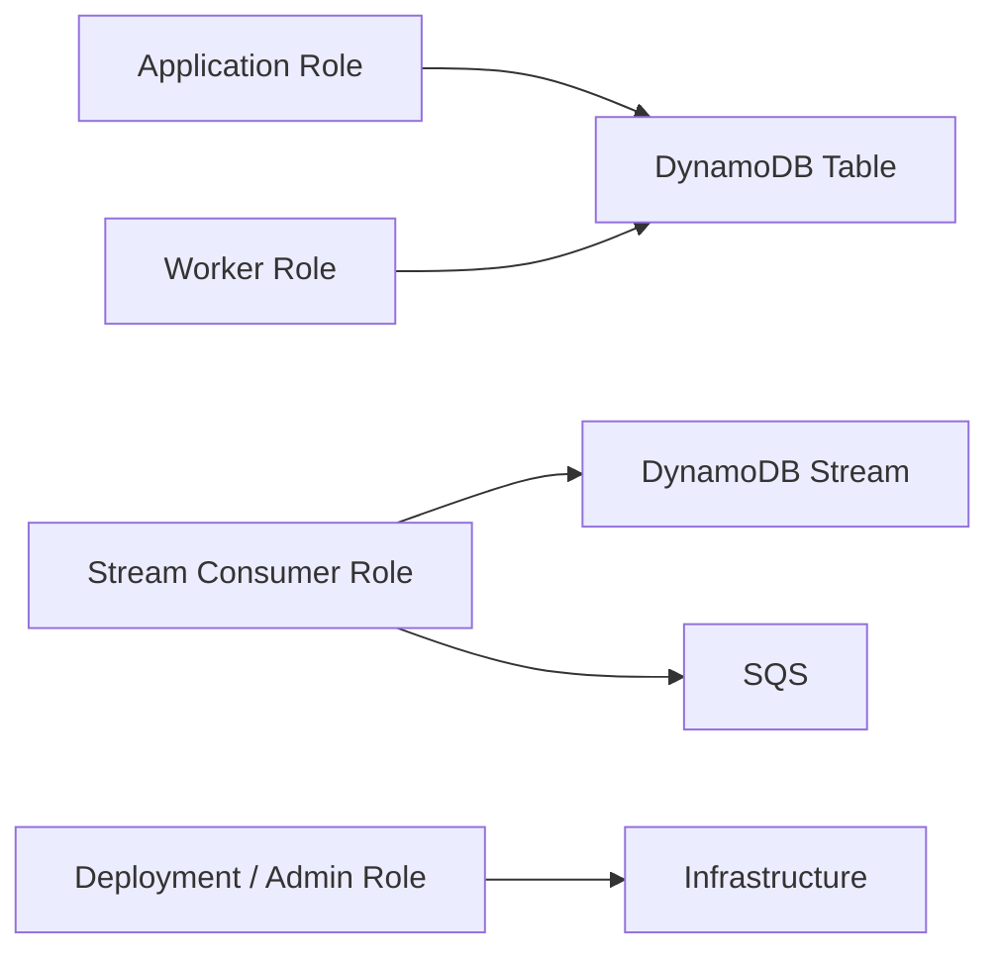

Avoid granting application roles administrative permissions.

For example, a read-only service should not require:

```text
dynamodb:DeleteTable
dynamodb:UpdateTable
dynamodb:CreateTable
```

Use permissions appropriate to the service's actual access patterns.

---

## Encryption

DynamoDB provides encryption at rest.

Production applications should still define:

- Encryption requirements
- AWS-owned vs customer-managed KMS keys
- Key policies
- Key rotation requirements
- Access auditing

If customer-managed KMS keys are used, key availability becomes part of the operational dependency model.

A restrictive key policy can cause an otherwise healthy DynamoDB application to fail.

---

## Network Architecture

DynamoDB is an AWS-managed service and can be accessed through AWS networking constructs such as VPC endpoints.

A private application architecture can use a DynamoDB VPC endpoint:

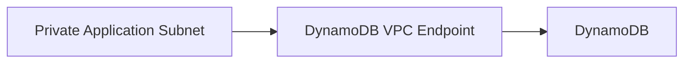

This can avoid routing DynamoDB traffic through public internet paths from private application subnets.

When using VPC endpoints, verify:

- Endpoint policy
- Route configuration
- IAM permissions
- Security controls
- DNS configuration

Network restrictions should not accidentally block required DynamoDB operations.

---

## Observability

Production DynamoDB monitoring should cover both the database and the application.

Important metrics include:

### DynamoDB

- Read/write latency
- Consumed capacity
- Throttled requests
- System errors
- User errors
- Successful request counts

### Application

- HTTP 4xx
- HTTP 5xx
- Request latency
- Timeout rate
- Dependency failures

### Streams

- Consumer errors
- Iterator age
- Processing latency
- Failed records

### SQS

- Queue depth
- Oldest message age
- Failed messages
- Dead-letter queue size

A useful architecture is:

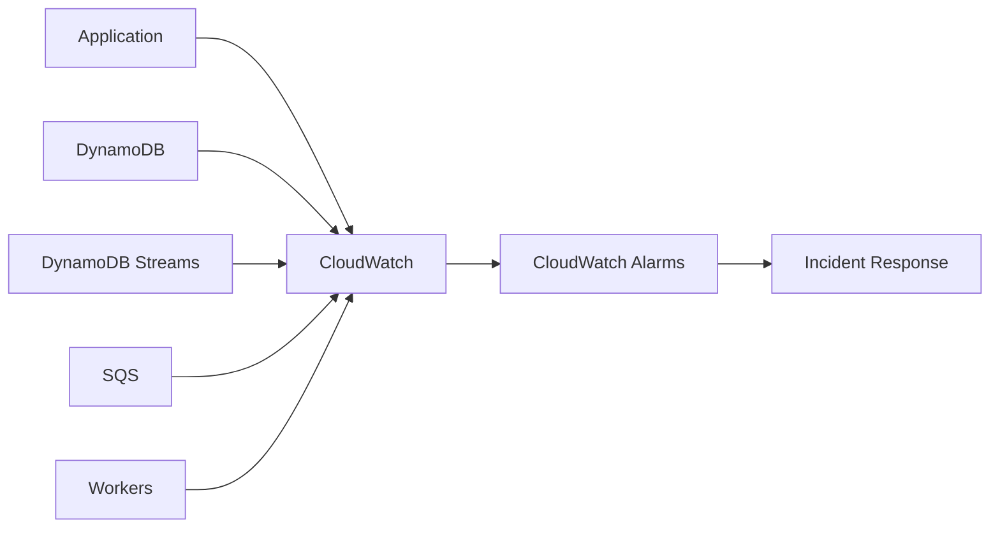

Monitoring should focus on user-impacting symptoms as well as infrastructure metrics.

---

## Distributed Tracing

A request may span multiple systems:

```text
HTTP Request
    |
    v
Backend
    |
    v
DynamoDB
    |
    v
DynamoDB Streams
    |
    v
Lambda
    |
    v
SQS
    |
    v
Worker
    |
    v
External API
```

Use correlation identifiers to connect these operations.

For example:

```text
request_id = req-123
event_id   = evt-456
order_id   = order-789
```

Logs should make it possible to answer:

> Which API request produced this DynamoDB change, and what downstream work resulted from it?

---

## Error Handling

DynamoDB clients should handle transient failures appropriately.

A production application should consider:

- Connection failures
- Timeouts
- Throttling
- Service errors
- Conditional check failures
- Transaction conflicts

Do not blindly retry every exception.

For example:

```text
ConditionalCheckFailedException
    |
    +----> Usually business/application condition
           rather than transient infrastructure failure
```

Whereas throttling may be retryable with appropriate backoff.

Use AWS SDK retry behavior where appropriate and complement it with application-level deadlines and idempotency.

---

## Retry Strategy

A typical retry strategy uses exponential backoff with jitter:

```text
Attempt 1
   ↓
short delay
   ↓
Attempt 2
   ↓
longer delay
   ↓
Attempt 3
   ↓
longer delay
```

Avoid:

```python
while True:
    retry()
```

Unbounded retries can create retry storms and increase the load on an already unhealthy dependency.

Set:

- Maximum attempts
- Request timeout
- Overall operation deadline
- Appropriate backoff
- Failure behavior

---

## Timeout Design

Timeouts should exist at multiple levels.

For example:

```text
Client timeout
    >
API timeout
    >
Application operation timeout
    >
DynamoDB request timeout
```

The exact values depend on the workload.

The important principle is that downstream operations should not outlive the request that depends on them indefinitely.

For asynchronous workloads, use separate timeout and retry policies from synchronous API requests.

---

## Connection and Client Reuse

AWS SDK clients should generally be reused rather than recreated for every request.

For example:

```python
import boto3

dynamodb = boto3.resource("dynamodb")

table = dynamodb.Table("Orders")
```

Create the client at module or application initialization scope where the runtime model permits it.

This allows the SDK to reuse underlying HTTP connections and reduces unnecessary client initialization overhead.

For high-throughput Python services, connection reuse can materially improve request efficiency.

---

## Performance Design

DynamoDB performance depends heavily on the data model and request pattern.

Prefer:

```text
GetItem
Query
BatchGetItem
BatchWriteItem
```

over:

```text
Scan
```

when the access pattern permits.

A `Query` targets a specific partition key and can optionally use sort-key conditions.

A `Scan` examines the table or index and can become expensive at scale.

Production rule:

> Design the primary key and indexes so that the application can answer its important queries with targeted operations.

---

## Pagination

DynamoDB query responses can be paginated.

A production application should not assume that one query returns every matching item.

Conceptually:

```python
response = table.query(
    KeyConditionExpression=key_condition,
)

items = response["Items"]

while "LastEvaluatedKey" in response:
    response = table.query(
        KeyConditionExpression=key_condition,
        ExclusiveStartKey=response["LastEvaluatedKey"],
    )
    items.extend(response["Items"])
```

For APIs, avoid blindly returning an unlimited number of records.

Expose application-level pagination such as:

```text
GET /orders?limit=50&cursor=...
```

This prevents large DynamoDB responses from becoming large API responses.

---

## Batch Operations

Batch APIs can reduce network round trips.

Examples include:

```text
BatchGetItem
BatchWriteItem
```

However, batch operations can contain partial failures and should be handled accordingly.

Do not assume:

```text
Batch request accepted
=
Every item permanently processed
```

The application should inspect unprocessed items and retry them using appropriate backoff.

---

## Secondary Indexes

Global Secondary Indexes are useful when the application needs additional query patterns.

For example:

```text
Primary table:

PK = CUSTOMER#123
SK = ORDER#456
```

A GSI could support:

```text
GSI1PK = STATUS#SHIPPED
GSI1SK = 2026-08-26T12:00:00Z
```

This allows a different access pattern without scanning the primary table.

However, indexes have costs:

- Additional storage
- Additional write work
- Additional read capacity considerations
- Additional operational complexity

Every index should correspond to a real access pattern.

---

## Cost Optimization

Production DynamoDB cost optimization should begin with architecture rather than simply reducing capacity.

Key areas include:

- Efficient partition keys
- Appropriate capacity mode
- Projection design for indexes
- Avoiding unnecessary scans
- Controlling item size
- Using caching selectively
- Avoiding unnecessary writes
- Right-sizing secondary indexes
- Monitoring unused capacity

A useful principle is:

```text
Fewer unnecessary operations
        +
Smaller data access
        +
Better access patterns
        =
Lower cost
```

Do not optimize cost by making the application perform inefficient access patterns.

---

## Item Size

Large items increase:

- Read/write cost
- Network transfer
- Latency
- Storage usage

If an entity contains large blobs or documents, consider whether those objects belong in DynamoDB.

For example:

```text
DynamoDB
    |
    +---- Metadata
    +---- Object key
    +---- Status
    +---- Ownership

S3
    |
    +---- Large object
```

S3 is often more appropriate for large binary objects.

DynamoDB should generally store the metadata required to locate and manage those objects.

---

## Operational Runbooks

Production DynamoDB systems should have runbooks for common incidents.

Examples:

### Throttling

```text
Detect throttling
    ↓
Identify table/index
    ↓
Check access pattern
    ↓
Check traffic spike
    ↓
Check partition distribution
    ↓
Apply mitigation
    ↓
Verify recovery
```

### High latency

```text
Check application latency
    ↓
Check DynamoDB latency
    ↓
Check request type
    ↓
Check partition distribution
    ↓
Check item size
    ↓
Check downstream dependencies
```

### Stream backlog

```text
Check iterator age
    ↓
Check consumer errors
    ↓
Check consumer throughput
    ↓
Check downstream bottleneck
    ↓
Scale or isolate workload
```

Runbooks reduce recovery time during incidents.

---

## Deployment Strategy

DynamoDB schema changes should be compatible with the currently deployed application.

A safe deployment pattern is:

```text
Deploy backward-compatible schema support
        ↓
Deploy application
        ↓
Migrate / backfill if required
        ↓
Verify
        ↓
Remove obsolete behavior later
```

Avoid deployments that require the old and new application versions to use mutually incompatible item structures simultaneously.

This is especially important in rolling deployments where multiple application versions can run at the same time.

---

## Backfills

Large data migrations should be carefully controlled.

A backfill can generate significant DynamoDB traffic:

```text
Existing Items
     |
     v
Migration Workers
     |
     v
DynamoDB Writes
```

Uncontrolled backfills can compete with production traffic.

Use:

- Controlled concurrency
- Rate limiting
- Capacity monitoring
- Retry handling
- Checkpointing
- Idempotent processing

A migration process should be restartable without corrupting data.

---

## Multi-Region Deployment Pipeline

If using Global Tables, infrastructure and application deployment should be coordinated across Regions.

A conceptual CI/CD flow is:

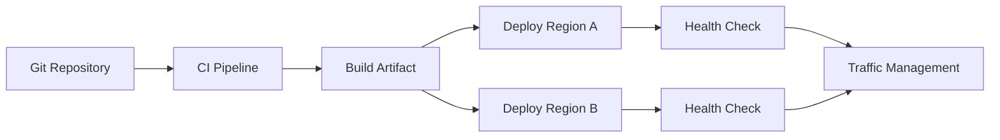

Avoid manually configuring one Region differently from another.

Configuration drift is a common source of failed disaster recovery.

Use Infrastructure as Code and automated deployment validation.

---

## Production Failure Scenarios

A production design should explicitly consider:

| Failure | Expected behavior |
|---|---|
| Application instance failure | Load balancer routes elsewhere |
| Availability Zone failure | Other AZs continue serving |
| DynamoDB throttling | SDK/application applies controlled retries |
| Consumer failure | Stream processing recovers/retries |
| Queue backlog | Workers scale or backlog is drained |
| Redis failure | Application falls back to DynamoDB where appropriate |
| Regional application failure | Traffic shifts to healthy Region |
| Data corruption | PITR/backup recovery |
| Deployment failure | Rollback or controlled remediation |
| External API outage | Queue buffers work and retries |

The architecture should define expected behavior rather than discovering it during an incident.

---

## Production Anti-Patterns

### Using DynamoDB Like PostgreSQL

Avoid designing the table first and asking how to query it later.

DynamoDB requires access-pattern-driven modeling.

### Using Scan for Primary Application Queries

A large table scan is rarely an appropriate replacement for a well-designed key-based query.

### Adding Indexes Without Access Patterns

Every GSI introduces additional storage and write considerations.

### Using Redis as the Source of Truth

Cache failures should not destroy application correctness.

### Performing All Work Synchronously

Expensive secondary operations should often be moved to asynchronous processing.

### Blindly Retrying Every Error

Some errors represent business conditions rather than transient failures.

### Hard-Coding AWS Credentials

Use IAM roles and runtime credential providers.

### No PITR

Production data should have a defined recovery strategy.

### No Failure Testing

An HA architecture that has never been tested is an assumption, not a verified capability.

### Overusing Multi-Region Architecture

Global Tables add complexity and cost. Use them when business requirements justify them.

---

## Production Readiness Checklist

### Data Modeling

- [ ] Access patterns are documented.
- [ ] Partition keys provide sufficient distribution.
- [ ] Sort keys support required range queries.
- [ ] GSIs correspond to actual access patterns.
- [ ] Item sizes are controlled.
- [ ] Hot partitions have been evaluated.

### Application

- [ ] Application instances are stateless.
- [ ] DynamoDB clients are reused.
- [ ] Timeouts are configured.
- [ ] Retry behavior is bounded.
- [ ] Idempotency is implemented where required.
- [ ] Conditional writes are used for appropriate invariants.
- [ ] Transactions are used only where atomicity is required.

### Scalability

- [ ] Capacity mode matches workload characteristics.
- [ ] Production traffic has been load tested.
- [ ] Pagination is implemented.
- [ ] Batch operations handle partial failures.
- [ ] Backpressure exists for asynchronous workloads.

### Reliability

- [ ] Application spans multiple Availability Zones.
- [ ] PITR is enabled where required.
- [ ] Backups are configured.
- [ ] Restore procedures are documented.
- [ ] RPO and RTO are defined.
- [ ] Multi-Region requirements have been evaluated.

### Security

- [ ] IAM follows least privilege.
- [ ] No static AWS credentials are stored in code.
- [ ] Encryption requirements are defined.
- [ ] KMS policies are tested where applicable.
- [ ] VPC endpoint policies are reviewed where applicable.
- [ ] Audit logging is enabled where required.

### Observability

- [ ] DynamoDB throttling is monitored.
- [ ] DynamoDB latency is monitored.
- [ ] Application errors are monitored.
- [ ] Stream processing is monitored.
- [ ] Queue depth is monitored.
- [ ] Dead-letter processing is monitored.
- [ ] Alerts are connected to incident response.

### Operations

- [ ] Deployment strategy is documented.
- [ ] Backfill procedures are documented.
- [ ] Incident runbooks exist.
- [ ] Failover procedures are tested.
- [ ] Failback procedures are tested.
- [ ] Infrastructure is managed through IaC.
- [ ] Regional configuration drift is controlled.

---

## Key Takeaways

- A production DynamoDB architecture starts with access patterns and data modeling, then builds capacity, application, reliability, security, and operational decisions around those requirements.
- High availability requires more than DynamoDB resilience: application compute, retries, caching, queues, event consumers, backups, monitoring, and failover procedures must also be designed for failure.
- Production performance depends heavily on partition-key distribution, efficient queries, controlled item sizes, appropriate indexes, pagination, and avoiding unnecessary scans.
- DynamoDB should remain the authoritative datastore when appropriate, while Redis, Streams, SQS, workers, and other services should be introduced only for clearly defined supporting responsibilities.
- Production readiness requires explicit RPO/RTO targets, least-privilege security, observability, tested recovery procedures, controlled deployments, and operational runbooks.