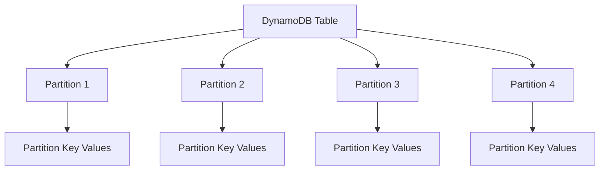
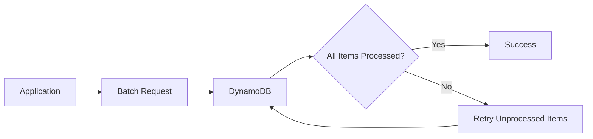
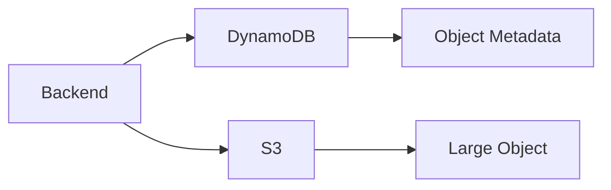
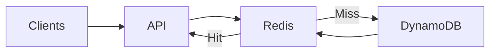
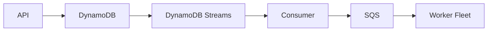
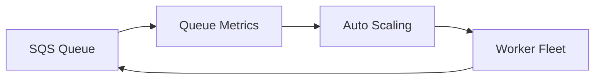
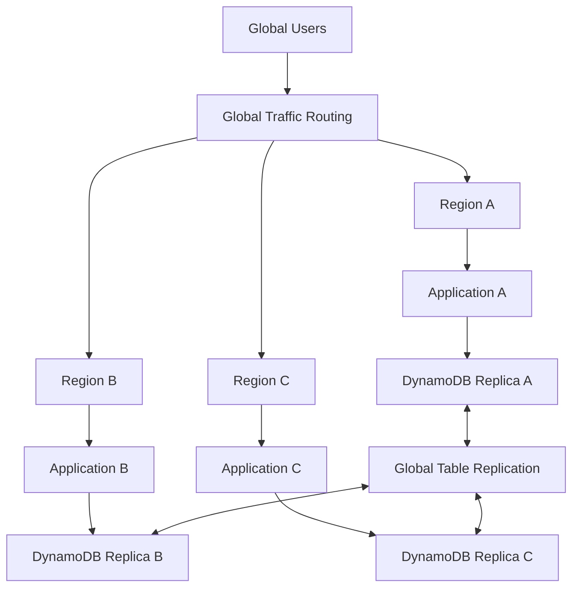
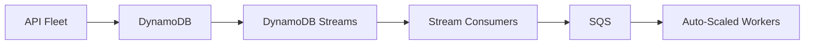

# 06- Scalable DynamoDB Architecture

## Overview

A scalable DynamoDB architecture is designed to sustain increasing request volume, data growth, concurrency, and workload variability without introducing hot partitions, throttling, excessive latency, or operational bottlenecks.

DynamoDB scales horizontally by distributing data and traffic across its underlying infrastructure. However, application-level scalability still depends heavily on the data model, partition-key distribution, item size, access patterns, secondary indexes, capacity mode, retry behavior, and downstream dependencies.

A production scalability architecture should therefore be designed around:

```text
Access Patterns
      ↓
Partition-Key Distribution
      ↓
Request Distribution
      ↓
Capacity Management
      ↓
Application Scaling
      ↓
Asynchronous Processing
      ↓
Observability and Load Testing
```

The most important principle is:

> DynamoDB can scale horizontally, but a poorly distributed access pattern can prevent the application from benefiting from that scalability.

---

## Scalability Model

DynamoDB distributes table data across partitions based on partition-key values and manages the underlying infrastructure as the table grows.

Conceptually:



The application does not directly manage these physical partitions.

Instead, the application controls the logical distribution of workload through its key design.

This creates an important distinction:

```text
Physical scaling
    |
    +---- Managed by DynamoDB

Logical workload distribution
    |
    +---- Largely determined by application data modeling
```

---

## Horizontal Scalability

DynamoDB is designed for horizontal scaling rather than relying on a single increasingly powerful database server.

A scalable workload should be able to distribute requests across many logical partition-key values.

For example:

```text
customer-001
customer-002
customer-003
customer-004
...
customer-N
```

is generally easier to distribute than:

```text
ALL_ORDERS
```

where a large percentage of requests target the same partition key.

The goal is not simply to create many keys.

The goal is to distribute actual traffic and storage requirements across those keys.

---

## Access Patterns Drive Scalability

A scalable DynamoDB design starts with the queries the application must execute.

For example:

```text
Requirement:
Retrieve recent orders for a customer.
```

A suitable design might be:

```text
PK = CUSTOMER#123
SK = ORDER#2026-08-26T10:30:00Z#ORDER-456
```

The application can then issue a targeted query:

```text
PK = CUSTOMER#123
ORDER BY SK
```

This is fundamentally different from:

```text
Scan entire table
Filter customer_id = 123
```

The second design becomes increasingly expensive as the table grows.

---

## Query-Driven Data Modeling

A production design process should look like:


Document important access patterns before creating the table.

For each pattern, identify:

- Operation type
- Partition key
- Sort key condition
- Expected request rate
- Expected item size
- Result size
- Consistency requirement
- Growth characteristics

Example:

| Access pattern | Operation | Key strategy |
|---|---|---|
| Get order | `GetItem` | Order ID |
| List customer orders | `Query` | Customer ID + time-based sort key |
| Get order by payment ID | GSI query | Payment ID index |
| Recent shipped orders | GSI query | Status/time index |

This makes scalability a property of the data model rather than an afterthought.

---

## Partition-Key Cardinality

Partition-key cardinality describes how many distinct partition-key values exist.

High cardinality generally provides more opportunities for workload distribution.

For example:

```text
customer_id
```

may provide millions of distinct values.

A key such as:

```text
status
```

may provide only:

```text
PENDING
PAID
SHIPPED
CANCELLED
```

Using a low-cardinality attribute directly as the partition key can concentrate traffic.

However, cardinality alone is not enough.

A key can have millions of possible values while one particular value receives most of the traffic.

The real concern is **traffic distribution**.

---

## Hot Partitions

A hot partition occurs when a disproportionate amount of traffic or data is concentrated around a small subset of partition keys.

Example:

```text
Partition Key:

STATUS#PENDING
```

Suppose:

```text
10 million total items
```

but:

```text
STATUS#PENDING
= 8 million items
```

and most writes target that value.

The workload becomes highly concentrated.

Another common example is a popular entity:

```text
PK = PRODUCT#123
```

If millions of users continuously update or read the same logical item, that key can become a hotspot.

---

## Detecting Hot Workloads

Hot partitions should be evaluated using workload behavior rather than only table-level throughput.

Useful signals include:

- Throttled requests
- Consumed capacity
- Request latency
- Partition-key distribution
- Access-pattern frequency
- Traffic spikes
- Item popularity

CloudWatch metrics can identify table-level behavior, but application-level metrics are often required to identify which logical keys are generating disproportionate traffic.

A useful application metric is:

```text
dynamodb.request.partition_key_hash
```

or an equivalent anonymized logical-key metric.

Do not log sensitive partition-key values indiscriminately.

---

## Write Sharding

Write sharding can distribute traffic when a single logical entity receives too many writes.

For example:

```text
Original:

PK = COUNTER#ORDERS
```

can become:

```text
PK = COUNTER#ORDERS#00
PK = COUNTER#ORDERS#01
PK = COUNTER#ORDERS#02
...
PK = COUNTER#ORDERS#09
```

The application distributes writes across shards.

For example:

```python
import hashlib


def get_shard(entity_id: str, shard_count: int) -> int:
    digest = hashlib.sha256(entity_id.encode()).hexdigest()
    return int(digest, 16) % shard_count
```

The application can then construct:

```text
COUNTER#ORDERS#07
```

instead of always writing to:

```text
COUNTER#ORDERS
```

Write sharding is useful when the workload requires distributing writes for a logical entity.

The trade-off is that reads may need to query multiple shards and merge results.

---

## Random vs Deterministic Sharding

Two common strategies are:

### Random sharding

```text
PK = ORDER#123#0
PK = ORDER#123#1
PK = ORDER#123#2
```

A write selects a shard randomly.

Advantages:

- Simple write distribution
- Good for highly concurrent workloads

Limitations:

- Reading all data requires checking all shards
- The application must know the shard count

### Deterministic sharding

A hash determines the shard:

```text
hash(entity_id) % N
```

Advantages:

- Predictable routing
- Same entity maps consistently
- Easier targeted reads

Limitations:

- Resharding can be more complicated
- One entity can still become hot if all operations map to one shard

Select the strategy based on the read/write access patterns.

---

## Time-Based Partitioning

Time can be useful for distributing high-volume workloads.

For example:

```text
PK = EVENTS#2026-08-26
```

instead of:

```text
PK = EVENTS
```

This can limit the amount of data and traffic associated with one logical partition key.

For very high-volume workloads, a finer-grained strategy can be used:

```text
EVENTS#2026-08-26#00
EVENTS#2026-08-26#01
...
EVENTS#2026-08-26#23
```

The correct granularity depends on the workload.

Time-based partitioning is particularly useful for:

- Event ingestion
- Logs
- Metrics
- Time-series-like workloads
- Audit records

However, it introduces additional query logic when retrieving data across multiple time buckets.

---

## Adaptive Capacity

DynamoDB automatically manages capacity distribution and can adapt to uneven traffic patterns.

This is useful because real-world workloads are rarely perfectly uniform.

For example:

```text
Customer A -> 10 requests/sec
Customer B -> 10 requests/sec
Customer C -> 5,000 requests/sec
```

DynamoDB's adaptive capacity mechanisms can help accommodate uneven workloads.

However, adaptive capacity should not be treated as permission to ignore poor partition-key design.

A heavily concentrated workload can still create scalability problems.

The correct engineering approach is:

```text
Good key design
      +
Appropriate capacity
      +
Adaptive capacity
      +
Monitoring
```

rather than:

```text
Poor key design
      +
Hope adaptive capacity fixes it
```

---

## Capacity Modes

DynamoDB provides two primary capacity modes:

- On-demand
- Provisioned

### On-demand

On-demand capacity is useful when request volume is variable or difficult to predict.

Typical workloads include:

- New applications
- Bursty APIs
- Unpredictable traffic
- Variable workloads
- Development and early production systems

### Provisioned

Provisioned capacity is useful when traffic is relatively predictable and the organization wants more direct capacity planning.

Typical workloads include:

- Stable production APIs
- Predictable batch workloads
- High-volume steady-state services

The correct decision should be based on workload characteristics and cost.

---

## Capacity Planning

Capacity planning should consider:

```text
Average traffic
+
Peak traffic
+
Burst traffic
+
Failover traffic
+
Background workloads
```

For example:

```text
Normal:
20,000 writes/sec

Peak:
50,000 writes/sec

Regional failover:
80,000 writes/sec
```

The architecture must be evaluated against the highest relevant operating condition rather than only average traffic.

Capacity planning should include:

- Base traffic
- Peak traffic
- Seasonal traffic
- Batch jobs
- Backfills
- Replay workloads
- Disaster recovery scenarios

---

## Read Scaling

DynamoDB read scalability depends heavily on access patterns.

Prefer targeted operations:

```text
GetItem
Query
BatchGetItem
```

over large scans.

For example:

```text
Query:
PK = CUSTOMER#123
```

is much more scalable than:

```text
Scan
Filter customer_id = 123
```

when retrieving a customer's orders.

---

## Pagination for Large Result Sets

Large query results should be paginated.

A Python API can expose a cursor-based interface:

```text
GET /orders?customer_id=123&limit=50
```

The response can contain:

```json
{
  "items": [],
  "next_cursor": "..."
}
```

The application should map DynamoDB's pagination mechanism to an API-level cursor rather than exposing raw database implementation details.

This prevents clients from accidentally requesting massive result sets.

---

## Query Fan-Out

Write sharding and time bucketing can require multiple queries.

For example:

```text
Shard 0 ──┐
Shard 1 ──┤
Shard 2 ──┤──> Application ──> Merge Results
Shard 3 ──┘
```

This is called query fan-out.

Fan-out can increase:

- Read requests
- Latency
- Application CPU
- Network traffic
- Complexity

Use it only when the scalability benefit outweighs the additional read complexity.

A scalable design should avoid turning every normal request into dozens of DynamoDB queries.

---

## Batch Operations

Batch APIs can reduce network round trips.

Useful operations include:

```text
BatchGetItem
BatchWriteItem
```

However, batches can contain unprocessed items.

Production code should retry those items with appropriate backoff.

Conceptually:



Do not assume that one batch request guarantees that every requested item has completed successfully.

---

## Write Scaling

Write scalability depends on:

- Partition-key distribution
- Item size
- Write frequency
- Conditional operations
- Transactions
- Secondary indexes
- Global Tables replication

A write to an item with multiple GSIs can generate additional index maintenance work.

Therefore:

```text
Application Write
      |
      +----> Base Table
      |
      +----> GSI 1
      |
      +----> GSI 2
      |
      +----> GSI N
```

Indexes should be justified by actual access patterns.

---

## Secondary Index Scalability

A GSI can provide an important access pattern while introducing additional workload.

For example:

```text
Primary table:

PK = CUSTOMER#123
SK = ORDER#456
```

GSI:

```text
GSI1PK = STATUS#SHIPPED
GSI1SK = CREATED#2026-08-26
```

If millions of items share the same GSI partition key:

```text
STATUS#SHIPPED
```

the index itself can become a concentrated workload.

Indexes therefore need the same scalability analysis as the base table.

---

## Sparse Indexes

A sparse GSI can reduce unnecessary index entries.

For example, only items containing:

```text
GSI1PK
```

appear in the index.

If only shipped orders require a particular query:

```text
GSI1PK = SHIPPED
```

then other order states can omit the GSI attributes.

This can reduce:

- Index storage
- Index write workload
- Index query scope

Sparse indexes are useful when only a subset of entities participates in an access pattern.

---

## Item Size and Scalability

Large DynamoDB items increase read and write consumption.

For example:

```text
Item:
2 KB
```

is substantially cheaper to process than:

```text
Item:
300 KB
```

for the same logical request.

Avoid putting large binary objects directly into DynamoDB when object storage is more appropriate.

A common architecture is:



DynamoDB can store:

```text
object_id
object_key
content_type
size
status
```

while S3 stores the actual object.

---

## Hot Item Problem

Not every scalability problem is caused by a hot partition.

A single item can itself become extremely popular.

Example:

```text
PK = PRODUCT#123
```

Millions of requests may attempt to read or update that item.

A caching layer can reduce repeated reads:



For high-read workloads, Redis or another caching mechanism can protect DynamoDB from repeated identical reads.

For write-heavy hot items, caching alone does not solve the underlying write contention.

Consider:

- Write sharding
- Aggregation
- Asynchronous updates
- Atomic counters
- Event-driven processing

---

## Aggregation Patterns

A common scalability problem occurs when many requests attempt to update one aggregate.

For example:

```text
Total likes for post #123
```

A naive design may perform:

```text
UPDATE post#123
SET likes = likes + 1
```

for every user action.

A high-volume workload can concentrate writes on one item.

A scalable alternative can shard counters:

```text
POST#123#COUNTER#00
POST#123#COUNTER#01
POST#123#COUNTER#02
...
POST#123#COUNTER#99
```

Workers can asynchronously aggregate those counters.

This trades immediate simplicity for greater write scalability.

---

## Asynchronous Scaling

DynamoDB Streams can move secondary processing out of the request path.



This allows the system to absorb bursts without forcing the API layer to perform every downstream operation synchronously.

Use asynchronous processing for:

- Notifications
- Search indexing
- Analytics
- External integrations
- Heavy computation
- Background workflows

Do not use asynchronous processing when the client requires an immediate transactional result.

---

## Backpressure

A scalable asynchronous architecture must handle situations where consumers are slower than producers.

For example:

```text
DynamoDB changes:
50,000 events/sec

Consumer capacity:
10,000 events/sec
```

The architecture needs a buffer.

```text
DynamoDB
   |
   v
Streams
   |
   v
Consumer
   |
   v
SQS
   |
   v
Worker fleet
```

Monitor:

- Queue depth
- Oldest message age
- Consumer throughput
- Worker utilization
- Error rate

A growing queue indicates that the downstream system is not keeping up.

---

## Worker Scaling

Workers should scale based on workload rather than simply running a fixed number of processes.

Possible signals include:

```text
Queue depth
Message age
CPU
Memory
Processing latency
```

For example:



This pattern works well with:

- ECS
- EKS
- Lambda
- Celery workers
- EC2 worker fleets

The worker system should remain idempotent because scaling increases concurrency and can expose duplicate-processing scenarios.

---

## API-Level Scalability

DynamoDB can scale independently from the application layer.

The complete system therefore needs:

```text
Client
   |
   v
Load Balancer
   |
   v
Application Fleet
   |
   v
DynamoDB
```

The application tier should scale horizontally.

For containerized workloads:

```text
ALB
 |
 +---- ECS Task A
 +---- ECS Task B
 +---- ECS Task C
 +---- ECS Task N
```

For Kubernetes:

```text
Ingress / Load Balancer
        |
        v
Kubernetes Service
        |
        v
Pod replicas
        |
        v
DynamoDB
```

Do not allow application compute to become the scalability bottleneck after solving the database bottleneck.

---

## Connection Reuse

High-throughput Python applications should reuse AWS SDK clients.

For example:

```python
import boto3

dynamodb = boto3.resource("dynamodb")
orders = dynamodb.Table("Orders")
```

Avoid creating a new client for every request:

```python
def get_order(order_id):
    dynamodb = boto3.resource("dynamodb")
    ...
```

Client reuse allows underlying HTTP connections and SDK resources to be reused.

At high request rates, unnecessary client construction can increase CPU usage and latency.

---

## Retry Storms

Retries can amplify a scalability incident.

For example:

```text
DynamoDB latency increases
        ↓
Application requests timeout
        ↓
Clients retry
        ↓
Request volume increases
        ↓
DynamoDB receives more traffic
        ↓
Latency increases further
```

This is a feedback loop.

Use:

- Exponential backoff
- Jitter
- Request deadlines
- Bounded retries
- Idempotency
- Circuit breaking where appropriate
- Load shedding where appropriate

A retry strategy should reduce pressure on a failing dependency rather than increase it.

---

## Idempotency

Scalable systems often have more concurrency and retries.

An API such as:

```text
POST /payments
```

should use an idempotency strategy if duplicate execution could create an incorrect business outcome.

For example:

```text
Idempotency Key
       |
       v
DynamoDB
       |
       +---- First request -> Process
       |
       +---- Duplicate -> Return existing result
```

DynamoDB conditional writes can help implement this behavior.

Idempotency is particularly important for:

- Payments
- Orders
- Inventory
- External API calls
- Message consumers

---

## Concurrency Control

Optimistic concurrency can protect entities from conflicting updates.

For example:

```text
Item:

version = 10
```

The application attempts:

```text
Update where version = 10
Set version = 11
```

If another writer has already changed the item to version `11`, the conditional update fails.

Conceptually:

```python
table.update_item(
    Key={
        "PK": "ORDER#123",
        "SK": "DETAILS",
    },
    UpdateExpression="SET #version = :next_version",
    ConditionExpression="#version = :current_version",
    ExpressionAttributeNames={
        "#version": "version",
    },
    ExpressionAttributeValues={
        ":current_version": 10,
        ":next_version": 11,
    },
)
```

This prevents silent overwrites in concurrent workflows.

---

## Multi-Region Scalability

DynamoDB Global Tables can distribute application workloads across Regions.



Multi-Region architecture can improve:

- Geographic latency
- Regional availability
- Traffic distribution
- Disaster recovery

But it also introduces:

- Replication traffic
- Conflict handling
- More infrastructure
- Higher cost
- More complex deployment
- More complex observability

Do not confuse multi-Region deployment with automatic unlimited scalability.

The application still needs effective partition distribution within each Region.

---

## MREC and MRSC Scalability Considerations

Global Tables provide two consistency modes:

| Consideration | MREC | MRSC |
|---|---|---|
| Replication | Asynchronous | Synchronous |
| Cross-Region consistency | Eventual | Strong |
| Write latency | Lower | Higher |
| Multi-Region writes | Supported | Supported within MRSC constraints |
| Operational complexity | Lower | Higher |
| Conflict considerations | Important | Reduced by stronger coordination |

MREC is often preferable for workloads prioritizing low latency and flexible multi-Region writes.

MRSC is appropriate when strong cross-Region consistency is a hard requirement.

Do not select a consistency model based only on theoretical correctness.

Evaluate:

```text
Latency requirement
+
Consistency requirement
+
Failure model
+
Business semantics
+
Cost
```

---

## Global Tables Write Conflicts

MREC allows concurrent writes in different Regions.

For example:

```text
Region A:
Order status = SHIPPED

Region B:
Order status = CANCELLED
```

If both updates target the same item, conflict resolution becomes a business concern.

For high-value entities, consider:

- Region ownership
- Tenant affinity
- Single-writer patterns
- Conditional writes
- Versioning
- Conflict reconciliation

A highly scalable architecture should not create a correctness problem simply to maximize geographic write availability.

---

## Load Testing

DynamoDB scalability should be validated using realistic workloads.

A useful test model is:

```text
Baseline
    ↓
Normal traffic
    ↓
Peak traffic
    ↓
Burst traffic
    ↓
Sustained peak
    ↓
Failure scenario
```

Test:

- Read throughput
- Write throughput
- Hot-key behavior
- GSI workload
- Item size
- Query latency
- Batch operations
- Conditional writes
- Transaction throughput
- Stream processing
- Queue backlog
- Worker scaling

Synthetic tests should resemble real production access patterns.

A test that distributes requests uniformly across millions of random keys may fail to reveal a production hot-key problem.

---

## Capacity Stress Testing

Stress testing should include uneven traffic.

For example:

```text
Customer A: 1,000 req/sec
Customer B: 1,000 req/sec
Customer C: 100,000 req/sec
Other customers: 10,000 req/sec
```

This is more representative of many real systems than:

```text
Every customer: 1,000 req/sec
```

Production workloads are often skewed.

Scalability testing should intentionally test the skew.

---

## Monitoring Scalability

Important CloudWatch and application metrics include:

### DynamoDB

- Consumed read capacity
- Consumed write capacity
- Throttled read requests
- Throttled write requests
- Successful request count
- Latency
- System errors
- User errors

### Application

- Requests per second
- Latency percentiles
- Error rate
- Timeout rate
- CPU
- Memory
- Connection usage

### Streams

- Iterator age
- Records processed
- Processing latency
- Consumer errors

### SQS

- Queue depth
- Oldest message age
- Messages received
- Messages deleted
- Dead-letter queue size

Monitoring should allow operators to identify whether the bottleneck is:

```text
Application
    ↓
DynamoDB
    ↓
Stream
    ↓
Queue
    ↓
Worker
    ↓
External dependency
```

rather than merely reporting that the API is slow.

---

## Observability for Partition Distribution

Table-level metrics can hide logical-key hotspots.

Application telemetry can expose workload distribution.

For example:

```text
operation = QueryOrders
tenant = tenant-123
duration_ms = 8
items = 20
```

Aggregate metrics can reveal:

```text
Top tenants by request volume
Top access patterns
Top logical partition keys
Highest latency keys
Highest retry rates
```

Be careful with high-cardinality telemetry.

Do not create unlimited CloudWatch metric dimensions from raw user identifiers.

Use aggregation, hashing, sampling, or application-level diagnostics where appropriate.

---

## Cost and Scalability

Scalability and cost are closely related.

Increasing throughput can increase:

- Read/write request costs
- GSI costs
- Storage costs
- Stream processing costs
- Lambda costs
- SQS costs
- Worker infrastructure costs
- Multi-Region replication costs

A scalable architecture should optimize the entire workload.

For example:

```text
Bad:

Read 1 MB
    ↓
Application filters 90%
    ↓
Return 100 KB
```

Better:

```text
DynamoDB Query
    ↓
Return only required data
```

Efficient access patterns improve both performance and cost.

---

## Scaling Backfills

Data migrations can temporarily create workloads much larger than normal production traffic.

For example:

```text
Production:
5,000 writes/sec

Backfill:
50,000 writes/sec
```

If the migration competes directly with production traffic, it can cause throttling and latency.

Use:

- Rate limiting
- Controlled concurrency
- Checkpointing
- Idempotent writes
- Monitoring
- Off-peak scheduling where appropriate

A backfill should have a kill switch.

---

## Disaster Recovery Capacity

A multi-Region system should evaluate capacity after failure.

For example:

```text
Normal:

Region A = 40%
Region B = 40%
Region C = 20%

Region A failure:

Region B = 67%
Region C = 33%
```

The remaining Regions must have enough application and database capacity for the new traffic distribution.

Capacity planning should therefore include:

```text
Normal state
+
Peak state
+
Regional failure state
```

---

## Scalability and Security

Security controls should not become a throughput bottleneck.

Review:

- IAM policy complexity
- KMS usage
- VPC endpoint policies
- Application authentication
- Authorization checks
- API rate limits

Application-level rate limiting can protect DynamoDB from uncontrolled client traffic.

For example:

```text
Internet
   |
   v
API Gateway / Nginx
   |
   v
Rate Limiting
   |
   v
Application
   |
   v
DynamoDB
```

Rate limiting is especially important for expensive operations and public APIs.

---

## Rate Limiting

A scalable backend should protect DynamoDB from abusive or accidental traffic spikes.

Rate limits can be applied at:

- API Gateway
- Load balancer layer
- Application layer
- Per-user level
- Per-tenant level
- Per-endpoint level

For example:

```text
Tenant A
    |
    +---- 1,000 req/sec limit

Tenant B
    |
    +---- 5,000 req/sec limit
```

This prevents one tenant from consuming all available capacity.

For distributed applications, rate-limiting state may require Redis or another shared mechanism.

---

## Tenant-Aware Scaling

Multi-tenant SaaS applications need special attention.

A single tenant can generate disproportionate traffic:

```text
Tenant A -> 70% of traffic
Tenant B -> 10%
Tenant C -> 5%
Others  -> 15%
```

Potential strategies include:

- Tenant-specific partitioning
- Tenant-aware throttling
- Dedicated capacity for large tenants
- Write sharding
- Tenant-region affinity
- Workload isolation

Do not assume that tenant count alone guarantees workload distribution.

---

## Scalable Event Processing

A production event-driven architecture should scale independently from the API.



This architecture allows:

```text
API scaling
    ≠
Consumer scaling
    ≠
Worker scaling
```

Each tier can scale according to its own workload.

This is particularly useful when DynamoDB writes are fast but downstream processing is expensive.

---

## Common Scalability Mistakes

### Using Low-Cardinality Partition Keys

Keys such as:

```text
status
country
type
```

can concentrate traffic if used directly as partition keys.

Use a key structure that matches the workload.

### Relying on Scan

A scan that works at 10,000 items may become unacceptable at 10 billion items.

Design queries around keys and indexes.

### Ignoring GSI Hotspots

A well-designed base table can still have a poorly distributed GSI.

Analyze every index independently.

### Over-Sharding

Sharding every workload can create unnecessary query fan-out and application complexity.

Shard only when there is a demonstrated distribution problem.

### Assuming On-Demand Solves Bad Data Modeling

On-demand capacity can absorb changing traffic, but it does not make an inefficient access pattern efficient.

### Unlimited Retries

Retries can amplify an outage.

Use bounded retries, backoff, jitter, and deadlines.

### Scaling Only the Database

The application, queue, workers, cache, and downstream dependencies must also scale.

### Ignoring Hot Items

One extremely popular item can become a bottleneck even when the overall table has excellent distribution.

### Testing Only Average Traffic

Production failures often occur during traffic spikes and skewed workloads.

Test realistic peak and hotspot scenarios.

### No Backpressure

If downstream consumers cannot keep up, uncontrolled asynchronous processing can exhaust resources.

Use queues and explicit scaling policies where appropriate.

---

## Production Scalability Checklist

### Data Model

- [ ] Access patterns are documented.
- [ ] Partition-key distribution has been analyzed.
- [ ] Hot keys have been identified.
- [ ] Sort keys support required queries.
- [ ] GSIs are justified by access patterns.
- [ ] GSI partition distribution has been evaluated.
- [ ] Item size is controlled.

### Throughput

- [ ] Expected average throughput is known.
- [ ] Peak throughput is known.
- [ ] Burst behavior has been tested.
- [ ] Capacity mode has been selected deliberately.
- [ ] Provisioned auto scaling is configured where appropriate.

### Application

- [ ] Application instances scale horizontally.
- [ ] AWS SDK clients are reused.
- [ ] Timeouts are configured.
- [ ] Retries use exponential backoff.
- [ ] Retry attempts are bounded.
- [ ] Idempotency is implemented where required.
- [ ] Rate limiting protects expensive operations.

### Data Access

- [ ] Primary queries use `GetItem` or `Query` where appropriate.
- [ ] Large result sets are paginated.
- [ ] Batch operations handle unprocessed items.
- [ ] Scans are restricted to justified workloads.
- [ ] Query fan-out is controlled.

### Asynchronous Processing

- [ ] DynamoDB Streams consumers are idempotent.
- [ ] Queue-based buffering exists where necessary.
- [ ] Backpressure is measurable.
- [ ] Worker scaling is configured.
- [ ] Dead-letter handling exists where appropriate.

### Reliability

- [ ] Multi-AZ application deployment exists.
- [ ] Regional failure capacity has been evaluated.
- [ ] Global Tables are used only when required.
- [ ] RPO and RTO are documented.
- [ ] PITR and backups are configured where required.
- [ ] Failure scenarios have been tested.

### Observability

- [ ] DynamoDB throttling is monitored.
- [ ] Latency percentiles are monitored.
- [ ] Application request rate is monitored.
- [ ] Stream iterator age is monitored.
- [ ] Queue depth is monitored.
- [ ] Worker processing latency is monitored.
- [ ] Hot-key investigations are possible.

### Operations

- [ ] Load tests use realistic traffic distributions.
- [ ] Backfill procedures are rate-limited.
- [ ] Capacity changes are documented.
- [ ] Scaling policies are tested.
- [ ] Incident runbooks exist.
- [ ] Deployment and rollback procedures are defined.
- [ ] Infrastructure is managed through IaC.

---

## Key Takeaways

- DynamoDB scalability depends primarily on access-pattern-driven data modeling and effective distribution of traffic across partition keys and indexes.
- Hot partitions, hot items, poorly distributed GSIs, large items, scans, and uncontrolled query fan-out can become bottlenecks even when the overall DynamoDB table has substantial capacity.
- Production scalability requires coordinated scaling across the API layer, DynamoDB, Streams, queues, workers, caches, and downstream dependencies.
- Bounded retries, idempotency, rate limiting, backpressure, pagination, and realistic load testing are essential for preventing application behavior from amplifying scalability problems.
- A scalable architecture must be validated against peak traffic, skewed workloads, backfills, asynchronous backlog, and Regional failure scenarios—not only average production traffic.