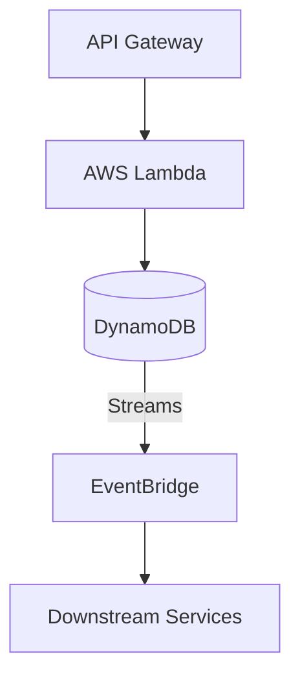

# 09- AWS DynamoDB

## Overview

This section covers high-level system design patterns, distributed architectures, and event-driven workflows utilizing DynamoDB.

## 09- AWS DynamoDB Files

| File | Topic | Primary Focus |
|---|---|---|
| [01- Core Architecture](./01-%20Core%20Architecture.md) | Core Architecture | Perfect |
| [02- High Availability Architecture](./02-%20High%20Availability%20Architecture.md) | High Availability Architecture | Amazon DynamoDB is designed as a highly available managed... |
| [03- Global Tables Architecture](./03-%20Global%20Tables%20Architecture.md) | Global Tables Architecture | Amazon DynamoDB Global Tables provide a multi-Region arch... |
| [04- Event Driven Architecture](./04-%20Event%20Driven%20Architecture.md) | Event Driven Architecture | Event-driven architecture (EDA) uses events to communicat... |
| [05- Production DynamoDB Architecture](./05-%20Production%20DynamoDB%20Architecture.md) | Production DynamoDB Architecture | A production DynamoDB architecture is more than a DynamoD... |
| [06- Scalable DynamoDB Architecture](./06-%20Scalable%20DynamoDB%20Architecture.md) | Scalable DynamoDB Architecture | A scalable DynamoDB architecture is designed to sustain i... |

## Progression

The documentation in this section builds conceptually according to the following flow:



## Core Concepts

### Event-Driven Architecture
Reacting to database modifications asynchronously.

### High Availability
Designing systems that survive Availability Zone and Region failures.

## Engineering Patterns

- **Outbox Pattern:** Saving events to DynamoDB in the same transaction as state changes, then streaming them out.
- **Multi-Region Active-Active:** Using Global Tables to serve global user bases with local read/write latency.

## Practical Considerations

Global Tables introduce replication latency and conflict resolution (last-writer-wins) that the application layer must tolerate.

## Common Mistakes

- Relying on DynamoDB for heavy analytical (OLAP) queries instead of exporting to S3/Redshift.
- Building tight synchronous coupling instead of using DynamoDB Streams.

## Recommended Reading Order

To maximize comprehension, study the files in this sequence:

1. [01- Core Architecture](./01-%20Core%20Architecture.md)
2. [02- High Availability Architecture](./02-%20High%20Availability%20Architecture.md)
3. [03- Global Tables Architecture](./03-%20Global%20Tables%20Architecture.md)
4. [04- Event Driven Architecture](./04-%20Event%20Driven%20Architecture.md)
5. [05- Production DynamoDB Architecture](./05-%20Production%20DynamoDB%20Architecture.md)
6. [06- Scalable DynamoDB Architecture](./06-%20Scalable%20DynamoDB%20Architecture.md)

## Decision Checklist

- [ ] Does the architecture tolerate eventual consistency?
- [ ] Are background processes decoupled using Streams?
- [ ] Is caching (DAX/Redis) positioned correctly to protect the database?

## Mental Model

DynamoDB is not just a storage layer; via Streams, it acts as the central nervous system of an event-driven microservices architecture.

## Key Takeaways

- Master the concepts before writing code.
- Understand the capacity implications of your designs.
- Continuously monitor production metrics.

## Folder Structure

```text
09- AWS DynamoDB/
    01- Core Architecture.md
    02- High Availability Architecture.md
    03- Global Tables Architecture.md
    04- Event Driven Architecture.md
    05- Production DynamoDB Architecture.md
    06- Scalable DynamoDB Architecture.md
    README.md
```

---

## Repository Navigation

- [AWS Concepts](../../01-%20Concepts/README.md)
- [AWS Architecture](../../02-%20Architecture/README.md)
- [AWS Operations](../../04-%20Operations/README.md)
- [AWS Security](../../05-%20Security/README.md)
- [AWS Troubleshooting](../../07-%20Troubleshooting/README.md)
- [AWS Interview Questions](../../08-%20Interview%20Questions/README.md)
- [AWS Integrations](../../09-%20Integrations/README.md)
