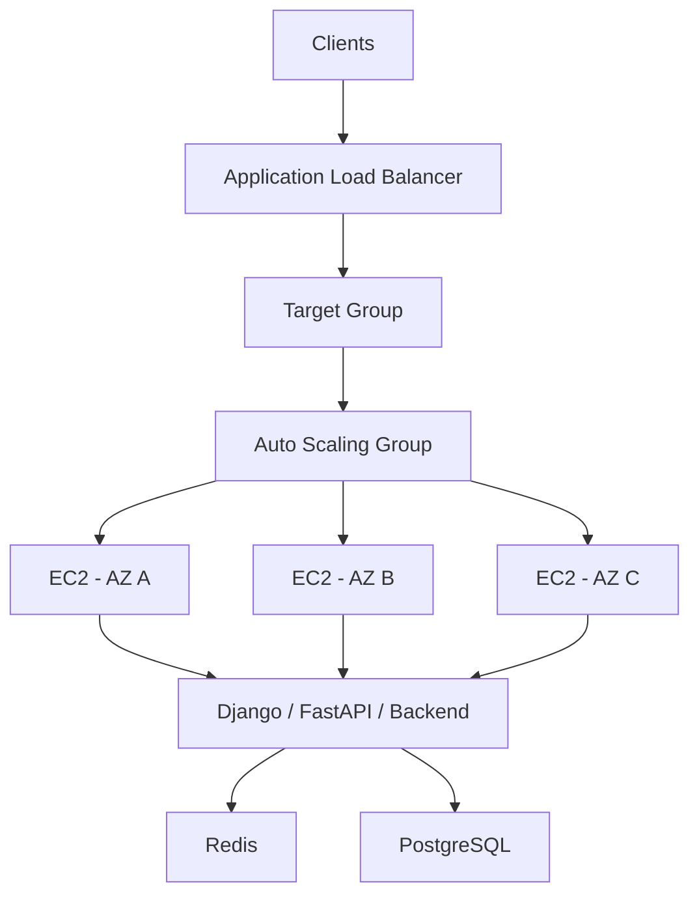
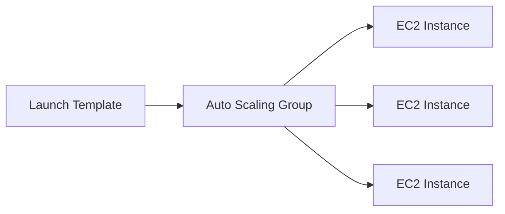
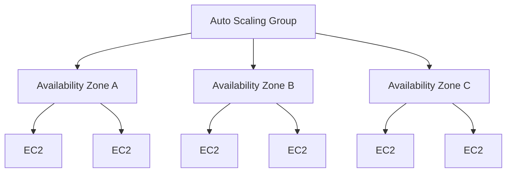
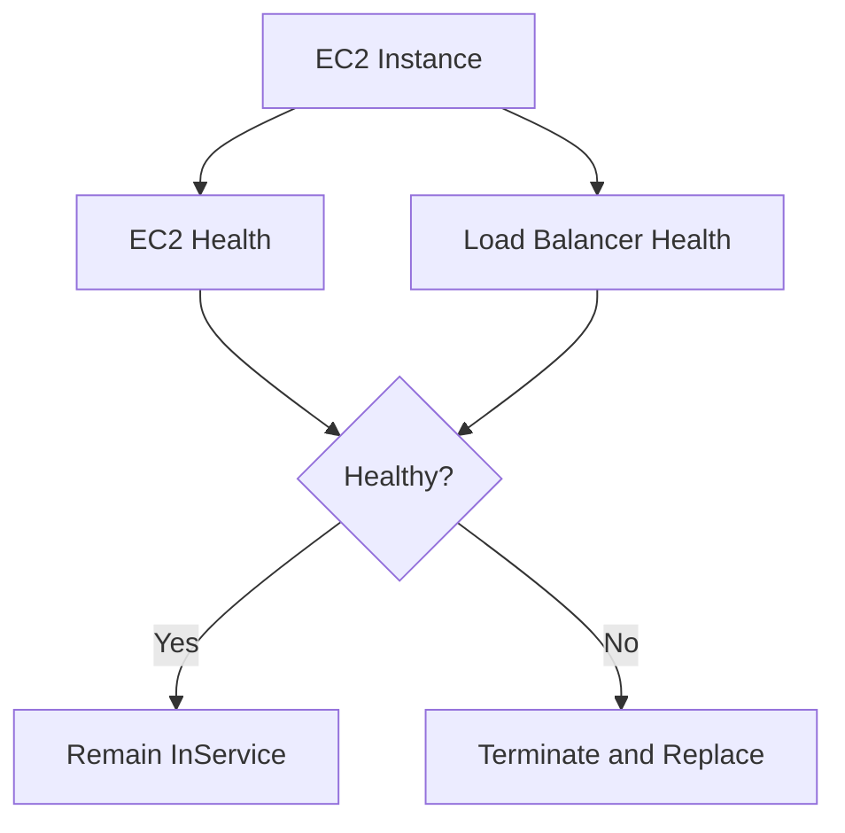
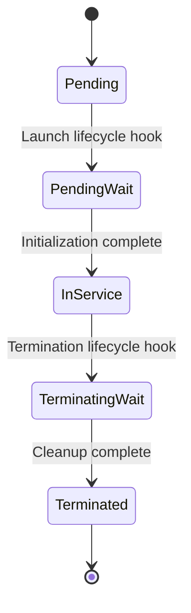
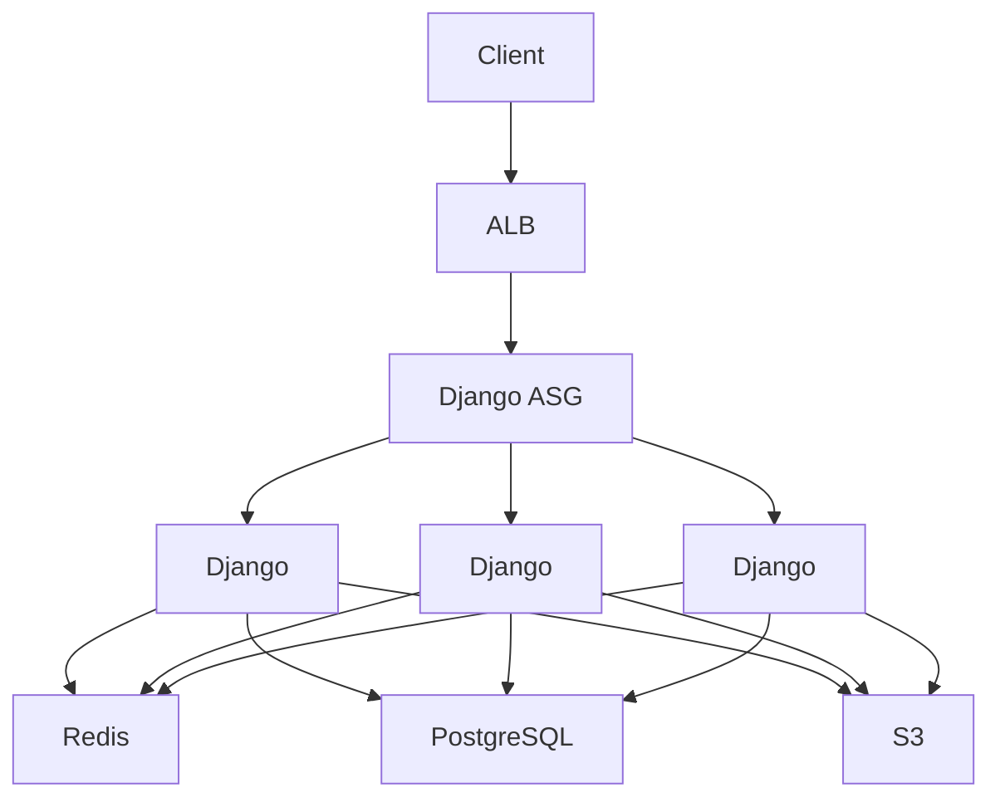
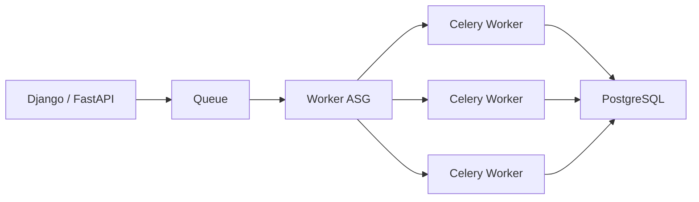

# 01- Auto Scaling Groups

## Overview

An Amazon EC2 Auto Scaling Group (ASG) is a logical group of EC2 instances that AWS manages as a single capacity unit.

An ASG maintains a configured capacity range:

```text
Minimum capacity
        |
        v
Desired capacity
        |
        v
Maximum capacity
```

For example:

```text
Min     = 2
Desired = 4
Max     = 10
```

The group attempts to maintain the desired capacity and can dynamically change that capacity when scaling policies or scheduled actions require it. It also replaces instances that become unhealthy so that the group can maintain the required capacity. :contentReference[oaicite:0]{index=0}

A production EC2 architecture commonly looks like:



The ASG is therefore not simply a mechanism for launching more EC2 instances. It is a control plane for:

- Capacity management
- Instance replacement
- Horizontal scaling
- Availability
- Rolling infrastructure changes
- Instance lifecycle
- Integration with load balancers
- Integration with CloudWatch and scaling policies

---

## Why Auto Scaling Groups Exist

Launching EC2 instances manually creates operational problems:

```text
Traffic increases
      |
      v
Engineer notices
      |
      v
Engineer launches EC2
      |
      v
Configure application
      |
      v
Register target
```

This is slow and error-prone.

An ASG automates the capacity-management loop:

```text
Demand increases
      |
      v
Scaling policy
      |
      v
Desired capacity increases
      |
      v
ASG launches instances
      |
      v
Instances become healthy
      |
      v
Instances receive traffic
```

When demand falls:

```text
Demand decreases
      |
      v
Scaling policy
      |
      v
Desired capacity decreases
      |
      v
ASG selects instances for termination
```

This allows the infrastructure to respond to changing workload requirements without manually managing individual instances.

---

## Core ASG Capacity Model

An ASG has three primary capacity values:

| Setting | Meaning |
|---|---|
| Minimum capacity | Lowest number of instances the group should maintain |
| Desired capacity | Current target capacity |
| Maximum capacity | Highest number of instances the group can normally scale to |

Example:

```text
Min     = 2
Desired = 4
Max     = 8
```

The normal operating range is:

```text
2 <= Desired Capacity <= 8
```

If a scaling policy determines that more capacity is required:

```text
Desired: 4 -> 6
```

the ASG launches instances until the group reaches the new desired capacity.

---

## Desired Capacity vs Actual Capacity

Desired capacity is not necessarily the same as the number of currently healthy instances.

For example:

```text
Desired capacity = 4

Instance state:

EC2-1 -> Healthy
EC2-2 -> Healthy
EC2-3 -> Launching
EC2-4 -> Healthy
```

During a scaling or replacement operation, the actual number of ready instances can temporarily differ from the desired state.

This distinction is important when troubleshooting scaling behavior.

---

## Launch Templates

An ASG needs a repeatable definition for how instances should be launched.

Modern ASGs use **Launch Templates**.

A launch template can define configuration such as:

- AMI
- Instance type
- Key pair
- Security groups
- Block device mappings
- Network configuration
- IAM instance profile
- User data
- Monitoring settings
- Instance metadata options

AWS documents launch templates as the configuration template used to launch EC2 instances for an ASG. :contentReference[oaicite:1]{index=1}

Conceptually:



The important architectural principle is:

> Every instance launched by the ASG should be reproducible from infrastructure configuration rather than manual server changes.

---

## Launch Template Versions

Launch templates support versions.

For example:

```text
Launch Template
 |
 +-- Version 1
 |     AMI = ami-old
 |
 +-- Version 2
 |     AMI = ami-new
```

An ASG can reference a specific launch-template version.

This is important for controlled deployments.

A typical production workflow is:

```text
Build AMI
   |
   v
Create Launch Template Version
   |
   v
Test configuration
   |
   v
Update ASG configuration
   |
   v
Instance Refresh
```

Avoid manually modifying individual instances and expecting future instances to inherit those changes.

---

## Immutable Infrastructure

ASGs work particularly well with immutable infrastructure.

Instead of:

```text
EC2
 |
 +-- SSH
 +-- Modify application
 +-- Install package
 +-- Restart service
```

prefer:

```text
New AMI
   |
   v
New Launch Template Version
   |
   v
Instance Refresh
   |
   +-- New EC2
   +-- New EC2
   +-- New EC2
```

This provides predictable, repeatable infrastructure.

For a Django or FastAPI service, application dependencies should ideally be baked into an AMI or installed deterministically during instance initialization.

---

## Multi-AZ Deployment

A production ASG should normally span multiple Availability Zones.

Example:



If one Availability Zone becomes unavailable, capacity can remain available in other zones.

However, multi-AZ configuration alone does not guarantee application availability. The application, database, cache, networking, and deployment architecture must also tolerate AZ failures.

---

## ASG with Load Balancer

The standard web architecture is:

```text
Internet
    |
    v
ALB
    |
    v
Target Group
    |
    v
Auto Scaling Group
    |
    +-- EC2
    +-- EC2
    +-- EC2
```

The ASG manages capacity while the load balancer manages traffic distribution.

This separation is important:

| Component | Responsibility |
|---|---|
| ALB/NLB | Traffic distribution |
| Target Group | Backend target membership and health |
| ASG | Instance capacity and replacement |
| Launch Template | Instance configuration |
| CloudWatch | Metrics and alarms |
| Scaling Policy | Determines capacity changes |

---

## Instance Health

ASGs continuously monitor the health of their instances.

AWS Auto Scaling can receive health information from sources including:

- EC2
- Elastic Load Balancing
- VPC Lattice
- Amazon EBS
- Custom health checks

When an instance is determined to be unhealthy, the ASG can terminate and replace it to maintain the desired capacity. :contentReference[oaicite:2]{index=2}

A simplified flow is:



---

## EC2 Health Checks vs ELB Health Checks

EC2 health checks answer questions about the underlying instance.

For example:

```text
Is the instance reachable?
Is the underlying infrastructure healthy?
```

Load-balancer health checks can determine whether the application is actually able to serve requests.

For example:

```http
GET /health
```

This distinction matters.

An instance can be:

```text
EC2 = healthy
Application = broken
```

If the ASG only relies on EC2 health, it may continue running the broken instance.

For production web applications, integrating the ASG with load-balancer health checks is often important.

---

## Health Check Grace Period

New instances may need time to initialize.

A typical startup sequence might be:

```text
EC2 launched
   |
   v
Operating system boot
   |
   v
User data
   |
   v
Docker / application startup
   |
   v
Django / FastAPI ready
   |
   v
Health check succeeds
   |
   v
Receive production traffic
```

The health check grace period gives the application time to initialize before unhealthy-instance decisions are made.

AWS exposes health check grace period as an ASG configuration option. :contentReference[oaicite:3]{index=3}

Do not use an unnecessarily large value. A long grace period can delay detection of genuinely broken instances.

---

## Default Instance Warmup

Instance warmup is different from simply waiting for an application to start.

Warmup tells Auto Scaling how long a newly launched instance should be treated as still initializing for scaling calculations.

This matters because new instances may not immediately contribute their full capacity.

For example:

```text
Scale out
   |
   v
New EC2
   |
   +-- Boot
   +-- Application startup
   +-- Cache initialization
   +-- Connection pools
   |
   v
Warmup complete
   |
   v
Normal scaling evaluation
```

AWS recommends configuring an appropriate default instance warmup for groups using dynamic scaling because it affects how newly launched instances contribute to scaling metrics. :contentReference[oaicite:4]{index=4}

---

## Scaling Policies

Scaling policies determine when and how desired capacity changes.

Common approaches include:

- Target tracking scaling
- Step scaling
- Scheduled scaling
- Predictive scaling

The choice should depend on workload characteristics.

---

## Target Tracking Scaling

Target tracking attempts to maintain a target value for a metric.

For example:

```text
Target CPU utilization = 50%
```

Conceptually:

```text
CPU > 50%
    |
    v
Scale out

CPU < 50%
    |
    v
Scale in
```

For request-driven applications, a better metric may be something such as:

```text
Requests per target
```

rather than CPU alone.

Target tracking is often a strong default for services with a reasonably stable relationship between capacity and workload.

---

## CPU-Based Scaling

A common configuration is:

```text
Target CPU = 50%
```

This works when CPU utilization correlates well with application load.

For example:

```text
API request
    |
    v
Python application
    |
    v
CPU-intensive processing
```

CPU can be a useful scaling signal.

However, CPU may be a poor metric for I/O-bound applications.

A service can have:

```text
CPU = 25%
Database latency = very high
Request latency = very high
```

In this case, scaling based only on CPU may not solve the bottleneck.

---

## Request-Based Scaling

For an ALB-backed service, a metric such as request count per target can better represent application demand.

Conceptually:

```text
Requests / Healthy Target
          |
          v
Target Tracking Policy
          |
          v
Desired Capacity
```

This can be useful for:

- REST APIs
- Django
- FastAPI
- Web applications

The appropriate metric should be selected based on the actual bottleneck.

---

## Queue-Based Scaling

Worker systems often scale based on queue depth rather than HTTP traffic.

For example:

```text
Producer
   |
   v
SQS
   |
   v
Celery / Worker ASG
   |
   +-- Worker
   +-- Worker
   +-- Worker
```

A custom metric could represent:

```text
Messages per worker
```

or another measure of backlog.

This is often more meaningful than CPU utilization for asynchronous workloads.

---

## Step Scaling

Step scaling changes capacity by different amounts depending on how far a metric moves beyond a threshold.

Example:

```text
CPU < 60%
    -> no action

CPU 60-75%
    -> +1 instance

CPU 75-90%
    -> +2 instances

CPU > 90%
    -> +4 instances
```

Step scaling can be useful when large workload spikes require more aggressive capacity changes.

AWS supports multiple dynamic scaling policies, but combining policies should be done carefully because different policies can interact. AWS documents that when multiple policies are active, Auto Scaling uses behavior designed to avoid removing too much capacity and to provide sufficient capacity during scale-out. :contentReference[oaicite:5]{index=5}

---

## Scheduled Scaling

Scheduled scaling changes capacity according to known workload patterns.

For example:

```text
08:00 -> desired = 10
18:00 -> desired = 4
```

This is useful for predictable traffic patterns such as:

- Business applications
- Batch systems
- Office-hour workloads
- Known marketing events
- Scheduled processing

Scheduled scaling can be combined with dynamic scaling.

---

## Predictive Scaling

Predictive scaling uses historical workload patterns to forecast future capacity requirements.

It is useful when:

- Traffic has recurring patterns
- Historical metrics are meaningful
- Workload changes are predictable

It should not be treated as a replacement for reactive scaling.

A production architecture can combine predictive capacity planning with dynamic policies for unexpected changes.

---

## Scaling Policies Comparison

| Policy | Primary Use | Strength | Limitation |
|---|---|---|---|
| Target tracking | Maintain a target metric | Simple and adaptive | Depends on a meaningful metric |
| Step scaling | Different response sizes | Good for sharp changes | More configuration |
| Scheduled scaling | Predictable demand | Proactive | Poor for unexpected demand |
| Predictive scaling | Forecastable patterns | Can prepare capacity early | Requires useful historical patterns |

---

## Scaling In

Scaling in removes capacity when demand decreases.

For example:

```text
Current desired = 8
        |
        v
Demand decreases
        |
        v
Policy recommends 5
        |
        v
ASG selects instances
        |
        v
5 instances remain
```

Scale-in is more dangerous than scale-out because removing the wrong instance can terminate active work.

This is why application architecture and termination policies matter.

---

## Termination Policies

When scaling in, the ASG needs to select instances for termination.

Termination policies influence that selection.

Production considerations include:

- Instance age
- Availability Zone balance
- Launch template differences
- Spot vs On-Demand behavior
- Instances protected from scale-in

The exact termination behavior should be understood before relying on instance-local state.

---

## Scale-In Protection

Scale-in protection can prevent selected instances from being terminated during scale-in.

This can be useful for specialized workloads such as:

- Long-running jobs
- Stateful processing
- Tasks that need explicit completion
- Temporary migration workflows

However, scale-in protection should not become a permanent substitute for proper workload design.

For example:

```text
Celery Worker
    |
    +-- Long-running task
          |
          +-- Protected temporarily
```

A better long-term design is usually to make work resumable or externally tracked.

---

## Lifecycle Hooks

Lifecycle hooks allow custom actions during instance launch or termination.

For example:



Lifecycle hooks are useful for tasks such as:

- Bootstrap operations
- Configuration
- Log collection
- Cleanup
- Draining workloads
- Persisting state
- Integration with event-driven workflows

AWS documents lifecycle hooks for custom actions during launch and termination and provides a default wait period for completing those actions. :contentReference[oaicite:6]{index=6}

---

## Instance Launch Lifecycle

A simplified launch lifecycle is:

```text
Scale-out decision
       |
       v
Launch EC2
       |
       v
Pending
       |
       v
User data / bootstrap
       |
       v
Application initialization
       |
       v
Health checks
       |
       v
InService
       |
       v
Receive traffic
```

If a launch lifecycle hook is configured, the instance can pause during the lifecycle before proceeding.

This is useful when initialization requires external actions.

---

## Instance Termination Lifecycle

A simplified termination flow is:

```text
Scale-in decision
       |
       v
Select instance
       |
       v
Deregister / drain
       |
       v
Termination lifecycle hook
       |
       v
Cleanup
       |
       v
Terminate EC2
```

For applications behind an ALB, graceful deregistration is important to reduce dropped requests.

---

## Instance Refresh

Instance Refresh provides a controlled mechanism for replacing existing instances with instances based on a new desired configuration.

Typical use cases include:

- New AMI
- Security patch
- New application version
- New launch template version
- Instance type changes

AWS supports minimum and maximum healthy percentages, checkpoints, bake time, skip matching, and rollback options for instance refresh. :contentReference[oaicite:7]{index=7}

A typical deployment is:


---

## Instance Refresh and Zero-Downtime Deployment

For a web service with:

```text
Desired capacity = 6
```

you may configure the refresh so that enough healthy instances remain available while replacements occur.

Conceptually:

```text
6 healthy instances

Replace:
    1 -> 5 old + 1 new
    2 -> 4 old + 2 new
    3 -> 3 old + 3 new
    ...
    6 -> 0 old + 6 new
```

The exact replacement behavior depends on the configured maintenance policy and refresh settings.

AWS documents that a minimum healthy percentage of 100% causes new instances to be launched before old instances are terminated, preserving desired capacity during replacement. :contentReference[oaicite:8]{index=8}

---

## Instance Refresh Checkpoints

Checkpoints allow an instance refresh to pause after a specified amount of replacement.

For example:

```text
Replace 10%
    |
    v
Pause
    |
    +-- Validate metrics
    +-- Validate logs
    +-- Validate application
    |
    v
Continue
```

This is useful for production deployments where a canary-like rollout is preferred.

---

## Instance Refresh Bake Time

Bake time allows the new fleet to run for a period before the refresh is considered complete.

This gives time to observe:

- Error rates
- Latency
- CPU
- Memory
- Application logs
- Dependency failures
- Target health

It is especially useful when application startup succeeds but runtime behavior may still fail.

---

## Warm Pools

For applications with expensive startup times, warm pools can maintain pre-initialized instances that can be brought into service more quickly.

For example:

```text
ASG
 |
 +-- InService
 |     +-- EC2
 |     +-- EC2
 |
 +-- Warm Pool
       +-- Initialized EC2
       +-- Initialized EC2
```

Warm pools can reduce scale-out latency for applications with expensive initialization.

They should be evaluated based on startup time and cost rather than enabled automatically.

---

## Mixed Instance Types

An ASG can use multiple instance types through a mixed instances policy.

For example:

```text
ASG
 |
 +-- m7i.large
 +-- m7i.xlarge
 +-- m6i.large
```

This can improve:

- Capacity availability
- Cost efficiency
- Flexibility during capacity shortages

Mixed instances are especially useful when workloads can run across several compatible instance types.

The application should not depend on a single instance size unless the ASG is explicitly designed that way.

---

## On-Demand and Spot Capacity

ASGs can combine purchase options.

For example:

```text
ASG
 |
 +-- On-Demand
 |
 +-- Spot
```

Spot capacity can reduce cost but can be interrupted.

This is appropriate for workloads that tolerate interruption, such as:

- Stateless workers
- Batch processing
- CI workloads
- Fault-tolerant background jobs

Critical request-serving capacity should be designed with appropriate On-Demand or other capacity guarantees.

---

## Capacity Rebalancing

For Spot-heavy workloads, Capacity Rebalancing can help the ASG proactively replace Spot Instances that are at elevated interruption risk.

Conceptually:

```text
Spot interruption risk
        |
        v
Replacement capacity
        |
        v
New instance healthy
        |
        v
Old instance removed
```

This reduces the probability of losing useful capacity abruptly.

---

## Application Startup

An ASG assumes that newly launched instances can become production-ready through a repeatable startup process.

For a Python backend:

```text
EC2
 |
 +-- OS
 +-- Python runtime
 +-- Dependencies
 +-- Environment configuration
 +-- Django / FastAPI
 +-- Uvicorn / Gunicorn
 +-- Health endpoint
```

The process should be deterministic.

Avoid relying on manual SSH configuration.

---

## User Data

User data can bootstrap an instance during launch.

For example:

```bash
#!/bin/bash
set -euo pipefail

systemctl enable my-backend
systemctl start my-backend
```

For more complex systems, user data can invoke a controlled bootstrap process rather than containing the entire application deployment logic.

For example:

```text
User Data
    |
    v
Bootstrap Script
    |
    +-- Configure instance
    +-- Fetch secrets/config
    +-- Start application
    +-- Register monitoring
```

Avoid putting long-lived secrets directly into user-data scripts or launch-template configuration.

---

## Secrets and Configuration

An ASG may create many instances automatically.

Therefore, configuration should be centrally managed.

Prefer:

```text
EC2
 |
 +-- IAM Role
       |
       +-- Secrets Manager
       +-- SSM Parameter Store
```

over:

```text
Launch Template
 |
 +-- Hard-coded database password
```

IAM instance profiles should provide the minimum permissions required by the application.

---

## ASG and Django

A scalable Django architecture might be:



Important requirements include:

- Shared session storage where needed
- Shared cache where needed
- External object storage
- Database connection management
- Stateless application processes
- Health checks
- Graceful deployment behavior

Do not store user-uploaded files only on local EC2 storage if instances are disposable.

---

## ASG and FastAPI

A FastAPI service can follow the same model:

```text
ALB
 |
 v
FastAPI ASG
 |
 +-- Instance
 +-- Instance
 +-- Instance
 |
 +-- Redis
 +-- PostgreSQL
```

Each instance should be independently capable of serving requests.

For example:

```text
GET /users/123
```

should not require that the request reaches the same EC2 instance as a previous request.

---

## ASG and Celery

Celery workers are another useful ASG workload.

A queue-driven architecture might be:



Scaling should ideally be based on workload indicators such as:

```text
Queue depth
Messages per worker
Task age
Processing latency
```

rather than only CPU.

---

## Database Connection Scaling

Adding EC2 instances can increase application database connections.

For example:

```text
2 API instances
    |
    +-- 20 DB connections each
    |
    v
40 DB connections

20 API instances
    |
    +-- 20 DB connections each
    |
    v
400 DB connections
```

This can overwhelm PostgreSQL even when EC2 capacity is healthy.

Therefore, ASG scaling must consider downstream capacity.

Potential solutions include:

- Connection pooling
- PgBouncer
- RDS Proxy where applicable
- Appropriate connection limits
- Query optimization
- Backpressure
- Independent scaling of workers and APIs

Horizontal scaling of the application does not mean unlimited scaling of the database.

---

## Scaling Bottleneck Analysis

Before choosing a scaling metric, identify the actual bottleneck.

| Bottleneck | Potential Scaling Signal |
|---|---|
| CPU-bound API | CPU utilization |
| HTTP request load | Requests per target |
| Queue processing | Queue depth / messages per worker |
| High latency | Request latency, depending on cause |
| Memory-bound service | Memory utilization |
| Database-bound service | DB connections, latency, throughput |
| Network-bound service | Network throughput |

Do not automatically choose CPU utilization because it is easy to measure.

---

## Scaling Stability

Poorly configured scaling can oscillate:

```text
Scale out
   |
   v
Capacity increases
   |
   v
Metric falls
   |
   v
Scale in
   |
   v
Metric rises
   |
   v
Scale out
```

This is commonly called scaling oscillation or thrashing.

Mitigation includes:

- Appropriate target values
- Correct warmup periods
- Cooldown behavior where relevant
- Stable scaling metrics
- Reasonable scale-in sensitivity
- Adequate minimum capacity
- Avoiding conflicting policies

---

## Minimum Capacity

Minimum capacity should represent the minimum safe operating fleet, not simply the cheapest possible configuration.

For example:

```text
Min = 1
```

creates a single-instance dependency.

A more resilient architecture might use:

```text
Min = 2
```

across multiple Availability Zones.

The correct value depends on:

- Availability requirements
- Traffic
- Instance startup time
- Workload criticality
- Cost constraints
- Failure tolerance

---

## Maximum Capacity

Maximum capacity protects against uncontrolled scaling.

For example:

```text
Min = 2
Desired = 4
Max = 20
```

If a scaling policy misbehaves, the group should not continue launching unlimited instances.

However, setting the maximum too low can prevent the application from handling legitimate traffic spikes.

The maximum should therefore be based on:

- Downstream capacity
- Expected traffic
- Cost boundaries
- Quotas
- Load testing
- Failure scenarios

---

## Scaling and Quotas

AWS service quotas can constrain scaling.

For example:

```text
ASG wants 100 instances
        |
        v
EC2 quota = 50
        |
        v
Cannot achieve desired capacity
```

Capacity planning should therefore include:

- EC2 quotas
- EBS quotas
- IP availability
- Instance capacity
- Load-balancer limits
- Database capacity
- Regional constraints

A scaling policy cannot overcome an infrastructure quota.

---

## Monitoring

Important ASG and EC2 signals include:

### Capacity

- Desired capacity
- Current capacity
- Minimum capacity
- Maximum capacity
- In-service instances
- Pending instances
- Terminating instances

### Health

- Healthy instances
- Unhealthy instances
- Target health
- EC2 status checks

### Scaling

- Scaling activities
- Policy actions
- Scale-out events
- Scale-in events
- Warmup duration

### Application

- Request rate
- Latency
- Error rate
- CPU
- Memory
- Network
- Database connections
- Queue depth

A useful dashboard should allow operators to correlate scaling decisions with application behavior.

---

## Scaling Activity Investigation

When an unexpected scale-out occurs, investigate in this order:

```text
Scale-out event
     |
     v
Which policy triggered?
     |
     v
Which metric breached?
     |
     v
What was the application doing?
     |
     v
Was the metric valid?
     |
     v
Did new instances become healthy?
     |
     v
Did downstream systems handle the additional load?
```

Do not immediately change the scaling policy without understanding the triggering metric.

---

## AWS CLI Examples

Describe an ASG:

```bash
aws autoscaling describe-auto-scaling-groups \
    --auto-scaling-group-names my-api-asg
```

Set desired capacity:

```bash
aws autoscaling set-desired-capacity \
    --auto-scaling-group-name my-api-asg \
    --desired-capacity 6
```

Update minimum and maximum capacity:

```bash
aws autoscaling update-auto-scaling-group \
    --auto-scaling-group-name my-api-asg \
    --min-size 2 \
    --max-size 10
```

List scaling activities:

```bash
aws autoscaling describe-scaling-activities \
    --auto-scaling-group-name my-api-asg
```

List instances in an ASG:

```bash
aws autoscaling describe-auto-scaling-instances
```

Start an instance refresh:

```bash
aws autoscaling start-instance-refresh \
    --auto-scaling-group-name my-api-asg
```

Check instance refresh status:

```bash
aws autoscaling describe-instance-refreshes \
    --auto-scaling-group-name my-api-asg
```

Use production commands carefully and verify the target AWS account, Region, ASG name, and desired capacity before making changes.

---

## Safe Operational Workflow

Before changing an ASG:

1. Confirm the AWS account and Region.
2. Inspect the current ASG configuration.
3. Check desired, minimum, and maximum capacity.
4. Check current healthy instances.
5. Check target-group health.
6. Inspect recent scaling activities.
7. Identify active scaling policies.
8. Verify downstream capacity.
9. Apply the smallest required change.
10. Monitor the resulting behavior.

This is particularly important for production scale-in operations.

---

## Security Considerations

An ASG itself does not secure the application.

Security should be implemented across the instance lifecycle.

### IAM

Use an instance profile with least-privilege permissions.

### Networking

Prefer:

```text
Internet
   |
   v
ALB
   |
   v
Private EC2
```

when the application does not require direct public exposure.

### Secrets

Use:

- AWS Secrets Manager
- Systems Manager Parameter Store
- IAM roles

rather than embedding credentials in launch templates or AMIs.

### Instance Metadata

Use appropriate EC2 Instance Metadata Service settings and prefer IMDSv2 for instance metadata access.

### Patching

Use automated image or patch management rather than manually patching individual instances and leaving the ASG inconsistent.

---

## Reliability Considerations

A reliable ASG should satisfy several properties:

```text
Reproducible
     +
Multi-AZ
     +
Health-aware
     +
Stateless where possible
     +
Observable
     +
Automatically replaceable
```

An ASG should be able to replace an instance without requiring an engineer to manually rebuild the application.

This is the central reliability advantage of treating EC2 instances as disposable infrastructure.

---

## Disaster Recovery

ASGs help with instance-level recovery but are not a complete disaster recovery solution.

An ASG can replace:

```text
Failed EC2
```

but it cannot automatically recover:

```text
Deleted database
Corrupted data
Incorrect application deployment
Regional failure
Lost external state
```

A complete DR architecture requires appropriate:

- AMI strategy
- Infrastructure as Code
- Database backups
- EBS snapshots where applicable
- S3 durability
- Multi-AZ services
- Cross-Region recovery where justified
- Tested restoration procedures

---

## Cost Optimization

ASGs can reduce cost by matching capacity to demand.

Example:

```text
Night
  -> 2 instances

Business hours
  -> 8 instances

Peak period
  -> 15 instances
```

Additional optimization strategies include:

- Right-sizing instances
- Mixed instance types
- Spot capacity for interruption-tolerant workloads
- Scheduled scaling
- Predictive scaling
- Removing idle capacity
- Monitoring scaling efficiency

Do not optimize purely for instance count. An undersized fleet can increase application latency and downstream costs.

---

## Production Best Practices

### Use Launch Templates

Prefer launch templates for reproducible instance configuration.

### Use Multiple Availability Zones

Distribute capacity across multiple AZs.

### Keep Instances Disposable

Avoid manual configuration that exists only on individual instances.

### Externalize State

Use shared systems for:

- Sessions
- Cache
- Files
- Durable application state

### Use Meaningful Scaling Metrics

Scale based on the resource or workload that actually limits throughput.

### Configure Warmup Correctly

Give new instances enough time to initialize without delaying recovery unnecessarily.

### Use Instance Refresh

Use controlled instance replacement for AMI and launch-template changes.

### Monitor Per-Target Behavior

Aggregate metrics can hide overloaded or unhealthy instances.

### Protect Downstream Systems

Ensure scaling limits account for database, cache, queue, and network capacity.

### Test Failure Scenarios

Test:

- Instance termination
- Scale-out
- Scale-in
- AZ failure
- Health-check failure
- Deployment rollback
- Instance refresh
- Dependency failure

---

## Common Mistakes

### Treating Desired Capacity as Guaranteed Healthy Capacity

Desired capacity represents the target number of instances, not a guarantee that every instance is immediately ready to serve traffic.

### Using CPU as the Only Scaling Metric

CPU may not represent workload pressure for I/O-bound or database-bound services.

### Setting Maximum Capacity Too Low

An artificially low maximum can prevent the service from responding to legitimate traffic spikes.

### Setting Minimum Capacity to One

A single-instance minimum creates a single point of failure.

### Ignoring Downstream Capacity

Scaling from 5 to 50 API instances can multiply database connections and Redis traffic.

### Manually Modifying ASG Instances

Changes made directly to one instance disappear when that instance is replaced.

### Skipping Instance Refresh

Changing the launch template does not mean existing instances are automatically rebuilt.

Use instance refresh or another controlled replacement strategy.

### Using Excessive Health-Check Grace Periods

An overly long grace period can delay detection of broken instances.

### Relying on Local EC2 Storage for Durable Data

Instances may be terminated or replaced at any time.

Use appropriate durable storage.

### Conflicting Scaling Policies

Multiple policies can interact in unexpected ways.

Keep scaling logic understandable and validate behavior with load testing.

---

## Interview Considerations

### What is an Auto Scaling Group?

An ASG is a logical group of EC2 instances that maintains capacity and provides automatic scaling and instance replacement.

### What are minimum, desired, and maximum capacity?

```text
Min     -> Lowest intended capacity
Desired -> Current target capacity
Max     -> Highest intended capacity
```

### What happens when an ASG instance becomes unhealthy?

The ASG can terminate the unhealthy instance and launch a replacement to maintain desired capacity.

### What is a Launch Template?

A launch template is a reusable EC2 configuration definition used by services such as Auto Scaling to launch instances consistently.

### Why use an ASG with an ALB?

The ALB distributes traffic while the ASG manages the number and health of backend instances.

### What is target tracking?

Target tracking dynamically adjusts capacity to maintain a selected metric around a target value.

### Why is warmup important?

New instances may need time to initialize before they contribute their full capacity. Warmup prevents scaling calculations from treating partially initialized instances as fully available too early.

### What is Instance Refresh?

Instance Refresh is a controlled mechanism for replacing existing ASG instances using a new desired configuration such as a new AMI or launch-template version.

### Why should backend instances be stateless?

Stateless instances can be freely replaced, scaled, and distributed across Availability Zones without losing important application state.

### How would you scale Celery workers?

Prefer workload-specific metrics such as queue depth, messages per worker, or task age rather than relying exclusively on CPU utilization.

### What is the difference between Auto Scaling and load balancing?

```text
Load Balancer
    -> Distributes traffic

Auto Scaling Group
    -> Manages backend capacity
```

They solve different problems and are commonly used together.

### Can an ASG provide disaster recovery?

It provides automated instance replacement and capacity management, but it is not a complete disaster recovery system. Data, databases, configuration, and regional recovery require additional mechanisms.

## Key Takeaways

- **An Auto Scaling Group manages EC2 capacity, health, replacement, and scaling; it should be treated as a control plane for a fleet rather than as a collection of individually managed servers.**
- **Launch Templates, multi-AZ placement, health checks, warmup, and instance refresh provide the foundation for reproducible and replaceable EC2 infrastructure.**
- **Choose scaling metrics based on the actual workload bottleneck—CPU, requests, queue depth, latency, memory, or another meaningful signal—not simply on convenience.**
- **Production ASGs should keep application instances disposable and externalize important state to durable or shared systems such as PostgreSQL, Redis, and S3.**
- **Reliable Auto Scaling requires coordinated design across load balancing, downstream capacity, deployments, observability, security, and failure recovery—not scaling policies alone.**