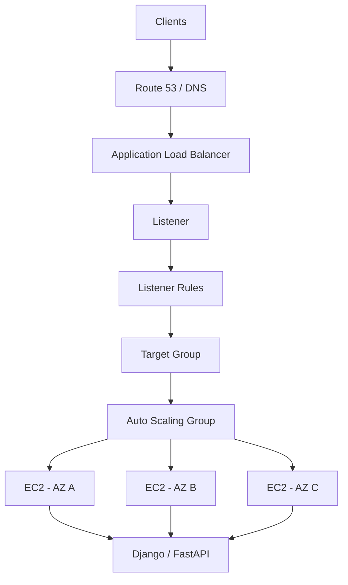
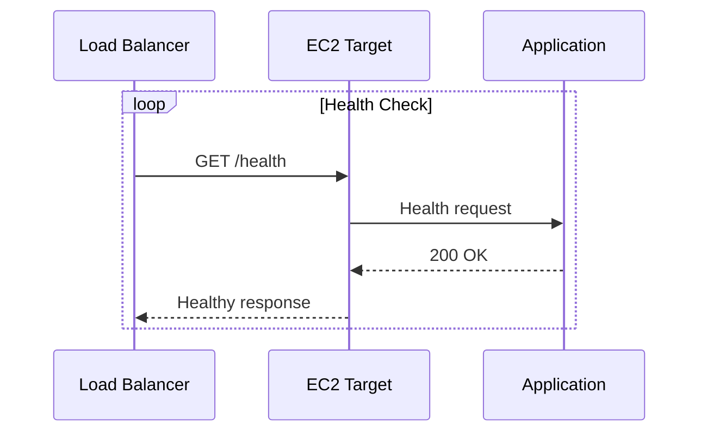
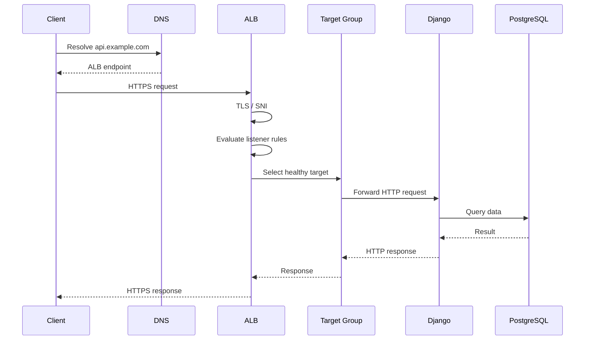
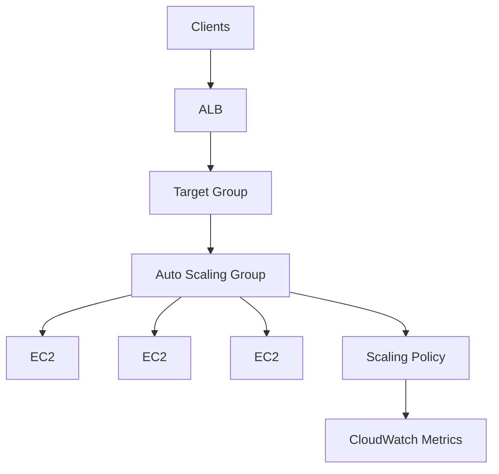
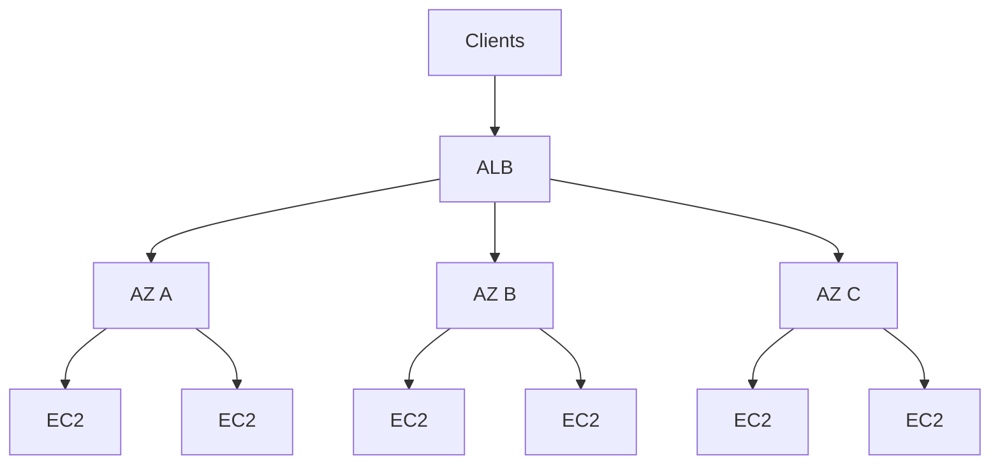
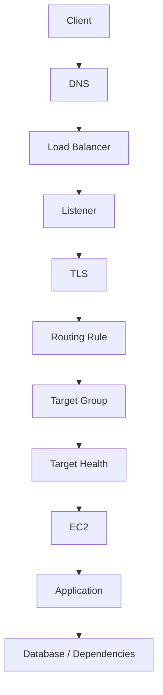
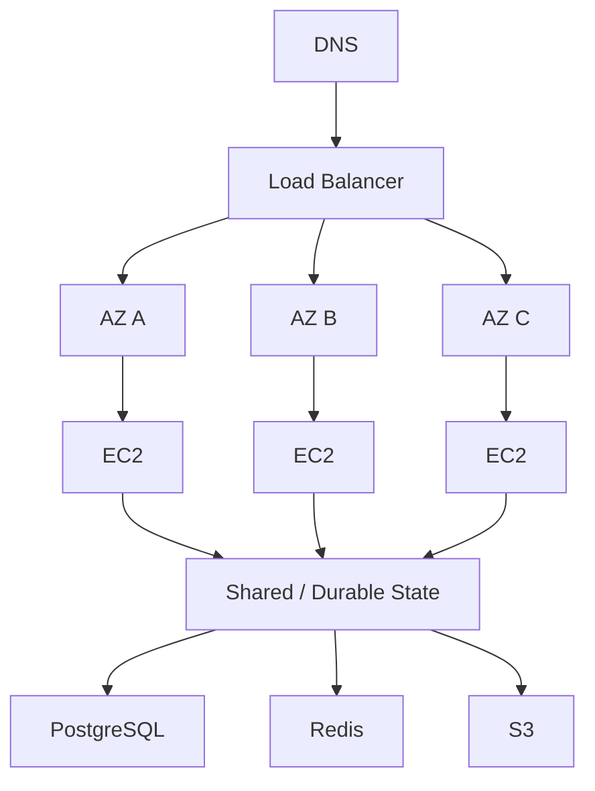

# 02- Load Balancing

## Overview

Load balancing distributes application traffic across multiple backend instances or targets.

In an EC2-based architecture, load balancing is commonly combined with Auto Scaling:

```text
                    +--> EC2-1
                    |
Client --> ALB --> Target Group
                    |
                    +--> EC2-2
                    |
                    +--> EC2-3
```

The load balancer provides the traffic-distribution layer while the Auto Scaling Group manages backend capacity.

A production architecture typically separates these responsibilities:



Load balancing is not only about distributing requests. Production design also requires consideration of:

- Listener configuration
- Target groups
- Health checks
- TLS termination
- Certificates
- SNI
- Host and path routing
- Connection behavior
- Session affinity
- Availability Zones
- Auto Scaling
- Security groups
- Monitoring
- Deployment behavior
- Failure recovery

---

## Why Load Balancing Is Required

A single EC2 instance creates a direct dependency:

```text
Client
  |
  v
EC2
```

If that instance fails:

```text
EC2
 |
 +-- Failure
 |
 +-- Application unavailable
```

Adding multiple instances without a load balancer still requires clients to know where to send traffic.

```text
Client
 |
 +----> EC2-1
 |
 +----> EC2-2
 |
 +----> EC2-3
```

A load balancer provides a stable entry point:

```text
Client
   |
   v
Load Balancer
   |
   +----> EC2-1
   +----> EC2-2
   +----> EC2-3
```

The backend fleet can therefore change without requiring clients to track individual instances.

---

## Load Balancer vs Auto Scaling

These components solve different problems.

| Component | Primary Responsibility |
|---|---|
| Load Balancer | Distribute traffic |
| Target Group | Define and monitor backend targets |
| Auto Scaling Group | Maintain and change backend capacity |
| Launch Template | Define how EC2 instances are created |
| CloudWatch | Provide metrics and alarms |
| Scaling Policy | Decide when capacity should change |

For example:

```text
Traffic increases
      |
      v
ALB distributes traffic
      |
      v
CloudWatch metric increases
      |
      v
Scaling policy triggers
      |
      v
ASG launches EC2
      |
      v
Target becomes healthy
      |
      v
ALB sends traffic to new target
```

The load balancer does not normally decide how many EC2 instances should exist.

---

## AWS Elastic Load Balancing

AWS Elastic Load Balancing provides managed load-balancing services for different traffic patterns.

The main load balancer types are:

| Type | Layer | Typical Use |
|---|---|---|
| ALB | Layer 7 | HTTP/HTTPS applications and APIs |
| NLB | Layer 4 | TCP, TLS, UDP, and high-performance network workloads |
| GWLB | Layer 3/4 integration | Network security and virtual appliances |
| CLB | Legacy | Older architectures |

For modern EC2-backed backend applications, ALB and NLB are the most commonly relevant choices.

---

## Application Load Balancer

Application Load Balancer operates at the application layer and understands HTTP/HTTPS traffic.

It supports capabilities such as:

- Host-based routing
- Path-based routing
- HTTP methods
- HTTP headers
- Query-string-based routing
- HTTPS termination
- WebSockets
- HTTP/2
- gRPC support
- Target health checks
- Authentication integrations

A typical API architecture is:

```text
Client
  |
  | HTTPS
  v
ALB :443
  |
  v
Target Group
  |
  +----> FastAPI
  +----> FastAPI
  +----> FastAPI
```

---

## Network Load Balancer

Network Load Balancer operates at the transport/networking level and is appropriate for workloads that require lower-level connection handling.

Typical workloads include:

- TCP
- TLS
- UDP
- Static IP requirements
- High-throughput network services
- Long-lived connections

Conceptually:

```text
Client
  |
  v
NLB
  |
  +----> EC2
  +----> EC2
  +----> EC2
```

NLB does not provide the same HTTP-aware routing model as ALB.

---

## Choosing ALB vs NLB

| Requirement | ALB | NLB |
|---|---:|---:|
| HTTP/HTTPS API | Yes | Possible, but different model |
| Host-based routing | Yes | No ALB-style routing |
| Path-based routing | Yes | No |
| HTTP headers | Yes | No |
| TLS listener | Yes | Yes |
| TCP workloads | No | Yes |
| UDP workloads | No | Yes |
| Static IP requirements | Not the primary use case | Yes |
| Application-aware routing | Yes | No |
| gRPC | Yes | Possible depending on architecture |
| WebSockets | Yes | Possible at connection level |

The correct choice depends on protocol requirements and traffic behavior rather than simply on expected traffic volume.

---

## Core Load Balancing Components

A typical ALB architecture contains:

```text
ALB
 |
 +-- Listener
 |     |
 |     +-- Protocol
 |     +-- Port
 |     +-- TLS configuration
 |     +-- Rules
 |
 +-- Target Group
       |
       +-- Targets
       +-- Health checks
       +-- Target configuration
```

Understanding these components is essential for troubleshooting.

---

## Listeners

A listener accepts incoming connections on a specific protocol and port.

Examples:

```text
HTTP  :80
HTTPS :443
```

A typical HTTPS listener looks like:

```text
Client
  |
  v
ALB :443
  |
  +-- TLS negotiation
  +-- Certificate
  +-- SNI
  |
  v
Listener Rules
```

The listener then evaluates the request and determines the appropriate action.

---

## Listener Rules

ALB listener rules can route requests based on conditions such as:

- Hostname
- Path
- HTTP headers
- Query strings
- Source IP
- HTTP method

For example:

```text
api.example.com/*
        |
        v
API Target Group

admin.example.com/*
        |
        v
Admin Target Group
```

Path-based routing can similarly be used:

```text
/example/api/*
        |
        v
API Target Group

/example/admin/*
        |
        v
Admin Target Group
```

Rules should remain understandable and maintainable. Excessive routing logic can make production troubleshooting difficult.

---

## Target Groups

A target group represents a collection of backend targets.

For an EC2 application:

```text
ALB
 |
 v
Target Group
 |
 +-- EC2-1
 +-- EC2-2
 +-- EC2-3
```

A target group also defines important behavior such as:

- Target type
- Protocol
- Port
- Health checks
- Deregistration behavior

The ASG can automatically register new instances with the target group when configured appropriately.

---

## Target Types

ALB and other ELB services can work with different target types depending on the load balancer and architecture.

Common ALB target types include:

- Instance
- IP
- Lambda

For an EC2-based architecture:

```text
Target Group
 |
 +-- EC2 instances
```

For containerized applications:

```text
Target Group
 |
 +-- Private IP addresses
```

The target type should match the deployment architecture.

---

## Health Checks

Health checks determine whether a target should receive traffic.

For an HTTP application:

```text
GET /health
```

could return:

```http
HTTP/1.1 200 OK
Content-Type: application/json

{"status":"ok"}
```

The load balancer periodically evaluates the configured health endpoint.

Conceptually:



Unhealthy targets should be removed from normal traffic distribution.

---

## Designing Health Endpoints

A health endpoint should be lightweight and deterministic.

Good:

```text
GET /health
    |
    +-- Process is running
    +-- Application initialized
    +-- Return 200
```

Potentially dangerous:

```text
GET /health
    |
    +-- Query PostgreSQL
    +-- Query Redis
    +-- Call external API
    +-- Execute expensive operation
```

The appropriate design depends on what "healthy" means for the application.

For more complex systems, separate:

```text
Liveness
    -> Is the process alive?

Readiness
    -> Should this instance receive traffic?
```

This distinction becomes particularly useful during deployments and dependency failures.

---

## Request Flow

For an HTTPS Django API:



This layered model is useful when diagnosing latency or errors.

---

## TLS Termination

A common architecture terminates TLS at the ALB:

```text
Client
  |
  | HTTPS
  v
ALB
  |
  +-- TLS termination
  |
  | HTTP
  v
EC2
```

Advantages include:

- Centralized certificate management
- Reduced TLS configuration on individual instances
- Easier certificate rotation
- Centralized TLS policy
- Simplified multi-domain HTTPS

The backend can also use HTTPS:

```text
Client
  |
  | HTTPS
  v
ALB
  |
  | HTTPS
  v
EC2
```

This provides encryption on both connections when required.

---

## SSL Certificates

Certificates establish the server identity for HTTPS.

A production AWS architecture commonly uses ACM:

```text
ACM Certificate
      |
      v
ALB HTTPS Listener
      |
      v
EC2 Application
```

Certificate management should cover:

- Domain validation
- Certificate renewal
- Certificate association
- Certificate rotation
- Expiration monitoring
- Multi-domain coverage

Certificate design becomes particularly important when one ALB serves multiple domains.

---

## SNI

Server Name Indication allows a client to provide the requested hostname during TLS negotiation.

For example:

```text
ClientHello
    |
    +-- SNI = api.example.com
```

The ALB can use the hostname to select an appropriate certificate.

This enables:

```text
ALB :443
 |
 +-- api.example.com
 +-- admin.example.com
 +-- partner.example.com
```

SNI solves certificate selection.

Host-based listener rules solve HTTP routing.

These are related but distinct mechanisms.

---

## Host-Based Routing

A common microservice architecture is:

```text
api.example.com
      |
      v
ALB
      |
      +--> API Target Group

admin.example.com
      |
      v
ALB
      |
      +--> Admin Target Group
```

This allows multiple applications to share a load balancer while maintaining separate backend fleets.

---

## Path-Based Routing

Path-based routing can expose multiple services under one hostname:

```text
example.com/users/*
        |
        v
User Service

example.com/orders/*
        |
        v
Order Service

example.com/payments/*
        |
        v
Payment Service
```

This can be useful for microservices but introduces routing complexity.

For larger systems, consider whether service-specific domains or an API gateway better represent ownership and security boundaries.

---

## Sticky Sessions

Sticky sessions provide session affinity between clients and backend targets.

Conceptually:

```text
Client
  |
  v
ALB
  |
  +----> EC2-2
```

Subsequent requests from the client may continue to reach EC2-2.

This can support legacy stateful applications.

For new Django and FastAPI systems, prefer stateless instances where practical:

```text
ALB
 |
 +-- API-1
 +-- API-2
 +-- API-3
      |
      +-- Redis
      +-- PostgreSQL
```

Shared state makes instances interchangeable and improves Auto Scaling and failure recovery.

---

## Connection Draining

When an instance is removed from service, existing traffic should be handled gracefully where possible.

Conceptually:

```text
Target
  |
  +-- Healthy
  |
  +-- Deregistering
  |
  +-- Existing connections drain
  |
  +-- Removed
```

This is important during:

- Deployments
- Auto Scaling
- Instance replacement
- Maintenance
- Manual target removal

Abrupt termination can produce:

- Failed requests
- Connection resets
- Partial operations
- User-visible errors

---

## Auto Scaling Integration

ALB and ASG are commonly deployed together.



A typical scale-out flow is:

```text
Traffic increases
      |
      v
CloudWatch metric increases
      |
      v
Scaling policy triggers
      |
      v
ASG launches instance
      |
      v
Instance initializes
      |
      v
Health check passes
      |
      v
Target receives traffic
```

---

## Multi-AZ Load Balancing

Production applications should normally distribute load-balancing and backend capacity across multiple Availability Zones.



This reduces dependency on a single Availability Zone.

The backend fleet should also maintain sufficient capacity in each zone to tolerate expected failures.

---

## Security Group Design

A common security model is:

```text
Internet
   |
   | HTTPS :443
   v
ALB Security Group
   |
   | Application port
   v
EC2 Security Group
```

For example:

```text
ALB SG
    Inbound:
        TCP 443 from approved clients

EC2 SG
    Inbound:
        TCP 8000 from ALB SG
```

The EC2 instances should not normally accept application traffic directly from the public internet when the ALB is the intended entry point.

Security groups should reference security groups where appropriate rather than using broad CIDR ranges unnecessarily.

---

## Backend Port Design

Suppose FastAPI listens on:

```text
0.0.0.0:8000
```

The architecture might be:

```text
Internet
   |
   v
ALB :443
   |
   v
EC2 :8000
```

The ALB target group should use the appropriate target port.

The application should listen on the expected interface and port:

```bash
uvicorn app.main:app \
    --host 0.0.0.0 \
    --port 8000
```

A common mistake is binding the application only to:

```text
127.0.0.1
```

which prevents the load balancer from reaching it through the instance network interface.

---

## Reverse Proxy Architecture

Nginx can also be used behind the load balancer:

```text
Client
   |
   v
ALB
   |
   v
EC2
   |
   v
Nginx
   |
   v
Gunicorn / Uvicorn
   |
   v
Django / FastAPI
```

This can be useful when Nginx provides:

- Local reverse proxying
- Static file handling
- Compression
- Request buffering
- Local TLS
- Application process routing

Avoid adding Nginx merely because a load balancer already exists. Each component should have a clear responsibility.

---

## WebSockets

ALB can support WebSocket connections.

The connection flow is:

```text
Client
  |
  | WebSocket Upgrade
  v
ALB
  |
  v
EC2
  |
  +-- Persistent connection
```

For multiple backend instances, shared event distribution may still be required.

For example:

```text
WebSocket-1 --> EC2-1
WebSocket-2 --> EC2-2

             |
             v
           Redis
```

Redis or another messaging system can distribute events between application instances.

---

## gRPC

ALB can also support gRPC workloads.

A simplified architecture is:

```text
gRPC Client
     |
     v
ALB
     |
     v
gRPC Target Group
     |
     +--> Service-1
     +--> Service-2
     +--> Service-3
```

gRPC requires attention to:

- HTTP/2
- Long-lived connections
- Health checks
- Connection lifetime
- Retry behavior
- Target distribution

Long-lived connections can affect how quickly new capacity receives traffic.

---

## Load Balancing and Long-Lived Connections

Traditional HTTP workloads often have relatively short-lived requests:

```text
Request
  |
  v
Target
  |
  v
Response
```

Long-lived connections behave differently:

```text
Client
  |
  |==============================|
  |        Connection            |
  |==============================|
  v
Target
```

Examples include:

- WebSockets
- gRPC
- Streaming APIs
- Long polling

Scaling decisions should account for existing connections rather than assuming traffic is uniformly distributed across requests.

---

## Stateless Architecture

A production backend should generally be designed so that any healthy instance can process a request.

```text
Client
  |
  v
ALB
  |
  +----> API-1
  +----> API-2
  +----> API-3
          |
          +----> Redis
          +----> PostgreSQL
          +----> S3
```

Avoid storing critical state only in:

- Process memory
- Local filesystem
- Instance-local cache
- Instance-local session storage

Instances managed by an ASG should be considered disposable.

---

## Django Load-Balancing Considerations

A typical Django architecture is:

```text
ALB
 |
 +-- Django-1
 +-- Django-2
 +-- Django-3
      |
      +-- Redis
      +-- PostgreSQL
      +-- S3
```

Important considerations include:

- `ALLOWED_HOSTS`
- CSRF trusted origins
- Secure cookies
- Forwarded HTTPS configuration
- Shared sessions
- Shared cache
- External object storage
- Database connection limits

Django should not assume that consecutive requests arrive at the same EC2 instance.

---

## FastAPI Load-Balancing Considerations

FastAPI should similarly remain independently executable on each target.

```text
ALB
 |
 +-- FastAPI-1
 +-- FastAPI-2
 +-- FastAPI-3
```

Shared state should be externalized when required:

```text
FastAPI
 |
 +-- Redis
 +-- PostgreSQL
 +-- S3
 +-- Kafka
```

This makes horizontal scaling straightforward.

---

## Database Bottlenecks

Scaling application instances can increase database pressure.

For example:

```text
3 API instances
    |
    +-- 20 DB connections each
    |
    v
60 DB connections
```

If the ASG scales to 20 instances:

```text
20 API instances
    |
    +-- 20 DB connections each
    |
    v
400 DB connections
```

The load balancer may be healthy while PostgreSQL becomes the bottleneck.

Therefore, load-balancing design must consider downstream capacity.

Possible controls include:

- Connection pooling
- PgBouncer
- Appropriate connection limits
- Query optimization
- RDS Proxy where appropriate
- Backpressure
- Independent scaling

---

## Monitoring

Load-balancer monitoring should cover multiple layers.

### Load Balancer

Monitor:

- Request count
- Request latency
- HTTP 4xx
- HTTP 5xx
- Target response time
- Active connections
- New connections
- TLS-related metrics where applicable

### Target Groups

Monitor:

- Healthy targets
- Unhealthy targets
- Target response time
- Registration changes
- Deregistration events

### EC2

Monitor:

- CPU
- Memory where available
- Network
- Disk
- Application processes
- System status checks

### Application

Monitor:

- Request rate
- Error rate
- Application latency
- Database latency
- Redis latency
- Queue depth
- Worker utilization

---

## Per-Target Metrics

Aggregate metrics can hide unhealthy instances.

For example:

```text
Average CPU = 40%

EC2-1 = 95%
EC2-2 = 20%
EC2-3 = 5%
```

The average looks reasonable while EC2-1 is overloaded.

Always investigate target-level metrics during incidents.

The same principle applies to:

- Request count
- Response time
- Error rate
- Connections
- Network throughput

---

## Troubleshooting Workflow

When an application behind a load balancer fails, isolate the problem by layer.



Investigate in this order:

1. DNS resolution
2. Load-balancer availability
3. Listener configuration
4. TLS certificate and SNI
5. Listener rules
6. Target-group membership
7. Target health
8. Security groups
9. EC2 network connectivity
10. Application process
11. Application logs
12. Downstream dependencies

This prevents changing multiple layers simultaneously without identifying the actual failure.

---

## HTTP 502

A `502 Bad Gateway` from a load balancer commonly indicates a problem communicating with or receiving an acceptable response from the backend.

Potential causes include:

- Application not listening
- Wrong target port
- Target connection failure
- Protocol mismatch
- Invalid backend response
- Application process failure

Check:

```text
Target health
    |
    v
EC2 port
    |
    v
Application process
    |
    v
Application logs
```

Do not assume every `502` is an application bug or every `502` is an ALB problem.

---

## HTTP 503

A `503 Service Unavailable` can occur when no healthy targets are available to serve the request.

Investigate:

```text
Target Group
 |
 +-- Registered targets
 +-- Healthy targets
 +-- Unhealthy targets
```

Then verify:

- Health-check path
- Health-check port
- Security groups
- Application startup
- Target registration
- Recent deployments
- Auto Scaling activity

---

## TLS Errors

For HTTPS failures, check:

```text
DNS
 |
 v
ALB
 |
 +-- Listener :443
 +-- Certificate
 +-- SNI
 +-- TLS policy
 |
 v
Client compatibility
```

Common problems include:

- Certificate does not cover hostname
- Incorrect certificate attached
- Expired certificate
- Incorrect DNS record
- TLS policy incompatibility
- Missing SNI support in legacy clients

---

## Deployment Behavior

Load balancing and deployment strategy are closely related.

During a rolling deployment:

```text
Old Fleet
 |
 +-- EC2-1
 +-- EC2-2

New Fleet
 |
 +-- EC2-3
 +-- EC2-4
```

The deployment should ensure that sufficient healthy capacity remains available.

Important mechanisms include:

- Target deregistration
- Connection draining
- Health checks
- Auto Scaling
- Instance Refresh
- Minimum healthy capacity
- Graceful application shutdown

---

## Blue/Green Deployment

A blue/green architecture can use separate target groups:

```text
ALB
 |
 +-- Blue Target Group
 |     +-- EC2
 |     +-- EC2
 |
 +-- Green Target Group
       +-- EC2
       +-- EC2
```

Traffic can be moved between environments through listener configuration or another controlled routing mechanism.

This provides a clean separation between:

```text
Current version
      |
      v
Blue

New version
      |
      v
Green
```

The deployment process should include health validation and a rollback strategy.

---

## Security Considerations

### Restrict Backend Access

Do not expose application ports directly to the internet when the ALB is intended to be the public entry point.

### Use HTTPS

Use HTTPS for public APIs and web applications unless there is a clearly justified alternative.

### Least-Privilege Security Groups

Prefer:

```text
EC2 SG
  Inbound:
    App port from ALB SG
```

instead of:

```text
EC2 SG
  Inbound:
    App port from 0.0.0.0/0
```

### Protect Administrative Access

SSH should not be opened broadly just because the application is behind a load balancer.

Prefer controlled administration mechanisms such as Systems Manager where appropriate.

### Certificate Management

Use managed certificate lifecycle mechanisms where possible and monitor certificate expiration.

---

## Performance Considerations

Load balancing introduces an additional network hop:

```text
Client
  |
  v
ALB
  |
  v
EC2
```

This adds processing and network overhead, but for production web architectures the benefits generally outweigh the overhead.

More significant performance factors often include:

- TLS handshakes
- Connection reuse
- Backend latency
- Database latency
- Network throughput
- Target saturation
- Long-lived connections

Do not optimize the load balancer before understanding the actual application bottleneck.

---

## Scalability Considerations

Horizontal scaling works best when backend instances are interchangeable.

```text
ALB
 |
 +----> EC2-1
 +----> EC2-2
 +----> EC2-3
 +----> EC2-4
```

To make this effective:

- Externalize session state
- Externalize files
- Use shared caching where required
- Keep configuration reproducible
- Use Auto Scaling
- Use health checks
- Avoid instance-specific dependencies

Load balancing cannot compensate for a fundamentally stateful architecture that cannot safely move requests between instances.

---

## Cost Considerations

Load-balancing cost should be evaluated together with the architecture.

Potential cost drivers include:

- Number of load balancers
- Traffic volume
- Load-balancer capacity consumption
- Cross-AZ traffic
- EC2 instances
- NAT architecture
- Logging
- External state systems such as Redis

Consolidating compatible applications behind an ALB may reduce infrastructure duplication, but isolation and security requirements should be considered first.

---

## Disaster Recovery

A load balancer is only one component of disaster recovery.

A resilient EC2 application should look more like:



The load balancer provides traffic distribution and target failover, but application data requires independent backup and recovery strategies.

---

## Production Checklist

### Architecture

- [ ] Load balancer spans the required Availability Zones
- [ ] Backend capacity is distributed across multiple AZs
- [ ] ASG manages EC2 capacity where appropriate
- [ ] Instances are disposable
- [ ] Critical state is externalized

### Networking

- [ ] Security groups follow least privilege
- [ ] Backend application ports are not unnecessarily public
- [ ] ALB-to-EC2 traffic is explicitly allowed
- [ ] Required ports are documented

### TLS

- [ ] HTTPS is configured
- [ ] Certificates cover all required domains
- [ ] SNI behavior is understood
- [ ] TLS policies are appropriate
- [ ] Certificate renewal is monitored

### Routing

- [ ] Listener rules are documented
- [ ] Host-based routing is tested
- [ ] Path-based routing is tested where used
- [ ] Default listener actions are intentional

### Health

- [ ] Health endpoint is lightweight
- [ ] Health-check port is correct
- [ ] Health-check path is correct
- [ ] Application startup is compatible with health checks
- [ ] Unhealthy targets are observable

### Scaling

- [ ] ASG is configured appropriately
- [ ] Scaling metrics represent actual workload
- [ ] Database capacity is considered
- [ ] Scale-in behavior is tested
- [ ] Deployment behavior is tested

### Operations

- [ ] CloudWatch monitoring is configured
- [ ] Target-level metrics are available
- [ ] Load-balancer logs are enabled where required
- [ ] Alerts exist for critical failures
- [ ] Runbooks exist for common failures

---

## Common Mistakes

### Treating Load Balancing as Auto Scaling

A load balancer distributes traffic. It does not automatically solve capacity management.

Use:

```text
ALB + ASG
```

when both traffic distribution and dynamic EC2 capacity are required.

### Using One Availability Zone

A load balancer does not eliminate AZ failure risk if the backend fleet is concentrated in one zone.

### Storing Session State Locally

This creates affinity and failure problems.

Prefer shared state for scalable applications.

### Ignoring Health Checks

An instance being `running` does not mean the application is healthy.

### Exposing EC2 Ports Publicly

If ALB is the intended entry point, backend application ports should generally be restricted to the load balancer.

### Using CPU as the Only Scaling Signal

CPU may not represent request load, queue pressure, memory pressure, or database bottlenecks.

### Ignoring Long-Lived Connections

WebSockets and gRPC connections behave differently from short-lived HTTP requests.

### Creating Excessive Listener Rules

Complex routing logic increases operational complexity and troubleshooting difficulty.

### Ignoring Downstream Dependencies

Adding more EC2 instances can increase:

- PostgreSQL connections
- Redis traffic
- Kafka producers/consumers
- External API traffic

The backend may scale successfully while a dependency becomes the bottleneck.

---

## Interview Considerations

### What is the difference between ALB and NLB?

```text
ALB
 -> Layer 7
 -> HTTP/HTTPS
 -> Application-aware routing

NLB
 -> Layer 4
 -> TCP/TLS/UDP
 -> Network-level load balancing
```

### What is a target group?

A target group is a logical collection of backend targets associated with load-balancer routing and health checks.

### What is a listener?

A listener accepts traffic on a protocol and port and applies the configured routing behavior.

### Why are health checks important?

They prevent traffic from being sent to targets that cannot properly serve requests.

### What is SNI?

SNI is a TLS extension that allows the client to provide the requested hostname during the TLS handshake so the load balancer can select the appropriate certificate.

### What are sticky sessions?

Sticky sessions maintain affinity between a client and a backend target. They can support stateful applications but reduce routing flexibility.

### Why should backend applications be stateless?

Stateless instances can be replaced and scaled independently without losing important application state.

### How does ALB work with an ASG?

```text
ALB
 |
 v
Target Group
 |
 v
ASG-managed EC2 fleet
```

The ASG manages capacity while the ALB routes traffic to healthy targets.

### How would you troubleshoot a 503?

Check target-group health first, then verify health-check configuration, security groups, application availability, target registration, and recent scaling/deployment events.

### How would you design a highly available EC2 API?

A typical answer should include:

```text
Route 53
   |
   v
ALB
   |
   v
Multi-AZ ASG
   |
   +-- Django / FastAPI
   |
   +-- Redis
   +-- PostgreSQL
   +-- S3
```

The design should also address health checks, scaling policies, TLS, security groups, observability, deployment strategy, and disaster recovery.

## Key Takeaways

- **Load balancing provides a stable entry point and distributes traffic across healthy backend targets, while Auto Scaling manages the capacity of the backend fleet.**
- **ALB is generally suited to HTTP/HTTPS applications and application-aware routing, while NLB is designed for lower-level network traffic such as TCP, TLS, and UDP.**
- **Production EC2 architectures should combine load balancing with multi-AZ deployment, health checks, Auto Scaling, least-privilege networking, and stateless application design.**
- **TLS, SNI, listener rules, target health, sticky sessions, and connection behavior are distinct mechanisms that must be understood together when operating production traffic.**
- **Load-balancing problems should be diagnosed layer by layer—from DNS and TLS through listeners, target groups, EC2, applications, and downstream dependencies.**