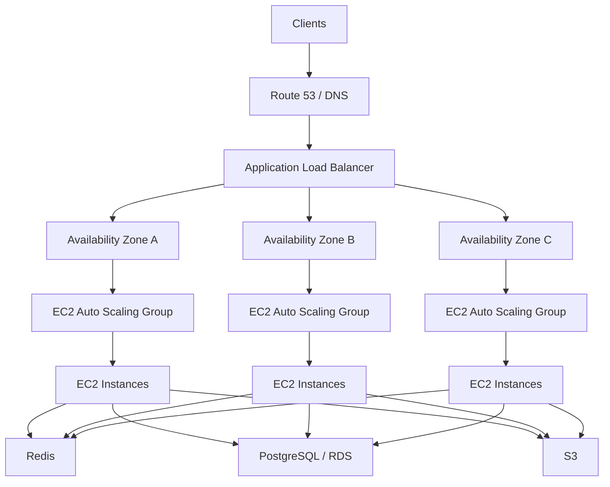
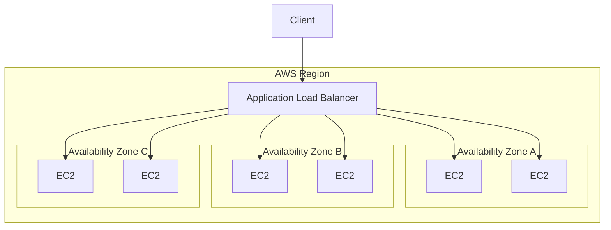
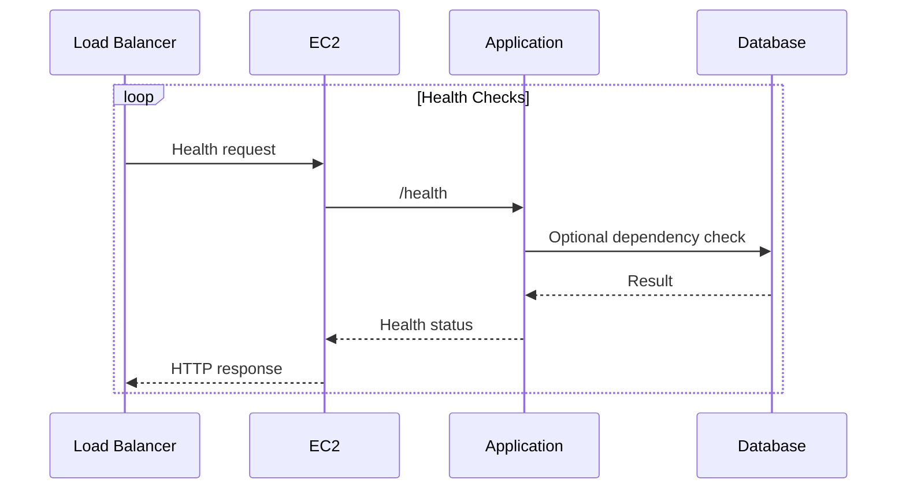
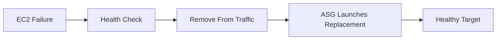
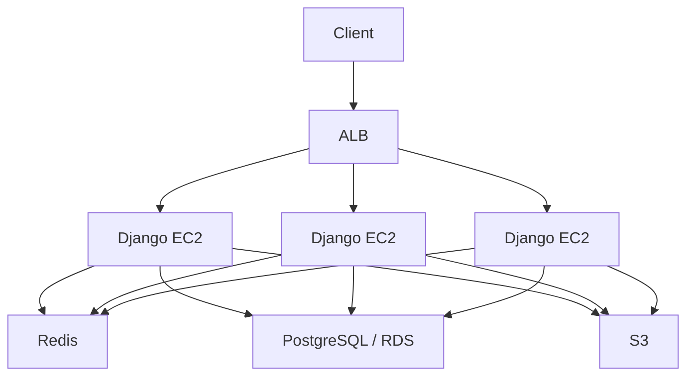
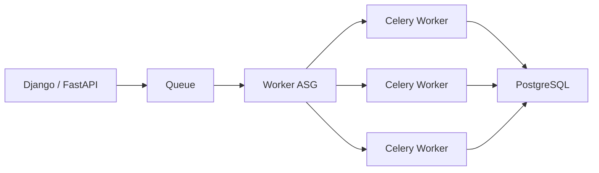
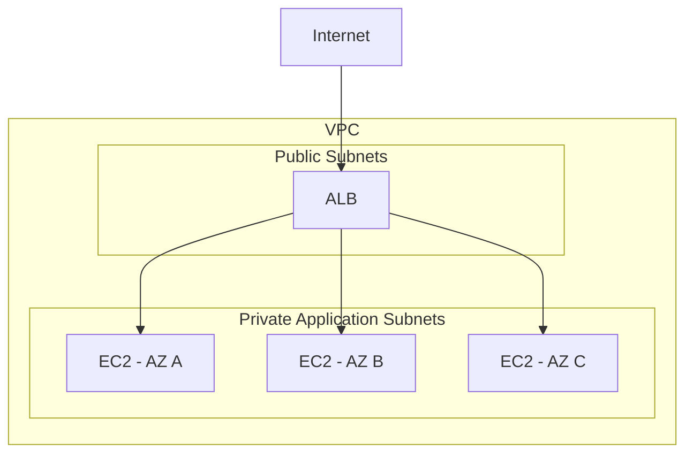
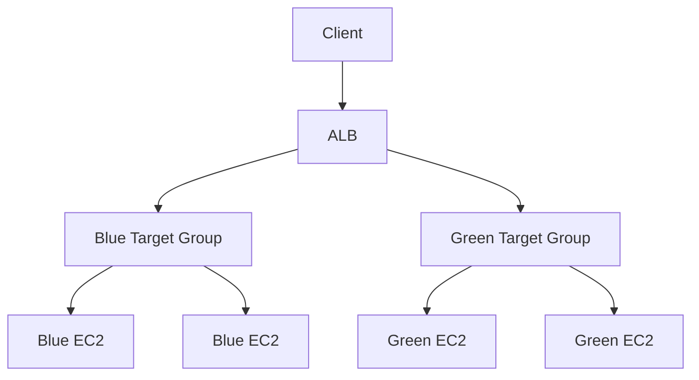
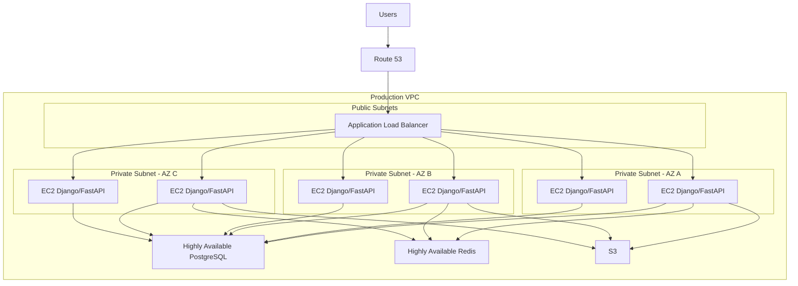

# 03- EC2 High Availability Architecture

## Overview

High availability (HA) for EC2 is the design of an application so that the failure of an individual instance, Availability Zone, or infrastructure component does not unnecessarily make the service unavailable.

A highly available EC2 architecture does not mean that every component is duplicated indefinitely. It means that the architecture has sufficient redundancy, health detection, automated recovery, and failure isolation for its defined availability requirements.

A typical production architecture is:



The important principle is that **EC2 instances should generally be replaceable**.

If one instance fails:

```text
Healthy Fleet
    |
    +-- EC2-1
    +-- EC2-2  <-- failure
    +-- EC2-3
    |
    v
ASG detects failure
    |
    v
EC2-2 replaced
    |
    v
Healthy Fleet restored
```

High availability therefore depends on more than EC2 itself. It involves:

- Availability Zones
- Load balancing
- Auto Scaling
- Health checks
- Stateless application design
- Shared or durable state
- Database availability
- Network architecture
- Monitoring
- Deployment strategy
- Disaster recovery

---

## Availability vs Scalability

These concepts are related but different.

### High Availability

HA focuses on continuing service when components fail.

```text
Instance failure
      |
      v
Another healthy instance serves traffic
```

### Scalability

Scalability focuses on handling changing workload.

```text
Traffic increases
      |
      v
More instances
```

A system can be scalable without being highly available:

```text
10 instances
     |
     +-- All in one AZ
```

It can also be highly redundant but poorly scalable:

```text
3 instances
     |
     +-- Cannot handle traffic growth
```

Production architecture should address both independently.

---

## Failure Domains

The most important HA concept is the failure domain.

Common failure domains include:

```text
Process
  |
  v
EC2 Instance
  |
  v
Rack / Infrastructure
  |
  v
Availability Zone
  |
  v
Region
```

The architecture should decide which failures it is expected to tolerate.

| Failure | Typical Response |
|---|---|
| Application process failure | Process restart / health check |
| EC2 failure | ASG replacement |
| Target failure | Load balancer removes target |
| AZ failure | Traffic continues to other AZs |
| Database instance failure | Managed database failover / recovery |
| Region failure | Cross-Region DR architecture |

The cost and complexity increase as the failure domain becomes larger.

---

## Availability Zones

An AWS Availability Zone is an isolated location within an AWS Region designed to provide independent failure boundaries.

For EC2 HA, distribute application instances across multiple AZs.

Avoid:

```text
Region
  |
  +-- AZ-A
       |
       +-- EC2
       +-- EC2
       +-- EC2
```

Prefer:

```text
Region
 |
 +-- AZ-A
 |    +-- EC2
 |
 +-- AZ-B
 |    +-- EC2
 |
 +-- AZ-C
      +-- EC2
```

If one AZ becomes unavailable, capacity remains in the others.

---

## Multi-AZ Architecture

A typical architecture is:



The exact number of AZs and instances depends on:

- Availability target
- Traffic
- Failure tolerance
- Cost
- Regional AZ availability
- Instance capacity
- Application startup time

Do not treat "three AZs" as a universal requirement. Design for the failure tolerance and service requirements that actually matter.

---

## Minimum Capacity

An ASG minimum capacity determines the lowest number of instances the group should maintain.

For HA, a minimum of one instance is generally insufficient:

```text
Min = 1

AZ-A
 |
 +-- EC2-1
```

A better baseline is often:

```text
Min = 2

AZ-A
 |
 +-- EC2-1

AZ-B
 |
 +-- EC2-2
```

This allows one instance to fail while another continues serving traffic.

However, two instances do not automatically provide complete AZ-failure tolerance.

If both instances are accidentally placed in one AZ:

```text
AZ-A
 |
 +-- EC2-1
 +-- EC2-2
```

an AZ-level failure can still remove the entire fleet.

---

## Capacity Distribution

For a three-AZ architecture:

```text
Desired = 6

AZ-A -> 2
AZ-B -> 2
AZ-C -> 2
```

This provides balanced capacity.

A production design should consider what happens if one AZ disappears:

```text
Before failure:

AZ-A -> 2
AZ-B -> 2
AZ-C -> 2

AZ-B fails:

AZ-A -> 2
AZ-C -> 2
```

The remaining four instances must be capable of serving the required workload.

This is a key HA principle:

> Design capacity for the expected failure state, not only for normal operation.

---

## N+1 Capacity

N+1 planning means maintaining enough spare capacity to tolerate the loss of one unit.

For example:

```text
Required capacity = 4 instances

Normal:
AZ-A -> 2
AZ-B -> 2

After AZ-A failure:
AZ-B -> 2
```

This does not provide enough capacity to maintain the original workload.

A stronger design might use:

```text
Normal:
AZ-A -> 2
AZ-B -> 2
AZ-C -> 2

Total = 6

After one AZ failure:
Remaining = 4
```

Whether four remaining instances are sufficient depends on workload capacity.

N+1 is therefore a capacity-planning concept, not simply an instance-count rule.

---

## Load Balancer as the Traffic Entry Point

A highly available EC2 application should generally avoid exposing individual backend instances as the primary public endpoint.

Prefer:

```text
Client
  |
  v
ALB
  |
  +-- EC2
  +-- EC2
  +-- EC2
```

instead of:

```text
Client
  |
  v
EC2
```

The load balancer provides:

- Stable application endpoint
- Target health checks
- Traffic distribution
- Connection handling
- TLS termination
- Routing
- Integration with Auto Scaling

---

## Health Checks

Health checks are fundamental to HA.

There are multiple layers of health.

### Infrastructure Health

```text
Is the EC2 instance reachable?
```

### Application Health

```text
Is the backend process working?
```

### Readiness

```text
Should this instance currently receive traffic?
```

These are not always the same.

For example:

```text
EC2 = running
Application = running
Database connection = broken
```

The instance may technically be alive while the application cannot serve useful requests.

---

## Health Check Flow



Health endpoints should be designed carefully.

A basic liveness endpoint might only determine whether the application process is functioning.

A readiness endpoint can include critical dependency checks when that dependency is essential for serving traffic.

Avoid making health checks unnecessarily expensive.

---

## Auto Scaling Groups

An ASG provides automatic instance replacement and capacity management.

Typical flow:

```text
EC2 becomes unhealthy
       |
       v
ASG detects failure
       |
       v
Instance removed
       |
       v
Replacement launched
       |
       v
Health checks pass
       |
       v
Instance enters service
```

This makes the EC2 fleet self-healing at the instance level.

ASGs should use reproducible configuration through Launch Templates rather than depending on manually configured servers.

---

## Self-Healing Architecture

A useful HA property is:

```text
Failure
  |
  v
Detection
  |
  v
Isolation
  |
  v
Replacement
  |
  v
Recovery
```

For an EC2 application:



This is more reliable than relying on an engineer to manually restart a server.

---

## Stateless Application Design

Statelessness is one of the most important architectural requirements for EC2 HA.

A stateless API can process a request on any healthy instance.

```text
Request 1 --> EC2-A
Request 2 --> EC2-B
Request 3 --> EC2-C
```

The application should not require:

```text
Request 1 --> EC2-A
Request 2 --> EC2-A
Request 3 --> EC2-A
```

unless there is a specific reason to use session affinity.

---

## Externalizing State

Application state should be stored in systems designed to provide appropriate durability and availability.

Examples:

| State | Typical External System |
|---|---|
| Relational data | PostgreSQL / RDS |
| Cache | Redis |
| Sessions | Redis / database |
| Object files | S3 |
| Messages | SQS / Kafka |
| Logs | CloudWatch / centralized logging |
| Secrets | Secrets Manager / Parameter Store |

This allows EC2 instances to remain disposable.

---

## Django High Availability

A typical Django architecture is:



Important considerations include:

- Shared sessions
- Shared cache
- External file storage
- Database connection management
- Secure cookie configuration
- CSRF configuration
- Forwarded HTTPS handling
- Application health checks
- Graceful shutdown

Django should not depend on files or mutable configuration existing only on one EC2 instance.

---

## FastAPI High Availability

FastAPI follows the same basic model:

```text
                 +--> FastAPI-1
                /
Client --> ALB --> FastAPI-2
                \
                 +--> FastAPI-3
```

Shared state belongs outside the application process:

```text
FastAPI
 |
 +-- PostgreSQL
 +-- Redis
 +-- S3
 +-- Kafka
```

This allows Auto Scaling to add or remove instances without requiring application state migration.

---

## Celery Worker High Availability

Background workers require a slightly different architecture.



Worker HA requires consideration of:

- Task acknowledgements
- Retries
- Idempotency
- Visibility timeouts where applicable
- Duplicate execution
- Graceful shutdown
- Queue durability
- Worker replacement

A worker instance failing during a task should not permanently lose critical work.

---

## Database High Availability

EC2 application HA does not make the database highly available automatically.

Consider:

```text
Highly Available API
       |
       v
Single Database
       |
       v
Single failure domain
```

The API can have ten healthy instances and still become unavailable if its only database fails.

For production systems, the database architecture should have its own HA and recovery strategy.

For example, a managed relational database can provide capabilities such as:

- Multi-AZ deployment
- Automated backups
- Failover
- Monitoring
- Recovery mechanisms

The exact design depends on the database service and workload.

---

## Database Connection Scaling

Increasing the number of API instances increases potential database connections.

Example:

```text
4 EC2 instances
    |
    +-- 20 connections each
    |
    v
80 connections
```

After scaling:

```text
20 EC2 instances
    |
    +-- 20 connections each
    |
    v
400 connections
```

This can make the database the limiting component.

Production HA therefore requires capacity planning across the entire dependency chain.

Potential solutions include:

- Connection pooling
- PgBouncer
- RDS Proxy where applicable
- Appropriate connection limits
- Query optimization
- Backpressure
- Independent scaling

---

## Redis High Availability

Redis may become a critical dependency for:

- Sessions
- Cache
- Distributed locks
- Rate limiting
- Celery
- Application coordination

If Redis is a single-instance dependency:

```text
EC2 Fleet
    |
    v
Redis
    |
    +-- Failure
    |
    v
Application impact
```

Use an appropriate highly available Redis architecture when Redis is part of the application's critical path.

The correct design depends on whether Redis contains:

- Disposable cache
- Session state
- Queue state
- Coordination state
- Durable business data

Do not treat all Redis workloads as equivalent.

---

## S3 and Object Storage

Files should generally not live only on local EC2 storage when instances are disposable.

Avoid:

```text
EC2-A
 |
 +-- uploaded files
```

Prefer:

```text
EC2-A --\
EC2-B ----> S3
EC2-C --/
```

This allows any healthy instance to access the required object data.

---

## Network Architecture

A typical production EC2 HA architecture uses public subnets for the load balancer and private subnets for application instances.



This reduces direct internet exposure of backend instances.

Private instances may use NAT gateways or VPC endpoints for outbound dependencies depending on the workload.

---

## NAT Gateway Considerations

Private EC2 instances may need outbound access for:

- Package downloads
- AWS APIs
- External APIs
- Container registries
- Monitoring services

A NAT architecture can introduce another availability and cost consideration.

For highly available workloads, avoid designing all private-subnet egress around a single failure domain.

Also evaluate VPC endpoints for AWS services where appropriate to reduce NAT dependency and cost.

---

## Security Groups

A typical HA security model is:

```text
Internet
   |
   | 443
   v
ALB Security Group
   |
   | Application port
   v
EC2 Security Group
```

The EC2 security group should allow application traffic from the load balancer security group rather than broadly from the internet.

For example:

```text
ALB SG
    Inbound:
        TCP 443 from Internet

EC2 SG
    Inbound:
        TCP 8000 from ALB SG
```

Administrative access should use a controlled mechanism rather than exposing SSH broadly.

---

## High Availability and Availability Targets

HA architecture should be based on a defined availability target.

For example:

| Availability Target | Approximate Annual Downtime |
|---|---:|
| 99% | ~87.6 hours |
| 99.9% | ~8.76 hours |
| 99.99% | ~52.6 minutes |
| 99.999% | ~5.26 minutes |

These numbers illustrate why availability targets matter.

A system designed for 99.9% availability does not necessarily justify the complexity and cost of a multi-Region architecture designed for significantly stronger failure tolerance.

---

## RTO and RPO

High availability should be considered together with disaster recovery.

### RTO

Recovery Time Objective answers:

> How quickly must the service recover?

Example:

```text
RTO = 15 minutes
```

### RPO

Recovery Point Objective answers:

> How much data loss is acceptable?

Example:

```text
RPO = 5 minutes
```

HA primarily reduces interruption during expected infrastructure failures.

DR addresses larger failures such as:

- Regional outage
- Data corruption
- Accidental deletion
- Major configuration failure

---

## High Availability vs Disaster Recovery

These should not be confused.

| Capability | High Availability | Disaster Recovery |
|---|---|---|
| EC2 instance failure | Yes | Not primary purpose |
| AZ failure | Yes | Can help |
| Region failure | Usually no | Yes |
| Database failover | Often | Yes |
| Backup restoration | No | Yes |
| Cross-Region recovery | Not necessarily | Common DR mechanism |
| Goal | Minimize interruption | Recover from major failure |

A multi-AZ EC2 architecture does not automatically provide multi-Region disaster recovery.

---

## Deployment Strategy

Deployments can temporarily reduce availability if instances are replaced incorrectly.

A controlled deployment should maintain enough healthy capacity:

```text
Current fleet
    |
    +-- Healthy
    +-- Healthy
    +-- Healthy
    +-- Healthy

Replace one
    |
    v

Old + New fleet
    |
    +-- Healthy
    +-- Healthy
    +-- New
    +-- Healthy
```

Useful mechanisms include:

- Instance Refresh
- Rolling replacement
- Health checks
- Connection draining
- Minimum healthy capacity
- Deployment checkpoints
- Automated rollback

---

## Blue/Green Architecture

For higher-risk deployments, use separate environments.



Traffic can be shifted after the new environment has passed validation.

Advantages include:

- Fast rollback
- Strong environment isolation
- Easier validation

Limitations include:

- Higher temporary infrastructure cost
- More deployment complexity
- More capacity required during transitions

---

## Graceful Shutdown

HA requires applications to stop accepting new work while completing appropriate existing work.

A simplified flow is:

```text
Termination requested
       |
       v
Deregister target
       |
       v
Stop receiving new traffic
       |
       v
Complete existing work
       |
       v
Shutdown application
       |
       v
Terminate EC2
```

For Python services, the application server should handle termination signals appropriately.

This is particularly important for:

- Long-running HTTP requests
- WebSockets
- gRPC
- Celery workers
- Background processing

---

## Load Balancer Connection Draining

When an EC2 instance is removed from the target group, existing connections may need time to complete.

Without graceful draining:

```text
Request in progress
       |
       v
EC2 terminated
       |
       v
Connection reset
```

With graceful handling:

```text
Request in progress
       |
       v
Target deregistered
       |
       v
Existing request completes
       |
       v
EC2 terminated
```

The drain period should be compatible with actual request durations.

---

## Session Management

Session architecture affects HA.

Avoid:

```text
Session
  |
  v
EC2 local memory
```

because a request routed to another instance cannot access the state.

Prefer:

```text
EC2-1 --\
EC2-2 ----> Redis / Database
EC2-3 --/
```

Sticky sessions can temporarily compensate for stateful applications, but they reduce routing flexibility and do not solve instance failure by themselves.

---

## Cache Design

A cache should not become an accidental single point of failure.

For disposable cache data:

```text
Cache unavailable
      |
      v
Application fetches from database
```

may be acceptable.

For critical coordination or session state:

```text
Redis unavailable
      |
      v
Application unavailable
```

may require a more resilient Redis architecture.

The HA design should explicitly classify each dependency as:

- Critical
- Degradable
- Recoverable
- Disposable

---

## Dependency Failure

A highly available application should define behavior when dependencies fail.

For example:

```text
EC2
 |
 +-- PostgreSQL
 +-- Redis
 +-- S3
 +-- External API
```

Possible strategies include:

- Timeouts
- Retries
- Circuit breakers
- Graceful degradation
- Caching
- Queueing
- Backpressure
- Fallback behavior

Do not allow a failed dependency to cause unlimited request threads or connection exhaustion.

---

## Observability

HA without observability is difficult to operate.

Monitor at least:

### Infrastructure

- EC2 health
- Instance count
- AZ distribution
- CPU
- Network
- EBS
- System status checks

### Load Balancer

- Healthy targets
- Unhealthy targets
- Request count
- Latency
- HTTP errors
- Connection metrics

### Application

- Error rate
- Request latency
- Throughput
- Process health
- Memory
- Worker utilization

### Dependencies

- Database connections
- Database latency
- Redis health
- Queue depth
- External API errors

---

## Failure Detection

Alert on symptoms that indicate reduced redundancy.

Examples:

```text
Healthy targets < expected
```

```text
ASG instances in one AZ only
```

```text
Database connections near limit
```

```text
HTTP 5xx increasing
```

```text
Target response time increasing
```

The objective is not to alert on every metric. Alerts should identify conditions that require action.

---

## Chaos and Failure Testing

HA should be validated by intentionally testing failures.

Examples include:

- Terminating an EC2 instance
- Stopping application processes
- Making a target unhealthy
- Performing an instance refresh
- Testing AZ-level capacity assumptions
- Simulating database failure
- Testing Redis failure
- Testing dependency timeouts
- Testing deployment rollback

A design is not operationally HA merely because its architecture diagram contains multiple instances.

---

## Capacity Planning

Capacity planning should answer:

```text
How much traffic can one instance handle?
```

Then:

```text
How many instances are required normally?
```

Then:

```text
How many are required after losing one AZ?
```

For example:

```text
One instance:
    1,000 requests/sec

Normal:
    4 instances
    capacity = 4,000 req/sec

One AZ failure:
    2 instances remain
    capacity = 2,000 req/sec
```

If expected peak traffic is:

```text
3,000 req/sec
```

the architecture is not sufficiently provisioned for the stated failure scenario.

---

## Load Testing

Load testing should include failure scenarios, not only normal traffic.

Test:

```text
Normal:
    4 instances

Peak:
    8 instances

AZ failure:
    2 instances

Recovery:
    replacement instances launch
```

Measure:

- Latency
- Error rate
- Throughput
- Scaling delay
- Database pressure
- Recovery time
- Connection behavior

This provides evidence that the architecture can tolerate the intended failure.

---

## Cost Considerations

HA requires redundancy, which increases cost.

Potential cost increases include:

- Additional EC2 instances
- Load balancers
- NAT gateways
- Cross-AZ data transfer
- Standby database capacity
- Redis HA
- Monitoring
- Backup storage
- Multi-Region infrastructure

The correct goal is not maximum redundancy at any cost.

Instead:

```text
Availability requirement
        +
Failure tolerance
        +
Performance requirement
        +
Budget
        |
        v
Architecture
```

---

## Common Mistakes

### Running Everything in One AZ

Multiple EC2 instances in one AZ protect against instance failure but not AZ failure.

### Assuming ALB Makes the Entire System Highly Available

The load balancer only addresses the traffic-entry and target-routing layer.

Databases, Redis, queues, and external dependencies can still be single points of failure.

### Keeping State on EC2

Local files, sessions, and in-memory state can disappear when an instance is replaced.

### Using Sticky Sessions as an HA Strategy

Sticky sessions preserve affinity but do not eliminate instance failure.

### Ignoring Database Capacity

Scaling API instances can overload PostgreSQL.

### Ignoring Startup Time

An ASG may detect failure quickly but replacement instances may take significant time to become healthy.

### Overly Aggressive Health Checks

Poor health-check design can repeatedly terminate otherwise useful instances.

### Health Endpoint Depends on Every Dependency

If the health endpoint fails whenever any non-critical dependency is unavailable, the load balancer can remove the entire fleet unnecessarily.

### No Failure Testing

An architecture that has never experienced an intentional failure is not operationally validated.

### Treating Multi-AZ as Multi-Region

Multi-AZ protects against AZ-level failures. It does not provide complete regional disaster recovery.

---

## Production Reference Architecture

A practical EC2 HA architecture for a Python backend can look like:



This architecture provides separation between:

```text
Traffic
  -> ALB

Compute
  -> EC2 ASG

Persistent data
  -> PostgreSQL

Cache / shared state
  -> Redis

Object storage
  -> S3
```

Each layer can then be scaled, monitored, and recovered according to its own requirements.

---

## Production Checklist

### Compute

- [ ] EC2 instances are managed by an ASG
- [ ] Launch Template provides reproducible configuration
- [ ] Minimum capacity supports the availability requirement
- [ ] Capacity is distributed across multiple AZs
- [ ] Maximum capacity is compatible with downstream limits
- [ ] Instance replacement has been tested

### Load Balancing

- [ ] ALB or NLB is appropriate for the workload
- [ ] Targets have meaningful health checks
- [ ] Connection draining is configured appropriately
- [ ] TLS configuration is correct
- [ ] Listener rules are documented

### Application

- [ ] Application is stateless where practical
- [ ] Sessions are externalized
- [ ] Files are stored outside instance-local storage
- [ ] Graceful shutdown is implemented
- [ ] Startup is reproducible
- [ ] Health endpoints are designed intentionally

### Database

- [ ] Database HA requirements are defined
- [ ] Connection limits are understood
- [ ] Backup and recovery are tested
- [ ] Database failover behavior is understood
- [ ] Application scaling does not exceed database capacity

### Networking

- [ ] Application instances are private where appropriate
- [ ] Security groups use least privilege
- [ ] ALB-to-EC2 traffic is explicitly allowed
- [ ] Private-subnet egress is highly available where required
- [ ] NAT and VPC endpoint requirements are understood

### Observability

- [ ] Infrastructure metrics are monitored
- [ ] Load-balancer health is monitored
- [ ] Application errors are monitored
- [ ] Database and Redis health are monitored
- [ ] Alerts identify loss of redundancy
- [ ] Logs are centralized

### Recovery

- [ ] EC2 instance failure has been tested
- [ ] AZ failure assumptions have been tested
- [ ] Deployment rollback has been tested
- [ ] Database recovery has been tested
- [ ] RTO and RPO are documented
- [ ] Disaster recovery strategy is defined

---

## Interview Considerations

### How would you design a highly available EC2 application?

A strong architecture should include:

```text
Route 53
   |
   v
ALB
   |
   v
Multi-AZ ASG
   |
   +-- EC2
   +-- EC2
   +-- EC2
   |
   +-- PostgreSQL / RDS
   +-- Redis
   +-- S3
```

Then explain:

- Health checks
- Auto Scaling
- Statelessness
- Database HA
- Monitoring
- Security groups
- Deployment strategy
- RTO/RPO

### Why deploy EC2 instances across multiple AZs?

Because multiple instances in one AZ protect against instance failure but do not adequately protect against an AZ-level failure.

### Does an Auto Scaling Group make an application highly available?

No. It provides automated capacity management and instance replacement, but the overall architecture must also address load balancing, AZ distribution, application state, databases, dependencies, networking, and recovery.

### Why should application instances be stateless?

Stateless instances can be added, removed, replaced, or moved between failure domains without migrating critical application state.

### What happens if one EC2 instance fails?

A typical flow is:

```text
EC2 failure
   |
   v
Health check fails
   |
   v
Target removed from traffic
   |
   v
ASG replaces instance
   |
   v
New instance becomes healthy
   |
   v
ALB sends traffic to it
```

### Is Multi-AZ the same as Disaster Recovery?

No.

Multi-AZ primarily improves availability within a Region. Disaster recovery addresses larger failures, including regional outages, data corruption, and recovery from major operational incidents.

### How do you prevent a highly available API from overwhelming PostgreSQL?

Consider:

- Connection pooling
- PgBouncer
- RDS Proxy where applicable
- Query optimization
- Connection limits
- Backpressure
- Appropriate ASG limits
- Database scaling

### Why are health checks difficult to design?

Because "running" and "ready to serve traffic" are different states. Health checks that are too shallow may route traffic to broken applications, while health checks that are too strict may remove the entire fleet because of a non-critical dependency failure.

### How would you test EC2 HA?

Intentionally test:

```text
Instance failure
     |
     v
Target removal
     |
     v
ASG replacement
     |
     v
Traffic recovery
```

Then validate AZ failure assumptions, database failover, deployment rollback, dependency failures, and recovery objectives.

## Key Takeaways

- **EC2 high availability is a system-level property built from multi-AZ compute, load balancing, health detection, automated replacement, and resilient dependencies.**
- **Design capacity for failure states, not only normal operation; the remaining fleet after an AZ failure must still satisfy the required workload and availability target.**
- **Stateless EC2 instances are the foundation of reliable horizontal scaling; sessions, files, databases, queues, and other important state should be externalized appropriately.**
- **An ASG and ALB do not make the entire application highly available; databases, Redis, networking, deployments, and external dependencies require their own HA strategies.**
- **HA should be validated through monitoring, load testing, failure injection, recovery testing, and explicit RTO/RPO requirements rather than relying solely on architecture diagrams.**