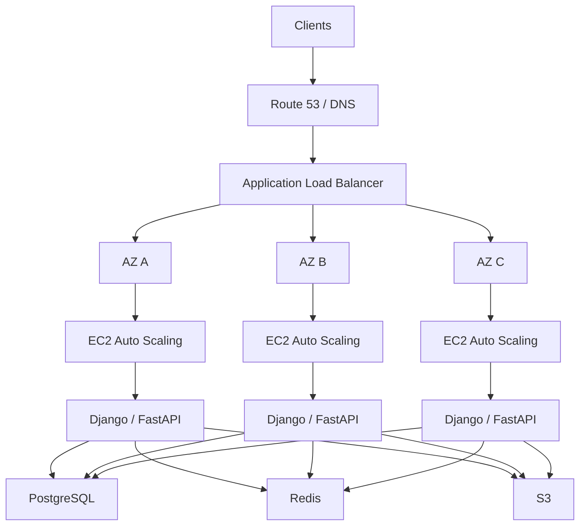
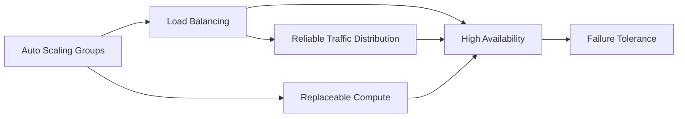
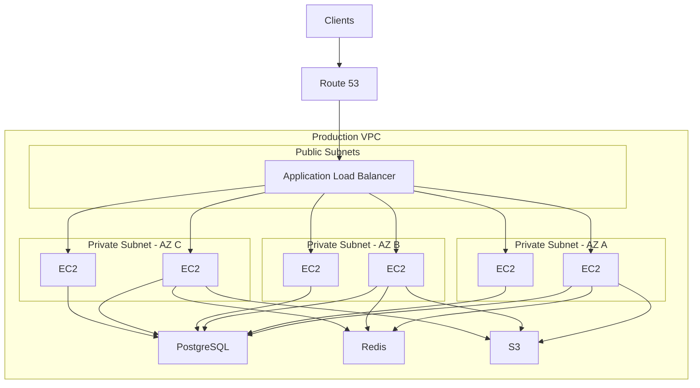

# README

## Overview

This directory contains architecture-level documentation for designing production EC2 workloads with a focus on scalability, reliability, high availability, traffic distribution, failure isolation, and operational resilience.

The architecture topics build on the lower-level EC2 concepts and explain how individual AWS components are combined into production backend systems.

The primary architecture model is:



The architecture layer focuses on questions such as:

- How should EC2 instances be distributed across Availability Zones?
- How should traffic reach backend instances?
- How should instances scale with demand?
- What happens when an instance fails?
- What happens when an Availability Zone fails?
- How should deployments avoid unnecessary downtime?
- How should application state be externalized?
- How should compute, database, cache, and storage layers interact?
- How should failure recovery and disaster recovery be designed?

---

## Navigation

| # | File | Description |
|---|---|---|
| 01 | [01- Auto Scaling Groups](./01-%20Auto%20Scaling%20Groups.md) | Auto Scaling Group architecture, scaling strategies, capacity management, and production patterns |
| 02 | [02- Load Balancing](./02-%20Load%20Balancing.md) | Load balancing architecture, ALB/NLB design, target groups, health checks, and multi-AZ routing |
| 03 | [03- EC2 High Availability Architecture](./03-%20EC2%20High%20Availability%20Architecture.md) | High availability design, multi-AZ deployment, failure isolation, and disaster recovery |

## Architecture Principles

Production EC2 architecture should generally follow these principles:

| Principle | Purpose |
|---|---|
| Multi-AZ | Reduce dependence on a single Availability Zone |
| Load balancing | Distribute traffic and isolate unhealthy targets |
| Auto Scaling | Adjust and replace compute capacity |
| Stateless compute | Make instances replaceable |
| Externalized state | Prevent instance failure from losing application state |
| Automated recovery | Reduce manual intervention |
| Least privilege | Reduce security exposure |
| Observability | Detect and diagnose failures |
| Infrastructure as Code | Make infrastructure reproducible |
| Controlled deployments | Reduce deployment-related outages |
| Capacity planning | Prevent resource exhaustion |
| Tested recovery | Validate actual failure behavior |

A useful mental model is:

```text
Traffic
   |
   v
Load Balancing
   |
   v
Compute
   |
   +--> Database
   +--> Cache
   +--> Object Storage
   +--> Messaging
```

Each layer has different availability, scaling, consistency, and recovery requirements.

---

## Architecture Topics

| File | Focus |
|---|---|
| [01- Auto Scaling Groups](01-%20Auto%20Scaling%20Groups.md) | EC2 fleet management, scaling, health checks, replacement, lifecycle, and capacity |
| [02- Load Balancing](02-%20Load%20Balancing.md) | Traffic distribution, target groups, health checks, listeners, TLS, and EC2 integration |
| [03- EC2 High Availability Architecture](03-%20EC2%20High%20Availability%20Architecture.md) | Multi-AZ architecture, failure tolerance, stateless design, recovery, and production HA |

---

## Auto Scaling Architecture

[01- Auto Scaling Groups](01-%20Auto%20Scaling%20Groups.md) covers the architecture and operation of EC2 fleets managed by Auto Scaling Groups.

Core concepts include:

```text
Launch Template
       |
       v
Auto Scaling Group
       |
       +--> Minimum Capacity
       +--> Desired Capacity
       +--> Maximum Capacity
       |
       +--> Health Checks
       +--> Scaling Policies
       +--> Instance Refresh
       +--> Lifecycle Hooks
```

An ASG provides more than horizontal scaling. It can also provide:

- Instance replacement
- Capacity management
- Multi-AZ distribution
- Controlled instance refresh
- Integration with load balancers
- Health-based replacement
- Scheduled scaling
- Target tracking
- Step scaling
- Lifecycle management

The key architectural principle is that application instances should generally be treated as disposable compute capacity.

---

## Load Balancing Architecture

[02- Load Balancing](02-%20Load%20Balancing.md) explains how load balancers provide a stable traffic entry point and distribute requests across healthy EC2 targets.

Typical request flow:

```text
Client
  |
  v
DNS
  |
  v
ALB
  |
  +--> Target A
  +--> Target B
  +--> Target C
```

The load-balancing layer is responsible for concerns such as:

- Listener configuration
- TLS termination
- Host-based routing
- Path-based routing
- Target groups
- Health checks
- Connection handling
- Target registration
- Deregistration
- Sticky sessions where required
- Integration with Auto Scaling

For typical Django and FastAPI HTTP APIs, an ALB is commonly the relevant load-balancing architecture.

---

## High Availability Architecture

[03- EC2 High Availability Architecture](03-%20EC2%20High%20Availability%20Architecture.md) focuses on designing EC2 workloads to tolerate infrastructure failures.

A basic HA model is:

```text
                  ALB
                   |
        +----------+----------+
        |          |          |
       AZ-A       AZ-B       AZ-C
        |          |          |
      EC2        EC2        EC2
      EC2        EC2        EC2
```

The architecture should be capable of continuing service when an individual instance fails and, where required, when an Availability Zone becomes unavailable.

High availability is not provided by EC2 alone. The database, cache, network, storage, messaging, and deployment layers must also be evaluated.

---

## How the Architecture Topics Connect

The three documents form a progression:



### Auto Scaling Groups

Answers:

> How do I manage and replace compute capacity?

### Load Balancing

Answers:

> How do I distribute traffic across healthy compute capacity?

### High Availability

Answers:

> How do I combine compute, networking, traffic management, and resilient dependencies so the system can tolerate failures?

---

## Production EC2 Architecture

A typical production Python backend can use:



This separates the major responsibilities:

| Layer | Typical Responsibility |
|---|---|
| Route 53 | DNS and traffic entry |
| ALB | HTTP/HTTPS traffic distribution |
| EC2 ASG | Application compute |
| PostgreSQL | Relational persistence |
| Redis | Cache and shared ephemeral state |
| S3 | Durable object storage |
| CloudWatch | Metrics, alarms, and observability |
| IAM | Authentication and authorization |
| VPC | Network isolation |

The exact architecture should depend on the workload rather than applying every component by default.

---

## Stateless Backend Design

A scalable EC2 backend should generally avoid storing important mutable state on the local instance.

For example, a Django application should not depend on:

```text
EC2-1
 |
 +-- Local uploaded files
 +-- Local session state
 +-- Local application state
```

Prefer:

```text
EC2 Fleet
 |
 +-- PostgreSQL
 +-- Redis
 +-- S3
```

This allows instances to be:

- Replaced
- Scaled out
- Scaled in
- Rebuilt
- Moved between capacity pools
- Replaced during deployment

without requiring application state migration.

---

## Failure Model

Production architecture should explicitly define what happens when components fail.

| Failure | Expected Architectural Response |
|---|---|
| EC2 instance failure | ASG replacement |
| Application process failure | Health check / process restart |
| Unhealthy target | Load balancer removes target |
| AZ failure | Traffic continues through remaining AZs |
| Deployment failure | Rollback / instance replacement |
| Database failure | Database HA/failover strategy |
| Redis failure | HA or application degradation strategy |
| Data deletion | Backup and recovery process |
| Regional failure | Disaster recovery architecture |

The goal is not to prevent every failure. The goal is to ensure that failures are detected, isolated, and recovered from predictably.

---

## Capacity Planning

Architecture decisions should be based on measured capacity.

A useful model is:

```text
Traffic Requirement
        |
        v
Capacity per Instance
        |
        v
Required Instance Count
        |
        v
Failure Scenario Capacity
        |
        v
ASG Min / Desired / Max
```

For example:

```text
One instance:
    1,000 requests/sec

Normal workload:
    3,000 requests/sec

Normal capacity:
    4 instances

Failure scenario:
    One AZ unavailable

Required remaining capacity:
    >= 3,000 requests/sec
```

This is more meaningful than selecting an instance count arbitrarily.

Capacity planning should also include downstream dependencies.

Adding EC2 instances increases:

- Database connections
- Redis connections
- Network traffic
- Queue consumers
- External API calls
- Logging volume

A scalable architecture therefore requires coordinated capacity limits.

---

## Security Architecture

A common security boundary is:

```text
Internet
   |
   | HTTPS
   v
ALB Security Group
   |
   | Application Port
   v
EC2 Security Group
   |
   +--> Database Security Group
   +--> Redis Security Group
```

Application instances should generally not accept unrestricted internet traffic when an ALB is the public entry point.

Use:

- IAM roles instead of static AWS credentials
- Least-privilege security groups
- Private subnets where appropriate
- Systems Manager for administration where practical
- Secrets Manager or Parameter Store for secrets
- TLS for external and sensitive internal communication
- Centralized logging
- Encryption at rest where required

Security architecture should be considered together with availability. For example, exposing SSH publicly for operational convenience can create a security weakness even if the application remains highly available.

---

## Observability Architecture

A production EC2 architecture should expose enough telemetry to answer:

```text
Is the service available?
Is the application healthy?
Is the fleet healthy?
Is capacity sufficient?
Is a dependency failing?
Is the system approaching a limit?
```

Monitor at multiple levels:

```text
Infrastructure
    |
    +-- EC2
    +-- EBS
    +-- Network

Traffic
    |
    +-- ALB
    +-- Target Health
    +-- Latency
    +-- Errors

Application
    |
    +-- Request Rate
    +-- Error Rate
    +-- Latency
    +-- Process Health

Dependencies
    |
    +-- PostgreSQL
    +-- Redis
    +-- Queues
    +-- External APIs
```

Observability should detect loss of redundancy, not only complete outages.

For example:

```text
Expected:
    6 healthy targets

Observed:
    4 healthy targets
```

This can indicate degraded resilience even when users are still receiving successful responses.

---

## Deployment Architecture

Deployments should preserve sufficient healthy capacity.

A rolling replacement can look like:

```text
Old Fleet
    |
    v
Launch New Instance
    |
    v
Health Check
    |
    v
Add To Service
    |
    v
Drain Old Instance
    |
    v
Terminate Old Instance
```

Useful mechanisms include:

- Instance Refresh
- Rolling deployments
- Blue/green deployments
- Target health checks
- Connection draining
- Minimum healthy capacity
- Automated rollback

CI/CD should change infrastructure predictably rather than relying on manual server configuration.

---

## Disaster Recovery

Multi-AZ architecture primarily addresses availability within a Region.

It should not be confused with complete disaster recovery.

| Requirement | Relevant Architecture |
|---|---|
| EC2 instance failure | ASG |
| AZ failure | Multi-AZ |
| Application deployment failure | Rollback / blue-green |
| Database failure | Database HA |
| Data corruption | Backups / point-in-time recovery |
| Regional outage | Multi-Region DR |
| Accidental deletion | Backup / recovery |
| Long-term archival | Appropriate storage lifecycle |

Define:

- RTO
- RPO
- Backup frequency
- Recovery process
- Recovery ownership
- Validation procedure

Backups that have never been restored should not be treated as fully validated recovery mechanisms.

---

## Architecture Decision Framework

When designing an EC2 backend, evaluate the system in this order:

```text
1. Traffic
   |
2. Compute
   |
3. Failure Domains
   |
4. State
   |
5. Dependencies
   |
6. Scaling
   |
7. Security
   |
8. Observability
   |
9. Deployment
   |
10. Recovery
```

For each component ask:

| Question | Example |
|---|---|
| What happens when it fails? | ASG replaces EC2 |
| What happens when load increases? | ASG scales out |
| Where is state stored? | PostgreSQL / Redis / S3 |
| What is the failure domain? | Instance / AZ / Region |
| How is health detected? | ALB / CloudWatch |
| How is recovery automated? | ASG / failover |
| What is the scaling limit? | DB connections / quota |
| How is access controlled? | IAM / Security Groups |
| How is it monitored? | CloudWatch / application metrics |
| How is it recovered? | Backup / DR |

---

## Common Architecture Mistakes

### Treating Multiple EC2 Instances as HA

Multiple instances in one AZ do not provide sufficient protection against an AZ-level failure.

### Making EC2 State Persistent

Important application state stored locally prevents safe replacement and scaling.

### Ignoring Downstream Dependencies

An API fleet can scale successfully while PostgreSQL or Redis becomes the bottleneck.

### Using Sticky Sessions as a Substitute for Statelessness

Sticky sessions preserve affinity but do not eliminate the consequences of instance failure.

### Designing Only for Normal Load

Capacity should be evaluated against peak traffic and relevant failure scenarios.

### No Automated Recovery

Manual recovery increases mean time to recovery and creates operational dependency on individual engineers.

### No Failure Testing

HA assumptions should be tested through controlled instance, target, deployment, and dependency failures.

### Confusing HA With DR

Multi-AZ architecture does not automatically provide regional disaster recovery.

---

## Interview Architecture Model

For a senior backend interview, a concise EC2 HA design can be represented as:

```text
                    Route 53
                       |
                       v
                      ALB
                       |
          +------------+------------+
          |            |            |
         AZ-A         AZ-B         AZ-C
          |            |            |
       EC2 ASG      EC2 ASG      EC2 ASG
          |            |            |
          +------------+------------+
                       |
             +---------+---------+
             |         |         |
         PostgreSQL  Redis      S3
```

The important discussion points are:

- Why multiple AZs are used
- Why an ALB is used
- How the ASG replaces failed instances
- How health checks remove unhealthy targets
- Why application instances are stateless
- How database connections scale
- How Redis failure is handled
- How deployments avoid downtime
- How monitoring detects degraded capacity
- How backups and DR address larger failures

---

## Navigation

| Section | Documentation |
|---|---|
| Auto Scaling Groups | [01- Auto Scaling Groups](01-%20Auto%20Scaling%20Groups.md) |
| Load Balancing | [02- Load Balancing](02-%20Load%20Balancing.md) |
| High Availability Architecture | [03- EC2 High Availability Architecture](03-%20EC2%20High%20Availability%20Architecture.md) |

---

## Key Takeaways

- **EC2 architecture should be designed around replaceable compute, explicit failure domains, load balancing, and automated recovery.**
- **Auto Scaling manages compute capacity, load balancing manages traffic, and high availability combines these capabilities with resilient dependencies.**
- **Stateless application instances make horizontal scaling, replacement, deployment, and failure recovery significantly simpler.**
- **Production architecture must account for downstream limits such as database connections, Redis capacity, network limits, and AWS service quotas.**
- **Multi-AZ HA, deployment resilience, backups, and multi-Region disaster recovery solve different failure scenarios and should be designed separately.**