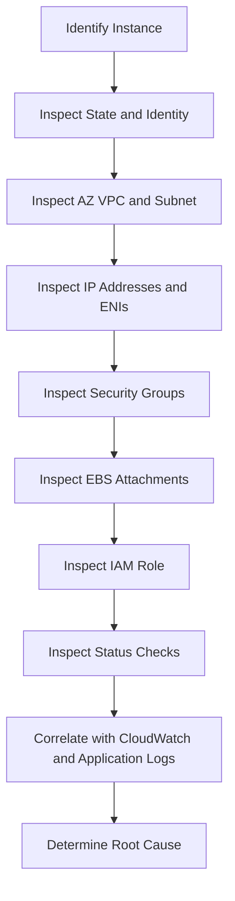

# 02- EC2 Instance Inspection

## Overview

EC2 instance inspection is the process of collecting enough infrastructure metadata to understand **what an instance is, where it runs, how it is configured, and what it is connected to**.

For production operations, `describe-instances` is usually the starting point, not the complete answer. A useful inspection workflow combines:

- Instance identity
- Instance state
- Availability Zone
- Instance type
- AMI
- Private and public networking
- Elastic IPs
- Network interfaces
- Security Groups
- Subnets and VPC
- Tags
- IAM instance profile
- EBS volumes
- Monitoring configuration
- Launch metadata
- Status checks

A typical inspection flow is:

```text
Instance ID / Tags
       |
       v
EC2 Metadata
       |
       +--> State
       +--> Type
       +--> AMI
       +--> AZ / Subnet / VPC
       +--> Private / Public IP
       +--> Security Groups
       +--> ENIs
       +--> EBS
       +--> IAM Role
       |
       v
Operational Diagnosis
```

The objective is not to dump every available field. The objective is to extract the fields needed to answer a specific operational question.

## Basic Instance Listing

List instances in the configured region:

```bash
aws ec2 describe-instances
```

Specify the region explicitly:

```bash
aws ec2 describe-instances \
    --region ap-south-1
```

Use a specific profile:

```bash
aws ec2 describe-instances \
    --profile production \
    --region ap-south-1
```

The response contains nested information under:

```text
Reservations
    |
    +--> Instances
```

A single EC2 instance is represented by an `Instances` object.

## List Instance IDs

For operational scripts, returning the complete API response is often unnecessary.

Use `--query`:

```bash
aws ec2 describe-instances \
    --region ap-south-1 \
    --query 'Reservations[].Instances[].InstanceId'
```

Example result:

```text
[
    "i-0123456789abcdef0",
    "i-0abcdef1234567890"
]
```

For a compact output:

```bash
aws ec2 describe-instances \
    --region ap-south-1 \
    --query 'Reservations[].Instances[].InstanceId' \
    --output text
```

This is useful when feeding instance IDs into another command.

## Inspect a Specific Instance

Use:

```bash
aws ec2 describe-instances \
    --instance-ids i-0123456789abcdef0 \
    --region ap-south-1
```

This is safer than querying the entire account when investigating a known instance.

For a compact summary:

```bash
aws ec2 describe-instances \
    --instance-ids i-0123456789abcdef0 \
    --region ap-south-1 \
    --query 'Reservations[0].Instances[0].{
        ID:InstanceId,
        State:State.Name,
        Type:InstanceType,
        AZ:Placement.AvailabilityZone,
        PrivateIP:PrivateIpAddress,
        PublicIP:PublicIpAddress
    }'
```

Example:

```json
{
    "ID": "i-0123456789abcdef0",
    "State": "running",
    "Type": "t3.medium",
    "AZ": "ap-south-1a",
    "PrivateIP": "10.0.10.25",
    "PublicIP": "203.0.113.10"
}
```

## Instance Identity

Important identity fields include:

| Field | Purpose |
|---|---|
| `InstanceId` | Unique EC2 instance identifier |
| `ImageId` | AMI used to launch the instance |
| `InstanceType` | Compute/memory/networking characteristics |
| `LaunchTime` | Instance launch timestamp |
| `KeyName` | Associated EC2 key pair |
| `IamInstanceProfile` | IAM role association |
| `Tags` | Human-readable ownership and environment metadata |

Inspect the primary identity information:

```bash
aws ec2 describe-instances \
    --instance-ids i-0123456789abcdef0 \
    --query 'Reservations[0].Instances[0].{
        ID:InstanceId,
        AMI:ImageId,
        Type:InstanceType,
        Key:KeyName,
        LaunchTime:LaunchTime,
        IAMRole:IamInstanceProfile.Arn
    }'
```

## Instance State

EC2 lifecycle state can be inspected with:

```bash
aws ec2 describe-instances \
    --instance-ids i-0123456789abcdef0 \
    --query 'Reservations[0].Instances[0].State'
```

Typical states include:

```text
pending
running
stopping
stopped
shutting-down
terminated
```

For just the state name:

```bash
aws ec2 describe-instances \
    --instance-ids i-0123456789abcdef0 \
    --query 'Reservations[0].Instances[0].State.Name' \
    --output text
```

### Important Distinction

An instance being:

```text
running
```

does not prove that:

- The operating system is healthy
- The application is running
- The port is listening
- The load balancer can reach it
- The database connection works
- The instance is passing status checks

Instance state is only one operational signal.

## Instance Type

Inspect the instance type:

```bash
aws ec2 describe-instances \
    --instance-ids i-0123456789abcdef0 \
    --query 'Reservations[0].Instances[0].InstanceType' \
    --output text
```

Instance type selection affects:

- vCPU
- Memory
- Network performance
- EBS performance characteristics
- Architecture
- Pricing
- Workload suitability

For troubleshooting, identifying the instance type helps explain performance symptoms.

For example:

```text
API latency
   |
   +--> CPU saturation
   |
   +--> Memory pressure
   |
   +--> Network limitation
   |
   +--> Instance family mismatch
```

Do not assume that changing instance type is automatically the correct fix. First establish the actual resource bottleneck.

## AMI Inspection

The AMI used by an instance is available through:

```bash
aws ec2 describe-instances \
    --instance-ids i-0123456789abcdef0 \
    --query 'Reservations[0].Instances[0].ImageId' \
    --output text
```

Inspect the AMI:

```bash
aws ec2 describe-images \
    --image-ids ami-0123456789abcdef0 \
    --region ap-south-1
```

Useful fields include:

- Image ID
- Name
- Creation date
- Architecture
- Root device type
- Block device mappings
- State

### Production Use

AMI inspection is particularly useful when:

- Newly launched instances fail
- A deployment introduced a regression
- Instances have inconsistent software versions
- An ASG repeatedly replaces instances
- A production rollback is required

A useful diagnostic comparison is:

```text
Known-good AMI
       vs
Current AMI
```

## Availability Zone, Subnet, and VPC

Inspect placement:

```bash
aws ec2 describe-instances \
    --instance-ids i-0123456789abcdef0 \
    --query 'Reservations[0].Instances[0].{
        AZ:Placement.AvailabilityZone,
        Subnet:SubnetId,
        VPC:VpcId
    }'
```

These fields are important because networking and availability are strongly tied to placement.

```text
Region
  |
  +--> Availability Zone
          |
          +--> Subnet
                  |
                  +--> EC2
```

### Operational Questions

When inspecting an instance, determine:

- Which region?
- Which AZ?
- Which VPC?
- Which subnet?
- Is the subnet public or private?
- Which route table applies?
- Is the instance expected to have Internet access?

EC2 inspection provides the identifiers needed to investigate these questions further.

## Private IP Address

Inspect:

```bash
aws ec2 describe-instances \
    --instance-ids i-0123456789abcdef0 \
    --query 'Reservations[0].Instances[0].PrivateIpAddress' \
    --output text
```

The private IP is generally the primary address used for communication within the VPC.

Backend services commonly communicate using private addressing:

```text
ALB
 |
 v
EC2
 |
 v
RDS
```

Public Internet traffic should not be assumed to be part of internal service communication.

## Public IP Address

Inspect:

```bash
aws ec2 describe-instances \
    --instance-ids i-0123456789abcdef0 \
    --query 'Reservations[0].Instances[0].PublicIpAddress' \
    --output text
```

An empty value can be completely normal for a private EC2 instance.

Do not assume:

```text
No public IP = broken instance
```

A production architecture may intentionally use:

```text
Internet
   |
   v
ALB
   |
   v
Private EC2
```

This is often preferable to directly exposing application instances.

## Public DNS Name

Inspect:

```bash
aws ec2 describe-instances \
    --instance-ids i-0123456789abcdef0 \
    --query 'Reservations[0].Instances[0].PublicDnsName' \
    --output text
```

A public DNS name is associated with public addressing when applicable.

Private DNS information can also be inspected:

```bash
aws ec2 describe-instances \
    --instance-ids i-0123456789abcdef0 \
    --query 'Reservations[0].Instances[0].PrivateDnsName' \
    --output text
```

### Production Consideration

Do not use an EC2 public DNS name as an application identity when a stable DNS abstraction such as Route 53 or an ALB should represent the service.

## Network Interfaces

An instance can have one or more Elastic Network Interfaces (ENIs).

Inspect them through:

```bash
aws ec2 describe-instances \
    --instance-ids i-0123456789abcdef0 \
    --query 'Reservations[0].Instances[0].NetworkInterfaces'
```

Extract useful information:

```bash
aws ec2 describe-instances \
    --instance-ids i-0123456789abcdef0 \
    --query 'Reservations[0].Instances[0].NetworkInterfaces[].{
        ENI:NetworkInterfaceId,
        PrivateIP:PrivateIpAddress,
        Subnet:SubnetId,
        VPC:VpcId,
        SGs:Groups[].GroupId
    }'
```

ENI inspection is useful when troubleshooting:

- Multiple interfaces
- Secondary private IPs
- Security Groups
- Network connectivity
- Application-specific network interfaces

## Security Groups

Inspect Security Groups associated with the instance:

```bash
aws ec2 describe-instances \
    --instance-ids i-0123456789abcdef0 \
    --query 'Reservations[0].Instances[0].SecurityGroups'
```

Example:

```json
[
    {
        "GroupId": "sg-0123456789abcdef0",
        "GroupName": "backend-api"
    }
]
```

To inspect the rules:

```bash
aws ec2 describe-security-groups \
    --group-ids sg-0123456789abcdef0
```

### Operational Reasoning

When an application cannot be reached:

```text
Client
  |
  v
Load Balancer
  |
  v
Security Group
  |
  v
EC2 ENI
  |
  v
Application
```

Security Group inspection should be combined with:

- Listener port
- Target port
- Application listening socket
- Route tables
- NACLs
- Load balancer target health

A Security Group being attached does not mean the required traffic is allowed.

## Inspect Tags

Tags are essential for operational identification.

Retrieve all instance tags:

```bash
aws ec2 describe-instances \
    --instance-ids i-0123456789abcdef0 \
    --query 'Reservations[0].Instances[0].Tags'
```

A common production tagging model is:

```text
Environment=production
Application=payments-api
Owner=backend-platform
ManagedBy=terraform
```

Extract specific tags:

```bash
aws ec2 describe-instances \
    --instance-ids i-0123456789abcdef0 \
    --query 'Reservations[0].Instances[0].Tags[?Key==`Name`].Value | [0]' \
    --output text
```

### Why Tags Matter

Tags enable:

- Resource identification
- Cost allocation
- Automation
- Incident response
- Ownership tracking
- Environment filtering
- Compliance workflows

Avoid relying on instance IDs alone during incidents.

## Find Instances by Tag

Find instances with a specific tag:

```bash
aws ec2 describe-instances \
    --filters \
        "Name=tag:Environment,Values=production" \
    --query 'Reservations[].Instances[].{
        ID:InstanceId,
        Name:Tags[?Key==`Name`].Value | [0],
        State:State.Name,
        Type:InstanceType
    }'
```

Find a specific application:

```bash
aws ec2 describe-instances \
    --filters \
        "Name=tag:Application,Values=payments-api" \
    --query 'Reservations[].Instances[].{
        ID:InstanceId,
        AZ:Placement.AvailabilityZone,
        PrivateIP:PrivateIpAddress,
        State:State.Name
    }'
```

This pattern is more maintainable than hard-coding instance IDs into operational scripts.

## Filter by Instance State

Running instances:

```bash
aws ec2 describe-instances \
    --filters "Name=instance-state-name,Values=running" \
    --query 'Reservations[].Instances[].{
        ID:InstanceId,
        Type:InstanceType,
        IP:PrivateIpAddress
    }'
```

Stopped instances:

```bash
aws ec2 describe-instances \
    --filters "Name=instance-state-name,Values=stopped" \
    --query 'Reservations[].Instances[].{
        ID:InstanceId,
        Type:InstanceType,
        IP:PrivateIpAddress
    }'
```

Combine filters:

```bash
aws ec2 describe-instances \
    --filters \
        "Name=instance-state-name,Values=running" \
        "Name=tag:Environment,Values=production"
```

Filters reduce the amount of data returned and make operational commands more precise.

## Inspect IAM Instance Profile

Determine whether the instance has an IAM instance profile:

```bash
aws ec2 describe-instances \
    --instance-ids i-0123456789abcdef0 \
    --query 'Reservations[0].Instances[0].IamInstanceProfile'
```

An EC2 workload should generally use an IAM role rather than static access keys stored on the instance.

Architecture:

```text
EC2
 |
 v
Instance Profile
 |
 v
IAM Role
 |
 v
Temporary Credentials
 |
 v
AWS API
```

This is particularly important for applications such as Django or FastAPI that access S3, SQS, CloudWatch, or other AWS services.

## Inspect EBS Volumes

The instance block-device mappings show attached storage:

```bash
aws ec2 describe-instances \
    --instance-ids i-0123456789abcdef0 \
    --query 'Reservations[0].Instances[0].BlockDeviceMappings'
```

Extract volume IDs:

```bash
aws ec2 describe-instances \
    --instance-ids i-0123456789abcdef0 \
    --query 'Reservations[0].Instances[0].BlockDeviceMappings[].Ebs.VolumeId'
```

Then inspect a volume:

```bash
aws ec2 describe-volumes \
    --volume-ids vol-0123456789abcdef0
```

Useful information includes:

- Volume type
- Size
- IOPS
- Throughput
- Availability Zone
- Encryption
- Attachment state

## Inspect Monitoring Configuration

Check whether detailed monitoring is enabled:

```bash
aws ec2 describe-instances \
    --instance-ids i-0123456789abcdef0 \
    --query 'Reservations[0].Instances[0].Monitoring'
```

Possible state:

```text
enabled
disabled
```

CloudWatch monitoring should be considered alongside instance metadata when investigating resource utilization.

Typical signals include:

- CPU
- Network
- Status checks
- EBS-related metrics
- Application metrics
- Custom OS metrics where configured

## Inspect Instance Status Checks

Instance state and health are different concepts.

Use:

```bash
aws ec2 describe-instance-status \
    --instance-ids i-0123456789abcdef0 \
    --include-all-instances
```

Useful fields include:

- System status
- Instance status
- Attached EBS status
- Scheduled events where applicable

Conceptually:

```text
EC2 State
   |
   +--> running
         |
         +--> System status
         |
         +--> Instance status
         |
         +--> Application health
```

A running instance can still fail system or instance status checks.

## Inspect CPU Architecture

Determine the instance architecture:

```bash
aws ec2 describe-instances \
    --instance-ids i-0123456789abcdef0 \
    --query 'Reservations[0].Instances[0].Architecture' \
    --output text
```

This matters when debugging:

- AMI compatibility
- Container images
- Native Python packages
- Compiled dependencies
- System packages

For example, moving between x86-based and ARM-based instance families can affect binary dependencies and container images.

## Inspect Root Device

Check the root device:

```bash
aws ec2 describe-instances \
    --instance-ids i-0123456789abcdef0 \
    --query 'Reservations[0].Instances[0].{
        RootDevice:RootDeviceName,
        RootType:RootDeviceType
    }'
```

This helps determine whether the root filesystem is backed by:

- EBS
- Instance store

Storage behavior matters during stop/start, replacement, and recovery operations.

## Build a Compact Instance Inventory

A practical inventory query:

```bash
aws ec2 describe-instances \
    --region ap-south-1 \
    --query 'Reservations[].Instances[].{
        ID:InstanceId,
        Name:Tags[?Key==`Name`].Value | [0],
        Environment:Tags[?Key==`Environment`].Value | [0],
        Application:Tags[?Key==`Application`].Value | [0],
        State:State.Name,
        Type:InstanceType,
        AZ:Placement.AvailabilityZone,
        VPC:VpcId,
        Subnet:SubnetId,
        PrivateIP:PrivateIpAddress,
        PublicIP:PublicIpAddress,
        AMI:ImageId,
        LaunchTime:LaunchTime
    }' \
    --output table
```

This is often more useful operationally than the full JSON response.

## Inspect an Instance by Name

If `Name` tags are standardized:

```bash
aws ec2 describe-instances \
    --filters \
        "Name=tag:Name,Values=payments-api-01" \
    --query 'Reservations[].Instances[].{
        ID:InstanceId,
        State:State.Name,
        PrivateIP:PrivateIpAddress,
        AZ:Placement.AvailabilityZone
    }' \
    --output table
```

If multiple instances match, treat that as expected and inspect all returned resources rather than assuming there is exactly one.

## Inspect Instances Across an Environment

For production:

```bash
aws ec2 describe-instances \
    --filters \
        "Name=tag:Environment,Values=production" \
    --query 'Reservations[].Instances[].{
        ID:InstanceId,
        Name:Tags[?Key==`Name`].Value | [0],
        Application:Tags[?Key==`Application`].Value | [0],
        State:State.Name,
        Type:InstanceType,
        AZ:Placement.AvailabilityZone,
        PrivateIP:PrivateIpAddress
    }' \
    --output table
```

This provides a quick operational inventory.

## Inspect Network Placement

A useful networking inventory query:

```bash
aws ec2 describe-instances \
    --filters "Name=tag:Application,Values=payments-api" \
    --query 'Reservations[].Instances[].{
        ID:InstanceId,
        AZ:Placement.AvailabilityZone,
        VPC:VpcId,
        Subnet:SubnetId,
        PrivateIP:PrivateIpAddress,
        PublicIP:PublicIpAddress,
        SGs:SecurityGroups[].GroupId
    }' \
    --output table
```

This is useful when investigating:

- AZ imbalance
- Incorrect subnet placement
- Security Group assignment
- Missing public addressing
- Service-to-service connectivity

## Inspection Workflow for a Production Incident

When an instance is involved in an incident, start with a compact inspection:

```bash
aws ec2 describe-instances \
    --instance-ids i-0123456789abcdef0 \
    --query 'Reservations[0].Instances[0].{
        ID:InstanceId,
        Name:Tags[?Key==`Name`].Value | [0],
        State:State.Name,
        Type:InstanceType,
        AZ:Placement.AvailabilityZone,
        VPC:VpcId,
        Subnet:SubnetId,
        PrivateIP:PrivateIpAddress,
        PublicIP:PublicIpAddress,
        AMI:ImageId
    }' \
    --output table
```

Then inspect health:

```bash
aws ec2 describe-instance-status \
    --instance-ids i-0123456789abcdef0 \
    --include-all-instances
```

Then inspect networking:

```bash
aws ec2 describe-network-interfaces \
    --filters "Name=attachment.instance-id,Values=i-0123456789abcdef0"
```

Then inspect Security Groups:

```bash
aws ec2 describe-security-groups \
    --group-ids sg-0123456789abcdef0
```

Then inspect storage:

```bash
aws ec2 describe-volumes \
    --filters "Name=attachment.instance-id,Values=i-0123456789abcdef0"
```

The objective is to progressively expand the investigation rather than immediately retrieving every possible resource.

## Inspection Flow



## Common Inspection Queries

| Requirement | CLI Query |
|---|---|
| Instance ID | `Reservations[].Instances[].InstanceId` |
| State | `Reservations[].Instances[].State.Name` |
| Instance type | `Reservations[].Instances[].InstanceType` |
| AMI | `Reservations[].Instances[].ImageId` |
| Private IP | `Reservations[].Instances[].PrivateIpAddress` |
| Public IP | `Reservations[].Instances[].PublicIpAddress` |
| AZ | `Reservations[].Instances[].Placement.AvailabilityZone` |
| VPC | `Reservations[].Instances[].VpcId` |
| Subnet | `Reservations[].Instances[].SubnetId` |
| Security Groups | `Reservations[].Instances[].SecurityGroups` |
| Tags | `Reservations[].Instances[].Tags` |
| IAM profile | `Reservations[].Instances[].IamInstanceProfile` |
| EBS mappings | `Reservations[].Instances[].BlockDeviceMappings` |
| Monitoring | `Reservations[].Instances[].Monitoring` |

## Inspection vs Troubleshooting

Instance inspection provides facts. It does not by itself establish root cause.

For example:

```text
Instance:
    running
    private IP: 10.0.10.25
    SG: sg-backend
```

does not prove:

```text
Application is reachable
```

A complete troubleshooting flow may be:

```text
EC2 Metadata
     |
     v
Status Checks
     |
     v
Network Configuration
     |
     v
Security Groups
     |
     v
Application Listener
     |
     v
Application Logs
     |
     v
Dependency Health
```

Use inspection commands to build an evidence-based picture of the system.

## Performance and Automation Considerations

Large AWS accounts may contain thousands of instances.

Avoid repeatedly retrieving complete instance documents when only a few fields are required.

Prefer:

```bash
--filters
```

to reduce the resource set and:

```bash
--query
```

to reduce the output.

For example:

```bash
aws ec2 describe-instances \
    --filters "Name=instance-state-name,Values=running" \
    --query 'Reservations[].Instances[].InstanceId' \
    --output text
```

This is significantly easier to consume from shell automation than a full EC2 response.

### Pagination

EC2 APIs can return paginated results.

Operational scripts should not assume that one response always represents every matching resource.

The AWS CLI handles service pagination by default for many commands, but scripts should still be designed with pagination behavior in mind, particularly when using options that alter pagination.

## Security Considerations

Instance inspection can expose sensitive infrastructure information such as:

- Private IP addresses
- Public IP addresses
- Security Group identifiers
- IAM role associations
- Resource tags
- Network topology

Apply least privilege to users and automation that perform inspection.

For example, read-only operational roles can often be granted permissions such as:

```text
ec2:DescribeInstances
ec2:DescribeInstanceStatus
ec2:DescribeNetworkInterfaces
ec2:DescribeSecurityGroups
ec2:DescribeVolumes
```

rather than broad EC2 write permissions.

Do not paste complete production API responses into public issue trackers or repositories without reviewing them for sensitive infrastructure information.

## Common Mistakes

### Assuming `running` Means Healthy

An instance can be running while:

- The OS is unhealthy
- The application is stopped
- Nginx is down
- A port is not listening
- The target is unhealthy
- A dependency is unavailable

Always combine state inspection with status and application signals.

### Ignoring the Region

An instance ID may be valid while the current region is wrong.

Verify:

```bash
aws configure get region
```

and, when necessary:

```bash
aws sts get-caller-identity
```

### Searching by Instance ID Only

Instance IDs are useful but operationally poor identifiers for humans.

Use standardized tags:

```text
Environment
Application
Owner
ManagedBy
```

### Dumping Full JSON During Every Investigation

Large responses make troubleshooting harder.

Use `--query` to extract the fields relevant to the current question.

### Assuming One ENI

Instances can have multiple network interfaces and private IP addresses.

Inspect ENIs when networking behavior is unclear.

### Ignoring IAM Role Association

If an application cannot access S3, SQS, or another AWS service, inspect the instance profile and IAM role before adding static credentials to the server.

### Treating CLI Output as the Complete Health Picture

EC2 metadata should be correlated with:

- CloudWatch
- ALB target health
- Application logs
- Nginx logs
- OS metrics
- Database metrics
- Redis metrics

## Production Inspection Checklist

Before declaring an EC2 instance understood, verify:

```text
[ ] Account confirmed
[ ] Region confirmed
[ ] Instance ID confirmed
[ ] Environment confirmed
[ ] Application confirmed
[ ] Instance state checked
[ ] System/instance status checked
[ ] AMI identified
[ ] Instance type identified
[ ] Availability Zone identified
[ ] VPC identified
[ ] Subnet identified
[ ] Private IP identified
[ ] Public IP identified where applicable
[ ] ENIs inspected where relevant
[ ] Security Groups identified
[ ] IAM instance profile checked
[ ] EBS mappings inspected
[ ] Tags inspected
[ ] CloudWatch signals correlated
```

## Senior-Level Inspection Pattern

A mature EC2 inspection workflow answers five questions:

```text
What is it?
    |
    +--> ID, AMI, type, tags

Where is it?
    |
    +--> Region, AZ, VPC, subnet

How does it communicate?
    |
    +--> ENI, IPs, Security Groups

What does it depend on?
    |
    +--> EBS, IAM role, database, Redis, external services

Is it healthy?
    |
    +--> State, status checks, metrics, target health, application signals
```

This transforms EC2 inspection from a simple metadata lookup into a structured operational diagnostic process.

## Key Takeaways

- **`describe-instances` is the starting point for EC2 inspection:** combine it with status checks, ENI, Security Group, EBS, and IAM inspection for a complete picture.
- **Use filters and `--query` aggressively:** retrieve only the instances and fields relevant to the operational question.
- **Treat identity, region, placement, and tags as first-class metadata:** they determine which resource you are operating on and how it fits into the architecture.
- **EC2 state is not application health:** correlate instance metadata with status checks, CloudWatch, load balancer health, and application-level telemetry.
- **Production inspection should be evidence-driven:** identify the instance, understand its network and dependencies, then expand the investigation only where the evidence requires it.