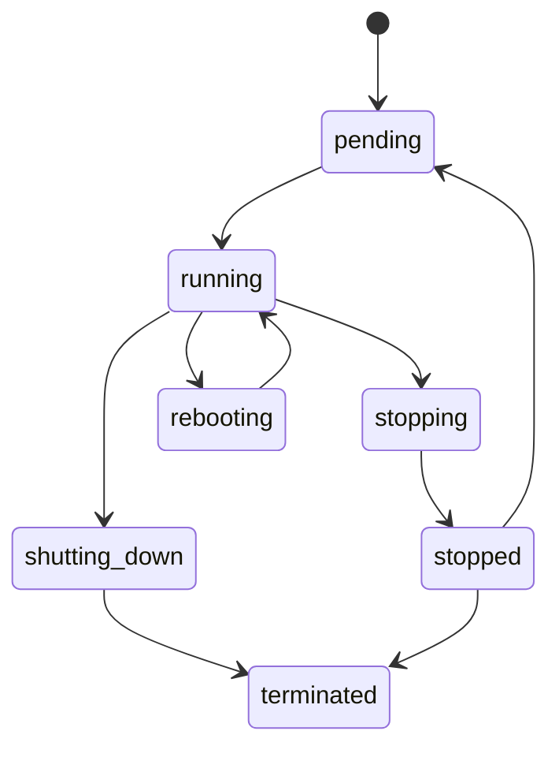
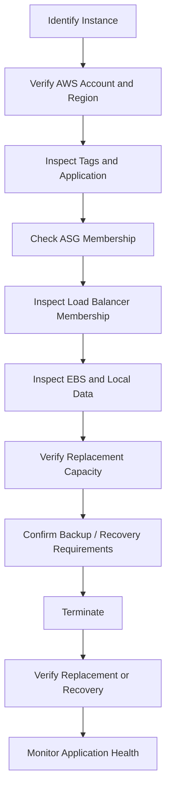

# 03- EC2 Instance Management

## Overview

EC2 instance management covers the operational lifecycle of an instance through the AWS CLI, including starting, stopping, rebooting, terminating, modifying, and inspecting instances.

The CLI operations themselves are simple. The production challenge is understanding their consequences.

A lifecycle operation can affect:

- Application availability
- Network addressing
- EBS volumes
- Instance-store data
- Auto Scaling behavior
- Load balancer registration
- Database connections
- Long-running requests
- Cost
- Infrastructure-as-Code state
- Disaster recovery

A safe operational model is:

```text
Identify
   |
   v
Inspect
   |
   v
Understand Dependencies
   |
   v
Choose Lifecycle Operation
   |
   v
Execute
   |
   v
Verify
   |
   v
Observe
```

Never treat `start`, `stop`, `reboot`, and `terminate` as interchangeable operations.

## Instance Lifecycle

A simplified EC2 lifecycle is:



The exact behavior depends on the operation and instance configuration.

The most important operational distinction is:

| Operation | Typical Purpose | Instance Identity | Persistent EBS Data |
|---|---|---|---|
| Start | Bring a stopped instance online | Preserved | Preserved |
| Stop | Power off an EBS-backed instance | Preserved | Preserved |
| Reboot | Restart the operating system | Preserved | Preserved |
| Terminate | Permanently remove the instance | Removed | Depends on volume deletion settings |

## Inspect Before Managing

Before changing an instance, inspect it.

```bash
aws ec2 describe-instances \
    --instance-ids i-0123456789abcdef0 \
    --region ap-south-1
```

A more useful operational view:

```bash
aws ec2 describe-instances \
    --instance-ids i-0123456789abcdef0 \
    --region ap-south-1 \
    --query 'Reservations[0].Instances[0].{
        ID:InstanceId,
        Name:Tags[?Key==`Name`].Value | [0],
        Environment:Tags[?Key==`Environment`].Value | [0],
        State:State.Name,
        Type:InstanceType,
        AZ:Placement.AvailabilityZone,
        VPC:VpcId,
        Subnet:SubnetId,
        PrivateIP:PrivateIpAddress,
        PublicIP:PublicIpAddress,
        AMI:ImageId
    }' \
    --output table
```

Before a production change, also verify:

```bash
aws sts get-caller-identity
```

Confirm:

- AWS account
- Region
- Instance ID
- Environment
- Application
- Instance ownership
- Auto Scaling membership
- Infrastructure-as-Code ownership
- Attached storage
- Load balancer membership

## Starting an Instance

Start a stopped instance:

```bash
aws ec2 start-instances \
    --instance-ids i-0123456789abcdef0 \
    --region ap-south-1
```

The API returns the previous and current state.

Check the result:

```bash
aws ec2 describe-instances \
    --instance-ids i-0123456789abcdef0 \
    --region ap-south-1 \
    --query 'Reservations[0].Instances[0].State.Name' \
    --output text
```

The state may initially be:

```text
pending
```

and later become:

```text
running
```

### Starting Does Not Mean Healthy

After the state becomes `running`, check status:

```bash
aws ec2 describe-instance-status \
    --instance-ids i-0123456789abcdef0 \
    --include-all-instances \
    --region ap-south-1
```

Then validate the application.

For a web service:

```text
EC2 running
    |
    v
Status checks passing
    |
    v
Application process running
    |
    v
Port listening
    |
    v
ALB target healthy
    |
    v
Application serving traffic
```

## Starting Multiple Instances

Multiple instances can be started in one command:

```bash
aws ec2 start-instances \
    --instance-ids \
        i-0123456789abcdef0 \
        i-0abcdef1234567890 \
    --region ap-south-1
```

For tag-based workflows, first identify the resources:

```bash
aws ec2 describe-instances \
    --filters \
        "Name=tag:Environment,Values=staging" \
        "Name=instance-state-name,Values=stopped" \
    --query 'Reservations[].Instances[].InstanceId' \
    --output text
```

Then explicitly review the IDs before executing lifecycle changes.

Avoid blindly piping broad discovery output into destructive or high-impact operations.

## Stopping an Instance

Stop an EBS-backed instance:

```bash
aws ec2 stop-instances \
    --instance-ids i-0123456789abcdef0 \
    --region ap-south-1
```

The instance transitions through:

```text
running
   |
   v
stopping
   |
   v
stopped
```

### When to Stop

Stopping is useful for:

- Development environments
- Test environments
- Temporary workloads
- Instances requiring maintenance
- Cost reduction for workloads that do not need continuous availability

### Production Consideration

Stopping a production instance behind an ALB is normally an availability event unless sufficient healthy capacity exists elsewhere.

If the instance belongs to an Auto Scaling Group, understand the ASG's desired capacity and health-management behavior before stopping it.

## Rebooting an Instance

Reboot:

```bash
aws ec2 reboot-instances \
    --instance-ids i-0123456789abcdef0 \
    --region ap-south-1
```

A reboot restarts the operating system while generally preserving the instance identity.

### When to Reboot

A reboot may be appropriate for:

- OS-level recovery
- Kernel updates
- Certain system-level failures
- Controlled maintenance
- Recovering from a transient OS problem

### When Not to Reboot Immediately

Do not use reboot as the default response to every incident.

First investigate:

- Status checks
- CPU
- Memory
- Disk
- Network
- Application logs
- System logs
- Load balancer health
- Database dependencies

A reboot can remove useful diagnostic evidence.

## Reboot vs Stop and Start

These operations have different semantics.

| Operation | Typical Effect |
|---|---|
| Reboot | Restarts the operating system |
| Stop/Start | Stops and later starts the instance |
| Terminate | Removes the instance |

For production troubleshooting, understand which resources may change and what application impact is acceptable before selecting the operation.

## Terminating an Instance

Terminate:

```bash
aws ec2 terminate-instances \
    --instance-ids i-0123456789abcdef0 \
    --region ap-south-1
```

Typical lifecycle:

```text
running
   |
   v
shutting-down
   |
   v
terminated
```

Termination is fundamentally different from stopping.

It is generally irreversible from the perspective of that specific instance.

### Before Termination

Check:

```bash
aws ec2 describe-instances \
    --instance-ids i-0123456789abcdef0 \
    --region ap-south-1 \
    --query 'Reservations[0].Instances[0].{
        ID:InstanceId,
        State:State.Name,
        AMI:ImageId,
        RootDevice:RootDeviceName,
        BlockDevices:BlockDeviceMappings,
        Tags:Tags
    }'
```

Determine:

- Is it production?
- Is it in an ASG?
- Does it contain unique data?
- Which EBS volumes are attached?
- Which volumes have `DeleteOnTermination` enabled?
- Does it have instance-store data?
- Is it registered behind a load balancer?
- Is it managed by Terraform or CloudFormation?
- Is there a replacement instance?

## EBS and Termination

Whether an EBS volume survives termination depends on its `DeleteOnTermination` configuration.

Inspect the setting:

```bash
aws ec2 describe-instances \
    --instance-ids i-0123456789abcdef0 \
    --query 'Reservations[0].Instances[0].BlockDeviceMappings[].{
        Device:DeviceName,
        Volume: Ebs.VolumeId,
        DeleteOnTermination:Ebs.DeleteOnTermination
    }'
```

Example:

```text
Device    Volume                 DeleteOnTermination
/dev/xvda vol-0123456789abcdef0 true
/dev/sdf  vol-0abcdef1234567890 false
```

Do not assume that terminating an instance either deletes or preserves every attached volume.

### Production Principle

Durable application state should generally not depend on the lifecycle of an individual EC2 instance.

Prefer appropriate services such as:

- EBS for required block storage
- EFS for shared filesystem workloads
- S3 for object storage
- RDS for relational databases
- Redis-compatible services for caching where appropriate

## Instance Store and Termination

Instance-store data is ephemeral.

Do not use instance store as the sole location for critical application data.

A useful mental model is:

```text
EC2
 |
 +--> Instance Store
 |       |
 |       +--> Ephemeral
 |
 +--> EBS
 |       |
 |       +--> Persistent block storage
 |
 +--> S3
         |
         +--> Durable object storage
```

The correct storage choice depends on workload requirements.

## Modify Instance Attributes

Some EC2 configuration can be modified after launch.

For example, changing the instance type:

```bash
aws ec2 modify-instance-attribute \
    --instance-id i-0123456789abcdef0 \
    --instance-type '{"Value":"m7i.large"}' \
    --region ap-south-1
```

Changing instance type generally requires the instance to be stopped.

### Important

Do not use direct instance modification as the primary deployment strategy for an Auto Scaling fleet.

For managed fleets, prefer:

```text
New Launch Template Version
          |
          v
ASG Update
          |
          v
Controlled Replacement
```

This makes infrastructure changes reproducible.

## Modify Instance Shutdown Behavior

EC2 can be configured for shutdown behavior.

For example:

```bash
aws ec2 modify-instance-attribute \
    --instance-id i-0123456789abcdef0 \
    --instance-initiated-shutdown-behavior terminate \
    --region ap-south-1
```

Possible behaviors include:

```text
stop
terminate
```

This setting should be treated carefully because an operating-system shutdown can have different consequences depending on the configuration.

Inspect the current configuration where needed.

## Modify Termination Protection

Termination protection can help prevent accidental termination.

Enable it:

```bash
aws ec2 modify-instance-attribute \
    --instance-id i-0123456789abcdef0 \
    --disable-api-termination \
    --region ap-south-1
```

Disable it:

```bash
aws ec2 modify-instance-attribute \
    --instance-id i-0123456789abcdef0 \
    --no-disable-api-termination \
    --region ap-south-1
```

### Important Limitation

Termination protection is not a replacement for proper infrastructure controls.

It should not be used as the primary mechanism for production safety.

Use:

- IAM least privilege
- Change management
- Infrastructure as Code
- Approval workflows
- Backups
- Automation safeguards

## Modify Stop Protection

EC2 also supports stop protection.

Enable:

```bash
aws ec2 modify-instance-attribute \
    --instance-id i-0123456789abcdef0 \
    --disable-api-stop \
    --region ap-south-1
```

Disable:

```bash
aws ec2 modify-instance-attribute \
    --instance-id i-0123456789abcdef0 \
    --no-disable-api-stop \
    --region ap-south-1
```

Use such controls selectively. Operational safeguards should complement, not replace, proper access control.

## Instance Console Output

When an instance has boot or OS-level problems, console output can provide useful diagnostics.

```bash
aws ec2 get-console-output \
    --instance-id i-0123456789abcdef0 \
    --region ap-south-1
```

This can be useful when normal network access is unavailable.

For example:

```text
EC2
 |
 X SSH unavailable
 |
 v
Instance status / console output
 |
 v
Boot diagnostics
```

Use it alongside status checks and other recovery mechanisms.

## Instance Reachability Checks

After a lifecycle operation, verify the instance in layers.

### EC2 State

```bash
aws ec2 describe-instances \
    --instance-ids i-0123456789abcdef0 \
    --query 'Reservations[0].Instances[0].State.Name' \
    --output text
```

### Status Checks

```bash
aws ec2 describe-instance-status \
    --instance-ids i-0123456789abcdef0 \
    --include-all-instances
```

### Network

Verify:

- Private IP
- Public IP if applicable
- Security Groups
- Route path
- Load balancer target health

### Application

Test the service:

```bash
curl -f http://<endpoint>/health
```

The endpoint should be appropriate for the application's architecture.

## Public IP Considerations

Stopping and starting an EC2 instance can change its automatically assigned public IPv4 address.

Therefore, avoid treating an auto-assigned public IP as a permanent service identity.

Prefer:

```text
Route 53
   |
   v
ALB
   |
   v
Private EC2
```

or, where a stable public IPv4 address is genuinely required:

```text
Elastic IP
   |
   v
EC2
```

For scalable backend services, an ALB or other appropriate abstraction is generally preferable to binding clients directly to individual instance addresses.

## Managing Instances Behind a Load Balancer

Suppose:

```text
ALB
 |
 +--> EC2-A
 |
 +--> EC2-B
 |
 +--> EC2-C
```

Stopping EC2-B may be safe if:

- EC2-A and EC2-C have enough capacity
- The load balancer detects the target as unhealthy
- Existing connections are handled appropriately
- The application is stateless or state is externalized

The same action may be unsafe if EC2-B is the only healthy instance.

Always inspect target health and fleet capacity before maintenance.

## Managing Auto Scaling Group Instances

An EC2 instance managed by an ASG should generally not be treated as an independent long-lived server.

Conceptually:

```text
ASG
 |
 +--> EC2-A
 +--> EC2-B
 +--> EC2-C
```

If EC2-B fails:

```text
EC2-B
  |
  v
Unhealthy
  |
  v
ASG detects failure
  |
  v
Replacement EC2
```

Manually stopping or terminating an instance can therefore cause the ASG to launch a replacement.

Before doing so, inspect:

```bash
aws autoscaling describe-auto-scaling-instances \
    --instance-ids i-0123456789abcdef0
```

## Instance Management in an ASG

For planned maintenance, use the appropriate ASG lifecycle mechanisms rather than simply terminating an instance.

A typical operational sequence is:

```text
Identify instance
      |
      v
Check ASG membership
      |
      v
Understand desired capacity
      |
      v
Drain traffic if required
      |
      v
Perform maintenance / replacement
      |
      v
Verify replacement health
```

For immutable infrastructure, replacing the instance with a known-good configuration is often preferable to manually repairing it.

## Instance Management and Infrastructure as Code

If Terraform manages an instance:

```text
Terraform
    |
    v
Desired State
    |
    v
EC2
```

A manual CLI change can produce:

```text
Desired State
      !=
Actual State
```

For example, manually changing an instance type may be overwritten by the next Terraform apply.

Before making persistent configuration changes, determine the infrastructure source of truth.

## Batch Operations

The CLI supports operating on multiple instance IDs.

Start:

```bash
aws ec2 start-instances \
    --instance-ids \
        i-0123456789abcdef0 \
        i-0abcdef1234567890 \
    --region ap-south-1
```

Stop:

```bash
aws ec2 stop-instances \
    --instance-ids \
        i-0123456789abcdef0 \
        i-0abcdef1234567890 \
    --region ap-south-1
```

Reboot:

```bash
aws ec2 reboot-instances \
    --instance-ids \
        i-0123456789abcdef0 \
        i-0abcdef1234567890 \
    --region ap-south-1
```

### Production Warning

Batch operations increase blast radius.

Before operating on multiple instances, verify:

- All instances belong to the intended environment
- Sufficient capacity remains
- Instances are not concentrated in one AZ
- Critical services have redundancy
- The operation will not exceed application capacity

## Finding Stopped Instances

List stopped instances:

```bash
aws ec2 describe-instances \
    --filters "Name=instance-state-name,Values=stopped" \
    --query 'Reservations[].Instances[].{
        ID:InstanceId,
        Name:Tags[?Key==`Name`].Value | [0],
        Type:InstanceType,
        AZ:Placement.AvailabilityZone,
        LaunchTime:LaunchTime
    }' \
    --output table
```

This is useful for identifying potentially idle development or test resources.

However, a stopped instance can still incur charges for resources such as EBS volumes.

Stopping the instance does not necessarily mean the resource costs become zero.

## Finding Running Instances

```bash
aws ec2 describe-instances \
    --filters "Name=instance-state-name,Values=running" \
    --query 'Reservations[].Instances[].{
        ID:InstanceId,
        Name:Tags[?Key==`Name`].Value | [0],
        Type:InstanceType,
        AZ:Placement.AvailabilityZone,
        PrivateIP:PrivateIpAddress
    }' \
    --output table
```

For a production environment:

```bash
aws ec2 describe-instances \
    --filters \
        "Name=instance-state-name,Values=running" \
        "Name=tag:Environment,Values=production" \
    --query 'Reservations[].Instances[].{
        ID:InstanceId,
        Name:Tags[?Key==`Name`].Value | [0],
        Application:Tags[?Key==`Application`].Value | [0],
        Type:InstanceType,
        AZ:Placement.AvailabilityZone
    }' \
    --output table
```

## Safe Termination Workflow

A production-safe termination workflow can be represented as:



This process is intentionally more involved than the CLI command itself.

The risk is usually not the command syntax. The risk is operating on the wrong resource or misunderstanding its dependencies.

## Safe Start/Stop Workflow

For maintenance:

```text
Identify
   |
   v
Check application redundancy
   |
   v
Drain traffic if required
   |
   v
Stop
   |
   v
Perform maintenance
   |
   v
Start
   |
   v
Check status
   |
   v
Check application
   |
   v
Restore traffic
```

For a single-instance production workload, stopping the instance is an availability event unless another serving path exists.

## Operational Command Reference

| Operation | Command |
|---|---|
| Describe | `aws ec2 describe-instances` |
| Start | `aws ec2 start-instances` |
| Stop | `aws ec2 stop-instances` |
| Reboot | `aws ec2 reboot-instances` |
| Terminate | `aws ec2 terminate-instances` |
| Modify attributes | `aws ec2 modify-instance-attribute` |
| Instance status | `aws ec2 describe-instance-status` |
| Console output | `aws ec2 get-console-output` |
| Check ASG membership | `aws autoscaling describe-auto-scaling-instances` |

## Common Mistakes

### Treating Start, Stop, Reboot, and Terminate as Equivalent

They have different lifecycle and data implications.

Understand the expected state transition before executing the command.

### Terminating Before Inspecting Storage

An instance may have EBS volumes or application data that require preservation.

Inspect:

```bash
aws ec2 describe-instances \
    --instance-ids i-0123456789abcdef0 \
    --query 'Reservations[0].Instances[0].BlockDeviceMappings'
```

### Rebooting Without Collecting Evidence

A reboot may temporarily restore service while hiding the original failure.

Collect logs and metrics first when the situation permits.

### Directly Modifying ASG Instances

An ASG instance is generally replaceable capacity.

If the desired configuration must change, update the Launch Template or other source of truth and perform a controlled rollout.

### Ignoring Load Balancer Health

Stopping an instance behind an ALB can be safe or unsafe depending on remaining healthy capacity and connection behavior.

### Assuming Stopped Means Free

EBS volumes, snapshots, Elastic IPs where applicable, and other resources can continue to incur charges.

### Operating in the Wrong Account

Always verify:

```bash
aws sts get-caller-identity
```

before high-impact operations.

### Ignoring IaC Ownership

A manual CLI modification may be reverted by Terraform, CloudFormation, or another deployment system.

## Security Considerations

Instance lifecycle operations are high-impact permissions.

Avoid granting broad permissions such as unrestricted:

```text
ec2:*
```

when narrower permissions are sufficient.

For operational roles, separate:

```text
Read
```

from:

```text
Modify
```

and:

```text
Terminate
```

where practical.

Destructive permissions should be tightly controlled and auditable.

## Monitoring After Lifecycle Changes

After a lifecycle operation, monitor:

- EC2 status checks
- CPU
- Memory where collected
- Network traffic
- EBS metrics
- ALB target health
- Application latency
- Application error rate
- Database connections
- Redis health
- Queue depth

A successful API response from:

```bash
aws ec2 start-instances
```

only confirms that the lifecycle API accepted the operation. It does not prove the application is serving traffic correctly.

## Production Best Practices

### Prefer Immutable Replacement

For managed application fleets:

```text
Old Instance
     |
     v
New AMI / Launch Template
     |
     v
New Instance
     |
     v
Health Validation
     |
     v
Remove Old Instance
```

This reduces configuration drift.

### Keep Instances Stateless

Avoid storing critical state only on one EC2 instance.

Use appropriate durable services for:

- Database state
- Object storage
- Shared files
- Cache state
- Message queues

### Use Tags Consistently

At minimum, production resources should have useful ownership and environment metadata.

Example:

```text
Environment=production
Application=orders-api
Owner=backend-platform
ManagedBy=terraform
```

### Automate Repetitive Operations

If an operational workflow is repeatedly performed manually, consider:

- AWS Systems Manager
- Infrastructure as Code
- CI/CD
- Automation scripts
- AWS SDK
- Auto Scaling

The CLI is an excellent building block for automation, but repeated manual execution should not become the long-term operating model.

## Key Takeaways

- **Start, stop, reboot, and terminate have different operational consequences:** choose the lifecycle operation based on availability, data, and recovery requirements.
- **Inspect before changing:** verify account, region, instance ownership, ASG membership, load balancer state, storage, and application dependencies.
- **Treat ASG instances as replaceable capacity:** change the Launch Template or managed configuration rather than manually maintaining individual instances.
- **Termination requires explicit data and dependency analysis:** inspect EBS `DeleteOnTermination`, instance-store usage, backups, and replacement capacity before proceeding.
- **A successful EC2 API operation does not equal application health:** validate status checks, load balancer health, application behavior, and downstream dependencies after every significant lifecycle change.