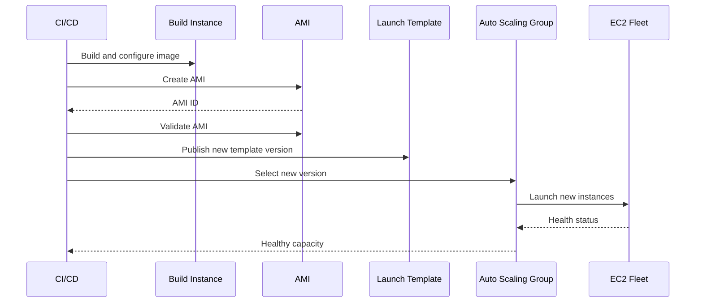

# 04- AMI Management

## Overview

An Amazon Machine Image (AMI) is a reusable image definition used to launch EC2 instances with a known operating system, software stack, configuration, and storage layout.

AMI management is central to:

- Immutable infrastructure
- Auto Scaling
- Disaster recovery
- Golden-image workflows
- Blue/green deployments
- Environment replication
- Application versioning
- Fast instance provisioning

A production AMI should represent a known-good server state rather than an arbitrary snapshot of a manually modified instance.

A typical image lifecycle is:

```text
Build / Configure
       |
       v
Validate
       |
       v
Create AMI
       |
       v
Test AMI
       |
       v
Publish / Tag
       |
       v
Use in Launch Template
       |
       v
Deploy / Scale
       |
       v
Retire Old AMI
       |
       v
Deregister
```

## AMI Components

An AMI contains the information required to launch an EC2 instance.

Important characteristics include:

| Component | Purpose |
|---|---|
| AMI ID | Unique identifier for the image |
| Architecture | CPU architecture such as x86_64 or arm64 |
| Root device | Defines the root storage configuration |
| Block device mappings | Defines EBS or instance-store mappings |
| Virtualization type | Defines how the instance is virtualized |
| Snapshot references | EBS-backed image data |
| Permissions | Controls who can use the AMI |
| Tags | Operational identification and lifecycle management |

An AMI is not simply a filesystem archive. It is an EC2 launch artifact containing image metadata and references to the storage required to create an instance.

## Why AMIs Matter

Without reusable images, infrastructure deployment can become:

```text
Launch Instance
    |
    v
Install OS
    |
    v
Install Python
    |
    v
Install Nginx
    |
    v
Install Application
    |
    v
Configure Dependencies
    |
    v
Start Services
```

This approach can create configuration drift and slow provisioning.

With a validated AMI:

```text
Validated AMI
     |
     +--> EC2-A
     +--> EC2-B
     +--> EC2-C
     +--> EC2-D
```

Every instance starts from a known baseline.

This is especially useful for:

- Django applications
- FastAPI services
- Celery workers
- gRPC services
- Nginx reverse proxies
- Kubernetes worker nodes
- Batch workloads

## Inspect Existing AMIs

List AMIs owned by the current account:

```bash
aws ec2 describe-images \
    --owners self \
    --region ap-south-1
```

Limit the output:

```bash
aws ec2 describe-images \
    --owners self \
    --region ap-south-1 \
    --query 'Images[].{
        ID:ImageId,
        Name:Name,
        State:State,
        Created:CreationDate,
        Architecture:Architecture,
        RootDevice:RootDeviceType
    }' \
    --output table
```

This is preferable to repeatedly inspecting the complete response.

## Inspect a Specific AMI

```bash
aws ec2 describe-images \
    --image-ids ami-0123456789abcdef0 \
    --region ap-south-1
```

Extract common fields:

```bash
aws ec2 describe-images \
    --image-ids ami-0123456789abcdef0 \
    --region ap-south-1 \
    --query 'Images[0].{
        ID:ImageId,
        Name:Name,
        Description:Description,
        State:State,
        Architecture:Architecture,
        RootDevice:RootDeviceType,
        Virtualization:VirtualizationType,
        Created:CreationDate
    }' \
    --output table
```

## Find AMIs by Name

Use filters when searching for a known image pattern:

```bash
aws ec2 describe-images \
    --owners self \
    --filters "Name=name,Values=payments-api-*" \
    --query 'Images[].{
        ID:ImageId,
        Name:Name,
        Created:CreationDate,
        State:State
    }' \
    --output table
```

For production image selection, also consider:

- Architecture
- Region
- Creation time
- Application version
- Security patch level
- Image state

Do not select an AMI solely because its name looks correct.

## AMI State

Inspect:

```bash
aws ec2 describe-images \
    --image-ids ami-0123456789abcdef0 \
    --query 'Images[0].State' \
    --output text
```

A usable AMI should normally be in:

```text
available
```

An image that is not available should not be treated as a ready deployment artifact.

## Create an AMI from an EC2 Instance

Create an image:

```bash
aws ec2 create-image \
    --instance-id i-0123456789abcdef0 \
    --name "payments-api-2026-09-20" \
    --description "Production payments API image" \
    --region ap-south-1
```

The command returns an AMI ID.

Example:

```json
{
    "ImageId": "ami-0123456789abcdef0"
}
```

Store the returned ID in deployment metadata or inspect it directly.

## Wait for AMI Availability

After creating an image, wait for the AMI to become available:

```bash
aws ec2 wait image-available \
    --image-ids ami-0123456789abcdef0 \
    --region ap-south-1
```

This is useful in automation pipelines.

A deployment workflow can therefore be:

```text
Create AMI
    |
    v
Wait for availability
    |
    v
Validate AMI
    |
    v
Update Launch Template
    |
    v
Deploy
```

## AMI Creation and Application Consistency

Creating an AMI from a running instance has important consistency considerations.

For stateless application servers, the image may contain:

- OS
- Packages
- Application binaries
- Configuration
- Service definitions

Avoid capturing transient runtime state unnecessarily.

For databases and other stateful systems, image creation should not replace application-consistent backup strategies.

For example:

```text
PostgreSQL
    |
    +--> Database backup / snapshot strategy
    |
    X
    |
    +--> Do not rely only on an EC2 AMI
```

Use database-aware backup and recovery mechanisms for database workloads.

## Preparing an Instance Before AMI Creation

Before creating a golden image:

- Apply required security patches
- Remove temporary files
- Remove credentials
- Remove instance-specific identifiers
- Validate service configuration
- Verify startup behavior
- Remove unnecessary logs
- Confirm application health
- Confirm the instance can be safely reproduced

For Linux application servers, avoid baking secrets such as:

```text
AWS access keys
Database passwords
API tokens
Private keys
```

into the image.

Use IAM roles and runtime secret-management mechanisms instead.

## Golden AMI Pattern

A golden AMI is a standardized, validated image used as the baseline for multiple instances.


For a Python backend, the image might contain:

```text
Amazon Linux / Ubuntu
        |
        +--> Python
        +--> system dependencies
        +--> Nginx
        +--> application package
        +--> systemd service
        +--> monitoring agent
```

Runtime configuration should generally remain externalized.

## AMI Naming Strategy

Use deterministic naming.

Example:

```text
payments-api-2026-09-20
payments-api-2026-09-20-01
payments-api-v4.12.0
```

A useful naming strategy should make it possible to identify:

- Application
- Version
- Build
- Date

For example:

```text
payments-api-v4.12.0-build-184
```

Avoid names such as:

```text
new-image
latest
final
production-image
test2
```

These become ambiguous over time.

## AMI Tags

Tag images consistently:

```bash
aws ec2 create-tags \
    --resources ami-0123456789abcdef0 \
    --tags \
        Key=Application,Value=payments-api \
        Key=Environment,Value=production \
        Key=Version,Value=v4.12.0 \
        Key=ManagedBy,Value=ci-cd \
        Key=Owner,Value=backend-platform \
    --region ap-south-1
```

Tags can support:

- Ownership
- Cost analysis
- Lifecycle automation
- Compliance
- Image discovery
- Incident response

## Inspect AMI Tags

```bash
aws ec2 describe-images \
    --image-ids ami-0123456789abcdef0 \
    --query 'Images[0].Tags' \
    --output table
```

## AMI Block Device Mappings

Inspect storage mappings:

```bash
aws ec2 describe-images \
    --image-ids ami-0123456789abcdef0 \
    --query 'Images[0].BlockDeviceMappings'
```

Example structure:

```json
[
    {
        "DeviceName": "/dev/xvda",
        "Ebs": {
            "SnapshotId": "snap-0123456789abcdef0",
            "VolumeSize": 20,
            "VolumeType": "gp3",
            "DeleteOnTermination": true
        }
    }
]
```

This matters because launching an instance from the AMI creates storage based on the image definition.

## AMI and EBS Snapshots

For EBS-backed AMIs, image creation involves EBS snapshot data.

Conceptually:

```text
EC2 Instance
     |
     v
Create AMI
     |
     +--> AMI metadata
     |
     +--> EBS snapshot(s)
              |
              v
        Launchable image
```

This means AMI lifecycle management and snapshot lifecycle management are related.

Do not assume that deleting or deregistering an AMI automatically means all underlying snapshot data has been removed.

Storage lifecycle should be explicitly managed.

## Inspect AMI Snapshot References

```bash
aws ec2 describe-images \
    --image-ids ami-0123456789abcdef0 \
    --query 'Images[0].BlockDeviceMappings[].Ebs.SnapshotId' \
    --output text
```

Before deleting old image-related snapshots, verify that they are no longer required by retained AMIs or recovery workflows.

## Copy an AMI

Copy an AMI to another region:

```bash
aws ec2 copy-image \
    --source-image-id ami-0123456789abcdef0 \
    --source-region ap-south-1 \
    --region ap-southeast-1 \
    --name "payments-api-v4.12.0"
```

This is useful for:

- Multi-region deployments
- Disaster recovery
- Regional expansion
- Regional infrastructure replication

The copied AMI receives a new AMI ID in the destination region.

## Cross-Region AMI Architecture

```text
Primary Region
ap-south-1
     |
     | Copy AMI
     v
DR Region
ap-southeast-1
     |
     v
Launch Template
     |
     v
Recovery EC2 Fleet
```

An AMI copy is only one component of disaster recovery.

A complete DR strategy also requires consideration of:

- Database replication
- S3 replication
- Secrets
- DNS
- Networking
- IAM
- Load balancing
- Configuration
- Recovery automation

## Copying AMIs for Architecture Changes

An AMI can also be copied within the same region when a separate image artifact is required.

This can be useful for:

- Controlled image promotion
- Account/region workflows where supported
- Building independent image lifecycles

Always verify ownership and sharing requirements before assuming an AMI can be copied or launched in another account.

## Share an AMI

An AMI can be shared with specific AWS accounts where the image configuration and permissions support that workflow.

Inspect launch permissions:

```bash
aws ec2 describe-image-attribute \
    --image-id ami-0123456789abcdef0 \
    --attribute launchPermission \
    --region ap-south-1
```

Grant access to another AWS account:

```bash
aws ec2 modify-image-attribute \
    --image-id ami-0123456789abcdef0 \
    --launch-permission "Add=[{UserId=123456789012}]" \
    --region ap-south-1
```

Remove access:

```bash
aws ec2 modify-image-attribute \
    --image-id ami-0123456789abcdef0 \
    --launch-permission "Remove=[{UserId=123456789012}]" \
    --region ap-south-1
```

### Security Consideration

Do not make production AMIs broadly accessible without a specific requirement.

An AMI may contain:

- Application code
- Configuration
- Package caches
- Logs
- Certificates
- System information

Secrets should never be baked into the image.

## AMI Encryption Considerations

If the AMI uses encrypted EBS snapshots, the relevant KMS permissions and key policies must support the intended image lifecycle.

For cross-account or cross-region workflows, validate:

- KMS key permissions
- Snapshot permissions
- AMI launch permissions
- Destination-region requirements

Encryption does not eliminate the need for access-control design.

## Deregister an AMI

When an image is no longer needed:

```bash
aws ec2 deregister-image \
    --image-id ami-0123456789abcdef0 \
    --region ap-south-1
```

Deregistering removes the AMI registration.

It does not mean that every underlying storage artifact should automatically be treated as disposable.

## AMI Deregistration Workflow

Before deregistration:

```text
Identify AMI
    |
    v
Check Launch Template references
    |
    v
Check ASG references
    |
    v
Check deployment history
    |
    v
Check DR usage
    |
    v
Check retained snapshots
    |
    v
Deregister
    |
    v
Clean up unneeded snapshots
```

Never deregister an image solely because it is old.

Determine whether it is still required for:

- Rollback
- Disaster recovery
- Existing launch templates
- Compliance retention
- Reproducibility

## AMI and Launch Templates

Launch Templates commonly reference an AMI.

Example relationship:

```text
AMI
 |
 v
Launch Template
 |
 v
Auto Scaling Group
 |
 v
EC2 Instances
```

If a new AMI is created:

```text
AMI v1
   |
   v
Launch Template v1

AMI v2
   |
   v
Launch Template v2
```

A production rollout can then move the ASG to the new Launch Template version.

This is preferable to manually rebuilding individual instances.

## AMI-Based Deployment

A typical immutable deployment:



The important property is reproducibility.

## AMI Validation

Before promoting an AMI, validate:

### Operating System

- OS boots successfully
- Required packages are present
- Security patches are applied
- Time synchronization works

### Application

- Application starts
- Health endpoint responds
- Nginx configuration works
- Celery workers start if included
- Required Python dependencies are installed

### Networking

- Instance receives expected network configuration
- Required outbound connectivity works
- Security Groups are correct
- Service discovery works

### AWS Integration

- IAM role works
- S3 access works where required
- CloudWatch integration works
- Secrets can be retrieved

### Operational Behavior

- Instance can join the target fleet
- Health checks pass
- Logs are emitted
- Monitoring works

## AMI Testing Workflow

```text
Create AMI
    |
    v
Launch Test Instance
    |
    v
Run Smoke Tests
    |
    +--> OS
    +--> Application
    +--> Network
    +--> IAM
    +--> Monitoring
    |
    v
Promote AMI
```

Do not make an untested AMI the production Auto Scaling baseline.

## AMI Lifecycle Management

A practical lifecycle is:

| Stage | Purpose |
|---|---|
| Build | Create image from known configuration |
| Validate | Verify OS, application, security, and operations |
| Promote | Make image available for production use |
| Deploy | Reference image from Launch Template |
| Retain | Keep rollback and DR versions |
| Deprecate | Stop using image for new deployments |
| Deregister | Remove obsolete AMI |
| Clean up | Remove unneeded image-related snapshots |

## AMI Retention Strategy

Do not retain every AMI indefinitely.

A retention policy can be based on:

- Number of releases
- Age
- Compliance requirements
- Rollback requirements
- DR requirements

For example:

```text
Current
   |
   +--> Production

Previous
   |
   +--> Rollback

Older
   |
   +--> Retained according to policy

Expired
   |
   +--> Deregister
```

The exact retention period should come from operational and compliance requirements rather than an arbitrary number.

## Finding Old AMIs

List image creation dates:

```bash
aws ec2 describe-images \
    --owners self \
    --query 'Images[].{
        ID:ImageId,
        Name:Name,
        Created:CreationDate,
        State:State
    }' \
    --output table
```

Use tags to make automated retention safer.

For example:

```text
Application
Environment
Version
CreatedBy
RetentionClass
```

## AMI and CI/CD

AMI creation fits naturally into CI/CD pipelines.

A simplified workflow:

```text
Git Commit
   |
   v
Build
   |
   v
Test
   |
   v
Build Image
   |
   v
Launch Test EC2
   |
   v
Integration Tests
   |
   v
Create / Promote AMI
   |
   v
Update Launch Template
   |
   v
Rolling Deployment
```

For Python applications, the image can contain the application artifact and runtime dependencies while environment-specific configuration remains external.

## AMI and Configuration Management

Avoid embedding environment-specific values directly into a reusable AMI.

Bad pattern:

```text
AMI
 |
 +--> DATABASE_URL=production-db
 +--> API_KEY=production-secret
 +--> Environment=production
```

Better:

```text
AMI
 |
 +--> Application
 +--> Runtime
 +--> System configuration
 |
 v
Runtime Configuration
 |
 +--> Environment variables
 +--> Parameter Store
 +--> Secrets Manager
 +--> IAM role
```

This makes the same image reusable across environments.

## AMI and Docker

For Docker-based workloads, the AMI should generally provide the host baseline rather than encode every deployment-specific container state.

For example:

```text
AMI
 |
 +--> Linux
 +--> Docker
 +--> Monitoring
 +--> Security baseline
 |
 v
EC2
 |
 +--> Application containers
```

Container image versioning and AMI versioning should remain conceptually separate.

## AMI Security Considerations

A production image should follow a controlled security baseline.

Important controls include:

- Patch the base OS
- Remove unused packages
- Avoid hard-coded credentials
- Restrict image sharing
- Encrypt EBS-backed storage where required
- Track image provenance
- Scan application dependencies
- Scan OS packages
- Control who can create and deregister AMIs
- Retain audit information

An AMI is part of the software supply chain.

Treat it as a versioned production artifact.

## Common Mistakes

### Baking Secrets into AMIs

Secrets embedded in images can persist long after the original instance is terminated.

Use:

- IAM roles
- Secrets Manager
- Parameter Store
- Runtime environment configuration

instead.

### Treating AMIs as Backups for Databases

An EC2 image is not a substitute for database-aware backup and recovery.

Use the appropriate PostgreSQL/RDS backup strategy for database data.

### Deregistering an AMI Without Checking Dependencies

Before deregistration, check:

- Launch Templates
- ASGs
- Rollback procedures
- DR procedures
- Retention requirements

### Keeping Unlimited AMIs

Unlimited image retention creates:

- Storage cost
- Operational clutter
- Ambiguous deployment choices
- More difficult incident response

Implement lifecycle policies.

### Using `latest` as an AMI Identity

A mutable label is less useful than an immutable version.

Prefer:

```text
payments-api-v4.12.0-build-184
```

over:

```text
payments-api-latest
```

### Building AMIs by Manual Configuration

Manual server modification creates configuration drift.

Prefer:

```text
Code
  |
  v
Automated Build
  |
  v
Validated AMI
```

### Forgetting Architecture Compatibility

An `arm64` AMI cannot simply be treated as interchangeable with an `x86_64` image.

Ensure the AMI architecture matches the target instance family and application binaries.

### Ignoring Region Scope

An AMI is regional.

If the workload moves to another region, the image may need to be copied to the destination region before it can be used there.

## Operational Safety Checklist

Before creating an AMI:

```text
[ ] Source instance identified
[ ] Application state understood
[ ] Temporary files removed
[ ] Secrets removed
[ ] Security patches applied
[ ] Application validated
[ ] Monitoring validated
[ ] IAM role validated
[ ] Storage mappings reviewed
[ ] Naming convention applied
[ ] Tags prepared
```

Before promoting an AMI:

```text
[ ] AMI is available
[ ] Test instance launched
[ ] OS boots successfully
[ ] Application starts
[ ] Health checks pass
[ ] Networking works
[ ] IAM access works
[ ] Monitoring works
[ ] Required dependencies work
[ ] Rollback image retained
```

Before deregistering:

```text
[ ] Launch Templates checked
[ ] ASGs checked
[ ] Deployment history checked
[ ] Rollback requirements checked
[ ] DR requirements checked
[ ] Retention policy checked
[ ] Snapshot dependencies checked
[ ] Deregistration approved
```

## Command Reference

| Operation | CLI |
|---|---|
| List own AMIs | `aws ec2 describe-images --owners self` |
| Inspect AMI | `aws ec2 describe-images --image-ids <ami-id>` |
| Create AMI | `aws ec2 create-image --instance-id <instance-id> --name <name>` |
| Wait for AMI | `aws ec2 wait image-available --image-ids <ami-id>` |
| Copy AMI | `aws ec2 copy-image ...` |
| Inspect permissions | `aws ec2 describe-image-attribute --attribute launchPermission` |
| Share AMI | `aws ec2 modify-image-attribute --launch-permission ...` |
| Tag AMI | `aws ec2 create-tags --resources <ami-id> ...` |
| Deregister AMI | `aws ec2 deregister-image --image-id <ami-id>` |

## Senior-Level AMI Design

A mature EC2 platform treats AMIs as immutable infrastructure artifacts:

```text
Source Code
    |
    v
Automated Build
    |
    v
Security Validation
    |
    v
AMI
    |
    v
Integration Testing
    |
    v
Launch Template Version
    |
    v
Auto Scaling Group
    |
    v
Production Fleet
    |
    v
Observability
    |
    v
Retirement
```

The goal is not merely to create images.

The goal is to make infrastructure:

- Reproducible
- Versioned
- Testable
- Auditable
- Replaceable
- Recoverable

This is what makes AMI-based infrastructure suitable for production-scale EC2 environments.

## Key Takeaways

- **Treat AMIs as immutable, versioned deployment artifacts:** build them reproducibly and validate them before production use.
- **Separate image content from runtime configuration:** never bake secrets or environment-specific credentials into reusable AMIs.
- **AMI lifecycle includes storage and dependencies:** understand EBS snapshot references, Launch Templates, ASGs, rollback requirements, and DR usage before deregistering images.
- **Use AMIs with Launch Templates and Auto Scaling for reproducible infrastructure:** replace instances from a known image instead of manually repairing long-lived servers.
- **A production AMI requires validation and retention discipline:** test boot, application, networking, IAM, and monitoring behavior, then retain only the versions required for rollback, recovery, and compliance.