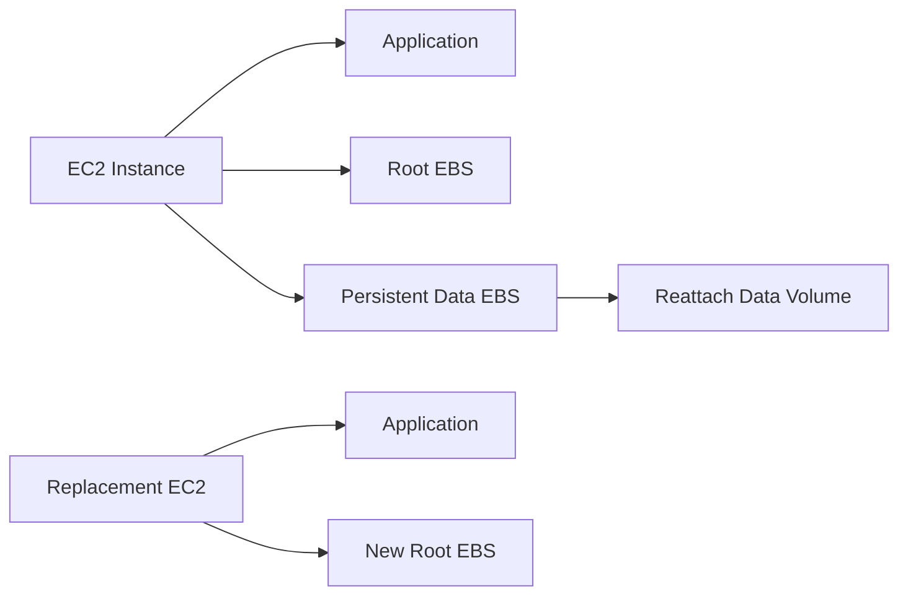
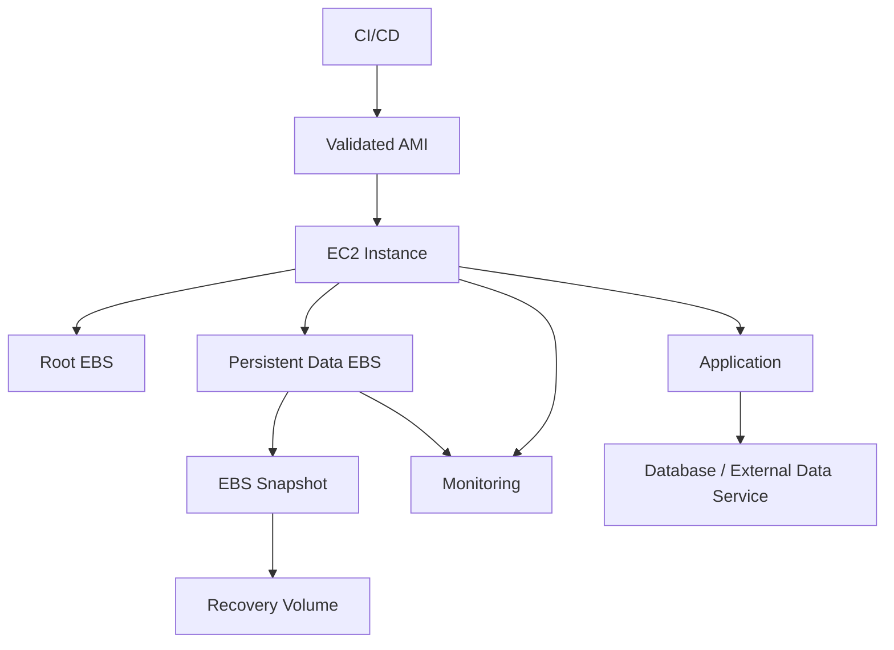

# 05- EBS Volume Management

## Overview

Amazon Elastic Block Store (EBS) provides persistent block storage for EC2 instances. Unlike instance store, EBS volumes are designed to persist independently of the compute instance and can be attached, detached, resized, snapshotted, and restored.

AWS CLI-based EBS management is important for production operations such as:

- Inspecting attached storage
- Attaching data volumes
- Expanding capacity
- Changing volume performance
- Recovering from instance failures
- Replacing EC2 instances without losing persistent data
- Automating storage operations
- Troubleshooting disk and attachment issues

The core lifecycle is:

```text
Create Volume
     |
     v
Inspect Volume
     |
     v
Attach to EC2
     |
     v
Format / Mount
     |
     v
Use
     |
     +----> Modify
     |
     +----> Snapshot
     |
     +----> Detach
     |
     v
Delete when no longer required
```

## EBS Volume Model

An EBS volume is a block device that exists independently from the EC2 instance to which it is attached.

```text
EC2 Instance
     |
     | Attach
     v
EBS Volume
     |
     +--> Filesystem
     |
     +--> Application Data
```

The AWS control plane manages the volume, while the operating system manages the filesystem and mount point.

This distinction is important:

| Layer | Responsibility |
|---|---|
| AWS | Volume creation, attachment, size, type, IOPS, throughput |
| Linux | Device discovery, partitioning, filesystem, mounting |
| Application | Reading and writing files |
| Backup system | Snapshots and recovery |

Changing an EBS volume through AWS CLI does not automatically configure the filesystem inside the operating system.

## EBS Volume Types

Common EBS volume types include:

| Type | Typical Use |
|---|---|
| `gp3` | General-purpose production workloads |
| `gp2` | Older general-purpose workloads |
| `io2` | High-performance, latency-sensitive workloads |
| `st1` | Throughput-oriented workloads |
| `sc1` | Lowest-cost cold sequential workloads |

For most general-purpose backend workloads, `gp3` is a common starting point because capacity, IOPS, and throughput can be configured independently within the supported limits.

For database workloads requiring sustained high I/O performance, provisioned-IOPS volume types may be appropriate.

## List EBS Volumes

List volumes in a region:

```bash
aws ec2 describe-volumes \
    --region ap-south-1
```

A more useful operational view:

```bash
aws ec2 describe-volumes \
    --region ap-south-1 \
    --query 'Volumes[].{
        ID:VolumeId,
        Size:Size,
        Type:VolumeType,
        State:State,
        AZ:AvailabilityZone,
        IOPS:Iops,
        Throughput:Throughput,
        Encrypted:Encrypted
    }' \
    --output table
```

## Inspect a Specific Volume

```bash
aws ec2 describe-volumes \
    --volume-ids vol-0123456789abcdef0 \
    --region ap-south-1
```

Extract important fields:

```bash
aws ec2 describe-volumes \
    --volume-ids vol-0123456789abcdef0 \
    --query 'Volumes[0].{
        ID:VolumeId,
        Size:Size,
        Type:VolumeType,
        State:State,
        AZ:AvailabilityZone,
        IOPS:Iops,
        Throughput:Throughput,
        Encrypted:Encrypted,
        KMSKey:KmsKeyId
    }' \
    --output table
```

## Volume States

The `State` field describes the AWS-side lifecycle state.

Common states include:

| State | Meaning |
|---|---|
| `creating` | Volume creation is in progress |
| `available` | Volume is ready to be attached |
| `in-use` | Volume is attached |
| `deleting` | Volume deletion is in progress |
| `deleted` | Volume has been deleted |
| `error` | Volume encountered an error |

A production workflow should verify the state before performing an operation.

For example, attaching an already attached volume requires different reasoning from attaching an `available` volume.

## Create an EBS Volume

Create a `gp3` volume:

```bash
aws ec2 create-volume \
    --availability-zone ap-south-1a \
    --volume-type gp3 \
    --size 100 \
    --region ap-south-1
```

The response includes the new volume ID.

Example:

```json
{
    "VolumeId": "vol-0123456789abcdef0"
}
```

## Create an Encrypted Volume

Encryption should generally be enabled for production data volumes.

```bash
aws ec2 create-volume \
    --availability-zone ap-south-1a \
    --volume-type gp3 \
    --size 100 \
    --encrypted \
    --region ap-south-1
```

When a specific KMS key is required:

```bash
aws ec2 create-volume \
    --availability-zone ap-south-1a \
    --volume-type gp3 \
    --size 100 \
    --encrypted \
    --kms-key-id arn:aws:kms:ap-south-1:123456789012:key/xxxxxxxx-xxxx-xxxx-xxxx-xxxxxxxxxxxx \
    --region ap-south-1
```

KMS permissions and key policies must support the intended workload and operational identities.

## Availability Zone Constraint

An EBS volume is tied to an Availability Zone.

For example:

```text
ap-south-1a
    |
    +--> EC2 instance
    +--> EBS volume
```

A volume created in `ap-south-1a` cannot normally be directly attached to an EC2 instance in `ap-south-1b`.

To move storage across Availability Zones, use a snapshot-based workflow:

```text
EBS Volume
    |
    v
Snapshot
    |
    v
Create Volume in Target AZ
    |
    v
Attach to Target EC2
```

This is a fundamental operational constraint when designing HA architectures.

## Attach an EBS Volume

Attach a volume:

```bash
aws ec2 attach-volume \
    --volume-id vol-0123456789abcdef0 \
    --instance-id i-0123456789abcdef0 \
    --device /dev/sdf \
    --region ap-south-1
```

Verify the attachment:

```bash
aws ec2 describe-volumes \
    --volume-ids vol-0123456789abcdef0 \
    --query 'Volumes[0].Attachments' \
    --output table
```

The AWS device name and the device name visible inside Linux are not necessarily identical.

For example:

```text
AWS attachment:
    /dev/sdf

Linux:
    /dev/nvme1n1
```

Do not assume that `/dev/sdf` will be the exact path used by the application.

## Inspect Instance Block Devices

Find the volumes attached to an instance:

```bash
aws ec2 describe-instances \
    --instance-ids i-0123456789abcdef0 \
    --query 'Reservations[].Instances[].BlockDeviceMappings' \
    --output table
```

For a compact mapping:

```bash
aws ec2 describe-instances \
    --instance-ids i-0123456789abcdef0 \
    --query 'Reservations[].Instances[].BlockDeviceMappings[].{
        Device:DeviceName,
        Volume:BlockDevice.Ebs.VolumeId,
        DeleteOnTermination:BlockDevice.Ebs.DeleteOnTermination
    }' \
    --output table
```

## AWS Device Mapping vs Linux Device

The AWS control plane may expose a device name such as:

```text
/dev/sdf
```

Modern Linux EC2 instances commonly expose EBS devices through NVMe:

```text
/dev/nvme1n1
```

Inside the instance, inspect devices with:

```bash
lsblk
```

Check filesystem information:

```bash
lsblk -f
```

Check mounted filesystems:

```bash
df -h
```

This distinction is important during operational troubleshooting.

## Formatting and Mounting

AWS CLI handles the infrastructure attachment. The operating system must still prepare the device.

Example Linux workflow:

```bash
lsblk

sudo mkfs.xfs /dev/nvme1n1

sudo mkdir -p /data

sudo mount /dev/nvme1n1 /data

df -h /data
```

Formatting destroys existing filesystem data.

Never run `mkfs` against an unknown production device.

Before formatting:

```bash
lsblk
sudo blkid
```

Confirm the correct volume using its metadata and filesystem identifiers.

## Persistent Mounting

A manually mounted volume may not automatically remount after reboot.

Production systems should use `/etc/fstab` with a stable identifier such as a filesystem UUID.

Inspect the UUID:

```bash
sudo blkid /dev/nvme1n1
```

Example:

```text
/dev/nvme1n1: UUID="..." TYPE="xfs"
```

Then configure `/etc/fstab` appropriately.

Validate the configuration before relying on a reboot:

```bash
sudo mount -a
```

A broken `/etc/fstab` entry can prevent normal boot or leave required application storage unavailable.

## Detach an EBS Volume

Detach a volume:

```bash
aws ec2 detach-volume \
    --volume-id vol-0123456789abcdef0 \
    --region ap-south-1
```

Wait for the volume to become available:

```bash
aws ec2 wait volume-available \
    --volume-ids vol-0123456789abcdef0 \
    --region ap-south-1
```

Before detaching a production volume:

1. Stop application writes.
2. Flush pending writes.
3. Unmount the filesystem.
4. Verify the device is no longer actively used.
5. Detach the volume.
6. Verify the AWS volume state.

For Linux:

```bash
sudo sync
sudo umount /data
```

Do not casually detach a mounted filesystem.

## Force Detachment

Force detachment is an emergency operation and should not be the normal workflow.

It can leave filesystem or application state inconsistent.

Before considering forceful recovery:

- Confirm the instance is unavailable or unrecoverable.
- Understand whether applications are still writing.
- Check recovery and backup options.
- Prefer controlled shutdown or filesystem unmount where possible.

Operational recovery should prioritize data integrity over speed.

## Modify an EBS Volume

Modify volume attributes:

```bash
aws ec2 modify-volume \
    --volume-id vol-0123456789abcdef0 \
    --size 200 \
    --volume-type gp3 \
    --iops 6000 \
    --throughput 250 \
    --region ap-south-1
```

The exact valid combinations depend on the volume type and current AWS limits.

Inspect the modification:

```bash
aws ec2 describe-volumes-modifications \
    --volume-ids vol-0123456789abcdef0 \
    --region ap-south-1
```

A modification can move through states such as:

```text
modifying
    |
    v
optimizing
    |
    v
completed
```

Do not assume that changing the AWS volume size immediately means the filesystem has also grown.

## Increasing Volume Size

Increasing an EBS volume is normally a two-layer operation:

```text
AWS Layer
    |
    v
Increase EBS Volume Size
    |
    v
OS Layer
    |
    v
Expand Partition / Filesystem
```

For example:

```bash
aws ec2 modify-volume \
    --volume-id vol-0123456789abcdef0 \
    --size 200 \
    --region ap-south-1
```

Then inspect from the instance:

```bash
lsblk
df -h
```

The filesystem may require an operating-system-specific expansion procedure.

For XFS:

```bash
sudo xfs_growfs /data
```

For ext4, filesystem growth commonly uses:

```bash
sudo resize2fs /dev/nvme1n1
```

The correct command depends on the filesystem and whether a partition exists.

## Shrinking Volumes

Shrinking an EBS volume is not the normal online resizing workflow.

Do not simply reduce the AWS volume size and expect the filesystem to remain intact.

A safer pattern for reducing capacity is:

```text
Existing Volume
     |
     v
Snapshot / Backup
     |
     v
Create Smaller Volume
     |
     v
Restore / Copy Data
     |
     v
Validate
     |
     v
Switch Application
```

Filesystem-aware migration is required.

## Changing Volume Type

A volume can be modified to another supported EBS type:

```bash
aws ec2 modify-volume \
    --volume-id vol-0123456789abcdef0 \
    --volume-type gp3 \
    --region ap-south-1
```

This can be useful when moving from older general-purpose storage to a newer configuration.

Before changing types, evaluate:

- IOPS requirements
- Throughput requirements
- Latency sensitivity
- Cost
- Workload pattern
- AWS-supported configuration limits

## Changing IOPS and Throughput

For `gp3`, IOPS and throughput can be configured independently within the supported limits.

Example:

```bash
aws ec2 modify-volume \
    --volume-id vol-0123456789abcdef0 \
    --iops 8000 \
    --throughput 500 \
    --region ap-south-1
```

Do not increase IOPS or throughput blindly.

Use workload measurements to determine whether storage performance is actually the bottleneck.

## Volume Performance Model

Application performance can depend on multiple layers:

```text
Application
    |
    v
Filesystem
    |
    v
Linux Block Layer
    |
    v
EBS Volume
    |
    v
AWS Storage Infrastructure
```

A slow API does not automatically imply that the EBS volume needs more IOPS.

Investigate:

- CPU
- Memory
- Database locks
- Connection pools
- Application latency
- Filesystem behavior
- Network
- EBS I/O
- Queue depth

before changing infrastructure.

## Delete an EBS Volume

Delete an unused volume:

```bash
aws ec2 delete-volume \
    --volume-id vol-0123456789abcdef0 \
    --region ap-south-1
```

The volume should generally be in an appropriate state for deletion, such as `available`.

Verify before deletion:

```bash
aws ec2 describe-volumes \
    --volume-ids vol-0123456789abcdef0 \
    --query 'Volumes[0].{
        ID:VolumeId,
        State:State,
        Size:Size,
        AZ:AvailabilityZone
    }' \
    --output table
```

Deletion is destructive.

For important data, verify that an appropriate backup or snapshot exists before removing the volume.

## Delete on Termination

EC2 block device mappings can specify whether an EBS volume should be deleted when the instance terminates.

Inspect the setting:

```bash
aws ec2 describe-instances \
    --instance-ids i-0123456789abcdef0 \
    --query 'Reservations[].Instances[].BlockDeviceMappings[].{
        Device:DeviceName,
        Volume:BlockDevice.Ebs.VolumeId,
        DeleteOnTermination:BlockDevice.Ebs.DeleteOnTermination
    }' \
    --output table
```

Typical design:

| Volume | Delete on termination |
|---|---|
| Root OS volume | Often `true` |
| Ephemeral application data | Often `true` |
| Persistent business data | Often `false` |

The correct value depends on the workload architecture.

## Persistent Data Architecture

For a stateful service:

```text
EC2 Instance
    |
    +--> Root EBS
    |       |
    |       +--> OS
    |
    +--> Data EBS
            |
            +--> PostgreSQL / application data
```

This can allow the compute instance to be replaced while retaining the data volume.

However, for production databases, evaluate managed database services and database-specific replication and backup strategies before choosing EC2-hosted storage.

## Tags

Tag volumes consistently:

```bash
aws ec2 create-tags \
    --resources vol-0123456789abcdef0 \
    --tags \
        Key=Application,Value=payments-api \
        Key=Environment,Value=production \
        Key=DataClass,Value=application \
        Key=ManagedBy,Value=platform \
    --region ap-south-1
```

Useful tags include:

- `Application`
- `Environment`
- `Owner`
- `ManagedBy`
- `DataClass`
- `BackupPolicy`
- `CostCenter`

Tags make storage inventory and automation significantly safer.

## Find Volumes by Tag

Find production volumes:

```bash
aws ec2 describe-volumes \
    --filters "Name=tag:Environment,Values=production" \
    --query 'Volumes[].{
        ID:VolumeId,
        Size:Size,
        Type:VolumeType,
        State:State,
        AZ:AvailabilityZone
    }' \
    --output table
```

Find unattached volumes:

```bash
aws ec2 describe-volumes \
    --filters "Name=status,Values=available" \
    --query 'Volumes[].{
        ID:VolumeId,
        Size:Size,
        Type:VolumeType,
        AZ:AvailabilityZone,
        Created:CreateTime
    }' \
    --output table
```

Unattached volumes are useful candidates for cost and lifecycle review, but should never be deleted solely because they are unattached.

## EBS Volume and EC2 Replacement

A common production pattern is:



The application can be rebuilt while persistent storage remains independent.

This is useful for:

- Instance replacement
- OS upgrades
- AMI changes
- Hardware migration
- Recovery from failed instances

The application must be designed so that persistent state is explicitly identified rather than accidentally stored on the root filesystem.

## EBS and Auto Scaling

Auto Scaling works best with stateless instances.

A problematic design is:

```text
ASG
 |
 +--> EC2-A --> local application state
 +--> EC2-B --> local application state
 +--> EC2-C --> local application state
```

When the ASG replaces an instance, local state may disappear.

Prefer:

```text
ASG
 |
 +--> EC2-A
 +--> EC2-B
 +--> EC2-C
       |
       +--> S3 / RDS / EFS / dedicated persistent storage
```

The appropriate storage service depends on the data access pattern.

EBS is primarily instance-attached block storage rather than a general shared filesystem.

## Multi-Attach Considerations

Some EBS configurations support attaching a volume to multiple EC2 instances.

This does not automatically make the volume a shared filesystem.

Applications must support the required concurrent access semantics, and the filesystem must be compatible with the architecture.

Do not assume that multiple EC2 instances can safely mount the same ordinary filesystem simultaneously.

For shared application files, evaluate EFS or another shared-storage design where appropriate.

## Snapshot Relationship

EBS volumes can be backed up using EBS snapshots.

The relationship is:

```text
EBS Volume
    |
    v
Snapshot
    |
    v
New EBS Volume
```

Snapshot operations are covered in detail in the dedicated EBS Snapshot Management documentation.

For operational workflows, however, always consider whether a volume contains data requiring recovery protection before destructive changes.

## Storage Inspection Workflow

A practical incident workflow:

```text
Identify EC2
    |
    v
Identify Volume
    |
    v
Inspect AWS State
    |
    v
Inspect Attachment
    |
    v
Inspect OS Device
    |
    v
Inspect Filesystem
    |
    v
Inspect Utilization
    |
    v
Inspect I/O Performance
    |
    v
Choose Remediation
```

AWS-side inspection:

```bash
aws ec2 describe-volumes \
    --volume-ids vol-0123456789abcdef0 \
    --query 'Volumes[0].{
        State:State,
        Size:Size,
        Type:VolumeType,
        IOPS:Iops,
        Throughput:Throughput,
        AZ:AvailabilityZone
    }' \
    --output table
```

Instance-side inspection:

```bash
lsblk
df -h
df -i
```

Performance inspection:

```bash
iostat -xz 1
```

The exact diagnostic tools available depend on the operating system and installed packages.

## Finding Volumes Attached to an Instance

```bash
aws ec2 describe-volumes \
    --filters "Name=attachment.instance-id,Values=i-0123456789abcdef0" \
    --query 'Volumes[].{
        ID:VolumeId,
        Device:Attachments[0].Device,
        Size:Size,
        Type:VolumeType,
        State:State
    }' \
    --output table
```

This is useful when investigating:

- Missing disks
- Incorrect attachments
- Unexpected volumes
- Storage migration
- Instance replacement

## Finding the EC2 Instance for a Volume

```bash
aws ec2 describe-volumes \
    --volume-ids vol-0123456789abcdef0 \
    --query 'Volumes[0].Attachments[].{
        Instance:InstanceId,
        Device:Device,
        State:State
    }' \
    --output table
```

If there are no attachments, the volume is currently not attached to an instance.

## Common Mistakes

### Formatting the Wrong Device

Running:

```bash
sudo mkfs.xfs /dev/nvme1n1
```

against the wrong device can destroy production data.

Always verify:

```bash
lsblk
sudo blkid
```

and correlate the device with AWS volume metadata.

### Assuming AWS Resize Expands the Filesystem

This:

```bash
aws ec2 modify-volume --volume-id <id> --size 200
```

changes the EBS capacity.

It does not necessarily expand the filesystem automatically.

Verify both:

```bash
lsblk
df -h
```

### Detaching a Mounted Filesystem

Detaching storage while applications are actively writing can cause data corruption or inconsistent application state.

Use a controlled shutdown or unmount workflow.

### Deleting Unattached Volumes Blindly

An `available` volume may contain:

- Production data
- Recovery data
- Migration data
- A deliberately detached disk
- A rollback artifact

Use tags, ownership, age, and operational context before deleting.

### Ignoring Availability Zones

A volume in one AZ cannot simply be attached to an instance in another AZ.

Use snapshots and recreate the volume in the destination AZ when appropriate.

### Treating EBS as Shared Storage

EBS is fundamentally block storage associated with EC2 instances.

Do not use it as though it were a shared network filesystem.

### Increasing IOPS Without Measuring

More IOPS does not automatically solve application latency.

Identify the actual bottleneck before changing storage configuration.

### Storing All Application State on the Root Volume

Replacing an instance can destroy root-volume state depending on the lifecycle configuration.

Separate ephemeral compute state from persistent business data.

## Production Best Practices

### Use Encryption

Encrypt production data volumes unless there is a documented reason not to.

### Tag Volumes

Use consistent ownership and environment metadata.

### Separate OS and Data

Where operationally useful:

```text
Root Volume
    |
    +--> OS / application runtime

Data Volume
    |
    +--> Persistent application data
```

This simplifies replacement and lifecycle management.

### Automate Provisioning

Prefer infrastructure as code for persistent infrastructure rather than undocumented manual CLI operations.

AWS CLI remains valuable for:

- Incident response
- Investigation
- One-off operational workflows
- Automation scripts
- Validation

### Back Up Before Destructive Changes

Before deleting, replacing, or performing risky storage operations, establish that a valid recovery mechanism exists.

### Monitor Storage

Monitor:

- Filesystem utilization
- Inode utilization
- Read/write throughput
- I/O latency
- I/O operations
- Queue depth
- Application latency

Do not confuse CloudWatch EBS metrics with filesystem utilization; filesystem-level visibility generally requires operating-system monitoring.

## Security Considerations

EBS storage may contain sensitive information.

Protect it through:

- Encryption at rest
- KMS access controls
- IAM least privilege
- Restricted snapshot sharing
- Controlled volume access
- Appropriate tagging
- Audit logging
- Backup retention controls

Avoid granting broad permissions such as unrestricted:

```text
ec2:DeleteVolume
ec2:DeleteSnapshot
ec2:ModifyVolume
```

to application runtime roles.

Separate operational roles from application roles where practical.

## Cost Considerations

EBS costs can accumulate through:

- Provisioned storage capacity
- Provisioned IOPS where applicable
- Provisioned throughput where applicable
- Snapshots
- Unused volumes

Regularly identify:

```bash
aws ec2 describe-volumes \
    --filters "Name=status,Values=available" \
    --query 'Volumes[].{
        ID:VolumeId,
        Size:Size,
        Type:VolumeType,
        Created:CreateTime
    }' \
    --output table
```

Review these resources before cleanup.

Do not optimize storage cost by deleting data without validating retention and recovery requirements.

## Operational Checklist

Before creating a volume:

```text
[ ] Correct Availability Zone selected
[ ] Size determined from workload requirements
[ ] Volume type selected based on performance requirements
[ ] Encryption enabled
[ ] KMS requirements validated
[ ] Tags defined
```

Before attaching:

```text
[ ] Correct EC2 instance identified
[ ] Volume is available
[ ] Instance and volume are in compatible AZs
[ ] Device name selected
[ ] Application impact understood
```

Before detaching:

```text
[ ] Application writes stopped
[ ] Data flushed
[ ] Filesystem unmounted
[ ] Device verified
[ ] Backup/recovery requirements checked
```

Before deleting:

```text
[ ] Volume ownership verified
[ ] Volume contents verified
[ ] Backup confirmed where required
[ ] No application dependency exists
[ ] Retention policy checked
[ ] Deletion approved
```

## Command Reference

| Operation | CLI |
|---|---|
| List volumes | `aws ec2 describe-volumes` |
| Inspect volume | `aws ec2 describe-volumes --volume-ids <volume-id>` |
| Create volume | `aws ec2 create-volume` |
| Attach volume | `aws ec2 attach-volume` |
| Detach volume | `aws ec2 detach-volume` |
| Modify volume | `aws ec2 modify-volume` |
| Inspect modification | `aws ec2 describe-volumes-modifications` |
| Delete volume | `aws ec2 delete-volume` |
| Tag volume | `aws ec2 create-tags` |
| Find unattached volumes | `describe-volumes --filters "Name=status,Values=available"` |
| Find instance volumes | `describe-volumes --filters "Name=attachment.instance-id,Values=<instance-id>"` |

## Senior-Level Storage Architecture

A production EC2 platform should treat compute and persistent storage as separate lifecycle concerns.



The key architectural principle is:

```text
Compute should be replaceable.
Persistent data should have an explicit lifecycle.
```

This allows EC2 instances to be replaced through Auto Scaling, AMI updates, patching, or recovery workflows without accidentally treating the server itself as the source of truth.

## Key Takeaways

- **EBS is persistent block storage, but AWS attachment and OS filesystem management are separate layers:** resizing or attaching a volume through the CLI does not automatically configure the filesystem.
- **Always validate volume identity before destructive operations:** correlate AWS volume IDs, attachment metadata, Linux devices, filesystems, and mount points before formatting, detaching, or deleting.
- **Design compute and storage lifecycles independently:** keep persistent application data separate from replaceable EC2 instances when the workload requires it.
- **Use measurements to drive storage changes:** select volume type, IOPS, throughput, and capacity based on workload behavior rather than assuming more storage performance will solve application problems.
- **Treat EBS lifecycle operations as production changes:** encryption, tagging, backups, Availability Zone constraints, monitoring, retention, and recovery must be considered before modifying or deleting volumes.