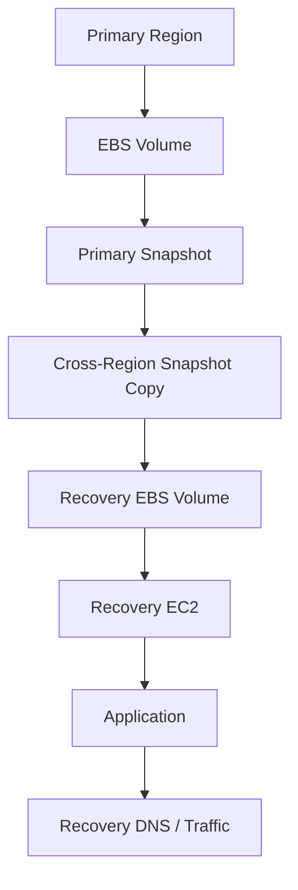
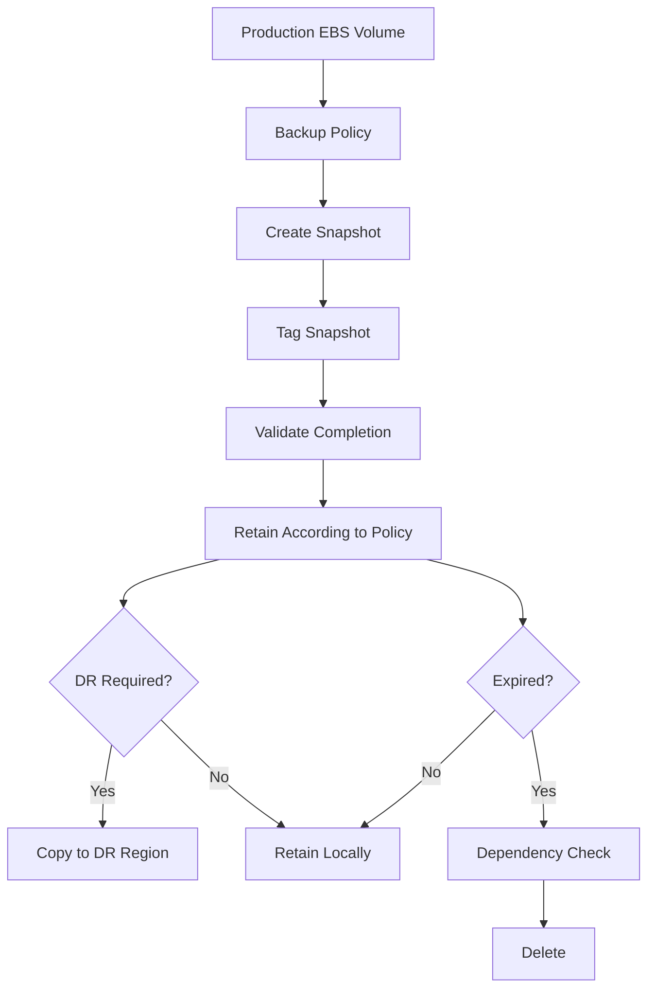

# 06- EBS Snapshot Management

## Overview

Amazon EBS snapshots are point-in-time backups of EBS volumes. They provide a durable mechanism for protecting, copying, and recovering block-storage data used by EC2 workloads.

Snapshot management is a core operational capability for:

- Backup and recovery
- Disaster recovery
- Volume migration
- Cross-Availability Zone recovery
- Cross-region recovery
- Environment replication
- AMI-backed infrastructure
- Long-term data protection

A typical snapshot lifecycle is:

```text
EBS Volume
    |
    v
Create Snapshot
    |
    v
Validate Snapshot
    |
    +----> Copy to another Region
    |
    +----> Retain according to policy
    |
    v
Restore to New EBS Volume
    |
    v
Attach to EC2
    |
    v
Validate Data
```

Snapshots are storage-level recovery artifacts. They should complement, not automatically replace, application-aware backups such as PostgreSQL logical backups, database-native recovery mechanisms, or managed database backup services.

## Snapshot Model

An EBS snapshot captures the state of an EBS volume at a point in time.

Conceptually:

```text
EBS Volume
    |
    +--> Snapshot A
    |
    +--> Snapshot B
    |
    +--> Snapshot C
```

Each snapshot represents a recoverable version of the volume.

For EBS-backed workloads, snapshots are stored in AWS-managed storage and can be used to create new EBS volumes.

The operational relationship is:

```text
Snapshot
    |
    v
Create EBS Volume
    |
    v
Attach to EC2
    |
    v
Mount / Inspect
```

## Incremental Snapshot Behavior

EBS snapshots use incremental storage semantics. After the first snapshot, subsequent snapshots store only the blocks that changed since the previous snapshot for the same volume.

Conceptually:

```text
Snapshot 1
[ A ][ B ][ C ][ D ]

Snapshot 2
[ A ][ B' ][ C ][ D ]

Snapshot 3
[ A ][ B' ][ C' ][ D ]
```

The snapshot chain is managed by AWS.

Deleting an older snapshot does not mean that all data unique to that snapshot is immediately lost from the remaining snapshot set. AWS maintains the underlying data required by snapshots that still exist.

Operationally, this means you should manage snapshots according to retention requirements rather than trying to manually reason about individual physical blocks.

## Why Snapshots Matter

Snapshots provide a relatively low-friction way to create recovery points.

Common uses include:

| Use Case | Snapshot Role |
|---|---|
| Backup | Point-in-time recovery artifact |
| Volume migration | Source for a new volume |
| AZ migration | Recreate volume in another AZ |
| Region migration | Copy snapshot to another region |
| Testing | Create isolated test volumes |
| AMI workflows | EBS-backed AMI storage source |
| Disaster recovery | Recovery artifact in another region |
| Rollback | Restore known storage state |

## List Snapshots

List snapshots owned by the current account:

```bash
aws ec2 describe-snapshots \
    --owner-ids self \
    --region ap-south-1
```

For an operational view:

```bash
aws ec2 describe-snapshots \
    --owner-ids self \
    --region ap-south-1 \
    --query 'Snapshots[].{
        ID:SnapshotId,
        Volume:VolumeId,
        Size:VolumeSize,
        State:State,
        StartTime:StartTime,
        Encrypted:Encrypted,
        Description:Description
    }' \
    --output table
```

## Inspect a Specific Snapshot

```bash
aws ec2 describe-snapshots \
    --snapshot-ids snap-0123456789abcdef0 \
    --region ap-south-1
```

Extract important metadata:

```bash
aws ec2 describe-snapshots \
    --snapshot-ids snap-0123456789abcdef0 \
    --query 'Snapshots[0].{
        ID:SnapshotId,
        Volume:VolumeId,
        Size:VolumeSize,
        State:State,
        StartTime:StartTime,
        Encrypted:Encrypted,
        KMSKey:KmsKeyId,
        Description:Description
    }' \
    --output table
```

## Snapshot States

A snapshot commonly transitions through states such as:

| State | Meaning |
|---|---|
| `pending` | Snapshot creation is in progress |
| `completed` | Snapshot is ready for normal use |
| `error` | Snapshot creation encountered an error |

Check the current state:

```bash
aws ec2 describe-snapshots \
    --snapshot-ids snap-0123456789abcdef0 \
    --query 'Snapshots[0].State' \
    --output text
```

Do not treat a `pending` snapshot as a completed backup.

## Create a Snapshot

Create a snapshot from an EBS volume:

```bash
aws ec2 create-snapshot \
    --volume-id vol-0123456789abcdef0 \
    --description "Production payments data backup" \
    --region ap-south-1
```

The response contains the snapshot ID.

Example:

```json
{
    "SnapshotId": "snap-0123456789abcdef0"
}
```

## Wait for Snapshot Completion

Use the AWS CLI waiter:

```bash
aws ec2 wait snapshot-completed \
    --snapshot-ids snap-0123456789abcdef0 \
    --region ap-south-1
```

This is useful in automation where subsequent steps depend on a completed snapshot.

For example:

```text
Create Snapshot
      |
      v
Wait for Completion
      |
      v
Copy / Restore / Promote
```

## Snapshot Descriptions

Descriptions should contain enough information to identify why the snapshot exists.

Prefer:

```text
Production payments PostgreSQL data backup before storage migration
```

over:

```text
backup
```

Useful metadata includes:

- Application
- Environment
- Data purpose
- Backup reason
- Date or release
- Retention class

Tags should be used for structured metadata.

## Tag Snapshots

Tag a snapshot:

```bash
aws ec2 create-tags \
    --resources snap-0123456789abcdef0 \
    --tags \
        Key=Application,Value=payments-api \
        Key=Environment,Value=production \
        Key=BackupType,Value=scheduled \
        Key=RetentionClass,Value=standard \
        Key=ManagedBy,Value=backup-automation \
    --region ap-south-1
```

Tags are useful for:

- Automated retention
- Inventory
- Cost allocation
- Ownership
- Compliance
- Recovery workflows

## Find Snapshots by Tag

Find production snapshots:

```bash
aws ec2 describe-snapshots \
    --owner-ids self \
    --filters "Name=tag:Environment,Values=production" \
    --query 'Snapshots[].{
        ID:SnapshotId,
        Volume:VolumeId,
        Size:VolumeSize,
        State:State,
        StartTime:StartTime
    }' \
    --output table
```

Find snapshots for a specific application:

```bash
aws ec2 describe-snapshots \
    --owner-ids self \
    --filters "Name=tag:Application,Values=payments-api" \
    --query 'Snapshots[].{
        ID:SnapshotId,
        State:State,
        StartTime:StartTime,
        Description:Description
    }' \
    --output table
```

## Snapshot Consistency

A snapshot is storage-level protection. It does not automatically guarantee application-level consistency.

Consider a PostgreSQL database:

```text
PostgreSQL
    |
    +--> Active transactions
    +--> WAL activity
    +--> Dirty filesystem buffers
    |
    v
EBS Snapshot
```

A snapshot taken while the application is actively writing may be crash-consistent rather than application-consistent.

For databases and other stateful applications, determine whether the workload requires:

- Application quiescing
- Database-native backup
- Filesystem freeze
- Replication
- WAL-based recovery
- Transaction-aware backup procedures

For PostgreSQL, an EBS snapshot should not automatically be treated as a replacement for PostgreSQL-aware backup and recovery.

## Crash-Consistent vs Application-Consistent

| Backup Type | Characteristics |
|---|---|
| Crash-consistent | Similar to recovering storage after an unexpected power loss |
| Application-consistent | Application state is coordinated before backup |

For stateless application servers, crash consistency may be sufficient for many image or recovery workflows.

For transactional systems, application-aware protection is usually more important.

## Snapshot Before a Risky Change

A practical operational workflow:

```text
Identify Volume
      |
      v
Validate Application Dependency
      |
      v
Create Snapshot
      |
      v
Wait for Completion
      |
      v
Perform Change
      |
      v
Validate
      |
      +----> Failure
                 |
                 v
             Restore
```

For example, before a risky filesystem migration:

```bash
aws ec2 create-snapshot \
    --volume-id vol-0123456789abcdef0 \
    --description "Pre-migration recovery point" \
    --region ap-south-1
```

Then wait:

```bash
aws ec2 wait snapshot-completed \
    --snapshot-ids snap-0123456789abcdef0 \
    --region ap-south-1
```

Do not assume that creating a snapshot alone proves that the recovery process works.

## Restore a Snapshot to a New Volume

Create a new volume from a snapshot:

```bash
aws ec2 create-volume \
    --snapshot-id snap-0123456789abcdef0 \
    --availability-zone ap-south-1a \
    --volume-type gp3 \
    --region ap-south-1
```

The target Availability Zone must match the EC2 instance to which the restored volume will be attached.

Inspect the resulting volume:

```bash
aws ec2 describe-volumes \
    --filters "Name=volume-id,Values=vol-0123456789abcdef0" \
    --region ap-south-1
```

The actual volume ID returned by `create-volume` should be used for subsequent operations.

## Restore Workflow

A typical recovery workflow is:


The AWS-side restoration is only part of recovery.

The operating system and application must also recognize and correctly use the restored volume.

## Restoring a Volume in Another Availability Zone

Because EBS volumes are AZ-specific:

```text
Snapshot
   |
   +--> Create Volume in AZ-a
   |
   +--> Create Volume in AZ-b
   |
   +--> Create Volume in AZ-c
```

This makes snapshots useful for storage migration between Availability Zones.

Example:

```bash
aws ec2 create-volume \
    --snapshot-id snap-0123456789abcdef0 \
    --availability-zone ap-south-1b \
    --volume-type gp3 \
    --region ap-south-1
```

## Copy a Snapshot to Another Region

Cross-region snapshot copies support disaster recovery and regional migration.

```bash
aws ec2 copy-snapshot \
    --source-region ap-south-1 \
    --source-snapshot-id snap-0123456789abcdef0 \
    --description "DR copy of payments data backup" \
    --region ap-southeast-1
```

The destination receives a new snapshot ID.

Conceptually:

```text
Primary Region
ap-south-1
     |
     | Copy Snapshot
     v
DR Region
ap-southeast-1
     |
     v
Recovery Volume
     |
     v
Recovery EC2
```

A copied snapshot provides a storage recovery artifact, but a complete regional DR solution also requires:

- Networking
- IAM
- Application deployment
- Secrets
- DNS
- Database recovery
- Monitoring
- Recovery automation

## Cross-Region Disaster Recovery

A mature design might look like:



The recovery process should be tested periodically rather than assumed to work because snapshots exist.

## Encrypted Snapshots

Snapshots can be encrypted when the source volume is encrypted.

Inspect encryption:

```bash
aws ec2 describe-snapshots \
    --snapshot-ids snap-0123456789abcdef0 \
    --query 'Snapshots[0].{
        Encrypted:Encrypted,
        KMSKey:KmsKeyId
    }' \
    --output table
```

Encryption introduces additional operational requirements around:

- KMS key permissions
- Key policies
- Cross-account access
- Cross-region copies
- Recovery identities

Do not treat an encrypted snapshot as usable by every identity that can see its snapshot ID.

## Copy an Encrypted Snapshot

When copying encrypted snapshots, explicitly validate the destination encryption and KMS requirements.

Example:

```bash
aws ec2 copy-snapshot \
    --source-region ap-south-1 \
    --source-snapshot-id snap-0123456789abcdef0 \
    --encrypted \
    --kms-key-id alias/ebs-dr \
    --description "Encrypted DR snapshot" \
    --region ap-southeast-1
```

The destination KMS key must be usable by the relevant AWS principals.

## Delete a Snapshot

Delete a snapshot:

```bash
aws ec2 delete-snapshot \
    --snapshot-id snap-0123456789abcdef0 \
    --region ap-south-1
```

Deletion is destructive from the perspective of the retained snapshot.

Before deletion, verify:

- Retention requirements
- Recovery point requirements
- DR dependencies
- Compliance requirements
- Related AMIs
- Application ownership

## Snapshot Retention

A production retention strategy should define:

- Frequency
- Retention duration
- Backup classes
- Regional copies
- Recovery objectives
- Ownership
- Deletion authority

Example:

```text
Hourly
   |
   +--> Short retention

Daily
   |
   +--> Medium retention

Weekly
   |
   +--> Longer retention

Regional DR
   |
   +--> Independent recovery protection
```

The exact retention period should be based on business and compliance requirements.

## Snapshot Lifecycle Automation

Manual snapshot creation does not scale well.

For production environments, consider:

- AWS Backup
- Event-driven automation
- Scheduled automation
- Tag-based retention
- Infrastructure as code

A typical automation flow is:

```text
Schedule
   |
   v
Identify Tagged Volumes
   |
   v
Create Snapshots
   |
   v
Tag Snapshots
   |
   v
Apply Retention Policy
   |
   v
Delete Expired Snapshots
```

AWS Backup can provide centralized policy-driven backup management where it fits the organization's requirements.

## Snapshot and AMI Relationship

EBS-backed AMIs can reference EBS snapshots.

Conceptually:

```text
AMI
 |
 +--> Root Snapshot
 |
 +--> Additional Snapshot
```

This means image lifecycle and snapshot lifecycle are related.

Before deleting snapshots, determine whether they are referenced by AMIs or other recovery workflows.

Do not use a snapshot cleanup script that deletes resources solely based on age without checking dependencies.

## Snapshot and EBS Volume Relationship

The relationship can be summarized as:

```text
EBS Volume
    |
    +---- Create Snapshot
    |           |
    |           v
    |       Snapshot
    |           |
    |           +---- Copy
    |           |
    |           +---- Restore
    |           |
    |           +---- Retain
    |           |
    |           +---- Delete
    |
    +---- Modify
    |
    +---- Attach / Detach
```

A snapshot is a recovery artifact, not a live mounted filesystem.

## Snapshot Metadata

Useful snapshot metadata includes:

| Metadata | Purpose |
|---|---|
| Snapshot ID | Unique identifier |
| Volume ID | Source volume |
| Size | Source volume size |
| State | Snapshot lifecycle |
| Start time | Creation timestamp |
| Description | Human-readable context |
| Encryption | Encryption state |
| KMS key | Encryption key reference |
| Tags | Ownership and lifecycle automation |

Inspect all metadata:

```bash
aws ec2 describe-snapshots \
    --snapshot-ids snap-0123456789abcdef0 \
    --region ap-south-1
```

## Finding Snapshots for a Volume

```bash
aws ec2 describe-snapshots \
    --owner-ids self \
    --filters "Name=volume-id,Values=vol-0123456789abcdef0" \
    --query 'Snapshots[].{
        ID:SnapshotId,
        State:State,
        StartTime:StartTime,
        Size:VolumeSize,
        Description:Description
    }' \
    --output table
```

This is useful before:

- Volume deletion
- Data migration
- Snapshot cleanup
- Recovery
- Retention review

## Snapshot Cleanup

Find snapshots owned by the account:

```bash
aws ec2 describe-snapshots \
    --owner-ids self \
    --query 'Snapshots[].{
        ID:SnapshotId,
        Volume:VolumeId,
        StartTime:StartTime,
        State:State,
        Description:Description
    }' \
    --output table
```

For automated cleanup, use tags and a defined retention policy rather than parsing human-readable descriptions.

A safe cleanup process is:

```text
Candidate Snapshot
       |
       v
Check Ownership
       |
       v
Check Retention
       |
       v
Check AMI / DR Dependency
       |
       v
Check Recovery Requirements
       |
       v
Delete
```

## Snapshot Performance Considerations

Creating and restoring snapshots is an infrastructure operation, not an application-level file copy.

When restoring a volume, application performance can depend on how data is accessed after restoration.

For latency-sensitive production workloads:

- Validate recovery performance
- Test critical read paths
- Monitor EBS performance
- Avoid assuming backup success equals recovery readiness

Recovery testing should include actual application behavior.

## Fast Recovery Considerations

A recovery plan should distinguish between:

```text
Backup exists
```

and:

```text
Application can be restored within the required RTO
```

For example:

```text
Snapshot
   |
   v
Volume Creation
   |
   v
EC2 Launch
   |
   v
Application Configuration
   |
   v
Data Validation
   |
   v
DNS / Traffic Switch
```

Each stage contributes to total recovery time.

## Snapshot Security

Snapshots may contain complete copies of sensitive application data.

Protect them using:

- Encryption
- KMS controls
- IAM least privilege
- Restricted sharing
- Tag-based governance
- Audit logging
- Retention policies

Be particularly careful with snapshot sharing.

A snapshot containing:

- Database data
- User information
- Application secrets
- Internal configuration

should not be broadly shared.

## Snapshot Cost Considerations

Snapshot costs are influenced by the amount of data retained across the snapshot lifecycle.

Cost management should focus on:

- Retention periods
- Unnecessary snapshots
- Duplicate recovery artifacts
- Cross-region copies
- Long-lived development snapshots
- Unused recovery data

Do not optimize cost by deleting snapshots that are required for recovery.

The correct target is unnecessary retention, not backup coverage.

## Backup vs Snapshot

Snapshots and application backups solve different problems.

| Requirement | EBS Snapshot | Application Backup |
|---|---|---|
| Volume-level recovery | Strong fit | Usually unnecessary |
| Full filesystem recovery | Strong fit | Depends |
| Database logical restore | Limited | Strong fit |
| Table-level recovery | No | Often yes |
| Application-consistent backup | Requires coordination | Usually designed for it |
| EC2 volume migration | Strong fit | Usually unnecessary |
| Cross-region storage recovery | Strong fit | Depends |
| Point-in-time database recovery | Not inherently sufficient | Database-specific tooling |

For PostgreSQL, for example, a production backup strategy may combine:

```text
PostgreSQL-native backups
        +
WAL / point-in-time recovery
        +
Infrastructure-level snapshots
```

The exact combination depends on the recovery requirements.

## Operational Recovery Example

Suppose an EC2 instance has a persistent application volume:

```text
EC2
 |
 +--> Root Volume
 |
 +--> /data
       |
       +--> Application state
```

If the instance fails:

```text
Failed EC2
    |
    X
    |
    v
Launch Replacement EC2
    |
    v
Create Volume from Snapshot
    |
    v
Attach Volume
    |
    v
Mount /data
    |
    v
Validate Application State
    |
    v
Resume Service
```

This is one reason persistent storage should be deliberately separated from ephemeral compute.

## Common Mistakes

### Assuming a Snapshot Is Automatically Application-Consistent

An EBS snapshot is not automatically aware of database transactions.

For stateful systems, use application-aware backup strategies where required.

### Deleting the Only Recovery Copy

Deleting an old-looking snapshot without checking retention and DR requirements can eliminate the only available recovery point.

### Not Testing Restoration

A snapshot that has never been restored is an assumption, not a validated recovery process.

Periodically perform recovery tests.

### Sharing Sensitive Snapshots

Snapshots may contain complete datasets.

Restrict access and verify encryption and sharing permissions.

### Forgetting Region and AZ Constraints

Snapshots are useful for crossing Availability Zones and regions, but the restored EBS volume must be created in an appropriate target Availability Zone.

### Treating Snapshot Age as the Only Cleanup Criterion

A snapshot may be old but still required for:

- Compliance
- Rollback
- DR
- AMI dependencies
- Long-term retention

### Using Snapshots as the Only Database Backup

Infrastructure-level recovery and application-level recovery are different requirements.

### Assuming Snapshot Completion Means Recovery Readiness

A completed snapshot proves that the snapshot operation completed.

It does not prove that:

- The application can boot
- The filesystem mounts correctly
- The database is consistent
- IAM works
- Networking works
- Recovery meets the RTO

## Production Snapshot Workflow

A mature production workflow looks like:



The important control is the dependency check before deletion.

## Recovery Testing

A backup strategy should be tested.

A practical recovery test can include:

1. Select a known recovery snapshot.
2. Create a new EBS volume.
3. Attach it to an isolated EC2 instance.
4. Inspect the filesystem.
5. Validate expected data.
6. Start the relevant application components.
7. Measure recovery time.
8. Record failures and remediation actions.
9. Clean up test resources.

This verifies the complete recovery path rather than only the backup mechanism.

## CLI Command Reference

| Operation | CLI |
|---|---|
| List snapshots | `aws ec2 describe-snapshots --owner-ids self` |
| Inspect snapshot | `aws ec2 describe-snapshots --snapshot-ids <snapshot-id>` |
| Create snapshot | `aws ec2 create-snapshot --volume-id <volume-id>` |
| Wait for completion | `aws ec2 wait snapshot-completed --snapshot-ids <snapshot-id>` |
| Find volume snapshots | `describe-snapshots --filters "Name=volume-id,Values=<volume-id>"` |
| Copy snapshot | `aws ec2 copy-snapshot` |
| Restore volume | `aws ec2 create-volume --snapshot-id <snapshot-id>` |
| Tag snapshot | `aws ec2 create-tags --resources <snapshot-id>` |
| Delete snapshot | `aws ec2 delete-snapshot --snapshot-id <snapshot-id>` |

## Senior-Level Backup Architecture

For a production EC2 workload, snapshot management should be part of a larger recovery architecture:

```text
                    Production
                        |
                +-------+-------+
                |               |
                v               v
          Application       EBS Volume
                                |
                                v
                           EBS Snapshot
                                |
                    +-----------+-----------+
                    |                       |
                    v                       v
              Local Recovery          DR Region
                    |                       |
                    v                       v
              Recovery Volume        Recovery Volume
                    |                       |
                    v                       v
                EC2 Recovery        Regional Recovery
```

A senior-level design evaluates:

- RPO
- RTO
- Backup frequency
- Retention
- Encryption
- Regional recovery
- Application consistency
- Restore testing
- Automation
- Cost
- Operational ownership

The central principle is:

```text
Backup is not complete until recovery is understood and tested.
```

## Operational Checklist

Before creating a snapshot:

```text
[ ] Correct volume identified
[ ] Application consistency requirements understood
[ ] Database backup requirements evaluated
[ ] Snapshot description defined
[ ] Tags defined
[ ] Encryption requirements verified
```

Before deleting a snapshot:

```text
[ ] Snapshot ownership verified
[ ] Retention policy checked
[ ] AMI dependencies checked
[ ] DR dependencies checked
[ ] Compliance requirements checked
[ ] Recovery coverage confirmed
[ ] Deletion approved
```

Before relying on a recovery snapshot:

```text
[ ] Snapshot completed successfully
[ ] Recovery volume creation tested
[ ] Correct AZ selected
[ ] Volume attachment tested
[ ] Filesystem mount tested
[ ] Application data validated
[ ] Recovery time measured
[ ] Recovery procedure documented
```

## Key Takeaways

- **EBS snapshots provide point-in-time, volume-level recovery artifacts:** use them for backup, migration, recovery, and regional disaster-recovery workflows.
- **A snapshot is not automatically application-consistent:** stateful systems such as PostgreSQL may require coordinated or application-native backup mechanisms.
- **Recovery must be tested, not assumed:** creating a completed snapshot does not prove that an application can be restored within its required RTO.
- **Snapshot lifecycle requires dependency-aware retention:** check AMIs, DR requirements, compliance, ownership, and recovery coverage before deleting snapshots.
- **Treat snapshots as sensitive production data:** use encryption, KMS controls, least-privilege access, restricted sharing, tagging, and automated retention policies.