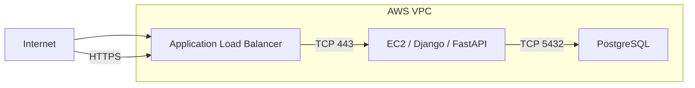
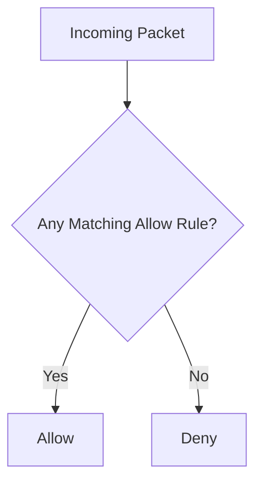
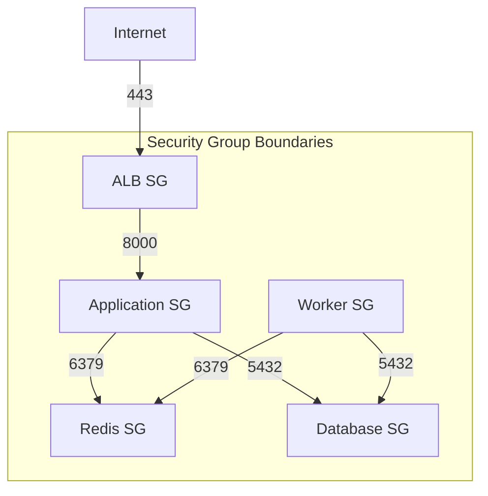

# 07- Security Group Management

## Overview

Amazon EC2 Security Groups are stateful virtual firewalls that control inbound and outbound network traffic for supported AWS resources, including EC2 instances.

Security Group management through the AWS CLI is a core operational capability for:

- Controlling application exposure
- Restricting database access
- Allowing load balancer traffic
- Enabling service-to-service communication
- Managing SSH or administrative access
- Automating infrastructure changes
- Troubleshooting connectivity
- Enforcing least-privilege network access

A typical backend architecture may look like:

```text
Internet
    |
    v
Application Load Balancer
    |
    | TCP 443
    v
EC2 / FastAPI / Django
    |
    | TCP 5432
    v
PostgreSQL
```

Each layer should have a Security Group appropriate to its traffic requirements rather than exposing every service broadly.

## Security Group Fundamentals

A Security Group operates at the network interface level.

For an EC2 instance:

```text
EC2 Instance
     |
     v
Elastic Network Interface
     |
     v
Security Group Rules
     |
     v
Network Traffic
```

Security Groups are:

| Property | Behavior |
|---|---|
| Stateful | Return traffic for an allowed connection is automatically allowed |
| Resource-level | Associated with network interfaces/resources |
| Allow-based | Rules specify allowed traffic |
| No explicit deny rules | Blocking is achieved by not allowing traffic |
| Multiple groups supported | An interface can have multiple Security Groups |
| Rule aggregation | Effective access is the union of applicable allow rules |

Because Security Groups are stateful, an inbound connection that is permitted can receive corresponding return traffic without requiring a separate reverse-direction rule.

## Security Group Rule Model

A rule generally specifies:

- Protocol
- Port or port range
- Source for ingress
- Destination for egress
- Security Group rule ID
- Description

For example:

```text
Inbound
TCP 443
Source: 0.0.0.0/0
```

means IPv4 clients can initiate TCP connections to port 443.

A database rule might instead be:

```text
Inbound
TCP 5432
Source: sg-application
```

This allows traffic from resources associated with the specified Security Group rather than from the entire Internet.

## Ingress and Egress

Security Group rules are divided into:

| Direction | Controls |
|---|---|
| Inbound / ingress | Traffic entering the resource |
| Outbound / egress | Traffic leaving the resource |

Inspect both directions when troubleshooting connectivity.

A common backend design is:

```text
ALB SG
  |
  | 443
  v
Application SG
  |
  | 5432
  v
Database SG
```

The application Security Group does not need to expose PostgreSQL to the Internet.

## Security Group Architecture

A production three-tier architecture can use separate Security Groups:



Rules can then be expressed as:

| Security Group | Direction | Protocol | Port | Source |
|---|---|---|---:|---|
| `alb-sg` | Inbound | TCP | 443 | Internet |
| `app-sg` | Inbound | TCP | 8000 | `alb-sg` |
| `db-sg` | Inbound | TCP | 5432 | `app-sg` |

This is more restrictive than allowing `0.0.0.0/0` on every layer.

## List Security Groups

List Security Groups:

```bash
aws ec2 describe-security-groups \
    --region ap-south-1
```

Create a compact inventory:

```bash
aws ec2 describe-security-groups \
    --region ap-south-1 \
    --query 'SecurityGroups[].{
        ID:GroupId,
        Name:GroupName,
        VPC:VpcId,
        Description:Description
    }' \
    --output table
```

## Inspect a Specific Security Group

```bash
aws ec2 describe-security-groups \
    --group-ids sg-0123456789abcdef0 \
    --region ap-south-1
```

Inspect only ingress rules:

```bash
aws ec2 describe-security-groups \
    --group-ids sg-0123456789abcdef0 \
    --query 'SecurityGroups[0].IpPermissions' \
    --output json
```

Inspect egress rules:

```bash
aws ec2 describe-security-groups \
    --group-ids sg-0123456789abcdef0 \
    --query 'SecurityGroups[0].IpPermissionsEgress' \
    --output json
```

## Find Security Groups in a VPC

```bash
aws ec2 describe-security-groups \
    --filters "Name=vpc-id,Values=vpc-0123456789abcdef0" \
    --query 'SecurityGroups[].{
        ID:GroupId,
        Name:GroupName,
        Description:Description
    }' \
    --output table
```

This is useful when investigating a specific VPC.

## Find Security Groups by Name

```bash
aws ec2 describe-security-groups \
    --filters "Name=group-name,Values=app-sg" \
    --query 'SecurityGroups[].{
        ID:GroupId,
        Name:GroupName,
        VPC:VpcId
    }' \
    --output table
```

Security Group names are scoped to a VPC, so use the VPC ID when precise identification matters.

## Create a Security Group

Create a Security Group inside a VPC:

```bash
aws ec2 create-security-group \
    --group-name app-sg \
    --description "Security group for application servers" \
    --vpc-id vpc-0123456789abcdef0 \
    --region ap-south-1
```

The response contains the Security Group ID:

```json
{
    "GroupId": "sg-0123456789abcdef0"
}
```

Store and use the Group ID for subsequent operations.

## Tag a Security Group

Apply tags:

```bash
aws ec2 create-tags \
    --resources sg-0123456789abcdef0 \
    --tags \
        Key=Application,Value=payments-api \
        Key=Environment,Value=production \
        Key=ManagedBy,Value=terraform \
        Key=Owner,Value=backend-platform \
    --region ap-south-1
```

Consistent tags help with:

- Ownership
- Inventory
- Automation
- Incident response
- Cost attribution
- Infrastructure governance

## Add an Inbound Rule

Allow HTTPS from the Internet:

```bash
aws ec2 authorize-security-group-ingress \
    --group-id sg-0123456789abcdef0 \
    --ip-permissions '[
        {
            "IpProtocol": "tcp",
            "FromPort": 443,
            "ToPort": 443,
            "IpRanges": [
                {
                    "CidrIp": "0.0.0.0/0",
                    "Description": "Public HTTPS"
                }
            ]
        }
    ]' \
    --region ap-south-1
```

For a public HTTPS service, this is a common pattern.

Do not use the same approach for administrative ports or databases unless there is a deliberate requirement.

## Allow SSH from a Specific Network

Allow SSH from a known corporate CIDR:

```bash
aws ec2 authorize-security-group-ingress \
    --group-id sg-0123456789abcdef0 \
    --protocol tcp \
    --port 22 \
    --cidr 203.0.113.0/24 \
    --region ap-south-1
```

Avoid:

```text
0.0.0.0/0 -> TCP 22
```

for production administrative access whenever a narrower access mechanism is available.

Prefer:

- SSM Session Manager
- VPN
- Bastion architecture where justified
- Restricted corporate CIDRs
- Short-lived administrative access

## Allow Application Traffic from a Load Balancer

Instead of allowing the entire Internet to reach an application port:

```bash
aws ec2 authorize-security-group-ingress \
    --group-id sg-app \
    --protocol tcp \
    --port 8000 \
    --source-group sg-alb \
    --region ap-south-1
```

Conceptually:

```text
Internet
   |
   | 443
   v
ALB
   |
   | 8000
   v
Application EC2
```

The application Security Group trusts the load balancer Security Group rather than a public CIDR.

## Security Group References

Security Group references are particularly useful for service-to-service communication.

Example:

```text
alb-sg
   |
   | allowed source
   v
app-sg
```

The rule means:

```text
Traffic from network interfaces associated with alb-sg
may access the destination protected by app-sg.
```

This is generally preferable to maintaining changing instance IP addresses.

For microservices:

```text
api-sg
   |
   +--> worker-sg
   |
   +--> cache-sg
   |
   +--> database-sg
```

Rules should represent actual service dependencies.

## Database Access Pattern

A common PostgreSQL architecture is:

```text
Internet
   |
   X
   |
ALB SG
   |
   v
App SG
   |
   | TCP 5432
   v
DB SG
```

The database Security Group should generally allow PostgreSQL traffic only from the application tier that requires it.

Avoid:

```text
DB SG
  |
  +--> 5432 from 0.0.0.0/0
```

unless there is an exceptional and explicitly controlled requirement.

## Add an Egress Rule

Security Groups also control outbound traffic.

Example:

```bash
aws ec2 authorize-security-group-egress \
    --group-id sg-0123456789abcdef0 \
    --ip-permissions '[
        {
            "IpProtocol": "tcp",
            "FromPort": 443,
            "ToPort": 443,
            "IpRanges": [
                {
                    "CidrIp": "0.0.0.0/0",
                    "Description": "Outbound HTTPS"
                }
            ]
        }
    ]' \
    --region ap-south-1
```

Be careful when changing egress rules on production systems.

Applications may require outbound access for:

- AWS APIs
- External APIs
- Package repositories
- DNS
- Monitoring
- Identity services
- Database connections

## Default Egress Behavior

New Security Groups commonly start with a default outbound allow rule.

Inspect the current configuration instead of assuming it:

```bash
aws ec2 describe-security-groups \
    --group-ids sg-0123456789abcdef0 \
    --query 'SecurityGroups[0].IpPermissionsEgress' \
    --output json
```

If egress is restricted, explicitly model required outbound dependencies.

## Revoke an Inbound Rule

Revoke a rule:

```bash
aws ec2 revoke-security-group-ingress \
    --group-id sg-0123456789abcdef0 \
    --protocol tcp \
    --port 22 \
    --cidr 203.0.113.0/24 \
    --region ap-south-1
```

For newer rule-management workflows, Security Group rule IDs can also be used.

Inspect rule IDs:

```bash
aws ec2 describe-security-group-rules \
    --filters "Name=group-id,Values=sg-0123456789abcdef0" \
    --region ap-south-1
```

Then revoke a specific rule:

```bash
aws ec2 revoke-security-group-ingress \
    --group-id sg-0123456789abcdef0 \
    --security-group-rule-ids sgr-0123456789abcdef0 \
    --region ap-south-1
```

Using the rule ID is useful when multiple rules have otherwise similar characteristics.

## Revoke an Egress Rule

```bash
aws ec2 revoke-security-group-egress \
    --group-id sg-0123456789abcdef0 \
    --protocol tcp \
    --port 443 \
    --cidr 0.0.0.0/0 \
    --region ap-south-1
```

Before restricting egress, understand the application's outbound dependencies.

## Inspect Security Group Rules Directly

The dedicated Security Group rule API is useful for operational inspection:

```bash
aws ec2 describe-security-group-rules \
    --filters "Name=group-id,Values=sg-0123456789abcdef0" \
    --region ap-south-1
```

Compact output:

```bash
aws ec2 describe-security-group-rules \
    --filters "Name=group-id,Values=sg-0123456789abcdef0" \
    --query 'SecurityGroupRules[].{
        ID:SecurityGroupRuleId,
        Direction:IsEgress,
        Protocol:IpProtocol,
        From:FromPort,
        To:ToPort,
        CIDR:CidrIpv4,
        SourceSG:ReferencedGroupId,
        Description:Description
    }' \
    --output table
```

This is often easier to reason about than the nested `IpPermissions` structure.

## Remove a Security Group

Delete a Security Group:

```bash
aws ec2 delete-security-group \
    --group-id sg-0123456789abcdef0 \
    --region ap-south-1
```

The group must not have dependencies that prevent deletion.

Before deletion, identify resources using it.

For example:

```bash
aws ec2 describe-network-interfaces \
    --filters "Name=group-id,Values=sg-0123456789abcdef0" \
    --region ap-south-1
```

A Security Group associated with active network interfaces cannot simply be treated as unused.

## Security Groups Attached to an EC2 Instance

Inspect the Security Groups associated with an instance:

```bash
aws ec2 describe-instances \
    --instance-ids i-0123456789abcdef0 \
    --query 'Reservations[].Instances[].SecurityGroups' \
    --output table
```

For a more complete network view:

```bash
aws ec2 describe-instances \
    --instance-ids i-0123456789abcdef0 \
    --query 'Reservations[].Instances[].{
        Instance:InstanceId,
        NetworkInterfaces:NetworkInterfaces[].{
            ENI:NetworkInterfaceId,
            PrivateIP:PrivateIpAddress,
            Groups:Groups[].GroupId
        }
    }' \
    --output json
```

Security Groups are associated with network interfaces, so ENI-level inspection is useful for complex environments.

## Modify Security Groups on an Instance

Security Groups can be changed through the instance's network interface configuration.

For an instance using the primary network interface:

```bash
aws ec2 modify-instance-attribute \
    --instance-id i-0123456789abcdef0 \
    --groups sg-0123456789abcdef0 sg-abcdef0123456789 \
    --region ap-south-1
```

Be careful: specifying the `--groups` list changes the complete set of Security Groups for the instance's primary interface.

Do not assume that the command adds one group while preserving every existing group.

Inspect the current configuration first:

```bash
aws ec2 describe-instances \
    --instance-ids i-0123456789abcdef0 \
    --query 'Reservations[].Instances[].SecurityGroups[].GroupId' \
    --output text
```

## Multiple Security Groups

An ENI can have multiple Security Groups.

For example:

```text
EC2 ENI
  |
  +--> app-sg
  |
  +--> monitoring-sg
  |
  +--> internal-access-sg
```

The effective rules are additive.

If one Security Group allows traffic, another Security Group cannot explicitly deny that traffic.

This is a critical distinction from firewall systems that evaluate explicit deny rules.

## Security Group Rule Evaluation

Conceptually:



There is no Security Group deny rule that overrides another Security Group's allow rule.

Therefore:

```text
SG-A: allow TCP 22 from 0.0.0.0/0
SG-B: no SSH rule
```

does not result in SSH being denied.

SSH remains allowed because SG-A permits it.

## Security Groups vs NACLs

Security Groups and Network ACLs operate at different layers.

| Property | Security Group | Network ACL |
|---|---|---|
| Scope | ENI/resource | Subnet |
| Stateful | Yes | No |
| Rules | Allow | Allow and deny |
| Evaluation | Matching allows | Ordered rules |
| Typical use | Instance/service access control | Subnet-level network control |

A connectivity problem may involve both.

For example:

```text
Client
  |
  v
Route Table
  |
  v
NACL
  |
  v
Subnet
  |
  v
ENI
  |
  v
Security Group
  |
  v
EC2
```

When troubleshooting, do not assume the Security Group is the only control point.

## IPv4 and IPv6

IPv4 rules and IPv6 rules are distinct.

For IPv4:

```text
0.0.0.0/0
```

For IPv6:

```text
::/0
```

A service may appear restricted for IPv4 while remaining publicly reachable through IPv6 if IPv6 rules are broader than intended.

Inspect both where IPv6 is enabled.

## Allow HTTPS for IPv4 and IPv6

A public dual-stack HTTPS service may require rules similar to:

```bash
aws ec2 authorize-security-group-ingress \
    --group-id sg-0123456789abcdef0 \
    --ip-permissions '[
        {
            "IpProtocol": "tcp",
            "FromPort": 443,
            "ToPort": 443,
            "IpRanges": [
                {
                    "CidrIp": "0.0.0.0/0",
                    "Description": "Public HTTPS IPv4"
                }
            ],
            "Ipv6Ranges": [
                {
                    "CidrIpv6": "::/0",
                    "Description": "Public HTTPS IPv6"
                }
            ]
        }
    ]' \
    --region ap-south-1
```

Only allow IPv6 access when the application and network architecture intentionally support it.

## Port Management

Use application-specific ports rather than broad ranges.

Prefer:

```text
TCP 443
```

over:

```text
TCP 1-65535
```

For an internal FastAPI service:

```text
ALB SG
    |
    +--> TCP 8000 --> App SG
```

For PostgreSQL:

```text
App SG
    |
    +--> TCP 5432 --> DB SG
```

For gRPC:

```text
Client SG
    |
    +--> TCP 50051 --> Service SG
```

The port must match the actual application listener.

## Security Group Design for Microservices

A microservice architecture may use one Security Group per logical traffic boundary.

Example:

```text
Internet
   |
   v
ALB SG
   |
   +--> API SG
           |
           +--> Auth SG
           |
           +--> Orders SG
           |
           +--> Redis SG
           |
           +--> PostgreSQL SG
```

This allows network policy to reflect service dependencies.

Avoid creating dozens of Security Groups without a clear ownership and dependency model.

The goal is least privilege, not maximum rule count.

## Security Group Design for Django and FastAPI

A typical deployment:

```text
Internet
   |
   | HTTPS 443
   v
ALB
   |
   | HTTP 8000
   v
Nginx / FastAPI / Django
   |
   +---- PostgreSQL 5432
   |
   +---- Redis 6379
```

Security Groups might be:

| SG | Inbound |
|---|---|
| `alb-sg` | 443 from Internet |
| `app-sg` | 8000 from `alb-sg` |
| `db-sg` | 5432 from `app-sg` |
| `redis-sg` | 6379 from `app-sg` |

The application server does not need public access to port 5432 or 6379.

## Security Group Design for Celery

A Celery worker may communicate with Redis or another broker:

```text
Celery Worker SG
       |
       | TCP 6379
       v
Redis SG
```

If workers do not receive inbound application traffic, their Security Group should not expose unnecessary inbound ports.

The Security Group should model actual communication rather than the software installed on the machine.

## Security Group Design for Kafka

For a Kafka deployment:

```text
Application SG
      |
      | Kafka listener port
      v
Kafka SG
```

The exact port depends on the Kafka listener configuration.

Do not assume that a Security Group rule alone is sufficient. Kafka also depends on correct listener advertisement, DNS, routing, TLS, and authentication configuration.

## Security Group Rule Descriptions

Use descriptions:

```bash
aws ec2 authorize-security-group-ingress \
    --group-id sg-0123456789abcdef0 \
    --ip-permissions '[
        {
            "IpProtocol": "tcp",
            "FromPort": 443,
            "ToPort": 443,
            "IpRanges": [
                {
                    "CidrIp": "0.0.0.0/0",
                    "Description": "Public HTTPS endpoint"
                }
            ]
        }
    ]' \
    --region ap-south-1
```

Good descriptions answer:

```text
Who?
What?
Why?
```

For example:

```text
ALB public HTTPS endpoint
```

is more useful than:

```text
rule
```

## Find Broadly Exposed Ports

Inspect all rules:

```bash
aws ec2 describe-security-group-rules \
    --query 'SecurityGroupRules[?CidrIpv4==`0.0.0.0/0`].{
        Group:GroupId,
        Rule:SecurityGroupRuleId,
        Protocol:IpProtocol,
        From:FromPort,
        To:ToPort,
        Description:Description
    }' \
    --output table
```

Review broad access carefully, especially for:

- SSH `22`
- RDP `3389`
- PostgreSQL `5432`
- MySQL `3306`
- Redis `6379`
- Internal application ports

Public HTTPS on `443` may be intentional for a public service.

Public database access usually requires much stronger scrutiny.

## Connectivity Troubleshooting

When an application cannot connect:

```text
Client
  |
  v
DNS
  |
  v
Route Table
  |
  v
NACL
  |
  v
Security Group
  |
  v
ENI
  |
  v
Application Listener
```

Check in this order:

1. DNS resolution
2. Destination IP
3. Routing
4. NACL
5. Security Group
6. Application listener
7. Host firewall
8. Application configuration

For example, if FastAPI listens on:

```text
127.0.0.1:8000
```

an external load balancer cannot reach it even if the Security Group allows TCP 8000.

The service may need to listen on the appropriate network interface, such as:

```bash
uvicorn app.main:app --host 0.0.0.0 --port 8000
```

## Connection Refused vs Timeout

Security Group troubleshooting benefits from understanding the symptom.

| Symptom | Possible Cause |
|---|---|
| Connection timeout | SG/NACL/routing/firewall/no reachable path |
| Connection refused | Host reachable but no process listening or connection actively rejected |
| DNS failure | DNS/configuration problem |
| TLS failure | Certificate/protocol/configuration issue |
| HTTP 502/504 | Upstream/application/load-balancer issue |

A Security Group is only one part of the network path.

## Safe Rule Changes

For production rule changes:

```text
Inspect Current State
        |
        v
Identify Required Change
        |
        v
Add New Rule
        |
        v
Validate Connectivity
        |
        v
Remove Old Rule
```

This is often safer than removing the old path before the new path has been validated.

For example, during a migration:

```text
Old App SG
    |
    +--> DB

New App SG
    |
    +--> DB
```

Temporarily allow the new path, validate it, then remove the obsolete rule.

## Infrastructure as Code

Manual CLI changes are useful for operations, but production infrastructure should generally have a declarative source of truth.

Typical options include:

- Terraform
- AWS CloudFormation
- AWS CDK

The desired state might be:

```text
Application SG
    |
    +--> TCP 8000 from ALB SG
    |
    +--> TCP 443 to approved destinations
```

If an engineer manually changes the Security Group outside the infrastructure lifecycle, the next deployment may overwrite the change or create drift.

## Security Considerations

Security Groups are an important security boundary, but they are not the entire security architecture.

Use:

- Least-privilege rules
- Narrow CIDRs
- Security Group references
- Private subnets for internal services
- TLS
- IAM controls
- Network ACLs where appropriate
- Host-level controls where required
- Centralized logging and auditing

Do not rely on a Security Group as the only protection for sensitive services.

## Production Pitfalls

### Public SSH

Avoid:

```text
TCP 22
0.0.0.0/0
```

Prefer controlled administrative access.

### Public Database Ports

Avoid:

```text
TCP 5432
0.0.0.0/0
```

Use private networking and application-tier Security Group references.

### Overly Broad Port Ranges

Avoid:

```text
TCP 0-65535
```

unless there is a specific architectural requirement.

### Using IP Addresses for Dynamic Services

For EC2 fleets, instance IPs can change.

Prefer Security Group references where possible:

```text
app-sg -> db-sg
```

rather than maintaining individual instance IP addresses.

### Forgetting IPv6

If IPv6 is enabled, review IPv6 Security Group rules as well as IPv4 rules.

### Assuming a Rule Change Immediately Fixes the Application

A permitted network path does not guarantee:

- Process is listening
- DNS is correct
- Route exists
- TLS is valid
- Application is healthy

### Removing Rules During an Incident Without Evidence

Emergency changes should be evidence-driven.

A broad rule such as:

```text
0.0.0.0/0
```

may appear to solve connectivity but can create a security exposure.

## Security Group Operational Checklist

Before creating a Security Group:

```text
[ ] VPC identified
[ ] Purpose defined
[ ] Ownership defined
[ ] Application dependencies identified
[ ] Inbound requirements identified
[ ] Outbound requirements identified
[ ] Tags defined
```

Before adding a rule:

```text
[ ] Correct Security Group verified
[ ] Correct protocol verified
[ ] Correct port verified
[ ] Source/destination verified
[ ] CIDR minimized
[ ] Security Group reference considered
[ ] Rule description added
[ ] Business/application need understood
```

Before removing a rule:

```text
[ ] Rule ID verified
[ ] Current dependencies checked
[ ] Traffic impact understood
[ ] Replacement path validated
[ ] Rollback plan available
```

Before deleting a Security Group:

```text
[ ] Group ID verified
[ ] Network interfaces checked
[ ] EC2 dependencies checked
[ ] Load balancer dependencies checked
[ ] Other resource dependencies checked
[ ] Infrastructure-as-code state checked
```

## Command Reference

| Operation | CLI |
|---|---|
| List Security Groups | `aws ec2 describe-security-groups` |
| Inspect Security Group | `aws ec2 describe-security-groups --group-ids <group-id>` |
| Create Security Group | `aws ec2 create-security-group` |
| Add ingress rule | `aws ec2 authorize-security-group-ingress` |
| Add egress rule | `aws ec2 authorize-security-group-egress` |
| Revoke ingress | `aws ec2 revoke-security-group-ingress` |
| Revoke egress | `aws ec2 revoke-security-group-egress` |
| Inspect rule IDs | `aws ec2 describe-security-group-rules` |
| Delete Security Group | `aws ec2 delete-security-group` |
| Tag Security Group | `aws ec2 create-tags` |
| Inspect instance groups | `aws ec2 describe-instances` |
| Inspect ENI dependencies | `aws ec2 describe-network-interfaces` |

## Senior-Level Security Group Architecture

A mature EC2 environment treats Security Groups as service-level network policy.



The important design principle is:

```text
Define network access according to actual service dependencies.
```

For example:

```text
Internet
   |
   X
   |
Database
```

is preferable to:

```text
Internet
   |
   v
Database
```

when the database is intended to be consumed only by application services.

At senior engineering levels, Security Group design should be evaluated together with:

- VPC topology
- Subnets
- Route tables
- NACLs
- Load balancers
- IAM
- DNS
- TLS
- Application listeners
- Infrastructure as code
- Observability
- Incident response

A well-designed Security Group configuration should make the intended network architecture obvious from the rules themselves.

## Key Takeaways

- **Security Groups are stateful, allow-based network controls attached to network interfaces:** multiple Security Groups combine their allowed rules rather than overriding one another.
- **Use Security Group references for service-to-service access:** patterns such as `ALB SG → App SG → Database SG` are more maintainable than hard-coding dynamic instance IP addresses.
- **Apply least privilege to ports and sources:** expose only the protocols and ports required by the application, and avoid broad access to administrative or database services.
- **Security Group troubleshooting is only one part of connectivity analysis:** validate DNS, routing, NACLs, Security Groups, host firewalls, listeners, TLS, and application health.
- **Treat production Security Groups as managed infrastructure:** use descriptions, tags, infrastructure as code, controlled changes, auditing, and dependency checks before modifying or deleting rules.