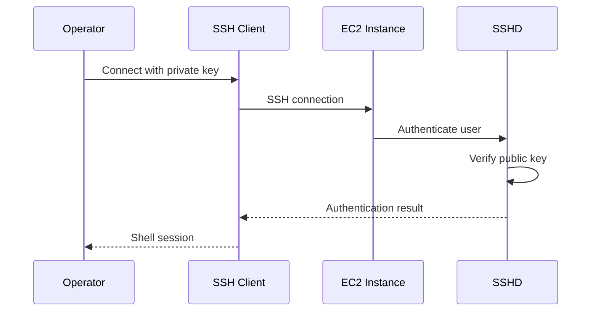
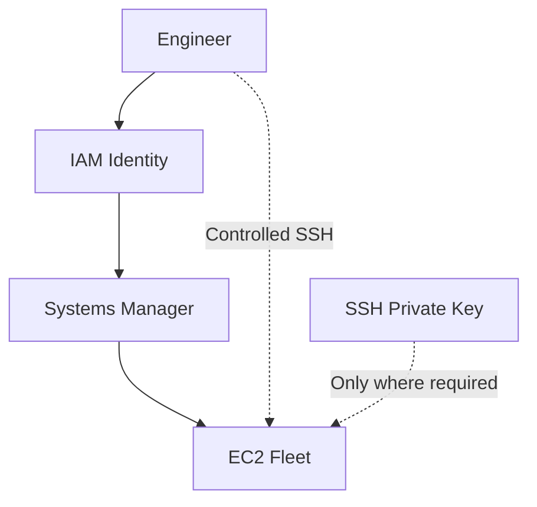

# 08- Key Pair Management

## Overview

Amazon EC2 key pairs provide a mechanism for authenticating to EC2 instances using public-key cryptography. For Linux instances, the private key is commonly used with SSH to establish administrative access.

A key pair consists of:

- A public key stored by AWS as part of the EC2 key-pair configuration.
- A private key retained by the operator.

The fundamental security model is:

```text
Operator
   |
   | Private Key
   v
SSH Client
   |
   | Authentication
   v
EC2 Instance
   |
   | Public Key
   v
Authorized Key
```

Key pair management matters because loss, exposure, incorrect permissions, or uncontrolled distribution of private keys can directly affect administrative access to EC2 instances.

For modern production environments, SSH key pairs should not automatically be the primary administrative-access mechanism. AWS Systems Manager Session Manager, IAM-based controls, centralized identity, and short-lived access mechanisms can reduce dependence on long-lived private keys.

## Key Pair Architecture

EC2 key pairs are associated with the launch process rather than acting as a general AWS identity.

A simplified workflow is:

```text
Create / Import Key Pair
          |
          v
Launch EC2
          |
          v
Public Key Installed on Instance
          |
          v
Operator Uses Private Key
          |
          v
SSH Authentication
```

The EC2 API does not provide a mechanism to recover the private key after it has been generated and downloaded.

This distinction is critical:

| Component | Location | Responsibility |
|---|---|---|
| Public key | AWS / EC2 instance | Authentication verification |
| Private key | Operator-controlled | Proves possession of the key |
| Key pair name | AWS | Identifies the EC2 key pair |
| SSH authorized keys | Instance OS | Determines which public keys can authenticate |

## Create an EC2 Key Pair

Create a key pair:

```bash
aws ec2 create-key-pair \
    --key-name production-admin \
    --query 'KeyMaterial' \
    --output text \
    --region ap-south-1 > production-admin.pem
```

The command creates the EC2 key pair and returns the private key material.

Immediately protect the resulting file.

On Linux or WSL:

```bash
chmod 400 production-admin.pem
```

On Windows, use appropriate filesystem permissions and protect the file from unauthorized users.

The private key should not be committed to Git:

```text
production-admin.pem
```

must be excluded through appropriate local and repository controls.

## Verify the Key Pair

List key pairs:

```bash
aws ec2 describe-key-pairs \
    --region ap-south-1
```

Compact output:

```bash
aws ec2 describe-key-pairs \
    --region ap-south-1 \
    --query 'KeyPairs[].{
        Name:KeyName,
        ID:KeyPairId,
        Type:KeyType,
        Fingerprint:KeyFingerprint
    }' \
    --output table
```

The fingerprint helps identify a particular public key.

## Inspect a Specific Key Pair

```bash
aws ec2 describe-key-pairs \
    --key-names production-admin \
    --region ap-south-1
```

Using the key-pair ID:

```bash
aws ec2 describe-key-pairs \
    --key-pair-ids key-0123456789abcdef0 \
    --region ap-south-1
```

The key pair ID is useful when names are ambiguous or when integrating with automation.

## Key Pair Types

EC2 supports different key types depending on the platform and workflow.

Common SSH key types include:

| Type | Typical Use |
|---|---|
| `rsa` | Broad compatibility |
| `ed25519` | Modern SSH environments where supported |

Inspect the type:

```bash
aws ec2 describe-key-pairs \
    --key-names production-admin \
    --query 'KeyPairs[0].KeyType' \
    --output text
```

Use an organization-approved key type and verify compatibility with the target operating system and SSH tooling.

## Import an Existing Public Key

If the organization already manages SSH keys externally, import the public key instead of generating a new private key through AWS.

For an existing public key:

```bash
aws ec2 import-key-pair \
    --key-name production-admin \
    --public-key-material fileb://~/.ssh/production-admin.pub \
    --region ap-south-1
```

The important security property is that the private key remains under the operator's existing key-management process.

AWS receives the public key, not the private key.

## Generate an SSH Key Locally

A modern OpenSSH workflow can generate an Ed25519 key:

```bash
ssh-keygen -t ed25519 -f ~/.ssh/production-admin
```

This creates:

```text
~/.ssh/production-admin
~/.ssh/production-admin.pub
```

The `.pub` file is the public key.

The file without `.pub` is the private key.

Import the public key:

```bash
aws ec2 import-key-pair \
    --key-name production-admin \
    --public-key-material fileb://~/.ssh/production-admin.pub \
    --region ap-south-1
```

Protect the private key:

```bash
chmod 600 ~/.ssh/production-admin
```

## Create vs Import

| Approach | Private Key Source | Typical Use |
|---|---|---|
| `create-key-pair` | AWS generates it and returns it once | Simple EC2 workflows |
| `import-key-pair` | Operator generates and controls it | Centralized key management |

For enterprise environments, importing organization-managed public keys can provide more control over private-key ownership and lifecycle.

## Launching an EC2 Instance with a Key Pair

A key pair can be specified during instance launch.

Example:

```bash
aws ec2 run-instances \
    --image-id ami-0123456789abcdef0 \
    --instance-type t3.small \
    --key-name production-admin \
    --security-group-ids sg-0123456789abcdef0 \
    --subnet-id subnet-0123456789abcdef0 \
    --region ap-south-1
```

The key pair must exist in the same AWS Region where the instance is launched.

## Region Scope

EC2 key pairs are regional resources.

For example:

```text
ap-south-1
    |
    +--> production-admin

ap-southeast-1
    |
    +--> production-admin
```

These are separate EC2 key-pair resources even if they use the same underlying public key material.

Verify the current region:

```bash
aws configure get region
```

Explicitly specify the region when performing production operations:

```bash
aws ec2 describe-key-pairs \
    --region ap-south-1
```

## SSH Authentication Flow

For a Linux EC2 instance:



The private key proves possession of the corresponding secret key material.

The public key is used by the instance to verify the authentication attempt.

## Connect Using SSH

A typical command is:

```bash
ssh -i ~/.ssh/production-admin ec2-user@203.0.113.10
```

The username depends on the AMI.

Common examples include:

| AMI Family | Common User |
|---|---|
| Amazon Linux | `ec2-user` |
| Ubuntu | `ubuntu` |
| RHEL | `ec2-user` or distribution-specific user |
| Debian | `admin` or distribution-specific user |

Do not assume the username based solely on the EC2 service. Verify the AMI documentation.

## Private Key File Permissions

SSH commonly rejects private keys that are accessible to other users.

On Linux:

```bash
chmod 400 ~/.ssh/production-admin
```

Verify:

```bash
ls -l ~/.ssh/production-admin
```

A private key should not be:

```text
world-readable
group-writable
stored in a shared directory
committed to Git
uploaded to public storage
```

## Key Pair and Security Group Relationship

A key pair does not make an instance reachable.

SSH requires both:

```text
Network Access
     +
Authentication
```

For example:

```text
Internet
   |
   | TCP 22
   v
Security Group
   |
   v
EC2
   |
   | SSH authentication
   v
Private Key
```

A valid private key cannot help if port 22 is blocked.

Conversely, an open port 22 does not provide access without valid authentication.

## SSH Troubleshooting

When SSH fails, separate network and authentication problems.

```text
SSH Failure
    |
    +--> Timeout?
    |      |
    |      +--> Check routing / SG / NACL / network
    |
    +--> Connection refused?
    |      |
    |      +--> Check SSH service / OS firewall
    |
    +--> Permission denied?
           |
           +--> Check username / private key / authorized_keys
```

Useful diagnostic command:

```bash
ssh -vvv \
    -i ~/.ssh/production-admin \
    ec2-user@203.0.113.10
```

Verbose SSH output can reveal whether the failure occurs during:

- TCP connection
- Host key verification
- Public-key authentication
- User authentication

## Find the Key Pair Associated with an Instance

Inspect an instance:

```bash
aws ec2 describe-instances \
    --instance-ids i-0123456789abcdef0 \
    --query 'Reservations[].Instances[].{
        Instance:InstanceId,
        KeyName:KeyName
    }' \
    --output table
```

This identifies the key pair specified during launch.

The presence of a `KeyName` does not guarantee that the corresponding private key is still available or that SSH access currently works.

## Key Pair Does Not Guarantee Current Access

An instance may have:

```text
KeyName = production-admin
```

while SSH access still fails because:

- The private key was lost
- The private key is wrong
- The OS user is incorrect
- `authorized_keys` changed
- SSH is disabled
- Port 22 is blocked
- Host firewall blocks access
- The instance is unreachable

Treat the EC2 `KeyName` as launch metadata, not proof of successful authentication.

## Key Rotation

Long-lived SSH keys should be rotated according to organizational security requirements.

A typical rotation process is:

```text
Generate New Key
      |
      v
Install Public Key
      |
      v
Test New Access
      |
      v
Remove Old Public Key
      |
      v
Revoke / Retire Old Key
```

Do not remove the old key before validating the replacement access path.

For fleet environments, manually changing `authorized_keys` on every server does not scale well.

Prefer centralized access mechanisms or configuration management.

## Replacing a Key on an Existing Instance

The EC2 key pair selected at launch is not a mechanism for remotely replacing the instance's SSH authorized keys.

For an existing instance, access must be changed through an appropriate administrative mechanism, such as:

- SSH using an existing valid credential
- AWS Systems Manager
- Cloud-init/User Data in controlled workflows
- Configuration management
- Image replacement
- Recovery procedures

A common operational mistake is assuming:

```bash
aws ec2 create-key-pair ...
```

automatically changes SSH access on existing instances.

It does not.

The new public key must actually be installed in the target operating system.

## AWS Systems Manager as an Alternative

For production administration, consider AWS Systems Manager Session Manager instead of exposing SSH.

Architecture:

```text
Operator
   |
   v
AWS IAM
   |
   v
Systems Manager
   |
   v
EC2 Agent
   |
   v
EC2 Instance
```

Advantages include:

- IAM-based authorization
- No requirement for inbound SSH
- Centralized access control
- Reduced private-key management
- Session auditing capabilities
- Better fit for private-subnet instances

This does not mean SSH is never appropriate. SSH remains useful for debugging, controlled administration, and environments where it is explicitly required.

## Key Pair Security Model

Private keys are credentials.

Protect them accordingly.

Recommended controls include:

- Strong filesystem permissions
- Encrypted workstation storage
- Hardware-backed key storage where appropriate
- Centralized enterprise key management
- Short-lived access where possible
- Rotation
- Access auditing
- No source-control storage
- No public file-sharing

Never store:

```text
production-admin.pem
```

in:

```text
GitHub repository
S3 public bucket
Slack message
ticket attachment
public artifact repository
```

## Private Key Exposure

If a private key is exposed, assume that unauthorized parties may be able to authenticate wherever the corresponding public key is trusted.

Do not merely delete the `.pem` file from your local machine.

The response should include:

```text
Exposure Detected
      |
      v
Identify Affected Instances
      |
      v
Install Replacement Key
      |
      v
Validate Replacement Access
      |
      v
Remove Compromised Public Key
      |
      v
Audit Access
      |
      v
Retire Compromised Key
```

If compromise is suspected, treat it as a security incident according to organizational procedures.

## Delete a Key Pair

Delete a key pair:

```bash
aws ec2 delete-key-pair \
    --key-name production-admin \
    --region ap-south-1
```

Using the key-pair ID:

```bash
aws ec2 delete-key-pair \
    --key-pair-id key-0123456789abcdef0 \
    --region ap-south-1
```

Deleting the EC2 key-pair resource does not automatically remove the corresponding public key from already-running instances.

This distinction is critical.

```text
AWS Key Pair
     |
     X
Delete from EC2 API
     |
     v
Existing Instance
     |
     +--> Existing authorized_keys may remain
```

Therefore, deleting the AWS resource alone is not a complete key-revocation mechanism for existing hosts.

## Safe Key Deletion

Before deleting a key pair:

```text
Identify Key
    |
    v
Find Instances Using It
    |
    v
Check Access Requirements
    |
    v
Install Replacement Access
    |
    v
Validate Access
    |
    v
Delete AWS Key Pair
    |
    v
Remove Old Public Key From Hosts
```

Find instances using a specific key:

```bash
aws ec2 describe-instances \
    --filters "Name=key-name,Values=production-admin" \
    --query 'Reservations[].Instances[].{
        Instance:InstanceId,
        State:State,
        KeyName:KeyName
    }' \
    --output table
```

## Find Unused Key Pairs

List key pairs:

```bash
aws ec2 describe-key-pairs \
    --region ap-south-1 \
    --query 'KeyPairs[].{
        Name:KeyName,
        ID:KeyPairId,
        Fingerprint:KeyFingerprint
    }' \
    --output table
```

Then compare them with instance launch metadata.

Unused key pairs should be reviewed periodically.

Do not delete a key solely because it is not associated with a currently running instance. It may be required for:

- Stopped instances
- Disaster recovery
- Launch Templates
- Operational recovery
- Automation

## Key Pairs and Launch Templates

Launch Templates can specify a key pair for instances launched from the template.

Conceptually:

```text
Launch Template
      |
      +--> AMI
      +--> Instance Type
      +--> Security Groups
      +--> Key Pair
      |
      v
EC2 Instance
```

When changing the administrative access model, inspect Launch Templates and their versions.

For example:

```bash
aws ec2 describe-launch-templates \
    --region ap-south-1
```

Inspect versions:

```bash
aws ec2 describe-launch-template-versions \
    --launch-template-id lt-0123456789abcdef0 \
    --region ap-south-1
```

A new deployment may continue launching instances with an outdated key configuration if the Launch Template is not updated.

## Key Pairs and Auto Scaling

Auto Scaling makes manual SSH key management increasingly problematic.

```text
Auto Scaling Group
       |
       +--> EC2-A
       +--> EC2-B
       +--> EC2-C
       +--> EC2-D
```

Instances may be created and terminated dynamically.

A better production model is:

```text
Auto Scaling Group
       |
       v
EC2 Fleet
       |
       +--> Systems Manager
       |
       +--> Centralized IAM access
```

If SSH is required, automate authorized-key distribution and rotation rather than manually managing each instance.

## Key Pairs and CI/CD

CI/CD systems should generally not require a long-lived SSH private key merely to deploy an application to EC2.

Prefer:

- AWS IAM roles
- OIDC federation
- Systems Manager
- CodeDeploy where appropriate
- Infrastructure as code
- Short-lived credentials

For example:

```text
GitHub Actions
      |
      | OIDC
      v
AWS IAM Role
      |
      v
AWS Deployment APIs
      |
      v
EC2 / ASG
```

This avoids storing a permanent EC2 private key in CI/CD secrets.

## SSH Key Pair vs IAM Credentials

These solve different problems.

| Credential | Purpose |
|---|---|
| EC2 SSH private key | OS-level SSH authentication |
| IAM role | AWS API authorization |
| IAM user access key | AWS API authorization |
| Systems Manager | Managed instance administration |
| Application secret | Application-level authentication |

Do not use an EC2 SSH private key as a substitute for AWS IAM credentials.

## Key Pair and Instance Identity

An EC2 key pair identifies an authentication credential for OS access.

It does not identify the AWS principal making API calls from the instance.

For AWS API access, use an EC2 IAM role:

```text
Application
    |
    v
EC2 Instance
    |
    v
IAM Role
    |
    v
AWS APIs
```

For example, a Django application accessing S3 should use the instance role rather than embedding AWS access keys in an SSH key or application configuration.

## Common Mistakes

### Losing the Private Key

AWS does not provide a way to download the private key again after the original key material is lost.

Maintain controlled backups or use centralized access mechanisms where appropriate.

### Committing Private Keys to Git

Never commit:

```text
*.pem
*.key
id_rsa
id_ed25519
```

to source control.

If a private key is committed, deleting the file from the latest commit is not sufficient if the key remains in repository history or has already been exposed.

Rotate the credential.

### Assuming Deleting the AWS Key Revokes SSH Access

Deleting the EC2 key-pair resource does not automatically remove the corresponding public key from existing instances.

### Opening SSH to the Internet

Avoid:

```text
TCP 22
0.0.0.0/0
```

when a controlled administrative path is available.

### Using One Key Forever

Long-lived shared credentials increase operational and security risk.

Use individual identities and rotation mechanisms where possible.

### Sharing One Private Key Across Engineers

A shared private key makes attribution and revocation difficult.

Prefer individual access through centralized mechanisms.

### Using SSH Keys for AWS API Access

SSH keys authenticate users to operating systems.

AWS APIs should use IAM-based authentication.

### Forgetting Launch Templates

Updating one instance's SSH configuration does not update future instances launched by an Auto Scaling Group.

Review Launch Templates and image configuration.

### Assuming the Key Pair Controls All SSH Access

A public key may also exist in:

```text
~/.ssh/authorized_keys
```

through mechanisms independent of the EC2 API key-pair resource.

## Operational Key Rotation

A production rotation workflow should minimize the chance of locking out operators.


For fleets, automate the process rather than performing manual changes.

A robust system should also provide an emergency access path through Systems Manager or another controlled recovery mechanism.

## Security Checklist

Before creating a key pair:

```text
[ ] Purpose defined
[ ] Owner defined
[ ] Region verified
[ ] Key type selected
[ ] Private key storage location secured
[ ] Rotation process defined
```

Before launching an EC2 instance:

```text
[ ] Correct key pair selected
[ ] Security Group reviewed
[ ] Administrative access path tested
[ ] SSM considered
[ ] Instance OS username verified
```

Before deleting a key pair:

```text
[ ] Instances using the key identified
[ ] Launch Templates checked
[ ] Auto Scaling dependencies checked
[ ] Replacement access installed
[ ] Replacement access tested
[ ] Old public keys removed where required
[ ] Recovery path verified
```

After key exposure:

```text
[ ] Incident identified
[ ] Affected instances identified
[ ] Replacement credentials created
[ ] New access validated
[ ] Compromised keys removed
[ ] Access logs reviewed
[ ] Credential retired
[ ] Incident documented
```

## Command Reference

| Operation | CLI |
|---|---|
| Create key pair | `aws ec2 create-key-pair` |
| Import public key | `aws ec2 import-key-pair` |
| List key pairs | `aws ec2 describe-key-pairs` |
| Inspect key pair | `aws ec2 describe-key-pairs --key-names <name>` |
| Delete key pair | `aws ec2 delete-key-pair` |
| Find instances using key | `aws ec2 describe-instances --filters "Name=key-name,Values=<name>"` |
| Inspect instance key | `aws ec2 describe-instances --instance-ids <id>` |
| Inspect launch templates | `aws ec2 describe-launch-templates` |
| Inspect template versions | `aws ec2 describe-launch-template-versions` |

## Senior-Level Access Architecture

A production EC2 environment should distinguish between legacy SSH access and modern centralized administration.



For long-lived EC2 fleets, the preferred operational model is usually:

```text
Human Identity
      |
      v
IAM
      |
      v
Centralized Access
      |
      v
EC2
```

rather than:

```text
Engineer
   |
   v
Shared PEM File
   |
   v
Public SSH
   |
   v
EC2
```

Key pairs remain useful when SSH is required, but they should be treated as sensitive authentication credentials with explicit ownership, lifecycle management, rotation, and recovery procedures.

## Key Takeaways

- **EC2 key pairs provide OS-level authentication, not AWS API authorization:** use IAM roles for AWS service access and appropriate centralized mechanisms for administrative access.
- **The private key is the sensitive credential:** protect it from source control, public storage, unauthorized sharing, and accidental exposure, and establish a controlled rotation process.
- **Deleting an EC2 key-pair resource does not automatically revoke existing host access:** existing public keys may remain in `authorized_keys` and must be removed through the appropriate host-management mechanism.
- **Modern production environments should minimize dependence on long-lived SSH keys:** Systems Manager Session Manager and IAM-based access can provide centralized, auditable administration without exposing SSH broadly.
- **Key management must account for the entire EC2 lifecycle:** inspect stopped instances, Launch Templates, Auto Scaling Groups, recovery paths, and existing hosts before rotating or deleting credentials.