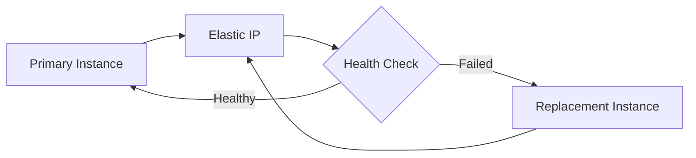
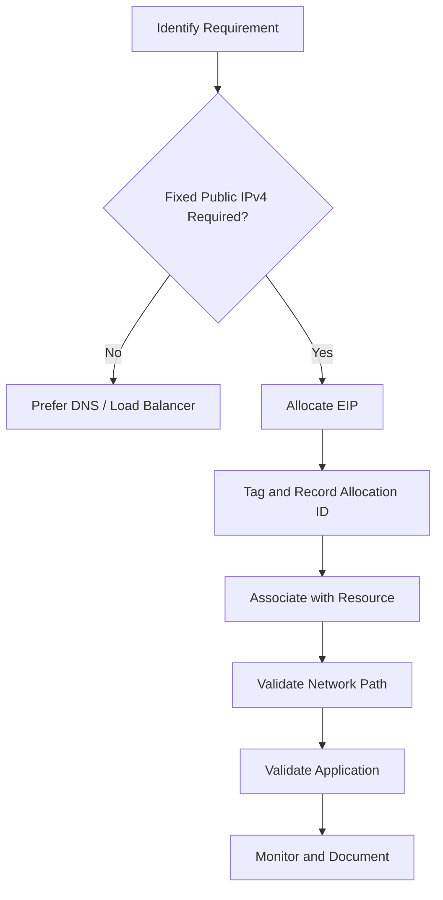

# 09- Elastic IP Management

## Overview

An Elastic IP address (EIP) is a static public IPv4 address that can be allocated to an AWS account and associated with supported AWS resources, including EC2 network interfaces.

Elastic IPs exist for workloads that require a stable public IPv4 address independent of the lifecycle of an EC2 instance.

Typical use cases include:

- A legacy application that requires IP allowlisting
- A fixed administrative endpoint
- A public service that cannot use a load balancer or DNS-based identity
- Controlled migration between EC2 instances
- Failover where a stable IPv4 address must move between resources

For modern backend architectures, an Elastic IP should not automatically be the default way to expose an application.

Prefer:

```text
Client
   |
   v
DNS
   |
   v
ALB / NLB / CloudFront
   |
   v
EC2 Fleet
```

rather than:

```text
Client
   |
   v
Elastic IP
   |
   v
Single EC2 Instance
```

An Elastic IP is most valuable when the public IPv4 address itself is part of the operational requirement.

## Elastic IP Architecture

The lifecycle of an Elastic IP is independent from the lifecycle of an EC2 instance.


The important distinction is:

```text
EC2 Instance
    |
    +--> Private IP
    |
    +--> Public IPv4 / Elastic IP
```

An Elastic IP is associated with a network interface, usually through the instance's primary network interface.

This allows the public address to remain stable while the underlying instance changes.

## Elastic IP vs Public IPv4

| Property | Auto-assigned Public IPv4 | Elastic IP |
|---|---|---|
| Stable across instance stop/start | No | Yes, while associated |
| Allocated separately | No | Yes |
| Can be moved between resources | Limited by association rules | Yes |
| Intended for persistent identity | Limited | Yes |
| Additional resource management | Minimal | Required |
| Suitable for static allowlisting | Usually no | Yes |
| Public IPv4 address cost | Subject to current AWS pricing | Subject to current AWS pricing |

The exact pricing model for public IPv4 addresses can change, so verify current AWS pricing before making cost assumptions.

## Allocate an Elastic IP

Allocate an Elastic IP for EC2:

```bash
aws ec2 allocate-address \
    --domain vpc \
    --region ap-south-1
```

Example response:

```json
{
    "AllocationId": "eipalloc-0123456789abcdef0",
    "PublicIp": "203.0.113.10",
    "Domain": "vpc",
    "NetworkBorderGroup": "ap-south-1"
}
```

The two values to track are:

- `AllocationId` — identifies the Elastic IP allocation
- `PublicIp` — the actual IPv4 address

Use the allocation ID for lifecycle operations.

## Capture the Allocation ID

A compact command is useful for automation:

```bash
aws ec2 allocate-address \
    --domain vpc \
    --region ap-south-1 \
    --query '{AllocationId:AllocationId,PublicIp:PublicIp}' \
    --output table
```

For scripts:

```bash
ALLOCATION_ID=$(aws ec2 allocate-address \
    --domain vpc \
    --region ap-south-1 \
    --query 'AllocationId' \
    --output text)

echo "$ALLOCATION_ID"
```

Treat the allocation ID as infrastructure state and do not rely only on the human-readable IP address.

## List Elastic IP Addresses

List allocated Elastic IPs:

```bash
aws ec2 describe-addresses \
    --region ap-south-1
```

Compact inventory:

```bash
aws ec2 describe-addresses \
    --region ap-south-1 \
    --query 'Addresses[].{
        PublicIP:PublicIp,
        AllocationId:AllocationId,
        AssociationId:AssociationId,
        InstanceId:InstanceId,
        NetworkInterfaceId:NetworkInterfaceId,
        PrivateIP:PrivateIpAddress
    }' \
    --output table
```

This is useful for identifying:

- Allocated addresses
- Associated instances
- Associated ENIs
- Unassociated addresses
- Addresses requiring cleanup

## Inspect a Specific Elastic IP

Filter by allocation ID:

```bash
aws ec2 describe-addresses \
    --allocation-ids eipalloc-0123456789abcdef0 \
    --region ap-south-1
```

Filter by public IP:

```bash
aws ec2 describe-addresses \
    --public-ips 203.0.113.10 \
    --region ap-south-1
```

For operational workflows, allocation IDs are generally preferable because they provide a stable AWS resource identifier.

## Associate an Elastic IP with an EC2 Instance

Associate an Elastic IP directly with an instance:

```bash
aws ec2 associate-address \
    --allocation-id eipalloc-0123456789abcdef0 \
    --instance-id i-0123456789abcdef0 \
    --region ap-south-1
```

AWS associates the Elastic IP with the instance's network interface.

Verify the result:

```bash
aws ec2 describe-addresses \
    --allocation-ids eipalloc-0123456789abcdef0 \
    --query 'Addresses[0].{
        PublicIP:PublicIp,
        InstanceId:InstanceId,
        NetworkInterfaceId:NetworkInterfaceId,
        PrivateIP:PrivateIpAddress,
        AssociationId:AssociationId
    }' \
    --output table
```

## Associate an Elastic IP with a Network Interface

For more explicit networking control, associate the address with an ENI:

```bash
aws ec2 associate-address \
    --allocation-id eipalloc-0123456789abcdef0 \
    --network-interface-id eni-0123456789abcdef0 \
    --region ap-south-1
```

Optionally specify the private IP when the ENI has multiple private addresses:

```bash
aws ec2 associate-address \
    --allocation-id eipalloc-0123456789abcdef0 \
    --network-interface-id eni-0123456789abcdef0 \
    --private-ip-address 10.0.10.25 \
    --region ap-south-1
```

This approach is useful when network interfaces are treated as explicit infrastructure resources.

## Association Model

A useful mental model is:

```text
Elastic IP
    |
    v
Elastic Network Interface
    |
    +--> Private IP
    |
    v
EC2 Instance
```

The public IPv4 address is therefore part of the instance's network configuration rather than an application-level property.

## Disassociate an Elastic IP

Inspect the association first:

```bash
aws ec2 describe-addresses \
    --allocation-ids eipalloc-0123456789abcdef0 \
    --query 'Addresses[0].AssociationId' \
    --output text
```

Then disassociate:

```bash
aws ec2 disassociate-address \
    --association-id eipassoc-0123456789abcdef0 \
    --region ap-south-1
```

After disassociation, the Elastic IP remains allocated to the AWS account.

This is different from releasing it.

```text
Disassociate
    |
    v
EIP remains allocated
```

versus:

```text
Release
    |
    v
EIP returns to AWS address pool
```

## Release an Elastic IP

Release an unneeded Elastic IP:

```bash
aws ec2 release-address \
    --allocation-id eipalloc-0123456789abcdef0 \
    --region ap-south-1
```

Before releasing:

```bash
aws ec2 describe-addresses \
    --allocation-ids eipalloc-0123456789abcdef0
```

Confirm that the address is no longer associated with a resource.

Releasing an Elastic IP is a destructive lifecycle operation. If the address is later needed, there is no guarantee that the same public IPv4 address can be reacquired.

## Disassociate vs Release

| Operation | Effect | Allocation Remains? | Address Guaranteed to Return? |
|---|---|---:|---:|
| Associate | Attaches EIP to resource | Yes | Yes |
| Disassociate | Removes resource association | Yes | Yes |
| Release | Returns EIP to AWS pool | No | No |

This distinction is a common operational interview question.

## Find Unassociated Elastic IPs

A useful cleanup query:

```bash
aws ec2 describe-addresses \
    --region ap-south-1 \
    --query 'Addresses[?AssociationId==null].{
        PublicIP:PublicIp,
        AllocationId:AllocationId
    }' \
    --output table
```

Unassociated addresses should be reviewed rather than automatically deleted.

They may intentionally be reserved for:

- Disaster recovery
- Migration
- Failover
- Planned maintenance
- IP allowlisting

## Tag Elastic IP Resources

Apply tags:

```bash
aws ec2 create-tags \
    --resources eipalloc-0123456789abcdef0 \
    --tags \
        Key=Name,Value=payments-primary \
        Key=Environment,Value=production \
        Key=Application,Value=payments-api \
        Key=ManagedBy,Value=terraform \
    --region ap-south-1
```

Tags help identify ownership and operational intent.

Useful tags include:

```text
Name
Environment
Application
Owner
CostCenter
ManagedBy
Purpose
```

## Elastic IP and DNS

For public applications, DNS is generally a better abstraction than distributing an IP address directly.

Prefer:

```text
api.example.com
      |
      v
Load Balancer
      |
      v
EC2 Fleet
```

over:

```text
api.example.com
      |
      v
Elastic IP
      |
      v
Single EC2
```

DNS decouples the client from the underlying infrastructure.

An Elastic IP may still be useful behind a DNS record when a stable public IPv4 address is explicitly required.

## Elastic IP and Application Load Balancer

An Application Load Balancer normally provides the stable service endpoint through DNS rather than a fixed public IP.

Conceptually:

```text
Client
  |
  v
api.example.com
  |
  v
ALB DNS
  |
  +--> EC2-A
  +--> EC2-B
  +--> EC2-C
```

Do not assign Elastic IPs to individual application instances simply because clients need a stable application endpoint.

Use the load balancer when the workload requires:

- Horizontal scaling
- Health-based routing
- TLS termination
- Path/host routing
- Multi-AZ distribution
- Connection management

## Elastic IP and Network Load Balancer

Network Load Balancers support static IP addresses and can provide Elastic IP addresses for their nodes where the architecture requires fixed public addresses.

This can be useful for:

- IP allowlisting
- TCP workloads
- High-performance network traffic
- Applications requiring static public addresses

The appropriate design depends on whether the requirement is truly a fixed IP or simply a stable service endpoint.

## Elastic IP and Auto Scaling

Elastic IPs and Auto Scaling Groups generally represent different architectural models.

An ASG expects instances to be replaceable:

```text
ASG
 |
 +--> EC2-A
 +--> EC2-B
 +--> EC2-C
```

If every instance requires a fixed public IP:

```text
EC2-A --> EIP-A
EC2-B --> EIP-B
EC2-C --> EIP-C
```

the architecture becomes tightly coupled to instance identity and complicates scaling.

Prefer:

```text
Client
   |
   v
ALB / NLB
   |
   v
Auto Scaling Group
```

when the application is designed for horizontal scaling.

## Elastic IP for Failover

A valid use case is moving a fixed public endpoint between replacement instances.

For example:

```text
                    +--> EC2-A
                    |
Elastic IP ---------+
                    |
                    +--> EC2-B
```

At a controlled point in time, the address can be moved from one resource to another.

A simplified failover workflow is:



This can be useful for legacy systems but introduces operational complexity.

For modern applications, managed load balancing and multi-AZ architectures are usually preferable when the workload supports them.

## Safe Elastic IP Failover

A controlled migration can follow:

```text
Identify Current Association
          |
          v
Validate Replacement Instance
          |
          v
Verify Network Configuration
          |
          v
Associate / Move EIP
          |
          v
Validate DNS / Connectivity
          |
          v
Validate Application
```

Check:

- Security Groups
- Route tables
- Network interface
- Application listener
- TLS configuration
- Host firewall
- Health endpoint
- External allowlists

Moving an IP does not automatically reproduce the complete application environment.

## Elastic IP and Security Groups

An Elastic IP does not bypass Security Group controls.

Traffic still follows the normal network path:

```text
Internet
   |
   v
Elastic IP
   |
   v
ENI
   |
   v
Security Group
   |
   v
EC2
```

If TCP 443 is not allowed by the relevant Security Group, assigning an Elastic IP does not make HTTPS reachable.

Similarly, a public IP does not guarantee:

- Internet routing
- Application availability
- Correct DNS
- Correct NACL configuration
- Listening service

## Elastic IP and Private Subnets

An Elastic IP is associated with a public-facing network configuration.

Private application instances should generally not require public IPv4 addresses.

A common architecture is:

```text
Internet
   |
   v
Public Subnet
   |
   v
ALB
   |
   v
Private Subnet
   |
   v
EC2 Application
```

The EC2 instances remain privately addressed while the public-facing load balancer handles Internet traffic.

## Elastic IP and NAT Gateway

NAT Gateways use public connectivity for outbound Internet access from private subnets.

Conceptually:

```text
Private EC2
    |
    v
NAT Gateway
    |
    v
Elastic IP
    |
    v
Internet
```

The EIP associated with a NAT Gateway is not an EIP associated directly with the private EC2 instance.

This distinction matters when external services need to allowlist outbound traffic from your AWS environment.

## Stable Outbound IP

A common requirement is:

```text
Private EC2
     |
     v
NAT Gateway
     |
     v
Static Public IPv4
     |
     v
External API
```

The external service can allowlist the NAT Gateway's public address.

This is preferable to assigning public Elastic IPs directly to every private application instance.

## Inspect Network Interfaces

When investigating an Elastic IP:

```bash
aws ec2 describe-network-interfaces \
    --filters "Name=association.public-ip,Values=203.0.113.10" \
    --region ap-south-1
```

Inspect the associated interface:

```bash
aws ec2 describe-network-interfaces \
    --network-interface-ids eni-0123456789abcdef0 \
    --region ap-south-1
```

Useful fields include:

- Network interface ID
- Private IP
- Public IP association
- Subnet
- VPC
- Security Groups
- Attachment
- Instance ID

## Find the Instance Behind an Elastic IP

```bash
aws ec2 describe-addresses \
    --public-ips 203.0.113.10 \
    --query 'Addresses[0].{
        PublicIP:PublicIp,
        InstanceId:InstanceId,
        NetworkInterfaceId:NetworkInterfaceId,
        PrivateIP:PrivateIpAddress,
        AssociationId:AssociationId
    }' \
    --output table
```

This is useful during incidents when only the public IP is known.

## Elastic IP Troubleshooting

A public endpoint may fail for several reasons.

Use this path:

```text
Client
  |
  v
DNS
  |
  v
Public IP
  |
  v
Route
  |
  v
NACL
  |
  v
Security Group
  |
  v
ENI
  |
  v
EC2
  |
  v
Application
```

Check:

1. DNS resolves to the expected address.
2. Elastic IP is allocated.
3. Elastic IP is associated.
4. Association points to the expected ENI/instance.
5. Subnet routing is correct.
6. Security Group allows required traffic.
7. NACL permits traffic.
8. Host firewall permits traffic.
9. Application is listening on the expected interface and port.
10. Application itself is healthy.

## Check Application Reachability

From an appropriate external test environment:

```bash
curl -v https://203.0.113.10/
```

For a TCP-level check:

```bash
nc -vz 203.0.113.10 443
```

For HTTP services:

```bash
curl -I http://203.0.113.10:8000/health
```

Use the correct protocol and port for the application.

## Elastic IP and Public DNS

An Elastic IP can be used with DNS:

```text
api.example.com
       |
       v
203.0.113.10
       |
       v
Elastic IP
       |
       v
EC2
```

However, DNS should generally remain the client-facing abstraction.

Applications should not embed:

```text
203.0.113.10
```

in configuration when a DNS name can be used.

For Django, FastAPI, gRPC, and microservices, use DNS-based service configuration wherever possible.

## Security Considerations

An Elastic IP increases public reachability only when the rest of the network path permits it, but public exposure should still be treated carefully.

Review:

- Security Groups
- NACLs
- Public subnet routing
- Host firewalls
- TLS
- Application authentication
- Rate limiting
- WAF where appropriate
- Monitoring
- Logging
- Abuse protection

A public IP should not be considered an authentication or security mechanism.

## Cost Considerations

Public IPv4 addresses are a billable AWS resource under current AWS pricing models.

Avoid accumulating unused Elastic IP allocations.

Regularly inspect:

```bash
aws ec2 describe-addresses \
    --region ap-south-1 \
    --query 'Addresses[?AssociationId==null].{
        PublicIP:PublicIp,
        AllocationId:AllocationId
    }' \
    --output table
```

Do not blindly release every unassociated address. First verify whether it is intentionally reserved.

## Operational Best Practices

Use these practices for production environments:

- Allocate EIPs only when a fixed public IPv4 address is actually required.
- Prefer DNS names and load balancers for application identity.
- Track `AllocationId` as infrastructure state.
- Tag EIPs with ownership and purpose.
- Monitor unassociated allocations.
- Avoid embedding public IP addresses in application code.
- Keep public-facing services behind appropriate network controls.
- Use infrastructure as code where practical.
- Document dependencies such as external IP allowlists.
- Validate failover procedures before an incident.
- Review current AWS public IPv4 pricing as part of cost management.

## Infrastructure as Code

Manual CLI operations are appropriate for controlled operational work, but persistent Elastic IP infrastructure should generally have a declarative source of truth.

A production model may look like:

```text
Infrastructure as Code
        |
        +--> Elastic IP
        |
        +--> Network Interface
        |
        +--> Security Group
        |
        +--> EC2 / Load Balancer
```

Manual changes outside the infrastructure lifecycle can create drift.

If an Elastic IP is intentionally reserved for failover, document that purpose in both infrastructure code and resource tags.

## Common Mistakes

### Treating an Elastic IP as a Requirement for Every EC2 Instance

Most horizontally scalable applications do not need a public IP on every instance.

Prefer:

```text
ALB
 |
 +--> EC2
 +--> EC2
 +--> EC2
```

rather than assigning public EIPs to every application server.

### Forgetting to Release Unused Addresses

An EIP can remain allocated after an instance is terminated.

Regularly inspect unassociated allocations.

### Releasing an Address During Migration

Releasing an EIP is not the same as disassociating it.

If the address is still required, disassociate it rather than releasing it.

### Hard-Coding the IP in Application Code

Avoid:

```python
DATABASE_HOST = "203.0.113.10"
```

Prefer configuration through DNS or service discovery:

```python
DATABASE_HOST = os.environ["DATABASE_HOST"]
```

### Assuming the EIP Makes the Service Available

The public IP is only one component of the network path.

### Using EIPs Instead of Load Balancing

An EIP attached to a single instance does not provide:

- Health-based routing
- Horizontal scaling
- Multi-instance distribution
- Connection draining
- Application-level failover

### Forgetting External Allowlists

If a third-party API allowlists your public IP, moving to another address can break connectivity even when AWS networking is configured correctly.

Document external dependencies before changing EIPs.

## Interview Traps

### Is an Elastic IP the Same as a Public IP?

No.

An automatically assigned public IPv4 address is associated with the lifecycle of the relevant resource, while an Elastic IP is an explicitly allocated public IPv4 resource that can be reassociated according to AWS networking rules.

### Does an Elastic IP Survive an EC2 Stop?

The Elastic IP remains allocated and associated according to its configuration, unlike an auto-assigned public IPv4 address whose behavior can differ across instance lifecycle operations.

### Does Disassociating Release the Elastic IP?

No.

```text
Disassociate != Release
```

Disassociation removes the resource association while the allocation remains under the account.

### Can an Elastic IP Be Moved?

Yes, an allocated EIP can generally be reassociated to another supported resource, subject to AWS networking constraints.

### Should Every EC2 Instance Have an Elastic IP?

No.

Private instances behind a load balancer or NAT Gateway generally do not need individual public Elastic IP addresses.

## Command Reference

| Operation | CLI |
|---|---|
| Allocate EIP | `aws ec2 allocate-address --domain vpc` |
| List EIPs | `aws ec2 describe-addresses` |
| Inspect by allocation | `aws ec2 describe-addresses --allocation-ids <allocation-id>` |
| Inspect by public IP | `aws ec2 describe-addresses --public-ips <public-ip>` |
| Associate with instance | `aws ec2 associate-address --allocation-id <id> --instance-id <id>` |
| Associate with ENI | `aws ec2 associate-address --allocation-id <id> --network-interface-id <id>` |
| Disassociate | `aws ec2 disassociate-address --association-id <association-id>` |
| Release | `aws ec2 release-address --allocation-id <allocation-id>` |
| Tag EIP | `aws ec2 create-tags --resources <allocation-id>` |
| Inspect ENI | `aws ec2 describe-network-interfaces` |

## Production EIP Workflow

A safe operational workflow is:



For an existing EIP migration:

```text
Identify EIP
    |
    v
Inspect Association
    |
    v
Validate Target Resource
    |
    v
Move Association
    |
    v
Validate Connectivity
    |
    v
Validate Application
    |
    v
Update Operational Documentation
```

The important engineering principle is to treat the Elastic IP as one component of the service's network identity, not as a substitute for application architecture.

## Key Takeaways

- **An Elastic IP is a persistent public IPv4 resource:** use it when a stable public address is an explicit requirement rather than assigning one to every EC2 instance.
- **Track the full EIP lifecycle:** `allocate`, `associate`, `disassociate`, and `release` are distinct operations, and releasing an address does not guarantee that it can later be recovered.
- **Prefer DNS and load balancers for scalable applications:** individual EIPs tightly couple clients and infrastructure to specific instances.
- **An EIP does not bypass network controls:** routing, NACLs, Security Groups, host firewalls, and application listeners still determine whether traffic succeeds.
- **Treat EIPs as managed infrastructure:** tag them, track allocation IDs, review unused addresses, document external allowlists, and use infrastructure as code for persistent production configurations.