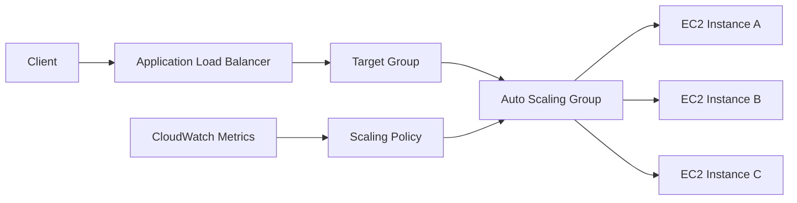
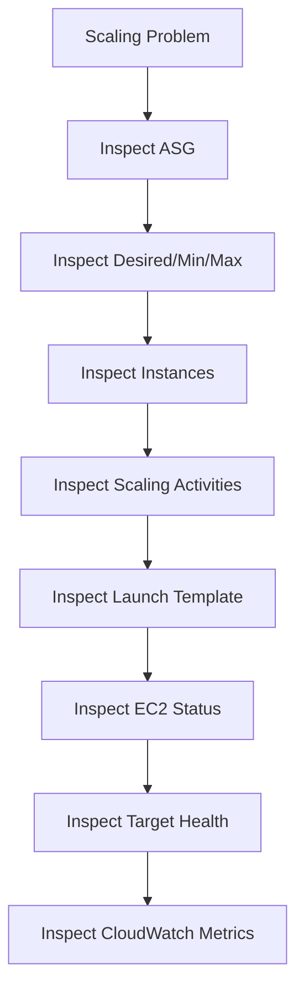
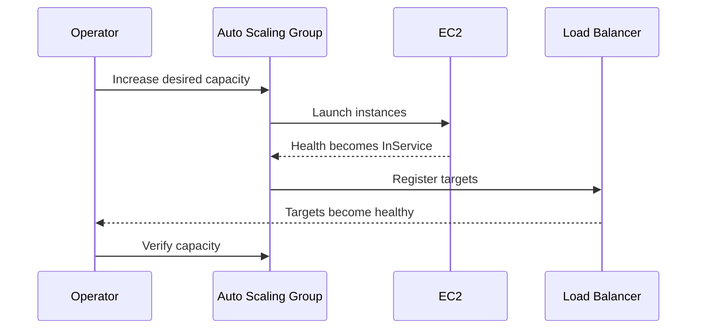

# 10- Auto Scaling CLI

## Overview

Amazon EC2 Auto Scaling automatically maintains a fleet of EC2 instances according to configured capacity, health, and scaling policies.

The AWS CLI provides direct operational control over Auto Scaling Groups (ASGs), launch templates, scaling policies, lifecycle hooks, instance health, and capacity settings.

A typical production architecture is:



The CLI is useful for:

- Inspecting Auto Scaling configuration
- Investigating scaling events
- Changing desired capacity
- Updating minimum and maximum capacity
- Inspecting instances
- Managing launch templates
- Inspecting scaling policies
- Investigating lifecycle hooks
- Performing controlled operational changes
- Automating operational workflows

The CLI should not replace infrastructure as code for persistent configuration. Manual CLI changes can create configuration drift when Terraform, CloudFormation, or another deployment system owns the same resources.

## Auto Scaling Resource Model

An EC2 Auto Scaling environment commonly consists of:

| Resource | Responsibility |
|---|---|
| Auto Scaling Group | Maintains the desired instance fleet |
| Launch Template | Defines how instances are launched |
| Scaling Policy | Determines how capacity changes |
| CloudWatch | Provides metrics and alarms used by scaling decisions |
| Load Balancer | Distributes application traffic |
| Target Group | Tracks application target registration and health |
| Lifecycle Hook | Pauses instance transitions for custom workflows |

The core relationship is:

```text
Launch Template
       |
       v
Auto Scaling Group
       |
       +---- EC2
       +---- EC2
       +---- EC2
       |
       v
Scaling Policies
       |
       v
CloudWatch Metrics
```

## List Auto Scaling Groups

List all Auto Scaling Groups in the current region:

```bash
aws autoscaling describe-auto-scaling-groups \
    --region ap-south-1
```

List only group names:

```bash
aws autoscaling describe-auto-scaling-groups \
    --region ap-south-1 \
    --query 'AutoScalingGroups[].AutoScalingGroupName' \
    --output text
```

For operational work, start with the group name and inspect the complete configuration afterward.

## Inspect an Auto Scaling Group

```bash
aws autoscaling describe-auto-scaling-groups \
    --auto-scaling-group-names payments-api-asg \
    --region ap-south-1
```

A compact operational view:

```bash
aws autoscaling describe-auto-scaling-groups \
    --auto-scaling-group-names payments-api-asg \
    --region ap-south-1 \
    --query 'AutoScalingGroups[0].{
        Name:AutoScalingGroupName,
        Min:MinSize,
        Desired:DesiredCapacity,
        Max:MaxSize,
        HealthCheck:HealthCheckType,
        GracePeriod:HealthCheckGracePeriod,
        LaunchTemplate:LaunchTemplate.LaunchTemplateName,
        Instances:length(Instances)
    }' \
    --output table
```

This gives a quick view of the group's capacity and launch configuration.

## Desired, Minimum, and Maximum Capacity

An ASG has three core capacity values:

```text
MinSize <= DesiredCapacity <= MaxSize
```

For example:

```text
Minimum: 2
Desired: 4
Maximum: 10
```

This means:

- The group should maintain at least 2 instances.
- It currently aims for 4 instances.
- Scaling policies can increase capacity up to 10 instances.

These values are not interchangeable.

| Setting | Purpose |
|---|---|
| Minimum | Lower capacity boundary |
| Desired | Current target capacity |
| Maximum | Upper capacity boundary |

## Inspect Capacity

```bash
aws autoscaling describe-auto-scaling-groups \
    --auto-scaling-group-names payments-api-asg \
    --query 'AutoScalingGroups[0].{
        Min:MinSize,
        Desired:DesiredCapacity,
        Max:MaxSize
    }' \
    --output table
```

A common production troubleshooting step is comparing configured capacity with actual healthy capacity.

## Change Desired Capacity

Increase desired capacity:

```bash
aws autoscaling set-desired-capacity \
    --auto-scaling-group-name payments-api-asg \
    --desired-capacity 6 \
    --region ap-south-1
```

Optional warm-up:

```bash
aws autoscaling set-desired-capacity \
    --auto-scaling-group-name payments-api-asg \
    --desired-capacity 6 \
    --honor-cooldown \
    --region ap-south-1
```

The desired capacity change instructs the ASG to converge toward the new capacity. It does not directly execute `run-instances` commands.

## Change Minimum and Maximum Capacity

```bash
aws autoscaling update-auto-scaling-group \
    --auto-scaling-group-name payments-api-asg \
    --min-size 3 \
    --max-size 12 \
    --region ap-south-1
```

You can update desired capacity at the same time:

```bash
aws autoscaling update-auto-scaling-group \
    --auto-scaling-group-name payments-api-asg \
    --min-size 3 \
    --desired-capacity 5 \
    --max-size 12 \
    --region ap-south-1
```

When changing capacity settings, verify the resulting configuration:

```bash
aws autoscaling describe-auto-scaling-groups \
    --auto-scaling-group-names payments-api-asg \
    --query 'AutoScalingGroups[0].{Min:MinSize,Desired:DesiredCapacity,Max:MaxSize}' \
    --output table
```

## Production Consideration for Capacity Changes

Manually increasing desired capacity can be useful during:

- Known traffic spikes
- Incident mitigation
- Deployment preparation
- Capacity investigations
- Controlled maintenance

However, a permanent manual change can conflict with the application's scaling strategy.

For recurring demand, use scaling policies instead of repeatedly changing desired capacity manually.

## Inspect Instances in an Auto Scaling Group

```bash
aws autoscaling describe-auto-scaling-instances \
    --region ap-south-1
```

Filter by Auto Scaling Group:

```bash
aws autoscaling describe-auto-scaling-instances \
    --region ap-south-1 \
    --query 'AutoScalingInstances[?AutoScalingGroupName==`payments-api-asg`].{
        InstanceId:InstanceId,
        Health:HealthStatus,
        Lifecycle:LifecycleState,
        Protected:ProtectedFromScaleIn,
        AZ:AvailabilityZone,
        LaunchTemplate:LaunchTemplate.LaunchTemplateName
    }' \
    --output table
```

This is one of the most useful commands during an ASG incident.

## Instance Lifecycle States

An instance inside an ASG has an Auto Scaling lifecycle state.

Common states include:

- `Pending`
- `InService`
- `Terminating`
- `Terminating:Wait`
- `Terminating:Proceed`
- `EnteringStandby`
- `Standby`
- `Detaching`
- `Detached`

The lifecycle state is separate from the EC2 instance state.

For example:

```text
EC2 state:
running

Auto Scaling state:
InService
```

Both pieces of information matter when diagnosing capacity problems.

## Describe a Specific Auto Scaling Instance

```bash
aws autoscaling describe-auto-scaling-instances \
    --instance-ids i-0123456789abcdef0 \
    --region ap-south-1
```

Useful fields include:

- Instance ID
- Auto Scaling Group
- Availability Zone
- Health status
- Lifecycle state
- Scale-in protection
- Launch template information

## Inspect Launch Template Configuration

List launch templates:

```bash
aws ec2 describe-launch-templates \
    --region ap-south-1
```

Inspect a specific template:

```bash
aws ec2 describe-launch-templates \
    --launch-template-names payments-api \
    --region ap-south-1
```

Inspect versions:

```bash
aws ec2 describe-launch-template-versions \
    --launch-template-name payments-api \
    --region ap-south-1
```

A launch template typically defines:

- AMI
- Instance type
- Security Groups
- IAM instance profile
- User data
- EBS configuration
- Metadata options
- Network configuration

The ASG uses the launch template to create replacement instances consistently.

## Inspect the Launch Template Used by an ASG

```bash
aws autoscaling describe-auto-scaling-groups \
    --auto-scaling-group-names payments-api-asg \
    --query 'AutoScalingGroups[0].LaunchTemplate' \
    --output table
```

For a production incident, verify that the ASG is using the expected launch template version.

A frequent failure pattern is:

```text
New AMI created
      |
      v
New Launch Template version
      |
      X
ASG still references old version
      |
      v
New instances use old configuration
```

## Update an ASG Launch Template

A launch template can be updated through:

```bash
aws autoscaling update-auto-scaling-group \
    --auto-scaling-group-name payments-api-asg \
    --launch-template LaunchTemplateName=payments-api,Version='$Latest' \
    --region ap-south-1
```

For production, explicitly controlling versions is often safer than relying blindly on `$Latest`.

For example:

```bash
aws autoscaling update-auto-scaling-group \
    --auto-scaling-group-name payments-api-asg \
    --launch-template LaunchTemplateName=payments-api,Version=7 \
    --region ap-south-1
```

Changing the launch template does not automatically mean existing instances are replaced immediately. A controlled instance refresh or other replacement mechanism may be required.

## Instance Refresh

Instance refresh is commonly used to roll out a new launch template configuration across an ASG.

Start a refresh:

```bash
aws autoscaling start-instance-refresh \
    --auto-scaling-group-name payments-api-asg \
    --preferences MinHealthyPercentage=90,InstanceWarmup=120 \
    --region ap-south-1
```

The response contains an instance refresh ID.

Inspect refresh status:

```bash
aws autoscaling describe-instance-refreshes \
    --auto-scaling-group-name payments-api-asg \
    --region ap-south-1
```

Inspect a specific refresh:

```bash
aws autoscaling describe-instance-refreshes \
    --auto-scaling-group-name payments-api-asg \
    --instance-refresh-ids 123456789012345678 \
    --region ap-south-1
```

The exact refresh strategy should be selected according to application startup time, capacity requirements, and availability objectives.

## Auto Scaling Policies

List scaling policies:

```bash
aws autoscaling describe-policies \
    --auto-scaling-group-name payments-api-asg \
    --region ap-south-1
```

Compact output:

```bash
aws autoscaling describe-policies \
    --auto-scaling-group-name payments-api-asg \
    --region ap-south-1 \
    --query 'ScalingPolicies[].{
        Name:PolicyName,
        Type:PolicyType,
        Adjustment:ScalingAdjustment,
        Metric:MetricAggregationType,
        Cooldown:Cooldown
    }' \
    --output table
```

Scaling policies define how the desired capacity should change in response to scaling conditions.

## Common Scaling Policy Types

| Policy Type | Purpose |
|---|---|
| Target tracking | Maintains a target metric value |
| Step scaling | Changes capacity by different amounts based on alarm thresholds |
| Simple scaling | Older scaling model based on a single adjustment |
| Predictive scaling | Uses historical patterns to forecast capacity requirements |

Target tracking is commonly used when the application has a meaningful utilization metric.

Examples include:

- Average CPU utilization
- Application request count per target
- Custom CloudWatch metrics

## Inspect Target Tracking Configuration

```bash
aws autoscaling describe-policies \
    --auto-scaling-group-name payments-api-asg \
    --region ap-south-1 \
    --query 'ScalingPolicies[?PolicyType==`TargetTrackingScaling`].{
        Name:PolicyName,
        Target:TargetTrackingConfiguration.TargetValue,
        PredefinedMetric:TargetTrackingConfiguration.PredefinedMetricSpecification.PredefinedMetricType
    }' \
    --output table
```

For production systems, choose a metric that correlates with actual capacity pressure.

CPU alone may be insufficient for:

- I/O-bound APIs
- Queue workers
- Network-heavy services
- Database-heavy workloads

## Create a Target Tracking Policy

Example using average CPU utilization:

```bash
aws autoscaling put-scaling-policy \
    --auto-scaling-group-name payments-api-asg \
    --policy-name payments-api-cpu-target \
    --policy-type TargetTrackingScaling \
    --target-tracking-configuration '{
        "PredefinedMetricSpecification": {
            "PredefinedMetricType": "ASGAverageCPUUtilization"
        },
        "TargetValue": 60.0
    }' \
    --region ap-south-1
```

The ASG and CloudWatch handle the policy evaluation and capacity adjustment.

## Scaling Policy Reasoning

A target tracking policy can be understood as:

```text
Observed Metric
      |
      v
Target Comparison
      |
      +---- Below Target ---> Reduce Capacity
      |
      +---- Near Target ----> Maintain Capacity
      |
      +---- Above Target ---> Increase Capacity
```

The actual behavior includes AWS-managed evaluation, cooldown/warm-up behavior, minimum and maximum capacity boundaries, and the characteristics of the selected metric.

## Inspect Scaling Activities

Scaling activities are critical for incident investigation.

```bash
aws autoscaling describe-scaling-activities \
    --auto-scaling-group-name payments-api-asg \
    --region ap-south-1
```

Compact output:

```bash
aws autoscaling describe-scaling-activities \
    --auto-scaling-group-name payments-api-asg \
    --region ap-south-1 \
    --query 'Activities[].{
        Time:StartTime,
        Status:StatusCode,
        Cause:Cause,
        Description:Description,
        Instance:Details.EC2InstanceId
    }' \
    --output table
```

This can reveal events such as:

- Launch failures
- Termination events
- Capacity changes
- Health replacement
- Failed instance launches
- Configuration problems

## Investigate Failed Scaling

A useful workflow is:



Start with:

```bash
aws autoscaling describe-auto-scaling-groups \
    --auto-scaling-group-names payments-api-asg \
    --region ap-south-1
```

Then:

```bash
aws autoscaling describe-scaling-activities \
    --auto-scaling-group-name payments-api-asg \
    --region ap-south-1 \
    --max-items 20
```

Then inspect the affected EC2 instances.

## Health Checks

An ASG can use EC2 health checks or ELB health checks.

Inspect the configuration:

```bash
aws autoscaling describe-auto-scaling-groups \
    --auto-scaling-group-names payments-api-asg \
    --query 'AutoScalingGroups[0].{
        HealthCheckType:HealthCheckType,
        GracePeriod:HealthCheckGracePeriod
    }' \
    --output table
```

For load-balanced applications, ELB health checks can provide a stronger signal because they test application reachability rather than only infrastructure state.

A simplified model is:

```text
EC2 Status
   |
   v
Infrastructure / Instance Health

ELB Target Health
   |
   v
Application Reachability
```

Do not confuse the two.

## Set Health Check Configuration

Example:

```bash
aws autoscaling update-auto-scaling-group \
    --auto-scaling-group-name payments-api-asg \
    --health-check-type ELB \
    --health-check-grace-period 120 \
    --region ap-south-1
```

The grace period should reflect realistic startup behavior.

If an application takes 90 seconds to initialize, a 30-second grace period can cause premature health-based replacement.

## Health Check Design

For a web service such as FastAPI or Django:

```text
ALB
 |
 v
/health
 |
 v
Application
```

A health endpoint should be:

- Lightweight
- Deterministic
- Fast
- Safe to call frequently

Do not make every external dependency a hard requirement unless that dependency is actually necessary for serving traffic.

For example, a health endpoint that performs multiple expensive database and third-party API calls can create unnecessary load and produce misleading failure signals.

## Lifecycle Hooks

Lifecycle hooks allow an ASG instance transition to pause while custom work occurs.

List hooks:

```bash
aws autoscaling describe-lifecycle-hooks \
    --auto-scaling-group-name payments-api-asg \
    --region ap-south-1
```

Lifecycle hooks can be useful for:

- Draining application work
- Log collection
- Registration/deregistration workflows
- Cleanup
- Bootstrap coordination
- Queue worker shutdown

A conceptual termination flow is:

```text
InService
    |
    v
Terminating:Wait
    |
    v
Drain / Cleanup
    |
    v
Terminating:Proceed
    |
    v
Terminated
```

## Create a Lifecycle Hook

Example:

```bash
aws autoscaling put-lifecycle-hook \
    --auto-scaling-group-name payments-api-asg \
    --lifecycle-hook-name drain-before-terminate \
    --lifecycle-transition autoscaling:EC2_INSTANCE_TERMINATING \
    --heartbeat-timeout 300 \
    --default-result CONTINUE \
    --region ap-south-1
```

The exact integration mechanism depends on the workflow, such as EventBridge, SQS, SNS, or Lambda.

## Complete a Lifecycle Action

When custom termination processing is complete:

```bash
aws autoscaling complete-lifecycle-action \
    --auto-scaling-group-name payments-api-asg \
    --lifecycle-hook-name drain-before-terminate \
    --instance-id i-0123456789abcdef0 \
    --lifecycle-action-result CONTINUE \
    --region ap-south-1
```

For failed cleanup where termination should still proceed, the action result and workflow should be designed carefully rather than leaving instances indefinitely in a wait state.

## Scale-In Protection

Inspect instances protected from scale-in:

```bash
aws autoscaling describe-auto-scaling-instances \
    --region ap-south-1 \
    --query 'AutoScalingInstances[?ProtectedFromScaleIn==`true`].{
        InstanceId:InstanceId,
        ASG:AutoScalingGroupName,
        Lifecycle:LifecycleState
    }' \
    --output table
```

Protection can be useful for controlled operational scenarios, but excessive protection can prevent the ASG from scaling in as intended.

## Set Instance Scale-In Protection

```bash
aws autoscaling set-instance-protection \
    --instance-ids i-0123456789abcdef0 \
    --auto-scaling-group-name payments-api-asg \
    --protected-from-scale-in \
    --region ap-south-1
```

Remove protection:

```bash
aws autoscaling set-instance-protection \
    --instance-ids i-0123456789abcdef0 \
    --auto-scaling-group-name payments-api-asg \
    --no-protected-from-scale-in \
    --region ap-south-1
```

Do not use scale-in protection as a substitute for correct workload draining and lifecycle management.

## Standby Instances

An instance can be placed into standby for controlled maintenance.

```bash
aws autoscaling enter-standby \
    --instance-ids i-0123456789abcdef0 \
    --auto-scaling-group-name payments-api-asg \
    --should-decrement-desired-capacity \
    --region ap-south-1
```

The `--should-decrement-desired-capacity` choice affects how the group's desired capacity is handled.

Inspect the result:

```bash
aws autoscaling describe-auto-scaling-instances \
    --instance-ids i-0123456789abcdef0 \
    --region ap-south-1
```

Standby is useful for controlled maintenance but should not become a permanent replacement for normal fleet management.

## Return an Instance From Standby

```bash
aws autoscaling exit-standby \
    --instance-ids i-0123456789abcdef0 \
    --auto-scaling-group-name payments-api-asg \
    --region ap-south-1
```

Validate:

```bash
aws autoscaling describe-auto-scaling-instances \
    --instance-ids i-0123456789abcdef0 \
    --query 'AutoScalingInstances[0].LifecycleState' \
    --output text
```

## Attach Existing Instances

An existing EC2 instance can be attached to an ASG in supported scenarios:

```bash
aws autoscaling attach-instances \
    --instance-ids i-0123456789abcdef0 \
    --auto-scaling-group-name payments-api-asg \
    --region ap-south-1
```

This should be used carefully because the instance may not match the launch template, networking, IAM, security, or application configuration expected by the fleet.

For immutable production fleets, creating instances through the ASG's launch configuration is generally easier to reason about.

## Detach Instances

```bash
aws autoscaling detach-instances \
    --instance-ids i-0123456789abcdef0 \
    --auto-scaling-group-name payments-api-asg \
    --should-decrement-desired-capacity \
    --region ap-south-1
```

Use this for controlled maintenance or migration scenarios.

Verify the instance afterward:

```bash
aws autoscaling describe-auto-scaling-instances \
    --instance-ids i-0123456789abcdef0 \
    --region ap-south-1
```

## Availability Zones

Inspect the subnets associated with an ASG:

```bash
aws autoscaling describe-auto-scaling-groups \
    --auto-scaling-group-names payments-api-asg \
    --query 'AutoScalingGroups[0].VPCZoneIdentifier' \
    --output text
```

A production ASG should generally span multiple Availability Zones.

```text
                 Load Balancer
                      |
          +-----------+-----------+
          |                       |
          v                       v
       AZ-a                    AZ-b
       EC2-A                   EC2-B
       EC2-C                   EC2-D
```

Multi-AZ placement reduces dependence on a single Availability Zone.

## Auto Scaling and Load Balancer Integration

Inspect target groups separately through ELBv2:

```bash
aws elbv2 describe-target-groups \
    --region ap-south-1
```

Inspect registered targets:

```bash
aws elbv2 describe-target-health \
    --target-group-arn arn:aws:elasticloadbalancing:ap-south-1:123456789012:targetgroup/payments/0123456789abcdef \
    --region ap-south-1
```

A healthy ASG does not automatically mean the application is healthy.

A useful operational distinction is:

```text
ASG
 |
 +--> EC2 lifecycle / health
 |
 v
Load Balancer
 |
 +--> Target health
 |
 v
Application
```

## Auto Scaling and Backend Applications

For Django or FastAPI:

```text
Internet
    |
    v
ALB
    |
    v
Target Group
    |
    +--> EC2 + Gunicorn/Uvicorn
    +--> EC2 + Gunicorn/Uvicorn
    +--> EC2 + Gunicorn/Uvicorn
```

The application should ideally be stateless so that any healthy instance can handle a request.

Avoid storing durable state only on the local instance filesystem.

Use managed or shared services for state such as:

- PostgreSQL/RDS
- Redis
- S3
- SQS
- Kafka/MSK where appropriate

This allows the ASG to replace instances without losing application state.

## Queue Worker Scaling

Auto Scaling can also support worker workloads.

For example:

```text
SQS
 |
 v
Auto Scaling Group
 |
 +--> Celery Worker
 +--> Celery Worker
 +--> Celery Worker
```

For workers, CPU may not be the best scaling signal.

Queue depth, message age, or processing latency can provide a more meaningful capacity metric.

## Operational Scaling Workflow

A controlled manual capacity increase can follow:



Do not consider the operation complete merely because EC2 instances have entered `running`.

Verify application readiness and target health.

## Safe Capacity Investigation

When an ASG is not scaling as expected:

```bash
aws autoscaling describe-auto-scaling-groups \
    --auto-scaling-group-names payments-api-asg \
    --region ap-south-1
```

Then:

```bash
aws autoscaling describe-scaling-activities \
    --auto-scaling-group-name payments-api-asg \
    --region ap-south-1 \
    --max-items 20
```

Then:

```bash
aws autoscaling describe-auto-scaling-instances \
    --region ap-south-1 \
    --query 'AutoScalingInstances[?AutoScalingGroupName==`payments-api-asg`].{
        Instance:InstanceId,
        Health:HealthStatus,
        Lifecycle:LifecycleState,
        AZ:AvailabilityZone
    }' \
    --output table
```

Then inspect:

- Launch template
- AMI
- Security Groups
- Subnets
- IAM instance profile
- User data
- EC2 status checks
- Load balancer target health
- CloudWatch metrics
- Scaling policies
- Scaling activities

## Common Scaling Failure Patterns

### Desired Capacity Is Increasing but Instances Are Not Launching

Inspect scaling activities:

```bash
aws autoscaling describe-scaling-activities \
    --auto-scaling-group-name payments-api-asg \
    --region ap-south-1 \
    --max-items 20
```

Common causes include:

- Invalid launch template
- Capacity constraints
- Invalid subnet configuration
- IAM permissions
- Security configuration
- Quotas
- Invalid AMI
- Unsupported instance configuration

### Instances Launch but Become Unhealthy

Check:

```text
EC2 status
   +
ELB target health
   +
Application logs
   +
Startup configuration
```

A common cause is an application that starts slower than the configured health-check grace period.

### Instances Continuously Launch and Terminate

This often indicates a feedback loop:

```text
Launch
  |
  v
Health Check
  |
  X
Unhealthy
  |
  v
Terminate
  |
  v
Launch Replacement
```

Investigate:

- AMI configuration
- User data
- Application startup
- Security Groups
- Health-check endpoint
- Target group configuration
- Health-check grace period
- Required dependencies
- Instance status checks

Repeated replacement should be treated as a configuration or health-signal problem, not solved by repeatedly launching more instances.

## CLI Automation

AWS CLI commands can be combined with shell scripts for controlled operational workflows.

Example:

```bash
#!/usr/bin/env bash

set -euo pipefail

ASG_NAME="payments-api-asg"
REGION="ap-south-1"

echo "Auto Scaling Group:"
aws autoscaling describe-auto-scaling-groups \
    --auto-scaling-group-names "$ASG_NAME" \
    --region "$REGION" \
    --query 'AutoScalingGroups[0].{
        Name:AutoScalingGroupName,
        Min:MinSize,
        Desired:DesiredCapacity,
        Max:MaxSize,
        HealthCheck:HealthCheckType
    }' \
    --output table

echo
echo "Instances:"
aws autoscaling describe-auto-scaling-instances \
    --region "$REGION" \
    --query "AutoScalingInstances[?AutoScalingGroupName=='$ASG_NAME'].{
        Instance:InstanceId,
        Health:HealthStatus,
        Lifecycle:LifecycleState,
        AZ:AvailabilityZone
    }" \
    --output table

echo
echo "Recent scaling activities:"
aws autoscaling describe-scaling-activities \
    --auto-scaling-group-name "$ASG_NAME" \
    --region "$REGION" \
    --max-items 10 \
    --query 'Activities[].{
        Time:StartTime,
        Status:StatusCode,
        Cause:Cause
    }' \
    --output table
```

For production automation, add explicit confirmation and change-management controls before making destructive or capacity-changing operations.

## CLI Safety

Before modifying an ASG:

```bash
aws sts get-caller-identity
```

Verify the active profile:

```bash
aws configure list
```

Verify the region:

```bash
aws configure get region
```

Then inspect the ASG:

```bash
aws autoscaling describe-auto-scaling-groups \
    --auto-scaling-group-names payments-api-asg \
    --region ap-south-1
```

Only then perform the change.

For destructive or high-impact actions:

- Use named AWS CLI profiles.
- Specify the region explicitly in automation.
- Prefer IDs over ambiguous names where possible.
- Review current desired/min/max capacity.
- Record the previous configuration.
- Use infrastructure as code for persistent changes.
- Avoid copy-pasting production commands without verifying resource identity.

## Infrastructure as Code and CLI

The CLI is excellent for:

- Inspection
- Incident response
- Controlled one-off operations
- Diagnostics
- Automation
- Emergency mitigation

Infrastructure as code is generally better for:

- Persistent ASG configuration
- Launch template versions
- Scaling policies
- Lifecycle hooks
- Capacity boundaries
- Repeatable environments
- Change review

A healthy operating model is:

```text
Terraform / CloudFormation
          |
          v
Desired Infrastructure State
          |
          v
AWS Resources
          ^
          |
      AWS CLI
   Inspection / Ops
```

Avoid making undocumented manual changes that will later be overwritten by a deployment pipeline.

## Security Considerations

Auto Scaling CLI operations require IAM permissions.

Separate read and write permissions where possible.

Read-heavy operational roles may need permissions such as:

```text
autoscaling:DescribeAutoScalingGroups
autoscaling:DescribeAutoScalingInstances
autoscaling:DescribeScalingActivities
autoscaling:DescribePolicies
ec2:DescribeInstances
ec2:DescribeLaunchTemplates
```

Write operations such as changing capacity or updating an ASG should be restricted to appropriate operational roles.

Avoid long-lived access keys in CI/CD.

Prefer short-lived credentials through IAM roles or workload identity mechanisms such as GitHub Actions OIDC where supported.

## Monitoring Considerations

An ASG should be monitored at multiple levels:

```text
Application
    |
    +--> Request latency
    +--> Error rate
    +--> Throughput

Load Balancer
    |
    +--> Target health
    +--> Request count
    +--> HTTP errors

Auto Scaling
    |
    +--> Desired capacity
    +--> In-service instances
    +--> Scaling activities

EC2
    |
    +--> CPU
    +--> Network
    +--> Status checks
```

Scaling metrics should represent actual workload pressure rather than simply relying on whichever metric is easiest to configure.

## Cost Considerations

Auto Scaling controls capacity but does not automatically guarantee cost efficiency.

Review:

- Minimum capacity
- Maximum capacity
- Desired capacity
- Instance types
- Utilization
- Scaling thresholds
- Idle capacity
- Launch frequency
- Unhealthy replacement loops
- On-Demand vs other purchasing options
- EBS resources associated with instances

An incorrectly configured ASG can continuously launch instances without solving the underlying problem.

## Production Best Practices

- Keep production ASGs multi-AZ where the workload supports it.
- Use launch templates rather than manually configured instances.
- Keep application instances as stateless as practical.
- Use load balancers for horizontally scalable web services.
- Use meaningful health checks.
- Set realistic health-check grace periods.
- Monitor scaling activities.
- Validate launch template versions before deployments.
- Use instance refresh for controlled fleet updates.
- Avoid excessive scale-in protection.
- Treat repeated instance replacement as an incident signal.
- Keep desired/min/max capacity aligned with actual service requirements.
- Use infrastructure as code for persistent configuration.
- Restrict write access to production Auto Scaling resources.
- Record operational changes made manually through the CLI.

## Common Mistakes

### Changing Desired Capacity Without Checking Maximum Capacity

If:

```text
Desired = 10
Max = 8
```

the intended capacity configuration is invalid.

Keep:

```text
Min <= Desired <= Max
```

### Updating the Launch Template but Not the ASG

Creating a new launch template version does not necessarily mean the ASG will immediately use it.

Verify the ASG configuration:

```bash
aws autoscaling describe-auto-scaling-groups \
    --auto-scaling-group-names payments-api-asg \
    --query 'AutoScalingGroups[0].LaunchTemplate' \
    --output table
```

### Assuming Running Means Healthy

An EC2 instance can be `running` while:

- The application has crashed.
- The port is closed.
- The health endpoint fails.
- The target is unhealthy.
- The instance fails a status check.

### Scaling on the Wrong Metric

CPU utilization may be a poor signal for an I/O-bound or queue-driven application.

Choose metrics that represent actual workload pressure.

### Ignoring Scaling Activities

The scaling activity history often contains the most useful explanation for failed launches or replacements.

### Using CLI Changes Without Recording Them

Manual changes can disappear from institutional knowledge and later be overwritten by IaC.

Record emergency changes and reconcile them with the source of truth.

### Using Lifecycle Hooks Without Timeout Planning

A lifecycle hook that never completes can leave instances waiting indefinitely or delay fleet operations.

Design explicit timeout and failure behavior.

## Interview Traps

### What Is the Difference Between Desired and Maximum Capacity?

Desired capacity is the current target number of instances. Maximum capacity is the upper boundary the ASG is allowed to reach.

### Does an ASG Launch an Instance Directly From a Security Group?

No.

The ASG uses its launch configuration or launch template, which can define the AMI, instance type, networking, Security Groups, IAM profile, storage, metadata options, and other launch parameters.

### Does Changing the Launch Template Replace Existing Instances?

Not automatically in every case.

Updating the launch template changes how future instances are launched. Existing instances generally require an instance refresh or another controlled replacement strategy.

### Why Can an ASG Continuously Replace Instances?

Common causes include:

- Failed EC2 health checks
- Failed load balancer health checks
- Broken AMI
- Invalid user data
- Application startup failures
- Incorrect networking
- Incorrect health endpoint
- Insufficient startup grace period

### Why Use an ASG With an ALB?

The ALB distributes requests among healthy targets while the ASG manages fleet capacity and instance replacement.

```text
ALB
 |
 v
Healthy Targets
 |
 v
ASG-managed EC2 Fleet
```

### Should Scaling Be Based Only on CPU?

No.

CPU is useful for some workloads but may not represent capacity pressure for network-bound, I/O-bound, database-bound, or queue-driven applications.

## Command Reference

| Operation | AWS CLI Command |
|---|---|
| List ASGs | `aws autoscaling describe-auto-scaling-groups` |
| Inspect ASG | `aws autoscaling describe-auto-scaling-groups --auto-scaling-group-names <name>` |
| List ASG instances | `aws autoscaling describe-auto-scaling-instances` |
| Inspect scaling activities | `aws autoscaling describe-scaling-activities --auto-scaling-group-name <name>` |
| Set desired capacity | `aws autoscaling set-desired-capacity` |
| Update ASG capacity | `aws autoscaling update-auto-scaling-group` |
| List scaling policies | `aws autoscaling describe-policies` |
| Create/update scaling policy | `aws autoscaling put-scaling-policy` |
| List lifecycle hooks | `aws autoscaling describe-lifecycle-hooks` |
| Create lifecycle hook | `aws autoscaling put-lifecycle-hook` |
| Complete lifecycle action | `aws autoscaling complete-lifecycle-action` |
| Enter standby | `aws autoscaling enter-standby` |
| Exit standby | `aws autoscaling exit-standby` |
| Attach instance | `aws autoscaling attach-instances` |
| Detach instance | `aws autoscaling detach-instances` |
| Set scale-in protection | `aws autoscaling set-instance-protection` |
| Start instance refresh | `aws autoscaling start-instance-refresh` |
| Inspect refresh | `aws autoscaling describe-instance-refreshes` |
| Inspect launch templates | `aws ec2 describe-launch-templates` |
| Inspect launch template versions | `aws ec2 describe-launch-template-versions` |
| Inspect target health | `aws elbv2 describe-target-health` |

## Production Incident Checklist

When an Auto Scaling Group is behaving unexpectedly:

```text
[ ] Verify AWS account and region
[ ] Identify the correct Auto Scaling Group
[ ] Inspect min / desired / max capacity
[ ] Inspect current ASG instances
[ ] Check lifecycle states
[ ] Check instance health
[ ] Check scaling activities
[ ] Check scaling policies
[ ] Check launch template and version
[ ] Check AMI and user data
[ ] Check EC2 status checks
[ ] Check load balancer target health
[ ] Check application startup
[ ] Check CloudWatch metrics
[ ] Check quotas and capacity constraints
[ ] Avoid repeated manual scaling without finding the root cause
[ ] Reconcile manual changes with infrastructure as code
```

## Key Takeaways

- **An Auto Scaling Group manages fleet capacity, not application correctness:** always correlate ASG state with EC2 health, load balancer target health, and application behavior.
- **Desired, minimum, and maximum capacity define the scaling boundaries:** maintain `Min <= Desired <= Max` and use scaling policies for recurring demand rather than repeated manual capacity changes.
- **Launch templates control instance configuration:** verify the ASG's active launch template version and use controlled instance refreshes when rolling out new AMIs or configuration.
- **Scaling activities are critical incident evidence:** use them with instance lifecycle, health checks, target health, and CloudWatch metrics to diagnose failed launches and replacement loops.
- **Use the CLI primarily for operations and diagnostics:** manage persistent Auto Scaling configuration through infrastructure as code and reconcile emergency CLI changes with the declared source of truth.