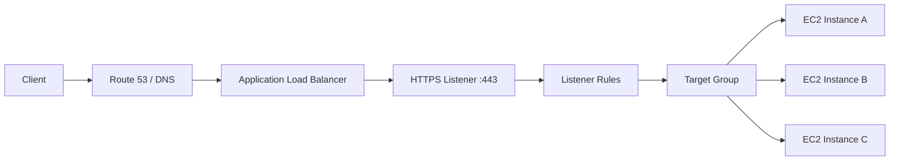
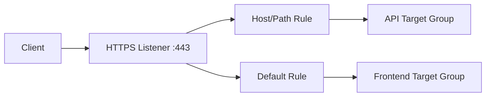
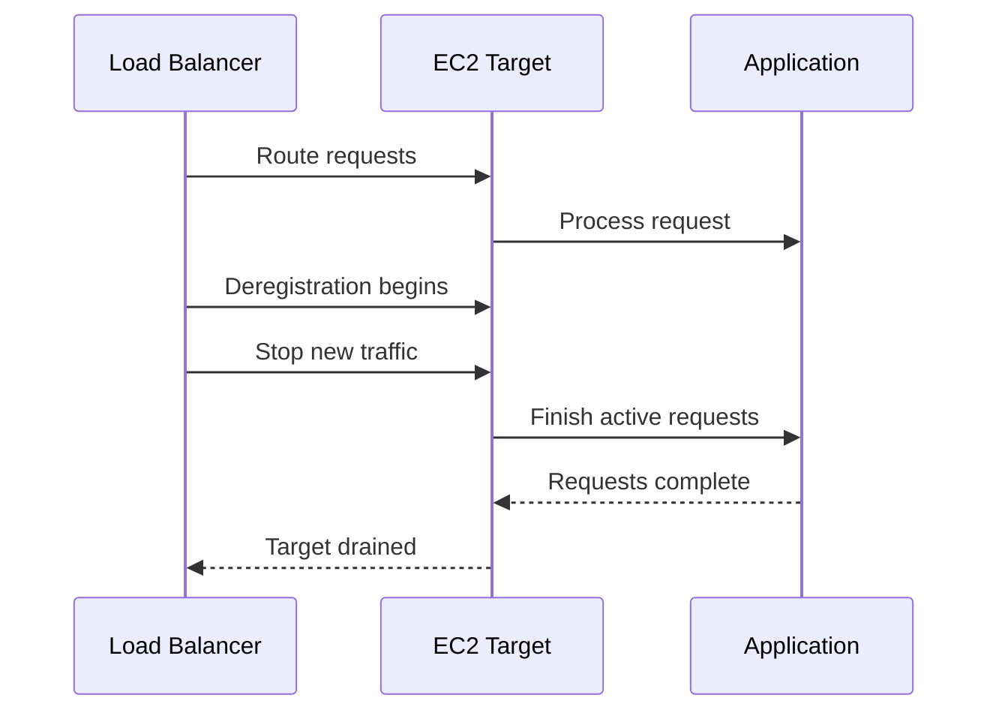
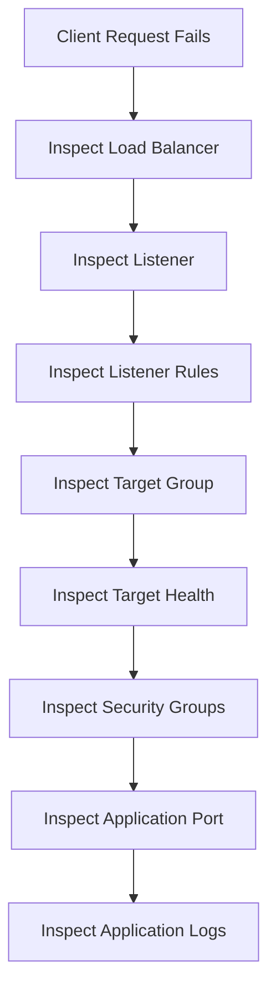

# 11- Load Balancer CLI

## Overview

Elastic Load Balancing (ELB) distributes incoming traffic across multiple targets such as EC2 instances, containers, and IP addresses.

For EC2-based backend systems, the AWS CLI is primarily used to inspect and operate:

- Load balancers
- Listeners
- Listener rules
- Target groups
- Registered targets
- Target health
- Load balancer attributes
- SSL/TLS certificates
- Availability and networking configuration

The most commonly used CLI namespace for Application Load Balancers (ALB) and Network Load Balancers (NLB) is:

```bash
aws elbv2
```

Classic Load Balancers use a separate namespace:

```bash
aws elb
```

For modern production architectures, ALB and NLB are generally the primary ELB resources to understand.

A typical EC2 backend architecture is:



The load balancer separates the public service endpoint from individual EC2 instances.

## Load Balancer Resource Model

The important ELBv2 resources are:

| Resource | Purpose |
|---|---|
| Load Balancer | Receives client traffic |
| Listener | Accepts traffic on a protocol and port |
| Listener Rule | Determines how traffic is routed |
| Target Group | Defines backend targets and health checks |
| Target | Backend destination such as EC2 instance or IP |
| Security Group | Controls network access for supported load balancers |
| SSL/TLS Certificate | Terminates HTTPS traffic where configured |

The request path is typically:

```text
Client
   |
   v
Load Balancer
   |
   v
Listener
   |
   v
Listener Rule
   |
   v
Target Group
   |
   v
Healthy Target
   |
   v
Application
```

## ALB vs NLB

| Feature | Application Load Balancer | Network Load Balancer |
|---|---|---|
| Layer | Application | Network |
| Primary protocols | HTTP/HTTPS | TCP/TLS/UDP/QUIC depending on configuration |
| Host/path routing | Yes | No application-level path routing |
| HTTP-aware | Yes | No |
| WebSocket support | Yes | Yes |
| Static IP support | Not generally the primary model | Yes |
| TLS termination | Yes | Yes |
| Typical use | REST APIs, web applications | TCP, high-performance network workloads |
| Target types | Instance, IP, Lambda | Instance, IP, ALB |

For Django and FastAPI services, an ALB is commonly appropriate when HTTP-aware routing is required.

For TCP-based services or workloads requiring static IP addresses, an NLB may be more appropriate.

## AWS CLI ELBv2 Namespace

Most modern load balancer operations use:

```bash
aws elbv2 <command>
```

For example:

```bash
aws elbv2 describe-load-balancers \
    --region ap-south-1
```

The AWS CLI automatically uses the credentials and region from the active configuration unless explicitly overridden.

Verify identity before production operations:

```bash
aws sts get-caller-identity
```

Verify the region:

```bash
aws configure get region
```

For automation, explicitly specify the region:

```bash
REGION="ap-south-1"

aws elbv2 describe-load-balancers \
    --region "$REGION"
```

## List Load Balancers

```bash
aws elbv2 describe-load-balancers \
    --region ap-south-1
```

Display a compact inventory:

```bash
aws elbv2 describe-load-balancers \
    --region ap-south-1 \
    --query 'LoadBalancers[].{
        Name:LoadBalancerName,
        Type:Type,
        Scheme:Scheme,
        State:State.Code,
        DNS:DNSName,
        VPC:VpcId
    }' \
    --output table
```

Useful information includes:

- Load balancer name
- ARN
- Type
- Scheme
- State
- DNS name
- VPC
- Availability Zones
- Security Groups

## Inspect a Specific Load Balancer

```bash
aws elbv2 describe-load-balancers \
    --names payments-api-alb \
    --region ap-south-1
```

Extract the ARN:

```bash
aws elbv2 describe-load-balancers \
    --names payments-api-alb \
    --region ap-south-1 \
    --query 'LoadBalancers[0].LoadBalancerArn' \
    --output text
```

Store it for subsequent commands:

```bash
LB_ARN=$(aws elbv2 describe-load-balancers \
    --names payments-api-alb \
    --region ap-south-1 \
    --query 'LoadBalancers[0].LoadBalancerArn' \
    --output text)

echo "$LB_ARN"
```

Using the ARN avoids repeatedly resolving the resource by name.

## Load Balancer Scheme

A load balancer can be internet-facing or internal.

Inspect the scheme:

```bash
aws elbv2 describe-load-balancers \
    --names payments-api-alb \
    --query 'LoadBalancers[0].Scheme' \
    --output text
```

Typical values are:

```text
internet-facing
internal
```

Architecture:

```text
Internet-facing:

Internet
   |
   v
Public ALB
   |
   v
Private EC2

Internal:

Internal Clients
      |
      v
Internal ALB
      |
      v
Private EC2
```

An internal load balancer is appropriate for private service-to-service traffic.

## Load Balancer State

Inspect the state:

```bash
aws elbv2 describe-load-balancers \
    --names payments-api-alb \
    --query 'LoadBalancers[0].State' \
    --output table
```

A load balancer can be operationally available while individual targets remain unhealthy.

Therefore:

```text
Load Balancer State != Application Health
```

Target health must be inspected separately.

## Availability Zones

Inspect the configured Availability Zones:

```bash
aws elbv2 describe-load-balancers \
    --names payments-api-alb \
    --query 'LoadBalancers[0].AvailabilityZones[].{
        Zone:ZoneName,
        Subnet:SubnetId
    }' \
    --output table
```

For production, distribute load balancer and backend capacity across multiple Availability Zones where the workload requires high availability.

## List Listeners

Listeners determine where the load balancer accepts traffic.

```bash
aws elbv2 describe-listeners \
    --load-balancer-arn "$LB_ARN" \
    --region ap-south-1
```

Compact output:

```bash
aws elbv2 describe-listeners \
    --load-balancer-arn "$LB_ARN" \
    --region ap-south-1 \
    --query 'Listeners[].{
        ListenerArn:ListenerArn,
        Protocol:Protocol,
        Port:Port,
        DefaultActions:DefaultActions[].Type
    }' \
    --output table
```

A typical configuration is:

```text
HTTPS :443
    |
    v
Target Group
```

## Listener Lifecycle

A listener connects the public-facing endpoint to routing logic:



Without an appropriate listener and rule configuration, a load balancer can be reachable while requests still fail to reach the expected backend.

## Inspect a Listener

```bash
aws elbv2 describe-listeners \
    --listener-arns arn:aws:elasticloadbalancing:ap-south-1:123456789012:listener/app/payments-api/abc123/def456 \
    --region ap-south-1
```

Extract default actions:

```bash
aws elbv2 describe-listeners \
    --listener-arns "$LISTENER_ARN" \
    --query 'Listeners[0].DefaultActions' \
    --output json
```

## Create an HTTP Listener

Example:

```bash
aws elbv2 create-listener \
    --load-balancer-arn "$LB_ARN" \
    --protocol HTTP \
    --port 80 \
    --default-actions Type=forward,TargetGroupArn="$TARGET_GROUP_ARN" \
    --region ap-south-1
```

The listener requires a default action.

For production HTTPS services, TLS termination is generally preferred over exposing application traffic directly over HTTP.

## Create an HTTPS Listener

An HTTPS listener requires a certificate:

```bash
aws elbv2 create-listener \
    --load-balancer-arn "$LB_ARN" \
    --protocol HTTPS \
    --port 443 \
    --certificates CertificateArn="$CERTIFICATE_ARN" \
    --default-actions Type=forward,TargetGroupArn="$TARGET_GROUP_ARN" \
    --region ap-south-1
```

The certificate is typically managed through AWS Certificate Manager (ACM).

## Target Groups

A target group represents the backend destination set and defines health-check behavior.

List target groups:

```bash
aws elbv2 describe-target-groups \
    --region ap-south-1
```

Compact output:

```bash
aws elbv2 describe-target-groups \
    --region ap-south-1 \
    --query 'TargetGroups[].{
        Name:TargetGroupName,
        Protocol:Protocol,
        Port:Port,
        TargetType:TargetType,
        HealthPath:HealthCheckPath,
        HealthPort:HealthCheckPort,
        HealthProtocol:HealthCheckProtocol,
        VPC:VpcId
    }' \
    --output table
```

## Inspect a Target Group

```bash
aws elbv2 describe-target-groups \
    --names payments-api-tg \
    --region ap-south-1
```

Extract the ARN:

```bash
TARGET_GROUP_ARN=$(aws elbv2 describe-target-groups \
    --names payments-api-tg \
    --region ap-south-1 \
    --query 'TargetGroups[0].TargetGroupArn' \
    --output text)
```

## Target Types

Common target types include:

| Target Type | Use |
|---|---|
| `instance` | EC2 instance targets |
| `ip` | IP address targets |
| `lambda` | Lambda function targets |
| `alb` | ALB as a target for supported architectures |

For an EC2 Auto Scaling Group, `instance` targets are a common configuration.

For containerized or service-oriented architectures, IP targets can be useful.

## Register an EC2 Target

Register an instance:

```bash
aws elbv2 register-targets \
    --target-group-arn "$TARGET_GROUP_ARN" \
    --targets Id=i-0123456789abcdef0 \
    --region ap-south-1
```

Specify a port when required:

```bash
aws elbv2 register-targets \
    --target-group-arn "$TARGET_GROUP_ARN" \
    --targets Id=i-0123456789abcdef0,Port=8000 \
    --region ap-south-1
```

For production ASG-managed fleets, target registration is normally handled by the Auto Scaling integration rather than manually registering every instance.

## Deregister a Target

```bash
aws elbv2 deregister-targets \
    --target-group-arn "$TARGET_GROUP_ARN" \
    --targets Id=i-0123456789abcdef0 \
    --region ap-south-1
```

Deregistration is useful during:

- Maintenance
- Controlled migration
- Instance replacement
- Incident response

For production deployments, use connection draining and graceful application shutdown rather than abruptly terminating active targets.

## Inspect Registered Targets

```bash
aws elbv2 describe-target-health \
    --target-group-arn "$TARGET_GROUP_ARN" \
    --region ap-south-1
```

Compact output:

```bash
aws elbv2 describe-target-health \
    --target-group-arn "$TARGET_GROUP_ARN" \
    --region ap-south-1 \
    --query 'TargetHealthDescriptions[].{
        Target:Target.Id,
        Port:Target.Port,
        State:TargetHealth.State,
        Reason:TargetHealth.Reason,
        Description:TargetHealth.Description
    }' \
    --output table
```

This is one of the most important load balancer troubleshooting commands.

## Target Health States

Common target health states include:

- `initial`
- `healthy`
- `unhealthy`
- `unused`
- `draining`
- `unavailable`

The exact state and reason should be interpreted using the target group configuration and current AWS behavior.

A useful diagnostic model is:

```text
Target
  |
  v
Health Check
  |
  +--> Healthy ----> Eligible for traffic
  |
  +--> Unhealthy --> Traffic excluded
```

## Inspect Target Health Reasons

For more detail:

```bash
aws elbv2 describe-target-health \
    --target-group-arn "$TARGET_GROUP_ARN" \
    --region ap-south-1 \
    --include \
    --output json
```

The response can help identify problems such as:

- Failed health checks
- Incorrect port
- Incorrect protocol
- Connection failures
- Timeout
- Invalid response
- Target registration issues

## Health Check Configuration

Inspect target group health-check settings:

```bash
aws elbv2 describe-target-groups \
    --target-group-arns "$TARGET_GROUP_ARN" \
    --region ap-south-1 \
    --query 'TargetGroups[0].{
        Protocol:HealthCheckProtocol,
        Port:HealthCheckPort,
        Path:HealthCheckPath,
        Interval:HealthCheckIntervalSeconds,
        Timeout:HealthCheckTimeoutSeconds,
        HealthyThreshold:HealthyThresholdCount,
        UnhealthyThreshold:UnhealthyThresholdCount
    }' \
    --output table
```

For an HTTP backend:

```text
ALB
 |
 | GET /health
 v
EC2 :8000
 |
 v
200 OK
```

The endpoint should be lightweight and designed specifically for health checking.

## Modify Target Group Health Checks

For example:

```bash
aws elbv2 modify-target-group \
    --target-group-arn "$TARGET_GROUP_ARN" \
    --health-check-protocol HTTP \
    --health-check-path /health \
    --health-check-port traffic-port \
    --health-check-interval-seconds 30 \
    --health-check-timeout-seconds 5 \
    --healthy-threshold-count 3 \
    --unhealthy-threshold-count 3 \
    --region ap-south-1
```

Do not blindly increase thresholds to hide application failures.

Health-check parameters should reflect realistic application startup and failure characteristics.

## Create a Target Group

Example for an EC2 HTTP application:

```bash
aws elbv2 create-target-group \
    --name payments-api-tg \
    --protocol HTTP \
    --port 8000 \
    --target-type instance \
    --vpc-id vpc-0123456789abcdef0 \
    --health-check-protocol HTTP \
    --health-check-path /health \
    --health-check-port traffic-port \
    --region ap-south-1
```

A FastAPI or Django service might run behind Gunicorn/Uvicorn on port `8000`.

The target group does not automatically make the application reachable. The instance Security Group must permit traffic from the load balancer's Security Group on the application port.

## Security Group Flow

A recommended pattern is:

```text
Internet
   |
   v
ALB Security Group
   |
   | TCP 443
   v
ALB
   |
   | TCP 8000
   v
EC2 Security Group
   |
   v
Application
```

The EC2 Security Group should generally allow application traffic from the load balancer Security Group rather than from the entire Internet.

## Listener Rules

List rules:

```bash
aws elbv2 describe-rules \
    --listener-arn "$LISTENER_ARN" \
    --region ap-south-1
```

Compact output:

```bash
aws elbv2 describe-rules \
    --listener-arn "$LISTENER_ARN" \
    --region ap-south-1 \
    --query 'Rules[].{
        Priority:Priority,
        Actions:Actions[].Type,
        Conditions:Conditions
    }' \
    --output json
```

Listener rules can route requests based on conditions such as:

- Host header
- Path pattern
- HTTP headers
- Query string
- Source IP

## Host-Based Routing

A common microservices architecture is:

```text
api.example.com
       |
       v
      ALB
       |
       +--> payments-api-tg
       |
       +--> orders-api-tg
```

Inspect the rules:

```bash
aws elbv2 describe-rules \
    --listener-arn "$LISTENER_ARN" \
    --query 'Rules[].{
        Priority:Priority,
        Conditions:Conditions,
        Actions:Actions
    }' \
    --output json
```

This is useful when debugging why traffic reaches the wrong service.

## Path-Based Routing

For example:

```text
example.com/api/payments/*
              |
              v
      payments-api-tg

example.com/api/orders/*
              |
              v
       orders-api-tg
```

Inspect listener rules to verify that the expected path condition and target group are configured.

## Listener Rule Priorities

Rules are evaluated according to their priority.

A typical structure is:

```text
Priority 10 -> /payments/* -> payments-api
Priority 20 -> /orders/*   -> orders-api
Default     -> frontend
```

A broad rule placed before a more specific rule can capture traffic unexpectedly.

This is a common production routing mistake.

## Modify Listener Rules

Modify the actions for an existing rule:

```bash
aws elbv2 modify-rule \
    --rule-arn "$RULE_ARN" \
    --actions Type=forward,TargetGroupArn="$TARGET_GROUP_ARN" \
    --region ap-south-1
```

Inspect the result:

```bash
aws elbv2 describe-rules \
    --rule-arns "$RULE_ARN" \
    --region ap-south-1
```

For production changes, validate rule ordering and target health before switching live traffic.

## Create a Listener Rule

Example path-based rule:

```bash
aws elbv2 create-rule \
    --listener-arn "$LISTENER_ARN" \
    --priority 10 \
    --conditions Field=path-pattern,Values='/api/payments/*' \
    --actions Type=forward,TargetGroupArn="$TARGET_GROUP_ARN" \
    --region ap-south-1
```

A more complex rule may use multiple conditions.

Review the resulting configuration:

```bash
aws elbv2 describe-rules \
    --listener-arn "$LISTENER_ARN" \
    --region ap-south-1
```

## Delete a Listener Rule

```bash
aws elbv2 delete-rule \
    --rule-arn "$RULE_ARN" \
    --region ap-south-1
```

Before deleting a production rule, verify that:

- No critical traffic depends on it.
- Another rule does not unintentionally route the same traffic.
- The default action remains valid.

## SSL/TLS Certificates

Inspect certificates associated with an HTTPS listener:

```bash
aws elbv2 describe-listener-certificates \
    --listener-arn "$LISTENER_ARN" \
    --region ap-south-1
```

Add a certificate:

```bash
aws elbv2 add-listener-certificates \
    --listener-arn "$LISTENER_ARN" \
    --certificates CertificateArn="$CERTIFICATE_ARN" \
    --region ap-south-1
```

Remove a certificate:

```bash
aws elbv2 remove-listener-certificates \
    --listener-arn "$LISTENER_ARN" \
    --certificates CertificateArn="$CERTIFICATE_ARN" \
    --region ap-south-1
```

Certificate lifecycle is generally better managed through ACM and infrastructure as code rather than manually maintained CLI operations.

## SNI and Certificates

An HTTPS listener can support multiple certificates using Server Name Indication (SNI).

Conceptually:

```text
Client
  |
  | TLS + hostname
  v
HTTPS Listener
  |
  +--> api.example.com certificate
  |
  +--> admin.example.com certificate
  |
  +--> payments.example.com certificate
```

Inspect listener certificates:

```bash
aws elbv2 describe-listener-certificates \
    --listener-arn "$LISTENER_ARN" \
    --region ap-south-1
```

This is useful when multiple applications share the same ALB.

## Default Listener Action

Inspect:

```bash
aws elbv2 describe-listeners \
    --listener-arns "$LISTENER_ARN" \
    --query 'Listeners[0].DefaultActions' \
    --output json
```

The default action handles requests that do not match a higher-priority rule.

A common production pattern is to forward to a default target group or return a controlled fixed response.

## Load Balancer Attributes

Inspect attributes:

```bash
aws elbv2 describe-load-balancer-attributes \
    --load-balancer-arn "$LB_ARN" \
    --region ap-south-1
```

The output may include settings related to:

- Access logging
- Deletion protection
- Idle timeout
- Routing behavior
- HTTP desync mitigation
- Other service-specific attributes

Always verify the current AWS documentation for attributes supported by the selected load balancer type.

## Modify Load Balancer Attributes

Example:

```bash
aws elbv2 modify-load-balancer-attributes \
    --load-balancer-arn "$LB_ARN" \
    --attributes Key=deletion_protection.enabled,Value=true \
    --region ap-south-1
```

Attribute changes should be treated as production configuration changes and recorded in the infrastructure source of truth.

## Target Group Attributes

Inspect:

```bash
aws elbv2 describe-target-group-attributes \
    --target-group-arn "$TARGET_GROUP_ARN" \
    --region ap-south-1
```

Modify supported target group behavior using:

```bash
aws elbv2 modify-target-group-attributes \
    --target-group-arn "$TARGET_GROUP_ARN" \
    --attributes Key=stickiness.enabled,Value=true \
    --region ap-south-1
```

Do not enable stickiness simply to compensate for an application that incorrectly stores session state locally.

Stateless application design is generally preferable for horizontally scalable services.

## Connection Draining and Deployments

During instance replacement, targets may need time to finish existing requests.

The lifecycle concept is:



This is particularly important for:

- Long-running API requests
- File downloads
- WebSockets
- Streaming
- Graceful deployment
- Auto Scaling termination

The exact draining behavior depends on the load balancer and target group configuration.

## Auto Scaling Integration

An EC2 Auto Scaling Group can manage target registration automatically.

```text
Auto Scaling Group
       |
       +--> EC2-A ----+
       |              |
       +--> EC2-B ----+--> Target Group --> ALB
       |              |
       +--> EC2-C ----+
```

When instances are launched or terminated, the ASG and load balancer integration manages membership.

Avoid manually registering every ASG instance unless the operational scenario specifically requires it.

## Inspect ASG and Target Group Relationship

Inspect ASG:

```bash
aws autoscaling describe-auto-scaling-groups \
    --auto-scaling-group-names payments-api-asg \
    --query 'AutoScalingGroups[0].TargetGroupARNs' \
    --output table
```

Compare with target group:

```bash
aws elbv2 describe-target-groups \
    --names payments-api-tg \
    --query 'TargetGroups[0].TargetGroupArn' \
    --output text
```

This is useful when instances are healthy but do not appear behind the load balancer.

## Troubleshooting Unhealthy Targets

Start with:

```bash
aws elbv2 describe-target-health \
    --target-group-arn "$TARGET_GROUP_ARN" \
    --region ap-south-1
```

Then inspect:

```text
Target Health
     |
     v
Target Port
     |
     v
Security Group
     |
     v
Network ACL
     |
     v
Application Listener
     |
     v
Health Endpoint
```

For an EC2 application, verify locally:

```bash
curl -v http://127.0.0.1:8000/health
```

Then verify that the service is actually listening:

```bash
ss -lntp
```

The exact diagnostic command depends on the operating system.

## Common Target Health Failures

| Symptom | Potential Cause |
|---|---|
| Connection timeout | Routing, NACL, Security Group, application |
| Connection refused | Application not listening |
| HTTP 404 | Incorrect health-check path |
| HTTP 500 | Application failure |
| Health check timeout | Slow endpoint or overloaded application |
| Wrong port | Target group/listener/application mismatch |
| Target remains unused | Incorrect listener/routing configuration |
| Target repeatedly unhealthy | Application or infrastructure configuration |

Do not change health-check thresholds before determining the actual failure.

## Security Group Troubleshooting

A common architecture is:

```text
Internet
   |
   | HTTPS 443
   v
ALB SG
   |
   | HTTP 8000
   v
EC2 SG
```

The EC2 Security Group should allow the application port from the ALB Security Group.

Conceptually:

```text
Inbound EC2 Rule:
Source = ALB Security Group
Port   = 8000
```

Avoid:

```text
Source = 0.0.0.0/0
Port   = 8000
```

unless there is a documented reason for public application-port exposure.

## Load Balancer CLI Incident Workflow

A practical investigation flow is:



Useful commands:

```bash
aws elbv2 describe-load-balancers \
    --names payments-api-alb \
    --region ap-south-1
```

```bash
aws elbv2 describe-listeners \
    --load-balancer-arn "$LB_ARN" \
    --region ap-south-1
```

```bash
aws elbv2 describe-rules \
    --listener-arn "$LISTENER_ARN" \
    --region ap-south-1
```

```bash
aws elbv2 describe-target-groups \
    --target-group-arns "$TARGET_GROUP_ARN" \
    --region ap-south-1
```

```bash
aws elbv2 describe-target-health \
    --target-group-arn "$TARGET_GROUP_ARN" \
    --region ap-south-1
```

## Testing the Public Endpoint

For an HTTP service:

```bash
curl -v https://api.example.com/health
```

For a specific status check:

```bash
curl -sS -o /dev/null \
    -w 'HTTP %{http_code}\n' \
    https://api.example.com/health
```

If DNS is not yet configured, testing the ALB DNS name can isolate DNS issues:

```bash
aws elbv2 describe-load-balancers \
    --names payments-api-alb \
    --query 'LoadBalancers[0].DNSName' \
    --output text
```

Then:

```bash
curl -v http://<load-balancer-dns-name>/health
```

For HTTPS and host-based routing, preserve the expected hostname because routing and TLS certificate selection may depend on it.

## Nginx Behind an ALB

A backend architecture may contain Nginx on each EC2 instance:

```text
Internet
   |
   v
ALB :443
   |
   v
Nginx :80
   |
   v
Gunicorn / Uvicorn :8000
   |
   v
Django / FastAPI
```

The target group may therefore use port `80`, while Nginx proxies to the application on `8000`.

When troubleshooting, distinguish:

```text
ALB -> Nginx
```

from:

```text
Nginx -> Application
```

A healthy ALB target does not prove every downstream dependency is healthy.

## Backend Service Health

For a Django or FastAPI application, a minimal endpoint might expose application readiness:

```python
from fastapi import FastAPI

app = FastAPI()


@app.get("/health")
def health() -> dict[str, str]:
    return {"status": "ok"}
```

The endpoint should remain lightweight.

For deeper dependency validation, expose separate operational checks rather than making the basic load balancer health check depend on every external system.

## Access Logging and Observability

Load balancer troubleshooting should combine:

- Target health
- Load balancer metrics
- Application logs
- Access logs
- CloudWatch metrics
- Distributed tracing where implemented

For production systems, correlate:

```text
Client Request
     |
     v
ALB
     |
     v
Target
     |
     v
Application
     |
     v
Database / Redis / External API
```

A load balancer can identify that a target is unhealthy, but application and infrastructure telemetry are required to determine why.

## Security Considerations

Production load balancers should be configured with:

- TLS for public HTTPS traffic
- ACM-managed certificates where appropriate
- Restricted backend Security Groups
- Appropriate listener rules
- Controlled administrative access
- Access logging where required
- WAF where application-layer protection is needed
- Monitoring and alerting
- Least-privilege IAM for CLI operations

Do not expose backend ports directly to the Internet when the architecture only requires access through the load balancer.

## High Availability

A production ALB architecture should generally span multiple Availability Zones:

```text
                    ALB
              +------+------+
              |             |
             AZ-a          AZ-b
              |             |
           EC2-A          EC2-B
           EC2-C          EC2-D
```

This reduces dependency on a single Availability Zone.

The load balancer alone does not provide application high availability if all targets are located in one Availability Zone.

## Performance Considerations

Load balancer performance depends on:

- Request rate
- Connection patterns
- Payload size
- TLS usage
- Target latency
- Number of targets
- Application capacity
- Health-check behavior

A common performance mistake is scaling the load balancer while ignoring backend saturation.

Monitor:

```text
ALB latency
   +
Target response time
   +
HTTP errors
   +
EC2 CPU / network
   +
Application latency
```

The bottleneck is often downstream from the load balancer.

## Cost Considerations

Load balancer costs depend on the selected load balancer type, usage, and associated capacity dimensions.

Review:

- Number of load balancers
- Unused target groups
- Listener configuration
- Traffic volume
- Load balancer type
- Cross-AZ traffic patterns
- Logging volume

Do not remove apparently unused load balancers without checking DNS, application dependencies, and deployment infrastructure.

## Infrastructure as Code

Persistent load balancer configuration should generally be represented in infrastructure as code.

A typical dependency graph is:

```text
VPC
 |
 +--> Subnets
 |
 +--> Security Groups
 |
 +--> Load Balancer
       |
       +--> Listener
       |
       +--> Listener Rules
       |
       +--> Target Groups
                    |
                    +--> EC2 / ASG
```

The CLI is valuable for:

- Inspection
- Incident response
- Diagnostics
- Controlled operational changes
- Automation

Terraform, CloudFormation, or another IaC system is preferable for repeatable infrastructure definitions.

## CLI Safety

Before modifying production load balancer resources:

```bash
aws sts get-caller-identity
```

Confirm the region:

```bash
aws configure get region
```

Identify the resource:

```bash
aws elbv2 describe-load-balancers \
    --names payments-api-alb \
    --region ap-south-1
```

Inspect the current configuration before changing it.

For production changes:

- Record the current configuration.
- Verify the target resource.
- Prefer explicit ARNs.
- Avoid destructive commands during active incidents without evidence.
- Use change management where required.
- Reconcile manual changes with IaC.

## Common Mistakes

### Checking Only the Load Balancer State

A load balancer can be active while all backend targets are unhealthy.

Always inspect:

```bash
aws elbv2 describe-target-health \
    --target-group-arn "$TARGET_GROUP_ARN"
```

### Opening Backend Ports to the Internet

If the ALB is the intended entry point, restrict EC2 application ports to the load balancer Security Group.

### Using the Wrong Health-Check Path

If the application exposes:

```text
/health
```

but the target group checks:

```text/
```

the target can become unhealthy even though the application is functioning.

### Testing the Wrong Port

Verify:

```text
Listener Port
       |
       v
Target Group Port
       |
       v
Application Port
```

These can legitimately differ, but the complete path must be intentional.

### Changing Health Checks to Hide Failures

Increasing timeouts or unhealthy thresholds without diagnosing the application can hide real failures.

### Manually Registering ASG Instances

ASG-managed target registration should generally be automatic.

Manual registration can create configuration drift and unexpected target membership.

### Forgetting Listener Rule Priority

A broad rule can match traffic before a more specific rule.

Inspect all rules when routing behaves unexpectedly.

### Treating Stickiness as a State Management Solution

Session persistence can reduce load-balancing flexibility.

Prefer external session/state storage such as Redis when the application genuinely requires shared session state.

### Changing Production Rules Without Inspecting the Current Configuration

Always inspect:

```bash
aws elbv2 describe-listeners
aws elbv2 describe-rules
aws elbv2 describe-target-groups
aws elbv2 describe-target-health
```

before making routing changes.

## Interview Traps

### What Is the Difference Between a Listener and a Target Group?

A listener accepts traffic on a protocol and port and determines what action to perform.

A target group represents the backend targets and their health-check configuration.

```text
Listener
   |
   v
Target Group
   |
   v
EC2 Targets
```

### What Is the Difference Between an ALB and an NLB?

An ALB operates at the application layer and supports HTTP-aware features such as host and path routing.

An NLB operates at the network layer and is designed for high-performance TCP/TLS/UDP-style workloads and scenarios requiring network-level behavior such as static IP addresses.

### Does a Healthy EC2 Instance Mean the ALB Target Is Healthy?

No.

The ALB performs its own target health checks.

An EC2 instance can be `running` while its application is:

- Not listening
- Returning errors
- Listening on the wrong port
- Blocked by networking rules

### Why Can an ALB Return Errors When EC2 Is Healthy?

Possible causes include:

- Unhealthy target
- Incorrect listener rule
- Incorrect target port
- Application failure
- Security Group rules
- NACL configuration
- TLS configuration
- Incorrect host/path routing

### Why Use a Target Group?

Target groups provide a logical backend pool and define health-check behavior independently from the load balancer listener.

### Should the EC2 Security Group Allow Traffic From the Internet?

Not necessarily.

A common architecture is:

```text
Internet
   |
   v
ALB Security Group
   |
   v
EC2 Security Group
```

The EC2 Security Group permits the application port from the ALB Security Group.

## Command Reference

| Operation | AWS CLI Command |
|---|---|
| List load balancers | `aws elbv2 describe-load-balancers` |
| Inspect load balancer | `aws elbv2 describe-load-balancers --names <name>` |
| List listeners | `aws elbv2 describe-listeners --load-balancer-arn <arn>` |
| List listener rules | `aws elbv2 describe-rules --listener-arn <arn>` |
| Create listener | `aws elbv2 create-listener` |
| Modify listener | `aws elbv2 modify-listener` |
| Delete listener | `aws elbv2 delete-listener` |
| Create listener rule | `aws elbv2 create-rule` |
| Modify listener rule | `aws elbv2 modify-rule` |
| Delete listener rule | `aws elbv2 delete-rule` |
| List target groups | `aws elbv2 describe-target-groups` |
| Inspect target group | `aws elbv2 describe-target-groups --target-group-arns <arn>` |
| Create target group | `aws elbv2 create-target-group` |
| Register target | `aws elbv2 register-targets` |
| Deregister target | `aws elbv2 deregister-targets` |
| Inspect target health | `aws elbv2 describe-target-health` |
| Inspect LB attributes | `aws elbv2 describe-load-balancer-attributes` |
| Modify LB attributes | `aws elbv2 modify-load-balancer-attributes` |
| Inspect target attributes | `aws elbv2 describe-target-group-attributes` |
| Modify target attributes | `aws elbv2 modify-target-group-attributes` |
| List listener certificates | `aws elbv2 describe-listener-certificates` |
| Add certificate | `aws elbv2 add-listener-certificates` |
| Remove certificate | `aws elbv2 remove-listener-certificates` |

## Production Troubleshooting Checklist

When an EC2-backed load balancer is not serving traffic:

```text
[ ] Verify AWS account and region
[ ] Identify the correct load balancer
[ ] Check load balancer state
[ ] Check listener protocol and port
[ ] Check default listener action
[ ] Check listener rule priorities
[ ] Check target group
[ ] Check target registration
[ ] Check target health
[ ] Check health-check path and port
[ ] Check ALB Security Group
[ ] Check EC2 Security Group
[ ] Check NACLs and routing
[ ] Check application listener
[ ] Check application health endpoint
[ ] Check EC2 status checks
[ ] Check Auto Scaling configuration
[ ] Check TLS certificate configuration
[ ] Check DNS resolution
[ ] Check application and load balancer telemetry
```

## End-to-End CLI Inspection Workflow

A concise operational workflow can be scripted as:

```bash
#!/usr/bin/env bash

set -euo pipefail

REGION="ap-south-1"
LB_NAME="payments-api-alb"

LB_ARN=$(aws elbv2 describe-load-balancers \
    --names "$LB_NAME" \
    --region "$REGION" \
    --query 'LoadBalancers[0].LoadBalancerArn' \
    --output text)

echo "Load Balancer"
aws elbv2 describe-load-balancers \
    --load-balancer-arns "$LB_ARN" \
    --region "$REGION" \
    --query 'LoadBalancers[0].{
        Name:LoadBalancerName,
        Type:Type,
        Scheme:Scheme,
        State:State.Code,
        DNS:DNSName
    }' \
    --output table

echo
echo "Listeners"
aws elbv2 describe-listeners \
    --load-balancer-arn "$LB_ARN" \
    --region "$REGION" \
    --query 'Listeners[].{
        Protocol:Protocol,
        Port:Port,
        ListenerArn:ListenerArn
    }' \
    --output table

echo
echo "Target Groups"
aws elbv2 describe-target-groups \
    --load-balancer-arn "$LB_ARN" \
    --region "$REGION" \
    --query 'TargetGroups[].{
        Name:TargetGroupName,
        Protocol:Protocol,
        Port:Port,
        TargetType:TargetType,
        ARN:TargetGroupArn
    }' \
    --output table
```

This workflow separates the investigation into the load balancer, listeners, and target groups before examining individual target health.

## Key Takeaways

- **The ELBv2 resource chain is load balancer → listener → listener rule → target group → target:** inspect each layer when troubleshooting traffic.
- **Target health is a separate signal from EC2 health:** an EC2 instance can be running while the load balancer considers the target unhealthy.
- **ALB is application-aware while NLB operates at the network layer:** select the load balancer based on routing, protocol, performance, and static-IP requirements.
- **Secure the backend path:** public traffic should normally terminate at the load balancer, while EC2 Security Groups restrict application ports to the load balancer's security group.
- **Use the CLI for inspection and controlled operations:** manage persistent load balancer configuration through infrastructure as code and reconcile any emergency manual changes.