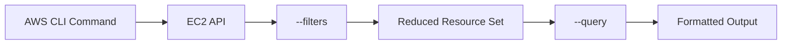
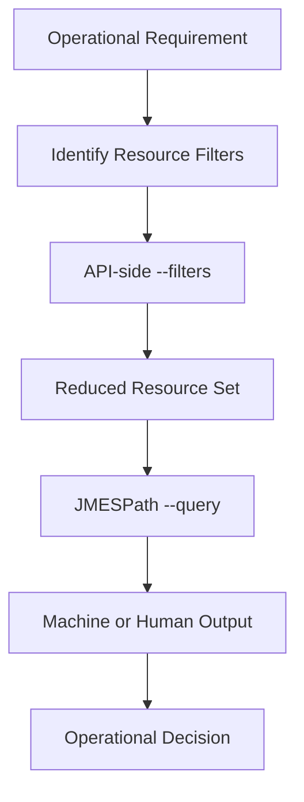

# 12- Querying and Filtering

## Overview

AWS CLI commands frequently return large JSON structures. For EC2 operations, querying and filtering are essential for turning those responses into focused operational data.

The two primary mechanisms are:

- **API-side filters** using `--filters`
- **Client-side projections and expressions** using `--query`

They solve different problems:

```text
AWS API
  |
  | --filters
  v
Reduced Resource Set
  |
  v
AWS CLI
  |
  | --query
  v
Selected / Transformed Output
```

A production-oriented CLI workflow should generally filter as early as possible and query only the fields required by the operator or automation.

For example, instead of retrieving every EC2 attribute:

```bash
aws ec2 describe-instances \
    --region ap-south-1
```

you can retrieve only running production instances:

```bash
aws ec2 describe-instances \
    --region ap-south-1 \
    --filters \
        "Name=instance-state-name,Values=running" \
        "Name=tag:Environment,Values=production" \
    --query 'Reservations[].Instances[].{
        InstanceId:InstanceId,
        Type:InstanceType,
        PrivateIP:PrivateIpAddress,
        AZ:Placement.AvailabilityZone
    }' \
    --output table
```

This approach improves readability, reduces unnecessary processing, and makes CLI output suitable for scripts and operational tooling.

## `--filters` vs `--query`

The distinction is fundamental.

| Feature | `--filters` | `--query` |
|---|---|---|
| Evaluation | AWS service/API side | AWS CLI side |
| Primary purpose | Select resources | Select/transform response data |
| Reduces resources returned | Yes | No |
| Selects fields | No | Yes |
| Uses JMESPath | No | Yes |
| Common use | State, tags, IDs, types | Fields, projections, sorting, formatting |
| Best for | Narrowing API results | Shaping output |

A useful mental model is:

```text
--filters
    |
    v
Which resources?

--query
    |
    v
Which fields and structure?
```

Use both together when possible.

## Basic EC2 Filtering

Filter by instance state:

```bash
aws ec2 describe-instances \
    --filters "Name=instance-state-name,Values=running" \
    --region ap-south-1
```

Filter by instance type:

```bash
aws ec2 describe-instances \
    --filters "Name=instance-type,Values=t3.medium" \
    --region ap-south-1
```

Filter by Availability Zone:

```bash
aws ec2 describe-instances \
    --filters "Name=availability-zone,Values=ap-south-1a" \
    --region ap-south-1
```

Filter by VPC:

```bash
aws ec2 describe-instances \
    --filters "Name=vpc-id,Values=vpc-0123456789abcdef0" \
    --region ap-south-1
```

Filter by subnet:

```bash
aws ec2 describe-instances \
    --filters "Name=subnet-id,Values=subnet-0123456789abcdef0" \
    --region ap-south-1
```

## Multiple Filters

Multiple filters are generally combined as an AND condition.

For example:

```bash
aws ec2 describe-instances \
    --filters \
        "Name=instance-state-name,Values=running" \
        "Name=instance-type,Values=t3.medium" \
        "Name=availability-zone,Values=ap-south-1a" \
    --region ap-south-1
```

This means:

```text
Running
AND
t3.medium
AND
ap-south-1a
```

Only resources matching all supplied filter conditions are returned.

## Multiple Values in a Filter

A single filter can specify multiple values.

For example:

```bash
aws ec2 describe-instances \
    --filters \
        "Name=instance-type,Values=t3.medium,t3.large" \
    --region ap-south-1
```

Conceptually:

```text
instance-type == t3.medium
OR
instance-type == t3.large
```

Combined with another filter:

```bash
aws ec2 describe-instances \
    --filters \
        "Name=instance-type,Values=t3.medium,t3.large" \
        "Name=instance-state-name,Values=running" \
    --region ap-south-1
```

The logic becomes:

```text
(t3.medium OR t3.large)
AND
running
```

## Tag-Based Filtering

Tags are among the most useful EC2 filtering mechanisms.

Filter by a specific tag:

```bash
aws ec2 describe-instances \
    --filters "Name=tag:Environment,Values=production" \
    --region ap-south-1
```

Filter by application:

```bash
aws ec2 describe-instances \
    --filters "Name=tag:Application,Values=payments-api" \
    --region ap-south-1
```

Combine tags:

```bash
aws ec2 describe-instances \
    --filters \
        "Name=tag:Environment,Values=production" \
        "Name=tag:Application,Values=payments-api" \
    --region ap-south-1
```

A useful production pattern is:

```text
Environment = production
Application = payments-api
Owner       = payments-team
ManagedBy   = terraform
```

Consistent tagging makes operational discovery significantly easier.

## Filter by Tag Existence

You can filter for instances where a tag key exists:

```bash
aws ec2 describe-instances \
    --filters "Name=tag-key,Values=Owner" \
    --region ap-south-1
```

This is useful for identifying resources participating in governance or ownership requirements.

## Filter by Instance ID

```bash
aws ec2 describe-instances \
    --instance-ids i-0123456789abcdef0 \
    --region ap-south-1
```

When exact resource IDs are already known, using the dedicated parameter is usually clearer than building a filter.

## Filter by AMI

```bash
aws ec2 describe-instances \
    --filters "Name=image-id,Values=ami-0123456789abcdef0" \
    --region ap-south-1
```

This is useful when investigating which instances were launched from a particular AMI.

## Filter by Security Group

```bash
aws ec2 describe-instances \
    --filters "Name=instance.group-id,Values=sg-0123456789abcdef0" \
    --region ap-south-1
```

This can help identify instances exposed through a particular Security Group.

## Filter by Root Device Type

```bash
aws ec2 describe-instances \
    --filters "Name=root-device-type,Values=ebs" \
    --region ap-south-1
```

This is useful for inventory and operational analysis.

## Common EC2 Filters

| Filter | Example |
|---|---|
| Instance state | `Name=instance-state-name,Values=running` |
| Instance type | `Name=instance-type,Values=t3.medium` |
| AMI | `Name=image-id,Values=ami-xxx` |
| VPC | `Name=vpc-id,Values=vpc-xxx` |
| Subnet | `Name=subnet-id,Values=subnet-xxx` |
| Availability Zone | `Name=availability-zone,Values=ap-south-1a` |
| Security Group | `Name=instance.group-id,Values=sg-xxx` |
| Private IP | `Name=private-ip-address,Values=10.0.1.10` |
| Public IP | `Name=ip-address,Values=203.0.113.10` |
| Tag key | `Name=tag-key,Values=Environment` |
| Tag value | `Name=tag:Environment,Values=production` |

The exact supported filter names depend on the AWS API operation. Check the command's current AWS CLI documentation when using less common filters.

## Wildcard Filtering

Some AWS EC2 filters support wildcard matching.

For example:

```bash
aws ec2 describe-instances \
    --filters "Name=tag:Application,Values=payments-*" \
    --region ap-south-1
```

Wildcard behavior depends on the specific API filter.

Do not assume that every filter supports arbitrary pattern matching.

## `--query`

`--query` uses JMESPath to select and transform data returned by the AWS CLI.

Example:

```bash
aws ec2 describe-instances \
    --query 'Reservations[].Instances[].InstanceId' \
    --region ap-south-1
```

Example output:

```text
i-0123456789abcdef0
i-0abcdef1234567890
```

The API still returns the EC2 response to the CLI, but the CLI displays only the selected field.

## Accessing Nested Fields

EC2 responses are nested.

A simplified structure looks like:

```text
Reservations
    |
    +--> Instances
           |
           +--> InstanceId
           +--> InstanceType
           +--> PrivateIpAddress
           +--> Placement
           |      |
           |      +--> AvailabilityZone
           |
           +--> Tags
```

To retrieve instance IDs:

```bash
--query 'Reservations[].Instances[].InstanceId'
```

To retrieve Availability Zones:

```bash
--query 'Reservations[].Instances[].Placement.AvailabilityZone'
```

To retrieve private IP addresses:

```bash
--query 'Reservations[].Instances[].PrivateIpAddress'
```

## Projecting Multiple Fields

Create an object for each instance:

```bash
aws ec2 describe-instances \
    --region ap-south-1 \
    --query 'Reservations[].Instances[].{
        InstanceId:InstanceId,
        Type:InstanceType,
        State:State.Name,
        PrivateIP:PrivateIpAddress,
        AZ:Placement.AvailabilityZone
    }' \
    --output table
```

This is one of the most useful JMESPath patterns for operational CLI work.

## Rename Fields With `--query`

JMESPath projections can create operator-friendly field names:

```bash
aws ec2 describe-instances \
    --region ap-south-1 \
    --query 'Reservations[].Instances[].{
        ID:InstanceId,
        Type:InstanceType,
        State:State.Name,
        IP:PrivateIpAddress
    }' \
    --output table
```

The source field remains unchanged; only the displayed structure is renamed.

## Querying Tags

Tags are represented as an array:

```json
"Tags": [
    {
        "Key": "Name",
        "Value": "payments-api-01"
    },
    {
        "Key": "Environment",
        "Value": "production"
    }
]
```

A query can extract a specific tag:

```bash
aws ec2 describe-instances \
    --query 'Reservations[].Instances[].{
        InstanceId:InstanceId,
        Name:Tags[?Key==`Name`].Value | [0]
    }' \
    --region ap-south-1 \
    --output table
```

This pattern is particularly useful when producing inventory reports.

## Query With Filters

The strongest pattern is usually:

```text
API-side filtering
        +
JMESPath projection
        +
appropriate output format
```

Example:

```bash
aws ec2 describe-instances \
    --region ap-south-1 \
    --filters \
        "Name=instance-state-name,Values=running" \
        "Name=tag:Environment,Values=production" \
    --query 'Reservations[].Instances[].{
        ID:InstanceId,
        Name:Tags[?Key==`Name`].Value | [0],
        Type:InstanceType,
        IP:PrivateIpAddress,
        AZ:Placement.AvailabilityZone
    }' \
    --output table
```

This produces a focused production inventory without requiring post-processing in Python or another shell tool.

## Client-Side Filtering With JMESPath

Not every condition needs to be implemented using `--filters`.

You can filter returned data using JMESPath.

For example:

```bash
aws ec2 describe-instances \
    --region ap-south-1 \
    --query 'Reservations[].Instances[?State.Name==`running`].[InstanceId,InstanceType]' \
    --output table
```

The filtering happens after the API response has been received by the CLI.

Use API filters when the EC2 API supports the condition, especially for large inventories.

## API-Side vs Client-Side Filtering



The general preference is:

```text
Use --filters for resource selection.
Use --query for data shaping.
```

This is especially important for scripts operating across large environments.

## Query Lists

Select all instance IDs:

```bash
aws ec2 describe-instances \
    --query 'Reservations[].Instances[].InstanceId' \
    --output text
```

Select all private IP addresses:

```bash
aws ec2 describe-instances \
    --query 'Reservations[].Instances[].PrivateIpAddress' \
    --output text
```

Select all instance types:

```bash
aws ec2 describe-instances \
    --query 'Reservations[].Instances[].InstanceType' \
    --output text
```

## Flattening Nested Structures

EC2 uses reservations containing instance arrays.

A common query is:

```bash
--query 'Reservations[].Instances[]'
```

This flattens the nested `Reservations` → `Instances` structure into a single sequence of instances.

Then select fields:

```bash
--query 'Reservations[].Instances[].{
    ID:InstanceId,
    State:State.Name
}'
```

This is preferable to repeatedly parsing nested JSON in shell scripts.

## Conditional Expressions

JMESPath supports filtering expressions.

For running instances:

```bash
--query 'Reservations[].Instances[?State.Name==`running`]'
```

For stopped instances:

```bash
--query 'Reservations[].Instances[?State.Name==`stopped`]'
```

For a particular instance type:

```bash
--query 'Reservations[].Instances[?InstanceType==`t3.medium`]'
```

Combine conditions:

```bash
--query 'Reservations[].Instances[?State.Name==`running` && InstanceType==`t3.medium`]'
```

This is useful when an API-side filter is unavailable or when additional response-level logic is required.

## Numeric Comparisons

JMESPath can perform numeric comparisons where the data supports them.

For example, when querying a numeric field:

```bash
--query 'Reservations[].Instances[?BlockDeviceMappings | length(@) > `1`]'
```

Complex expressions should be tested interactively before embedding them into production automation.

## Sorting Query Results

JMESPath supports sorting expressions.

For example:

```bash
aws ec2 describe-instances \
    --region ap-south-1 \
    --query 'sort_by(Reservations[].Instances[], &InstanceType)[].{
        ID:InstanceId,
        Type:InstanceType
    }' \
    --output table
```

Sorting is useful for human-readable inventory reports.

Do not rely on output ordering unless the query explicitly defines it.

## Sorting by Launch Time

If the response contains a suitable sortable timestamp:

```bash
aws ec2 describe-instances \
    --region ap-south-1 \
    --query 'sort_by(Reservations[].Instances[], &LaunchTime)[].{
        ID:InstanceId,
        LaunchTime:LaunchTime
    }' \
    --output table
```

This is useful for identifying recently launched or older instances.

## Querying Instance State

Retrieve state information:

```bash
aws ec2 describe-instances \
    --query 'Reservations[].Instances[].{
        ID:InstanceId,
        State:State.Name,
        Code:State.Code
    }' \
    --output table
```

Filter running instances:

```bash
aws ec2 describe-instances \
    --query 'Reservations[].Instances[?State.Name==`running`].{
        ID:InstanceId,
        Type:InstanceType
    }' \
    --output table
```

The human-readable state name is usually more useful for operational output than the numeric state code.

## Querying Networking Information

Retrieve network details:

```bash
aws ec2 describe-instances \
    --region ap-south-1 \
    --query 'Reservations[].Instances[].{
        ID:InstanceId,
        PrivateIP:PrivateIpAddress,
        PublicIP:PublicIpAddress,
        PrivateDNS:PrivateDnsName,
        PublicDNS:PublicDnsName,
        VPC:VpcId,
        Subnet:SubnetId,
        AZ:Placement.AvailabilityZone
    }' \
    --output table
```

This is useful during connectivity incidents.

## Querying Security Groups

Retrieve Security Group IDs:

```bash
aws ec2 describe-instances \
    --region ap-south-1 \
    --query 'Reservations[].Instances[].{
        ID:InstanceId,
        SecurityGroups:SecurityGroups[].GroupId
    }' \
    --output json
```

Retrieve names:

```bash
aws ec2 describe-instances \
    --region ap-south-1 \
    --query 'Reservations[].Instances[].{
        ID:InstanceId,
        SecurityGroups:SecurityGroups[].GroupName
    }' \
    --output json
```

When automating, Security Group IDs are generally more reliable than names.

## Querying IAM Instance Profiles

```bash
aws ec2 describe-instances \
    --region ap-south-1 \
    --query 'Reservations[].Instances[].{
        ID:InstanceId,
        IAMProfile:IamInstanceProfile.Arn
    }' \
    --output table
```

This can help verify whether an EC2 instance has the expected IAM role configuration.

## Querying EBS Mappings

```bash
aws ec2 describe-instances \
    --region ap-south-1 \
    --query 'Reservations[].Instances[].{
        ID:InstanceId,
        Volumes:BlockDeviceMappings[].Ebs.VolumeId
    }' \
    --output json
```

For a production storage investigation:

```bash
aws ec2 describe-instances \
    --instance-ids i-0123456789abcdef0 \
    --query 'Reservations[].Instances[].{
        Instance:InstanceId,
        Devices:BlockDeviceMappings[].{
            Device:DeviceName,
            Volume:Ebs.VolumeId,
            DeleteOnTermination:Ebs.DeleteOnTermination
        }
    }' \
    --output json
```

This is useful when investigating persistence and termination behavior.

## Querying Instance Metadata

A focused inspection command:

```bash
aws ec2 describe-instances \
    --instance-ids i-0123456789abcdef0 \
    --query 'Reservations[].Instances[0].{
        ID:InstanceId,
        AMI:ImageId,
        Type:InstanceType,
        State:State.Name,
        AZ:Placement.AvailabilityZone,
        VPC:VpcId,
        Subnet:SubnetId,
        PrivateIP:PrivateIpAddress,
        PublicIP:PublicIpAddress
    }' \
    --output table
```

This is useful during incident response because it reduces a large API response to the fields most relevant to the investigation.

## Querying AMIs

The same principles apply to AMI operations.

List available AMIs owned by the current account:

```bash
aws ec2 describe-images \
    --owners self \
    --region ap-south-1
```

Filter by name:

```bash
aws ec2 describe-images \
    --owners self \
    --filters "Name=name,Values=payments-api-*" \
    --region ap-south-1
```

Project selected fields:

```bash
aws ec2 describe-images \
    --owners self \
    --region ap-south-1 \
    --query 'Images[].{
        ID:ImageId,
        Name:Name,
        State:State,
        Created:CreationDate
    }' \
    --output table
```

## Querying EBS Volumes

Filter unattached volumes:

```bash
aws ec2 describe-volumes \
    --filters "Name=status,Values=available" \
    --region ap-south-1
```

Project fields:

```bash
aws ec2 describe-volumes \
    --region ap-south-1 \
    --query 'Volumes[].{
        ID:VolumeId,
        Type:VolumeType,
        SizeGiB:Size,
        State:State,
        AZ:AvailabilityZone
    }' \
    --output table
```

Find production volumes:

```bash
aws ec2 describe-volumes \
    --filters "Name=tag:Environment,Values=production" \
    --region ap-south-1 \
    --query 'Volumes[].{
        ID:VolumeId,
        SizeGiB:Size,
        Type:VolumeType,
        State:State
    }' \
    --output table
```

## Querying Elastic IPs

List unassociated Elastic IPs:

```bash
aws ec2 describe-addresses \
    --region ap-south-1 \
    --query 'Addresses[?AssociationId==null].{
        PublicIP:PublicIp,
        AllocationId:AllocationId
    }' \
    --output table
```

List associated addresses:

```bash
aws ec2 describe-addresses \
    --region ap-south-1 \
    --query 'Addresses[?AssociationId!=null].{
        PublicIP:PublicIp,
        InstanceId:InstanceId,
        PrivateIP:PrivateIpAddress
    }' \
    --output table
```

## Querying Auto Scaling Resources

The same query concepts apply outside EC2 APIs.

List ASGs with capacity:

```bash
aws autoscaling describe-auto-scaling-groups \
    --region ap-south-1 \
    --query 'AutoScalingGroups[].{
        Name:AutoScalingGroupName,
        Min:MinSize,
        Desired:DesiredCapacity,
        Max:MaxSize
    }' \
    --output table
```

Find groups where desired capacity is at the maximum:

```bash
aws autoscaling describe-auto-scaling-groups \
    --region ap-south-1 \
    --query 'AutoScalingGroups[?DesiredCapacity==MaxSize].{
        Name:AutoScalingGroupName,
        Desired:DesiredCapacity,
        Max:MaxSize
    }' \
    --output table
```

This can identify ASGs that may be unable to scale further.

## Querying Load Balancer Resources

List load balancers:

```bash
aws elbv2 describe-load-balancers \
    --region ap-south-1 \
    --query 'LoadBalancers[].{
        Name:LoadBalancerName,
        Type:Type,
        Scheme:Scheme,
        State:State.Code,
        DNS:DNSName
    }' \
    --output table
```

List target groups:

```bash
aws elbv2 describe-target-groups \
    --region ap-south-1 \
    --query 'TargetGroups[].{
        Name:TargetGroupName,
        Protocol:Protocol,
        Port:Port,
        Type:TargetType
    }' \
    --output table
```

## Querying Unhealthy Targets

```bash
aws elbv2 describe-target-health \
    --target-group-arn "$TARGET_GROUP_ARN" \
    --region ap-south-1 \
    --query 'TargetHealthDescriptions[?TargetHealth.State!=`healthy`].{
        Target:Target.Id,
        Port:Target.Port,
        State:TargetHealth.State,
        Reason:TargetHealth.Reason,
        Description:TargetHealth.Description
    }' \
    --output table
```

This is a practical incident-response query.

## JMESPath Expressions

Important JMESPath patterns for AWS CLI work include:

| Expression | Purpose |
|---|---|
| `[]` | Iterate over a list |
| `[].Field` | Extract a field from each item |
| `[0]` | Select first item |
| `[?Condition]` | Filter items |
| `{Name:Field}` | Create an object |
| `length(@)` | Count elements |
| `sort_by(...)` | Sort objects |
| `||` | Provide fallback expressions |
| `&&` | Logical AND |
| `\|\|` | Logical OR / fallback depending on expression context |

The exact expression semantics should be tested against the AWS CLI version in use.

## Useful JMESPath Examples

Extract the first instance:

```bash
--query 'Reservations[].Instances[0]'
```

Extract all running instances:

```bash
--query 'Reservations[].Instances[?State.Name==`running`]'
```

Extract only instance IDs:

```bash
--query 'Reservations[].Instances[].InstanceId'
```

Create structured records:

```bash
--query 'Reservations[].Instances[].{
    ID:InstanceId,
    Type:InstanceType,
    State:State.Name
}'
```

Count instances:

```bash
--query 'length(Reservations[].Instances[])'
```

The final expression is useful for compact inventory checks.

## Counting Resources

Count running EC2 instances:

```bash
aws ec2 describe-instances \
    --filters "Name=instance-state-name,Values=running" \
    --region ap-south-1 \
    --query 'length(Reservations[].Instances[])' \
    --output text
```

Count production instances:

```bash
aws ec2 describe-instances \
    --filters "Name=tag:Environment,Values=production" \
    --region ap-south-1 \
    --query 'length(Reservations[].Instances[])' \
    --output text
```

Counting can be useful in shell automation and operational checks.

## Finding Missing Tags

A governance workflow can identify instances without an expected tag.

For example, retrieve all instances:

```bash
aws ec2 describe-instances \
    --region ap-south-1 \
    --query 'Reservations[].Instances[].{
        ID:InstanceId,
        Name:Tags[?Key==`Name`].Value | [0],
        Owner:Tags[?Key==`Owner`].Value | [0]
    }' \
    --output table
```

The resulting output can be inspected for missing values.

For complex compliance rules, it is often better to use AWS Config, Resource Groups Tagging API, or a dedicated governance workflow rather than building increasingly complex shell queries.

## Resource Discovery With Tags

A production discovery workflow might be:

```text
Environment=production
        |
        v
Application=payments-api
        |
        v
Running Instances
        |
        v
Instance IDs
        |
        v
Operational Action
```

Example:

```bash
aws ec2 describe-instances \
    --region ap-south-1 \
    --filters \
        "Name=instance-state-name,Values=running" \
        "Name=tag:Environment,Values=production" \
        "Name=tag:Application,Values=payments-api" \
    --query 'Reservations[].Instances[].InstanceId' \
    --output text
```

This is safer than manually copying instance IDs from the AWS Console.

## Querying for Operational Conditions

Example: identify running instances without a public IP.

```bash
aws ec2 describe-instances \
    --filters "Name=instance-state-name,Values=running" \
    --region ap-south-1 \
    --query 'Reservations[].Instances[?PublicIpAddress==null].{
        ID:InstanceId,
        PrivateIP:PrivateIpAddress,
        Subnet:SubnetId
    }' \
    --output table
```

Example: identify instances using a particular instance type:

```bash
aws ec2 describe-instances \
    --region ap-south-1 \
    --query 'Reservations[].Instances[?InstanceType==`t3.medium`].{
        ID:InstanceId,
        State:State.Name,
        AZ:Placement.AvailabilityZone
    }' \
    --output table
```

## Using Queries in Shell Scripts

A reliable pattern is to return machine-readable values:

```bash
INSTANCE_IDS=$(aws ec2 describe-instances \
    --region ap-south-1 \
    --filters \
        "Name=tag:Environment,Values=staging" \
        "Name=instance-state-name,Values=running" \
    --query 'Reservations[].Instances[].InstanceId' \
    --output text)
```

Then:

```bash
for instance_id in $INSTANCE_IDS; do
    echo "Inspecting $instance_id"

    aws ec2 describe-instance-status \
        --instance-ids "$instance_id" \
        --region ap-south-1
done
```

Avoid parsing human-oriented table output in scripts.

Prefer:

```text
--output text
```

or:

```text
--output json
```

depending on the consuming tool.

## Queries for Python Automation

When automation becomes complex, use the AWS SDK rather than treating CLI output as an API.

For example, with Boto3:

```python
import boto3

ec2 = boto3.client("ec2", region_name="ap-south-1")

response = ec2.describe_instances(
    Filters=[
        {"Name": "instance-state-name", "Values": ["running"]},
        {"Name": "tag:Environment", "Values": ["production"]},
    ]
)

for reservation in response["Reservations"]:
    for instance in reservation["Instances"]:
        print(instance["InstanceId"])
```

Use the CLI for operational workflows and lightweight automation; use an SDK when the logic requires structured application code, retries, testing, dependency injection, or more complex control flow.

## Performance and Scalability

Query design matters more as AWS environments grow.

Prefer:

```bash
aws ec2 describe-instances \
    --filters "Name=tag:Environment,Values=production" \
    --query 'Reservations[].Instances[].InstanceId'
```

over retrieving every instance and performing all filtering in a large local script.

Benefits include:

- Less unnecessary API response processing
- Smaller operational output
- Easier human inspection
- Simpler automation
- Lower client-side processing overhead

However, `--query` itself does not reduce the data returned by the AWS API. It shapes the response after retrieval.

## Pagination

Large AWS API responses may be paginated.

The AWS CLI normally handles pagination automatically for supported commands.

For example:

```bash
aws ec2 describe-instances \
    --region ap-south-1
```

You can inspect a limited result set:

```bash
aws ec2 describe-instances \
    --region ap-south-1 \
    --max-items 20
```

For automation, understand whether a command's result is complete before making decisions based on it.

Do not confuse:

```text
--max-items
```

with:

```text
--page-size
```

`--max-items` limits the total number of items returned by the CLI operation, while `--page-size` controls the size of service API requests used during pagination.

## `--starting-token`

When working with paginated CLI output, AWS CLI can provide a continuation token.

Example:

```bash
aws ec2 describe-instances \
    --region ap-south-1 \
    --max-items 20
```

The response may include a `NextToken` in JSON output.

Continue from a token:

```bash
aws ec2 describe-instances \
    --region ap-south-1 \
    --starting-token "<token>"
```

For most operational scripts, allow the AWS CLI to manage pagination unless explicit page control is required.

## Avoiding Fragile Queries

Avoid queries that depend on assumptions such as:

```bash
--query 'Reservations[0].Instances[0].InstanceId'
```

unless the command intentionally targets a single known resource.

A query like:

```bash
--query 'Reservations[].Instances[].InstanceId'
```

is safer for general inventory because it handles multiple reservations and instances.

Likewise, do not assume:

```text
first result = correct production resource
```

when multiple resources can match.

Use explicit filters such as:

```text
Environment
Application
Role
Region
Availability Zone
```

where appropriate.

## Combining Filters and Queries in Production

A strong operational pattern is:



Example:

```bash
aws ec2 describe-instances \
    --region ap-south-1 \
    --filters \
        "Name=instance-state-name,Values=running" \
        "Name=tag:Environment,Values=production" \
        "Name=tag:Application,Values=payments-api" \
    --query 'Reservations[].Instances[].{
        ID:InstanceId,
        Type:InstanceType,
        AZ:Placement.AvailabilityZone,
        IP:PrivateIpAddress,
        State:State.Name
    }' \
    --output table
```

This pattern is concise, repeatable, and suitable for operational runbooks.

## Security Considerations

Queries can expose sensitive operational information.

Be careful when displaying:

- Public IP addresses
- Private IP addresses
- IAM instance profile ARNs
- Security Group IDs
- User data
- Network configuration
- Resource tags containing internal information

Avoid logging entire AWS API responses when only a few fields are needed.

For example, prefer:

```bash
aws ec2 describe-instances \
    --query 'Reservations[].Instances[].{
        ID:InstanceId,
        State:State.Name
    }'
```

over storing the complete response when it is unnecessary.

Also remember that filtering resources does not grant access to them. IAM authorization is evaluated independently of CLI query logic.

## Common Mistakes

### Confusing `--filters` With `--query`

Incorrect mental model:

```text
--query = API filter
```

More accurate:

```text
--filters = resource selection
--query   = response shaping/filtering
```

### Filtering Everything Locally

Retrieving an unnecessarily large resource set and processing it locally increases operational complexity.

Use API-supported filters first.

### Parsing Table Output

Avoid:

```bash
aws ec2 describe-instances --output table | grep ...
```

Table output is designed for humans, not stable machine parsing.

Prefer:

```bash
--query '...' --output text
```

or:

```bash
--query '...' --output json
```

### Assuming Query Order

Do not assume the first result is a specific resource unless your filters guarantee uniqueness.

### Ignoring Pagination

A large environment can contain more resources than a single API response page.

Operational scripts should account for pagination.

### Using Instance Names as Unique Identifiers

The `Name` tag is not inherently unique.

Prefer:

```text
InstanceId
```

for resource identity.

### Writing Extremely Complex JMESPath

A query that is technically correct but impossible for the team to maintain is an operational liability.

When the logic becomes substantial:

- Use a shell script with clear intermediate variables.
- Use Python/Boto3 for application-level automation.
- Use AWS Config or dedicated governance tools for compliance workflows.

## Interview Traps

### Does `--query` Reduce AWS API Calls?

Not necessarily.

`--query` operates on the response returned to the AWS CLI. It primarily controls what data is selected or displayed.

API-side filters are the mechanism for narrowing resources at the service request level.

### What Is JMESPath?

JMESPath is the query language used by AWS CLI's `--query` option to select and transform structured JSON data.

### What Is the Difference Between These Two?

```bash
--filters "Name=instance-state-name,Values=running"
```

and:

```bash
--query 'Reservations[].Instances[?State.Name==`running`]'
```

The first asks the EC2 API to filter resources.

The second filters the returned response using JMESPath.

### Why Use `--query` Instead of `jq`?

Both can transform JSON, but `--query` has useful advantages:

- No additional dependency
- Works directly with AWS CLI responses
- Easy to combine with AWS commands
- Suitable for many operational scripts

`jq` may still be preferable for complex JSON transformations or workflows that combine data from multiple commands.

### Why Use `--output text` in Scripts?

Text output can be convenient when a command is expected to produce a simple list of IDs or values.

For structured automation, JSON is often safer because it preserves data structure.

### Should Filtering Logic Always Be in `--filters`?

No.

Use API filters for resource selection when supported. Use `--query` for response-level filtering, projection, sorting, and transformation.

## Command Reference

| Requirement | Example |
|---|---|
| Filter running instances | `--filters "Name=instance-state-name,Values=running"` |
| Filter by tag | `--filters "Name=tag:Environment,Values=production"` |
| Filter by instance type | `--filters "Name=instance-type,Values=t3.medium"` |
| Filter by VPC | `--filters "Name=vpc-id,Values=<vpc-id>"` |
| Filter by subnet | `--filters "Name=subnet-id,Values=<subnet-id>"` |
| Filter by AZ | `--filters "Name=availability-zone,Values=ap-south-1a"` |
| Select field | `--query 'Reservations[].Instances[].InstanceId'` |
| Select multiple fields | `--query 'Reservations[].Instances[].{ID:InstanceId,Type:InstanceType}'` |
| Filter response | `--query 'Reservations[].Instances[?State.Name==`running`]'` |
| Count resources | `--query 'length(Reservations[].Instances[])'` |
| Sort results | `--query 'sort_by(Reservations[].Instances[], &LaunchTime)'` |
| Human-readable output | `--output table` |
| Script-friendly values | `--output text` |
| Structured output | `--output json` |
| Limit returned items | `--max-items` |
| Control API page size | `--page-size` |

## Practical EC2 Inventory Query

A reusable production inventory command:

```bash
aws ec2 describe-instances \
    --region ap-south-1 \
    --filters \
        "Name=instance-state-name,Values=running" \
        "Name=tag:Environment,Values=production" \
    --query 'Reservations[].Instances[].{
        InstanceId:InstanceId,
        Name:Tags[?Key==`Name`].Value | [0],
        Application:Tags[?Key==`Application`].Value | [0],
        Type:InstanceType,
        State:State.Name,
        PrivateIP:PrivateIpAddress,
        PublicIP:PublicIpAddress,
        AZ:Placement.AvailabilityZone
    }' \
    --output table
```

This provides a useful operational view without dumping the complete EC2 API response.

## Practical Unhealthy Resource Workflow

For an EC2-backed application:

```text
Production
    |
    v
Running Instances
    |
    v
Application Tag
    |
    v
Instance IDs
    |
    +--> EC2 Status
    |
    +--> Target Health
    |
    +--> Network Configuration
    |
    v
Root Cause
```

Start with targeted inventory:

```bash
aws ec2 describe-instances \
    --region ap-south-1 \
    --filters \
        "Name=instance-state-name,Values=running" \
        "Name=tag:Environment,Values=production" \
        "Name=tag:Application,Values=payments-api" \
    --query 'Reservations[].Instances[].{
        ID:InstanceId,
        Type:InstanceType,
        AZ:Placement.AvailabilityZone,
        IP:PrivateIpAddress
    }' \
    --output table
```

Then use the resulting IDs with:

```bash
aws ec2 describe-instance-status \
    --instance-ids <instance-id> \
    --region ap-south-1
```

For load-balanced applications, inspect the corresponding target group separately:

```bash
aws elbv2 describe-target-health \
    --target-group-arn "$TARGET_GROUP_ARN" \
    --region ap-south-1
```

The important principle is to use queries to narrow evidence, not to hide information that is required to diagnose the incident.

## Production Query Design Guidelines

For reliable operational tooling:

- Use `--filters` to reduce the resource set whenever possible.
- Use `--query` to select only required fields.
- Prefer resource IDs over human-readable names for actions.
- Use tags consistently for resource discovery.
- Use `--output text` for simple scalar/list values consumed by shell scripts.
- Use JSON for structured automation.
- Avoid parsing `--output table`.
- Account for pagination in large environments.
- Avoid assuming the first result is the desired resource.
- Keep complex queries maintainable.
- Move substantial business logic into Python/Boto3 or another appropriate automation layer.
- Test destructive workflows against non-production resources first.
- Specify the AWS region explicitly in production scripts.

## Key Takeaways

- **Use `--filters` for resource selection and `--query` for response shaping:** combining both produces efficient and readable AWS CLI workflows.
- **JMESPath is the core of `--query`:** it supports nested field extraction, projections, filtering, sorting, counting, and structured output.
- **Prefer API-side filtering when available:** it reduces unnecessary resource processing, while `--query` operates primarily on data already returned to the CLI.
- **Design queries for automation:** use stable resource IDs, consistent tags, machine-readable output, explicit pagination handling, and avoid parsing human-oriented table output.
- **Keep operational queries maintainable:** simple CLI queries are ideal for inspection, while complex automation is usually better implemented with Boto3 or dedicated AWS governance tooling.