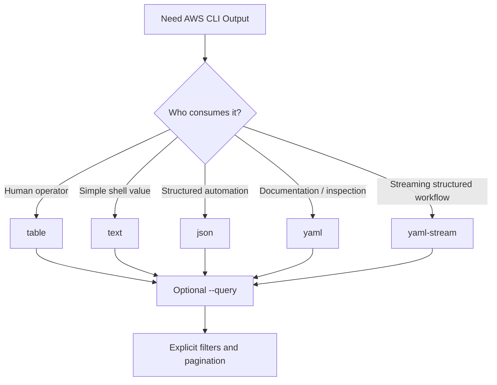

# 13- Output Formatting

## Overview

AWS CLI commands return structured data, usually JSON. Output formatting determines how that data is presented to humans, consumed by shell scripts, or passed into other automation systems.

For EC2 operations, the most commonly used output formats are:

- `json` for structured automation and complete API responses
- `text` for compact scalar or tabular values used by shell scripts
- `table` for interactive human inspection
- `yaml` and `yaml-stream` where supported and useful for human-readable structured output

The format should be selected based on the consumer rather than personal preference.

```text
AWS API
   |
   v
AWS CLI
   |
   +---- --query ------> Select / reshape data
   |
   +---- --output -----> Serialize presentation
                              |
                 +------------+------------+
                 |            |            |
                json        text        table
                 |
              automation
```

A production rule of thumb is:

> Use `table` for humans, `text` for simple shell values, and `json` for structured automation.

## Why Output Formatting Matters

A raw EC2 response can contain deeply nested structures, multiple instances, network interfaces, block-device mappings, tags, IAM profiles, and other metadata.

For example:

```bash
aws ec2 describe-instances \
    --region ap-south-1
```

is useful when you need the complete response, but it is unnecessarily verbose for a simple inventory check.

A focused command is easier to operate:

```bash
aws ec2 describe-instances \
    --region ap-south-1 \
    --query 'Reservations[].Instances[].{
        ID:InstanceId,
        Type:InstanceType,
        State:State.Name,
        IP:PrivateIpAddress
    }' \
    --output table
```

Output formatting therefore affects:

- Operator readability
- Script reliability
- Debugging speed
- Log volume
- Data interchange
- Automation maintainability
- Incident-response workflows

## `--output`

The AWS CLI uses the `--output` option to control how command results are rendered.

Basic examples:

```bash
aws ec2 describe-instances --output json
```

```bash
aws ec2 describe-instances --output text
```

```bash
aws ec2 describe-instances --output table
```

Where supported:

```bash
aws ec2 describe-instances --output yaml
```

The output format does not change the underlying AWS resource or API operation. It changes how the CLI presents the response.

## Output Format Comparison

| Format | Primary use | Human readable | Script friendly | Preserves structure |
|---|---|---:|---:|---:|
| `json` | APIs, automation, debugging | Yes | Excellent | Yes |
| `text` | Shell variables, simple lists | Yes | Excellent for simple values | No |
| `table` | Interactive inspection | Excellent | Poor | Partially |
| `yaml` | Human-readable structured data | Excellent | Good | Yes |
| `yaml-stream` | Streaming structured output | Good | Good for supported workflows | Yes |

The exact availability and behavior of formats can depend on the AWS CLI version and command.

## JSON Output

JSON is the default output format for AWS CLI commands.

```bash
aws ec2 describe-instances \
    --region ap-south-1 \
    --output json
```

A simplified response looks like:

```json
{
  "Reservations": [
    {
      "Instances": [
        {
          "InstanceId": "i-0123456789abcdef0",
          "InstanceType": "t3.medium",
          "State": {
            "Name": "running"
          },
          "PrivateIpAddress": "10.0.1.25"
        }
      ]
    }
  ]
}
```

JSON is useful because it preserves nested relationships.

### When to Use JSON

Use JSON when:

- Another program consumes the output.
- You need nested resource information.
- You are debugging an AWS API response.
- You need to preserve the response structure.
- You are passing data between automation stages.
- You need reliable structured input for Python or `jq`.

For example:

```bash
aws ec2 describe-instances \
    --region ap-south-1 \
    --output json > instances.json
```

## JSON With `--query`

JSON becomes much more useful when combined with JMESPath.

```bash
aws ec2 describe-instances \
    --region ap-south-1 \
    --query 'Reservations[].Instances[].{
        ID:InstanceId,
        Type:InstanceType,
        State:State.Name
    }' \
    --output json
```

Example:

```json
[
  {
    "ID": "i-0123456789abcdef0",
    "Type": "t3.medium",
    "State": "running"
  },
  {
    "ID": "i-0abcdef1234567890",
    "Type": "t3.large",
    "State": "running"
  }
]
```

This is often preferable to dumping the complete EC2 response.

## Text Output

`text` converts structured data into a tab-delimited representation.

Example:

```bash
aws ec2 describe-instances \
    --region ap-south-1 \
    --query 'Reservations[].Instances[].InstanceId' \
    --output text
```

Example result:

```text
i-0123456789abcdef0	i-0abcdef1234567890
```

For simple automation, this can be convenient.

```bash
INSTANCE_IDS=$(aws ec2 describe-instances \
    --region ap-south-1 \
    --filters "Name=tag:Environment,Values=production" \
    --query 'Reservations[].Instances[].InstanceId' \
    --output text)
```

Then:

```bash
for instance_id in $INSTANCE_IDS; do
    echo "Checking $instance_id"
done
```

## Text Output and Multiple Fields

You can return several fields:

```bash
aws ec2 describe-instances \
    --region ap-south-1 \
    --query 'Reservations[].Instances[].[
        InstanceId,
        InstanceType,
        State.Name,
        PrivateIpAddress
    ]' \
    --output text
```

Example:

```text
i-0123456789abcdef0	t3.medium	running	10.0.1.25
i-0abcdef1234567890	t3.large	running	10.0.2.18
```

This is useful for simple shell processing, but it becomes fragile if the output structure becomes complex.

## Table Output

`table` is designed for interactive human inspection.

```bash
aws ec2 describe-instances \
    --region ap-south-1 \
    --query 'Reservations[].Instances[].{
        ID:InstanceId,
        Type:InstanceType,
        State:State.Name,
        IP:PrivateIpAddress
    }' \
    --output table
```

Example:

```text
---------------------------------------------------------
|                  DescribeInstances                    |
+----------------------+------------+---------+----------+
| ID                   | Type       | State   | IP       |
+----------------------+------------+---------+----------+
| i-0123456789abcdef0  | t3.medium  | running | 10.0.1.25|
| i-0abcdef1234567890  | t3.large   | running | 10.0.2.18|
+----------------------+------------+---------+----------+
```

Table output is excellent during:

- Incident response
- Manual verification
- Infrastructure inspection
- Troubleshooting
- Architecture reviews

## Why Table Output Should Not Be Parsed

Avoid scripts such as:

```bash
aws ec2 describe-instances --output table | grep running
```

Table output is intended for presentation, not machine parsing.

Formatting, spacing, column layout, and nested values can make such scripts fragile.

Prefer:

```bash
aws ec2 describe-instances \
    --query 'Reservations[].Instances[?State.Name==`running`].InstanceId' \
    --output text
```

The distinction is:

```text
table -> human consumer
text  -> simple machine consumer
json  -> structured machine consumer
```

## YAML Output

Where supported, YAML provides structured output with less visual noise than JSON.

```bash
aws ec2 describe-instances \
    --region ap-south-1 \
    --output yaml
```

Example:

```yaml
Reservations:
  - Instances:
      - InstanceId: i-0123456789abcdef0
        InstanceType: t3.medium
        State:
          Name: running
        PrivateIpAddress: 10.0.1.25
```

YAML can be convenient for:

- Manual inspection
- Configuration-oriented workflows
- Documentation
- Structured output where JSON is visually noisy

For cross-tool automation, JSON is generally the safer default because its syntax and parser support are more universal.

## YAML Stream

Some AWS CLI commands support:

```bash
--output yaml-stream
```

Example:

```bash
aws ec2 describe-instances \
    --region ap-south-1 \
    --output yaml-stream
```

YAML stream output is intended for streaming structured data and can be useful when processing large results progressively.

Availability and behavior should be verified for the AWS CLI version and command being used.

## Choosing the Output Format

A practical decision table:

| Situation | Recommended format |
|---|---|
| Interactive EC2 inspection | `table` |
| Extract one or more IDs | `text` |
| Shell variable assignment | `text` |
| Python automation | `json` |
| API-to-API data exchange | `json` |
| Debugging complete AWS response | `json` |
| Documentation/manual inspection | `yaml` |
| Streaming structured processing | `yaml-stream` where supported |
| Complex nested automation | `json` |

## Combining `--query` and `--output`

`--query` and `--output` solve different problems.

For example:

```bash
aws ec2 describe-instances \
    --query 'Reservations[].Instances[].InstanceId' \
    --output text
```

The flow is:

```text
EC2 response
    |
    v
--query
    |
    v
Instance IDs only
    |
    v
--output text
    |
    v
Tab-delimited values
```

Another example:

```bash
aws ec2 describe-instances \
    --query 'Reservations[].Instances[].{
        ID:InstanceId,
        Type:InstanceType,
        State:State.Name
    }' \
    --output table
```

Here:

```text
--query  -> defines the data
--output -> defines the presentation
```

## Output Formatting With Filters

Filtering should generally happen before output formatting.

```bash
aws ec2 describe-instances \
    --region ap-south-1 \
    --filters \
        "Name=instance-state-name,Values=running" \
        "Name=tag:Environment,Values=production" \
    --query 'Reservations[].Instances[].{
        ID:InstanceId,
        Type:InstanceType,
        AZ:Placement.AvailabilityZone
    }' \
    --output table
```

The logical pipeline is:

```text
Resource selection
      |
      v
--filters
      |
      v
Data projection
      |
      v
--query
      |
      v
Presentation
      |
      v
--output
```

This pattern keeps commands focused and maintainable.

## Output Formatting in Shell Scripts

For shell automation, choose the smallest reliable representation.

### Single Value

```bash
INSTANCE_ID=$(aws ec2 describe-instances \
    --region ap-south-1 \
    --filters \
        "Name=tag:Name,Values=payments-api-01" \
        "Name=instance-state-name,Values=running" \
    --query 'Reservations[].Instances[].InstanceId' \
    --output text)
```

### Multiple IDs

```bash
INSTANCE_IDS=$(aws ec2 describe-instances \
    --region ap-south-1 \
    --filters "Name=tag:Environment,Values=staging" \
    --query 'Reservations[].Instances[].InstanceId' \
    --output text)
```

Then:

```bash
for instance_id in $INSTANCE_IDS; do
    printf 'Instance: %s\n' "$instance_id"
done
```

This is appropriate when the selected values cannot contain whitespace and the query intentionally returns simple identifiers.

## JSON for Shell Automation

Use JSON when the data contains multiple related attributes.

```bash
INSTANCE_DATA=$(aws ec2 describe-instances \
    --region ap-south-1 \
    --filters "Name=tag:Environment,Values=production" \
    --query 'Reservations[].Instances[].{
        ID:InstanceId,
        IP:PrivateIpAddress,
        State:State.Name
    }' \
    --output json)
```

This preserves structure and avoids relying on column positions.

If complex JSON processing is required, a dedicated JSON processor such as `jq` can be appropriate:

```bash
aws ec2 describe-instances \
    --region ap-south-1 \
    --output json |
jq '.Reservations[].Instances[] | {
    id: .InstanceId,
    state: .State.Name
}'
```

Use one clear transformation layer rather than mixing fragile text parsing with structured data.

## JSON for Python Automation

For Python applications, it is usually better to call AWS through Boto3 rather than invoke the CLI and parse its output.

CLI:

```bash
aws ec2 describe-instances \
    --query 'Reservations[].Instances[].InstanceId' \
    --output json
```

Python:

```python
import boto3

ec2 = boto3.client("ec2", region_name="ap-south-1")

response = ec2.describe_instances(
    Filters=[
        {
            "Name": "instance-state-name",
            "Values": ["running"],
        },
        {
            "Name": "tag:Environment",
            "Values": ["production"],
        },
    ]
)

instance_ids = [
    instance["InstanceId"]
    for reservation in response["Reservations"]
    for instance in reservation["Instances"]
]

for instance_id in instance_ids:
    print(instance_id)
```

The SDK approach provides:

- Native structured objects
- Better testability
- Easier exception handling
- Explicit AWS API interaction
- Better integration with application code
- More control over retries and workflows

The CLI remains appropriate for operators, deployment scripts, CI jobs, and lightweight infrastructure automation.

## Output Formatting in CI/CD

CLI output in CI/CD should generally be machine-readable.

For example:

```bash
INSTANCE_ID=$(aws ec2 describe-instances \
    --region "$AWS_REGION" \
    --filters \
        "Name=tag:Application,Values=$APPLICATION" \
        "Name=instance-state-name,Values=running" \
    --query 'Reservations[].Instances[0].InstanceId' \
    --output text)
```

Avoid:

```bash
aws ec2 describe-instances --output table
```

inside a pipeline step that needs to consume the result.

A useful CI/CD pattern is:

```text
GitHub Actions
      |
      v
AWS authentication
      |
      v
AWS CLI
      |
      v
--filters
      |
      v
--query
      |
      v
--output text/json
      |
      v
Next pipeline step
```

When using GitHub Actions or another CI platform, prefer short-lived credentials such as OIDC-based role assumption rather than storing long-lived AWS access keys.

## Output Formatting in Operational Runbooks

Human operators benefit from concise tables.

Example:

```bash
aws ec2 describe-instances \
    --region ap-south-1 \
    --filters \
        "Name=tag:Environment,Values=production" \
        "Name=tag:Application,Values=payments-api" \
    --query 'Reservations[].Instances[].{
        ID:InstanceId,
        State:State.Name,
        Type:InstanceType,
        AZ:Placement.AvailabilityZone,
        PrivateIP:PrivateIpAddress
    }' \
    --output table
```

This gives an operator the information needed for the next diagnostic step without overwhelming them with unrelated metadata.

## Output Formatting for Incident Response

During an incident, start with concise output.

### Instance Inventory

```bash
aws ec2 describe-instances \
    --region ap-south-1 \
    --filters "Name=tag:Environment,Values=production" \
    --query 'Reservations[].Instances[].{
        ID:InstanceId,
        State:State.Name,
        Type:InstanceType,
        AZ:Placement.AvailabilityZone,
        IP:PrivateIpAddress
    }' \
    --output table
```

### Instance Status

```bash
aws ec2 describe-instance-status \
    --region ap-south-1 \
    --include-all-instances \
    --query 'InstanceStatuses[].{
        ID:InstanceId,
        State:InstanceState.Name,
        System:SystemStatus.Status,
        Instance:InstanceStatus.Status
    }' \
    --output table
```

### Target Health

```bash
aws elbv2 describe-target-health \
    --target-group-arn "$TARGET_GROUP_ARN" \
    --region ap-south-1 \
    --query 'TargetHealthDescriptions[].{
        Target:Target.Id,
        Port:Target.Port,
        State:TargetHealth.State,
        Reason:TargetHealth.Reason
    }' \
    --output table
```

The goal is to reduce the amount of data an operator must mentally parse.

## Pagination and Output

AWS CLI commands can paginate API responses.

For example:

```bash
aws ec2 describe-instances \
    --region ap-south-1 \
    --page-size 50
```

`--page-size` controls the size of service API requests used during pagination.

You can also limit the number of items returned by the CLI:

```bash
aws ec2 describe-instances \
    --region ap-south-1 \
    --max-items 20
```

These options serve different purposes.

| Option | Purpose |
|---|---|
| `--page-size` | Controls API request page size |
| `--max-items` | Limits items returned by the CLI operation |
| `--starting-token` | Continues from a previous pagination token |

Do not treat `--max-items` as a service-side resource filter. It controls the CLI result set.

## Pagination With Scripts

A common mistake is assuming that a command returning no visible result means no resources exist.

Large resource sets may require pagination.

For inventory scripts, prefer normal AWS CLI pagination unless you have a specific reason to control pages manually.

If explicit pagination is required, handle continuation tokens according to the AWS CLI's documented pagination behavior rather than manually assuming the structure of a service response.

## Output and `--no-cli-pager`

The AWS CLI can use a pager for some interactive output.

For scripts and CI environments, disabling the pager is often preferable:

```bash
aws ec2 describe-instances \
    --region ap-south-1 \
    --no-cli-pager
```

You can combine it with structured output:

```bash
aws ec2 describe-instances \
    --region ap-south-1 \
    --no-cli-pager \
    --query 'Reservations[].Instances[].InstanceId' \
    --output text
```

This avoids interactive behavior interfering with automation.

## Global CLI Configuration

Output behavior can also be configured through AWS CLI configuration.

Inspect the current configuration:

```bash
aws configure list
```

A profile can define a default output format.

For example:

```bash
aws configure set output json --profile production
```

Then:

```bash
aws ec2 describe-instances \
    --profile production \
    --region ap-south-1
```

However, production scripts should generally specify important behavior explicitly rather than relying heavily on a developer's local CLI configuration.

For example:

```bash
aws ec2 describe-instances \
    --profile production \
    --region ap-south-1 \
    --output json
```

This makes the command's behavior obvious.

## Environment-Specific Profiles

Named profiles are useful for separating environments:

```text
default
development
staging
production
```

Example:

```bash
aws ec2 describe-instances \
    --profile production \
    --region ap-south-1 \
    --output table
```

The profile controls credentials and related configuration, while `--output` controls presentation.

Do not confuse:

```text
--profile
```

with:

```text
--output
```

They solve entirely different problems.

## Output Formatting and Security

Output can contain sensitive infrastructure information.

Examples include:

- Private IP addresses
- Public IP addresses
- DNS names
- Security Group IDs
- IAM role ARNs
- Resource tags
- Network topology
- Instance configuration
- Load balancer endpoints

Avoid unnecessarily logging complete AWS responses into CI/CD logs.

Prefer:

```bash
aws ec2 describe-instances \
    --region ap-south-1 \
    --query 'Reservations[].Instances[].{
        ID:InstanceId,
        State:State.Name
    }' \
    --output json
```

instead of:

```bash
aws ec2 describe-instances --output json
```

when only two fields are needed.

Also remember that output formatting is not an authorization mechanism. IAM determines which resources and attributes the caller can access.

## Logging and Observability

Be deliberate about what CLI commands write to logs.

For CI/CD:

```bash
aws ec2 describe-instances \
    --region "$AWS_REGION" \
    --query 'Reservations[].Instances[].InstanceId' \
    --output text
```

is usually preferable to dumping the entire API response.

For incident investigation, full JSON can be appropriate when preserving evidence:

```bash
aws ec2 describe-instances \
    --region ap-south-1 \
    --instance-ids "$INSTANCE_ID" \
    --output json > instance-details.json
```

The appropriate level of detail depends on whether the output is:

```text
Operational signal
        or
Diagnostic evidence
```

## Cost and Performance Considerations

Output formatting itself is usually not the dominant cost factor. The more important consideration is unnecessary API retrieval and repeated calls.

A good pattern is:

```text
Filter resources
      |
      v
Select required fields
      |
      v
Choose appropriate output
```

For example:

```bash
aws ec2 describe-instances \
    --region ap-south-1 \
    --filters "Name=tag:Environment,Values=production" \
    --query 'Reservations[].Instances[].InstanceId' \
    --output text
```

This is preferable to retrieving and storing every attribute when the next operation needs only instance IDs.

For large environments, also consider:

- API request frequency
- Pagination
- AWS API throttling
- Repeated inventory scans
- Caching where appropriate
- Event-driven workflows instead of constant polling

## Output Formatting and Reliability

Automation should consume deterministic data structures.

Good:

```bash
aws ec2 describe-instances \
    --region ap-south-1 \
    --query 'Reservations[].Instances[].InstanceId' \
    --output text
```

Fragile:

```bash
aws ec2 describe-instances \
    --region ap-south-1 \
    --output table |
    grep production |
    awk '{print $2}'
```

The second approach depends on presentation details rather than resource semantics.

For reliable automation:

- Query stable fields.
- Use resource IDs.
- Avoid parsing table output.
- Avoid positional assumptions unless guaranteed.
- Validate empty results.
- Handle multiple matches.
- Account for pagination.
- Fail explicitly when the expected resource is missing.

## Handling Empty Results

A query may legitimately return no resources.

Example:

```bash
INSTANCE_ID=$(aws ec2 describe-instances \
    --region ap-south-1 \
    --filters \
        "Name=tag:Application,Values=payments-api" \
        "Name=instance-state-name,Values=running" \
    --query 'Reservations[].Instances[].InstanceId' \
    --output text)
```

The automation should not automatically interpret an empty value as an AWS CLI failure.

Distinguish:

```text
Command failed
        vs
Command succeeded but returned no resources
```

This distinction is important in deployment and incident-response scripts.

## Output Formatting and Error Handling

Output format applies to successful command results. Errors are still important and should not be hidden by aggressive parsing.

For example:

```bash
set -euo pipefail

INSTANCE_IDS=$(aws ec2 describe-instances \
    --region "$AWS_REGION" \
    --filters "Name=tag:Environment,Values=production" \
    --query 'Reservations[].Instances[].InstanceId' \
    --output text)

printf '%s\n' "$INSTANCE_IDS"
```

For more complex production automation, use explicit error handling and preferably an SDK where structured exception handling is required.

## Common Mistakes

### Parsing Table Output

Avoid:

```bash
aws ec2 describe-instances --output table | grep ...
```

Use `--query` and `--output text` or `--output json`.

### Using JSON for Every Human Task

Complete JSON is often unnecessarily noisy during incident response.

Use:

```bash
--output table
```

when an operator needs a compact view.

### Using Table Output in Automation

Table formatting is presentation-oriented and should not be treated as an API contract.

### Assuming Text Output Is Structured JSON

This:

```bash
--output text
```

does not preserve the JSON hierarchy.

Use JSON when nested structure matters.

### Relying on Local Configuration

A command that behaves correctly only because the operator's local configuration contains a particular output setting is fragile.

Specify important parameters explicitly in production scripts.

### Ignoring Pagination

A script that works with ten instances may behave differently when an environment contains thousands.

### Dumping Full Responses Into CI Logs

Complete AWS responses may expose infrastructure details and generate excessive logs.

Query only the fields required.

### Assuming Empty Output Means Failure

An empty result can mean:

```text
No matching resources
```

rather than:

```text
AWS CLI command failed
```

Always distinguish these cases.

## Interview Traps

### Does `--output` Change the AWS API Request?

Generally, no. It controls how the AWS CLI presents the command result.

### What Is the Difference Between `--query` and `--output`?

```text
--query  -> selects/transforms data
--output -> serializes/presents the result
```

For example:

```bash
--query 'Reservations[].Instances[].InstanceId'
--output text
```

means:

```text
Select instance IDs
        +
Render them as text
```

### Which Output Format Is Best for Scripts?

It depends on the data.

- `text` is convenient for simple scalar values and lists.
- `json` is preferable for structured data.
- `table` should generally be reserved for humans.

### Why Is Table Output Bad for Automation?

Because it is presentation-oriented rather than a stable machine-readable interface. Column layout and formatting are not a reliable contract for scripts.

### Does `--query` Replace `jq`?

Not completely.

AWS CLI `--query` is excellent for selecting and transforming AWS command responses. `jq` can be more appropriate for complex JSON processing, especially when combining or transforming data from multiple sources.

### Does JSON Always Mean the Full AWS Response?

No.

You can combine `--query` with `--output json`:

```bash
aws ec2 describe-instances \
    --query 'Reservations[].Instances[].{
        ID:InstanceId,
        State:State.Name
    }' \
    --output json
```

The result is JSON, but only contains the fields selected by the query.

## Practical Command Reference

| Requirement | Command pattern |
|---|---|
| Default JSON | `--output json` |
| Human-readable table | `--output table` |
| Simple script values | `--output text` |
| YAML | `--output yaml` |
| YAML streaming | `--output yaml-stream` |
| Disable pager | `--no-cli-pager` |
| Select fields | `--query '...'` |
| Filter resources | `--filters '...'` |
| Limit CLI results | `--max-items N` |
| Control API page size | `--page-size N` |
| Continue pagination | `--starting-token TOKEN` |

## Production Output Patterns

### Human Inventory

```bash
aws ec2 describe-instances \
    --region ap-south-1 \
    --filters "Name=tag:Environment,Values=production" \
    --query 'Reservations[].Instances[].{
        ID:InstanceId,
        Name:Tags[?Key==`Name`].Value | [0],
        Type:InstanceType,
        State:State.Name,
        AZ:Placement.AvailabilityZone,
        IP:PrivateIpAddress
    }' \
    --output table \
    --no-cli-pager
```

### Shell Automation

```bash
aws ec2 describe-instances \
    --region ap-south-1 \
    --filters \
        "Name=tag:Environment,Values=production" \
        "Name=instance-state-name,Values=running" \
    --query 'Reservations[].Instances[].InstanceId' \
    --output text \
    --no-cli-pager
```

### Structured Automation

```bash
aws ec2 describe-instances \
    --region ap-south-1 \
    --filters "Name=tag:Environment,Values=production" \
    --query 'Reservations[].Instances[].{
        ID:InstanceId,
        State:State.Name,
        Type:InstanceType,
        PrivateIP:PrivateIpAddress,
        AZ:Placement.AvailabilityZone
    }' \
    --output json \
    --no-cli-pager
```

### Diagnostic Capture

```bash
aws ec2 describe-instances \
    --region ap-south-1 \
    --instance-ids "$INSTANCE_ID" \
    --output json \
    --no-cli-pager > instance-details.json
```

## Recommended Output Strategy

A production AWS CLI workflow can follow this decision model:



The format should follow the consumer:

```text
Human
  -> table

Shell
  -> text

Application / structured automation
  -> json

Documentation / visual structured data
  -> yaml
```

## Production Best Practices

- Use `table` for interactive operator workflows.
- Use `text` for simple scalar and list values consumed by shell scripts.
- Use `json` for structured automation and evidence capture.
- Use `yaml` when human-readable structured output is more useful than JSON.
- Use `--query` to reduce output to required fields.
- Use `--filters` to narrow resources before processing the response.
- Avoid parsing `table` output.
- Avoid depending on local CLI defaults for production automation.
- Use `--no-cli-pager` in non-interactive scripts where appropriate.
- Account for pagination in large environments.
- Validate empty results separately from command failures.
- Avoid writing unnecessary infrastructure metadata into CI/CD logs.
- Prefer Boto3 or another SDK when automation becomes application-level logic.
- Specify the AWS region and other important operational parameters explicitly.
- Keep destructive workflows based on stable identifiers such as instance IDs rather than display names.

## Key Takeaways

- **Choose output based on the consumer:** use `table` for humans, `text` for simple shell values, and `json` for structured automation.
- **Separate data selection from presentation:** `--query` determines what data is returned to the output layer, while `--output` determines how that data is rendered.
- **Avoid parsing presentation output:** scripts should consume stable structured values rather than `table` formatting.
- **Design for production scale:** account for pagination, empty results, API throttling, explicit regions, and predictable machine-readable output.
- **Keep automation maintainable:** use AWS CLI for operational workflows and move complex application-level processing to Boto3 or another appropriate SDK.