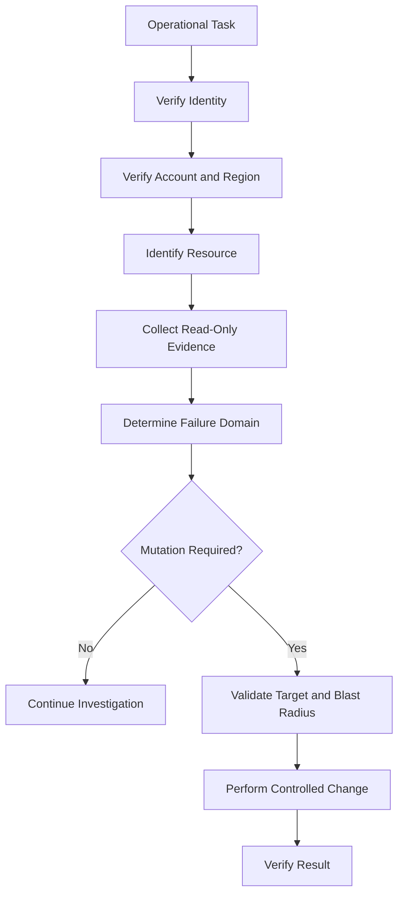
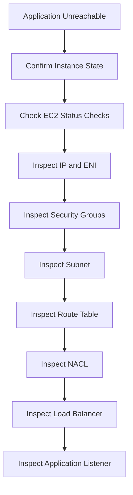
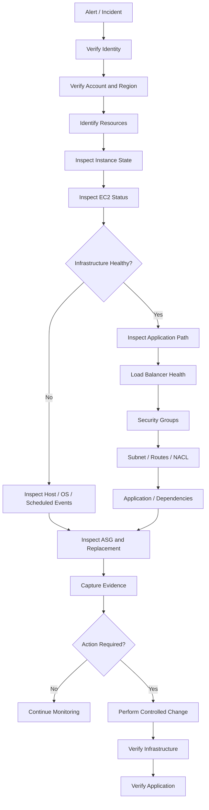

# 14- Operational CLI Workflows

## Overview

Production EC2 operations rarely involve a single AWS CLI command. Incident investigation usually requires correlating multiple layers of infrastructure:

- EC2 instance state and status checks
- Instance metadata and tags
- Network interfaces, Security Groups, routes, and NACLs
- EBS volumes and snapshots
- Load balancer target health
- Auto Scaling Groups and scaling activities
- Launch Templates and AMIs
- CloudWatch metrics
- Application and operating-system health

The AWS CLI is particularly useful for operational work because it provides fast, repeatable, scriptable access to AWS resources.

A reliable operational workflow follows an evidence-first model:

```text
Identify
   |
   v
Inspect
   |
   v
Correlate
   |
   v
Validate
   |
   v
Act
   |
   v
Verify
```

The objective is not simply to execute commands quickly. The objective is to determine the failure domain before making a change.

## Operational Safety Model

Before running commands against production resources, establish the execution context.

Verify the AWS identity:

```bash
aws sts get-caller-identity
```

Verify the configured region:

```bash
aws configure get region
```

For a named profile:

```bash
aws sts get-caller-identity \
    --profile production
```

Use explicit profile and region parameters for production operations:

```bash
aws ec2 describe-instances \
    --profile production \
    --region ap-south-1 \
    --output table
```

The distinction between inspection and mutation should remain explicit.

| Operation | Examples | Typical risk |
|---|---|---:|
| Inspection | `describe-*`, `get-*` | Low |
| Lifecycle change | Start, stop, reboot | Medium |
| Configuration change | Security Groups, volumes, Launch Templates | High |
| Destructive operation | Terminate, delete, release | Critical |

Read-only inspection should normally precede every disruptive operation.



## Standard Operational Variables

Repeatedly typing production identifiers increases the chance of targeting the wrong resource.

Use variables for recurring context:

```bash
export AWS_PROFILE="production"
export AWS_REGION="ap-south-1"
export APPLICATION="payments-api"
export ENVIRONMENT="production"
```

Commands can then consistently use:

```bash
aws ec2 describe-instances \
    --profile "$AWS_PROFILE" \
    --region "$AWS_REGION"
```

For a specific instance:

```bash
export INSTANCE_ID="i-0123456789abcdef0"
```

Before a mutating command, display the target explicitly:

```bash
printf 'Profile:  %s\n' "$AWS_PROFILE"
printf 'Region:   %s\n' "$AWS_REGION"
printf 'Instance: %s\n' "$INSTANCE_ID"
```

For destructive workflows, treat the resolved resource ID as the final authorization point rather than relying only on human-readable names.

## Finding Instances by Tags

Tags are one of the most important discovery mechanisms in EC2 operations.

A production tagging model might include:

```text
Environment = production
Application = payments-api
Service     = api
Owner       = payments-team
ManagedBy   = terraform
```

Find instances for an application:

```bash
aws ec2 describe-instances \
    --profile "$AWS_PROFILE" \
    --region "$AWS_REGION" \
    --filters \
        "Name=tag:Application,Values=$APPLICATION" \
        "Name=tag:Environment,Values=$ENVIRONMENT" \
    --query 'Reservations[].Instances[].{
        ID:InstanceId,
        Name:Tags[?Key==`Name`].Value | [0],
        State:State.Name,
        Type:InstanceType,
        AZ:Placement.AvailabilityZone,
        PrivateIP:PrivateIpAddress
    }' \
    --output table
```

For operational automation, return only the identifiers required by the next step:

```bash
aws ec2 describe-instances \
    --profile "$AWS_PROFILE" \
    --region "$AWS_REGION" \
    --filters \
        "Name=tag:Application,Values=$APPLICATION" \
        "Name=tag:Environment,Values=$ENVIRONMENT" \
        "Name=instance-state-name,Values=running" \
    --query 'Reservations[].Instances[].InstanceId' \
    --output text
```

## Building an EC2 Inventory

During an incident, first establish what resources actually exist.

```bash
aws ec2 describe-instances \
    --profile "$AWS_PROFILE" \
    --region "$AWS_REGION" \
    --filters "Name=tag:Environment,Values=$ENVIRONMENT" \
    --query 'Reservations[].Instances[].{
        ID:InstanceId,
        Name:Tags[?Key==`Name`].Value | [0],
        Application:Tags[?Key==`Application`].Value | [0],
        State:State.Name,
        Type:InstanceType,
        AZ:Placement.AvailabilityZone,
        PrivateIP:PrivateIpAddress,
        PublicIP:PublicIpAddress
    }' \
    --output table
```

This quickly exposes:

- Instance distribution
- Instance states
- Availability Zone placement
- Instance types
- Private addresses
- Unexpected public addresses
- Missing or inconsistent tags

## Finding Unhealthy Instances

`running` is a lifecycle state, not a complete health signal.

Inspect EC2 status checks:

```bash
aws ec2 describe-instance-status \
    --profile "$AWS_PROFILE" \
    --region "$AWS_REGION" \
    --include-all-instances \
    --query 'InstanceStatuses[].{
        ID:InstanceId,
        State:InstanceState.Name,
        System:SystemStatus.Status,
        Instance:InstanceStatus.Status
    }' \
    --output table
```

Find instances with impaired system status:

```bash
aws ec2 describe-instance-status \
    --profile "$AWS_PROFILE" \
    --region "$AWS_REGION" \
    --filters "Name=system-status.status,Values=impaired" \
    --query 'InstanceStatuses[].{
        ID:InstanceId,
        System:SystemStatus.Status,
        Instance:InstanceStatus.Status
    }' \
    --output table
```

Find instances with impaired instance status:

```bash
aws ec2 describe-instance-status \
    --profile "$AWS_PROFILE" \
    --region "$AWS_REGION" \
    --filters "Name=instance-status.status,Values=impaired" \
    --query 'InstanceStatuses[].{
        ID:InstanceId,
        System:SystemStatus.Status,
        Instance:InstanceStatus.Status
    }' \
    --output table
```

The distinction matters:

| Signal | Primarily indicates |
|---|---|
| Instance state | Lifecycle state |
| System status check | Underlying AWS infrastructure |
| Instance status check | Instance/OS-level health |
| Load balancer target health | Application endpoint health |
| Application metrics | Service behavior |

No single signal should be treated as proof that the entire service is healthy.

## Inspecting an Unhealthy Instance

Once an instance is identified:

```bash
export INSTANCE_ID="i-0123456789abcdef0"
```

Inspect its metadata:

```bash
aws ec2 describe-instances \
    --profile "$AWS_PROFILE" \
    --region "$AWS_REGION" \
    --instance-ids "$INSTANCE_ID" \
    --query 'Reservations[0].Instances[0].{
        ID:InstanceId,
        Name:Tags[?Key==`Name`].Value | [0],
        Application:Tags[?Key==`Application`].Value | [0],
        State:State.Name,
        Type:InstanceType,
        AZ:Placement.AvailabilityZone,
        PrivateIP:PrivateIpAddress,
        PublicIP:PublicIpAddress,
        Subnet:SubnetId,
        VPC:VpcId,
        SecurityGroups:SecurityGroups,
        IAMProfile:IamInstanceProfile.Arn
    }' \
    --output json
```

This establishes the resource's context before investigating deeper layers.

## Inspecting Console Output

If the instance cannot be reached through SSH or Systems Manager, inspect the EC2 console output:

```bash
aws ec2 get-console-output \
    --profile "$AWS_PROFILE" \
    --region "$AWS_REGION" \
    --instance-id "$INSTANCE_ID" \
    --latest \
    --output text
```

Console output can help identify:

- Kernel failures
- Boot failures
- Filesystem errors
- Cloud-init problems
- User Data failures
- Network initialization problems

This is especially valuable when the operating system cannot be reached through normal management channels.

## Checking Scheduled Events

AWS may schedule events affecting EC2 instances.

Inspect instance events:

```bash
aws ec2 describe-instance-status \
    --profile "$AWS_PROFILE" \
    --region "$AWS_REGION" \
    --include-all-instances \
    --query 'InstanceStatuses[?Events != `[]`].{
        ID:InstanceId,
        Events:Events
    }' \
    --output json
```

For a specific instance:

```bash
aws ec2 describe-instance-status \
    --profile "$AWS_PROFILE" \
    --region "$AWS_REGION" \
    --instance-ids "$INSTANCE_ID" \
    --include-all-instances \
    --query 'InstanceStatuses[0].Events' \
    --output json
```

Scheduled maintenance should be considered before treating an infrastructure impairment as an application defect.

## Inspecting Network Connectivity

When an application cannot be reached, establish the network path before changing firewall rules.

A typical public API path might look like:

```text
Client
  |
  v
Application Load Balancer
  |
  v
ALB Security Group
  |
  v
Target Group
  |
  v
EC2 ENI
  |
  v
EC2 Security Group
  |
  v
Nginx
  |
  v
Django / FastAPI
```

The path may additionally involve:

- Route tables
- NAT gateways
- Internet gateways
- Network ACLs
- Private DNS
- Service discovery
- VPC endpoints

Start with the instance network configuration:

```bash
aws ec2 describe-instances \
    --profile "$AWS_PROFILE" \
    --region "$AWS_REGION" \
    --instance-ids "$INSTANCE_ID" \
    --query 'Reservations[0].Instances[0].{
        PrivateIP:PrivateIpAddress,
        PublicIP:PublicIpAddress,
        Subnet:SubnetId,
        VPC:VpcId,
        SecurityGroups:SecurityGroups,
        ENIs:NetworkInterfaces[].NetworkInterfaceId
    }' \
    --output json
```

## Inspecting Network Interfaces

Inspect the instance's ENIs:

```bash
aws ec2 describe-network-interfaces \
    --profile "$AWS_PROFILE" \
    --region "$AWS_REGION" \
    --filters "Name=attachment.instance-id,Values=$INSTANCE_ID" \
    --query 'NetworkInterfaces[].{
        ENI:NetworkInterfaceId,
        PrivateIP:PrivateIpAddress,
        Subnet:SubnetId,
        VPC:VpcId,
        Groups:Groups,
        Status:Status
    }' \
    --output json
```

This is useful for instances with:

- Multiple ENIs
- Multiple private IPs
- Specialized networking
- Multiple Security Group assignments

## Inspecting Security Groups

Get the instance's Security Group IDs:

```bash
aws ec2 describe-instances \
    --profile "$AWS_PROFILE" \
    --region "$AWS_REGION" \
    --instance-ids "$INSTANCE_ID" \
    --query 'Reservations[0].Instances[0].SecurityGroups[].GroupId' \
    --output text
```

Inspect a specific group:

```bash
export SECURITY_GROUP_ID="sg-0123456789abcdef0"

aws ec2 describe-security-groups \
    --profile "$AWS_PROFILE" \
    --region "$AWS_REGION" \
    --group-ids "$SECURITY_GROUP_ID" \
    --output json
```

For focused inspection:

```bash
aws ec2 describe-security-groups \
    --profile "$AWS_PROFILE" \
    --region "$AWS_REGION" \
    --group-ids "$SECURITY_GROUP_ID" \
    --query 'SecurityGroups[].{
        ID:GroupId,
        Name:GroupName,
        VPC:VpcId,
        Ingress:IpPermissions,
        Egress:IpPermissionsEgress
    }' \
    --output json
```

Security Groups are stateful and allow-based. They do not provide explicit deny rules.

## Inspecting the Subnet

Retrieve the instance's subnet:

```bash
export SUBNET_ID=$(aws ec2 describe-instances \
    --profile "$AWS_PROFILE" \
    --region "$AWS_REGION" \
    --instance-ids "$INSTANCE_ID" \
    --query 'Reservations[0].Instances[0].SubnetId' \
    --output text)
```

Inspect the subnet:

```bash
aws ec2 describe-subnets \
    --profile "$AWS_PROFILE" \
    --region "$AWS_REGION" \
    --subnet-ids "$SUBNET_ID" \
    --query 'Subnets[].{
        Subnet:SubnetId,
        VPC:VpcId,
        CIDR:CidrBlock,
        AZ:AvailabilityZone,
        AvailableIPs:AvailableIpAddressCount,
        PublicIPOnLaunch:MapPublicIpOnLaunch
    }' \
    --output table
```

This can reveal subnet address exhaustion or unexpected public/private configuration.

## Inspecting Route Tables

Find route tables explicitly associated with the subnet:

```bash
aws ec2 describe-route-tables \
    --profile "$AWS_PROFILE" \
    --region "$AWS_REGION" \
    --filters "Name=association.subnet-id,Values=$SUBNET_ID" \
    --output json
```

If there is no explicit subnet association, inspect the VPC's main route table:

```bash
export VPC_ID=$(aws ec2 describe-subnets \
    --profile "$AWS_PROFILE" \
    --region "$AWS_REGION" \
    --subnet-ids "$SUBNET_ID" \
    --query 'Subnets[0].VpcId' \
    --output text)

aws ec2 describe-route-tables \
    --profile "$AWS_PROFILE" \
    --region "$AWS_REGION" \
    --filters \
        "Name=vpc-id,Values=$VPC_ID" \
        "Name=association.main,Values=true" \
    --output json
```

A correct Security Group cannot compensate for an incorrect route.

## Inspecting Network ACLs

Inspect the NACL associated with the subnet:

```bash
aws ec2 describe-network-acls \
    --profile "$AWS_PROFILE" \
    --region "$AWS_REGION" \
    --filters "Name=association.subnet-id,Values=$SUBNET_ID" \
    --query 'NetworkAcls[].{
        ID:NetworkAclId,
        Default:IsDefault,
        Entries:Entries
    }' \
    --output json
```

NACLs are stateless, so inbound and outbound traffic must be evaluated independently.

## Network Troubleshooting Workflow



The objective is to identify the layer where the expected traffic path stops.

## Investigating Load Balancer Health

EC2 health and load balancer target health are separate signals.

List load balancers:

```bash
aws elbv2 describe-load-balancers \
    --profile "$AWS_PROFILE" \
    --region "$AWS_REGION" \
    --query 'LoadBalancers[].{
        Name:LoadBalancerName,
        Type:Type,
        Scheme:Scheme,
        State:State.Code,
        DNS:DNSName
    }' \
    --output table
```

List target groups:

```bash
aws elbv2 describe-target-groups \
    --profile "$AWS_PROFILE" \
    --region "$AWS_REGION" \
    --query 'TargetGroups[].{
        Name:TargetGroupName,
        Protocol:Protocol,
        Port:Port,
        TargetType:TargetType,
        ARN:TargetGroupArn
    }' \
    --output table
```

Set the target group:

```bash
export TARGET_GROUP_ARN="arn:aws:elasticloadbalancing:ap-south-1:123456789012:targetgroup/payments-api/abcdef1234567890"
```

Inspect target health:

```bash
aws elbv2 describe-target-health \
    --profile "$AWS_PROFILE" \
    --region "$AWS_REGION" \
    --target-group-arn "$TARGET_GROUP_ARN" \
    --query 'TargetHealthDescriptions[].{
        Target:Target.Id,
        Port:Target.Port,
        State:TargetHealth.State,
        Reason:TargetHealth.Reason,
        Description:TargetHealth.Description
    }' \
    --output table
```

An EC2 instance can be completely healthy while its load balancer target is unhealthy.

## Diagnosing an Unhealthy Load Balancer Target

When a target is unhealthy:

1. Confirm the EC2 instance is running.
2. Check EC2 system and instance status.
3. Confirm the target is registered.
4. Inspect the target group's health-check configuration.
5. Verify load balancer-to-instance Security Group connectivity.
6. Verify the application is listening on the expected port.
7. Verify the health-check path and expected response.
8. Inspect application and Nginx logs.
9. Check recent deployment or configuration changes.

Inspect health-check configuration:

```bash
aws elbv2 describe-target-groups \
    --profile "$AWS_PROFILE" \
    --region "$AWS_REGION" \
    --target-group-arns "$TARGET_GROUP_ARN" \
    --query 'TargetGroups[].{
        Protocol:Protocol,
        Port:Port,
        HealthProtocol:HealthCheckProtocol,
        HealthPort:HealthCheckPort,
        HealthPath:HealthCheckPath,
        Interval:HealthCheckIntervalSeconds,
        Timeout:HealthCheckTimeoutSeconds,
        HealthyThreshold:HealthyThresholdCount,
        UnhealthyThreshold:UnhealthyThresholdCount
    }' \
    --output table
```

Common causes include:

- Incorrect port
- Incorrect health-check path
- Application startup failure
- Nginx configuration error
- Security Group rules
- Wrong expected status code
- Dependency failures
- Application process crash

## Investigating EBS Storage

Inspect an instance's block-device mappings:

```bash
aws ec2 describe-instances \
    --profile "$AWS_PROFILE" \
    --region "$AWS_REGION" \
    --instance-ids "$INSTANCE_ID" \
    --query 'Reservations[0].Instances[0].BlockDeviceMappings[].{
        Device:DeviceName,
        Volume:Ebs.VolumeId,
        Status:Ebs.Status,
        DeleteOnTermination:Ebs.DeleteOnTermination
    }' \
    --output table
```

Inspect a specific volume:

```bash
export VOLUME_ID="vol-0123456789abcdef0"

aws ec2 describe-volumes \
    --profile "$AWS_PROFILE" \
    --region "$AWS_REGION" \
    --volume-ids "$VOLUME_ID" \
    --query 'Volumes[].{
        ID:VolumeId,
        State:State,
        Type:VolumeType,
        SizeGiB:Size,
        IOPS:Iops,
        Throughput:Throughput,
        AZ:AvailabilityZone,
        Encrypted:Encrypted,
        Attachments:Attachments
    }' \
    --output json
```

This establishes the AWS-level storage configuration.

## Investigating Disk-Full Incidents

The EC2 API can tell you about:

- EBS volume size
- Volume type
- Volume state
- Attachment
- IOPS
- Throughput

It does not directly provide filesystem utilization inside the guest OS.

After identifying the relevant instance and volume, inspect the operating system through an approved management path such as Systems Manager Session Manager.

Typical Linux diagnostics include:

```bash
df -h
```

```bash
df -i
```

```bash
lsblk
```

```bash
sudo du -xhd1 /var
```

Possible causes include:

- Filesystem capacity exhaustion
- Inode exhaustion
- Application logs
- Docker layers
- Temporary files
- Database files
- Celery worker artifacts
- Unbounded application data

Increasing an EBS volume does not automatically guarantee that the partition and filesystem have been expanded.

## Finding Unattached EBS Volumes

Find available volumes:

```bash
aws ec2 describe-volumes \
    --profile "$AWS_PROFILE" \
    --region "$AWS_REGION" \
    --filters "Name=status,Values=available" \
    --query 'Volumes[].{
        ID:VolumeId,
        Type:VolumeType,
        SizeGiB:Size,
        AZ:AvailabilityZone,
        Created:CreateTime
    }' \
    --output table
```

An unattached volume is not automatically an orphan.

It may be:

- Intentionally retained
- Recently detached
- Used for recovery
- Awaiting reattachment
- A stateful application's persistent volume
- An untracked resource

Validate ownership and retention requirements before deleting it.

## Investigating Snapshots

Before modifying or deleting storage, inspect snapshots:

```bash
aws ec2 describe-snapshots \
    --profile "$AWS_PROFILE" \
    --region "$AWS_REGION" \
    --owner-ids self \
    --filters "Name=volume-id,Values=$VOLUME_ID" \
    --query 'Snapshots[].{
        ID:SnapshotId,
        State:State,
        Started:StartTime,
        Progress:Progress,
        Description:Description
    }' \
    --output table
```

A snapshot existing does not prove that it is:

- Recent
- Application-consistent
- Restorable
- Retained according to policy
- Suitable for disaster recovery

Recovery testing is a separate operational requirement.

## Investigating Auto Scaling Groups

Determine whether an instance belongs to an Auto Scaling Group:

```bash
aws autoscaling describe-auto-scaling-instances \
    --profile "$AWS_PROFILE" \
    --region "$AWS_REGION" \
    --instance-ids "$INSTANCE_ID" \
    --query 'AutoScalingInstances[].{
        Instance:InstanceId,
        ASG:AutoScalingGroupName,
        Lifecycle:LifecycleState,
        Health:HealthStatus,
        AZ:AvailabilityZone
    }' \
    --output table
```

Inspect the ASG:

```bash
export ASG_NAME="payments-api-production"

aws autoscaling describe-auto-scaling-groups \
    --profile "$AWS_PROFILE" \
    --region "$AWS_REGION" \
    --auto-scaling-group-names "$ASG_NAME" \
    --query 'AutoScalingGroups[].{
        Name:AutoScalingGroupName,
        Min:MinSize,
        Desired:DesiredCapacity,
        Max:MaxSize,
        HealthType:HealthCheckType,
        Instances:Instances
    }' \
    --output json
```

This determines whether an individual instance is part of a larger capacity-management system.

## Investigating Auto Scaling Replacement

Inspect recent scaling activities:

```bash
aws autoscaling describe-scaling-activities \
    --profile "$AWS_PROFILE" \
    --region "$AWS_REGION" \
    --auto-scaling-group-name "$ASG_NAME" \
    --max-items 20 \
    --query 'Activities[].{
        Time:StartTime,
        Status:StatusCode,
        Description:Description,
        Cause:Cause
    }' \
    --output table
```

Repeated replacement can indicate:

- Failed EC2 health checks
- Failed load balancer health checks
- Broken AMIs
- Invalid User Data
- Incorrect Security Groups
- Application startup failures
- Dependency failures
- Launch Template problems

If every replacement fails in the same way, investigate the shared configuration rather than repeatedly repairing individual instances.

## Inspecting Launch Templates

Determine the Launch Template configuration:

```bash
aws autoscaling describe-auto-scaling-groups \
    --profile "$AWS_PROFILE" \
    --region "$AWS_REGION" \
    --auto-scaling-group-names "$ASG_NAME" \
    --query 'AutoScalingGroups[0].LaunchTemplate' \
    --output json
```

Inspect Launch Template versions:

```bash
export LAUNCH_TEMPLATE_ID="lt-0123456789abcdef0"

aws ec2 describe-launch-template-versions \
    --profile "$AWS_PROFILE" \
    --region "$AWS_REGION" \
    --launch-template-id "$LAUNCH_TEMPLATE_ID" \
    --versions '$Default' '$Latest' \
    --output json
```

Important fields include:

- AMI ID
- Instance type
- Security Groups
- IAM instance profile
- User Data
- Network configuration
- Block-device mappings

When multiple instances fail after a deployment, comparing the active Launch Template version against the previous known-good version can quickly identify configuration drift.

## Investigating Instance Refreshes

Inspect ASG instance refreshes:

```bash
aws autoscaling describe-instance-refreshes \
    --profile "$AWS_PROFILE" \
    --region "$AWS_REGION" \
    --auto-scaling-group-name "$ASG_NAME" \
    --query 'InstanceRefreshes[].{
        ID:InstanceRefreshId,
        Status:Status,
        Percentage:PercentageComplete,
        Start:StartTime,
        Reason:StatusReason
    }' \
    --output table
```

Then inspect current instances:

```bash
aws autoscaling describe-auto-scaling-groups \
    --profile "$AWS_PROFILE" \
    --region "$AWS_REGION" \
    --auto-scaling-group-names "$ASG_NAME" \
    --query 'AutoScalingGroups[0].Instances[].{
        ID:InstanceId,
        Health:HealthStatus,
        Lifecycle:LifecycleState,
        AZ:AvailabilityZone
    }' \
    --output table
```

Correlate the result with load balancer target health:

```bash
aws elbv2 describe-target-health \
    --profile "$AWS_PROFILE" \
    --region "$AWS_REGION" \
    --target-group-arn "$TARGET_GROUP_ARN" \
    --query 'TargetHealthDescriptions[].{
        ID:Target.Id,
        State:TargetHealth.State,
        Reason:TargetHealth.Reason
    }' \
    --output table
```

This separates launch problems from application health-check failures.

## Investigating Failed Deployments

Consider a deployment of a Django or FastAPI service:

```text
CI/CD
  |
  v
New AMI / Launch Template
  |
  v
ASG Instance Refresh
  |
  v
EC2 Instance
  |
  +--> EC2 Status Checks
  |
  +--> User Data
  |
  +--> Network
  |
  +--> Nginx
  |
  +--> Application
  |
  +--> ALB Health Check
```

A useful investigation sequence is:

1. Confirm the deployment completed.
2. Identify the active Launch Template version.
3. Inspect new instances.
4. Check EC2 status checks.
5. Inspect console output or instance logs.
6. Inspect target health.
7. Verify the application listener.
8. Check dependency connectivity.
9. Inspect ASG scaling activities.
10. Compare against the previous known-good configuration.

This is more reliable than assuming the deployment system itself is the failure point.

## Inspecting IAM Instance Profiles

An EC2 application may need access to:

- S3
- SQS
- SNS
- Secrets Manager
- Systems Manager
- CloudWatch
- KMS

Inspect the instance profile:

```bash
aws ec2 describe-instances \
    --profile "$AWS_PROFILE" \
    --region "$AWS_REGION" \
    --instance-ids "$INSTANCE_ID" \
    --query 'Reservations[0].Instances[0].IamInstanceProfile.Arn' \
    --output text
```

An application can have:

```text
Healthy EC2
+
Healthy Network
+
Healthy Application
+
IAM AccessDenied
```

In this situation, changing Security Groups would not solve the problem.

IAM authorization should be investigated separately.

## Checking CloudWatch Metrics

CloudWatch provides operational signals that complement EC2 state and status checks.

For example, retrieve CPU utilization:

```bash
aws cloudwatch get-metric-statistics \
    --profile "$AWS_PROFILE" \
    --region "$AWS_REGION" \
    --namespace AWS/EC2 \
    --metric-name CPUUtilization \
    --dimensions Name=InstanceId,Value="$INSTANCE_ID" \
    --statistics Average Maximum \
    --period 300 \
    --start-time "2026-09-20T19:30:00Z" \
    --end-time "2026-09-20T20:00:00Z" \
    --output json
```

For operational automation, generate timestamps programmatically rather than hard-coding them.

CPU should be correlated with:

- Network traffic
- Application latency
- Request rate
- Error rate
- EBS performance
- Application logs
- Database load
- Queue depth

High CPU alone does not identify the root cause.

## Investigating High CPU

A practical workflow is:

1. Identify the affected instance.
2. Confirm EC2 status checks.
3. Check CPU trends.
4. Determine whether the instance belongs to an ASG.
5. Check scaling activity.
6. Inspect application metrics.
7. Determine whether the workload is expected.
8. Identify the root cause before resizing or replacing the instance.

Potential causes include:

- Traffic spikes
- Expensive API requests
- Infinite loops
- Celery workers
- Retry storms
- Database contention
- Serialization overhead
- Nginx/application configuration
- CPU credit exhaustion on burstable instances

Scaling the instance may relieve symptoms without fixing the underlying problem.

## Checking Availability Zone Distribution

Inspect application instances:

```bash
aws ec2 describe-instances \
    --profile "$AWS_PROFILE" \
    --region "$AWS_REGION" \
    --filters \
        "Name=tag:Application,Values=$APPLICATION" \
        "Name=tag:Environment,Values=$ENVIRONMENT" \
        "Name=instance-state-name,Values=running" \
    --query 'Reservations[].Instances[].{
        ID:InstanceId,
        AZ:Placement.AvailabilityZone,
        IP:PrivateIpAddress
    }' \
    --output table
```

Unexpected concentration in one Availability Zone can indicate:

- ASG configuration problems
- Subnet capacity issues
- Failed instance launches
- Capacity constraints
- Incorrect subnet selection

Multi-AZ distribution reduces the blast radius of an Availability Zone failure.

## Checking Subnet IP Capacity

Inspect subnet address availability:

```bash
aws ec2 describe-subnets \
    --profile "$AWS_PROFILE" \
    --region "$AWS_REGION" \
    --filters "Name=vpc-id,Values=$VPC_ID" \
    --query 'Subnets[].{
        ID:SubnetId,
        AZ:AvailabilityZone,
        CIDR:CidrBlock,
        AvailableIPs:AvailableIpAddressCount
    }' \
    --output table
```

Low available IP capacity can prevent:

- EC2 launches
- ENI creation
- Auto Scaling
- Container networking
- Load balancer operations

This is especially important in high-density microservice environments.

## Finding Instances by Application and State

A reusable operational query:

```bash
aws ec2 describe-instances \
    --profile "$AWS_PROFILE" \
    --region "$AWS_REGION" \
    --filters \
        "Name=tag:Application,Values=$APPLICATION" \
        "Name=tag:Environment,Values=$ENVIRONMENT" \
        "Name=instance-state-name,Values=running" \
    --query 'Reservations[].Instances[].{
        ID:InstanceId,
        Name:Tags[?Key==`Name`].Value | [0],
        Type:InstanceType,
        AZ:Placement.AvailabilityZone,
        IP:PrivateIpAddress,
        State:State.Name
    }' \
    --output table
```

This is a useful starting point for most application-level EC2 investigations.

## Safe Stop Workflow

Do not begin a production stop operation with `stop-instances`.

First inspect the instance:

```bash
aws ec2 describe-instances \
    --profile "$AWS_PROFILE" \
    --region "$AWS_REGION" \
    --instance-ids "$INSTANCE_ID" \
    --query 'Reservations[0].Instances[0].{
        ID:InstanceId,
        Name:Tags[?Key==`Name`].Value | [0],
        State:State.Name,
        AZ:Placement.AvailabilityZone,
        PrivateIP:PrivateIpAddress,
        PublicIP:PublicIpAddress,
        BlockDevices:BlockDeviceMappings
    }' \
    --output json
```

Check ASG membership:

```bash
aws autoscaling describe-auto-scaling-instances \
    --profile "$AWS_PROFILE" \
    --region "$AWS_REGION" \
    --instance-ids "$INSTANCE_ID" \
    --output table
```

Check load balancer target health where applicable:

```bash
aws elbv2 describe-target-health \
    --profile "$AWS_PROFILE" \
    --region "$AWS_REGION" \
    --target-group-arn "$TARGET_GROUP_ARN" \
    --output table
```

After validating the impact:

```bash
aws ec2 stop-instances \
    --profile "$AWS_PROFILE" \
    --region "$AWS_REGION" \
    --instance-ids "$INSTANCE_ID"
```

Wait for the state transition:

```bash
aws ec2 wait instance-stopped \
    --profile "$AWS_PROFILE" \
    --region "$AWS_REGION" \
    --instance-ids "$INSTANCE_ID"
```

## Safe Start Workflow

Start the instance:

```bash
aws ec2 start-instances \
    --profile "$AWS_PROFILE" \
    --region "$AWS_REGION" \
    --instance-ids "$INSTANCE_ID"
```

Wait for the lifecycle state:

```bash
aws ec2 wait instance-running \
    --profile "$AWS_PROFILE" \
    --region "$AWS_REGION" \
    --instance-ids "$INSTANCE_ID"
```

Then wait for EC2 status checks:

```bash
aws ec2 wait instance-status-ok \
    --profile "$AWS_PROFILE" \
    --region "$AWS_REGION" \
    --instance-ids "$INSTANCE_ID"
```

Finally verify application health separately.

```text
Instance running
      !=
EC2 status healthy
      !=
Application healthy
```

For load-balanced applications, target health must also be checked.

## Safe Reboot Workflow

Before rebooting:

- Capture useful evidence.
- Check EC2 status.
- Determine whether the instance serves traffic.
- Check ASG membership.
- Check load balancer health.
- Confirm sufficient healthy capacity remains.
- Determine whether the problem is actually expected to be resolved by a reboot.

Then:

```bash
aws ec2 reboot-instances \
    --profile "$AWS_PROFILE" \
    --region "$AWS_REGION" \
    --instance-ids "$INSTANCE_ID"
```

Verify infrastructure and application health afterward.

Repeated rebooting without identifying the failure mode is not a reliable troubleshooting strategy.

## Safe Termination Workflow

Termination is destructive and should require stronger validation.

Inspect the instance:

```bash
aws ec2 describe-instances \
    --profile "$AWS_PROFILE" \
    --region "$AWS_REGION" \
    --instance-ids "$INSTANCE_ID" \
    --query 'Reservations[0].Instances[0].{
        ID:InstanceId,
        Name:Tags[?Key==`Name`].Value | [0],
        Environment:Tags[?Key==`Environment`].Value | [0],
        State:State.Name,
        AZ:Placement.AvailabilityZone,
        Volumes:BlockDeviceMappings
    }' \
    --output json
```

Check termination protection:

```bash
aws ec2 describe-instance-attribute \
    --profile "$AWS_PROFILE" \
    --region "$AWS_REGION" \
    --instance-id "$INSTANCE_ID" \
    --attribute disableApiTermination
```

Check ASG membership:

```bash
aws autoscaling describe-auto-scaling-instances \
    --profile "$AWS_PROFILE" \
    --region "$AWS_REGION" \
    --instance-ids "$INSTANCE_ID" \
    --output table
```

Inspect EBS `DeleteOnTermination` behavior before terminating an instance with important volumes.

Only after validation:

```bash
aws ec2 terminate-instances \
    --profile "$AWS_PROFILE" \
    --region "$AWS_REGION" \
    --instance-ids "$INSTANCE_ID"
```

Then:

```bash
aws ec2 wait instance-terminated \
    --profile "$AWS_PROFILE" \
    --region "$AWS_REGION" \
    --instance-ids "$INSTANCE_ID"
```

## Replace Rather Than Repair

Modern EC2 architectures commonly treat application instances as reproducible infrastructure.

For a stateless ASG-managed API:

```text
Unhealthy Instance
        |
        v
Collect Evidence
        |
        v
Validate Shared Configuration
        |
        v
Replace Instance
        |
        v
ASG Launches Replacement
        |
        v
EC2 Health Checks
        |
        v
Load Balancer Health
        |
        v
Application Traffic
```

Replacement is particularly appropriate when:

- The instance is stateless.
- Configuration is automated.
- The AMI is reproducible.
- Application state is externalized.
- The ASG is correctly configured.
- Health checks are reliable.

Manual repair can still be appropriate for forensic investigation or stateful workloads.

## Capturing Incident Evidence

Before disruptive actions, preserve useful state.

Create an incident directory:

```bash
mkdir -p "incident-$INSTANCE_ID"
```

Capture instance metadata:

```bash
aws ec2 describe-instances \
    --profile "$AWS_PROFILE" \
    --region "$AWS_REGION" \
    --instance-ids "$INSTANCE_ID" \
    --output json \
    > "incident-$INSTANCE_ID/instance.json"
```

Capture status:

```bash
aws ec2 describe-instance-status \
    --profile "$AWS_PROFILE" \
    --region "$AWS_REGION" \
    --instance-ids "$INSTANCE_ID" \
    --include-all-instances \
    --output json \
    > "incident-$INSTANCE_ID/status.json"
```

Capture console output:

```bash
aws ec2 get-console-output \
    --profile "$AWS_PROFILE" \
    --region "$AWS_REGION" \
    --instance-id "$INSTANCE_ID" \
    --latest \
    --output json \
    > "incident-$INSTANCE_ID/console.json"
```

Depending on the incident, also capture:

- Target health
- ASG scaling activities
- Launch Template version
- Security Group configuration
- Network interface configuration
- EBS mappings
- Relevant CloudWatch metrics

Treat captured artifacts as sensitive infrastructure information.

## Production Incident Workflow

A standardized EC2 incident workflow can be represented as:



This separates infrastructure failure from application failure before introducing changes.

## Read-Only Troubleshooting Checklist

| Area | Primary command |
|---|---|
| AWS identity | `aws sts get-caller-identity` |
| Instance metadata | `aws ec2 describe-instances` |
| EC2 health | `aws ec2 describe-instance-status` |
| Boot diagnostics | `aws ec2 get-console-output` |
| ENIs | `aws ec2 describe-network-interfaces` |
| Security Groups | `aws ec2 describe-security-groups` |
| Subnets | `aws ec2 describe-subnets` |
| Routes | `aws ec2 describe-route-tables` |
| NACLs | `aws ec2 describe-network-acls` |
| EBS | `aws ec2 describe-volumes` |
| Snapshots | `aws ec2 describe-snapshots` |
| ASG membership | `aws autoscaling describe-auto-scaling-instances` |
| Scaling activity | `aws autoscaling describe-scaling-activities` |
| Instance refresh | `aws autoscaling describe-instance-refreshes` |
| Target health | `aws elbv2 describe-target-health` |
| CloudWatch metrics | `aws cloudwatch get-metric-statistics` |

This read-only phase should normally happen before lifecycle or configuration changes.

## Safe Batch Operations

Batch operations increase blast radius.

First discover the target set:

```bash
INSTANCE_IDS=$(aws ec2 describe-instances \
    --profile "$AWS_PROFILE" \
    --region "$AWS_REGION" \
    --filters \
        "Name=tag:Application,Values=$APPLICATION" \
        "Name=tag:Environment,Values=$ENVIRONMENT" \
    --query 'Reservations[].Instances[].InstanceId' \
    --output text)

printf 'Target instances:\n%s\n' "$INSTANCE_IDS"
```

For disruptive operations, do not immediately pipe dynamic discovery into a destructive command.

Avoid:

```bash
aws ec2 terminate-instances \
    --instance-ids $(aws ec2 describe-instances ...)
```

Prefer:

```text
Discover
   |
   v
Review
   |
   v
Resolve Explicit IDs
   |
   v
Validate
   |
   v
Mutate
```

This introduces a deliberate review point.

## Waiters for Lifecycle Operations

AWS CLI waiters are useful when a workflow depends on a state transition.

Wait for running:

```bash
aws ec2 wait instance-running \
    --profile "$AWS_PROFILE" \
    --region "$AWS_REGION" \
    --instance-ids "$INSTANCE_ID"
```

Wait for stopped:

```bash
aws ec2 wait instance-stopped \
    --profile "$AWS_PROFILE" \
    --region "$AWS_REGION" \
    --instance-ids "$INSTANCE_ID"
```

Wait for terminated:

```bash
aws ec2 wait instance-terminated \
    --profile "$AWS_PROFILE" \
    --region "$AWS_REGION" \
    --instance-ids "$INSTANCE_ID"
```

Wait for status checks:

```bash
aws ec2 wait instance-status-ok \
    --profile "$AWS_PROFILE" \
    --region "$AWS_REGION" \
    --instance-ids "$INSTANCE_ID"
```

Prefer waiters over arbitrary delays such as:

```bash
sleep 60
```

Infrastructure transition times vary, so fixed sleeps are inherently less reliable.

## Idempotency and Repeatability

Operational commands should be safe to inspect repeatedly and should make state assumptions explicit before mutations.

Check the current state:

```bash
CURRENT_STATE=$(aws ec2 describe-instances \
    --profile "$AWS_PROFILE" \
    --region "$AWS_REGION" \
    --instance-ids "$INSTANCE_ID" \
    --query 'Reservations[0].Instances[0].State.Name' \
    --output text)

printf 'Current state: %s\n' "$CURRENT_STATE"
```

Then decide whether an operation is appropriate.

This is safer than blindly executing:

```bash
aws ec2 reboot-instances ...
```

or:

```bash
aws ec2 stop-instances ...
```

without validating the current state and operational impact.

## Handling Empty Results

A successful discovery command can legitimately return no matching resources.

For example:

```bash
INSTANCE_IDS=$(aws ec2 describe-instances \
    --profile "$AWS_PROFILE" \
    --region "$AWS_REGION" \
    --filters \
        "Name=tag:Application,Values=$APPLICATION" \
        "Name=tag:Environment,Values=$ENVIRONMENT" \
    --query 'Reservations[].Instances[].InstanceId' \
    --output text)
```

Validate the result:

```bash
if [[ -z "$INSTANCE_IDS" || "$INSTANCE_IDS" == "None" ]]; then
    echo "No matching EC2 instances found." >&2
    exit 1
fi
```

Operational tooling should distinguish:

```text
AWS command failed
        from
AWS command succeeded with zero matches
```

## Shell Safety for Operational Scripts

For Bash-based operational automation:

```bash
set -euo pipefail
```

A basic operational script can be structured as:

```bash
#!/usr/bin/env bash

set -euo pipefail

AWS_PROFILE="${AWS_PROFILE:-production}"
AWS_REGION="${AWS_REGION:-ap-south-1}"
INSTANCE_ID="${1:?Instance ID is required}"

aws sts get-caller-identity \
    --profile "$AWS_PROFILE" \
    --output json

aws ec2 describe-instances \
    --profile "$AWS_PROFILE" \
    --region "$AWS_REGION" \
    --instance-ids "$INSTANCE_ID" \
    --query 'Reservations[0].Instances[0].{
        ID:InstanceId,
        State:State.Name,
        AZ:Placement.AvailabilityZone,
        PrivateIP:PrivateIpAddress
    }' \
    --output table
```

As operational logic grows, move complex workflows to Python and Boto3 rather than creating increasingly complicated shell scripts.

## When to Use Boto3 Instead

AWS CLI is well suited for:

- Interactive troubleshooting
- Operational runbooks
- Incident response
- Small automation
- CI/CD steps
- One-off infrastructure checks

Boto3 or another AWS SDK becomes more appropriate when the workflow requires:

- Complex branching
- Structured exception handling
- Concurrency
- Large-scale resource processing
- Retry policies
- Unit testing
- Persistent state
- Reusable internal tooling

A useful boundary is:

```text
Operator / Runbook
       |
       v
AWS CLI

Platform / Application Tool
       |
       v
AWS SDK
```

Do not build a large infrastructure management application by parsing shell output.

## Security Considerations

Operational CLI workflows frequently require powerful IAM permissions.

Production controls should include:

- Least-privilege IAM roles
- Short-lived credentials
- IAM Identity Center where appropriate
- Separate production and non-production access
- Explicit account and region verification
- CloudTrail auditing
- Controlled access to destructive operations
- Protection of captured diagnostic artifacts
- OIDC federation for CI/CD where supported

Avoid storing long-lived credentials in scripts:

```bash
export AWS_ACCESS_KEY_ID="..."
export AWS_SECRET_ACCESS_KEY="..."
```

Use IAM roles, IAM Identity Center, workload identity, or another approved short-lived authentication mechanism.

Operational access should also be separated from application runtime permissions. An EC2 application's IAM role should not automatically have the privileges required to terminate production instances.

## Scalability Considerations

A workflow that works for ten instances may become inefficient at thousands.

At larger scale:

- Use server-side filters.
- Use consistent tags.
- Account for pagination.
- Minimize repeated API calls.
- Expect API throttling.
- Avoid scanning entire regions unnecessarily.
- Prefer targeted queries.
- Use CloudWatch and EventBridge for continuous operational signals.
- Use inventory/configuration systems for fleet-wide visibility.

Prefer:

```bash
aws ec2 describe-instances \
    --filters "Name=tag:Application,Values=$APPLICATION"
```

over retrieving every instance and filtering locally.

## Reliability Considerations

Before stopping, rebooting, or terminating an instance:

- Determine whether it serves production traffic.
- Check load balancer target health.
- Check ASG membership.
- Confirm healthy remaining capacity.
- Check Availability Zone distribution.
- Understand EBS retention behavior.
- Confirm persistent state is externalized.
- Check whether a replacement will be launched automatically.
- Understand deployment or instance-refresh activity.

For stateless services, replacement is often safer than prolonged manual repair.

For stateful services, lifecycle operations require additional storage, consistency, and recovery planning.

## Cost Considerations

Operational investigation can also expose unnecessary resource consumption.

Useful checks include:

```bash
aws ec2 describe-instances \
    --profile "$AWS_PROFILE" \
    --region "$AWS_REGION" \
    --filters "Name=instance-state-name,Values=stopped" \
    --query 'Reservations[].Instances[].{
        ID:InstanceId,
        Type:InstanceType,
        Name:Tags[?Key==`Name`].Value | [0]
    }' \
    --output table
```

Also investigate:

- Unattached EBS volumes
- Unused snapshots
- Unnecessary Elastic IP addresses
- Oversized instances
- Idle instances
- Excessive provisioned storage performance
- Unexpected Auto Scaling capacity

Cost optimization should not be performed blindly during incidents. Resource removal requires ownership and retention validation.

## Common Mistakes

### Treating `running` as Healthy

An instance can be running while:

- EC2 status checks fail
- The application is down
- The load balancer marks it unhealthy
- Nginx is broken
- Dependencies are unavailable

Always correlate multiple health layers.

### Changing Security Groups First

A connectivity problem does not automatically indicate a Security Group problem.

Inspect:

```text
Security Group
    ->
Route
    ->
NACL
    ->
Target Group
    ->
Listener
    ->
Application
```

before modifying access rules.

### Rebooting Before Capturing Evidence

A reboot may alter the failure state or remove useful transient evidence.

Capture relevant state first when practical.

### Manually Repairing ASG Instances

If every replacement fails, the problem is likely in shared configuration such as:

- AMI
- Launch Template
- User Data
- Security Group
- Health check
- Application deployment

Repairing one instance does not fix the underlying issue.

### Terminating Without Checking EBS

Volumes with `DeleteOnTermination=true` can be deleted with the instance.

Always inspect block-device mappings before destructive lifecycle operations.

### Ignoring Auto Scaling

Stopping or terminating an ASG-managed instance can trigger replacement and change capacity.

Inspect ASG membership first.

### Ignoring Tags

A tag query can return multiple instances.

Never assume a tag is unique unless the organization's tagging contract guarantees it.

### Using Dynamic Discovery in Destructive Commands

Avoid combining resource discovery and destructive mutation into a single unreviewed command.

### Assuming Infrastructure Health Means Application Health

EC2 status checks do not validate:

- Django
- FastAPI
- Nginx
- PostgreSQL
- Redis
- Kafka
- Celery
- Application-specific health

Each layer requires its own health signal.

### Using Fixed Sleeps

Avoid:

```bash
sleep 60
```

when an AWS CLI waiter can represent the actual desired state.

## Interview Traps

### Is a `running` Instance Healthy?

No. `running` describes lifecycle state. EC2 status checks, load balancer target health, and application health provide additional signals.

### What Should You Check When an EC2 Instance Is Unreachable?

Use a layered investigation:

```text
Instance state
    ->
EC2 status checks
    ->
ENI and IP configuration
    ->
Security Groups
    ->
Subnet
    ->
Route table
    ->
NACL
    ->
Load balancer
    ->
Operating system
    ->
Application
```

The exact path depends on the architecture.

### Should You Reboot an Impaired Instance Immediately?

Not necessarily. First determine the failure domain and capture useful evidence. A reboot can mask symptoms without resolving the underlying problem.

### Why Check Auto Scaling Before Terminating?

Because the ASG may replace the instance automatically. Termination may also affect desired capacity, deployment behavior, or an active instance refresh.

### Why Use AWS CLI Waiters?

Waiters poll for AWS-defined resource states and are generally more reliable than arbitrary fixed delays.

### When Should an Instance Be Replaced Instead of Repaired?

For stateless, reproducible, ASG-managed workloads, replacement is often the preferred operational model. Stateful workloads and forensic investigations may require preservation or repair.

## Production Operational Checklist

Before performing a production EC2 operation:

- Verify AWS identity.
- Verify account and region.
- Identify resources using validated tags.
- Resolve and review explicit resource IDs.
- Inspect current instance state.
- Inspect EC2 status checks.
- Check ASG membership.
- Check load balancer target health where applicable.
- Inspect EBS `DeleteOnTermination` behavior.
- Check Availability Zone distribution.
- Capture evidence before disruptive operations.
- Validate remaining healthy capacity.
- Understand expected replacement behavior.
- Perform the smallest necessary change.
- Use AWS CLI waiters for lifecycle transitions.
- Verify infrastructure health after the change.
- Verify application health separately.
- Record or audit the operational action.

## Key Takeaways

- **Use an evidence-first workflow:** identify, inspect, correlate, validate, act, and verify before changing production infrastructure.
- **Correlate health signals:** EC2 state, status checks, networking, storage, Auto Scaling, load balancer health, and application health represent different layers.
- **Control blast radius:** verify account, region, resource IDs, ASG membership, storage behavior, and remaining healthy capacity before disruptive operations.
- **Prefer reproducible infrastructure:** stateless ASG-managed instances should generally be replaced rather than manually repaired once shared configuration is validated.
- **Use the appropriate automation level:** AWS CLI is effective for targeted operational workflows, while complex and reusable platform automation is better implemented with an AWS SDK such as Boto3.