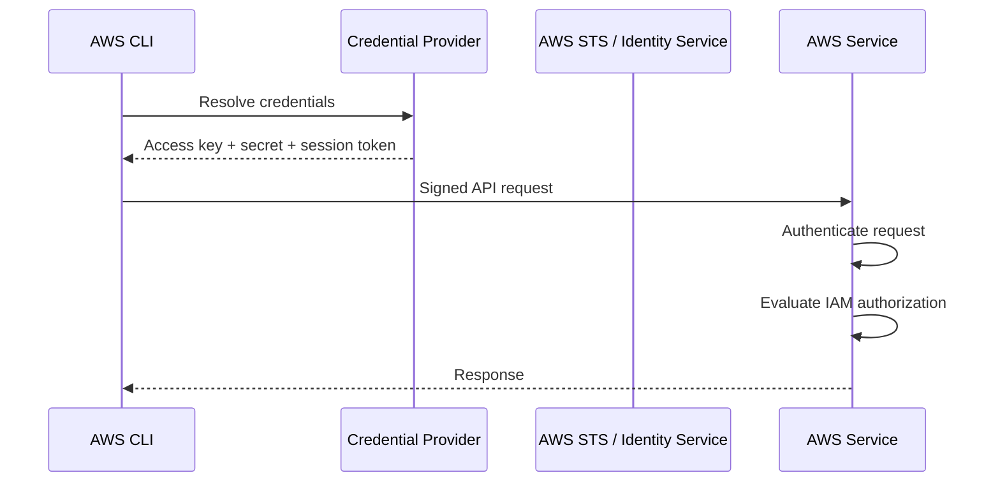
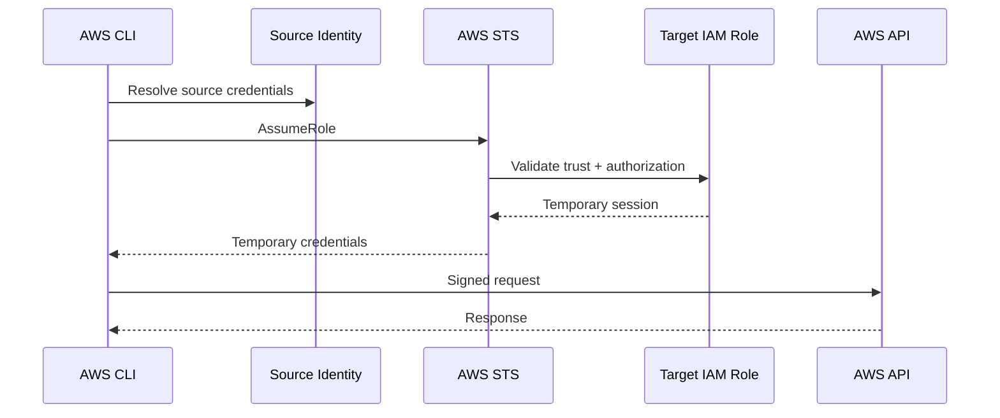

# 02- IAM Authentication

## Overview

AWS CLI authentication determines **which AWS identity is making a request** and how the CLI obtains the credentials required to cryptographically sign that request.

Authentication and authorization are separate:

```text
Authentication
    ↓
Who are you?

Authorization
    ↓
What are you allowed to do?
```

For example:

```text
AWS CLI
    ↓
Temporary credentials
    ↓
IAM role identity
    ↓
AWS API request
    ↓
IAM policy evaluation
    ↓
Allow / Deny
```

The AWS CLI automatically signs requests sent to AWS services. AWS requires incoming API requests to be cryptographically signed, and incorrect local system time can cause signature failures. ([AWS CLI configuration](https://docs.aws.amazon.com/cli/latest/userguide/cli-chap-configure.html))

For modern backend engineering, prefer **short-lived credentials and IAM roles** over long-lived IAM access keys whenever possible.

---

## Authentication vs Authorization

| Concern | Question | AWS mechanism |
|---|---|---|
| Authentication | Who is making the request? | Credentials, Identity Center, IAM role, federation |
| Authorization | What can that identity do? | IAM policies |
| Credential acquisition | How does the CLI obtain credentials? | Profile, SSO, environment, role, metadata |
| Request signing | How is the API request authenticated to AWS? | AWS Signature Version 4 |
| Identity verification | Which identity is active? | `sts get-caller-identity` |

A successful authentication does not imply successful authorization.

For example:

```text
Authentication
    ✅
        ↓
IAM role identified
        ↓
Authorization
    ❌
        ↓
AccessDenied
```

The role may be valid but lack permission for the requested API operation.

---

## How AWS CLI Authentication Works

At a high level:



The credential provider may be:

```text
AWS CLI login
IAM Identity Center
IAM role
Environment variables
Shared credential file
Credential process
ECS task credentials
EC2 instance metadata
Web identity / OIDC
```

The exact provider used depends on the configured credential resolution chain. ([AWS CLI authentication](https://docs.aws.amazon.com/cli/latest/userguide/cli-chap-authentication.html))

---

## Preferred Authentication Strategy

AWS currently recommends short-term credentials for programmatic access. Long-lived IAM-user credentials are not recommended except where there is a specific requirement. ([AWS CLI authentication](https://docs.aws.amazon.com/cli/latest/userguide/cli-chap-authentication.html))

A practical hierarchy is:

```text
Local development
    ↓
aws login
or
IAM Identity Center

Cross-account access
    ↓
AssumeRole

AWS compute
    ↓
Instance / task / workload role

CI/CD
    ↓
OIDC → IAM role

Legacy integration
    ↓
IAM access keys
```

For backend systems:

```text
Human
    → IAM Identity Center / federation

Application
    → IAM role

CI/CD
    → OIDC + IAM role

EC2
    → Instance profile role

ECS
    → Task role

EKS
    → Pod workload identity
```

---

## AWS CLI Credential Sources

The AWS CLI can obtain credentials from multiple providers.

| Source | Typical use | Credential lifetime |
|---|---|---|
| `aws login` | Local development with console credentials | Short-lived |
| IAM Identity Center | Workforce / SSO | Short-lived |
| AssumeRole | Cross-account or elevated session | Temporary |
| Web identity | OIDC workloads | Temporary |
| Environment variables | Automation / CI/CD / local temporary credentials | Depends on source |
| Shared credentials file | Profiles and legacy credentials | Depends on credentials |
| `credential_process` | External credential provider | Depends on provider |
| ECS container credentials | ECS workloads | Temporary |
| EC2 instance metadata | EC2 workloads | Temporary |

AWS documents these as part of the CLI authentication and credential-resolution model. ([AWS CLI configuration and credential precedence](https://docs.aws.amazon.com/cli/latest/userguide/cli-chap-configure.html))

---

## Credential Resolution Precedence

AWS CLI configuration and credentials can be supplied from multiple locations.

The documented precedence order is:

```text
1. Command-line options
2. Environment variables
3. Assume role
4. Assume role with web identity
5. IAM Identity Center
6. Shared credentials file
7. Custom process
8. Configuration file
9. ECS container credentials
10. EC2 instance-profile credentials
```

([AWS CLI configuration and credential precedence](https://docs.aws.amazon.com/cli/latest/userguide/cli-chap-configure.html))

This distinction is critical when debugging unexpected identities.

For example:

```text
~/.aws/credentials
        ↓
Expected profile

AWS_ACCESS_KEY_ID
AWS_SECRET_ACCESS_KEY
        ↓
Environment variables override it

aws command --profile X
        ↓
Explicit profile selection
```

A common production debugging mistake is checking the profile configuration while environment variables are silently providing different credentials.

---

## Inspect the Active Identity

The most important authentication diagnostic command is:

```bash
aws sts get-caller-identity
```

Example:

```json
{
    "UserId": "AROAXXXXXXXXXXXXX:session-name",
    "Account": "123456789012",
    "Arn": "arn:aws:sts::123456789012:assumed-role/BackendDeployRole/session-name"
}
```

It answers:

```text
Which AWS account?
Which IAM user or role?
Which role session?
```

The operation does not require permissions, and AWS documents that an explicit deny on `sts:GetCallerIdentity` does not prevent the identity information from being returned. ([AWS CLI `get-caller-identity`](https://docs.aws.amazon.com/cli/latest/reference/sts/get-caller-identity.html))

Use it before destructive or production-sensitive commands:

```bash
aws sts get-caller-identity --profile production
```

---

## Inspect CLI Configuration

Use:

```bash
aws configure list
```

Example:

```text
      Name                    Value             Type    Location
      ----                    -----             ----    --------
   profile                 <not set>             None    None
access_key     ****************ABCD              env
secret_key     ****************WXYZ              env
    region                ap-south-1      config-file
```

This is useful because it reveals **where** the CLI obtained the configuration.

For a specific profile:

```bash
aws configure list --profile development
```

Also inspect available profiles:

```bash
aws configure list-profiles
```

AWS documents these commands as part of the CLI configuration workflow. ([AWS CLI configuration](https://docs.aws.amazon.com/cli/latest/userguide/cli-configure-files.html))

---

## Local Authentication With `aws login`

For local development, AWS CLI v2 provides:

```bash
aws login
```

This allows you to authenticate using AWS Management Console credentials and receive temporary credentials for CLI and other compatible development tools.

The current AWS documentation identifies `aws login` as the recommended local-development authentication method for console credentials. It requires AWS CLI version **2.32.0 or later**. ([AWS sign-in through the CLI](https://docs.aws.amazon.com/signin/latest/userguide/command-line-sign-in.html))

The normal flow is:

```text
aws login
    ↓
Browser authentication
    ↓
Console identity
    ↓
Temporary credentials
    ↓
AWS CLI
```

For a named profile:

```bash
aws login --profile development
```

For a remote machine without a local browser:

```bash
aws login --remote
```

The CLI caches the temporary credentials locally and refreshes them while the associated refresh token remains valid. ([AWS CLI `login`](https://docs.aws.amazon.com/cli/latest/reference/login/))

---

## Why `aws login` Is Preferable to Hard-Coded Keys

Instead of:

```text
Local machine
    ↓
Permanent IAM access key
```

prefer:

```text
Local machine
    ↓
Browser authentication
    ↓
Temporary credentials
```

Benefits:

```text
No permanent secret in ~/.aws/credentials
Automatic credential refresh
Reduced credential lifetime
Better alignment with workforce identity
```

This is particularly useful for engineers working across:

```text
Development
Staging
Production
Multiple AWS accounts
```

---

## Console Credentials and IAM Identity Center

These are related but distinct authentication paths.

### Console Credentials

```bash
aws login
```

Uses the AWS Management Console sign-in experience and provides short-term credentials.

### IAM Identity Center

```bash
aws configure sso
aws sso login
```

Uses AWS IAM Identity Center permission assignments and produces temporary access to assigned AWS accounts and roles.

Use IAM Identity Center when the organization centrally manages workforce access across multiple AWS accounts.

---

## IAM Identity Center Authentication

Configure a profile:

```bash
aws configure sso
```

The current AWS CLI wizard supports an SSO session configuration containing values such as:

```text
SSO session name
SSO start URL or issuer URL
SSO region
SSO registration scopes
```

The recommended configuration uses an SSO session and supports refreshable authentication. Current AWS CLI v2 uses PKCE by default for the browser-based authorization flow; device authorization can be selected with `--use-device-code`. ([AWS CLI IAM Identity Center configuration](https://docs.aws.amazon.com/cli/latest/userguide/cli-configure-sso.html))

---

## IAM Identity Center Login

After configuring the profile:

```bash
aws sso login --profile development
```

Then verify:

```bash
aws sts get-caller-identity --profile development
```

Use the profile:

```bash
aws s3 ls --profile development
```

or:

```bash
export AWS_PROFILE=development
aws s3 ls
```

On Windows PowerShell:

```powershell
$env:AWS_PROFILE = "development"
aws s3 ls
```

The CLI uses cached Identity Center credentials and refreshes them as appropriate while the session remains valid. ([AWS CLI IAM Identity Center](https://docs.aws.amazon.com/cli/latest/userguide/cli-configure-sso.html))

---

## IAM Identity Center Profile Example

A modern `~/.aws/config` can look like:

```ini
[sso-session company]
sso_start_url = https://company.awsapps.com/start
sso_region = ap-south-1
sso_registration_scopes = sso:account:access

[profile development]
sso_session = company
sso_account_id = 123456789012
sso_role_name = Developer
region = ap-south-1
output = json

[profile production-readonly]
sso_session = company
sso_account_id = 210987654321
sso_role_name = ReadOnly
region = ap-south-1
output = json
```

This gives one workstation access to multiple account/role combinations without embedding long-lived IAM keys.

---

## Sign Out of IAM Identity Center

```bash
aws sso logout
```

This removes cached SSO credentials.

For a local development session, this provides a clear end to the authentication context.

---

## Long-Lived IAM User Credentials

The traditional method is:

```bash
aws configure
```

and entering:

```text
AWS Access Key ID
AWS Secret Access Key
Default region
Output format
```

The credentials are normally stored in:

```text
Linux/macOS:
~/.aws/credentials

Windows:
%UserProfile%\.aws\credentials
```

AWS explicitly categorizes IAM-user long-term credentials as **not recommended** for normal CLI authentication. ([AWS CLI authentication](https://docs.aws.amazon.com/cli/latest/userguide/cli-chap-authentication.html))

Use them only when a specific legacy or technical constraint requires them.

---

## Temporary IAM User Credentials

IAM users can also be represented by temporary credentials.

These credentials include:

```text
Access key ID
Secret access key
Session token
Expiration
```

The CLI must include the session token when using temporary credentials.

Example environment:

```bash
export AWS_ACCESS_KEY_ID="..."
export AWS_SECRET_ACCESS_KEY="..."
export AWS_SESSION_TOKEN="..."
```

Without the session token:

```text
Authentication may fail
```

Temporary credentials are significantly safer than permanent access keys because their validity is time-limited.

---

## IAM Roles

Roles are the preferred authentication mechanism for AWS workloads.

A role does not have permanent access keys.

Instead:

```text
Principal
    ↓
STS AssumeRole
    ↓
Temporary credentials
    ↓
AWS CLI
```

For local role-based profiles:

```ini
[profile production]
role_arn = arn:aws:iam::123456789012:role/ProductionReadOnly
source_profile = development
region = ap-south-1
```

The CLI uses the source credentials to call STS `AssumeRole`, receives temporary credentials, and then uses those credentials for the requested command. ([AWS CLI role configuration](https://docs.aws.amazon.com/cli/latest/userguide/cli-configure-role.html))

---

## Role Authentication Flow



Two different authorization relationships are involved:

```text
Source identity
    must be allowed to call sts:AssumeRole

Target role trust policy
    must trust the source principal
```

Then the permissions on the target role control what the resulting session can do.

---

## Role Profile With `source_profile`

Example:

```ini
[profile developer]
region = ap-south-1

[profile production]
role_arn = arn:aws:iam::123456789012:role/ProductionReadOnly
source_profile = developer
region = ap-south-1
```

Use:

```bash
aws s3 ls --profile production
```

The CLI automatically:

```text
Resolve developer credentials
    ↓
Call STS AssumeRole
    ↓
Cache temporary role credentials
    ↓
Execute command
```

AWS documents that role credentials are cached locally and automatically refreshed after expiration. ([AWS CLI role configuration](https://docs.aws.amazon.com/cli/latest/userguide/cli-configure-role.html))

---

## `credential_source`

For AWS compute environments, you can avoid storing a source profile.

Example:

```ini
[profile deployment]
role_arn = arn:aws:iam::123456789012:role/DeploymentRole
credential_source = Ec2InstanceMetadata
```

Supported values include:

```text
Environment
Ec2InstanceMetadata
EcsContainer
```

This lets a runtime-provided identity become the source identity for a second role assumption. ([AWS CLI role configuration](https://docs.aws.amazon.com/cli/latest/userguide/cli-configure-role.html))

---

## Role Authentication From EC2

Recommended architecture:

```text
EC2 instance
    ↓
Instance profile
    ↓
Temporary credentials
    ↓
AWS CLI / SDK
```

Avoid:

```text
EC2
    ↓
~/.aws/credentials
    ↓
Permanent IAM access key
```

The instance profile supplies temporary credentials through the EC2 Instance Metadata Service.

The AWS CLI can consume those credentials automatically when no higher-precedence credential source is configured. ([AWS CLI configuration](https://docs.aws.amazon.com/cli/latest/userguide/cli-chap-configure.html))

---

## Role Authentication From ECS

For ECS:

```text
ECS Task
    ↓
Task Role
    ↓
Container credential endpoint
    ↓
AWS CLI / SDK
```

The credentials are temporary and associated with the task role.

Do not confuse:

```text
Task role
```

with:

```text
Execution role
```

The task role is normally the identity used by the application container to access AWS APIs. The execution role is used by ECS to perform platform-level operations such as pulling images and retrieving certain resources during task startup.

---

## Role Authentication From EKS

For Kubernetes workloads:

```text
Pod
    ↓
EKS workload identity
    ↓
IAM role
    ↓
Temporary credentials
    ↓
AWS API
```

Common mechanisms include:

```text
EKS Pod Identity
IAM roles for service accounts
OIDC / web identity
```

For web-identity-based role assumption, the AWS CLI can use:

```ini
[profile workload]
role_arn = arn:aws:iam::123456789012:role/OrdersServiceRole
web_identity_token_file = /var/run/secrets/...
```

The CLI uses STS `AssumeRoleWithWebIdentity` to obtain temporary credentials. ([AWS CLI role configuration](https://docs.aws.amazon.com/cli/latest/userguide/cli-configure-role.html))

---

## Web Identity Authentication

Web identity authentication is useful when an external identity provider issues an OIDC token.

The flow is:

```text
OIDC Identity Provider
        ↓
Web Identity Token
        ↓
AWS STS
        ↓
AssumeRoleWithWebIdentity
        ↓
Temporary AWS credentials
        ↓
AWS API
```

Configuration:

```ini
[profile oidc-workload]
role_arn = arn:aws:iam::123456789012:role/GitHubDeploymentRole
web_identity_token_file = /path/to/token
role_session_name = github-deployment
```

Environment-variable equivalents include:

```text
AWS_ROLE_ARN
AWS_WEB_IDENTITY_TOKEN_FILE
AWS_ROLE_SESSION_NAME
```

([AWS CLI role configuration](https://docs.aws.amazon.com/cli/latest/userguide/cli-configure-role.html))

---

## CI/CD Authentication

For modern CI/CD systems:

```text
CI Platform
    ↓
OIDC token
    ↓
AWS STS
    ↓
IAM Role
    ↓
Temporary credentials
    ↓
AWS deployment APIs
```

This is preferable to storing:

```text
AWS_ACCESS_KEY_ID
AWS_SECRET_ACCESS_KEY
```

as long-lived CI secrets.

The IAM role trust policy should constrain:

```text
Repository
Organization
Branch / environment
Subject
Audience
```

where supported by the identity provider.

---

## GitHub Actions Example

A workload-oriented configuration can provide:

```yaml
permissions:
  id-token: write
  contents: read
```

Then the workflow can exchange the OIDC token for an AWS role.

Conceptually:

```text
GitHub Actions
    ↓
OIDC token
    ↓
AssumeRoleWithWebIdentity
    ↓
DeploymentRole
```

This keeps AWS credentials out of GitHub repository secrets.

The role trust policy remains the primary security boundary.

---

## Cross-Account CLI Authentication

Cross-account role access commonly looks like:

```text
Account A
    Developer identity
          |
          | sts:AssumeRole
          v
Account B
    Target role
          |
          v
    Temporary credentials
```

CLI profile:

```ini
[profile prod]
role_arn = arn:aws:iam::210987654321:role/ProductionReadOnly
source_profile = development
region = ap-south-1
```

Run:

```bash
aws sts get-caller-identity --profile prod
```

Expected result:

```text
Account:
    210987654321

ARN:
    arn:aws:sts::210987654321:assumed-role/ProductionReadOnly/...
```

---

## Cross-Account Authentication Requirements

Two authorization checks are commonly involved:

```text
Source identity
    ↓
Allows sts:AssumeRole

Target role trust policy
    ↓
Trusts source principal
```

Both sides must permit the operation.

For example:

```text
Account A
DeveloperRole
    ↓
sts:AssumeRole
    Target: ProductionReadOnly

Account B
ProductionReadOnly
    ↓
Trust:
DeveloperRole / Account A
```

An `AccessDenied` response from `AssumeRole` often indicates a problem in one of these two authorization relationships.

---

## External ID

For third-party cross-account access, an `external_id` can be included in the role profile:

```ini
[profile partner]
role_arn = arn:aws:iam::210987654321:role/PartnerAccess
source_profile = default
external_id = partner-unique-value
```

This is mainly relevant when an external organization assumes roles in your AWS account.

The target trust policy must also require the corresponding external ID.

Do not treat `external_id` as a general-purpose secret replacement. Its primary purpose is to help prevent the confused-deputy problem in third-party access architectures.

---

## MFA-Protected Role Authentication

A role can require MFA in its trust policy.

Example:

```json
{
    "Version": "2012-10-17",
    "Statement": [
        {
            "Sid": "RequireMFA",
            "Effect": "Allow",
            "Principal": {
                "AWS": "arn:aws:iam::123456789012:user/developer"
            },
            "Action": "sts:AssumeRole",
            "Condition": {
                "Bool": {
                    "aws:MultiFactorAuthPresent": "true"
                }
            }
        }
    ]
}
```

CLI profile:

```ini
[profile production-admin]
role_arn = arn:aws:iam::123456789012:role/ProductionAdmin
source_profile = developer
mfa_serial = arn:aws:iam::123456789012:mfa/developer
```

The CLI prompts for an MFA code when it needs to establish the role session. ([AWS CLI role configuration](https://docs.aws.amazon.com/cli/latest/userguide/cli-configure-role.html))

---

## Role Session Names

For privileged environments, use meaningful role session names.

Example:

```ini
[profile production]
role_arn = arn:aws:iam::123456789012:role/ProductionReadOnly
source_profile = developer
role_session_name = backend-engineer
```

The resulting assumed-role identity includes the session name:

```text
arn:aws:sts::123456789012:assumed-role/ProductionReadOnly/backend-engineer
```

AWS documents that the role session name appears in CloudTrail and can improve auditability. ([AWS CLI role configuration](https://docs.aws.amazon.com/cli/latest/userguide/cli-configure-role.html))

Avoid generic values such as:

```text
user
session
test
admin
```

when meaningful attribution is possible.

---

## Shared Credentials File

The standard credentials file is:

```text
Linux/macOS:
~/.aws/credentials

Windows:
%UserProfile%\.aws\credentials
```

Example:

```ini
[development]
aws_access_key_id = AKIA...
aws_secret_access_key = ...
```

For temporary credentials:

```ini
[temporary]
aws_access_key_id = ...
aws_secret_access_key = ...
aws_session_token = ...
```

The `credentials` file primarily stores credential material.

---

## AWS CLI Config File

Configuration normally lives in:

```text
Linux/macOS:
~/.aws/config

Windows:
%UserProfile%\.aws\config
```

Example:

```ini
[profile development]
region = ap-south-1
output = json

[profile production]
region = ap-south-1
role_arn = arn:aws:iam::123456789012:role/ProductionReadOnly
source_profile = development
```

The `credentials` file and `config` file serve different purposes, although the CLI can resolve credentials from both in supported configurations. ([AWS CLI configuration files](https://docs.aws.amazon.com/cli/latest/userguide/cli-configure-files.html))

---

## Named Profiles

Profiles isolate authentication contexts.

Useful examples:

```text
default
development
staging
production-readonly
production-admin
security
```

Use:

```bash
aws sts get-caller-identity --profile development
```

and:

```bash
aws s3 ls --profile production-readonly
```

This is safer than repeatedly replacing environment credentials.

---

## `AWS_PROFILE`

Instead of adding:

```bash
--profile development
```

to every command:

```bash
export AWS_PROFILE=development
```

Then:

```bash
aws sts get-caller-identity
aws s3 ls
aws ec2 describe-instances
```

On PowerShell:

```powershell
$env:AWS_PROFILE = "development"
```

On Windows `cmd.exe`:

```cmd
set AWS_PROFILE=development
```

Be careful: environment variables can override expected configuration and are a common source of "wrong account" incidents.

---

## Environment Variable Authentication

The common environment variables are:

```text
AWS_ACCESS_KEY_ID
AWS_SECRET_ACCESS_KEY
AWS_SESSION_TOKEN
AWS_PROFILE
AWS_REGION
AWS_DEFAULT_REGION
```

For temporary credentials:

```bash
export AWS_ACCESS_KEY_ID="..."
export AWS_SECRET_ACCESS_KEY="..."
export AWS_SESSION_TOKEN="..."
export AWS_REGION="ap-south-1"
```

This pattern is common in:

```text
CI/CD
Containers
Temporary debugging
Build environments
```

Do not put permanent production access keys directly into:

```text
Dockerfiles
Git repositories
Shell scripts
`.env` files committed to source control
CI logs
```

---

## Credential Leakage Through Environment Variables

Environment variables are convenient but still sensitive.

Potential leakage surfaces include:

```text
Process inspection
Debug logs
CI diagnostics
Crash reports
Shell history
Container inspection
Misconfigured observability tooling
```

Use environment variables for temporary credentials where appropriate, not as a reason to make long-lived secrets permanent.

---

## External Credential Processes

The AWS CLI supports:

```text
credential_process
```

This allows an external tool to produce credentials dynamically.

Example:

```ini
[profile external]
credential_process = /usr/local/bin/company-credential-provider
region = ap-south-1
```

The external process returns credentials in the AWS process-credential JSON format.

This is useful for:

```text
Enterprise credential brokers
Vault integrations
Custom SSO tooling
Security credential agents
```

The external process becomes part of your trust boundary, so secure its executable and configuration carefully.

---

## `aws configure export-credentials`

The CLI can expose the currently resolved credentials:

```bash
aws configure export-credentials --profile development
```

Default output uses the `process` format.

Other supported formats include:

```text
process
env
env-no-export
powershell
windows-cmd
fish
```

Example:

```bash
aws configure export-credentials \
    --profile development \
    --format env
```

This is useful when an SDK or tool needs credentials from the CLI's credential-resolution chain. ([AWS CLI `export-credentials`](https://docs.aws.amazon.com/cli/latest/reference/configure/export-credentials.html))

Treat the command output as secret material.

---

## Authentication From Docker

For local development, avoid baking AWS credentials into the image.

Bad:

```dockerfile
ENV AWS_ACCESS_KEY_ID=...
ENV AWS_SECRET_ACCESS_KEY=...
```

Better patterns include:

```text
Host authentication
    ↓
Temporary credentials
    ↓
Container runtime injection
```

or:

```text
Local AWS profile
    ↓
AWS-aware credential forwarding
```

For production containers:

```text
ECS task role
EKS workload identity
```

should generally be preferred.

---

## Authentication From Python

The AWS CLI and AWS SDKs share the broader AWS credential-provider model.

For Python with `boto3`:

```python
import boto3

session = boto3.Session(profile_name="development")

sts = session.client("sts")

identity = sts.get_caller_identity()

print(identity["Arn"])
```

For local development:

```text
AWS CLI profile
    ↓
boto3 credential provider
    ↓
AWS request
```

This reduces differences between:

```text
CLI behavior
SDK behavior
Application behavior
```

provided the applications use compatible credential sources.

---

## Authentication From Django

A Django application running on ECS should normally use:

```text
Django
    ↓
ECS Task Role
    ↓
Temporary credentials
    ↓
Boto3
    ↓
AWS service
```

Avoid:

```python
AWS_ACCESS_KEY_ID = "hard-coded-key"
AWS_SECRET_ACCESS_KEY = "hard-coded-secret"
```

For production workloads, IAM should normally provide identity to the workload rather than application configuration supplying permanent credentials.

---

## Authentication From FastAPI

A FastAPI service can use the ambient workload identity:

```python
import boto3

s3 = boto3.client("s3")
```

The application does not need to explicitly load access keys.

For ECS:

```text
FastAPI
    ↓
boto3
    ↓
ECS task credentials
    ↓
Task role
```

For EKS:

```text
FastAPI
    ↓
boto3
    ↓
Pod workload identity
    ↓
IAM role
```

This reduces credential-management complexity in the application layer.

---

## Authentication for gRPC and Microservices

AWS IAM authentication and application-level authentication are separate concerns.

For example:

```text
Service A
    ↓
gRPC / REST
    ↓
Service B
```

might use:

```text
mTLS / application token
```

for service-to-service application authentication.

If Service B then accesses S3:

```text
Service B
    ↓
IAM workload role
    ↓
S3
```

Do not confuse:

```text
Application authentication
```

with:

```text
AWS API authentication
```

They solve different boundaries.

---

## AWS CLI Authentication and Request Signing

After obtaining credentials, the CLI signs requests.

Conceptually:

```text
Access Key ID
Secret Access Key
Session Token
Request
Timestamp
    ↓
Signature
    ↓
AWS API
```

For temporary credentials:

```text
AccessKeyId
SecretAccessKey
SessionToken
```

are all part of the credential set.

The secret access key is used to calculate the signature; it should never be sent as plaintext in the API request.

---

## Clock Synchronization

AWS request signatures include time-sensitive information.

A significantly incorrect system clock can cause errors such as:

```text
RequestTimeTooSkewed
Signature expired
InvalidSignatureException
```

On developer machines and servers, keep time synchronized using the operating system's normal time synchronization mechanism.

This is particularly important for:

```text
EC2
Docker hosts
CI runners
On-premises build agents
Air-gapped systems
```

AWS explicitly notes that incorrect local time can cause AWS to reject signed requests. ([AWS CLI configuration](https://docs.aws.amazon.com/cli/latest/userguide/cli-chap-configure.html))

---

## Authentication Diagnostics

A reliable troubleshooting sequence is:

```text
1. Check CLI version.

2. Check active profile.

3. Run get-caller-identity.

4. Run configure list.

5. Inspect environment variables.

6. Inspect the selected profile.

7. Check role trust relationship.

8. Check sts:AssumeRole permission.

9. Check temporary credential expiration.

10. Check system time.

11. Check Region / endpoint configuration.

12. Run with --debug when necessary.
```

Start with identity before investigating authorization.

---

## Diagnostic Commands

Check CLI version:

```bash
aws --version
```

Check current identity:

```bash
aws sts get-caller-identity
```

Check profile configuration:

```bash
aws configure list
```

Check a named profile:

```bash
aws configure list --profile production
```

List profiles:

```bash
aws configure list-profiles
```

Check a specific configuration value:

```bash
aws configure get region --profile production
```

Check identity using a specific profile:

```bash
aws sts get-caller-identity --profile production
```

---

## Authentication Failure vs Authorization Failure

### Authentication Failure

Examples:

```text
Unable to locate credentials
ExpiredToken
InvalidClientTokenId
SignatureDoesNotMatch
```

The request cannot be authenticated correctly.

Investigate:

```text
Credential source
Profile
Expiration
Session token
Clock
Credential configuration
```

### Authorization Failure

Example:

```text
AccessDenied
```

The identity is valid, but the operation is not permitted.

Investigate:

```text
Identity policy
Resource policy
SCP
Permissions boundary
Session policy
Trust policy
Condition
Resource
Action
```

This distinction saves significant troubleshooting time.

---

## Wrong Account / Wrong Role Problems

One of the most dangerous CLI mistakes is executing a valid command against the wrong account.

Example:

```text
Expected:
Production account

Actual:
Development account
```

The command itself may succeed.

Always verify:

```bash
aws sts get-caller-identity
```

before:

```text
Production changes
IAM modifications
Infrastructure deletion
Database operations
S3 cleanup
CloudFormation changes
```

A useful shell habit is:

```bash
aws sts get-caller-identity --profile production
```

immediately before high-impact operations.

---

## Wrong Credentials Due to Precedence

Example:

```text
~/.aws/credentials
    production profile
        ↓
Expected role

Environment
    AWS_ACCESS_KEY_ID
    AWS_SECRET_ACCESS_KEY
        ↓
Unexpected IAM user
```

The CLI may use the environment credentials instead of the intended profile credentials.

Diagnostics:

```bash
aws configure list
```

and:

```bash
env | grep '^AWS_'
```

On PowerShell:

```powershell
Get-ChildItem Env:AWS*
```

Remove stale environment variables before testing profile-based authentication.

---

## Role Assumption Failures

Typical error:

```text
AccessDenied when calling the AssumeRole operation
```

Check both:

```text
Source identity
    |
    +-- sts:AssumeRole permission
```

and:

```text
Target role
    |
    +-- Trust policy
```

A valid source credential does not automatically mean the target role can be assumed.

---

## Expired Role Credentials

The CLI automatically caches temporary credentials for configured role profiles and refreshes them when needed. ([AWS CLI role configuration](https://docs.aws.amazon.com/cli/latest/userguide/cli-configure-role.html))

If a cached session becomes invalid or credentials are revoked, clearing the CLI cache can force a fresh role-assumption attempt.

Linux/macOS:

```bash
rm -r ~/.aws/cli/cache
```

Windows:

```cmd
del /s /q %UserProfile%\.aws\cli\cache
```

Use cache deletion as a troubleshooting step, not as a substitute for fixing an incorrect trust or credential configuration.

---

## IAM Identity Center Troubleshooting

Common failures include:

```text
Expired SSO token
Wrong account
Wrong role
Incorrect SSO region
Incorrect start URL / issuer URL
Missing permission set
```

Re-authenticate:

```bash
aws sso login --profile development
```

Verify:

```bash
aws sts get-caller-identity --profile development
```

Inspect:

```bash
aws configure list --profile development
```

The most common operational mistake is assuming that an SSO profile is valid merely because it exists in `~/.aws/config`.

---

## MFA Troubleshooting

If a role requires MFA:

```text
Trust policy
    requires MFA
        ↓
CLI role profile
    must specify mfa_serial
```

Missing configuration can cause:

```text
AccessDenied during AssumeRole
```

Verify:

```ini
mfa_serial = arn:aws:iam::123456789012:mfa/developer
```

and ensure the source identity is actually authenticated with the expected MFA context.

---

## Authentication and Security

Treat every credential source as sensitive.

Do not:

```text
Commit ~/.aws/credentials
Commit access keys
Print credentials in logs
Store credentials in Docker images
Put secrets in source code
Share production profiles
Send session credentials over chat
Paste credentials into tickets
```

Use:

```text
Temporary credentials
IAM roles
IAM Identity Center
OIDC
MFA
Least privilege
```

AWS recommends short-term credentials for CLI authentication and classifies long-term IAM-user credentials as a legacy / non-recommended option for normal use. ([AWS CLI authentication](https://docs.aws.amazon.com/cli/latest/userguide/cli-chap-authentication.html))

---

## Profile Separation Strategy

For a multi-account environment, a useful workstation model is:

```text
~/.aws/config

company SSO session
    |
    +-- development
    +-- staging
    +-- production-readonly
    +-- security-readonly
```

Use highly privileged roles only when required.

Avoid:

```text
default = production-admin
```

A safer default is often:

```text
default = low-risk development
```

or no default profile at all.

---

## Example Multi-Account Layout

```ini
[sso-session company]
sso_start_url = https://company.awsapps.com/start
sso_region = ap-south-1
sso_registration_scopes = sso:account:access

[profile dev]
sso_session = company
sso_account_id = 111111111111
sso_role_name = Developer
region = ap-south-1

[profile staging]
sso_session = company
sso_account_id = 222222222222
sso_role_name = Developer
region = ap-south-1

[profile prod-readonly]
sso_session = company
sso_account_id = 333333333333
sso_role_name = ReadOnly
region = ap-south-1
```

Then:

```bash
aws sso login --profile dev
aws sts get-caller-identity --profile dev

aws sts get-caller-identity --profile staging
aws sts get-caller-identity --profile prod-readonly
```

This reduces the need to manage separate long-lived access keys for every account.

---

## Authentication for CI/CD

Preferred:

```text
CI/CD
    ↓
OIDC
    ↓
AWS STS
    ↓
IAM role
    ↓
Temporary credentials
```

Avoid:

```text
CI/CD
    ↓
Permanent IAM access key
```

especially for:

```text
GitHub Actions
GitLab CI
Jenkins
Buildkite
Other hosted CI platforms
```

When OIDC is unavailable, use the platform's approved secret-management mechanism with the shortest possible credential lifetime and scope.

---

## Authentication for AWS-Native Compute

Prefer ambient workload credentials:

| Platform | Preferred identity source |
|---|---|
| EC2 | Instance profile |
| ECS | Task role |
| Lambda | Execution role |
| EKS | Pod workload identity |
| CloudShell | AWS-provided environment credentials |
| CI/CD | OIDC + IAM role |

The common pattern is:

```text
Workload
    ↓
AWS-managed credential provider
    ↓
Temporary credentials
    ↓
AWS API
```

This removes application-level secret distribution.

---

## Disaster Recovery Considerations

IAM authentication configuration should be reproducible.

Store:

```text
Profile definitions
IaC for roles
Trust policies
Permission sets
OIDC trust policies
SCPs
MFA procedures
Emergency-access procedures
```

Do not treat:

```text
~/.aws/credentials
```

as part of an enterprise backup strategy.

Credential material should be reissued rather than backed up indiscriminately.

---

## Authentication and High Availability

Authentication should not become a hidden application single point of failure.

For workloads:

```text
Application
    ↓
IAM workload role
    ↓
AWS credential provider
```

AWS-managed temporary credential providers handle credential acquisition without requiring your application to operate an authentication server.

For CI/CD and human workflows:

```text
Identity Center / OIDC / federation
```

should be treated as foundational platform dependencies and monitored accordingly.

---

## Operational Best Practices

```text
Use aws sts get-caller-identity regularly.

Use named profiles for account separation.

Prefer IAM Identity Center for workforce access.

Prefer roles for AWS workloads.

Prefer OIDC for CI/CD.

Avoid long-lived IAM user access keys.

Do not store credentials in application code.

Review AWS_PROFILE and AWS_* environment variables during troubleshooting.

Use meaningful role session names for privileged access.

Require MFA for appropriate privileged role assumptions.

Use ExternalId for appropriate third-party cross-account roles.

Keep system clocks synchronized.

Treat CLI credential caches as sensitive.

Use --profile explicitly for high-risk production commands.
```

---

## Common Mistakes

| Mistake | Why it happens | Better approach |
|---|---|---|
| Using permanent access keys locally | Familiar `aws configure` workflow | Use `aws login` or IAM Identity Center |
| Assuming `AccessDenied` means authentication failed | Both problems look similar | Verify identity with `get-caller-identity` |
| Forgetting `AWS_SESSION_TOKEN` | Temporary credentials have three values | Export all temporary credential components |
| Using the wrong profile | Multiple accounts are configured | Verify profile + caller identity |
| Ignoring environment variables | Profile looks correct | Run `aws configure list` and inspect `AWS_*` variables |
| Hard-coding credentials in Docker | Quick local setup | Use runtime identity |
| Giving CI long-lived keys | Easy initial configuration | Use OIDC + role assumption |
| Treating IAM Identity Center as static credentials | SSO profile appears in config | Run `aws sso login` and use temporary sessions |
| Assuming role trust alone grants access | Trust policy looks permissive | Verify source `sts:AssumeRole` permission too |
| Using unrestricted production profiles | Convenience | Separate read-only and admin profiles |
| Ignoring clock skew | Authentication seems correctly configured | Synchronize system time |
| Sharing production credentials | Teams need common access | Use named identities and assumed roles |

---

## Authentication Design for a Backend Team

A production-oriented team can standardize on:

```text
Human developer
    ↓
IAM Identity Center
    ↓
Developer permission set
    ↓
Named AWS CLI profile

CI/CD
    ↓
OIDC
    ↓
Deployment IAM role

ECS
    ↓
Task role

EKS
    ↓
Pod workload identity

Lambda
    ↓
Execution role

EC2
    ↓
Instance profile
```

This gives each actor a distinct authentication path.

The authorization model then operates on top of those identities.

---

## Authentication Decision Matrix

| Scenario | Preferred method | Avoid |
|---|---|---|
| Local developer | `aws login` / IAM Identity Center | Permanent access keys |
| Multi-account developer access | IAM Identity Center | Separate IAM users per account |
| Cross-account administration | AssumeRole | Shared account credentials |
| GitHub Actions | OIDC + role | Repository-stored AWS keys |
| ECS application | Task role | Access keys in container |
| EC2 application | Instance profile | Keys in filesystem |
| EKS application | Pod workload identity | Cluster-wide static keys |
| Legacy third-party integration | Scoped temporary / role-based approach where supported | Broad permanent IAM user |
| Emergency legacy integration | Dedicated tightly scoped key | General-purpose admin key |

---

## Senior-Level Mental Model

Think about AWS CLI authentication as:

```text
Credential Source
        ↓
Identity
        ↓
Optional Role Assumption
        ↓
Temporary Session
        ↓
Request Signing
        ↓
IAM Authorization
        ↓
AWS API
```

Each layer can fail independently.

For example:

```text
Credential Source
    ✅

Identity
    ✅

AssumeRole
    ✅

Request Signing
    ✅

Authorization
    ❌
```

This means:

```text
Authentication succeeded.
Authorization failed.
```

That distinction should become automatic when troubleshooting AWS CLI issues.

---

## Reference Commands

| Task | Command |
|---|---|
| Check AWS CLI version | `aws --version` |
| Identify current principal | `aws sts get-caller-identity` |
| Identify profile principal | `aws sts get-caller-identity --profile dev` |
| Inspect credential resolution | `aws configure list` |
| List profiles | `aws configure list-profiles` |
| Configure legacy profile | `aws configure --profile dev` |
| Configure IAM Identity Center | `aws configure sso` |
| Login with Identity Center | `aws sso login --profile dev` |
| Logout of Identity Center | `aws sso logout` |
| Local console login | `aws login` |
| Remote console login | `aws login --remote` |
| Export resolved credentials | `aws configure export-credentials --profile dev` |
| Assume a role directly | `aws sts assume-role ...` |
| Clear cached role sessions | Remove `~/.aws/cli/cache` |
| Run command with profile | `aws <service> <command> --profile dev` |

---

## AWS CLI Authentication References

- [AWS CLI Authentication and Access Credentials](https://docs.aws.amazon.com/cli/latest/userguide/cli-chap-authentication.html)
- [AWS CLI Configuration and Credential Precedence](https://docs.aws.amazon.com/cli/latest/userguide/cli-chap-configure.html)
- [AWS CLI Configuration and Credential Files](https://docs.aws.amazon.com/cli/latest/userguide/cli-configure-files.html)
- [AWS CLI Environment Variables](https://docs.aws.amazon.com/cli/latest/userguide/cli-configure-envvars.html)
- [AWS CLI `aws login`](https://docs.aws.amazon.com/cli/latest/reference/login/)
- [AWS Sign-In Through the AWS CLI](https://docs.aws.amazon.com/signin/latest/userguide/command-line-sign-in.html)
- [IAM Identity Center Authentication with the AWS CLI](https://docs.aws.amazon.com/cli/latest/userguide/cli-configure-sso.html)
- [Using IAM Roles in the AWS CLI](https://docs.aws.amazon.com/cli/latest/userguide/cli-configure-role.html)
- [AWS CLI `get-caller-identity`](https://docs.aws.amazon.com/cli/latest/reference/sts/get-caller-identity.html)
- [AWS CLI `configure`](https://docs.aws.amazon.com/cli/latest/reference/configure/)
- [AWS CLI `export-credentials`](https://docs.aws.amazon.com/cli/latest/reference/configure/export-credentials.html)
- [AWS STS CLI Reference](https://docs.aws.amazon.com/cli/latest/reference/sts/)
- [AWS IAM Security Best Practices](https://docs.aws.amazon.com/IAM/latest/UserGuide/best-practices.html)

## Key Takeaways

- **Authentication identifies the AWS principal; authorization determines what that principal can do:** always separate credential-resolution problems from IAM policy problems during troubleshooting.
- **Prefer short-lived credentials:** use `aws login`, IAM Identity Center, IAM roles, workload identity, and OIDC rather than long-lived IAM-user access keys whenever possible.
- **Know the credential-resolution chain:** command-line and environment configuration can override profiles, so `aws configure list` and `aws sts get-caller-identity` should be standard diagnostics.
- **Use roles for privilege boundaries:** local role profiles, cross-account roles, ECS/EC2/EKS workload roles, and CI/CD OIDC all provide temporary credentials without distributing permanent secrets.
- **Treat AWS CLI authentication as part of production security architecture:** profile separation, MFA, session names, CloudTrail auditability, clock synchronization, and credential hygiene matter as much as the CLI commands themselves.