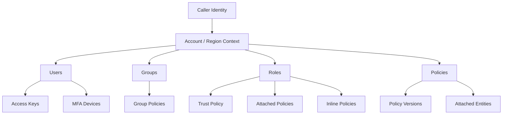

# 07- Resource Inspection and Global Options

## Overview

AWS IAM administration through the CLI depends on two complementary skills:

```text
Resource Inspection
    ↓
Understand the current IAM state

Global CLI Options
    ↓
Control how each AWS CLI command executes
```

Resource inspection answers questions such as:

```text
Which roles exist?

What trust policy does this role use?

Which policies are attached?

Which users belong to a group?

Which principals use a managed policy?

What is the default version of a policy?

Which MFA devices exist?

Which access keys exist?

Which AWS account and Region am I operating against?
```

Global options control behaviors such as:

```text
Profile selection
Region selection
Output format
JMESPath filtering
Pagination
Debug logging
Endpoint selection
SSL verification
Timeouts
Paging
Error formatting
```

AWS CLI global options can override corresponding configuration, environment-variable, or profile settings for a single command. They cannot directly provide credentials, although `--profile` can select a credential source. ([AWS CLI command line options](https://docs.aws.amazon.com/cli/latest/userguide/cli-configure-options.html))

For IAM operations, these capabilities should be treated as part of the same workflow:

```text
Identify context
    ↓
Inspect resource
    ↓
Filter relevant attributes
    ↓
Validate identity / account / Region
    ↓
Perform administrative operation
```

---

## Why Resource Inspection Matters

IAM resources are highly interconnected.

A role can reference:

```text
Trust policy
Permission policies
Permissions boundary
Tags
Role last-used information
```

A managed policy can be attached to:

```text
Users
Groups
Roles
```

A group can indirectly affect:

```text
Users
    ↓
Group
    ↓
Attached policies
    ↓
Effective permissions
```

Therefore, a single command rarely provides the complete authorization picture.

A production troubleshooting workflow should move from:

```text
Resource
    ↓
Related policies
    ↓
Policy contents
    ↓
Trust relationships
    ↓
Effective authorization
```

---

## Core Inspection Model



The CLI is most effective when inspection follows these relationships instead of treating IAM resources as isolated objects.

---

## Confirm the Active AWS Context

Before inspecting or modifying IAM resources, establish:

```text
Which credentials?
Which AWS account?
Which profile?
Which Region?
```

The first command should usually be:

```bash
aws sts get-caller-identity
```

For a named profile:

```bash
aws sts get-caller-identity --profile production
```

The response identifies:

```json
{
    "UserId": "AROAXXXXXXXXXXXXX:session",
    "Account": "123456789012",
    "Arn": "arn:aws:sts::123456789012:assumed-role/ProductionReadOnly/session"
}
```

`sts:GetCallerIdentity` is specifically intended for determining the identity making the request and does not require IAM permissions for the operation. ([AWS CLI `get-caller-identity`](https://docs.aws.amazon.com/cli/latest/reference/sts/get-caller-identity.html))

---

## Confirm CLI Configuration

Use:

```bash
aws configure list
```

This shows the source from which the CLI resolved important configuration values.

Example:

```text
      Name                    Value             Type    Location
      ----                    -----             ----    --------
   profile              production             env     AWS_PROFILE
access_key     ****************ABCD              env
secret_key     ****************WXYZ              env
    region                ap-south-1      config-file
```

For a specific profile:

```bash
aws configure list --profile production
```

This is particularly useful when a command appears to be using the "wrong" credentials.

AWS documents `aws configure list` as the way to inspect configuration values and their sources. ([AWS CLI `configure list`](https://docs.aws.amazon.com/cli/latest/reference/configure/list.html))

---

## List Available Profiles

```bash
aws configure list-profiles
```

This is useful on developer workstations with multiple accounts:

```text
default
development
staging
production-readonly
security
```

Use a named profile explicitly for sensitive operations:

```bash
aws iam list-roles --profile production-readonly
```

AWS documents `list-profiles` as the command for displaying configured CLI profiles. ([AWS CLI `list-profiles`](https://docs.aws.amazon.com/cli/latest/reference/configure/list-profiles.html))

---

## IAM User Inspection

List users:

```bash
aws iam list-users
```

The operation is paginated.

Useful filtered output:

```bash
aws iam list-users \
    --query 'Users[].{UserName:UserName,Arn:Arn,Created:CreateDate}' \
    --output table
```

For a single user:

```bash
aws iam get-user --user-name application-admin
```

A user record can include:

```text
Path
UserName
UserId
Arn
CreateDate
PasswordLastUsed
PermissionsBoundary
Tags
```

The exact attributes returned depend on the API operation. For detailed user configuration, use the appropriate dedicated IAM commands rather than assuming a list operation includes every attribute.

---

## User Access Keys

List access keys for a user:

```bash
aws iam list-access-keys \
    --user-name deployment-user
```

Filter useful fields:

```bash
aws iam list-access-keys \
    --user-name deployment-user \
    --query 'AccessKeyMetadata[].{Id:AccessKeyId,Status:Status,Created:CreateDate}' \
    --output table
```

This is useful for:

```text
Credential inventory
Rotation reviews
Incident response
Legacy-access cleanup
```

Do not expose secret access keys in CLI output or logs. The IAM API returns secret material only at creation time and the CLI should not be used as a general secret-discovery mechanism.

---

## MFA Device Inspection

List virtual MFA devices associated with a user:

```bash
aws iam list-virtual-mfa-devices
```

For a specific user:

```bash
aws iam list-mfa-devices \
    --user-name production-admin
```

Useful query:

```bash
aws iam list-mfa-devices \
    --user-name production-admin \
    --query 'MFADevices[].{Serial:SerialNumber,Enabled:EnableDate}' \
    --output table
```

For modern workforce identity, IAM Identity Center and federated access may be more appropriate than individual IAM-user MFA management.

---

## Group Inspection

List groups:

```bash
aws iam list-groups
```

Inspect a specific group:

```bash
aws iam get-group \
    --group-name PlatformDevelopers
```

`get-group` can return both group information and the users associated with that group.

A useful workflow is:

```text
Group
    ↓
Members
    ↓
Attached managed policies
    ↓
Inline policies
```

This is important because a user can obtain permissions indirectly through group membership.

---

## Group Policy Inspection

List managed policies attached to a group:

```bash
aws iam list-attached-group-policies \
    --group-name PlatformDevelopers
```

List inline policies:

```bash
aws iam list-group-policies \
    --group-name PlatformDevelopers
```

Retrieve an inline policy:

```bash
aws iam get-group-policy \
    --group-name PlatformDevelopers \
    --policy-name PlatformReadAccess
```

The distinction is important:

```text
Managed policy
    Reusable IAM policy object

Inline policy
    Embedded directly into the group
```

---

## Role Inspection

List roles:

```bash
aws iam list-roles
```

The operation is paginated and can return a large number of roles. AWS notes that `list-roles` does not include every role attribute, including permissions boundaries, tags, and role-last-used information; use `get-role` for the complete role object. ([AWS CLI `list-roles`](https://docs.aws.amazon.com/cli/latest/reference/iam/list-roles.html))

Filter roles:

```bash
aws iam list-roles \
    --query 'Roles[].{Name:RoleName,Arn:Arn,Created:CreateDate}' \
    --output table
```

---

## Inspect a Specific Role

```bash
aws iam get-role \
    --role-name OrdersServiceRole
```

Useful query:

```bash
aws iam get-role \
    --role-name OrdersServiceRole \
    --query 'Role.{Name:RoleName,Arn:Arn,Trust:AssumeRolePolicyDocument,Boundary:PermissionsBoundary,LastUsed:RoleLastUsed}'
```

A role inspection should normally include:

```text
Trust policy
Permissions boundary
Role last-used information
Tags where relevant
Attached managed policies
Inline policies
```

---

## Inspect Role Trust Policy

The trust policy determines who or what can assume the role.

```bash
aws iam get-role \
    --role-name OrdersServiceRole \
    --query 'Role.AssumeRolePolicyDocument'
```

Typical trust relationships include:

```text
AWS account / role
AWS service principal
Federated identity provider
OIDC identity
```

For cross-account roles, trust-policy inspection is essential.

The permission policy answers:

```text
What can the role do?
```

The trust policy answers:

```text
Who can become the role?
```

---

## List Role Policies

Managed policies attached to a role:

```bash
aws iam list-attached-role-policies \
    --role-name OrdersServiceRole
```

Inline policies:

```bash
aws iam list-role-policies \
    --role-name OrdersServiceRole
```

Retrieve an inline policy:

```bash
aws iam get-role-policy \
    --role-name OrdersServiceRole \
    --policy-name OrdersRuntimePolicy
```

This creates the inspection chain:

```text
Role
    ↓
Managed policies
+
Inline policies
+
Trust policy
+
Boundary
```

---

## Managed Policy Inspection

First identify the policy ARN:

```bash
aws iam list-attached-role-policies \
    --role-name OrdersServiceRole
```

Then inspect metadata:

```bash
aws iam get-policy \
    --policy-arn arn:aws:iam::123456789012:policy/OrdersRuntimePolicy
```

This can identify:

```text
PolicyName
PolicyId
Arn
Path
DefaultVersionId
AttachmentCount
CreateDate
UpdateDate
Tags
```

The metadata does not contain the full JSON policy document.

---

## Retrieve a Policy Version

IAM managed policies use versioned policy documents.

First identify the default version:

```bash
aws iam get-policy \
    --policy-arn arn:aws:iam::123456789012:policy/OrdersRuntimePolicy \
    --query 'Policy.DefaultVersionId'
```

Then retrieve it:

```bash
aws iam get-policy-version \
    --policy-arn arn:aws:iam::123456789012:policy/OrdersRuntimePolicy \
    --version-id v4
```

A useful compact query is:

```bash
aws iam get-policy-version \
    --policy-arn arn:aws:iam::123456789012:policy/OrdersRuntimePolicy \
    --version-id v4 \
    --query 'PolicyVersion.Document'
```

---

## Inspect Policy Versions

List versions:

```bash
aws iam list-policy-versions \
    --policy-arn arn:aws:iam::123456789012:policy/OrdersRuntimePolicy
```

Useful output:

```bash
aws iam list-policy-versions \
    --policy-arn arn:aws:iam::123456789012:policy/OrdersRuntimePolicy \
    --query 'Versions[].{Id:VersionId,Default:IsDefaultVersion,Created:CreateDate}' \
    --output table
```

This is useful when investigating:

```text
Unexpected permission changes
Privilege escalation
Policy rollback
Stale policy versions
Change history
```

---

## Find Which Identities Use a Managed Policy

Use:

```bash
aws iam list-entities-for-policy \
    --policy-arn arn:aws:iam::123456789012:policy/OrdersRuntimePolicy
```

This answers:

```text
Which users?
Which groups?
Which roles?
```

depend on a managed policy.

This is especially important before changing a shared customer-managed policy.

A single policy change can affect multiple identities.

---

## Inspect Account-Level IAM Information

The IAM account summary can provide aggregate information about the account.

```bash
aws iam get-account-summary
```

Filter useful fields:

```bash
aws iam get-account-summary \
    --query 'SummaryMap'
```

For specific values:

```bash
aws iam get-account-summary \
    --query 'SummaryMap.{Users:Users,Groups:Groups,Roles:Roles,Policies:Policies,AccessKeys:AccessKeys}'
```

Account summaries are useful for:

```text
Inventory
Capacity awareness
Security reviews
Operational reporting
```

---

## Deep IAM Inspection

For broad IAM inventory, AWS provides:

```bash
aws iam get-account-authorization-details
```

This can retrieve authorization details for:

```text
Users
Groups
Roles
Policies
```

It is useful when you need a consolidated representation of IAM authorization state.

However, large accounts can produce a significant amount of data.

Prefer targeted APIs when:

```text
You need one role
You need one policy
You need one user
```

Use authorization-details retrieval when:

```text
You need broader inventory
You are exporting IAM state
You are performing security analysis
```

---

## Paths and Resource Organization

IAM resources can use paths.

Example:

```text
/engineering/
/engineering/application/
/security/
/security/break-glass/
/service/
/service/orders/
```

For roles:

```bash
aws iam list-roles \
    --path-prefix /service/orders/
```

For users:

```bash
aws iam list-users \
    --path-prefix /engineering/
```

Paths are useful for organizational filtering and automation.

They are not security boundaries by themselves.

---

## Querying Nested Resource Data

AWS CLI uses **JMESPath** through `--query`.

Example:

```bash
aws iam list-roles \
    --query 'Roles[].RoleName'
```

Nested fields:

```bash
aws iam list-roles \
    --query 'Roles[].{Name:RoleName,Arn:Arn}'
```

Filtering:

```bash
aws iam list-roles \
    --query 'Roles[?contains(RoleName, `prod`)].{Name:RoleName,Arn:Arn}'
```

Sorting:

```bash
aws iam list-roles \
    --query 'sort_by(Roles, &RoleName)[].RoleName'
```

JMESPath allows the CLI to perform significant client-side filtering without requiring additional shell utilities. The AWS CLI documents `--query` as a JMESPath expression applied to command output. ([AWS CLI command line options](https://docs.aws.amazon.com/cli/latest/userguide/cli-configure-options.html))

---

## Output Formats

The main output formats are:

```text
json
text
table
yaml
yaml-stream
off
```

Use:

```bash
aws iam list-roles --output json
```

or:

```bash
aws iam list-roles --output table
```

The current AWS CLI also supports `yaml`, `yaml-stream`, and `off` as output formats. ([AWS CLI global options](https://docs.aws.amazon.com/cli/latest/userguide/cli-configure-options.html))

---

## Choosing an Output Format

| Format | Best use |
|---|---|
| `json` | Automation, APIs, debugging, archival |
| `text` | Shell pipelines and compact values |
| `table` | Human inspection |
| `yaml` | Human-readable structured output |
| `yaml-stream` | Streaming structured output |
| `off` | Suppress normal output |

For automation, prefer:

```text
--output json
+
--query
```

For interactive investigation:

```text
--output table
```

For scripts:

```text
Avoid parsing table output.
```

---

## JSON for Automation

Example:

```bash
aws iam list-roles \
    --query 'Roles[].{Name:RoleName,Arn:Arn}' \
    --output json
```

Result:

```json
[
    {
        "Name": "OrdersServiceRole",
        "Arn": "arn:aws:iam::123456789012:role/OrdersServiceRole"
    },
    {
        "Name": "PaymentsServiceRole",
        "Arn": "arn:aws:iam::123456789012:role/PaymentsServiceRole"
    }
]
```

JSON is predictable and suitable for:

```text
Python
jq
CI/CD
Security tooling
Data pipelines
Automation
```

---

## Text for Shell Pipelines

Example:

```bash
aws iam list-roles \
    --query 'Roles[].RoleName' \
    --output text
```

Possible result:

```text
OrdersServiceRole PaymentsServiceRole ReportingRole
```

For line-oriented shell processing, additional formatting may be needed depending on the structure.

Do not assume `text` output has the same structure as JSON.

---

## Table for Human Inspection

Example:

```bash
aws iam list-roles \
    --query 'Roles[].{Name:RoleName,Created:CreateDate}' \
    --output table
```

Example output:

```text
---------------------------------------------
|                 ListRoles                 |
+----------------------+--------------------+
| Name                 | Created            |
+----------------------+--------------------+
| OrdersServiceRole    | 2026-08-20T...     |
| PaymentsServiceRole  | 2026-08-21T...     |
+----------------------+--------------------+
```

Tables are excellent for interactive investigation but poor as machine-readable interfaces.

---

## Pagination

Many IAM list operations are paginated.

Examples include:

```text
list-users
list-groups
list-roles
list-policies
list-access-keys
list-entities-for-policy
```

The AWS CLI automatically follows pagination by default. The `--no-paginate` option disables this behavior and causes the CLI to make only one API call for the first page. ([AWS CLI global options](https://docs.aws.amazon.com/cli/latest/userguide/cli-configure-options.html))

Normal behavior:

```text
CLI
    ↓
API request page 1
    ↓
API request page 2
    ↓
API request page 3
    ↓
...
    ↓
Combined CLI output
```

---

## When to Use `--no-paginate`

Use:

```bash
aws iam list-roles --no-paginate
```

when you intentionally need:

```text
Only the first API page
Debugging
Understanding API pagination
Testing
Reducing request count for a quick inspection
```

Do not use it when your intent is:

```text
"Show me every role."
```

because you may silently receive only the first page.

---

## Pagination and Automation

For operational scripts:

```text
Default pagination
    ↓
Usually safest for complete inventories
```

For large accounts, understand:

```text
API request count
Execution time
Throttling risk
Data volume
```

A full IAM inventory can generate multiple API requests.

Avoid repeatedly running:

```bash
aws iam list-roles
```

from high-frequency automation when a cached inventory or event-driven approach would be more appropriate.

---

## `--query` and Pagination

One subtle area is the interaction between:

```text
--query
+
--output text
+
paginated API operations
```

AWS documents service-specific restrictions for paginated responses. For example, `iam list-roles` with `--output text` requires the `--query` expression to extract from the top-level `Roles` result structure. ([AWS CLI `list-roles`](https://docs.aws.amazon.com/cli/latest/reference/iam/list-roles.html))

Safe pattern:

```bash
aws iam list-roles \
    --query 'Roles[].RoleName' \
    --output text
```

Avoid writing a query against an invented root structure such as:

```text
Items[]
```

when the API actually returns:

```text
Roles[]
```

---

## `--max-items`, `--page-size`, and `--starting-token`

For paginated commands, the AWS CLI can expose client-side pagination controls such as:

```text
--max-items
--page-size
--starting-token
```

Example:

```bash
aws iam list-roles \
    --max-items 25
```

`--page-size` controls the number of items requested per service API call, while `--max-items` controls the number of items returned by the CLI operation.

For continuation:

```bash
aws iam list-roles \
    --starting-token <token>
```

These options are useful for:

```text
Large inventories
Controlled API request sizes
Incremental processing
Automation
```

Do not persist or manually modify pagination tokens; treat them as opaque values returned by the CLI.

---

## `--profile`

Select a named AWS CLI profile:

```bash
aws iam list-roles \
    --profile production-readonly
```

This is one of the most important global options for multi-account environments.

Use explicit profiles for:

```text
Production
Security
Shared services
Cross-account administration
```

A command-line option has higher precedence than the corresponding profile/environment configuration for that invocation. ([AWS CLI command line options](https://docs.aws.amazon.com/cli/latest/userguide/cli-configure-options.html))

---

## `--region`

Specify the AWS Region for the command:

```bash
aws ec2 describe-instances \
    --region ap-south-1
```

Example with IAM:

```bash
aws iam list-roles \
    --region ap-south-1
```

IAM APIs are globally scoped in important respects, but AWS CLI commands still expose the global `--region` option because the endpoint and service interaction model are standardized across AWS services.

Do not infer that every IAM object is regional just because `--region` exists.

AWS documents `--region` as overriding configuration/environment settings for that command. ([AWS CLI command line options](https://docs.aws.amazon.com/cli/latest/userguide/cli-configure-options.html))

---

## `--output`

Override the configured output format for one command:

```bash
aws iam list-roles \
    --output json
```

Or:

```bash
aws iam list-roles \
    --output table
```

This is useful when a profile is configured for one default format but a specific command needs another.

---

## `--query`

Use `--query` to reduce large responses:

```bash
aws iam list-roles \
    --query 'Roles[].RoleName'
```

Combine with output:

```bash
aws iam list-roles \
    --query 'Roles[].RoleName' \
    --output text
```

This is especially useful in shell workflows and automation because only relevant fields are emitted.

---

## `--no-cli-pager`

AWS CLI can send output through a pager depending on configuration.

Disable it for scripts and CI:

```bash
aws iam list-roles --no-cli-pager
```

A common CI pattern is:

```bash
aws iam list-roles \
    --no-cli-pager \
    --output json
```

This avoids interactive pager behavior in non-interactive environments.

AWS documents `--no-cli-pager` as the global switch for disabling the output pager for a single command. ([AWS CLI global options](https://docs.aws.amazon.com/cli/latest/userguide/cli-configure-options.html))

---

## `--debug`

Enable detailed AWS CLI diagnostics:

```bash
aws iam get-role \
    --role-name OrdersServiceRole \
    --debug
```

Debug output can reveal information about:

```text
Credential resolution
Endpoint selection
Request construction
Signing
Retries
HTTP connections
Responses
```

This is valuable for troubleshooting:

```text
Credential errors
Signature failures
Endpoint problems
TLS issues
Unexpected retries
Request failures
```

Be careful with logs containing debug output. Avoid sending raw debug output to shared systems without reviewing it for sensitive information.

AWS documents `--debug` as the global option for enabling debug logging. ([AWS CLI command reference](https://docs.aws.amazon.com/cli/latest/reference/))

---

## `--endpoint-url`

Override the service endpoint:

```bash
aws iam list-roles \
    --endpoint-url https://example.internal
```

This is useful for:

```text
Testing
AWS-compatible local services
Private environments
Custom integrations
```

For normal production AWS operations, do not override endpoints unless the architecture explicitly requires it.

Endpoint configuration has its own precedence rules. ([AWS CLI command line options](https://docs.aws.amazon.com/cli/latest/userguide/cli-configure-options.html))

---

## `--no-sign-request`

Disable request signing:

```bash
aws s3api get-object \
    --bucket public-bucket \
    --key public.txt \
    --no-sign-request
```

AWS documents that this option prevents request signing and credentials are not loaded when it is provided. ([AWS CLI command reference](https://docs.aws.amazon.com/cli/latest/reference/))

For IAM administration, this is normally not useful because IAM operations generally require authenticated authorization.

Use it only for APIs/resources that explicitly support anonymous access.

---

## `--no-verify-ssl`

The option:

```bash
--no-verify-ssl
```

disables SSL certificate verification for the command.

This should almost never be used in production.

If an enterprise environment requires a custom CA, prefer:

```bash
--ca-bundle /path/to/company-ca.pem
```

or the corresponding profile/configuration setting.

AWS explicitly documents `--ca-bundle` as the preferred mechanism for specifying a custom certificate authority bundle. ([AWS CLI global options](https://docs.aws.amazon.com/cli/latest/userguide/cli-configure-options.html))

---

## `--ca-bundle`

Example:

```bash
aws iam list-roles \
    --ca-bundle /etc/pki/company-ca-bundle.pem
```

This is useful when outbound TLS inspection or an enterprise proxy requires a trusted internal CA.

Do not solve certificate problems by permanently disabling verification.

Preferred pattern:

```text
Corporate CA
    ↓
Trusted CA bundle
    ↓
AWS CLI certificate verification
```

---

## Connection and Read Timeouts

The AWS CLI exposes:

```text
--cli-connect-timeout
--cli-read-timeout
```

Current AWS CLI documentation lists a default of **60 seconds** for both the connection and read timeout settings. Setting either to `0` disables that timeout and allows a blocking operation. ([AWS CLI command reference](https://docs.aws.amazon.com/cli/latest/reference/))

Example:

```bash
aws iam list-roles \
    --cli-connect-timeout 10 \
    --cli-read-timeout 30
```

These are useful when diagnosing:

```text
Slow network connections
Proxy issues
Hung requests
CI runner networking
```

Do not set unlimited timeouts casually in automation because stalled commands can occupy workers indefinitely.

---

## `--cli-error-format`

The CLI supports error output formats such as:

```text
legacy
json
yaml
text
table
enhanced
```

Example:

```bash
aws iam get-role \
    --role-name MissingRole \
    --cli-error-format json
```

Structured error output can be useful for automation.

For scripts, prefer machine-readable formats over parsing human-oriented error text.

---

## `--cli-binary-format`

AWS CLI version 2 defaults binary input handling to:

```text
base64
```

The alternate format is:

```text
raw-in-base64-out
```

For binary values:

```text
fileb://
```

always treats file contents as raw binary.

This option matters more for services that accept binary request payloads than for normal IAM inspection.

Example:

```bash
aws lambda invoke \
    --function-name orders-worker \
    --payload fileb://event.json \
    response.json
```

AWS documents `base64` as the default CLI v2 binary format and `fileb://` as the raw-binary file mechanism. ([AWS CLI configuration files](https://docs.aws.amazon.com/cli/latest/userguide/cli-configure-files.html))

---

## `--cli-auto-prompt`

AWS CLI v2 can provide interactive command prompting:

```bash
aws iam get-role --cli-auto-prompt
```

This is useful when:

```text
You do not remember parameter names
You are exploring a new service
You want interactive command assistance
```

It is generally not appropriate for:

```text
CI/CD
Automation
Shell scripts
Non-interactive production workflows
```

For one command:

```bash
aws iam get-role \
    --role-name OrdersServiceRole \
    --no-cli-auto-prompt
```

AWS documents `--cli-auto-prompt` and `--no-cli-auto-prompt` as per-command global options. ([AWS CLI global options](https://docs.aws.amazon.com/cli/latest/userguide/cli-configure-options.html))

---

## `--version`

Check the installed CLI version:

```bash
aws --version
```

The AWS CLI also exposes version information through its command interface.

Always capture the CLI version when reproducing an automation or authentication issue.

Version differences can affect:

```text
Credential providers
SSO behavior
Output behavior
Global options
Feature availability
```

---

## Global Options vs Profile Configuration

The same setting can often exist at multiple levels.

For example:

```text
Profile:
    region = ap-south-1

Environment:
    AWS_DEFAULT_REGION=us-east-1

Command:
    --region eu-west-1
```

The command-line option wins for that invocation.

Conceptually:

```text
Command option
      ↓
Environment
      ↓
Profile / config
      ↓
Default
```

AWS documents command-line options as overrides for corresponding profile and environment settings. ([AWS CLI command line options](https://docs.aws.amazon.com/cli/latest/userguide/cli-configure-options.html))

---

## Global Options for Production Commands

For production operations, a useful explicit command pattern is:

```bash
aws iam get-role \
    --role-name ProductionApplicationRole \
    --profile production-readonly \
    --region ap-south-1 \
    --output json \
    --no-cli-pager
```

This makes important execution context visible:

```text
Role
Profile
Region
Output
Pager behavior
```

For destructive or high-impact operations, explicit context reduces operator error.

---

## A Practical Inspection Pattern

A useful IAM inspection sequence is:

```text
1. Confirm identity
2. Confirm profile / account
3. Inspect target resource
4. Inspect related policies
5. Inspect trust relationships
6. Filter relevant fields
7. Compare against intended architecture
```

Example:

```bash
aws sts get-caller-identity \
    --profile production-readonly

aws iam get-role \
    --role-name OrdersServiceRole \
    --profile production-readonly \
    --query 'Role.{Name:RoleName,Arn:Arn,Trust:AssumeRolePolicyDocument,Boundary:PermissionsBoundary,LastUsed:RoleLastUsed}' \
    --output json

aws iam list-attached-role-policies \
    --role-name OrdersServiceRole \
    --profile production-readonly \
    --output table

aws iam list-role-policies \
    --role-name OrdersServiceRole \
    --profile production-readonly \
    --output table
```

This is more reliable than issuing a single broad command and trying to infer the complete IAM state from it.

---

## Inspect a Role's Complete Permission Surface

For a production role:

```text
Role
    |
    +-- Trust Policy
    |
    +-- Permissions Boundary
    |
    +-- Attached Managed Policies
    |      |
    |      +-- Default Policy Version
    |
    +-- Inline Policies
    |
    +-- Tags
    |
    +-- Last Used
```

A practical command sequence:

```bash
aws iam get-role \
    --role-name OrdersServiceRole

aws iam list-attached-role-policies \
    --role-name OrdersServiceRole

aws iam list-role-policies \
    --role-name OrdersServiceRole
```

Then inspect every relevant managed policy:

```bash
aws iam get-policy \
    --policy-arn arn:aws:iam::123456789012:policy/OrdersRuntimePolicy

aws iam get-policy-version \
    --policy-arn arn:aws:iam::123456789012:policy/OrdersRuntimePolicy \
    --version-id v3
```

---

## Filtering for Security-Relevant Fields

For roles:

```bash
aws iam list-roles \
    --query 'Roles[].{Name:RoleName,Arn:Arn,Path:Path}' \
    --output table
```

For policies:

```bash
aws iam list-policies \
    --scope Local \
    --query 'Policies[].{Name:PolicyName,Arn:Arn,Default:DefaultVersionId,Attachments:AttachmentCount}' \
    --output table
```

For users:

```bash
aws iam list-users \
    --query 'Users[].{Name:UserName,Arn:Arn,Created:CreateDate}' \
    --output table
```

The goal is to reduce large responses to the attributes relevant to the question.

---

## Client-Side vs Service-Side Filtering

This distinction matters for scale.

### Service-Side Filtering

Some IAM API operations support parameters such as:

```text
Path prefix
Policy scope
Role name
User name
```

Example:

```bash
aws iam list-roles \
    --path-prefix /service/
```

This reduces the amount of data requested from the service.

### Client-Side Filtering

`--query` runs against the returned CLI data:

```bash
aws iam list-roles \
    --query 'Roles[?contains(RoleName, `service`)].RoleName'
```

This does not necessarily reduce the service-side data retrieval.

For large inventories:

```text
Use API parameters to reduce the candidate set
    +
Use --query to shape the returned data
```

---

## Resource Inspection in CI/CD

Resource inspection is useful in deployment pipelines.

Examples:

```text
Before deployment
    ↓
Verify target IAM role exists

During deployment
    ↓
Verify expected policy attachment

After deployment
    ↓
Verify resulting trust / role configuration
```

A deployment pipeline might validate:

```bash
aws iam get-role \
    --role-name OrdersServiceRole \
    --profile deployment \
    --query 'Role.Arn' \
    --output text
```

Then:

```text
Expected role exists
    ↓
Continue deployment
```

or:

```text
Unexpected role configuration
    ↓
Fail deployment
```

Do not build production CI/CD checks around table-formatted output.

---

## Python Automation

For repeatable resource inspection, use JSON output or the AWS SDK rather than parsing human-oriented tables.

Example shell-to-Python pattern:

```bash
aws iam list-roles \
    --query 'Roles[].{Name:RoleName,Arn:Arn}' \
    --output json
```

Python:

```python
import json
import subprocess


command = [
    "aws",
    "iam",
    "list-roles",
    "--query",
    "Roles[].{Name:RoleName,Arn:Arn}",
    "--output",
    "json",
]

result = subprocess.run(
    command,
    check=True,
    capture_output=True,
    text=True,
)

roles = json.loads(result.stdout)

for role in roles:
    print(role["Name"], role["Arn"])
```

For long-lived production tooling, prefer `boto3` instead of shelling out to the CLI repeatedly.

---

## Resource Inspection With Boto3

Example:

```python
import boto3

iam = boto3.client("iam")

paginator = iam.get_paginator("list_roles")

for page in paginator.paginate():
    for role in page["Roles"]:
        print(role["RoleName"], role["Arn"])
```

This provides direct SDK pagination and avoids:

```text
Shell quoting
CLI process startup
Output parsing
CLI-specific formatting
```

The CLI remains excellent for:

```text
Manual operations
Diagnostics
One-off automation
Shell workflows
Infrastructure operations
```

---

## Performance Considerations

IAM inspection is normally control-plane work, not a latency-sensitive application operation.

Still, large-scale automation can create unnecessary load.

Avoid:

```text
Every CI job
    ↓
List every IAM resource
    ↓
Retrieve every policy version
    ↓
Repeat for every deployment
```

Prefer:

```text
Targeted inspection
    +
Caching where appropriate
    +
Event-driven change tracking
    +
Periodic full inventory
```

For account-wide audits, design around API pagination and service throttling limits.

---

## Throttling Considerations

Repeated IAM API calls can encounter throttling.

A script that performs:

```text
1000 roles
×
3 API calls each
```

can create thousands of requests.

Improve the design by:

```text
Filtering early
Caching immutable metadata
Limiting concurrency
Using exponential backoff
Avoiding redundant calls
```

Do not aggressively parallelize IAM API calls simply because the operations are independent.

---

## Debugging Request Failures

Use:

```bash
aws iam get-role \
    --role-name OrdersServiceRole \
    --debug
```

Inspect:

```text
Credential resolution
Selected profile
Endpoint
Region
Request signing
HTTP response
Retry behavior
```

If the problem is authentication-related, first run:

```bash
aws sts get-caller-identity
```

If identity is correct, inspect authorization and request parameters next.

---

## Security Considerations

Resource inspection itself can expose sensitive infrastructure metadata.

Output can contain:

```text
Account IDs
Role names
Policy ARNs
Trust relationships
Resource names
Tags
Authorization structure
```

Treat inspection output as security-sensitive operational data.

Avoid:

```bash
aws iam get-account-authorization-details > public-artifact.json
```

or sending complete IAM dumps to:

```text
Public repositories
Shared chat channels
Unrestricted CI artifacts
External ticket systems
```

Use least privilege for the identity performing inspection.

---

## Avoid `--no-verify-ssl`

Never use:

```bash
--no-verify-ssl
```

as a normal workaround for TLS problems.

Bad workflow:

```text
Certificate error
    ↓
Disable SSL verification
    ↓
Command succeeds
```

Preferred workflow:

```text
Certificate error
    ↓
Identify proxy / CA requirement
    ↓
Install / specify trusted CA bundle
    ↓
Verify TLS normally
```

Use:

```bash
--ca-bundle /path/to/ca.pem
```

when an approved enterprise CA is required. ([AWS CLI global options](https://docs.aws.amazon.com/cli/latest/userguide/cli-configure-options.html))

---

## Avoid `--debug` in Sensitive Logs

Debug output is useful locally but can produce verbose protocol and authentication information.

Safer pattern:

```text
Run debug
    ↓
Capture locally
    ↓
Inspect
    ↓
Redact
    ↓
Share only required diagnostics
```

Do not automatically upload full debug output from production runners to external systems.

---

## Global Options Reference

| Option | Purpose | Typical IAM use |
|---|---|---|
| `--profile` | Select credential/configuration profile | Account separation |
| `--region` | Override Region | Explicit execution context |
| `--output` | Set output format | Automation / inspection |
| `--query` | JMESPath filtering | Extract IAM attributes |
| `--no-paginate` | Disable automatic pagination | First-page/debug scenarios |
| `--debug` | Enable diagnostic logging | Authentication/API troubleshooting |
| `--no-cli-pager` | Disable pager | CI/CD and scripts |
| `--endpoint-url` | Override service endpoint | Testing/custom endpoints |
| `--ca-bundle` | Specify trusted CA bundle | Enterprise TLS |
| `--no-verify-ssl` | Disable TLS verification | Generally avoid |
| `--no-sign-request` | Send unsigned request | Anonymous-access use cases |
| `--cli-connect-timeout` | Set connection timeout | Network troubleshooting |
| `--cli-read-timeout` | Set read timeout | Network troubleshooting |
| `--cli-error-format` | Format errors | Structured automation |
| `--cli-binary-format` | Control binary input encoding | Binary service APIs |
| `--cli-auto-prompt` | Interactive parameter prompting | CLI exploration |
| `--no-cli-auto-prompt` | Disable prompt | Automation |
| `--version` | Show CLI version | Reproducibility / diagnostics |

AWS maintains the current global-option set in the CLI documentation because options and behavior can evolve across versions. ([AWS CLI global options](https://docs.aws.amazon.com/cli/latest/userguide/cli-configure-options.html))

---

## Resource Inspection Reference

| Resource | Primary commands |
|---|---|
| Identity | `sts get-caller-identity` |
| Users | `iam list-users`, `iam get-user` |
| Access keys | `iam list-access-keys`, `iam get-access-key-last-used` |
| MFA | `iam list-mfa-devices`, `iam list-virtual-mfa-devices` |
| Groups | `iam list-groups`, `iam get-group` |
| Group policies | `iam list-attached-group-policies`, `iam list-group-policies`, `iam get-group-policy` |
| Roles | `iam list-roles`, `iam get-role` |
| Role policies | `iam list-attached-role-policies`, `iam list-role-policies`, `iam get-role-policy` |
| Policies | `iam list-policies`, `iam get-policy` |
| Policy versions | `iam list-policy-versions`, `iam get-policy-version` |
| Policy attachments | `iam list-entities-for-policy` |
| Account summary | `iam get-account-summary` |
| Full IAM authorization inventory | `iam get-account-authorization-details` |

---

## Production Inspection Workflow

For a production IAM investigation:

```text
Confirm identity
    ↓
aws sts get-caller-identity

Confirm CLI source
    ↓
aws configure list

Identify target resource
    ↓
get-role / get-user / get-policy

Inspect trust / membership
    ↓
trust policy / group membership

Inspect permissions
    ↓
attached + inline policies

Inspect policy versions
    ↓
default policy version

Filter output
    ↓
--query + structured output

Validate complete result
    ↓
authorization reasoning
```

This workflow minimizes the risk of making decisions from incomplete information.

---

## Common Mistakes

| Mistake | Why it happens | Better approach |
|---|---|---|
| Inspecting `list-roles` as if it were complete role metadata | List APIs return subsets of attributes | Use `get-role` for detailed inspection |
| Using `--no-paginate` for inventories | Faster output appears convenient | Use it only when first-page behavior is intentional |
| Parsing table output in scripts | Table is easy to read | Use JSON or text with deterministic `--query` |
| Forgetting `--profile` | Default identity seems correct | Explicitly select the intended account/profile |
| Trusting the configured profile without checking identity | Environment variables can override expectations | Run `get-caller-identity` |
| Using `--query` without understanding response structure | JMESPath paths look generic | Inspect raw JSON first |
| Fetching every policy in large accounts | Broad inspection seems comprehensive | Filter candidates before deep inspection |
| Disabling SSL verification | TLS errors are inconvenient | Use `--ca-bundle` |
| Leaving debug enabled in automation | Debugging was added temporarily | Remove `--debug` after investigation |
| Treating Region as an IAM scope | Every CLI command has `--region` | Understand whether the IAM resource is global or Region-specific |
| Assuming successful authentication means access is allowed | Authentication and authorization are separate | Check IAM policy evaluation after identity verification |
| Repeatedly polling IAM state | CLI makes one-off inspection easy | Use event-driven or periodic inventory strategies at scale |

---

## Interview-Focused Scenarios

### "How do you confirm which AWS identity the CLI is using?"

```bash
aws sts get-caller-identity
```

This is generally more reliable than inspecting:

```text
~/.aws/credentials
```

because it verifies the identity actually used by AWS.

### "How would you inspect a role completely?"

Start with:

```bash
aws iam get-role --role-name OrdersServiceRole
```

Then inspect:

```bash
aws iam list-attached-role-policies \
    --role-name OrdersServiceRole

aws iam list-role-policies \
    --role-name OrdersServiceRole
```

Then retrieve each relevant policy document.

### "How do you safely inspect production IAM?"

Use:

```text
Read-only identity
+
Explicit --profile
+
Explicit --region where relevant
+
--output json/table
+
--query
+
No destructive actions
```

### "Why can `list-roles` and `get-role` return different information?"

Because list operations are optimized for inventory and return subsets of resource attributes, while `get-role` returns detailed information. ([AWS CLI `list-roles`](https://docs.aws.amazon.com/cli/latest/reference/iam/list-roles.html))

### "What does `--no-paginate` actually do?"

It disables the CLI's automatic pagination and limits the operation to the first API page. ([AWS CLI global options](https://docs.aws.amazon.com/cli/latest/userguide/cli-configure-options.html))

---

## Recommended Command Pattern

For manual production inspection:

```bash
aws iam get-role \
    --role-name OrdersServiceRole \
    --profile production-readonly \
    --region ap-south-1 \
    --output json \
    --no-cli-pager
```

For compact human output:

```bash
aws iam list-roles \
    --profile production-readonly \
    --query 'Roles[].{Name:RoleName,Arn:Arn}' \
    --output table \
    --no-cli-pager
```

For automation:

```bash
aws iam list-roles \
    --profile production-readonly \
    --query 'Roles[].{Name:RoleName,Arn:Arn}' \
    --output json \
    --no-cli-pager
```

The repeated pattern is intentional:

```text
Explicit identity
+
Controlled output
+
Relevant filtering
+
Non-interactive execution
```

---

## AWS Documentation Links

- [AWS CLI Command Line Options](https://docs.aws.amazon.com/cli/latest/userguide/cli-configure-options.html)
- [AWS CLI Command Reference](https://docs.aws.amazon.com/cli/latest/reference/)
- [AWS CLI Configuration and Credential Files](https://docs.aws.amazon.com/cli/latest/userguide/cli-configure-files.html)
- [AWS CLI `configure list`](https://docs.aws.amazon.com/cli/latest/reference/configure/list.html)
- [AWS CLI `list-profiles`](https://docs.aws.amazon.com/cli/latest/reference/configure/list-profiles.html)
- [AWS CLI `get-caller-identity`](https://docs.aws.amazon.com/cli/latest/reference/sts/get-caller-identity.html)
- [AWS CLI IAM Reference](https://docs.aws.amazon.com/cli/latest/reference/iam/)
- [AWS CLI `list-users`](https://docs.aws.amazon.com/cli/latest/reference/iam/list-users.html)
- [AWS CLI `get-user`](https://docs.aws.amazon.com/cli/latest/reference/iam/get-user.html)
- [AWS CLI `list-groups`](https://docs.aws.amazon.com/cli/latest/reference/iam/list-groups.html)
- [AWS CLI `get-group`](https://docs.aws.amazon.com/cli/latest/reference/iam/get-group.html)
- [AWS CLI `list-roles`](https://docs.aws.amazon.com/cli/latest/reference/iam/list-roles.html)
- [AWS CLI `get-role`](https://docs.aws.amazon.com/cli/latest/reference/iam/get-role.html)
- [AWS CLI `list-policies`](https://docs.aws.amazon.com/cli/latest/reference/iam/list-policies.html)
- [AWS CLI `get-policy`](https://docs.aws.amazon.com/cli/latest/reference/iam/get-policy.html)
- [AWS CLI `get-policy-version`](https://docs.aws.amazon.com/cli/latest/reference/iam/get-policy-version.html)
- [AWS CLI `list-policy-versions`](https://docs.aws.amazon.com/cli/latest/reference/iam/list-policy-versions.html)
- [AWS CLI `list-entities-for-policy`](https://docs.aws.amazon.com/cli/latest/reference/iam/list-entities-for-policy.html)

## Key Takeaways

- **Always establish execution context before IAM inspection:** verify the active identity with `aws sts get-caller-identity`, inspect configuration with `aws configure list`, and use explicit profiles for sensitive environments.
- **IAM inspection is relational:** a role must be analyzed together with its trust policy, managed policies, inline policies, permissions boundary, and related resource relationships.
- **Use pagination and filtering deliberately:** keep automatic pagination for complete inventories, use `--query` for precise JMESPath filtering, and prefer JSON for automation over human-oriented table output.
- **Global options control execution semantics:** `--profile`, `--region`, `--output`, `--query`, `--debug`, timeout controls, pager controls, endpoint controls, and TLS options can materially change CLI behavior for a single command.
- **Production CLI usage should be explicit and auditable:** use read-only identities for inspection, avoid disabling TLS verification, minimize debug exposure, and treat IAM inspection data as security-sensitive operational information.