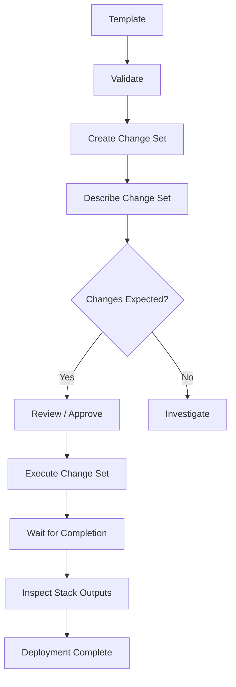

# 01- CloudFormation CLI Introduction

## Overview

AWS CloudFormation can be managed through the AWS Command Line Interface (AWS CLI), providing a scriptable interface for creating, updating, inspecting, and deleting CloudFormation stacks and related resources.

The AWS CLI is particularly useful for backend engineers because infrastructure operations can be integrated into:

- CI/CD pipelines.
- Deployment scripts.
- Local development workflows.
- Operational runbooks.
- Automation.
- Incident response.
- Infrastructure testing.

CloudFormation itself defines infrastructure declaratively through templates. The CLI provides the operational interface used to submit and inspect those templates.

```text
CloudFormation Template
        |
        v
    AWS CLI
        |
        v
CloudFormation API
        |
        v
CloudFormation Stack
        |
        v
AWS Resources
```

The CloudFormation CLI command namespace is:

```bash
aws cloudformation
```

AWS provides a dedicated CloudFormation command reference containing the available commands and their options. :contentReference[oaicite:0]{index=0}

## AWS CLI vs CloudFormation CLI

There are two similarly named concepts that should not be confused.

| Term | Purpose |
|---|---|
| AWS CLI | General command-line interface for AWS services |
| `aws cloudformation ...` | AWS CLI commands for operating CloudFormation |
| CloudFormation CLI (`cfn`) | Developer tool for building, testing, and registering CloudFormation extensions |

This section focuses on **CloudFormation operations through the AWS CLI** using commands such as:

```bash
aws cloudformation create-stack
aws cloudformation update-stack
aws cloudformation delete-stack
aws cloudformation describe-stacks
```

The CloudFormation CLI (`cfn`) is a separate developer tool used for developing CloudFormation resource providers and extensions. :contentReference[oaicite:1]{index=1}

## Prerequisites

Before using CloudFormation commands, the AWS CLI should be installed and configured with credentials that have the required permissions.

Verify the installation:

```bash
aws --version
```

Verify the active AWS identity:

```bash
aws sts get-caller-identity
```

Example output:

```json
{
    "UserId": "AIDAXXXXXXXXXXXXXXXX",
    "Account": "123456789012",
    "Arn": "arn:aws:iam::123456789012:user/developer"
}
```

For production CI/CD, avoid using long-lived IAM user credentials where possible. Prefer short-lived credentials obtained through an identity federation mechanism such as OIDC.

## AWS CLI Configuration

A local development environment commonly uses a named AWS CLI profile.

```bash
aws configure --profile development
```

You can then specify the profile explicitly:

```bash
aws cloudformation describe-stacks \
  --profile development \
  --region ap-south-1
```

Alternatively, select a profile through the environment:

```bash
export AWS_PROFILE=development
export AWS_REGION=ap-south-1
```

On PowerShell:

```powershell
$env:AWS_PROFILE="development"
$env:AWS_REGION="ap-south-1"
```

For production automation, credentials should normally be provided by the CI/CD environment rather than stored in shell configuration files.

## CloudFormation Command Structure

The basic syntax is:

```bash
aws cloudformation <command> [options]
```

For example:

```bash
aws cloudformation describe-stacks \
  --stack-name production-api \
  --region ap-south-1
```

The command is composed of:

```text
aws
 |
 +-- cloudformation
       |
       +-- describe-stacks
             |
             +-- --stack-name
             +-- --region
```

The `cloudformation` namespace contains commands for stack operations, change sets, StackSets, resource inspection, and other CloudFormation functionality. :contentReference[oaicite:2]{index=2}

## Core Command Categories

| Category | Common Commands |
|---|---|
| Create | `create-stack` |
| Update | `update-stack` |
| Delete | `delete-stack` |
| Inspect | `describe-stacks`, `describe-stack-events` |
| Resources | `list-stack-resources`, `describe-stack-resource` |
| Templates | `get-template`, `validate-template` |
| Change Sets | `create-change-set`, `describe-change-set`, `execute-change-set` |
| Stack Listing | `list-stacks` |
| Recovery | `continue-update-rollback`, `cancel-update-stack` |
| StackSets | `create-stack-set`, `create-stack-instances`, `update-stack-set` |
| Deployment | `deploy` |

AWS maintains the complete command list in the CloudFormation AWS CLI reference. :contentReference[oaicite:3]{index=3}

## Creating a Stack

The fundamental CloudFormation deployment command is:

```bash
aws cloudformation create-stack \
  --stack-name production-api \
  --template-body file://template.yaml \
  --region ap-south-1
```

The command submits the template to CloudFormation.

A successful API request starts the stack operation; it does not mean that every resource has finished provisioning. Stack progress must be monitored separately. :contentReference[oaicite:4]{index=4}

The basic lifecycle is:

```text
AWS CLI
   |
   | create-stack
   v
CloudFormation
   |
   | Validate / provision
   v
Resources
   |
   v
Stack Status
```

## Template Input

A template can be supplied directly from a local file:

```bash
aws cloudformation create-stack \
  --stack-name production-api \
  --template-body file://template.yaml
```

For larger templates, a template URL can be used:

```bash
aws cloudformation create-stack \
  --stack-name production-api \
  --template-url https://example-bucket.s3.amazonaws.com/templates/api.yaml
```

The current AWS CLI reference documents `--template-body` and `--template-url` as alternative ways to specify the template. :contentReference[oaicite:5]{index=5}

## Passing Parameters

CloudFormation template parameters can be supplied through the CLI.

Example template:

```yaml
Parameters:
  Environment:
    Type: String

  InstanceType:
    Type: String
    Default: t3.micro
```

Deployment:

```bash
aws cloudformation create-stack \
  --stack-name production-api \
  --template-body file://template.yaml \
  --parameters \
    ParameterKey=Environment,ParameterValue=production \
    ParameterKey=InstanceType,ParameterValue=t3.small
```

For automation, keep parameter values explicit and reproducible rather than relying on undocumented local defaults.

## Using Parameter Files

For more complex deployments, parameters can be represented as structured JSON.

Example:

```json
[
  {
    "ParameterKey": "Environment",
    "ParameterValue": "production"
  },
  {
    "ParameterKey": "InstanceType",
    "ParameterValue": "t3.small"
  }
]
```

The file can then be passed to the CLI:

```bash
aws cloudformation create-stack \
  --stack-name production-api \
  --template-body file://template.yaml \
  --parameters file://parameters.json
```

This approach is useful when parameter sets are maintained alongside deployment configuration.

Do not commit secrets into parameter files merely because they are stored in JSON. Sensitive values should use an appropriate secret-management mechanism.

## Tags

Stacks can be tagged during creation.

```bash
aws cloudformation create-stack \
  --stack-name production-api \
  --template-body file://template.yaml \
  --tags \
    Key=Environment,Value=production \
    Key=Application,Value=backend-api \
    Key=Owner,Value=platform
```

Useful tags can support:

- Cost allocation.
- Ownership.
- Environment identification.
- Operations.
- Governance.
- Incident response.

## IAM Capabilities

If a CloudFormation template creates IAM resources, the deployment may require explicit acknowledgement through `--capabilities`.

For IAM resources:

```bash
aws cloudformation create-stack \
  --stack-name production-api \
  --template-body file://template.yaml \
  --capabilities CAPABILITY_IAM
```

For named IAM resources:

```bash
aws cloudformation create-stack \
  --stack-name production-api \
  --template-body file://template.yaml \
  --capabilities CAPABILITY_NAMED_IAM
```

These capabilities are security-sensitive because CloudFormation templates can create or modify permissions in the AWS account. :contentReference[oaicite:6]{index=6}

Do not add `CAPABILITY_NAMED_IAM` blindly. Review the IAM resources in the template first.

## Stack Creation with Production Controls

A production-oriented create operation may include:

```bash
aws cloudformation create-stack \
  --stack-name production-api \
  --template-body file://template.yaml \
  --parameters file://production-parameters.json \
  --capabilities CAPABILITY_IAM \
  --tags \
    Key=Environment,Value=production \
    Key=Application,Value=backend-api \
  --enable-termination-protection \
  --region ap-south-1
```

The exact options should depend on the stack's architecture and operational requirements.

## Updating a Stack

Use `update-stack` to update an existing stack.

```bash
aws cloudformation update-stack \
  --stack-name production-api \
  --template-body file://template.yaml \
  --region ap-south-1
```

You can also update parameter values:

```bash
aws cloudformation update-stack \
  --stack-name production-api \
  --template-body file://template.yaml \
  --parameters \
    ParameterKey=Environment,ParameterValue=production \
    ParameterKey=InstanceType,ParameterValue=t3.small
```

The update operation starts the stack update after the API call succeeds. The operation must then be monitored. :contentReference[oaicite:7]{index=7}

## Reusing the Existing Template

An update can reuse the template currently associated with the stack:

```bash
aws cloudformation update-stack \
  --stack-name production-api \
  --use-previous-template \
  --parameters \
    ParameterKey=InstanceType,ParameterValue=t3.small
```

This is useful when only stack configuration such as parameter values needs to change.

## Inspecting Stacks

Use `describe-stacks` to inspect stack information:

```bash
aws cloudformation describe-stacks \
  --stack-name production-api \
  --region ap-south-1
```

This can return information such as:

- Stack ID.
- Stack name.
- Stack status.
- Parameters.
- Outputs.
- Tags.
- Creation time.
- Update time.
- Capabilities.
- Termination protection.

`describe-stacks` is paginated when multiple stacks are returned. Supplying a stack name is preferable to requesting every stack when only one stack is required. :contentReference[oaicite:8]{index=8}

## Using JMESPath Queries

The AWS CLI supports `--query` for extracting specific fields.

For example:

```bash
aws cloudformation describe-stacks \
  --stack-name production-api \
  --query 'Stacks[0].StackStatus'
```

Example result:

```text
UPDATE_COMPLETE
```

Retrieve the stack outputs:

```bash
aws cloudformation describe-stacks \
  --stack-name production-api \
  --query 'Stacks[0].Outputs'
```

Retrieve a specific output:

```bash
aws cloudformation describe-stacks \
  --stack-name production-api \
  --query "Stacks[0].Outputs[?OutputKey=='ApiEndpoint'].OutputValue" \
  --output text
```

This is particularly useful in shell scripts and CI/CD pipelines.

## Output Formats

The AWS CLI supports multiple output formats.

JSON:

```bash
aws cloudformation describe-stacks \
  --stack-name production-api \
  --output json
```

Table:

```bash
aws cloudformation describe-stacks \
  --stack-name production-api \
  --output table
```

Text:

```bash
aws cloudformation describe-stacks \
  --stack-name production-api \
  --output text
```

For automation, JSON or targeted text output is generally easier to consume programmatically.

## Listing Stacks

Use:

```bash
aws cloudformation list-stacks \
  --region ap-south-1
```

Filter by stack status:

```bash
aws cloudformation list-stacks \
  --stack-status-filter CREATE_COMPLETE UPDATE_COMPLETE
```

This is useful for operational inventory and troubleshooting.

## Monitoring Stack Events

After creating or updating a stack, inspect events:

```bash
aws cloudformation describe-stack-events \
  --stack-name production-api \
  --region ap-south-1
```

A typical workflow is:

```text
create-stack
     |
     v
describe-stack-events
     |
     +--> Resource A
     +--> Resource B
     +--> Resource C
     |
     v
Stack Status
```

CloudFormation events are particularly important when a deployment fails because they identify which resource failed and often provide a status reason.

AWS documents `describe-stack-events` as one of the standard CLI operations for monitoring stack progress. :contentReference[oaicite:9]{index=9}

## Waiting for Stack Completion

For scripts and CI/CD, avoid assuming that a successful `create-stack` API call means deployment completion.

Use a waiter:

```bash
aws cloudformation wait stack-create-complete \
  --stack-name production-api \
  --region ap-south-1
```

For updates:

```bash
aws cloudformation wait stack-update-complete \
  --stack-name production-api \
  --region ap-south-1
```

The operational sequence becomes:

```text
create-stack
     |
     v
wait stack-create-complete
     |
     +---- success ----> Continue
     |
     +---- failure ----> Investigate events
```

This distinction is important in CI/CD automation.

## Validating Templates

The AWS CLI provides:

```bash
aws cloudformation validate-template \
  --template-body file://template.yaml
```

This is useful for validating the template structure before deployment.

However, template validation is not equivalent to proving that a deployment will succeed.

Deployment can still fail because of:

- IAM permissions.
- Service quotas.
- Resource conflicts.
- Invalid resource configuration.
- Existing infrastructure.
- Account or Region constraints.
- Runtime service conditions.

Modern CloudFormation also performs pre-deployment validation during create and update operations, with additional validation behavior available through change sets. :contentReference[oaicite:10]{index=10}

## Change Sets

For production updates, change sets provide a safer workflow.

Create a change set:

```bash
aws cloudformation create-change-set \
  --stack-name production-api \
  --change-set-name production-api-update \
  --change-set-type UPDATE \
  --template-body file://template.yaml
```

Inspect it:

```bash
aws cloudformation describe-change-set \
  --stack-name production-api \
  --change-set-name production-api-update
```

Then execute it:

```bash
aws cloudformation execute-change-set \
  --stack-name production-api \
  --change-set-name production-api-update
```

Change sets allow you to review the proposed resource changes before execution. :contentReference[oaicite:11]{index=11}

## Production Deployment Flow

A robust CLI-based deployment can follow:



This is generally preferable to directly modifying critical production infrastructure without first reviewing the proposed changes.

## Deleting a Stack

Delete a stack with:

```bash
aws cloudformation delete-stack \
  --stack-name production-api \
  --region ap-south-1
```

The API request starts the deletion operation.

Monitor it:

```bash
aws cloudformation wait stack-delete-complete \
  --stack-name production-api \
  --region ap-south-1
```

For production stacks, deletion should be tightly controlled.

Consider:

- Termination protection.
- `DeletionPolicy`.
- `Retain`.
- Database deletion protection.
- IAM authorization.
- CI/CD approval requirements.

## Getting the Template of an Existing Stack

Use:

```bash
aws cloudformation get-template \
  --stack-name production-api
```

This is useful when investigating an existing stack or recovering the template associated with a deployed stack.

For example:

```bash
aws cloudformation get-template \
  --stack-name production-api \
  --query 'TemplateBody' \
  --output json
```

Do not treat the deployed template as a replacement for version-controlled infrastructure source code. Git should remain the source of truth for managed infrastructure.

## Listing Stack Resources

To inspect resources managed by a stack:

```bash
aws cloudformation list-stack-resources \
  --stack-name production-api
```

This can help answer:

```text
Which AWS resources belong to this stack?
```

Example workflow:

```text
Stack
  |
  v
list-stack-resources
  |
  +--> VPC
  +--> ECS Service
  +--> ALB
  +--> IAM Role
  +--> S3 Bucket
```

## Describing a Specific Stack Resource

Use:

```bash
aws cloudformation describe-stack-resource \
  --stack-name production-api \
  --logical-resource-id ApiService
```

This is useful when you know the CloudFormation logical ID and need to inspect its corresponding physical resource.

## Logical ID vs Physical ID

CloudFormation uses logical IDs inside templates.

Example:

```yaml
Resources:
  ApiService:
    Type: AWS::ECS::Service
```

Here:

```text
Logical ID:
ApiService
```

CloudFormation maps this to a physical AWS resource.

```text
Logical ID
    |
    v
ApiService
    |
    v
Physical Resource
    |
    v
ECS Service ARN
```

CLI troubleshooting often requires understanding this distinction.

## Practical Backend Example

Suppose a FastAPI application is deployed using:

```text
VPC
ECS
ALB
IAM
RDS
S3
```

The infrastructure may be represented by:

```text
backend-api/
├── infrastructure/
│   ├── template.yaml
│   └── parameters/
│       ├── development.json
│       └── production.json
└── application/
    └── ...
```

A development deployment might use:

```bash
aws cloudformation create-stack \
  --stack-name backend-api-development \
  --template-body file://infrastructure/template.yaml \
  --parameters file://infrastructure/parameters/development.json \
  --capabilities CAPABILITY_IAM \
  --region ap-south-1
```

Production should normally introduce additional controls such as:

```text
Pull Request
     |
     v
CI/CD
     |
     v
Change Set
     |
     v
Review
     |
     v
Execute
     |
     v
Monitor
```

## CLI in CI/CD

A deployment pipeline might execute:

```bash
set -euo pipefail

STACK_NAME="backend-api-production"
REGION="ap-south-1"

aws cloudformation deploy \
  --stack-name "$STACK_NAME" \
  --template-file infrastructure/template.yaml \
  --parameter-overrides \
    Environment=production \
  --capabilities CAPABILITY_IAM \
  --region "$REGION"
```

`aws cloudformation deploy` is useful for deployment automation because it can create or update a stack based on the supplied template and can manage change-set-based deployment behavior.

For high-risk production infrastructure, explicit `create-change-set`, review, and `execute-change-set` workflows may provide stronger control.

## `deploy` vs `create-stack` / `update-stack`

| Command | Typical Use |
|---|---|
| `create-stack` | Explicit stack creation |
| `update-stack` | Explicit stack update |
| `deploy` | Higher-level deployment workflow |
| `create-change-set` | Review proposed changes |
| `execute-change-set` | Execute reviewed changes |

A simple deployment may use:

```bash
aws cloudformation deploy \
  --stack-name backend-api \
  --template-file template.yaml
```

A more controlled production workflow may use explicit change-set commands.

## Region Awareness

CloudFormation stacks are Regional.

Always verify the Region when troubleshooting:

```bash
aws configure get region
```

Or specify it explicitly:

```bash
aws cloudformation describe-stacks \
  --stack-name production-api \
  --region ap-south-1
```

A common operational mistake is checking:

```text
Region A
```

while the stack actually exists in:

```text
Region B
```

## Account Awareness

Similarly, verify the AWS account:

```bash
aws sts get-caller-identity
```

Before production operations, confirm:

```text
Account
Region
Profile
Role
Stack
```

A useful shell workflow is:

```bash
aws sts get-caller-identity
aws configure get region
aws cloudformation describe-stacks \
  --stack-name production-api
```

This simple verification can prevent destructive operations against the wrong environment.

## CLI Profiles for Multiple Accounts

A backend engineer working across environments may maintain:

```text
development
staging
production
```

profiles:

```bash
aws cloudformation describe-stacks \
  --profile development \
  --stack-name backend-api
```

```bash
aws cloudformation describe-stacks \
  --profile staging \
  --stack-name backend-api
```

```bash
aws cloudformation describe-stacks \
  --profile production \
  --stack-name backend-api
```

For production, prefer role assumption or federation rather than permanent administrator credentials.

## Common CLI Options

Several global AWS CLI options are useful for CloudFormation operations.

| Option | Purpose |
|---|---|
| `--region` | Select AWS Region |
| `--profile` | Select CLI profile |
| `--output` | Select output format |
| `--query` | Filter response using JMESPath |
| `--no-paginate` | Disable automatic pagination |
| `--debug` | Enable detailed CLI debugging |
| `--cli-input-json` | Supply command input as JSON |
| `--cli-input-yaml` | Supply command input as YAML |
| `--no-cli-pager` | Disable CLI paging |

For example:

```bash
aws cloudformation describe-stacks \
  --stack-name production-api \
  --region ap-south-1 \
  --output json \
  --no-cli-pager
```

## Debugging CLI Failures

When a CLI command fails, first identify the category.

```text
CLI Failure
    |
    +--> Authentication
    |
    +--> Authorization
    |
    +--> Region / Account
    |
    +--> CloudFormation Validation
    |
    +--> Resource Failure
    |
    +--> Network / Endpoint
```

Check identity:

```bash
aws sts get-caller-identity
```

Check region:

```bash
aws configure get region
```

Enable CLI debugging when necessary:

```bash
aws cloudformation describe-stacks \
  --stack-name production-api \
  --debug
```

Do not enable debug logging indiscriminately in CI/CD logs because request diagnostics may expose information that should not be retained in plain text.

## Common Errors

### `ValidationError`

This is a common CloudFormation error category.

Possible causes include:

- Stack does not exist.
- Invalid stack state.
- Invalid request parameters.
- Resource or operation constraints.

Example:

```text
An error occurred (ValidationError) when calling the DescribeStacks operation
```

First verify:

```bash
aws sts get-caller-identity
```

Then:

```bash
aws cloudformation describe-stacks \
  --stack-name production-api \
  --region ap-south-1
```

### `AccessDenied`

This usually indicates an IAM authorization problem.

Inspect the caller:

```bash
aws sts get-caller-identity
```

Then verify that the deployment identity has the required CloudFormation and underlying resource permissions.

Remember that CloudFormation permissions and resource execution permissions can involve different IAM identities.

### Stack Operation in Progress

A stack may reject a new operation while another operation is already running.

Inspect:

```bash
aws cloudformation describe-stacks \
  --stack-name production-api \
  --query 'Stacks[0].StackStatus'
```

Then inspect events:

```bash
aws cloudformation describe-stack-events \
  --stack-name production-api
```

### Stack Does Not Exist

Verify the Region:

```bash
aws cloudformation list-stacks \
  --region ap-south-1
```

Then verify the AWS account:

```bash
aws sts get-caller-identity
```

## Production Safety Rules

Before executing a destructive or high-impact command:

```text
1. Verify AWS account
2. Verify Region
3. Verify profile / role
4. Verify stack name
5. Review proposed changes
6. Check resource protection
7. Execute
8. Monitor operation
9. Verify resulting state
```

For example:

```bash
aws sts get-caller-identity

aws cloudformation describe-stacks \
  --stack-name production-api \
  --region ap-south-1

aws cloudformation create-change-set \
  --stack-name production-api \
  --change-set-name production-api-review \
  --change-set-type UPDATE \
  --template-body file://template.yaml \
  --region ap-south-1

aws cloudformation describe-change-set \
  --stack-name production-api \
  --change-set-name production-api-review \
  --region ap-south-1
```

Only after the proposed changes are understood should the change set be executed.

## Common Mistakes

### Confusing API Success with Deployment Success

This command succeeding:

```bash
aws cloudformation create-stack ...
```

means the CloudFormation request was accepted.

It does not necessarily mean:

```text
All resources successfully provisioned
```

Use a waiter or inspect stack events.

### Forgetting the Region

CloudFormation stacks are Region-specific.

Always verify the target Region for operational commands.

### Using the Wrong AWS Profile

A valid credential can still point to the wrong account.

Always verify:

```bash
aws sts get-caller-identity
```

before production operations.

### Using `--debug` in CI/CD Without Considering Log Exposure

Debug output can be verbose and should not automatically be retained in production pipeline logs.

Use it selectively during troubleshooting.

### Deploying Production Without Reviewing Changes

Direct updates can make destructive resource changes harder to catch before execution.

Prefer change sets when the deployment process requires explicit review.

### Hard-Coding Credentials

Do not embed:

```bash
AWS_ACCESS_KEY_ID=...
AWS_SECRET_ACCESS_KEY=...
```

inside scripts or repositories.

Use the CI/CD platform's supported identity mechanism and short-lived credentials.

### Assuming `validate-template` Guarantees Deployment Success

Template validation does not guarantee that AWS resource creation will succeed.

Deployment can still fail because of permissions, quotas, configuration constraints, or resource state.

### Using CLI Commands Without Explicit Environment Context

A command such as:

```bash
aws cloudformation delete-stack --stack-name production-api
```

can be dangerous if the active profile and Region are unclear.

For production, make the environment explicit.

## Production Checklist

- [ ] AWS CLI v2 is installed where required.
- [ ] AWS identity is verified before infrastructure operations.
- [ ] AWS account is verified.
- [ ] AWS Region is explicit for production automation.
- [ ] Credentials are short-lived where possible.
- [ ] CI/CD uses an appropriate deployment role.
- [ ] CloudFormation templates are version-controlled.
- [ ] Parameters are managed separately from templates when appropriate.
- [ ] Secrets are not hard-coded in templates or parameter files.
- [ ] IAM capabilities are reviewed before deployment.
- [ ] Change Sets are used for high-risk production changes.
- [ ] Stack operations are monitored after submission.
- [ ] Waiters are used where scripts require completion guarantees.
- [ ] Stack events are inspected after failures.
- [ ] JMESPath queries are used to extract required outputs programmatically.
- [ ] Production deletion operations are tightly controlled.
- [ ] Termination protection is enabled where appropriate.
- [ ] Resource retention policies are reviewed for stateful resources.
- [ ] CLI debug output is used carefully.
- [ ] CI/CD logs do not expose credentials or sensitive configuration.

## Interview Traps

### Is AWS CLI the Same as CloudFormation CLI?

No.

AWS CLI is the general AWS command-line tool. `aws cloudformation` is its CloudFormation command namespace.

CloudFormation CLI (`cfn`) is a separate tool for developing and registering CloudFormation extensions.

### Does `create-stack` Wait Until the Stack Is Ready?

No. A successful API call starts the stack creation operation. Use stack status, events, or a waiter to determine completion. :contentReference[oaicite:12]{index=12}

### Why Use Change Sets?

They allow proposed resource changes to be reviewed before execution. :contentReference[oaicite:13]{index=13}

### How Do You Check Which AWS Account the CLI Is Using?

Use:

```bash
aws sts get-caller-identity
```

### How Do You Check a Stack's Status?

```bash
aws cloudformation describe-stacks \
  --stack-name production-api \
  --query 'Stacks[0].StackStatus' \
  --output text
```

### How Do You Troubleshoot a Failed Stack Update?

Start with:

```bash
aws cloudformation describe-stack-events \
  --stack-name production-api
```

Then identify the failed logical resource, inspect its status reason, and determine whether the failure is caused by IAM, configuration, dependency, quota, or resource-state issues.

### What Is the Difference Between `create-stack` and `deploy`?

`create-stack` explicitly creates a stack.

`deploy` provides a higher-level deployment workflow and can handle create-or-update behavior based on the target stack and template.

### Why Use `--query`?

It allows the AWS CLI to extract only the required fields from a response, which is especially useful for scripts and CI/CD pipelines.

### Why Is `aws sts get-caller-identity` Important?

It provides an immediate way to verify which AWS identity and account the CLI is currently using before executing infrastructure operations.

## Key Takeaways

- AWS CLI provides a scriptable interface for operating CloudFormation.
- CloudFormation commands are accessed through `aws cloudformation`.
- The AWS CLI and CloudFormation CLI (`cfn`) are separate tools.
- `create-stack` creates a stack, while `update-stack` modifies an existing stack.
- A successful API request does not necessarily mean the stack operation has completed.
- Use waiters or stack events when automation depends on deployment completion.
- `describe-stacks` provides stack-level information.
- `describe-stack-events` is essential for troubleshooting resource-level failures.
- `list-stack-resources` helps identify resources managed by a stack.
- `get-template` can retrieve the template associated with an existing stack.
- `--query` and `--output` are important for automation and CI/CD integration.
- Change Sets provide a controlled way to review proposed infrastructure changes before execution.
- Always verify the AWS account and Region before production operations.
- Use `aws sts get-caller-identity` as a standard environment verification step.
- Avoid long-lived credentials and prefer short-lived, federated deployment credentials.
- Do not assume `validate-template` guarantees successful resource provisioning.
- Treat IAM capabilities as security-sensitive deployment controls.
- Production infrastructure should normally be deployed through controlled CI/CD rather than ad-hoc local commands.
- The CLI is an operational interface; Git should remain the source of truth for infrastructure code.

A production CloudFormation CLI workflow should ultimately look like:

```text
Git Repository
      |
      v
CI/CD
      |
      v
Verify AWS Identity
      |
      v
Validate / Prepare Template
      |
      v
Create Change Set
      |
      v
Review Changes
      |
      v
Execute
      |
      v
Wait for Completion
      |
      v
Inspect Stack Events
      |
      v
Verify Outputs / Resources
```