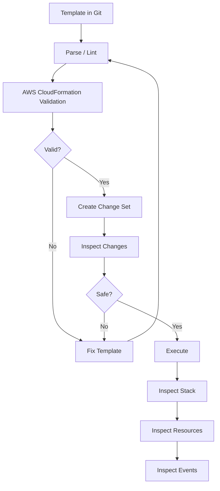

# 02- Template Validation and Inspection

## Overview

CloudFormation template validation and inspection are critical parts of an infrastructure deployment workflow. A template can be syntactically valid while still producing an invalid or unsafe infrastructure change, so validation should be treated as an early quality gate rather than proof that deployment will succeed.

The AWS CLI provides several commands for validating templates, inspecting deployed templates, examining stack resources, reviewing stack events, and analyzing proposed changes.

A practical workflow is:

```text
CloudFormation Template
        |
        v
Template Validation
        |
        v
Change Set / Deployment
        |
        v
Stack
        |
        +-------------------+
        |                   |
        v                   v
Stack Resources       Stack Events
        |                   |
        v                   v
Physical Resources    Operational State
```

For production systems, template validation should be integrated into CI/CD before infrastructure changes reach an AWS account.

## What Template Validation Means

Template validation checks whether a CloudFormation template conforms to the expected CloudFormation template structure and syntax.

For example:

```yaml
AWSTemplateFormatVersion: '2010-09-09'

Resources:
  ApiBucket:
    Type: AWS::S3::Bucket
```

The AWS CLI can validate this template before stack creation:

```bash
aws cloudformation validate-template \
  --template-body file://template.yaml
```

Validation is useful for detecting structural problems early, but it does not prove that the eventual deployment will succeed.

A useful distinction is:

| Validation Layer | What It Detects |
|---|---|
| YAML/JSON parsing | Invalid document syntax |
| CloudFormation template validation | Invalid CloudFormation structure |
| Change Set analysis | Proposed resource changes |
| Deployment | Actual AWS resource provisioning |
| Stack events | Runtime provisioning failures |
| Application tests | Application-level behavior |

The important engineering principle is:

> Template validation reduces one class of failures; it does not eliminate deployment risk.

## Why Validation Matters

Without validation, a malformed template may reach a deployment environment and fail after the infrastructure operation has already started.

A CI/CD pipeline should therefore reject obviously invalid infrastructure before attempting deployment.

```text
Developer
    |
    v
Git Commit
    |
    v
CI Pipeline
    |
    v
Template Validation
    |
    +---- Failed ----> Stop
    |
    v
Change Set
    |
    v
Review
    |
    v
Deployment
```

This shortens feedback loops and prevents avoidable CloudFormation failures.

## Basic Template Validation

Validate a local template:

```bash
aws cloudformation validate-template \
  --template-body file://template.yaml
```

Specify the Region when operating in an environment where Region context should be explicit:

```bash
aws cloudformation validate-template \
  --template-body file://template.yaml \
  --region ap-south-1
```

For local template validation, the Region is generally not the primary validation mechanism, but explicitly setting deployment context in automation reduces environment ambiguity.

## JSON Output

The CLI normally returns structured information about the template.

Use JSON explicitly:

```bash
aws cloudformation validate-template \
  --template-body file://template.yaml \
  --output json
```

This is useful when the result is consumed by scripts or CI/CD tooling.

For example:

```bash
aws cloudformation validate-template \
  --template-body file://template.yaml \
  --query 'Parameters[].ParameterKey' \
  --output text
```

This extracts the parameter names defined by the template.

## Validating JSON Templates

CloudFormation templates can also be written in JSON.

```json
{
  "AWSTemplateFormatVersion": "2010-09-09",
  "Resources": {
    "ApiBucket": {
      "Type": "AWS::S3::Bucket"
    }
  }
}
```

Validate it using:

```bash
aws cloudformation validate-template \
  --template-body file://template.json
```

The CLI handles the template format based on the supplied content.

## Local Syntax Validation

CloudFormation validation should not be the only validation layer.

For YAML-based templates, a YAML parser or linter can catch syntax errors before the AWS CLI is invoked.

A production pipeline may use:

```text
YAML Parser
    |
    v
CloudFormation Validation
    |
    v
CloudFormation Linter
    |
    v
Security Checks
    |
    v
Change Set
```

Tools such as `cfn-lint` can provide additional static analysis, including resource-property validation and CloudFormation-specific best-practice checks.

The distinction is important:

```text
aws cloudformation validate-template
        |
        +--> CloudFormation template validity

cfn-lint
        |
        +--> Static analysis and template quality
```

Neither tool replaces deployment testing.

## Template Validation vs Deployment Validation

A template can pass validation and still fail during deployment.

For example:

```yaml
Resources:
  ApiInstance:
    Type: AWS::EC2::Instance
    Properties:
      InstanceType: t3.micro
      ImageId: ami-invalid
```

The template structure may be valid, but the AMI may not be valid for the target Region.

Other runtime failures can include:

- Missing IAM permissions.
- Unsupported resource configuration.
- Service quotas.
- Invalid security group references.
- Subnet configuration problems.
- Resource naming conflicts.
- Dependency failures.
- Account-specific restrictions.
- Region-specific availability.
- Existing resources with conflicting properties.

Therefore:

```text
Template Validation != Deployment Success
```

## Inspection of an Existing Template

Validation is useful before deployment. Inspection is useful after a stack already exists.

Use `get-template` to retrieve the template associated with a stack:

```bash
aws cloudformation get-template \
  --stack-name production-api \
  --region ap-south-1
```

This is useful when investigating an existing environment.

Typical reasons include:

- Understanding legacy infrastructure.
- Troubleshooting an existing stack.
- Comparing deployed infrastructure with repository code.
- Recovering information during an incident.
- Verifying which template CloudFormation currently associates with a stack.

## Extracting the Template Body

The response can be filtered with `--query`:

```bash
aws cloudformation get-template \
  --stack-name production-api \
  --query 'TemplateBody'
```

For a clean output:

```bash
aws cloudformation get-template \
  --stack-name production-api \
  --query 'TemplateBody' \
  --output text
```

The exact returned representation depends on the template format and CLI output processing.

## Template Inspection Is Not Source Control

Retrieving a deployed template is useful for investigation, but it should not become the primary infrastructure workflow.

The preferred model is:

```text
Git Repository
      |
      v
CloudFormation Template
      |
      v
CI/CD
      |
      v
AWS Environment
```

Git should remain the authoritative source for infrastructure code.

If the deployed template differs from the repository version, investigate why rather than silently copying the deployed version back into source control.

Potential causes include:

- Manual changes.
- Different deployment artifacts.
- Branch mismatch.
- Out-of-band operations.
- Emergency infrastructure changes.
- Incorrect CI/CD configuration.

## Inspecting Stack Metadata

Use `describe-stacks` to inspect the stack itself:

```bash
aws cloudformation describe-stacks \
  --stack-name production-api \
  --region ap-south-1
```

Useful information includes:

- Stack status.
- Stack parameters.
- Stack outputs.
- Stack tags.
- Creation time.
- Last update time.
- Capabilities.
- Termination protection.
- Stack ARN.

For example:

```bash
aws cloudformation describe-stacks \
  --stack-name production-api \
  --query 'Stacks[0].StackStatus' \
  --output text
```

Possible results include:

```text
CREATE_COMPLETE
UPDATE_COMPLETE
UPDATE_IN_PROGRESS
UPDATE_ROLLBACK_COMPLETE
UPDATE_ROLLBACK_FAILED
```

## Inspecting Stack Parameters

Retrieve the parameters:

```bash
aws cloudformation describe-stacks \
  --stack-name production-api \
  --query 'Stacks[0].Parameters'
```

Extract parameter keys:

```bash
aws cloudformation describe-stacks \
  --stack-name production-api \
  --query 'Stacks[0].Parameters[].ParameterKey' \
  --output text
```

Extract parameter values:

```bash
aws cloudformation describe-stacks \
  --stack-name production-api \
  --query 'Stacks[0].Parameters[].ParameterValue' \
  --output text
```

Be careful when inspecting parameter values. A parameter may contain sensitive information even when the infrastructure team did not intend to expose it through logs.

Do not blindly print all CloudFormation responses into CI/CD logs.

## Inspecting Stack Outputs

Outputs are commonly used to expose important infrastructure values.

Example:

```yaml
Outputs:
  ApiEndpoint:
    Description: API endpoint
    Value: !Sub "https://${ApiLoadBalancer.DNSName}"
```

Retrieve outputs:

```bash
aws cloudformation describe-stacks \
  --stack-name production-api \
  --query 'Stacks[0].Outputs'
```

Retrieve a specific output:

```bash
aws cloudformation describe-stacks \
  --stack-name production-api \
  --query "Stacks[0].Outputs[?OutputKey=='ApiEndpoint'].OutputValue" \
  --output text
```

This pattern is useful in deployment automation.

For example:

```bash
API_ENDPOINT=$(
  aws cloudformation describe-stacks \
    --stack-name production-api \
    --query "Stacks[0].Outputs[?OutputKey=='ApiEndpoint'].OutputValue" \
    --output text
)

echo "$API_ENDPOINT"
```

Avoid exposing sensitive values through stack outputs.

## Inspecting Stack Resources

Use:

```bash
aws cloudformation list-stack-resources \
  --stack-name production-api \
  --region ap-south-1
```

This provides the resources currently associated with the stack.

A simplified relationship is:

```text
CloudFormation Stack
        |
        v
Logical Resource IDs
        |
        v
Physical Resource IDs
        |
        v
AWS Resources
```

For example:

```text
ApiLoadBalancer
        |
        v
Physical ALB
        |
        v
arn:aws:elasticloadbalancing:...
```

## Logical Resource IDs

Consider this template:

```yaml
Resources:
  ApiLoadBalancer:
    Type: AWS::ElasticLoadBalancingV2::LoadBalancer
    Properties:
      Type: application
```

`ApiLoadBalancer` is the CloudFormation logical ID.

Inspect it:

```bash
aws cloudformation describe-stack-resource \
  --stack-name production-api \
  --logical-resource-id ApiLoadBalancer
```

This is useful during troubleshooting because CloudFormation events and resource APIs commonly refer to logical IDs.

## Resource Status

List stack resources and inspect their status:

```bash
aws cloudformation list-stack-resources \
  --stack-name production-api \
  --query 'StackResourceSummaries[].{LogicalId:LogicalResourceId,Type:ResourceType,Status:ResourceStatus}' \
  --output table
```

A useful operational view is:

| Logical ID | Resource Type | Status |
|---|---|---|
| ApiLoadBalancer | `AWS::ElasticLoadBalancingV2::LoadBalancer` | `CREATE_COMPLETE` |
| ApiService | `AWS::ECS::Service` | `CREATE_COMPLETE` |
| ApiTaskRole | `AWS::IAM::Role` | `CREATE_COMPLETE` |
| ApiBucket | `AWS::S3::Bucket` | `CREATE_COMPLETE` |

This provides a quick infrastructure inventory without opening the AWS console.

## Inspecting Stack Events

When a stack operation fails, inspect events:

```bash
aws cloudformation describe-stack-events \
  --stack-name production-api \
  --region ap-south-1
```

Events contain information such as:

- Logical resource ID.
- Resource type.
- Resource status.
- Resource status reason.
- Timestamp.
- Operation status.

A useful query is:

```bash
aws cloudformation describe-stack-events \
  --stack-name production-api \
  --query 'StackEvents[].{Time:Timestamp,Resource:LogicalResourceId,Status:ResourceStatus,Reason:ResourceStatusReason}' \
  --output table
```

This creates a compact operational view.

## Finding Failed Resources

Filter failed events:

```bash
aws cloudformation describe-stack-events \
  --stack-name production-api \
  --query "StackEvents[?contains(ResourceStatus, 'FAILED')].[LogicalResourceId,ResourceStatus,ResourceStatusReason]" \
  --output table
```

This is particularly useful in CI/CD troubleshooting.

The investigation pattern should be:

```text
Stack Failure
     |
     v
describe-stack-events
     |
     v
Failed Logical Resource
     |
     v
Resource Status Reason
     |
     v
Underlying AWS Service
     |
     v
Root Cause
```

## Change Set Inspection

Template validation answers:

```text
"Is this template structurally valid?"
```

A change set answers a different question:

```text
"What will CloudFormation attempt to change?"
```

Create a change set:

```bash
aws cloudformation create-change-set \
  --stack-name production-api \
  --change-set-name production-api-review \
  --change-set-type UPDATE \
  --template-body file://template.yaml \
  --region ap-south-1
```

Inspect it:

```bash
aws cloudformation describe-change-set \
  --stack-name production-api \
  --change-set-name production-api-review \
  --region ap-south-1
```

The change set can identify resource-level actions such as:

- Add.
- Modify.
- Remove.
- Replacement.

## Replacement Is the Critical Detail

A resource modification is not always an in-place change.

CloudFormation may determine that a property change requires replacement.

For example:

```text
Existing Resource
       |
       v
Property Change
       |
       v
CloudFormation
       |
       +---- Update in place
       |
       +---- Replace resource
```

A replacement can have significant production consequences.

For stateful resources, replacement may result in:

- Data loss.
- New resource identifiers.
- Temporary downtime.
- Connection changes.
- Dependency changes.

Therefore, reviewing change sets is particularly important for:

- RDS.
- ElastiCache.
- Stateful storage.
- Networking.
- Load balancers.
- IAM resources.
- Production databases.

## Template Inspection Workflow

A practical inspection workflow is:



This separates static validation from runtime inspection and deployment review.

## Validation in CI/CD

A production pipeline should validate infrastructure before deployment.

Example GitHub Actions step:

```yaml
- name: Validate CloudFormation template
  run: |
    aws cloudformation validate-template \
      --template-body file://infrastructure/template.yaml
```

A more complete pipeline can be:

```text
Pull Request
     |
     v
YAML Validation
     |
     v
cfn-lint
     |
     v
Security Checks
     |
     v
CloudFormation Validation
     |
     v
Change Set
     |
     v
Review
     |
     v
Deployment
```

The pipeline should fail immediately when an early validation stage fails.

## Template Validation with `cfn-lint`

For production repositories, `cfn-lint` can provide deeper static analysis than the basic AWS CLI validation command.

Example:

```bash
cfn-lint infrastructure/template.yaml
```

You can integrate it into CI:

```yaml
- name: Install cfn-lint
  run: |
    python -m pip install --upgrade cfn-lint

- name: Lint CloudFormation
  run: |
    cfn-lint infrastructure/template.yaml
```

The AWS CLI and `cfn-lint` serve different purposes.

| Tool | Primary Role |
|---|---|
| YAML parser | YAML syntax |
| `aws cloudformation validate-template` | CloudFormation template validation |
| `cfn-lint` | Static analysis and CloudFormation-specific linting |
| Change Set | Proposed infrastructure change inspection |
| Stack events | Runtime deployment inspection |

Using multiple layers produces stronger feedback than relying on a single validation command.

## Validating Before Creating a Stack

A basic deployment script can follow:

```bash
#!/usr/bin/env bash

set -euo pipefail

STACK_NAME="backend-api-development"
REGION="ap-south-1"
TEMPLATE="infrastructure/template.yaml"

aws cloudformation validate-template \
  --template-body "file://${TEMPLATE}" \
  --region "${REGION}"

aws cloudformation create-stack \
  --stack-name "${STACK_NAME}" \
  --template-body "file://${TEMPLATE}" \
  --region "${REGION}"

aws cloudformation wait stack-create-complete \
  --stack-name "${STACK_NAME}" \
  --region "${REGION}"
```

The important sequence is:

```text
Validate
   |
   v
Create
   |
   v
Wait
   |
   v
Verify
```

For production, a change-set-based workflow is generally more controlled.

## Inspecting Before Deployment

A stronger production workflow is:

```bash
aws cloudformation validate-template \
  --template-body file://template.yaml \
  --region ap-south-1

aws cloudformation create-change-set \
  --stack-name production-api \
  --change-set-name production-api-review \
  --change-set-type UPDATE \
  --template-body file://template.yaml \
  --region ap-south-1

aws cloudformation describe-change-set \
  --stack-name production-api \
  --change-set-name production-api-review \
  --region ap-south-1
```

After review:

```bash
aws cloudformation execute-change-set \
  --stack-name production-api \
  --change-set-name production-api-review \
  --region ap-south-1
```

Then monitor:

```bash
aws cloudformation wait stack-update-complete \
  --stack-name production-api \
  --region ap-south-1
```

## Validation and Parameter Values

Template validation does not necessarily exercise every runtime combination of parameter values.

Consider:

```yaml
Parameters:
  Environment:
    Type: String
    AllowedValues:
      - development
      - staging
      - production
```

A CI/CD system should validate the actual environment-specific parameter configuration used for deployment.

The infrastructure pipeline should therefore treat:

```text
Template
+
Parameters
+
Environment
+
AWS Account
+
AWS Region
```

as the deployment context.

A template cannot be considered production-ready in isolation from the configuration used to deploy it.

## Inspecting Nested Stacks

When using nested stacks, the parent stack may contain:

```yaml
Resources:
  NetworkStack:
    Type: AWS::CloudFormation::Stack
    Properties:
      TemplateURL: ...
```

Inspect the parent stack:

```bash
aws cloudformation list-stack-resources \
  --stack-name production-platform
```

The nested stack appears as a CloudFormation stack resource.

You can then inspect the nested stack independently:

```bash
aws cloudformation describe-stacks \
  --stack-name <nested-stack-id-or-name>
```

This is important because a parent stack failure may originate from a resource several levels down in the nested stack hierarchy.

## Inspection Across Stack Dependencies

In architectures using multiple stacks:

```text
Network Stack
     |
     v
Security Stack
     |
     v
Application Stack
     |
     v
Data Stack
```

Inspection should establish:

- Which stack failed.
- Which resource failed.
- Which stack owns the resource.
- Which dependency caused the failure.
- Whether the change requires replacement.
- Whether the dependency is managed by CloudFormation.

This is especially important in large backend platforms where infrastructure is separated into networking, security, data, and application stacks.

## Security Considerations

Template inspection can expose infrastructure details.

Be careful with:

```bash
aws cloudformation describe-stacks
aws cloudformation get-template
aws cloudformation describe-stack-events
```

CLI output may contain:

- Resource names.
- ARNs.
- Configuration.
- Parameters.
- Outputs.
- Network information.
- IAM resource details.

Do not automatically publish full CloudFormation responses into:

- Public CI logs.
- Chat systems.
- Issue trackers.
- Monitoring dashboards.
- Application logs.

### Secrets

Do not use CloudFormation parameters as a general-purpose secret store.

Prefer:

- AWS Secrets Manager.
- AWS Systems Manager Parameter Store.
- Dynamic references where appropriate.
- IAM-based access instead of embedding credentials.

For example, avoid:

```yaml
Parameters:
  DatabasePassword:
    Type: String
```

with a real password committed to source control or passed through visible command-line arguments.

A stronger architecture is:

```text
CloudFormation
      |
      v
Secrets Manager
      |
      v
Application Runtime
```

The infrastructure template should reference the secret without embedding the secret value directly.

## Operational Considerations

Inspection commands are most useful when they are incorporated into repeatable operational procedures.

A deployment system should capture:

- Stack name.
- Account ID.
- Region.
- Deployment version.
- Change set name.
- Stack status.
- Failed resource.
- Stack status reason.
- Deployment timestamp.

For example:

```bash
ACCOUNT_ID=$(aws sts get-caller-identity \
  --query Account \
  --output text)

STACK_STATUS=$(aws cloudformation describe-stacks \
  --stack-name production-api \
  --query 'Stacks[0].StackStatus' \
  --output text)

echo "Account: ${ACCOUNT_ID}"
echo "Stack: production-api"
echo "Status: ${STACK_STATUS}"
```

This makes deployment logs significantly easier to interpret.

## Performance and Scalability Considerations

CloudFormation validation itself is usually inexpensive compared with actual infrastructure provisioning.

The larger operational concern is the complexity of the template and deployment graph.

Large templates can contain:

- Hundreds of resources.
- Deep dependencies.
- Nested stacks.
- Cross-stack references.
- Custom resources.
- Complex IAM policies.

As infrastructure grows, separate concerns into manageable stacks or modules.

For example:

```text
platform/
├── network
├── security
├── data
├── application
└── observability
```

Inspection becomes easier when each stack has a clear ownership boundary.

Avoid splitting stacks merely to reduce file size. Stack boundaries should reflect architecture, lifecycle, ownership, and deployment dependencies.

## Common Mistakes

### Treating Validation as a Full Deployment Test

This is the most important conceptual mistake.

```text
validate-template
        !=
successful deployment
```

Validation should be followed by change-set review and deployment verification.

### Validating Only YAML Syntax

Valid YAML can still be invalid CloudFormation.

Use CloudFormation-aware validation and linting.

### Ignoring Change Set Replacement Information

A change that appears small in the template can cause a resource replacement.

Always inspect high-impact resource changes.

### Inspecting Only the Stack Status

A stack status such as:

```text
UPDATE_ROLLBACK_COMPLETE
```

does not explain why the update failed.

Inspect stack events:

```bash
aws cloudformation describe-stack-events \
  --stack-name production-api
```

### Dumping Full CLI Responses into CI Logs

Full responses may expose infrastructure details or sensitive values.

Extract only what is required with:

```bash
--query
```

and:

```bash
--output
```

### Assuming the Deployed Template Is the Source of Truth

`get-template` is an inspection and recovery mechanism.

The version-controlled repository should remain the authoritative source.

### Forgetting Account and Region Context

A valid template or stack name is not enough.

Always verify:

```bash
aws sts get-caller-identity
```

and explicitly control the Region in production automation.

## Production Inspection Checklist

- [ ] YAML or JSON syntax is validated.
- [ ] CloudFormation template validation passes.
- [ ] `cfn-lint` checks pass where adopted.
- [ ] Environment-specific parameters are reviewed.
- [ ] IAM changes are reviewed.
- [ ] Change Set is created for production changes where appropriate.
- [ ] Resource replacements are explicitly reviewed.
- [ ] Stateful resource changes are evaluated for data-loss risk.
- [ ] Account ID is verified.
- [ ] Region is verified.
- [ ] Stack status is inspected after deployment.
- [ ] Stack resources are inspected when troubleshooting.
- [ ] Stack events are inspected after failures.
- [ ] Sensitive CLI output is not exposed in CI/CD logs.
- [ ] Deployed templates are not treated as the permanent source of truth.
- [ ] Infrastructure source code remains version-controlled.
- [ ] Deployment verification is automated where practical.

## Interview Traps

### Does `validate-template` Guarantee Deployment Success?

No.

It validates the CloudFormation template but does not guarantee that AWS can successfully provision every resource.

### What Is the Difference Between Validation and a Change Set?

Validation checks whether the template is acceptable as a CloudFormation template.

A change set shows the proposed infrastructure changes for an existing stack before execution.

### How Do You Investigate a Failed CloudFormation Deployment?

Start with:

```bash
aws cloudformation describe-stack-events \
  --stack-name production-api
```

Identify the failed logical resource and inspect its status reason.

### How Do You Determine Which Resources Belong to a Stack?

Use:

```bash
aws cloudformation list-stack-resources \
  --stack-name production-api
```

### How Do You Inspect the Template Associated With a Deployed Stack?

Use:

```bash
aws cloudformation get-template \
  --stack-name production-api
```

### Why Should `--query` Be Used in Automation?

It allows scripts and CI/CD systems to extract only the required fields instead of parsing large API responses.

### Is a CloudFormation Template the Same as the Deployed Infrastructure?

No.

The template is the declarative desired state. CloudFormation uses it to manage resources, while the actual AWS resources have their own runtime state and service-specific configuration.

### Why Is a Change Set Important for Stateful Resources?

A property change can result in resource replacement. For databases and other stateful resources, replacement can have serious availability or data-loss implications.

## Key Takeaways

- Template validation is an early quality gate, not a guarantee of successful deployment.
- `aws cloudformation validate-template` provides basic CloudFormation template validation.
- YAML or JSON syntax validation and CloudFormation validation serve different purposes.
- `cfn-lint` provides additional static analysis and should be considered for production repositories.
- `get-template` allows inspection of the template associated with an existing stack.
- `describe-stacks` provides stack-level state, parameters, outputs, and metadata.
- `list-stack-resources` provides an inventory of resources managed by a stack.
- `describe-stack-resource` helps map a CloudFormation logical ID to its physical resource.
- `describe-stack-events` is the primary CLI tool for investigating stack operation failures.
- `--query` and `--output` make CloudFormation CLI output suitable for automation.
- Change Sets should be used to understand proposed infrastructure changes before executing high-risk production updates.
- Resource replacement deserves special attention, particularly for stateful infrastructure.
- Validation, linting, change-set inspection, deployment, and runtime verification should be treated as separate stages.
- Account, Region, stack, and deployment identity should be explicitly verified during production operations.
- Avoid exposing full CloudFormation responses in CI/CD logs.
- Never embed real secrets in templates, parameter files, or command-line arguments.
- Git should remain the source of truth for CloudFormation infrastructure code.
- A senior-level CloudFormation workflow focuses not only on whether a template is valid, but also on what it will change, which resources it can replace, and how the resulting infrastructure will be verified.