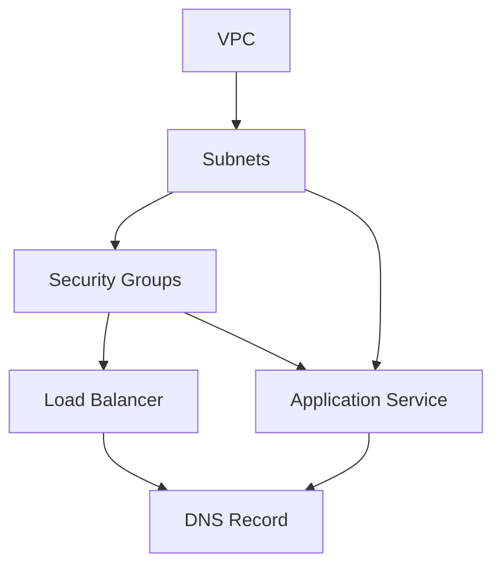

# 03- Stack Creation and Updates

## Overview

CloudFormation stack creation and updates are the primary mechanisms for turning a declarative infrastructure template into managed AWS resources.

A stack represents a collection of AWS resources managed as a single CloudFormation unit. CloudFormation evaluates the template, resolves parameters and dependencies, creates or updates resources, and tracks their lifecycle.

The basic lifecycle is:

```text
CloudFormation Template
        |
        v
Validate
        |
        v
Create / Update Stack
        |
        v
Resolve Parameters
        |
        v
Build Dependency Graph
        |
        v
Provision / Modify Resources
        |
        v
Monitor Stack Events
        |
        v
Complete / Roll Back
```

For production systems, stack operations should normally be driven through CI/CD, reviewed through Change Sets where appropriate, and monitored through CloudFormation events rather than executed manually from developer machines.

## What Is a CloudFormation Stack?

A CloudFormation stack is a managed collection of AWS resources defined by a CloudFormation template.

For example:

```yaml
AWSTemplateFormatVersion: '2010-09-09'

Resources:
  ApiBucket:
    Type: AWS::S3::Bucket

  ApiRole:
    Type: AWS::IAM::Role
    Properties:
      AssumeRolePolicyDocument:
        Version: '2012-10-17'
        Statement:
          - Effect: Allow
            Principal:
              Service:
                - lambda.amazonaws.com
            Action:
              - sts:AssumeRole
```

CloudFormation creates and manages these resources as part of one stack.

The stack provides:

- A lifecycle boundary.
- Resource dependency management.
- Change tracking.
- Rollback behavior.
- Stack-level parameters and outputs.
- Resource status tracking.
- Integration with CI/CD and AWS tooling.

## Stack Creation

A stack is created from a CloudFormation template.

The basic CLI operation is:

```bash
aws cloudformation create-stack \
  --stack-name backend-api-development \
  --template-body file://template.yaml \
  --region ap-south-1
```

CloudFormation accepts the request and begins an asynchronous stack operation.

The CLI returning successfully does **not** mean that the stack has finished creating.

```text
create-stack
     |
     v
Request Accepted
     |
     v
CREATE_IN_PROGRESS
     |
     v
Resources Provisioned
     |
     v
CREATE_COMPLETE
```

This distinction is important in automation.

## Creating a Stack with Parameters

Consider a template with parameters:

```yaml
Parameters:
  Environment:
    Type: String
    AllowedValues:
      - development
      - staging
      - production

  InstanceType:
    Type: String
    Default: t3.micro
```

Pass parameters during stack creation:

```bash
aws cloudformation create-stack \
  --stack-name backend-api-production \
  --template-body file://template.yaml \
  --parameters \
    ParameterKey=Environment,ParameterValue=production \
    ParameterKey=InstanceType,ParameterValue=t3.micro \
  --region ap-south-1
```

Parameters allow the same template to be reused across environments.

```text
                  template.yaml
                       |
          +------------+------------+
          |            |            |
          v            v            v
     Development     Staging     Production
```

The template should contain environment-independent infrastructure logic whenever practical, while environment-specific configuration should be supplied through controlled parameters or configuration systems.

## Parameter Files

For larger deployments, parameters can be maintained in a separate file.

Example:

```json
[
  {
    "ParameterKey": "Environment",
    "ParameterValue": "production"
  },
  {
    "ParameterKey": "InstanceType",
    "ParameterValue": "t3.micro"
  }
]
```

Deploy with:

```bash
aws cloudformation create-stack \
  --stack-name backend-api-production \
  --template-body file://template.yaml \
  --parameters file://parameters-production.json \
  --region ap-south-1
```

Do not place passwords, API keys, or other secrets in parameter files committed to Git.

Use Secrets Manager, Systems Manager Parameter Store, or appropriate CloudFormation dynamic references instead.

## IAM Capabilities

CloudFormation may need permission to create IAM resources.

For templates containing IAM resources, the deployment may require an explicit capability acknowledgement:

```bash
aws cloudformation create-stack \
  --stack-name backend-api-production \
  --template-body file://template.yaml \
  --capabilities CAPABILITY_IAM \
  --region ap-south-1
```

For templates that create named IAM resources:

```bash
aws cloudformation create-stack \
  --stack-name backend-api-production \
  --template-body file://template.yaml \
  --capabilities CAPABILITY_NAMED_IAM \
  --region ap-south-1
```

The capability flag is an acknowledgement that the template may create or modify IAM resources.

It is not a replacement for IAM authorization.

## Stack Creation with Tags

Tags can be applied to the stack:

```bash
aws cloudformation create-stack \
  --stack-name backend-api-production \
  --template-body file://template.yaml \
  --tags \
    Key=Environment,Value=production \
    Key=Application,Value=backend-api \
    Key=ManagedBy,Value=CloudFormation \
  --region ap-south-1
```

Consistent tagging improves:

- Cost allocation.
- Resource ownership.
- Operations.
- Incident response.
- Inventory management.
- Governance.

A production tagging strategy should be standardized rather than invented separately for every stack.

## Waiting for Stack Creation

CloudFormation operations are asynchronous.

After creating a stack, use a waiter when automation must block until completion:

```bash
aws cloudformation wait stack-create-complete \
  --stack-name backend-api-production \
  --region ap-south-1
```

The deployment workflow becomes:

```text
Create Stack
     |
     v
Wait
     |
     +---- Failure ----> Inspect Events
     |
     v
CREATE_COMPLETE
     |
     v
Application Verification
```

This is preferable to using arbitrary sleep commands such as:

```bash
sleep 300
```

A fixed sleep duration is unreliable because infrastructure provisioning time varies.

## Monitoring Stack Creation

Inspect stack status:

```bash
aws cloudformation describe-stacks \
  --stack-name backend-api-production \
  --region ap-south-1 \
  --query 'Stacks[0].StackStatus' \
  --output text
```

Inspect events:

```bash
aws cloudformation describe-stack-events \
  --stack-name backend-api-production \
  --region ap-south-1
```

For failures:

```bash
aws cloudformation describe-stack-events \
  --stack-name backend-api-production \
  --region ap-south-1 \
  --query "StackEvents[?contains(ResourceStatus, 'FAILED')].[LogicalResourceId,ResourceStatus,ResourceStatusReason]" \
  --output table
```

Stack events are usually the first place to investigate when a resource fails.

## Stack Updates

Updating a stack means supplying a new desired configuration for an existing stack.

The simplest update operation is:

```bash
aws cloudformation update-stack \
  --stack-name backend-api-production \
  --template-body file://template.yaml \
  --region ap-south-1
```

CloudFormation compares the current stack state with the new template and determines which resources must be created, modified, replaced, or removed.

```text
Current Stack
     |
     | + New Template
     v
CloudFormation Comparison
     |
     v
Change Set / Resource Plan
     |
     v
Resource Operations
```

## Updating Parameters

Parameters can also be changed during an update:

```bash
aws cloudformation update-stack \
  --stack-name backend-api-production \
  --template-body file://template.yaml \
  --parameters \
    ParameterKey=Environment,ParameterValue=production \
    ParameterKey=InstanceType,ParameterValue=t3.small \
  --region ap-south-1
```

If an existing parameter value should remain unchanged, use:

```text
UsePreviousValue=true
```

For example:

```bash
aws cloudformation update-stack \
  --stack-name backend-api-production \
  --template-body file://template.yaml \
  --parameters \
    ParameterKey=Environment,UsePreviousValue=true \
    ParameterKey=InstanceType,ParameterValue=t3.small \
  --region ap-south-1
```

This is useful when only selected parameters need to change.

## Update Lifecycle

A typical update lifecycle is:

```text
UPDATE_IN_PROGRESS
        |
        v
Resource Changes
        |
        +------------------+
        |                  |
        v                  v
Update In Place       Replacement
        |                  |
        +--------+---------+
                 |
                 v
        UPDATE_COMPLETE
```

If a resource operation fails:

```text
UPDATE_IN_PROGRESS
        |
        v
Resource Failure
        |
        v
UPDATE_ROLLBACK_IN_PROGRESS
        |
        v
UPDATE_ROLLBACK_COMPLETE
```

The exact rollback behavior depends on the resources and failure state.

## Update in Place vs Replacement

CloudFormation does not always modify an existing resource in place.

A property change can have one of three important outcomes:

| Change Type | Meaning |
|---|---|
| Add | New resource is created |
| Modify | Existing resource is modified |
| Replacement | Existing resource is replaced |

Replacement is particularly important for stateful resources.

For example:

```text
RDS Instance
    |
    | Property change
    v
CloudFormation
    |
    +---- Modify existing database
    |
    +---- Replace database
```

Before production updates, determine whether a resource will be replaced.

## Change Sets

For production updates, Change Sets provide a safer review mechanism.

Create one:

```bash
aws cloudformation create-change-set \
  --stack-name backend-api-production \
  --change-set-name backend-api-update \
  --change-set-type UPDATE \
  --template-body file://template.yaml \
  --region ap-south-1
```

Inspect it:

```bash
aws cloudformation describe-change-set \
  --stack-name backend-api-production \
  --change-set-name backend-api-update \
  --region ap-south-1
```

The Change Set can show:

- Resources being added.
- Resources being modified.
- Resources being removed.
- Replacement behavior.
- Property-level changes where available.

Execute it only after review:

```bash
aws cloudformation execute-change-set \
  --stack-name backend-api-production \
  --change-set-name backend-api-update \
  --region ap-south-1
```

A production deployment pipeline can therefore follow:

```text
Git Commit
    |
    v
Validate
    |
    v
Lint
    |
    v
Create Change Set
    |
    v
Review
    |
    v
Execute Change Set
    |
    v
Monitor
```

## Stack Creation with Change Sets

Change Sets can also be used when creating a new stack.

Create a change set:

```bash
aws cloudformation create-change-set \
  --stack-name backend-api-production \
  --change-set-name initial-deployment \
  --change-set-type CREATE \
  --template-body file://template.yaml \
  --region ap-south-1
```

Then inspect:

```bash
aws cloudformation describe-change-set \
  --stack-name backend-api-production \
  --change-set-name initial-deployment \
  --region ap-south-1
```

Execute:

```bash
aws cloudformation execute-change-set \
  --stack-name backend-api-production \
  --change-set-name initial-deployment \
  --region ap-south-1
```

This provides a reviewable deployment plan before execution.

## No-Op Updates

An update may produce no meaningful resource changes.

For example, the template may be functionally identical to the currently deployed template.

Automation should distinguish between:

```text
Template Changed
       |
       v
CloudFormation Evaluation
       |
       v
No Resource Changes
```

and an actual infrastructure update.

Do not treat every successful CLI invocation as evidence that infrastructure changed.

## Continue Using Previous Template Values

When updating parameters, CloudFormation can retain existing parameter values:

```bash
aws cloudformation update-stack \
  --stack-name backend-api-production \
  --template-body file://template.yaml \
  --parameters \
    ParameterKey=Environment,UsePreviousValue=true \
    ParameterKey=InstanceType,UsePreviousValue=true \
  --region ap-south-1
```

This is useful for pipelines where only the template changes.

However, relying heavily on previous values can make deployments harder to reproduce. Production pipelines should make environment configuration explicit where practical.

## Rollback Behavior

CloudFormation attempts to maintain a consistent stack state when resource operations fail.

For example:

```text
UPDATE
  |
  v
Resource A -> Success
Resource B -> Success
Resource C -> Failure
  |
  v
Rollback
  |
  v
Restore previous state where possible
```

The resulting status may be:

```text
UPDATE_ROLLBACK_COMPLETE
```

A more serious condition is:

```text
UPDATE_ROLLBACK_FAILED
```

This requires investigation and potentially corrective action before normal updates can continue.

Inspect events:

```bash
aws cloudformation describe-stack-events \
  --stack-name backend-api-production \
  --region ap-south-1
```

## Rollback on Stack Creation

Creation can also fail:

```text
CREATE_IN_PROGRESS
       |
       v
Resource Failure
       |
       v
CREATE_FAILED
       |
       v
Rollback
```

Depending on stack configuration and failure behavior, resources may be deleted during rollback.

For production workloads, understand the consequences of rollback before deploying resources that contain persistent state.

## Disable Rollback

CloudFormation supports disabling rollback during stack creation in appropriate troubleshooting scenarios.

For example:

```bash
aws cloudformation create-stack \
  --stack-name backend-api-debug \
  --template-body file://template.yaml \
  --disable-rollback \
  --region ap-south-1
```

This can be useful for debugging because successfully created resources can remain available for investigation.

It should not be treated as a default production deployment strategy.

Leaving partially created infrastructure behind can:

- Increase cost.
- Create security exposure.
- Cause naming conflicts.
- Complicate future deployments.
- Leave orphaned resources.

## Stack Rollback Configuration

CloudFormation also supports stack-level rollback controls for certain operations.

When designing production infrastructure, rollback behavior should be intentional rather than accidental.

Consider:

- Whether failed resources should be retained for debugging.
- Whether persistent resources can safely be rolled back.
- Whether a replacement can cause data loss.
- Whether dependent services can tolerate temporary changes.
- Whether an automated rollback could make incident investigation harder.

## Termination Protection

Termination protection helps prevent accidental stack deletion.

Enable it:

```bash
aws cloudformation update-termination-protection \
  --stack-name backend-api-production \
  --enable-termination-protection \
  --region ap-south-1
```

Disable it only when intentional deletion is required:

```bash
aws cloudformation update-termination-protection \
  --stack-name backend-api-production \
  --no-enable-termination-protection \
  --region ap-south-1
```

This is especially useful for stacks containing:

- Production databases.
- Shared networking.
- Security infrastructure.
- Persistent storage.

Termination protection does not prevent resource replacement during an update. It specifically protects against stack deletion.

## Stack Policies

Stack policies can help prevent updates to protected resources.

A stack policy can restrict which resources may be updated.

Example:

```json
{
  "Statement": [
    {
      "Effect": "Deny",
      "Action": "Update:*",
      "Principal": "*",
      "Resource": "LogicalResourceId/ProductionDatabase"
    },
    {
      "Effect": "Allow",
      "Action": "Update:*",
      "Principal": "*",
      "Resource": "*"
    }
  ]
}
```

Apply it when creating or updating a stack where appropriate:

```bash
aws cloudformation set-stack-policy \
  --stack-name backend-api-production \
  --stack-policy-body file://stack-policy.json \
  --region ap-south-1
```

Stack policies are an additional protection mechanism, not a replacement for deployment review and IAM controls.

## Creation and Update Permissions

The identity executing CloudFormation needs appropriate permissions.

There are two important permission models:

```text
Deployment Identity
       |
       v
CloudFormation
       |
       +---- Uses caller permissions
       |
       +---- Uses CloudFormation service role
```

When a service role is configured, CloudFormation uses that role to make calls to AWS services.

This allows deployment permissions to be separated from the permissions required by the infrastructure itself.

For production environments, a tightly scoped CloudFormation service role is generally preferable to granting deployment users broad permissions across all AWS services.

## Stack Creation from S3 Templates

Large or reusable templates can be stored in Amazon S3.

Create a stack using:

```bash
aws cloudformation create-stack \
  --stack-name backend-api-production \
  --template-url https://s3.amazonaws.com/example-bucket/templates/backend-api.yaml \
  --region ap-south-1
```

A more modern S3 URL form may also be used:

```bash
aws cloudformation create-stack \
  --stack-name backend-api-production \
  --template-url https://example-bucket.s3.amazonaws.com/templates/backend-api.yaml \
  --region ap-south-1
```

The S3 object must be accessible to CloudFormation in the deployment context.

For production, avoid mutable template URLs where an object can silently change underneath an existing deployment process.

Prefer versioned or immutable deployment artifacts.

## Nested Stack Updates

Nested stacks introduce an additional lifecycle layer.

```text
Parent Stack
    |
    +---- Network Stack
    |
    +---- Security Stack
    |
    +---- Application Stack
```

Updating a parent template can trigger updates to nested stacks.

Inspect parent resources:

```bash
aws cloudformation list-stack-resources \
  --stack-name backend-platform-production \
  --region ap-south-1
```

When troubleshooting, determine whether the failure occurred:

- In the parent stack.
- In a nested stack.
- In a resource managed by the nested stack.

## Stack Dependencies

A CloudFormation template can express dependencies between resources.

Implicit dependencies are created through references:

```yaml
Resources:
  SecurityGroup:
    Type: AWS::EC2::SecurityGroup
    Properties:
      GroupDescription: API security group

  Instance:
    Type: AWS::EC2::Instance
    Properties:
      SecurityGroupIds:
        - !GetAtt SecurityGroup.GroupId
```

CloudFormation understands that the instance depends on the security group.

Explicit dependencies can be declared with `DependsOn`:

```yaml
Resources:
  Application:
    Type: AWS::SomeService::Resource
    DependsOn:
      - NetworkResource
```

Use explicit dependencies only when CloudFormation cannot infer the required ordering.

Overusing `DependsOn` can unnecessarily serialize operations and make deployments slower.

## Deployment Ordering

CloudFormation builds a dependency graph.

Conceptually:



Resources without dependencies can often be created concurrently.

This improves deployment performance.

Artificial dependencies reduce this parallelism.

## Update Policies and Resource-Specific Behavior

Some AWS resources have service-specific update behavior.

A template change can result in:

- No operation.
- In-place update.
- Replacement.
- Temporary interruption.
- Data migration.
- Resource recreation.

Never assume that changing a property is equivalent to changing a configuration file on a server.

For production infrastructure, consult the resource's CloudFormation update behavior before modifying critical properties.

## Updating Application Infrastructure

Consider a backend platform:

```text
Internet
   |
   v
Application Load Balancer
   |
   v
ECS Service
   |
   +---- Redis
   |
   +---- PostgreSQL
   |
   +---- Kafka
```

CloudFormation may manage:

- VPC.
- Subnets.
- Security groups.
- IAM roles.
- Load balancers.
- ECS services.
- Auto Scaling.
- RDS.
- ElastiCache.
- CloudWatch resources.

A deployment may therefore change both infrastructure and application runtime configuration.

For example:

```yaml
Parameters:
  ImageTag:
    Type: String
```

Updating:

```text
ImageTag: v1.4.0
        |
        v
CloudFormation Update
        |
        v
ECS Task Definition
        |
        v
ECS Service Deployment
```

CloudFormation manages the infrastructure declaration, while the application platform handles the service-specific rollout behavior.

## CI/CD Integration

A production pipeline should separate validation, planning, execution, and verification.

Example:

```yaml
- name: Validate template
  run: |
    aws cloudformation validate-template \
      --template-body file://infrastructure/template.yaml

- name: Create change set
  run: |
    aws cloudformation create-change-set \
      --stack-name backend-api-production \
      --change-set-name "${GITHUB_SHA}" \
      --change-set-type UPDATE \
      --template-body file://infrastructure/template.yaml \
      --region ap-south-1

- name: Describe change set
  run: |
    aws cloudformation describe-change-set \
      --stack-name backend-api-production \
      --change-set-name "${GITHUB_SHA}" \
      --region ap-south-1
```

Production execution can then be gated behind:

- Pull request approval.
- Infrastructure review.
- Security review.
- Change Set inspection.
- Deployment window controls.

## Idempotency and Repeatable Deployments

CloudFormation is designed around declarative desired state.

The deployment should describe:

```text
What the infrastructure should look like
```

rather than:

```text
Exactly which shell commands should run
```

For example:

```yaml
Resources:
  ApiBucket:
    Type: AWS::S3::Bucket
```

The template declares the desired resource.

CloudFormation determines the necessary operations.

This allows the same infrastructure definition to be used repeatedly across environments, provided that parameters, account context, and external dependencies are controlled.

## Operational Verification

A successful CloudFormation update does not automatically mean the application is healthy.

After deployment:

```text
CloudFormation
     |
     v
UPDATE_COMPLETE
     |
     v
Infrastructure Verification
     |
     v
Application Health Check
     |
     v
Traffic Verification
     |
     v
Monitoring
```

For a backend service, verification might include:

```bash
curl --fail https://api.example.com/health
```

and checking:

- Load balancer health.
- ECS task health.
- Application logs.
- Database connectivity.
- Redis connectivity.
- Kafka connectivity.
- Error rates.
- Latency.
- Application metrics.

Infrastructure success and application health are separate signals.

## Security Considerations

Stack creation and updates can create high-privilege infrastructure.

A compromised deployment pipeline could potentially modify:

- IAM roles.
- Security groups.
- S3 policies.
- KMS policies.
- Networking.
- Databases.
- Compute resources.

Production deployment identities should therefore follow least privilege.

Recommended controls include:

- Dedicated CI/CD roles.
- CloudFormation service roles.
- Short-lived credentials.
- OIDC-based CI authentication where supported.
- MFA for sensitive human operations.
- Separate AWS accounts for environments.
- CloudTrail auditing.
- Change review for production.
- Explicit IAM capability acknowledgement.
- Restricted ability to modify deployment roles themselves.

## Secrets During Stack Operations

Avoid passing secrets through command-line arguments:

```bash
aws cloudformation create-stack \
  --parameters ParameterKey=DatabasePassword,ParameterValue='super-secret'
```

Command-line arguments may become visible through:

- Shell history.
- Process inspection.
- CI logs.
- Debug output.

Prefer:

```text
Application
    |
    v
Secrets Manager / Parameter Store
    |
    v
Runtime Secret Retrieval
```

CloudFormation should manage the infrastructure relationship to the secret rather than becoming the secret storage system itself.

## Cost Considerations

CloudFormation itself is not generally the main cost driver. The resources created by the stack are.

A seemingly harmless update can:

- Create replacement resources.
- Temporarily run old and new resources simultaneously.
- Increase storage usage.
- Increase data transfer.
- Create additional load balancers or compute capacity.

Change Set review should therefore include cost implications.

For example:

```text
Modify ECS Service
       |
       v
New Task Set
       |
       v
Temporary Additional Capacity
       |
       v
Higher Compute Cost
```

The exact behavior depends on the service and deployment mechanism.

## Disaster Recovery Considerations

CloudFormation templates are valuable disaster recovery artifacts because they describe how infrastructure can be recreated.

However:

```text
CloudFormation Template
        !=
Complete Disaster Recovery Strategy
```

A DR strategy must also account for:

- Database backups.
- Data replication.
- S3 data.
- Secrets.
- KMS keys.
- DNS.
- External dependencies.
- Container images.
- Application artifacts.
- Cross-account permissions.
- Regional dependencies.

Infrastructure reconstruction without data recovery is not a complete DR solution.

## Common Mistakes

### Assuming `create-stack` Means Creation Is Finished

The API call is asynchronous.

Use:

```bash
aws cloudformation wait stack-create-complete \
  --stack-name backend-api-production
```

or monitor stack events.

### Updating Directly in Production Without Reviewing Changes

A template can contain an unexpected resource replacement.

Use Change Sets for important production changes.

### Ignoring `UPDATE_ROLLBACK_FAILED`

This state requires investigation before normal update operations can resume.

Inspect stack events and resolve the underlying problem carefully.

### Using Arbitrary `sleep` Commands

This is unreliable:

```bash
sleep 600
```

Use CloudFormation waiters or event-driven deployment logic.

### Overusing `DependsOn`

Unnecessary dependencies can serialize otherwise parallel operations.

Prefer implicit dependencies through references.

### Passing Secrets on the Command Line

Command-line parameters are not a secure secret-management mechanism.

Use Secrets Manager or Parameter Store.

### Treating CloudFormation Success as Application Success

A stack can reach:

```text
UPDATE_COMPLETE
```

while the application still has:

- Failed health checks.
- Runtime exceptions.
- Increased latency.
- Database connectivity problems.
- Incorrect application configuration.

Application-level verification remains necessary.

### Using Mutable Deployment Artifacts

If the template stored in S3 can change without a corresponding source revision, reproducing an old deployment becomes difficult.

Use immutable or versioned artifacts.

### Giving CI/CD Excessive IAM Permissions

A deployment pipeline should not automatically have unrestricted access to every AWS service.

Use least privilege and separate roles for deployment responsibilities.

## Production Deployment Checklist

- [ ] Template is validated.
- [ ] Template is linted where appropriate.
- [ ] AWS account and Region are verified.
- [ ] Parameters are explicitly controlled.
- [ ] Secrets are not passed as plaintext CLI arguments.
- [ ] IAM capabilities are acknowledged when required.
- [ ] Production updates are reviewed through a Change Set where appropriate.
- [ ] Resource replacements are identified.
- [ ] Stateful resources receive additional review.
- [ ] Stack termination protection is enabled for critical stacks.
- [ ] Stack policies are considered for highly sensitive resources.
- [ ] CloudFormation service roles follow least privilege.
- [ ] Deployment uses CI/CD rather than uncontrolled manual changes.
- [ ] Stack events are captured for failures.
- [ ] Waiters or equivalent status checks are used instead of arbitrary sleeps.
- [ ] Application health is verified after infrastructure deployment.
- [ ] Deployment artifacts are versioned or immutable.
- [ ] CloudTrail provides an audit trail for production changes.
- [ ] Rollback behavior is understood before deployment.
- [ ] Database and persistent-resource changes have an explicit recovery plan.

## Interview Traps

### Is `create-stack` Synchronous?

No. The API request starts an asynchronous CloudFormation operation.

Use stack status, events, or waiters to determine completion.

### What Happens During `update-stack`?

CloudFormation compares the existing stack configuration with the supplied desired state and determines which resources must be created, modified, replaced, or removed.

### What Is the Difference Between `update-stack` and a Change Set?

`update-stack` starts the update operation directly.

A Change Set lets you inspect the proposed changes before execution.

### Can Every Resource Be Updated In Place?

No. Some property changes require resource replacement.

### Why Are Change Sets Important?

They provide visibility into potentially destructive or disruptive infrastructure changes before execution.

### What Happens if a Stack Update Fails?

CloudFormation may attempt to roll the stack back to its previous state. The resulting status can include states such as:

```text
UPDATE_ROLLBACK_COMPLETE
```

or, if rollback itself fails:

```text
UPDATE_ROLLBACK_FAILED
```

### Why Should `DependsOn` Be Used Carefully?

CloudFormation already infers many dependencies from references. Unnecessary explicit dependencies can reduce deployment parallelism.

### Does CloudFormation Rollback Guarantee Data Recovery?

No.

Rollback concerns infrastructure state and resource operations. Database backups, replicated data, and application-level recovery require separate disaster recovery mechanisms.

### Does `UPDATE_COMPLETE` Mean the Application Is Healthy?

No.

It means the CloudFormation operation completed successfully. Application health must be verified independently.

## Key Takeaways

- A CloudFormation stack is a lifecycle boundary around a collection of AWS resources.
- `create-stack` starts an asynchronous stack creation operation.
- `update-stack` reconciles an existing stack with a new desired configuration.
- CLI request success does not mean infrastructure provisioning has completed.
- Use CloudFormation waiters or stack events to determine operation completion.
- Parameters allow templates to be reused across environments, but production configuration should remain explicit and controlled.
- IAM resources may require `CAPABILITY_IAM` or `CAPABILITY_NAMED_IAM`.
- Change Sets provide a safer review mechanism before important production changes.
- Resource updates can occur in place or require replacement.
- Resource replacement is especially important for databases and other stateful infrastructure.
- `UPDATE_ROLLBACK_FAILED` requires investigation and corrective action before normal updates can proceed.
- `DependsOn` should be used only when CloudFormation cannot infer the dependency automatically.
- CloudFormation's dependency graph allows independent resources to be provisioned concurrently.
- Avoid arbitrary `sleep` commands in deployment automation.
- Termination protection helps prevent accidental stack deletion but does not prevent resource replacement during updates.
- Stack policies can provide additional protection for critical resources.
- CloudFormation service roles allow infrastructure permissions to be separated from the deployment identity.
- Secrets should be managed through dedicated secret-management services rather than plaintext CLI parameters or source-controlled parameter files.
- CloudFormation deployment success and application health are separate signals.
- Production infrastructure should be deployed through controlled CI/CD workflows with validation, review, execution, and verification stages.
- Versioned or immutable infrastructure artifacts improve deployment reproducibility and disaster recovery.
- A senior CloudFormation workflow considers not only whether a deployment succeeds, but also what changes, what gets replaced, what permissions are exercised, how rollback behaves, and how application health will be verified afterward.