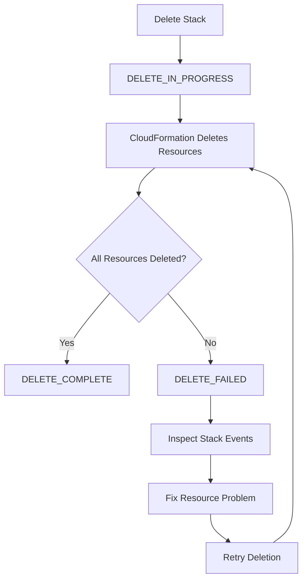
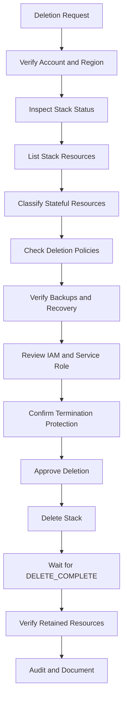

# 04- Stack Deletion and Lifecycle Commands

## Overview

CloudFormation stack deletion is the process of removing a stack and, by default, the resources managed by that stack.

Deletion is not simply the inverse of creation. Production infrastructure often contains stateful resources, dependencies, retained resources, protected stacks, and external resources that require deliberate handling before deletion.

The core lifecycle is:

```text
CloudFormation Stack
        |
        v
Delete Request
        |
        v
DELETE_IN_PROGRESS
        |
        v
Delete Resources
        |
        +----------------------+
        |                      |
        v                      v
DELETE_COMPLETE          DELETE_FAILED
                               |
                               v
                         Investigate
                               |
                               v
                     Retry / Retain / Fix
```

CloudFormation reports deletion through stack events and status transitions. A successful `delete-stack` API request only starts the asynchronous deletion operation; it does not mean the resources have already been removed. :contentReference[oaicite:0]{index=0}

## Why Stack Deletion Requires Care

A CloudFormation stack may manage:

- Compute resources.
- Load balancers.
- IAM roles.
- Security groups.
- S3 buckets.
- Databases.
- Redis or ElastiCache resources.
- Networking infrastructure.
- Nested stacks.
- Application infrastructure.

Some resources are disposable. Others contain business-critical state.

For example:

```text
Production Stack
      |
      +---- ALB              Disposable
      |
      +---- ECS Service      Disposable
      |
      +---- Security Group   Disposable
      |
      +---- S3 Bucket        Stateful
      |
      +---- RDS Database     Highly Stateful
```

Deleting a production stack without understanding the deletion behavior of each resource can cause service disruption or data loss.

## Stack Lifecycle States

CloudFormation exposes lifecycle states that describe what is happening to the stack.

| Status | Meaning |
|---|---|
| `CREATE_IN_PROGRESS` | Stack creation is running |
| `CREATE_COMPLETE` | Stack creation completed |
| `CREATE_FAILED` | Stack creation failed |
| `UPDATE_IN_PROGRESS` | Stack update is running |
| `UPDATE_COMPLETE` | Stack update completed |
| `UPDATE_FAILED` | Stack update failed |
| `UPDATE_ROLLBACK_IN_PROGRESS` | CloudFormation is rolling an update back |
| `UPDATE_ROLLBACK_COMPLETE` | Update rollback completed |
| `UPDATE_ROLLBACK_FAILED` | Update rollback itself failed |
| `DELETE_IN_PROGRESS` | Stack deletion is running |
| `DELETE_COMPLETE` | Stack deletion completed |
| `DELETE_FAILED` | One or more resources could not be deleted |
| `DELETE_SKIPPED` | A resource was intentionally retained |

CloudFormation stack events expose resource-level status and failure reasons, making them the primary diagnostic source for lifecycle operations. :contentReference[oaicite:1]{index=1}

## Inspecting a Stack Before Deletion

Before deleting a stack, inspect its current status:

```bash
aws cloudformation describe-stacks \
  --stack-name backend-api-development \
  --region ap-south-1
```

Get only the current status:

```bash
aws cloudformation describe-stacks \
  --stack-name backend-api-development \
  --region ap-south-1 \
  --query 'Stacks[0].StackStatus' \
  --output text
```

Inspect the resources:

```bash
aws cloudformation list-stack-resources \
  --stack-name backend-api-development \
  --region ap-south-1
```

This is particularly important for production stacks because it identifies what CloudFormation believes it owns.

## Inspecting Stack Events

Before and during deletion, inspect stack events:

```bash
aws cloudformation describe-stack-events \
  --stack-name backend-api-development \
  --region ap-south-1
```

For deletion failures:

```bash
aws cloudformation describe-stack-events \
  --stack-name backend-api-development \
  --region ap-south-1 \
  --query "StackEvents[?ResourceStatus=='DELETE_FAILED'].[LogicalResourceId,ResourceType,ResourceStatusReason]" \
  --output table
```

A typical failure might look conceptually like:

```text
LogicalResourceId     ResourceType             Reason
-------------------   -----------------------  -------------------------
ApplicationBucket     AWS::S3::Bucket          Bucket is not empty
```

The `ResourceStatusReason` is often the fastest way to determine why deletion stopped.

## Basic Stack Deletion

The basic command is:

```bash
aws cloudformation delete-stack \
  --stack-name backend-api-development \
  --region ap-south-1
```

The command initiates deletion.

It does not wait for deletion to finish.

The operation proceeds asynchronously:

```text
delete-stack
     |
     v
API Request Accepted
     |
     v
DELETE_IN_PROGRESS
     |
     v
Resource Deletion
     |
     v
DELETE_COMPLETE
```

For automation, always explicitly wait for the desired lifecycle state.

## Waiting for Stack Deletion

Use the AWS CLI waiter:

```bash
aws cloudformation wait stack-delete-complete \
  --stack-name backend-api-development \
  --region ap-south-1
```

A deployment or cleanup script should generally prefer a state-aware waiter over:

```bash
sleep 300
```

Fixed delays are unreliable because resource deletion time varies.

For example:

```text
S3 bucket deletion       -> depends on object cleanup
RDS deletion             -> may take significant time
Load balancer deletion   -> service dependent
Nested stack deletion    -> depends on child resources
```

## Deletion Lifecycle

A typical deletion sequence looks like:



CloudFormation determines resource dependencies and performs deletion accordingly.

Dependent resources may need to be deleted before their dependencies can be removed.

## Resource Dependencies During Deletion

Suppose an application contains:

```text
VPC
 |
 +-- Subnet
      |
      +-- Load Balancer
      |
      +-- ECS Service
```

CloudFormation must account for those relationships during deletion.

Conceptually:

```text
ECS Service
    |
    v
Load Balancer
    |
    v
Subnet
    |
    v
VPC
```

Deleting the VPC first would fail while dependent resources still exist.

CloudFormation manages dependencies expressed through the stack's resource relationships.

## DeletionPolicy

`DeletionPolicy` controls what CloudFormation does to a resource when the stack is deleted or when the resource is removed from the template.

Example:

```yaml
Resources:
  ApplicationBucket:
    Type: AWS::S3::Bucket
    DeletionPolicy: Retain
```

With `Retain`, CloudFormation removes the resource from stack management but leaves the physical resource in AWS.

The retained resource continues to exist and can continue to incur charges. :contentReference[oaicite:2]{index=2}

### DeletionPolicy Options

| Policy | Behavior |
|---|---|
| `Delete` | Delete the resource |
| `Retain` | Keep the resource |
| `RetainExceptOnCreate` | Retain normally, but delete newly created resources during creation rollback |
| `Snapshot` | Create a snapshot before deletion when supported |

For resources supporting snapshots, `Snapshot` can provide a recovery artifact before deletion. :contentReference[oaicite:3]{index=3}

## `Retain`

Use `Retain` for resources whose lifecycle should be independent from the stack.

Example:

```yaml
Resources:
  ProductionDataBucket:
    Type: AWS::S3::Bucket
    DeletionPolicy: Retain
```

Deleting the stack:

```text
CloudFormation Stack
       |
       +---- Application -> Deleted
       |
       +---- IAM Role -> Deleted
       |
       +---- S3 Bucket -> Retained
```

This is useful for:

- Production data stores.
- Shared storage.
- Long-lived databases.
- Resources managed by separate operational processes.

However, `Retain` can create orphaned resources.

The resource remains in AWS after the stack disappears and must be managed separately. :contentReference[oaicite:4]{index=4}

## `Snapshot`

For supported resources:

```yaml
Resources:
  Database:
    Type: AWS::RDS::DBInstance
    DeletionPolicy: Snapshot
```

During deletion:

```text
RDS Instance
     |
     v
Create Snapshot
     |
     v
Delete Resource
     |
     v
Stack DELETE_COMPLETE
```

The snapshot itself remains and can continue to incur storage charges until deleted. :contentReference[oaicite:5]{index=5}

Snapshot behavior is resource-specific. Do not assume every AWS resource supports `Snapshot`.

## `RetainExceptOnCreate`

`RetainExceptOnCreate` is useful when you want long-lived resources to survive normal stack deletion but do not want an unused resource from a failed initial creation to remain.

Conceptually:

```text
Initial Creation
      |
      +---- Success -> Resource remains
      |
      +---- Rollback -> Resource can be deleted

Later Stack Deletion
      |
      v
Resource retained
```

This is useful for avoiding abandoned resources created during failed initial deployments while still protecting resources during later stack lifecycle operations. :contentReference[oaicite:6]{index=6}

## S3 Bucket Deletion

S3 buckets commonly cause stack deletion failures because a bucket generally must be empty before CloudFormation can delete it.

For example:

```text
CloudFormation
      |
      v
Delete S3 Bucket
      |
      v
Bucket contains objects
      |
      v
DELETE_FAILED
```

AWS specifically identifies non-empty S3 buckets as a common cause of CloudFormation deletion failures. :contentReference[oaicite:7]{index=7}

If the bucket should be deleted:

```bash
aws s3 rm s3://example-application-bucket \
  --recursive
```

Then retry:

```bash
aws cloudformation delete-stack \
  --stack-name backend-api-development \
  --region ap-south-1
```

Be extremely careful with recursive deletion in production.

For production data buckets, `DeletionPolicy: Retain` is often more appropriate than automatically deleting all objects.

## Retaining Resources During Deletion

CloudFormation supports retaining specific resources when a stack is in `DELETE_FAILED`.

Use:

```bash
aws cloudformation delete-stack \
  --stack-name backend-api-development \
  --retain-resources ApplicationBucket \
  --region ap-south-1
```

The value is the **logical resource ID**, not necessarily the physical AWS resource name.

For example:

```yaml
Resources:
  ApplicationBucket:
    Type: AWS::S3::Bucket
```

The logical ID is:

```text
ApplicationBucket
```

The physical bucket name may be completely different.

The `--retain-resources` option is specifically useful when a resource cannot be deleted but the stack itself should be removed. :contentReference[oaicite:8]{index=8}

## Retained Resources and `DELETE_SKIPPED`

When resources are retained during deletion, CloudFormation can report:

```text
DELETE_SKIPPED
```

This means the stack deletion completed without deleting that particular physical resource.

Afterward:

```text
CloudFormation Stack
       |
       v
DELETE_COMPLETE

Retained Resource
       |
       v
Still exists in AWS
```

The retained resource is now outside the active stack lifecycle.

AWS documents `DELETE_SKIPPED` for resources retained through deletion policies or deletion handling. :contentReference[oaicite:9]{index=9}

## `DeletionPolicy` vs `--retain-resources`

These mechanisms solve related but different problems.

| Mechanism | Where Defined | Typical Use |
|---|---|---|
| `DeletionPolicy: Retain` | Template | Permanent lifecycle rule |
| `DeletionPolicy: Snapshot` | Template | Create recovery snapshot |
| `RetainExceptOnCreate` | Template/API | Protect existing resources while cleaning failed creations |
| `--retain-resources` | CLI deletion | Emergency/selective retention during failed deletion |

A production template should encode intentional lifecycle behavior in `DeletionPolicy`.

`--retain-resources` is more appropriate as an operational mechanism when a deletion has already encountered a specific resource problem.

## Termination Protection

Termination protection prevents accidental stack deletion.

Enable it:

```bash
aws cloudformation update-termination-protection \
  --stack-name backend-api-production \
  --enable-termination-protection \
  --region ap-south-1
```

Check the stack configuration:

```bash
aws cloudformation describe-stacks \
  --stack-name backend-api-production \
  --region ap-south-1 \
  --query 'Stacks[0].EnableTerminationProtection' \
  --output text
```

Disable it only when intentional deletion is required:

```bash
aws cloudformation update-termination-protection \
  --stack-name backend-api-production \
  --no-enable-termination-protection \
  --region ap-south-1
```

Termination protection is particularly valuable for:

- Production stacks.
- Database stacks.
- Shared networking stacks.
- Security infrastructure.
- Core platform stacks.

It protects against stack deletion. It does not prevent resource replacement during an update.

## Nested Stack Deletion

Nested stacks introduce additional lifecycle complexity.

```text
Root Stack
   |
   +---- Network Nested Stack
   |
   +---- Security Nested Stack
   |
   +---- Application Nested Stack
```

Deleting the parent stack can trigger deletion of child stacks.

The child stacks must therefore be considered when troubleshooting:

```text
Root DELETE_IN_PROGRESS
       |
       +---- Network DELETE_IN_PROGRESS
       |
       +---- Security DELETE_IN_PROGRESS
       |
       +---- Application DELETE_IN_PROGRESS
```

If a nested resource fails, inspect the nested stack's events and logical resource relationships.

## Deleting Nested Stacks Independently

A nested stack is managed by its parent stack.

Do not treat a nested stack like an ordinary independent stack.

The parent CloudFormation stack owns the lifecycle relationship.

For nested stacks, investigate the root stack first:

```bash
aws cloudformation list-stack-resources \
  --stack-name backend-platform-production \
  --region ap-south-1
```

Then inspect the nested stack as required.

## `DELETE_FAILED`

A stack can enter:

```text
DELETE_FAILED
```

when one or more resources cannot be deleted.

Common causes include:

| Cause | Example |
|---|---|
| Resource contains data | Non-empty S3 bucket |
| Missing permissions | CloudFormation cannot delete resource |
| Dependency exists | Resource still referenced |
| External modification | Resource state changed outside CloudFormation |
| Service-specific constraint | AWS service refuses deletion |
| Nested stack failure | Child stack cannot complete deletion |

AWS recommends examining the failed resource and correcting the underlying issue before retrying deletion. :contentReference[oaicite:10]{index=10}

## Diagnosing `DELETE_FAILED`

Start with:

```bash
aws cloudformation describe-stack-events \
  --stack-name backend-api-production \
  --region ap-south-1 \
  --query "StackEvents[?ResourceStatus=='DELETE_FAILED'].[LogicalResourceId,ResourceType,ResourceStatusReason]" \
  --output table
```

Then inspect the resource:

```bash
aws cloudformation list-stack-resources \
  --stack-name backend-api-production \
  --region ap-south-1
```

Determine:

1. Which logical resource failed?
2. What is the physical resource?
3. Why did deletion fail?
4. Is the resource stateful?
5. Should it be retained?
6. Can the underlying AWS service delete it?
7. Does the CloudFormation execution role have the required permissions?

## IAM Permissions During Deletion

CloudFormation must have permission to delete the underlying AWS resources.

For example:

```text
CloudFormation
      |
      v
Service Role
      |
      +---- s3:DeleteBucket
      |
      +---- ec2:DeleteSecurityGroup
      |
      +---- iam:DeleteRole
      |
      +---- rds:DeleteDBInstance
```

A CloudFormation deployment role can have permission to operate CloudFormation while the CloudFormation service role has permissions required to manage the infrastructure.

If the service role is missing required permissions, deletion can fail.

The CloudFormation service role is used by CloudFormation to make calls on behalf of the deployment operation. :contentReference[oaicite:11]{index=11}

## Deleting with a Service Role

A deletion can explicitly specify a role:

```bash
aws cloudformation delete-stack \
  --stack-name backend-api-production \
  --role-arn arn:aws:iam::123456789012:role/CloudFormationServiceRole \
  --region ap-south-1
```

If no role is specified, CloudFormation can use the role previously associated with the stack. :contentReference[oaicite:12]{index=12}

This is important in environments where the identity initiating the CLI command is intentionally restricted.

## Deleting Resources Outside CloudFormation

Manual resource deletion is dangerous.

Suppose a stack contains:

```text
CloudFormation
      |
      +---- RDS
      +---- S3
      +---- ECS
```

Someone manually deletes the RDS database.

CloudFormation still believes the resource exists.

Later operations may fail because CloudFormation's recorded state no longer matches reality.

This is one reason infrastructure changes should normally flow through CloudFormation rather than direct console changes.

AWS specifically documents externally deleted resources as a possible cause of rollback and lifecycle failures. :contentReference[oaicite:13]{index=13}

## When Manual Deletion Is Necessary

There are cases where direct deletion may be required to recover from a failed operation.

Before doing so:

- Confirm the resource is safe to delete.
- Identify the physical resource.
- Check whether it contains data.
- Verify dependencies.
- Understand how CloudFormation will interpret the change.
- Document the manual intervention.
- Reconcile the template and actual infrastructure afterward.

Manual intervention should be treated as an exception, not normal infrastructure management.

## Deletion and Stateful Resources

Stateful resources deserve special treatment.

Typical examples:

```text
S3 Bucket
RDS Database
EBS Volume
ElastiCache Data
DynamoDB Table
```

For each stateful resource, define an explicit policy:

| Resource | Typical Strategy |
|---|---|
| Development S3 | Delete |
| Production S3 | Retain |
| Development RDS | Snapshot/Delete |
| Production RDS | Snapshot/Retain |
| Production EBS | Snapshot/Retain |
| Temporary cache | Delete |
| Critical data store | Retain + independent backup |

The exact policy depends on recovery objectives and data governance requirements.

## Deletion and Disaster Recovery

CloudFormation deletion controls are not a substitute for backups.

For example:

```text
DeletionPolicy: Retain
        |
        v
Resource survives stack deletion
```

This protects the resource from stack deletion, but it does not provide:

- Point-in-time recovery.
- Cross-region replication.
- Backup verification.
- Disaster recovery testing.
- Application-level recovery.

A robust strategy combines CloudFormation lifecycle controls with independent backup and recovery mechanisms.

## Stack Deletion in CI/CD

A development environment can safely use automated cleanup:

```bash
aws cloudformation delete-stack \
  --stack-name backend-api-pr-${PR_NUMBER} \
  --region ap-south-1

aws cloudformation wait stack-delete-complete \
  --stack-name backend-api-pr-${PR_NUMBER} \
  --region ap-south-1
```

This is useful for temporary environments.

For production:

```text
Production Deletion Request
          |
          v
Authorization
          |
          v
Review
          |
          v
Termination Protection Check
          |
          v
Resource Impact Review
          |
          v
Deletion
          |
          v
Verification
```

Production stack deletion should normally require stronger controls than development cleanup.

## Ephemeral Environments

CloudFormation is useful for creating temporary environments for:

- Pull requests.
- Integration testing.
- Feature validation.
- Staging experiments.

For example:

```text
Pull Request #142
       |
       v
Create Stack
       |
       v
Run Tests
       |
       v
Destroy Stack
```

The cleanup process should be reliable.

If the stack deletion fails, the pipeline should report the failure rather than silently continuing.

## Idempotent Cleanup

A good cleanup script should be safe to retry.

Conceptually:

```bash
if stack_exists; then
    delete_stack
    wait_for_delete
fi
```

The script should account for:

- Stack already deleted.
- Stack currently deleting.
- Stack in `DELETE_FAILED`.
- Resources configured with `Retain`.
- Temporary resources outside the stack.

Avoid assuming that every cleanup starts from a perfect state.

## Listing Deleted Stacks

CloudFormation normally removes an active stack from the normal stack list after deletion, but deleted stack information can remain available for a period.

List stacks:

```bash
aws cloudformation list-stacks \
  --region ap-south-1
```

Filter deleted stacks:

```bash
aws cloudformation list-stacks \
  --stack-status-filter DELETE_COMPLETE \
  --region ap-south-1
```

This can help investigate recently deleted infrastructure.

## Stack Lifecycle Inspection

A useful operational command sequence is:

```bash
aws cloudformation describe-stacks \
  --stack-name backend-api-production \
  --region ap-south-1

aws cloudformation list-stack-resources \
  --stack-name backend-api-production \
  --region ap-south-1

aws cloudformation describe-stack-events \
  --stack-name backend-api-production \
  --region ap-south-1
```

Together these provide:

```text
describe-stacks
      |
      +---- Stack-level state

list-stack-resources
      |
      +---- Resource inventory

describe-stack-events
      |
      +---- Lifecycle history
```

## Common Lifecycle Commands

| Operation | CLI Command |
|---|---|
| Inspect stack | `aws cloudformation describe-stacks` |
| List resources | `aws cloudformation list-stack-resources` |
| Inspect events | `aws cloudformation describe-stack-events` |
| Create stack | `aws cloudformation create-stack` |
| Update stack | `aws cloudformation update-stack` |
| Delete stack | `aws cloudformation delete-stack` |
| Wait for creation | `aws cloudformation wait stack-create-complete` |
| Wait for update | `aws cloudformation wait stack-update-complete` |
| Wait for deletion | `aws cloudformation wait stack-delete-complete` |
| Enable termination protection | `aws cloudformation update-termination-protection --enable-termination-protection` |
| Disable termination protection | `aws cloudformation update-termination-protection --no-enable-termination-protection` |
| Continue failed rollback | `aws cloudformation continue-update-rollback` |
| Roll back failed stack operation | `aws cloudformation rollback-stack` |

## `rollback-stack`

For stacks using the newer failure-handling workflow, `rollback-stack` can roll a stack from `CREATE_FAILED` or `UPDATE_FAILED` back to its last known stable state.

Example:

```bash
aws cloudformation rollback-stack \
  --stack-name backend-api-development \
  --region ap-south-1
```

A last known stable state includes states such as:

```text
CREATE_COMPLETE
UPDATE_COMPLETE
UPDATE_ROLLBACK_COMPLETE
IMPORT_COMPLETE
IMPORT_ROLLBACK_COMPLETE
```

If the stack has no last known stable state, the rollback operation can delete the stack. :contentReference[oaicite:14]{index=14}

This command should therefore be used with an understanding of the stack's current state.

## `continue-update-rollback`

If an update rollback fails:

```text
UPDATE_ROLLBACK_FAILED
```

the stack cannot normally proceed with another update until the rollback problem is resolved.

Use:

```bash
aws cloudformation continue-update-rollback \
  --stack-name backend-api-production \
  --region ap-south-1
```

CloudFormation attempts to continue returning the stack to:

```text
UPDATE_ROLLBACK_COMPLETE
```

AWS recommends fixing the underlying resource problem before continuing the rollback where possible. :contentReference[oaicite:15]{index=15}

## Skipping Resources During Rollback

In advanced recovery scenarios:

```bash
aws cloudformation continue-update-rollback \
  --stack-name backend-api-production \
  --resources-to-skip ResourceLogicalId \
  --region ap-south-1
```

This is dangerous because skipped resources can become inconsistent with the template.

For nested stacks, resource identifiers can use the nested stack name and resource logical ID:

```text
NestedStackName.ResourceLogicalId
```

AWS explicitly warns that skipped resources can leave the stack state inconsistent with the template, potentially causing later updates to fail. :contentReference[oaicite:16]{index=16}

## Force Deletion

Current CloudFormation supports additional deletion behavior for failed stack deletion scenarios, including force deletion.

For example:

```bash
aws cloudformation delete-stack \
  --stack-name backend-api-development \
  --deletion-mode FORCE_DELETE_STACK \
  --region ap-south-1
```

Force deletion should be treated as a recovery mechanism rather than a normal cleanup strategy.

AWS documents that resources skipped during forced deletion can subsequently be identified through stack resource inspection and may show `DELETE_SKIPPED`. :contentReference[oaicite:17]{index=17}

Before using force deletion:

- Identify failed resources.
- Determine whether they contain data.
- Understand what will remain.
- Record the physical resources.
- Plan independent cleanup if required.

## Production Deletion Workflow

A controlled production workflow can look like:



This is substantially safer than:

```bash
aws cloudformation delete-stack --stack-name production
```

with no pre-deletion review.

## Security Considerations

Stack deletion is a high-impact administrative operation.

A deployment identity capable of deleting CloudFormation stacks may indirectly be capable of deleting:

- Databases.
- Storage.
- IAM resources.
- Networking.
- Security controls.
- Application infrastructure.

Production controls should include:

- Least-privilege IAM.
- Dedicated deployment roles.
- Strong authentication.
- CI/CD authorization.
- Separate production AWS accounts where appropriate.
- CloudTrail auditing.
- Termination protection.
- Explicit approval for destructive operations.
- Resource-level safeguards for critical data.

Do not grant broad deletion permissions simply because they make automation easier.

## Cost Considerations

Deletion can reduce infrastructure costs, but retained resources can continue generating charges.

For example:

```text
DELETE_COMPLETE
       |
       +---- Retained S3 bucket -> Still billed
       |
       +---- RDS snapshot -> Still billed
       |
       +---- Retained database -> Still billed
```

AWS notes that retained resources and snapshots can continue to incur applicable charges after stack deletion. :contentReference[oaicite:18]{index=18}

A cleanup process should therefore inventory retained resources after deletion.

## Observability and Auditability

CloudFormation events provide lifecycle information:

```bash
aws cloudformation describe-stack-events \
  --stack-name backend-api-production \
  --region ap-south-1
```

For production environments, combine this with:

- CloudTrail.
- AWS Config where appropriate.
- CI/CD deployment logs.
- Application monitoring.
- AWS service logs.
- Cost monitoring.

This creates a stronger operational record:

```text
Git Commit
    |
    v
CI/CD Deployment
    |
    v
CloudFormation Operation
    |
    v
CloudTrail
    |
    v
Resource Lifecycle
```

## Common Mistakes

### Deleting Production Without Checking Resources

A stack can contain databases and production data.

Always inspect:

```bash
aws cloudformation list-stack-resources \
  --stack-name backend-api-production
```

before destructive operations.

### Assuming `delete-stack` Waits

It does not wait for completion.

Use:

```bash
aws cloudformation wait stack-delete-complete \
  --stack-name backend-api-production
```

### Forgetting Termination Protection

A production stack may intentionally reject deletion because termination protection is enabled.

Check the stack configuration before troubleshooting the deletion command.

### Assuming `Retain` Deletes Nothing

`Retain` means the resource remains in AWS after the stack is deleted.

It can continue incurring costs and must be managed independently. :contentReference[oaicite:19]{index=19}

### Using `--retain-resources` Without Tracking the Resource

The stack may disappear while the physical resource remains.

Record the retained resource and assign ownership.

### Manually Deleting CloudFormation Resources

Deleting resources outside CloudFormation can cause drift between the template and actual infrastructure.

Use direct deletion only as a deliberate recovery operation.

### Ignoring `DELETE_FAILED`

Repeatedly retrying the same command without fixing the underlying problem does not solve the failure.

Inspect:

```bash
aws cloudformation describe-stack-events \
  --stack-name backend-api-production
```

### Using Force Deletion as the First Option

Force deletion is a recovery mechanism.

It should not replace understanding why normal deletion failed.

### Forgetting Retained Resource Costs

A successful stack deletion does not necessarily mean every AWS resource disappeared.

Inventory retained resources after deletion.

### Treating Rollback Commands as Harmless

Commands such as `rollback-stack` and `continue-update-rollback` can materially change infrastructure state.

Always inspect the current stack status before using them.

## Production Deletion Checklist

- [ ] Confirm the AWS account.
- [ ] Confirm the AWS Region.
- [ ] Confirm the exact stack name.
- [ ] Inspect the current stack status.
- [ ] List all stack resources.
- [ ] Identify stateful resources.
- [ ] Review `DeletionPolicy` values.
- [ ] Verify database and storage backups.
- [ ] Verify whether termination protection is enabled.
- [ ] Confirm the CloudFormation execution/service role.
- [ ] Confirm deletion permissions.
- [ ] Review nested stacks.
- [ ] Review resources managed outside CloudFormation.
- [ ] Obtain required production approval.
- [ ] Execute deletion.
- [ ] Wait for `DELETE_COMPLETE`.
- [ ] Investigate `DELETE_FAILED` immediately if encountered.
- [ ] Record retained resources.
- [ ] Verify retained resources have an owner.
- [ ] Verify retained resources do not create unexpected cost.
- [ ] Review CloudFormation events.
- [ ] Review CloudTrail where required.
- [ ] Document any manual recovery actions.

## Interview Traps

### Does `delete-stack` Immediately Delete Everything?

No. It starts an asynchronous deletion operation.

### What Happens to Resources with `DeletionPolicy: Retain`?

The stack is deleted, but the retained resources remain in AWS and continue to exist independently of the stack. :contentReference[oaicite:20]{index=20}

### What Causes `DELETE_FAILED`?

Typical causes include:

- Non-empty resources.
- Missing IAM permissions.
- Service-specific deletion restrictions.
- Dependencies.
- Nested stack failures.
- Resource state inconsistent with CloudFormation.

### How Do You Debug `DELETE_FAILED`?

Start with:

```bash
aws cloudformation describe-stack-events \
  --stack-name my-stack
```

Then identify the failed logical resource and inspect the underlying AWS resource.

### What Is the Difference Between `DeletionPolicy: Retain` and `--retain-resources`?

`DeletionPolicy: Retain` is a template-defined lifecycle rule.

`--retain-resources` is an operational CLI mechanism for retaining specified resources during deletion, particularly when a stack is in `DELETE_FAILED`.

### Does Termination Protection Prevent Resource Replacement?

No.

Termination protection protects against stack deletion. An update can still replace resources when the template requires it.

### What Happens if an S3 Bucket Is Not Empty?

CloudFormation may fail to delete the bucket. You must either empty it safely or retain it. :contentReference[oaicite:21]{index=21}

### Why Is `UPDATE_ROLLBACK_FAILED` Relevant to Lifecycle Management?

A stack in `UPDATE_ROLLBACK_FAILED` cannot normally be updated until the rollback problem is resolved. You may need to fix the underlying resource problem and run `continue-update-rollback`. :contentReference[oaicite:22]{index=22}

### Is a Retained Resource Still Managed by CloudFormation?

No. Once the stack deletion completes, a retained resource remains physically present but is no longer managed as part of that deleted stack.

### Does `DELETE_COMPLETE` Mean No AWS Resources Remain?

Not necessarily.

Resources can be retained through `DeletionPolicy`, `--retain-resources`, or other lifecycle behavior.

## Key Takeaways

- `delete-stack` starts an asynchronous deletion operation.
- Use `aws cloudformation wait stack-delete-complete` when automation must wait for completion.
- Always inspect stack resources before deleting important infrastructure.
- `DELETE_FAILED` means one or more resources could not be removed.
- Stack events are the primary source for diagnosing lifecycle failures.
- `DeletionPolicy` should explicitly define the lifecycle behavior of important stateful resources.
- `Retain` keeps the physical resource after stack deletion and can continue to incur charges.
- `Snapshot` creates a snapshot for supported resource types before deletion.
- `RetainExceptOnCreate` can protect existing resources while avoiding orphaned resources from failed initial creation.
- `--retain-resources` provides an operational mechanism for retaining specific resources during failed deletion.
- `DELETE_SKIPPED` indicates that a resource was intentionally retained during stack deletion.
- S3 buckets commonly fail deletion when they still contain objects.
- Termination protection is an important safeguard for production stacks.
- Termination protection prevents stack deletion but does not prevent resource replacement during updates.
- Nested stacks require investigation at both parent and child levels.
- CloudFormation service roles must have the permissions required to delete underlying AWS resources.
- Directly modifying or deleting resources outside CloudFormation can create state inconsistencies.
- `UPDATE_ROLLBACK_FAILED` requires recovery before normal stack updates can continue.
- `continue-update-rollback` can recover a failed rollback, but skipped resources can leave the stack inconsistent with the template.
- `rollback-stack` can return certain failed stack operations to the last known stable state and can delete a stack when no stable state exists.
- Force deletion should be treated as a recovery mechanism, not normal lifecycle management.
- Retained resources and snapshots can continue generating AWS charges after stack deletion.
- Production stack deletion should be treated as a controlled destructive operation with authorization, resource review, backup verification, monitoring, and post-deletion auditing.