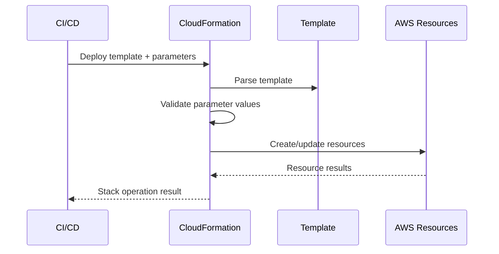
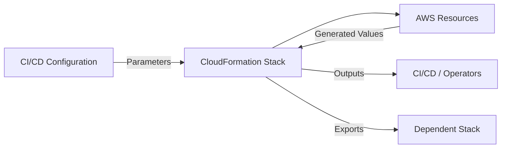
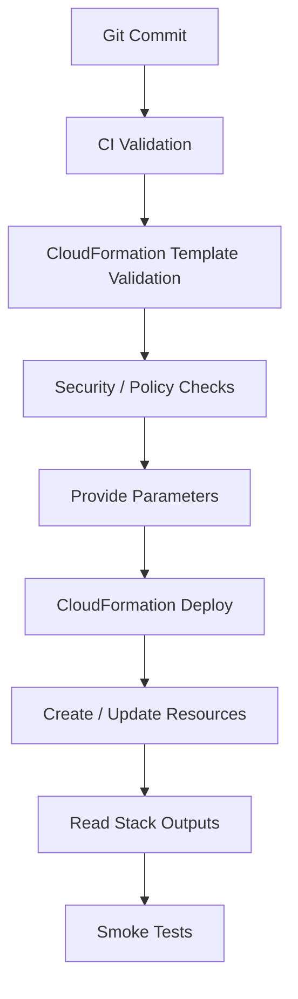

# 05- Parameters and Outputs

## Overview

CloudFormation parameters and outputs provide the primary interface for making templates reusable across environments and exposing useful stack information after deployment.

Parameters allow values to be supplied when a stack is created or updated. Outputs expose values produced by resources or stack configuration so they can be consumed by operators, other stacks, automation, or deployment pipelines.

A production CloudFormation template should avoid hardcoding environment-specific values whenever those values are expected to vary.

```text
CI/CD Pipeline
      |
      | Parameters
      v
CloudFormation Stack
      |
      +---- Resources
      |       |
      |       +---- VPC
      |       +---- ALB
      |       +---- ECS
      |       +---- RDS
      |
      | Outputs
      v
Stack Information
      |
      +---- Load Balancer DNS
      +---- VPC ID
      +---- API Endpoint
      +---- Resource ARN
```

Parameters and outputs are different mechanisms:

| Feature | Parameters | Outputs |
|---|---|---|
| Direction | Input to stack | Output from stack |
| Supplied by | User, CLI, CI/CD, automation | CloudFormation |
| Primary purpose | Configuration | Exposing resource information |
| Available during deployment | Yes | Produced after resources are created |
| Typical values | Environment, VPC ID, instance type | ARN, DNS name, resource ID |
| Cross-stack use | As input | Export/import |
| Secret storage | Not recommended | Not recommended |

## Parameters

A parameter is a value supplied to CloudFormation when a stack is created or updated.

Example:

```yaml
Parameters:
  Environment:
    Type: String
    Default: dev
    AllowedValues:
      - dev
      - staging
      - production

  InstanceType:
    Type: String
    Default: t3.micro
```

The template can then reference the parameters:

```yaml
Resources:
  ApplicationServer:
    Type: AWS::EC2::Instance
    Properties:
      InstanceType: !Ref InstanceType
```

The important design principle is:

```text
Template
  |
  +---- Stable infrastructure definition
  |
  +---- Parameters
          |
          +---- Environment-specific values
          +---- Deployment-specific values
```

This allows one template to support multiple environments without copying the template.

## Why Parameters Exist

Without parameters, environment-specific configuration tends to become hardcoded:

```yaml
Resources:
  ApplicationServer:
    Type: AWS::EC2::Instance
    Properties:
      InstanceType: t3.micro
```

A production deployment might require:

```text
dev         -> t3.micro
staging     -> t3.small
production  -> t3.medium
```

Instead of maintaining three templates, use one template:

```yaml
Parameters:
  InstanceType:
    Type: String
```

Then provide the appropriate value during deployment.

This improves:

- Template reuse.
- Environment consistency.
- CI/CD integration.
- Infrastructure maintainability.
- Configuration management.

## Parameter Lifecycle

Parameters are resolved during stack operations.



The parameter itself is not a separate AWS resource.

It is stack configuration consumed by CloudFormation during the operation.

## Parameter Types

CloudFormation supports several parameter types.

Common types include:

| Type | Purpose |
|---|---|
| `String` | General string value |
| `Number` | Numeric value |
| `List<Number>` | List of numbers |
| `CommaDelimitedList` | Comma-separated string values |
| `AWS::EC2::AvailabilityZone::Name` | Availability Zone name |
| `AWS::EC2::KeyPair::KeyName` | EC2 key pair |
| `AWS::EC2::SecurityGroup::Id` | Security group ID |
| `AWS::EC2::Subnet::Id` | Subnet ID |
| `AWS::EC2::VPC::Id` | VPC ID |
| `AWS::SSM::Parameter::Value<String>` | Value retrieved from Systems Manager Parameter Store |

Use AWS-specific parameter types when CloudFormation should validate that the supplied value corresponds to an appropriate AWS resource.

## String Parameters

The most common parameter type is `String`.

```yaml
Parameters:
  Environment:
    Type: String
```

Deploy with:

```bash
aws cloudformation create-stack \
  --stack-name backend-api-dev \
  --template-body file://template.yaml \
  --parameters \
    ParameterKey=Environment,ParameterValue=dev
```

For multiple parameters:

```bash
aws cloudformation create-stack \
  --stack-name backend-api-dev \
  --template-body file://template.yaml \
  --parameters \
    ParameterKey=Environment,ParameterValue=dev \
    ParameterKey=InstanceType,ParameterValue=t3.small
```

## Parameter Constraints

Parameters should generally constrain acceptable values.

Example:

```yaml
Parameters:
  Environment:
    Type: String
    AllowedValues:
      - dev
      - staging
      - production

  ApplicationPort:
    Type: Number
    Default: 8000
    MinValue: 1
    MaxValue: 65535
```

Constraints shift validation closer to the infrastructure boundary.

Instead of allowing an invalid value to reach resource creation:

```text
CI/CD
  |
  v
CloudFormation
  |
  v
Parameter Validation
  |
  +---- Invalid -> Fail early
  |
  +---- Valid -> Create/Update resources
```

## Default Values

Parameters can define defaults:

```yaml
Parameters:
  InstanceType:
    Type: String
    Default: t3.micro
```

Defaults are useful for safe development-oriented values.

However, avoid defaults for values that must always be explicitly selected in production.

For example:

```yaml
Parameters:
  ProductionVpcId:
    Type: AWS::EC2::VPC::Id
```

Requiring the deployment system to provide the VPC ID may be safer than silently deploying into an unintended default VPC.

## AllowedValues

Use `AllowedValues` when the valid set is known.

```yaml
Parameters:
  Environment:
    Type: String
    AllowedValues:
      - dev
      - staging
      - production
```

This prevents invalid environment names such as:

```text
prod
production-env
live
prd
```

when the architecture expects a specific set.

## AllowedPattern

For string validation:

```yaml
Parameters:
  Environment:
    Type: String
    AllowedPattern: '^(dev|staging|production)$'
```

For more complex validation:

```yaml
Parameters:
  ApplicationName:
    Type: String
    AllowedPattern: '^[a-z][a-z0-9-]{2,30}$'
    ConstraintDescription: Must contain 3-31 lowercase letters, numbers, or hyphens.
```

Use constraints to reject malformed values before resource provisioning begins.

## MinLength and MaxLength

String length can be constrained:

```yaml
Parameters:
  ApplicationName:
    Type: String
    MinLength: 3
    MaxLength: 31
```

This is useful when downstream AWS resource names have length or formatting requirements.

## Parameter Metadata

`Metadata` can improve the usability of parameters in interfaces such as the CloudFormation console.

Example:

```yaml
Metadata:
  AWS::CloudFormation::Interface:
    ParameterGroups:
      - Label:
          default: Application Configuration
        Parameters:
          - Environment
          - ApplicationPort

    ParameterLabels:
      Environment:
        default: Deployment Environment
      ApplicationPort:
        default: Application Port
```

This does not change infrastructure behavior. It improves parameter organization and presentation.

## Referencing Parameters

Use `Ref` to retrieve a parameter value:

```yaml
Parameters:
  Environment:
    Type: String
    Default: dev

Resources:
  ApplicationBucket:
    Type: AWS::S3::Bucket
    Properties:
      Tags:
        - Key: Environment
          Value: !Ref Environment
```

The parameter value flows into the resource:

```text
Parameter
    |
    | !Ref
    v
Resource Property
```

## Parameter References with `!Sub`

Parameters can also be used with string substitution.

```yaml
Parameters:
  Environment:
    Type: String
    Default: dev

Resources:
  ApplicationBucket:
    Type: AWS::S3::Bucket
    Properties:
      BucketName: !Sub "backend-api-${Environment}-data"
```

For:

```text
Environment = production
```

the resulting value becomes conceptually:

```text
backend-api-production-data
```

## Parameter References with `!If`

Parameters can drive conditional infrastructure.

```yaml
Parameters:
  Environment:
    Type: String
    AllowedValues:
      - dev
      - production

Conditions:
  IsProduction: !Equals
    - !Ref Environment
    - production
```

The condition can then influence resources or properties.

```yaml
Resources:
  Database:
    Type: AWS::RDS::DBInstance
    Properties:
      DeletionProtection: !If
        - IsProduction
        - true
        - false
```

This allows one template to encode controlled environment-specific behavior.

## AWS-Specific Parameter Types

AWS-specific parameter types provide stronger validation than generic strings.

Example:

```yaml
Parameters:
  VpcId:
    Type: AWS::EC2::VPC::Id

  SubnetId:
    Type: AWS::EC2::Subnet::Id

  SecurityGroupId:
    Type: AWS::EC2::SecurityGroup::Id
```

Instead of accepting:

```text
VpcId = hello
```

CloudFormation expects a value corresponding to the relevant AWS resource type.

This is preferable when the parameter represents an existing AWS resource.

## Systems Manager Parameter Types

CloudFormation can retrieve values from Systems Manager Parameter Store through parameter types such as:

```yaml
Parameters:
  ApplicationConfig:
    Type: AWS::SSM::Parameter::Value<String>
    Default: /backend-api/config
```

The template can then reference:

```yaml
Resources:
  ApplicationServer:
    Type: AWS::EC2::Instance
    Properties:
      Tags:
        - Key: Configuration
          Value: !Ref ApplicationConfig
```

This is useful for configuration that should not be hardcoded into templates.

For sensitive values, however, Parameter Store `SecureString` and Secrets Manager should be considered as part of a broader secrets-management strategy rather than exposing secret values through normal CloudFormation outputs or stack configuration.

## Parameters Are Not a Secrets Management System

Do not treat ordinary CloudFormation parameters as secure storage.

Avoid:

```yaml
Parameters:
  DatabasePassword:
    Type: String
```

with a password passed directly through shell history, CI logs, or plaintext configuration files.

A better architecture is:

```text
CI/CD
  |
  v
CloudFormation
  |
  v
Secret Reference
  |
  +---- Secrets Manager
  |
  +---- SSM Parameter Store
```

Sensitive configuration should be managed using dedicated AWS secret/configuration services and appropriate IAM controls.

## Parameter Store vs Secrets Manager

| Requirement | SSM Parameter Store | Secrets Manager |
|---|---|---|
| Configuration values | Excellent | Good |
| Secrets | Supported with `SecureString` | Excellent |
| Automatic secret rotation | Limited/service-dependent | Strong |
| Application configuration | Excellent | Good |
| Secret lifecycle | Good | Strong |
| Typical use | URLs, IDs, configuration | Database credentials, API secrets |

The choice should be based on operational requirements rather than simply whether a value is called a "parameter."

## Parameter Values in CI/CD

A CI/CD pipeline can provide parameters explicitly:

```bash
aws cloudformation deploy \
  --stack-name backend-api-production \
  --template-file template.yaml \
  --parameter-overrides \
    Environment=production \
    InstanceType=t3.medium
```

This creates a clean separation:

```text
CloudFormation Template
        |
        +---- Infrastructure definition

CI/CD Configuration
        |
        +---- Environment-specific values
```

The template should describe infrastructure behavior while deployment configuration determines environment-specific inputs.

## Parameter Files

For larger deployments, parameter values can be maintained separately.

Example:

```text
cloudformation/
├── template.yaml
└── parameters/
    ├── dev.json
    ├── staging.json
    └── production.json
```

Example:

```json
[
  {
    "ParameterKey": "Environment",
    "ParameterValue": "production"
  },
  {
    "ParameterKey": "InstanceType",
    "ParameterValue": "t3.medium"
  }
]
```

Deploy:

```bash
aws cloudformation deploy \
  --stack-name backend-api-production \
  --template-file template.yaml \
  --parameter-overrides file://parameters/production.json
```

Keep secrets out of these files unless they are securely generated, stored, and injected by the deployment system.

## Parameter Changes During Stack Updates

When updating a stack, CloudFormation can reuse existing parameter values if new values are not supplied.

Example:

```bash
aws cloudformation deploy \
  --stack-name backend-api-production \
  --template-file template.yaml
```

Existing parameter values can remain associated with the stack.

Explicitly supplying parameters is often preferable in CI/CD because it makes the deployment configuration deterministic and visible in the deployment process.

## Inspecting Existing Parameter Values

Retrieve stack parameters:

```bash
aws cloudformation describe-stacks \
  --stack-name backend-api-production \
  --query 'Stacks[0].Parameters' \
  --output table
```

Example output:

```text
ParameterKey     ParameterValue
---------------  ----------------
Environment      production
InstanceType     t3.medium
VpcId            vpc-0123456789abcdef
```

Be careful when inspecting stacks containing sensitive parameter values.

Do not automatically print potentially sensitive values into CI logs.

## Parameter Count and Template Design

Parameters should represent meaningful deployment configuration.

Good:

```yaml
Parameters:
  Environment:
    Type: String

  VpcId:
    Type: AWS::EC2::VPC::Id

  ApplicationImage:
    Type: String
```

Poor:

```yaml
Parameters:
  BucketName:
    Type: String

  SecurityGroupName:
    Type: String

  RoleName:
    Type: String

  SubnetName:
    Type: String

  RandomSuffix:
    Type: String
```

If CloudFormation can create a resource and determine its relationship automatically, avoid unnecessarily externalizing internal implementation details.

Excessive parameters make templates harder to deploy correctly.

## Parameters vs Mappings vs Conditions

These mechanisms solve different problems.

| Mechanism | Primary Purpose |
|---|---|
| Parameters | Values supplied externally |
| Mappings | Static lookup data inside template |
| Conditions | Conditional resource/property behavior |
| Outputs | Values exposed after deployment |
| Resources | Infrastructure definitions |

For example:

```text
Parameter
Environment=production
        |
        v
Condition
IsProduction=true
        |
        v
Resource
Production configuration
```

Do not use parameters for values that are truly static across all environments.

## Outputs

Outputs expose values generated by a stack.

Example:

```yaml
Outputs:
  LoadBalancerDNS:
    Description: Application load balancer DNS name
    Value: !GetAtt ApplicationLoadBalancer.DNSName
```

After deployment:

```text
CloudFormation Stack
        |
        v
Load Balancer
        |
        v
DNS Name
        |
        v
CloudFormation Output
```

Outputs are useful for both humans and automation.

## Why Outputs Exist

CloudFormation resources often generate identifiers that are unknown before deployment.

For example:

```text
VPC ID
Subnet ID
Load Balancer DNS
Security Group ID
IAM Role ARN
```

Rather than hardcoding these values, expose them through outputs.

Example:

```yaml
Outputs:
  VpcId:
    Description: VPC identifier
    Value: !Ref VPC
```

## Output Structure

A typical output contains:

```yaml
Outputs:
  ApiEndpoint:
    Description: Public API endpoint
    Value: !Sub "https://${ApplicationLoadBalancer.DNSName}"
```

The major fields are:

| Field | Purpose |
|---|---|
| `Description` | Human-readable explanation |
| `Value` | Value returned by the stack |
| `Export` | Makes the value available to other stacks |
| `Condition` | Controls whether the output is created |

## Output References

Outputs can use intrinsic functions.

```yaml
Outputs:
  VpcId:
    Value: !Ref VPC

  LoadBalancerArn:
    Value: !GetAtt ApplicationLoadBalancer.LoadBalancerArn

  LoadBalancerDns:
    Value: !GetAtt ApplicationLoadBalancer.DNSName
```

`Ref` and `GetAtt` have different meanings.

For many AWS resources:

```text
!Ref
  -> Primary resource identifier

!GetAtt
  -> Specific resource attribute
```

Always check the resource's CloudFormation specification to determine what `Ref` returns and which attributes are available through `GetAtt`.

## Outputs in Backend Infrastructure

A backend platform may expose:

```yaml
Outputs:
  VpcId:
    Description: Backend VPC ID
    Value: !Ref VPC

  LoadBalancerDNS:
    Description: Backend API load balancer DNS
    Value: !GetAtt ApplicationLoadBalancer.DNSName

  ApplicationRoleArn:
    Description: Application IAM role ARN
    Value: !GetAtt ApplicationRole.Arn
```

These outputs can then be consumed by:

- Deployment scripts.
- CI/CD pipelines.
- Infrastructure automation.
- Developers.
- Other CloudFormation stacks.

## Viewing Stack Outputs

Use:

```bash
aws cloudformation describe-stacks \
  --stack-name backend-api-production \
  --query 'Stacks[0].Outputs' \
  --output table
```

Example:

```text
OutputKey             OutputValue
--------------------  --------------------------------------
VpcId                 vpc-0123456789abcdef
LoadBalancerDNS       api-production.example.com
ApplicationRoleArn    arn:aws:iam::123456789012:role/backend
```

## Exporting Outputs

An output can be exported:

```yaml
Outputs:
  VpcId:
    Description: Shared VPC identifier
    Value: !Ref VPC
    Export:
      Name: SharedVpcId
```

The exported value can be imported by another stack.

```yaml
Resources:
  ApplicationSubnet:
    Type: AWS::EC2::Subnet
    Properties:
      VpcId:
        Fn::ImportValue: SharedVpcId
```

This creates an explicit dependency between stacks.

## Cross-Stack References

Cross-stack references are useful when infrastructure is intentionally separated.

Example:

```text
Network Stack
     |
     +---- VPC
     +---- Subnets
     +---- Security Groups
     |
     | Export
     v
Application Stack
     |
     +---- ECS
     +---- ALB
     +---- Auto Scaling
```

The application stack imports the network stack's exported values.

## ImportValue

Use:

```yaml
VpcId:
  Fn::ImportValue: SharedVpcId
```

Or short form:

```yaml
VpcId: !ImportValue SharedVpcId
```

This avoids hardcoding resource IDs between stacks.

## Cross-Stack Dependency

Once another stack imports an exported value, the exporting stack cannot freely remove or modify that export while it is still being referenced.

Conceptually:

```text
Network Stack
      |
      | Export: SharedVpcId
      v
Application Stack
      |
      | ImportValue
      v
Application Resources
```

This dependency should be treated as an architectural contract.

## Export Naming Strategy

Avoid ambiguous names:

```yaml
Export:
  Name: Vpc
```

Prefer names that communicate ownership and purpose:

```yaml
Export:
  Name: !Sub "${AWS::StackName}-VpcId"
```

or:

```yaml
Export:
  Name: SharedNetwork-VpcId
```

Export names should be stable because changing them can break consuming stacks.

## `Fn::Sub` with Outputs

Dynamic output names can be useful:

```yaml
Outputs:
  VpcId:
    Value: !Ref VPC
    Export:
      Name: !Sub "${AWS::StackName}-VpcId"
```

For a stack named:

```text
network-production
```

the export becomes:

```text
network-production-VpcId
```

## Outputs and Automation

CI/CD can consume outputs directly.

Example:

```bash
aws cloudformation describe-stacks \
  --stack-name backend-api-production \
  --query 'Stacks[0].Outputs[?OutputKey==`LoadBalancerDNS`].OutputValue' \
  --output text
```

This is preferable to scraping CloudFormation console output.

A deployment pipeline can then use the result:

```text
CloudFormation
      |
      v
Stack Output
      |
      v
CI/CD
      |
      v
Smoke Test
      |
      v
API Endpoint
```

## Outputs Should Not Contain Secrets

Avoid:

```yaml
Outputs:
  DatabasePassword:
    Value: !Ref DatabasePassword
```

CloudFormation outputs are intended for exposing useful infrastructure information, not storing credentials.

Never use outputs as a secret distribution mechanism.

Prefer:

```text
Application
    |
    v
Secrets Manager
    |
    v
Database credentials
```

rather than:

```text
CloudFormation Output
    |
    v
Database password
```

## Parameters and Outputs Together

Parameters and outputs form an interface around a CloudFormation stack.



This can be viewed as:

```text
Input Contract
     |
     v
CloudFormation Stack
     |
     v
Output Contract
```

A well-designed stack should expose only the inputs and outputs that consumers actually need.

## Example: Backend Network Stack

A network stack might accept:

```yaml
Parameters:
  Environment:
    Type: String
    AllowedValues:
      - dev
      - staging
      - production

  VpcCidr:
    Type: String
    Default: 10.0.0.0/16
```

Create:

```yaml
Resources:
  VPC:
    Type: AWS::EC2::VPC
    Properties:
      CidrBlock: !Ref VpcCidr
      Tags:
        - Key: Name
          Value: !Sub "${Environment}-backend-vpc"
```

Expose:

```yaml
Outputs:
  VpcId:
    Description: Backend VPC ID
    Value: !Ref VPC
    Export:
      Name: !Sub "${AWS::StackName}-VpcId"
```

Another application stack can consume:

```yaml
Parameters:
  VpcId:
    Type: AWS::EC2::VPC::Id
```

or directly import the network stack's export when the architecture intentionally uses cross-stack references.

## Environment Strategy

A single template can support multiple environments:

```text
template.yaml
      |
      +---- dev parameters
      |
      +---- staging parameters
      |
      +---- production parameters
```

Example:

```bash
aws cloudformation deploy \
  --stack-name backend-api-dev \
  --template-file template.yaml \
  --parameter-overrides \
    Environment=dev \
    InstanceType=t3.micro
```

```bash
aws cloudformation deploy \
  --stack-name backend-api-production \
  --template-file template.yaml \
  --parameter-overrides \
    Environment=production \
    InstanceType=t3.medium
```

The infrastructure definition remains consistent while environment-specific configuration changes.

## Parameter Security Considerations

Apply least privilege to the identities that can deploy stacks and supply parameter values.

Sensitive parameters can be problematic because deployment systems, logs, shell history, or diagnostic output may expose them.

Recommended approach:

- Keep credentials out of ordinary parameters.
- Use Secrets Manager for secrets requiring lifecycle management and rotation.
- Use SSM Parameter Store for centralized configuration and appropriate secure values.
- Avoid printing parameter values in CI logs.
- Restrict IAM access to parameter and secret paths.
- Separate configuration from application code.
- Treat production parameter changes as controlled infrastructure changes.

## Parameter Naming Conventions

Use names that communicate intent.

Good:

```yaml
Parameters:
  Environment:
  VpcId:
  ApplicationImage:
  InstanceType:
  DatabaseSubnetGroup:
```

Avoid vague names:

```yaml
Parameters:
  Value1:
  Config:
  Setting:
  Input:
```

Clear names improve:

- Template readability.
- CI/CD configuration.
- Troubleshooting.
- Code review.
- Operational safety.

## Parameter Design Best Practices

### Prefer Strong Types

Use:

```yaml
Type: AWS::EC2::VPC::Id
```

instead of:

```yaml
Type: String
```

when the parameter specifically represents a VPC.

### Constrain Values

Use:

```yaml
AllowedValues:
AllowedPattern:
MinValue:
MaxValue:
MinLength:
MaxLength:
```

where appropriate.

### Avoid Excessive Parameters

Not every resource property needs to become a parameter.

Expose configuration that genuinely varies between deployments.

### Keep Defaults Safe

A default should represent a safe and intentional value.

Do not provide a production-sensitive default merely for convenience.

### Separate Secrets

Do not use ordinary parameters as a secret vault.

### Make CI/CD Explicit

Production deployments should generally provide important environment-specific configuration explicitly.

## Output Design Best Practices

Expose outputs that are useful to consumers.

Good examples:

- VPC ID.
- Subnet IDs.
- Load balancer DNS name.
- Load balancer ARN.
- IAM role ARN.
- API endpoint.
- Security group ID.

Avoid exposing every internal resource attribute.

A stack with 100 outputs is usually exposing too much implementation detail.

## Outputs and Stack Coupling

Outputs can create coupling.

```text
Network Stack
      |
      | Export
      v
Application Stack
      |
      | Export
      v
Monitoring Stack
```

As dependencies grow:

```text
Stack A -> Stack B -> Stack C -> Stack D
```

changes become harder to coordinate.

Senior-level CloudFormation design therefore considers not only whether an output is useful, but whether exposing it creates an unnecessary dependency.

## Nested Stacks vs Cross-Stack References

These mechanisms solve different architectural problems.

| Approach | Best Use |
|---|---|
| Nested stacks | Compose one larger deployment from reusable components |
| Cross-stack exports | Share stable infrastructure between independently managed stacks |
| Parameters | Pass deployment-specific values |
| Outputs | Expose values from a stack |
| SSM Parameter Store | Share configuration independently of CloudFormation stack lifecycle |

For tightly coupled infrastructure, nested stacks can provide clearer lifecycle ownership.

For independently managed platform layers, cross-stack references or centralized configuration may be more appropriate.

## Parameter Validation in CI/CD

CloudFormation validation should happen before expensive resource operations.

A typical pipeline can perform:

```bash
aws cloudformation validate-template \
  --template-body file://template.yaml
```

Then deploy:

```bash
aws cloudformation deploy \
  --stack-name backend-api-production \
  --template-file template.yaml \
  --parameter-overrides \
    Environment=production \
    InstanceType=t3.medium
```

Template validation checks template structure. It does not replace deployment-time validation, IAM checks, security scanning, or application-level testing.

## Practical Deployment Flow



This separates infrastructure validation from infrastructure execution.

## Common Mistakes

### Hardcoding Environment Values

Poor:

```yaml
VpcId: vpc-0123456789abcdef
```

Better:

```yaml
Parameters:
  VpcId:
    Type: AWS::EC2::VPC::Id
```

Hardcoding environment-specific identifiers reduces template portability.

### Using `String` for Everything

Poor:

```yaml
VpcId:
  Type: String
```

Better:

```yaml
VpcId:
  Type: AWS::EC2::VPC::Id
```

Use stronger AWS parameter types when available.

### Too Many Parameters

Turning every configurable property into a parameter creates deployment complexity.

A template should expose meaningful configuration boundaries, not every implementation detail.

### No Parameter Constraints

Without constraints, invalid values can reach resource provisioning.

Use `AllowedValues`, `AllowedPattern`, and numeric/string limits when useful.

### Putting Secrets in Parameter Files

Never commit plaintext passwords or API tokens into:

```text
production.json
```

Use a proper secrets-management system.

### Printing Sensitive Parameters

Avoid commands and scripts that echo credentials into CI/CD logs.

### Exposing Secrets Through Outputs

Outputs are not intended to be a secret transport mechanism.

### Breaking Export Names

Changing:

```yaml
Export:
  Name: SharedVpcId
```

to:

```yaml
Export:
  Name: ProductionVpcId
```

can break consuming stacks that import the original name.

Treat export names as API contracts.

### Overusing Cross-Stack References

Cross-stack exports introduce lifecycle dependencies.

Use them intentionally for stable shared infrastructure.

### Exposing Too Many Outputs

Outputs should represent useful external interfaces, not an inventory of every resource attribute.

### Assuming Outputs Are Available Before Deployment

Outputs are produced by the stack operation after the referenced resources have been created or updated.

### Confusing `Ref` and `GetAtt`

These are not interchangeable.

For example:

```yaml
VpcId:
  Value: !Ref VPC
```

and:

```yaml
LoadBalancerDNS:
  Value: !GetAtt ApplicationLoadBalancer.DNSName
```

depend on the resource's documented return values and attributes.

## Interview Traps

### What Is the Difference Between a Parameter and an Output?

A parameter is an input supplied to a stack.

An output is a value exposed by the stack after resources are provisioned.

### Are Parameters AWS Resources?

No.

CloudFormation parameters are stack inputs, not independently provisioned AWS resources.

### Can Parameters Have Validation?

Yes.

CloudFormation supports constraints such as:

- `AllowedValues`
- `AllowedPattern`
- `MinValue`
- `MaxValue`
- `MinLength`
- `MaxLength`

### What Is an AWS-Specific Parameter Type?

It is a CloudFormation parameter type that represents a specific AWS resource or AWS value, such as:

```yaml
Type: AWS::EC2::VPC::Id
```

This provides stronger validation than a generic `String`.

### What Is an Output Export?

An export makes an output available for other CloudFormation stacks to import using `Fn::ImportValue`.

### Can an Export Be Changed Freely?

No.

If another stack imports the exported value, changing or removing that export can be blocked until the dependency is removed.

### Should Passwords Be Stored in Outputs?

No.

Use Secrets Manager or an appropriate secure Parameter Store design instead.

### Should Every Resource Be Exposed as an Output?

No.

Expose only values required by operators, automation, or dependent infrastructure.

### When Should You Use Parameters Instead of Mappings?

Use parameters for values supplied externally at deployment time.

Use mappings for static lookup data encoded inside the template.

### When Should You Use Parameters Instead of Conditions?

Parameters provide the input.

Conditions determine how the template behaves based on that input.

For example:

```text
Environment parameter
        |
        v
Production condition
        |
        v
Production-specific configuration
```

### How Can CI/CD Consume a CloudFormation Output?

Use:

```bash
aws cloudformation describe-stacks \
  --stack-name backend-api-production \
  --query 'Stacks[0].Outputs'
```

The pipeline can extract the required output and use it in subsequent deployment or testing stages.

## Production Checklist

- [ ] Parameters represent meaningful deployment configuration.
- [ ] Environment-specific values are not unnecessarily hardcoded.
- [ ] AWS-specific parameter types are used where appropriate.
- [ ] Parameter values have appropriate validation constraints.
- [ ] Defaults are safe and intentional.
- [ ] Sensitive values are not stored in ordinary plaintext parameters.
- [ ] Secrets are managed through appropriate AWS services.
- [ ] CI/CD does not expose sensitive values in logs.
- [ ] Parameter names clearly communicate their purpose.
- [ ] Outputs expose only useful infrastructure information.
- [ ] Secrets are never exposed through outputs.
- [ ] Export names are treated as stable contracts.
- [ ] Cross-stack dependencies are intentionally designed.
- [ ] Stack outputs are consumed programmatically where appropriate.
- [ ] Parameter configuration is version-controlled where safe.
- [ ] Secret values are excluded from source control.
- [ ] Production parameter changes are subject to deployment controls.
- [ ] Template validation occurs before deployment.
- [ ] Security and policy checks run before infrastructure changes.
- [ ] Output dependencies are documented for shared infrastructure stacks.

## Key Takeaways

- Parameters are CloudFormation stack inputs; outputs are stack-generated values exposed to consumers.
- Parameters make templates reusable across environments without duplicating infrastructure definitions.
- Use parameter constraints to reject invalid configuration before resource provisioning.
- Prefer AWS-specific parameter types when parameters represent existing AWS resources.
- Do not turn every template property into a parameter; expose meaningful deployment configuration only.
- Parameter defaults should be safe and intentional.
- Ordinary CloudFormation parameters should not be treated as a secrets-management system.
- Use Secrets Manager or appropriately configured SSM Parameter Store for sensitive configuration.
- `Ref` retrieves parameter values and resource-specific reference values.
- `GetAtt` retrieves supported resource attributes such as an ARN or DNS name.
- Outputs are useful for exposing generated resource identifiers, endpoints, and ARNs.
- Outputs should expose a deliberate external interface rather than every internal resource detail.
- `Export` and `Fn::ImportValue` allow stacks to share stable infrastructure values.
- Cross-stack exports create lifecycle dependencies and should be used intentionally.
- Export names should be treated as stable contracts.
- Parameters, mappings, conditions, and outputs solve different configuration and composition problems.
- CI/CD systems can supply parameters explicitly and consume outputs programmatically.
- Parameter files are useful for environment configuration, but secrets should not be committed in plaintext.
- Strong parameter design reduces deployment errors and makes CloudFormation templates easier to operate.
- Strong output design reduces unnecessary coupling between infrastructure stacks.
- A production CloudFormation stack should have a deliberate input contract and output contract.