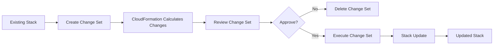
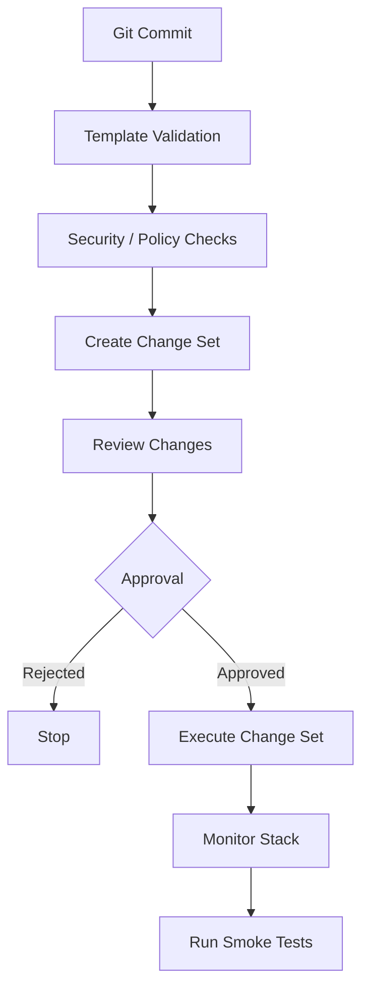

# 06- Change Sets

## Overview

AWS CloudFormation change sets provide a controlled way to preview how a stack update will affect existing infrastructure before executing the change.

Instead of immediately applying a new template or parameter configuration, CloudFormation can calculate the proposed changes and present them as a change set.

This is particularly important for production infrastructure because a seemingly small template modification can cause:

- Resource replacement.
- Resource deletion.
- Configuration changes.
- Dependency changes.
- Service interruption.
- Data loss.

The operational model is:

```text
Current Stack
     |
     | New template + parameters
     v
CloudFormation
     |
     v
Change Set
     |
     | Review
     v
Approved?
  /       \
No         Yes
|           |
Stop        Execute
            |
            v
       Updated Stack
```

Change sets provide **change visibility**, not a guarantee that a deployment is safe.

## Why Change Sets Matter

CloudFormation is declarative. You describe the desired infrastructure state, and CloudFormation determines how to transition the current stack into that state.

For example, changing an RDS property may result in:

```text
Modify property
      |
      v
CloudFormation evaluates resource
      |
      +---- In-place update
      |
      +---- Replacement required
      |
      +---- Update not supported
```

Without reviewing the change set, an operator may not immediately realize that a resource replacement is required.

For production systems, the difference between:

```text
Modify
```

and:

```text
Replace
```

can be operationally significant.

## What a Change Set Contains

A change set describes proposed resource-level changes.

Typical actions include:

| Action | Meaning |
|---|---|
| `Add` | New resource will be created |
| `Modify` | Existing resource will be changed |
| `Remove` | Resource will be removed |

For modifications, CloudFormation can also indicate whether the resource requires replacement.

Conceptually:

```text
Action       Replacement
------------------------
Add          N/A
Modify       True / False / Conditional
Remove       N/A
```

A production review should pay particular attention to:

- `Action`
- `ResourceType`
- `LogicalResourceId`
- `Replacement`
- Resource properties
- Dependencies
- Potential data-plane impact

## Change Set Lifecycle

A change set is a CloudFormation object associated with a stack.

The lifecycle is:



The change set itself does not modify the stack.

Execution is the operation that applies the proposed changes.

## When to Use Change Sets

Use change sets when the impact of a stack update needs explicit review.

Typical scenarios include:

- Production deployments.
- Database changes.
- IAM changes.
- Networking changes.
- Security-group modifications.
- Changes to load balancers.
- Changes to stateful resources.
- Changes involving resource replacement.
- Changes requiring approval from another team.
- Infrastructure changes governed by change-management processes.

For low-risk development iterations, directly using `aws cloudformation deploy` may be sufficient.

For high-risk production infrastructure, change sets provide a stronger deployment workflow.

## Creating a Change Set

A change set can be created with the AWS CLI.

Example:

```bash
aws cloudformation create-change-set \
  --stack-name backend-api-production \
  --change-set-name backend-api-production-2026-08-13 \
  --template-body file://template.yaml \
  --parameters \
    ParameterKey=Environment,ParameterValue=production \
    ParameterKey=InstanceType,ParameterValue=t3.medium
```

For an existing stack, the change set type is normally `UPDATE`.

```bash
aws cloudformation create-change-set \
  --stack-name backend-api-production \
  --change-set-name backend-api-production-update \
  --change-set-type UPDATE \
  --template-body file://template.yaml
```

## Creating a Change Set for a New Stack

Change sets can also be used when creating a new stack.

Specify:

```bash
--change-set-type CREATE
```

Example:

```bash
aws cloudformation create-change-set \
  --stack-name backend-api-production \
  --change-set-name initial-deployment \
  --change-set-type CREATE \
  --template-body file://template.yaml
```

This allows the proposed initial infrastructure to be inspected before execution.

The practical value is greater for complex stacks where the operator wants to verify the resources CloudFormation intends to create.

## Waiting for Change Set Creation

Change set creation may take time while CloudFormation evaluates the template.

Use:

```bash
aws cloudformation wait change-set-create-complete \
  --stack-name backend-api-production \
  --change-set-name backend-api-production-update
```

If the change set cannot be created, inspect the reason:

```bash
aws cloudformation describe-change-set \
  --stack-name backend-api-production \
  --change-set-name backend-api-production-update
```

## Describing a Change Set

Use:

```bash
aws cloudformation describe-change-set \
  --stack-name backend-api-production \
  --change-set-name backend-api-production-update
```

For a concise resource-level view:

```bash
aws cloudformation describe-change-set \
  --stack-name backend-api-production \
  --change-set-name backend-api-production-update \
  --query 'Changes[].ResourceChange' \
  --output table
```

For JSON suitable for automation:

```bash
aws cloudformation describe-change-set \
  --stack-name backend-api-production \
  --change-set-name backend-api-production-update \
  --query 'Changes[].ResourceChange'
```

## Reading a Change Set

A change set should be reviewed from the perspective of infrastructure impact rather than simply whether it contains changes.

Example conceptual result:

```text
LogicalResourceId      Action     Replacement
---------------------  ---------  -----------
ApplicationLoadBalancer Modify     False
ApplicationTargetGroup Modify     False
Database               Modify     True
```

The database replacement is the critical finding.

The correct question is not:

> "Does the change set look small?"

The correct question is:

> "What infrastructure lifecycle operations will CloudFormation perform?"

## Add Changes

An `Add` action means CloudFormation intends to create a new resource.

Example:

```text
ApplicationSecurityGroup
Action: Add
```

Review:

- Resource type.
- Properties.
- IAM permissions.
- Network exposure.
- Dependencies.
- Cost implications.
- Security implications.

Adding an internet-facing load balancer, for example, is materially different from adding an internal security group.

## Modify Changes

A `Modify` action means an existing resource will be changed.

Not every modification has the same operational risk.

Examples:

```text
Modify ECS task definition
Modify security group
Modify RDS configuration
Modify IAM policy
```

Each may have a different effect on availability, security, or resource lifecycle.

## Remove Changes

A `Remove` action means CloudFormation intends to remove a resource from the stack.

This should receive explicit review in production.

Example:

```text
LogicalResourceId: ProductionDatabase
Action: Remove
```

For stateful infrastructure, a removal can be extremely significant.

CloudFormation deletion behavior also depends on the resource's deletion policy and resource-specific behavior.

## Replacement

Replacement is one of the most important properties to review.

A resource replacement generally means CloudFormation will provision a new physical resource rather than modifying the existing resource in place.

Conceptually:

```text
Existing Resource
       |
       | Property change requires replacement
       v
New Resource
       |
       v
CloudFormation updates dependencies
       |
       v
Old Resource removed
```

The exact sequence depends on the resource and update behavior.

For stateful resources, replacement can have serious consequences.

## Replacement Risk

A change set showing:

```text
Replacement: True
```

should trigger deeper investigation.

Examples of potentially high-risk resources include:

- `AWS::RDS::DBInstance`
- `AWS::DynamoDB::Table`
- `AWS::EC2::Volume`
- `AWS::ElastiCache::ReplicationGroup`
- Production load balancers.
- Critical networking resources.

The impact depends on the resource, its properties, deletion policy, dependencies, and application architecture.

## Conditional Replacement

Some resource changes may have conditional replacement behavior.

Do not assume that every property change is an in-place operation.

CloudFormation resource update behavior is resource-property-specific.

When reviewing a change set, verify the documented update behavior of the affected resource property rather than relying only on intuition.

## Change Set Details

A change set can contain more information than the high-level action.

Useful fields include:

```bash
aws cloudformation describe-change-set \
  --stack-name backend-api-production \
  --change-set-name backend-api-production-update \
  --query 'Changes[].ResourceChange.{LogicalId:LogicalResourceId,Action:Action,Type:ResourceType,Replacement:Replacement}'
```

This is useful for automated CI/CD review.

## Change Set Status

Change sets have lifecycle states.

Common statuses include:

| Status | Meaning |
|---|---|
| `CREATE_PENDING` | Creation has been requested |
| `CREATE_IN_PROGRESS` | CloudFormation is creating the change set |
| `CREATE_COMPLETE` | Change set was successfully created |
| `FAILED` | Change set creation failed |
| `DELETE_PENDING` | Deletion requested |
| `DELETE_IN_PROGRESS` | Deletion in progress |
| `DELETE_COMPLETE` | Change set deleted |

A failed change set does not necessarily mean the stack itself failed.

It means CloudFormation could not successfully create the proposed change set.

## Insufficient Changes

A common situation occurs when the new template and parameters produce no actual infrastructure difference.

CloudFormation may report that there are no changes to apply.

This is useful information.

It can indicate:

- The deployed stack already matches the desired template.
- The wrong template was supplied.
- The expected parameter change was not supplied.
- The change was already deployed.
- The change does not affect the resulting resource configuration.

Do not treat "no changes" as automatically indicating a problem.

Investigate whether the desired state is already present.

## Change Sets and Parameters

Change sets are calculated using the proposed parameter values.

Example:

```bash
aws cloudformation create-change-set \
  --stack-name backend-api-production \
  --change-set-name scale-production \
  --change-set-type UPDATE \
  --template-body file://template.yaml \
  --parameters \
    ParameterKey=Environment,ParameterValue=production \
    ParameterKey=InstanceType,ParameterValue=t3.large
```

The change set represents:

```text
Current Stack
    +
New Template
    +
New Parameter Values
    =
Proposed Change
```

If parameter values are omitted, CloudFormation may use existing stack parameter values.

For production automation, explicitly managing the intended parameter state can make deployments more deterministic.

## Change Sets and IAM

IAM changes deserve special attention.

Examples include:

```text
AWS::IAM::Role
AWS::IAM::Policy
AWS::IAM::ManagedPolicy
```

A seemingly small IAM policy modification can expand application privileges.

Review:

- Added actions.
- Removed restrictions.
- Resource scope.
- Conditions.
- Trust policy changes.
- Managed policy attachments.

For example:

```text
Before:
s3:GetObject
on:
arn:aws:s3:::backend-data/*

After:
s3:*
on:
*
```

The infrastructure change may technically succeed, but the security impact is significant.

## Change Sets and Networking

Networking changes should be reviewed for:

- Route changes.
- Security group rules.
- Network ACL changes.
- Subnet changes.
- Internet exposure.
- Load balancer configuration.
- VPC changes.
- NAT gateway changes.

For example:

```text
Security Group
    |
    +---- Before: TCP 443 from corporate CIDR
    |
    +---- After: TCP 443 from 0.0.0.0/0
```

The change set may show a simple `Modify`, but the security impact requires human review.

## Change Sets and Databases

Database changes deserve particular scrutiny.

Review:

- Replacement.
- Deletion behavior.
- Snapshot behavior.
- Engine changes.
- Storage changes.
- Encryption configuration.
- Availability configuration.
- Parameter groups.
- Subnet groups.

For production databases, also verify:

```text
CloudFormation Change Set
        |
        +---- Replacement?
        |
        +---- DeletionPolicy?
        |
        +---- Update requires interruption?
        |
        +---- Snapshot / backup protection?
        |
        +---- Application compatibility?
```

A change set is one input to the deployment decision, not the entire database migration strategy.

## Change Sets and Application Deployments

CloudFormation can manage infrastructure around backend applications.

For example:

```text
CloudFormation
    |
    +---- VPC
    +---- ALB
    +---- ECS Service
    +---- IAM Roles
    +---- Security Groups
```

A change set can show that:

```text
ECS TaskDefinition    Add
ECS Service           Modify
ALB Listener          Modify
```

The application deployment process should still consider:

- Container image compatibility.
- Database migrations.
- Backward compatibility.
- Health checks.
- Rollback behavior.
- Traffic shifting.

CloudFormation infrastructure safety and application release safety are related but distinct concerns.

## Change Sets in CI/CD

A production pipeline can separate deployment into planning and execution stages.



This provides an approval boundary before infrastructure mutation.

## Automated Change Set Review

CI/CD systems can inspect change-set output.

For example:

```bash
aws cloudformation describe-change-set \
  --stack-name backend-api-production \
  --change-set-name "$CHANGE_SET_NAME" \
  --query 'Changes[].ResourceChange.{Action:Action,LogicalId:LogicalResourceId,Type:ResourceType,Replacement:Replacement}' \
  --output json
```

A pipeline can then enforce policies such as:

```text
IF Replacement == True
    AND ResourceType is stateful
THEN
    Require manual approval
```

This moves some infrastructure governance into automation.

## Change Sets and Manual Approval

A common production model is:

```text
Developer
   |
   v
Pull Request
   |
   v
CI Validation
   |
   v
Change Set
   |
   v
Infrastructure Review
   |
   v
Approval
   |
   v
Execute
```

This is especially useful for organizations where infrastructure changes require explicit review.

## Executing a Change Set

After approval:

```bash
aws cloudformation execute-change-set \
  --stack-name backend-api-production \
  --change-set-name backend-api-production-update
```

The change set transitions from a proposed state into an actual stack operation.

Execution is the point at which CloudFormation begins applying the changes.

## Waiting for Stack Completion

After execution:

```bash
aws cloudformation wait stack-update-complete \
  --stack-name backend-api-production
```

For initial creation:

```bash
aws cloudformation wait stack-create-complete \
  --stack-name backend-api-production
```

Do not treat successful change-set execution invocation as proof that the deployment completed successfully.

The stack operation must be monitored through completion.

## Monitoring the Result

Inspect stack status:

```bash
aws cloudformation describe-stacks \
  --stack-name backend-api-production \
  --query 'Stacks[0].StackStatus'
```

Inspect recent events:

```bash
aws cloudformation describe-stack-events \
  --stack-name backend-api-production \
  --max-items 20
```

Stack events are essential when a resource fails during execution.

## Change Set vs Stack Events

These serve different purposes.

| Mechanism | Purpose |
|---|---|
| Change set | What CloudFormation plans to change |
| Stack events | What CloudFormation actually did |
| Stack status | Current overall stack lifecycle state |
| Resource state | Current state of individual resources |

The operational sequence is:

```text
Change Set
   |
   | "What will happen?"
   v
Execute
   |
   v
Stack Events
   |
   | "What happened?"
   v
Final Stack State
```

## Change Sets Are Not Rollbacks

A change set is a preview mechanism.

It does not automatically provide rollback semantics.

CloudFormation stack updates have their own rollback behavior and controls.

For example:

```text
Create Change Set
      |
      v
Review
      |
      v
Execute
      |
      v
Update fails
      |
      v
CloudFormation rollback behavior
```

Do not confuse:

```text
Change Set
```

with:

```text
Rollback
```

They solve different problems.

## Change Sets and Rollback Configuration

Stack update behavior should be considered separately from change-set review.

For production deployments, understand:

- Stack rollback behavior.
- Resource-level rollback behavior.
- Update rollback triggers.
- Termination protection.
- Deletion policies.
- Application-level rollback requirements.

A change set can identify a dangerous update before execution, while rollback mechanisms help recover from failures after execution begins.

## Change Sets and Nested Stacks

Nested stacks introduce additional complexity.

A parent stack may contain:

```text
Parent Stack
    |
    +---- Network Nested Stack
    +---- Security Nested Stack
    +---- Application Nested Stack
```

A change set for the parent stack may indicate changes to nested stack resources.

Review the nested stack changes carefully, especially when:

- A nested template changes.
- A nested stack is replaced.
- Shared resources are modified.
- Dependencies span nested stacks.

## Change Sets and Cross-Stack References

Cross-stack references create dependencies between stacks.

```text
Network Stack
    |
    | Export VpcId
    v
Application Stack
    |
    | ImportValue
    v
Application Resources
```

A change set for the network stack should be reviewed with awareness of downstream consumers.

A resource change that appears local may affect dependent stacks or applications.

## Change Set Naming

Use deterministic, traceable names.

Example:

```text
backend-api-production-20260813-1430
```

Or use a CI/CD identifier:

```text
backend-api-production-${GITHUB_SHA}
```

Good names make operational investigation easier.

Avoid generic names such as:

```text
update
changes
test
new
```

## Change Set Cleanup

Executed and obsolete change sets should be cleaned up.

List change sets:

```bash
aws cloudformation list-change-sets \
  --stack-name backend-api-production
```

Delete an obsolete change set:

```bash
aws cloudformation delete-change-set \
  --stack-name backend-api-production \
  --change-set-name backend-api-production-update
```

Change-set cleanup keeps the stack's deployment history easier to understand.

## Change Set Permissions

The identity creating or executing a change set needs appropriate CloudFormation permissions and permissions for the underlying resource operations.

This creates an important distinction:

```text
IAM Permission
      |
      +---- Create change set
      |
      +---- Execute change set
      |
      +---- Create/modify AWS resources
```

Using CloudFormation service roles can help centralize and control the permissions CloudFormation uses to operate on resources.

Do not assume that permission to create a change set automatically implies permission to execute every possible infrastructure change.

## Security Considerations

Change sets can contain infrastructure configuration details that should be treated as operationally sensitive.

Examples include:

- IAM configuration.
- Network configuration.
- Resource identifiers.
- Security group changes.
- Resource policies.
- Encryption configuration.

Recommended practices:

- Restrict who can create and execute production change sets.
- Protect CI/CD credentials.
- Use least-privilege IAM.
- Audit change-set creation and execution through CloudTrail.
- Avoid placing secrets in templates or parameters.
- Review IAM and networking changes explicitly.
- Protect production approval workflows.
- Do not grant developers unrestricted infrastructure execution solely because they need to generate change sets.

## Reliability Considerations

A change-set workflow improves deployment reliability by separating:

```text
Planning
```

from:

```text
Execution
```

It does not eliminate deployment risk.

A reliable workflow should also include:

- Template validation.
- Security scanning.
- Policy checks.
- Automated tests.
- Change-set review.
- Explicit production approval.
- Stack monitoring.
- Application health checks.
- Rollback procedures.

## Cost Considerations

Creating a change set itself is primarily a planning operation, but the resources proposed by the change set may introduce or modify AWS costs.

Review additions such as:

- NAT gateways.
- Load balancers.
- RDS instances.
- ElastiCache clusters.
- ECS capacity.
- EC2 instances.
- Data transfer paths.

A change set can therefore serve as an early cost-review point before execution.

## Common Mistakes

### Executing Without Reviewing

Creating a change set and immediately executing it defeats much of its operational value.

Use the change set as a review boundary.

### Ignoring Replacement

A `Modify` action can still represent a resource replacement.

Always inspect the `Replacement` field.

### Assuming No Replacement Means No Downtime

An in-place modification can still cause interruption depending on the resource and property.

Check the resource documentation for update behavior.

### Treating Change Sets as Rollbacks

Change sets preview future changes. They do not replace rollback mechanisms.

### Ignoring Deletion Policies

A resource removal may have different consequences depending on `DeletionPolicy` and resource behavior.

### Ignoring IAM Changes

A small IAM modification can create a significant privilege escalation.

### Ignoring Network Changes

Changing a security group or route may expose production infrastructure even when CloudFormation reports only a normal modification.

### Assuming Successful Creation Means Successful Deployment

Change-set creation only means CloudFormation successfully calculated the proposed changes.

Execution is a separate operation.

### Reusing Ambiguous Change-Set Names

Poor names make deployments harder to correlate with commits and approvals.

### Leaving Old Change Sets

Large numbers of stale change sets make operational history harder to navigate.

### Assuming Change Sets Detect Application-Level Problems

A change set evaluates infrastructure changes. It cannot determine whether a new Django, FastAPI, or gRPC application version is functionally correct.

Application testing remains necessary.

## Production Workflow

A strong production deployment workflow looks like:

```text
1. Commit infrastructure change
        |
2. Validate template
        |
3. Run security/policy checks
        |
4. Create change set
        |
5. Inspect Add / Modify / Remove
        |
6. Inspect replacement behavior
        |
7. Review IAM/network/database changes
        |
8. Obtain approval
        |
9. Execute change set
        |
10. Monitor stack events
        |
11. Verify stack outputs
        |
12. Run application smoke tests
```

The key distinction is:

```text
Change Set = planned infrastructure state transition

Execution = actual infrastructure mutation
```

## Practical CLI Reference

| Operation | Command |
|---|---|
| Create update change set | `aws cloudformation create-change-set` |
| Create create change set | `aws cloudformation create-change-set --change-set-type CREATE` |
| Inspect change set | `aws cloudformation describe-change-set` |
| List change sets | `aws cloudformation list-change-sets` |
| Execute change set | `aws cloudformation execute-change-set` |
| Delete change set | `aws cloudformation delete-change-set` |
| Inspect stack events | `aws cloudformation describe-stack-events` |
| Inspect stack | `aws cloudformation describe-stacks` |

## Interview Traps

### What Is a CloudFormation Change Set?

A change set is a preview of the resource changes CloudFormation proposes for a stack operation.

It allows operators to review changes before executing them.

### Does Creating a Change Set Modify Resources?

No.

Creating a change set calculates and records the proposed changes.

Resources are modified only when the change set is executed.

### What Is the Difference Between a Change Set and `aws cloudformation deploy`?

`aws cloudformation deploy` is a deployment workflow that can create or update a stack.

A change-set workflow explicitly separates:

```text
Create proposed changes
        |
Review
        |
Execute
```

This is useful when an approval or inspection step is required.

### Does a Change Set Guarantee Zero Downtime?

No.

It shows the proposed infrastructure changes, but availability depends on the affected resources and their update behavior.

### What Does `Replacement: True` Mean?

It indicates that CloudFormation expects the resource to be replaced rather than updated in place.

This should receive additional production review, particularly for stateful resources.

### Can You Modify a Change Set?

A change set is a calculated proposal.

If the desired template or parameters change, create a new change set rather than treating the existing proposal as automatically updated.

### Can You Execute a Change Set Later?

Yes, provided it remains valid and has not been deleted or otherwise invalidated.

However, production workflows should avoid keeping proposals around indefinitely because the underlying desired state may change.

### Are Change Sets a Rollback Mechanism?

No.

They are a pre-execution planning and review mechanism.

### Can Change Sets Be Used for New Stacks?

Yes.

Use:

```bash
--change-set-type CREATE
```

to create a change set for a new stack.

### Why Might a Change Set Fail?

Common reasons include:

- Invalid template.
- Invalid parameter values.
- Missing permissions.
- Resource configuration issues.
- No applicable changes.
- Invalid stack state.
- Unsupported operation.

Inspect the change-set status reason using:

```bash
aws cloudformation describe-change-set \
  --stack-name backend-api-production \
  --change-set-name backend-api-production-update
```

## Key Takeaways

- A CloudFormation change set previews proposed infrastructure changes before execution.
- Creating a change set does not modify the stack.
- Executing the change set is the operation that applies the proposed changes.
- Review `Add`, `Modify`, and `Remove` actions before production execution.
- Always inspect `Replacement` behavior for modified resources.
- Resource replacement can be especially dangerous for stateful resources such as production databases.
- An in-place modification does not automatically guarantee zero downtime.
- Change sets should be treated as a planning and approval mechanism, not a rollback mechanism.
- Parameters are part of the desired-state calculation, so parameter changes should be reviewed alongside template changes.
- IAM and networking changes deserve explicit security review.
- Database changes require additional analysis beyond simply inspecting the change-set action.
- Change sets work well as a CI/CD approval boundary.
- Automated pipelines can inspect change-set output and enforce policies around replacements or sensitive resource types.
- Stack events should be monitored after change-set execution because they show what actually happened.
- Change sets and stack events answer different questions: the former describes what is planned; the latter describes execution.
- Nested stacks and cross-stack references require additional dependency analysis.
- Change-set names should be traceable to deployments, commits, or pipeline executions.
- Obsolete change sets should be deleted to keep operational history manageable.
- Creating a change set successfully does not mean the eventual deployment will succeed.
- Change sets provide infrastructure visibility, but application-level testing remains necessary.
- A mature production workflow separates validation, change planning, approval, execution, monitoring, and application verification.