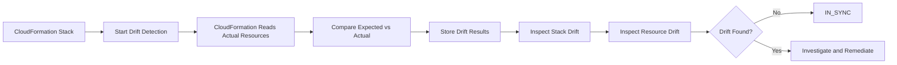
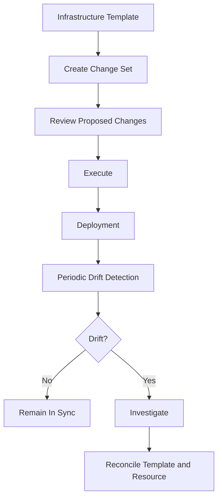

# 07- Drift Detection

## Overview

AWS CloudFormation drift detection identifies differences between the configuration CloudFormation expects for a stack resource and the resource's actual configuration in AWS.

Drift typically occurs when infrastructure is changed outside CloudFormation after the stack has been deployed.

For example:

```text
CloudFormation Template
        |
        | Expected state
        v
   Production ALB
        |
        | Manual AWS Console change
        v
Actual ALB configuration
```

If the template specifies a security group rule but an engineer manually changes that rule through the EC2 console, the actual resource configuration may no longer match the CloudFormation-defined configuration.

CloudFormation can detect this difference.

Drift detection is therefore an important control for infrastructure governance, configuration consistency, and operational troubleshooting. :contentReference[oaicite:0]{index=0}

## What Drift Means

A resource has **drifted** when its actual configuration differs from the expected configuration represented by its CloudFormation template and parameter values.

Conceptually:

```text
Expected Configuration
        |
        | Compare
        v
Actual AWS Resource
        |
        +---- Same ------> IN_SYNC
        |
        +---- Different -> MODIFIED
        |
        +---- Deleted ---> DELETED
```

CloudFormation does not continuously monitor every resource for drift. Drift detection is an explicit operation that you initiate, after which CloudFormation compares supported resources against their expected configuration. :contentReference[oaicite:1]{index=1}

## Why Drift Detection Matters

Infrastructure-as-code works best when the declared configuration remains the source of truth.

Without drift detection, an environment can gradually become:

```text
Git repository
     |
     | CloudFormation template
     v
Expected infrastructure

       !=

Actual AWS environment
```

This creates several operational problems:

- Future deployments may behave unexpectedly.
- Engineers may troubleshoot against incorrect assumptions.
- Security controls may be weakened outside version control.
- Production environments can become different from staging.
- Disaster recovery environments may not reproduce production accurately.
- Infrastructure changes become difficult to audit.
- Engineers may unknowingly overwrite manual changes during a later deployment.

Drift detection helps identify these inconsistencies.

## Expected State vs Actual State

CloudFormation maintains an expected configuration based on:

- The deployed CloudFormation template.
- Values supplied to template parameters.
- Resource properties explicitly defined in the template.

CloudFormation then compares that expected configuration with the actual resource configuration.

An important limitation is that **only resource properties explicitly defined in the CloudFormation template are checked for drift**. Properties omitted from the template are not necessarily treated as drift simply because their current AWS values differ. :contentReference[oaicite:2]{index=2}

For example:

```yaml
Resources:
  ApiSecurityGroup:
    Type: AWS::EC2::SecurityGroup
    Properties:
      GroupDescription: API security group
      SecurityGroupIngress:
        - IpProtocol: tcp
          FromPort: 443
          ToPort: 443
          CidrIp: 10.0.0.0/8
```

If an administrator changes the explicitly defined ingress rule outside CloudFormation, that configuration can be detected as drift.

## Drift Detection Lifecycle

A typical workflow is:



The detection operation can take several minutes depending on the number of resources. CloudFormation returns a drift detection ID that can be used to monitor the operation. :contentReference[oaicite:3]{index=3}

## Stack-Level Drift

A stack is considered drifted when one or more supported resources differ from their expected configurations.

The primary stack-level statuses are:

| Status | Meaning |
|---|---|
| `IN_SYNC` | Stack resources match expected configuration |
| `DRIFTED` | One or more resources differ from expected configuration |
| `NOT_CHECKED` | Drift detection has not been completed |
| `UNKNOWN` | Drift status could not be determined |

The exact resource-level status can provide more detail than the overall stack status.

## Resource-Level Drift

Resource-level drift provides the details needed to determine what actually changed.

Common statuses include:

| Status | Meaning |
|---|---|
| `IN_SYNC` | Actual configuration matches expected configuration |
| `MODIFIED` | One or more properties differ |
| `DELETED` | Resource was deleted outside CloudFormation |
| `NOT_CHECKED` | Resource has not been checked |
| `UNKNOWN` | CloudFormation could not determine the drift state |
| `UNSUPPORTED` | Resource type does not support drift detection |

AWS documents these statuses as part of the `StackResourceDrift` model. :contentReference[oaicite:4]{index=4}

## Detecting Drift for an Entire Stack

Use the AWS CLI:

```bash
aws cloudformation detect-stack-drift \
  --stack-name backend-api-production
```

The command returns a drift detection ID:

```json
{
  "StackDriftDetectionId": "example-drift-detection-id"
}
```

This operation starts the detection process; it does not immediately return all resource-level drift information. :contentReference[oaicite:5]{index=5}

## Checking Drift Detection Progress

Use the returned detection ID:

```bash
aws cloudformation describe-stack-drift-detection-status \
  --stack-drift-detection-id example-drift-detection-id
```

A completed operation will provide information such as:

```text
DetectionStatus: DETECTION_COMPLETE
StackDriftStatus: DRIFTED
DriftedStackResourceCount: 2
```

A useful operational distinction is:

```text
DetectionStatus
    |
    +---- Is the drift check complete?

StackDriftStatus
    |
    +---- Is the stack currently in sync?
```

Do not interpret an in-progress detection as proof that the stack is healthy.

## Inspecting Drifted Resources

Once detection completes:

```bash
aws cloudformation describe-stack-resource-drifts \
  --stack-name backend-api-production
```

To focus on modified and deleted resources:

```bash
aws cloudformation describe-stack-resource-drifts \
  --stack-name backend-api-production \
  --stack-resource-drift-status-filters MODIFIED DELETED
```

AWS explicitly supports filtering resource drift results by statuses such as `MODIFIED` and `DELETED`. :contentReference[oaicite:6]{index=6}

## Inspecting Property Differences

For a drifted resource, CloudFormation can provide:

- Expected property value.
- Actual property value.
- Property path.
- Difference type.

Conceptually:

```text
Resource: ApiSecurityGroup

Property:
  /SecurityGroupIngress/0/CidrIp

Expected:
  10.0.0.0/8

Actual:
  0.0.0.0/0

Difference:
  NOT_EQUAL
```

This is much more useful than simply knowing that the stack is `DRIFTED`.

It tells the engineer what configuration changed and provides the starting point for remediation. :contentReference[oaicite:7]{index=7}

## Example: Security Group Drift

Suppose CloudFormation defines:

```yaml
Resources:
  ApiSecurityGroup:
    Type: AWS::EC2::SecurityGroup
    Properties:
      GroupDescription: API security group
      SecurityGroupIngress:
        - IpProtocol: tcp
          FromPort: 443
          ToPort: 443
          CidrIp: 10.0.0.0/8
```

An engineer manually changes the security group through the AWS console:

```text
10.0.0.0/8
       |
       | Manual change
       v
0.0.0.0/0
```

CloudFormation can detect that the actual ingress configuration differs from the expected template configuration.

This is a particularly important drift scenario because configuration drift can become a security incident.

## Example: Lambda Configuration Drift

Consider:

```yaml
Resources:
  ApiFunction:
    Type: AWS::Lambda::Function
    Properties:
      Runtime: python3.12
      MemorySize: 512
      Timeout: 30
```

An administrator changes the function's memory to `1024 MB` directly through the Lambda console.

The template still declares:

```text
MemorySize: 512
```

while the actual function contains:

```text
MemorySize: 1024
```

A drift check can identify the resource as `MODIFIED` and expose the property difference. AWS provides Lambda as an example of a resource whose configuration can be inspected for drift. :contentReference[oaicite:8]{index=8}

## Example: Deleted Resource

Suppose a stack manages:

```text
AWS::SQS::Queue
```

but an administrator manually deletes the queue.

The stack's expected state still contains the queue, while AWS no longer has the physical resource.

CloudFormation can report:

```text
StackResourceDriftStatus: DELETED
```

This is operationally different from `MODIFIED`.

```text
MODIFIED
    |
    +---- Resource exists
    +---- Configuration differs

DELETED
    |
    +---- Resource no longer exists
```

## Detecting Drift on a Specific Resource

You do not always need to inspect the entire stack.

Use:

```bash
aws cloudformation detect-stack-resource-drift \
  --stack-name backend-api-production \
  --logical-resource-id ApiSecurityGroup
```

This is useful when investigating a known high-risk resource such as:

- Security group.
- IAM role.
- Load balancer.
- RDS instance.
- S3 bucket.
- Lambda function.

AWS supports individual resource drift detection separately from whole-stack detection. :contentReference[oaicite:9]{index=9}

## When Resource-Level Detection Is Useful

Use resource-level detection when:

- Investigating a specific incident.
- Validating a recent manual change.
- Checking a high-risk resource.
- Troubleshooting a production deployment.
- Performing targeted compliance checks.

It is more focused than scanning the entire stack.

An important behavior is that detecting drift on an individual resource also updates the stack's overall drift status when applicable. :contentReference[oaicite:10]{index=10}

## Drift and Manual Changes

The most common cause of drift is an out-of-band modification.

Examples include:

```text
AWS Console
AWS CLI
AWS SDK
Terraform
Custom automation
Third-party tools
```

For example:

```text
CloudFormation
      |
      v
Security Group
      ^
      |
AWS Console modification
```

CloudFormation did not make the change, but the resource is still part of the CloudFormation-managed infrastructure.

The resulting difference is drift.

## Drift vs CloudFormation Updates

A change made through CloudFormation is not drift simply because the resource configuration changed.

The distinction is:

| Change | Drift? |
|---|---|
| CloudFormation stack update | No |
| Manual AWS Console modification | Potentially yes |
| AWS CLI modification outside CloudFormation | Potentially yes |
| SDK modification outside CloudFormation | Potentially yes |
| Template update followed by stack update | No |
| Resource deleted outside CloudFormation | Potentially yes |

The important question is whether the actual resource configuration differs from the configuration CloudFormation expects.

## Drift and Change Sets

Change sets and drift detection solve different problems.

| Capability | Change Sets | Drift Detection |
|---|---|---|
| Primary purpose | Preview proposed changes | Detect actual configuration differences |
| Direction | Desired state → proposed change | Expected state ↔ actual state |
| Main use | Pre-deployment review | Post-deployment consistency |
| Detect manual changes | No | Yes |
| Shows proposed replacement | Yes | No |
| Shows actual property differences | Not primarily | Yes |
| Executes changes | Only when explicitly executed | No |

The relationship is:

```text
                CloudFormation
                     |
          +----------+----------+
          |                     |
          v                     v
   Change Sets             Drift Detection
          |                     |
          v                     v
"What will change?"      "What changed?"
```

A mature infrastructure workflow often uses both.

## Drift Detection and Change Management

A production deployment lifecycle can look like:



This creates two separate controls:

```text
Before deployment:
Change Set

After deployment:
Drift Detection
```

## Drift Does Not Automatically Fix Anything

Drift detection is primarily a detection mechanism.

If CloudFormation reports:

```text
ApiSecurityGroup
Status: MODIFIED
```

it does not automatically decide whether the manual change was:

- Correct.
- Incorrect.
- Temporary.
- Emergency.
- Required.
- A security violation.

An engineer must determine the desired state and reconcile the infrastructure accordingly.

## Drift Remediation

There are generally two remediation directions.

### Reconcile AWS With the Template

If the CloudFormation template is correct:

```text
Actual AWS resource
        |
        | Restore expected configuration
        v
CloudFormation expected state
```

This usually means performing a controlled CloudFormation update or otherwise restoring the resource to the declared configuration.

### Reconcile the Template With AWS

If the manual change was intentional:

```text
Actual AWS resource
        |
        | Adopt intended configuration
        v
Update CloudFormation template
```

The infrastructure-as-code repository should then become the new source of truth.

The critical rule is to avoid leaving the environment in an undocumented intermediate state.

## Drift Remediation Workflow

A practical workflow is:

```text
1. Detect drift
       |
2. Identify affected resource
       |
3. Inspect property differences
       |
4. Determine why the change occurred
       |
5. Decide desired state
       |
       +---- Template is correct
       |         |
       |         v
       |    Restore resource
       |
       +---- Manual change is intentional
                 |
                 v
          Update template
       |
6. Validate
       |
7. Deploy through CloudFormation
       |
8. Run drift detection again
       |
9. Confirm IN_SYNC
```

## Drift and Emergency Changes

Emergency production changes are a common source of drift.

For example:

```text
Production outage
      |
      v
Engineer changes ALB/security group manually
      |
      v
Service recovers
      |
      v
CloudFormation template remains unchanged
      |
      v
DRIFTED
```

The correct response is not to ignore the drift because the emergency change was justified.

Instead:

1. Record the reason for the emergency change.
2. Determine whether the change should become permanent.
3. Update the CloudFormation template if appropriate.
4. Deploy through the normal infrastructure workflow.
5. Verify drift is resolved.

This converts an emergency operational action back into managed infrastructure.

## Drift and Security

Security-related drift should be treated as a high-priority operational signal.

Examples:

```text
Security group
IAM role
IAM policy
S3 bucket policy
KMS configuration
Network ACL
Load balancer listener
```

A security group drifting from:

```text
10.0.0.0/8
```

to:

```text
0.0.0.0/0
```

could expose an internal service to the public internet.

Similarly, an IAM role drifting from a narrowly scoped policy to broad permissions can introduce privilege escalation.

A production drift workflow should therefore classify resources by security impact.

## Drift and Stateful Resources

Drift involving stateful infrastructure requires special care.

Examples:

- RDS.
- DynamoDB.
- S3.
- ElastiCache.
- EBS.
- EFS.

Do not blindly overwrite a drifted stateful resource.

First determine:

- Whether data is affected.
- Whether the manual change was intentional.
- Whether restoring the template would cause interruption.
- Whether resource replacement is involved.
- Whether backups or snapshots are available.
- Whether the application depends on the current configuration.

Drift detection identifies a discrepancy; it does not determine the safest remediation strategy.

## Drift Detection and Nested Stacks

When detecting drift on a stack, CloudFormation does **not** automatically detect drift on nested stacks belonging to that stack.

Nested stacks should be checked separately. :contentReference[oaicite:11]{index=11}

For example:

```text
Root Stack
    |
    +---- Network Stack
    |
    +---- Security Stack
    |
    +---- Application Stack
```

A drift check on the root stack should not be interpreted as a complete drift assessment of every nested stack.

For production environments, explicitly include nested stacks in the drift-detection strategy.

## Drift Detection and StackSets

CloudFormation StackSets also support drift detection.

For a StackSet:

```text
StackSet
   |
   +---- Account A / Region 1
   +---- Account A / Region 2
   +---- Account B / Region 1
   +---- Account B / Region 2
```

Drift detection evaluates the stacks associated with the StackSet instances.

If one or more instances drift, that can propagate into the StackSet-level drift state. :contentReference[oaicite:12]{index=12}

This is particularly useful in multi-account AWS organizations.

## Drift and Multi-Account Environments

For organizations with multiple AWS accounts:

```text
Management / Deployment Account
          |
          v
       StackSet
          |
    +-----+-----+
    |     |     |
    v     v     v
 Account A  Account B  Account C
```

A centralized drift strategy can identify configuration divergence across accounts.

Examples:

- Security baseline drift.
- IAM role drift.
- Logging configuration drift.
- VPC configuration drift.
- CloudTrail configuration drift.

The operational challenge is scale: drift detection must be scheduled and scoped carefully rather than treated as a one-off manual operation.

## Drift Detection in CI/CD

Drift detection can be incorporated into infrastructure operations.

Example workflow:

```text
Scheduled Pipeline
       |
       v
Detect Stack Drift
       |
       v
Check Status
       |
       +---- IN_SYNC ---> Success
       |
       +---- DRIFTED ---> Alert
```

A pipeline can retrieve drifted resources:

```bash
aws cloudformation describe-stack-resource-drifts \
  --stack-name backend-api-production \
  --stack-resource-drift-status-filters MODIFIED DELETED \
  --output json
```

The output can then be sent to:

- Slack.
- Email.
- Incident management.
- Security monitoring.
- Compliance systems.

## Drift Detection and AWS Config

AWS Config can be used to operationalize CloudFormation drift detection.

AWS provides an AWS Config managed rule named:

```text
CLOUDFORMATION_STACK_DRIFT_DETECTION_CHECK
```

The rule evaluates CloudFormation stack drift status and can mark a stack non-compliant when its drift status is `DRIFTED`. :contentReference[oaicite:13]{index=13}

Conceptually:

```text
CloudFormation
      |
      v
Drift Detection
      |
      v
AWS Config
      |
      v
Compliance Evaluation
      |
      +---- COMPLIANT
      |
      +---- NON_COMPLIANT
```

This is useful when drift detection needs to become part of a broader compliance framework rather than remaining an engineer-driven CLI operation.

## Scheduled Drift Detection

For production infrastructure, drift detection frequency should be based on risk.

Example policy:

| Environment | Example Strategy |
|---|---|
| Development | Manual or occasional |
| Staging | Scheduled |
| Production | Scheduled and event-driven investigation |
| Security baseline | Frequent compliance-oriented checks |
| Multi-account infrastructure | Centralized periodic checks |

Avoid blindly running aggressive drift detection against every stack without considering account size, resource count, operational cost, and detection duration.

AWS notes that drift detection can take several minutes depending on the number of resources. :contentReference[oaicite:14]{index=14}

## Drift Detection Limitations

Drift detection is not a universal infrastructure-diff engine.

Important limitations include:

- Only supported resource types can be checked.
- Only explicitly defined resource properties are checked.
- Nested stacks require separate consideration.
- Detection is not continuous by default.
- Detection does not automatically remediate drift.
- Some resources may return `UNKNOWN` or `UNSUPPORTED`.
- Drift detection does not replace infrastructure testing.
- Drift detection does not validate application behavior.

Resource support should therefore be verified before treating a drift check as complete coverage.

## Unsupported Resources

Not every CloudFormation resource type supports drift detection.

A resource can therefore appear as:

```text
UNSUPPORTED
```

or otherwise not provide a complete drift comparison.

This creates an important distinction:

```text
Stack = IN_SYNC
```

does not necessarily mean:

```text
Every possible infrastructure setting is verified.
```

It means CloudFormation's supported drift checks found no detected difference in the checked configuration.

## `NOT_CHECKED` vs `UNSUPPORTED`

These statuses should not be treated as equivalent.

| Status | Interpretation |
|---|---|
| `NOT_CHECKED` | Drift has not been checked for the resource |
| `UNSUPPORTED` | Resource type does not support drift detection |
| `UNKNOWN` | CloudFormation could not determine the drift state |
| `IN_SYNC` | Checked configuration matches expected configuration |
| `MODIFIED` | Checked configuration differs |
| `DELETED` | Resource was deleted |

AWS documents `UNSUPPORTED`, `UNKNOWN`, and other resource drift states explicitly. :contentReference[oaicite:15]{index=15}

## Drift Detection Permissions

The identity performing drift detection requires appropriate CloudFormation and underlying resource permissions.

The operation needs to read the current configuration of resources being checked.

In a production environment:

```text
CI/CD Role
     |
     v
CloudFormation
     |
     +---- Read resource configuration
     |
     +---- Compare with expected state
```

Use a dedicated role where practical and apply least privilege.

Do not solve drift-detection permission failures by granting broad administrator access without understanding which resource APIs CloudFormation needs to query.

## Monitoring Drift

A useful production drift monitoring model is:

```text
Drift Detection
      |
      v
Stack Status
      |
      +---- IN_SYNC
      |
      +---- DRIFTED
               |
               v
        Resource Details
               |
               v
        Severity Classification
               |
       +-------+-------+
       |               |
       v               v
    Security         Operational
       |               |
       v               v
   Alert/Pager      Ticket/Alert
```

Not every drift requires an immediate page.

For example:

```text
IAM policy drift
    -> High priority

Production security-group drift
    -> High priority

Non-production metadata drift
    -> Lower priority
```

Severity should be based on business and security impact.

## Operational Best Practices

### Treat CloudFormation as the Source of Truth

Avoid routine manual changes to CloudFormation-managed resources.

If infrastructure must change:

```text
Template
   |
   v
Code Review
   |
   v
Change Set
   |
   v
CloudFormation
```

This preserves reproducibility.

### Detect Drift After Emergency Changes

Any emergency manual infrastructure modification should create a follow-up action to reconcile the template and actual environment.

### Prioritize Stateful Resources

Drift involving databases, storage, or persistent queues deserves deeper review before remediation.

### Prioritize Security Resources

IAM, security groups, bucket policies, KMS, and networking configuration should receive higher severity.

### Keep Templates Explicit

Because CloudFormation drift detection checks properties explicitly defined in the template, important security and operational settings should not be omitted merely because AWS provides defaults.

### Integrate With Compliance

Use AWS Config or an equivalent compliance workflow when drift needs to be monitored across many stacks or accounts. :contentReference[oaicite:16]{index=16}

### Re-run Drift Detection After Remediation

Do not assume that a corrective deployment fixed the discrepancy.

Verify:

```bash
aws cloudformation detect-stack-drift \
  --stack-name backend-api-production
```

Then inspect the results again.

The desired endpoint is:

```text
StackDriftStatus: IN_SYNC
```

## Common Mistakes

### Assuming CloudFormation Detects Drift Continuously

Drift detection is an operation you initiate; it is not simply a continuously running comparison for every stack. :contentReference[oaicite:17]{index=17}

Use scheduled or compliance-driven detection when continuous operational awareness is required.

### Treating `IN_SYNC` as Absolute Infrastructure Compliance

`IN_SYNC` means CloudFormation found no detected drift in the configuration it checked.

It does not mean:

- The application is healthy.
- Every AWS property was evaluated.
- Every resource supports drift detection.
- The environment satisfies every security policy.

### Ignoring `UNSUPPORTED`

A stack can contain resources that CloudFormation cannot fully evaluate for drift.

Account for unsupported resources in your compliance strategy.

### Fixing Drift Without Understanding the Cause

A manual change may have been intentional.

Before reverting it, determine:

- Who changed it.
- Why it changed.
- Whether the change was part of an incident response.
- Whether the template should be updated instead.

### Blindly Reverting Stateful Resources

Do not automatically overwrite a drifted database or storage configuration.

Understand the data and availability implications first.

### Ignoring Security Drift

A drifted security group or IAM policy can represent a security issue rather than merely an infrastructure inconsistency.

### Checking Only the Root Stack

Nested stacks require separate drift consideration. :contentReference[oaicite:18]{index=18}

### Assuming Drift Detection Remediates Resources

Detection identifies discrepancies.

It does not automatically restore the expected configuration.

### Ignoring Manual Changes After Detection

A drift report becomes stale as infrastructure changes.

Always consider when the drift check was performed.

## Production Drift Runbook

A practical production response can be:

```text
Drift Alert
    |
    v
Identify Stack
    |
    v
Check Last Drift Detection
    |
    v
List MODIFIED / DELETED Resources
    |
    v
Inspect Property Differences
    |
    v
Classify Severity
    |
    +---- Security incident?
    |
    +---- Availability risk?
    |
    +---- Data risk?
    |
    +---- Expected emergency change?
    |
    v
Determine Desired State
    |
    +---- Template is correct
    |         |
    |         v
    |    Restore through CloudFormation
    |
    +---- Manual change is intentional
              |
              v
        Update Template
              |
              v
        Deploy through CI/CD
              |
              v
        Re-run Drift Detection
              |
              v
           IN_SYNC
```

## Practical CLI Reference

| Operation | Command |
|---|---|
| Start stack drift detection | `aws cloudformation detect-stack-drift --stack-name <stack>` |
| Check detection progress | `aws cloudformation describe-stack-drift-detection-status --stack-drift-detection-id <id>` |
| List resource drift | `aws cloudformation describe-stack-resource-drifts --stack-name <stack>` |
| Filter modified resources | `aws cloudformation describe-stack-resource-drifts --stack-name <stack> --stack-resource-drift-status-filters MODIFIED` |
| Filter deleted resources | `aws cloudformation describe-stack-resource-drifts --stack-name <stack> --stack-resource-drift-status-filters DELETED` |
| Detect one resource | `aws cloudformation detect-stack-resource-drift --stack-name <stack> --logical-resource-id <logical-id>` |
| Inspect stack | `aws cloudformation describe-stacks --stack-name <stack>` |

## Example Investigation

Suppose:

```bash
aws cloudformation detect-stack-drift \
  --stack-name backend-api-production
```

returns:

```json
{
  "StackDriftDetectionId": "example-drift-id"
}
```

After detection completes:

```bash
aws cloudformation describe-stack-resource-drifts \
  --stack-name backend-api-production \
  --stack-resource-drift-status-filters MODIFIED DELETED
```

Suppose the result identifies:

```text
ApiSecurityGroup
Status: MODIFIED
```

The investigation should then move from:

```text
Stack is DRIFTED
```

to:

```text
Which properties differ?
```

Then:

```text
Why did they differ?
```

Then:

```text
What should the desired state be?
```

Finally:

```text
How should the desired state be reconciled safely?
```

This distinction is important because drift detection is an **infrastructure diagnosis mechanism**, not simply a pass/fail deployment check.

## Interview Traps

### What Is CloudFormation Drift Detection?

It is a mechanism for comparing the actual configuration of supported CloudFormation-managed resources with their expected configuration from the stack template and parameter values.

### Does CloudFormation Automatically Detect Drift?

No. Drift detection must be initiated, either manually or through an automated operational/compliance workflow.

### What Causes Drift?

Typically, an out-of-band change to a CloudFormation-managed resource.

Examples include changes through:

- AWS Console.
- AWS CLI.
- AWS SDK.
- Other automation.

### What Is the Difference Between `MODIFIED` and `DELETED`?

`MODIFIED` means the resource still exists but its detected configuration differs from the expected configuration.

`DELETED` means the resource has been deleted outside CloudFormation.

### Does Drift Detection Check Every Resource?

No.

Only resources that support drift detection can be checked, and only explicitly defined template properties are evaluated for drift. :contentReference[oaicite:19]{index=19}

### Does Drift Detection Automatically Fix Drift?

No.

It identifies the discrepancy. Engineers must decide whether to restore the resource to the template state or update the template to represent the intended new state.

### What Happens If One Resource Drifts?

The stack can become:

```text
DRIFTED
```

even if all other supported resources remain `IN_SYNC`.

### Does Detecting Drift on One Resource Affect the Stack Status?

Yes. Detecting drift on an individual resource can update the overall stack drift status. :contentReference[oaicite:20]{index=20}

### Does Root-Stack Drift Detection Automatically Check Nested Stacks?

No.

Nested stacks must be considered separately. :contentReference[oaicite:21]{index=21}

### What Is the Difference Between Change Sets and Drift Detection?

A change set answers:

```text
What will CloudFormation change?
```

Drift detection answers:

```text
Does the actual infrastructure still match what CloudFormation expects?
```

### Can Drift Detection Replace AWS Config?

No.

Drift detection provides CloudFormation-specific configuration comparison. AWS Config can provide broader configuration and compliance capabilities, including a managed rule for CloudFormation stack drift. :contentReference[oaicite:22]{index=22}

## Key Takeaways

- CloudFormation drift detection identifies differences between expected and actual configurations of supported stack resources.
- Drift commonly occurs when engineers modify CloudFormation-managed resources outside CloudFormation.
- Drift detection is initiated explicitly; it is not a universal continuous monitoring mechanism.
- A stack becomes `DRIFTED` when one or more supported resources differ from their expected configurations.
- `MODIFIED` means a resource exists but detected properties differ.
- `DELETED` means the resource was deleted outside CloudFormation.
- `IN_SYNC` means the checked configuration matches the expected configuration.
- `UNKNOWN` and `UNSUPPORTED` require additional interpretation and should not be treated as equivalent to `IN_SYNC`.
- Only properties explicitly defined in the CloudFormation template are checked for drift.
- Drift detection does not automatically remediate configuration differences.
- The correct remediation depends on whether the template or the actual AWS configuration represents the intended state.
- Emergency manual production changes should be reconciled back into infrastructure-as-code.
- Security-related drift involving IAM, security groups, bucket policies, KMS, and networking deserves high-priority investigation.
- Drift involving databases and persistent storage requires careful remediation because restoring configuration can affect availability or data.
- Change sets and drift detection complement each other: change sets provide pre-deployment visibility, while drift detection identifies post-deployment divergence.
- Nested stacks require separate drift consideration.
- StackSets support drift detection across their associated stack instances.
- AWS Config can integrate CloudFormation drift status into broader compliance workflows.
- Drift detection should be incorporated into production operations according to infrastructure risk and environment scale.
- A mature remediation workflow ends by running drift detection again and confirming the desired `IN_SYNC` state.
- `IN_SYNC` is not equivalent to complete application health or universal infrastructure compliance.