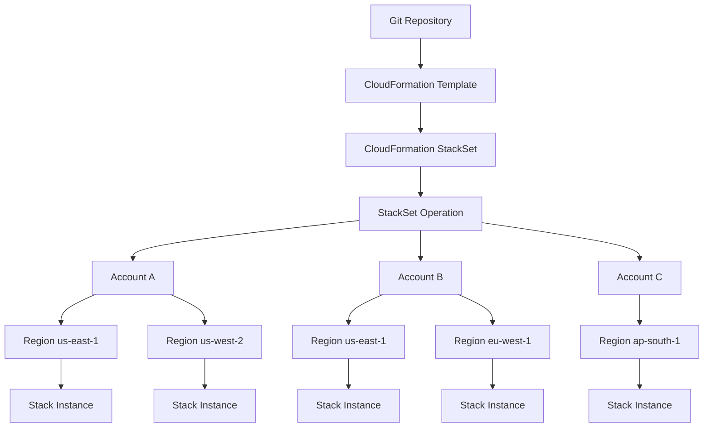
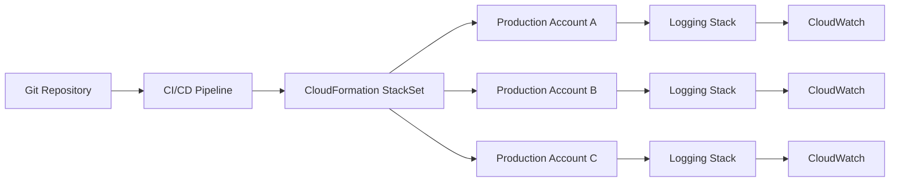

# 08- StackSets

## Overview

AWS CloudFormation StackSets extend CloudFormation stacks so the same infrastructure template can be deployed and managed across multiple AWS accounts and Regions from a centralized control plane.

A normal CloudFormation stack manages resources within one account and Region:

```text
CloudFormation Stack
        |
        +---- Account A
        |
        +---- Region us-east-1
```

A StackSet manages multiple stack instances:

```text
                         CloudFormation StackSet
                                  |
                    +-------------+-------------+
                    |             |             |
                    v             v             v
               Account A     Account B      Account C
               us-east-1     us-east-1      us-east-1
               us-west-2     eu-west-1      ap-south-1
```

Every stack instance is based on the same StackSet template, while parameter values can be customized for individual deployments. StackSets are primarily useful for centralized infrastructure, security baselines, logging, networking components, and organization-wide platform configuration. :contentReference[oaicite:0]{index=0}

## Why StackSets Exist

Managing infrastructure independently in dozens or hundreds of AWS accounts creates configuration drift and operational overhead.

Without StackSets:

```text
Account A -> manually deploy CloudFormation
Account B -> manually deploy CloudFormation
Account C -> manually deploy CloudFormation
Account D -> manually deploy CloudFormation
...
```

This creates problems:

- Templates can diverge.
- Security controls can become inconsistent.
- Updates require repeated manual operations.
- New accounts require additional provisioning work.
- Regional infrastructure can become inconsistent.
- Compliance becomes harder to enforce.

StackSets provide a centralized deployment model:

```text
                 Git Repository
                       |
                       v
              CloudFormation Template
                       |
                       v
                   StackSet
                       |
          +------------+------------+
          |            |            |
          v            v            v
      Account A    Account B    Account C
          |            |            |
          v            v            v
       Stack        Stack        Stack
```

The StackSet acts as the reusable deployment definition, while each account/Region combination receives a stack instance. :contentReference[oaicite:1]{index=1}

## Core Concepts

| Concept | Meaning |
|---|---|
| StackSet | Container that defines a template and its multi-account/multi-Region deployment configuration |
| Stack instance | Reference representing a StackSet deployment into one account and Region |
| Administrator account | Account from which the StackSet is managed |
| Target account | Account receiving a stack instance |
| Target Region | AWS Region receiving a stack instance |
| Permission model | Determines how StackSet deployment permissions are established |
| Operation | Create, update, delete, or drift-detection action performed by StackSets |
| Organizational Unit | AWS Organizations grouping that can be targeted by service-managed StackSets |

A stack instance is associated with exactly one StackSet and represents deployment into a specific target account and Region. A stack instance can exist even when the corresponding stack failed to create, which allows the failure state to be tracked. :contentReference[oaicite:2]{index=2}

## StackSet Architecture



The important distinction is:

```text
StackSet
    |
    +---- Template / desired configuration

Stack Instance
    |
    +---- One deployment of that configuration
          into one account + Region
```

## StackSet vs Stack

| Feature | CloudFormation Stack | CloudFormation StackSet |
|---|---|---|
| Scope | One account + Region | Multiple accounts + Regions |
| Template | One template | One template shared across deployments |
| Centralized management | Limited to stack | Yes |
| Multi-account deployment | No | Yes |
| Multi-Region deployment | No | Yes |
| Organizational Units | No | Yes with service-managed permissions |
| Automatic deployment to new accounts | No | Yes with service-managed permissions |
| Per-account parameter overrides | Limited to normal stack parameters | Supported |
| Typical use | Application/environment infrastructure | Organization-wide infrastructure |

StackSets do not replace normal stacks. They orchestrate multiple stacks using a common template and centralized operational model.

## Permission Models

StackSets support two permission models:

- `SELF_MANAGED`
- `SERVICE_MANAGED`

The choice is architectural, not merely a CLI setting. :contentReference[oaicite:3]{index=3}

### Self-Managed Permissions

With self-managed permissions, you explicitly configure the IAM roles required for StackSet operations.

Conceptually:

```text
Administrator Account
        |
        | AssumeRole
        v
Target Account
        |
        v
CloudFormation Execution Role
        |
        v
AWS Resources
```

You are responsible for creating and maintaining the required roles and trust relationships in the participating accounts. :contentReference[oaicite:4]{index=4}

Use this model when:

- Target accounts are not managed through AWS Organizations.
- You need explicit cross-account IAM configuration.
- You need to deploy to accounts outside one AWS Organization.
- Your organization requires direct control over the cross-account trust model.

### Service-Managed Permissions

Service-managed permissions integrate StackSets with AWS Organizations.

```text
AWS Organizations
        |
        +---- OU: Production
        |       |
        |       +---- Account A
        |       +---- Account B
        |
        +---- OU: Development
                |
                +---- Account C
                +---- Account D

                 |
                 v

          Service-Managed StackSet
```

CloudFormation creates and manages the required IAM roles on your behalf.

Service-managed StackSets can target:

- The organization.
- Organizational Units.
- Accounts using supported account-filter configurations.

They can also automatically deploy to accounts added to targeted organizational units. :contentReference[oaicite:5]{index=5}

For modern AWS Organizations environments, service-managed permissions are generally the preferred model when the infrastructure naturally belongs to the organization's centralized governance layer.

## Self-Managed vs Service-Managed

| Area | Self-Managed | Service-Managed |
|---|---|---|
| IAM roles | You create/manage them | CloudFormation manages required roles |
| AWS Organizations | Not required | Required |
| Cross-account trust | Explicitly configured | Integrated with Organizations |
| Target accounts | Flexible | Accounts within organization |
| OU targeting | No | Yes |
| Automatic deployment | No | Yes |
| Operational overhead | Higher | Lower |
| Central governance | Manual | Strong integration with Organizations |
| Best fit | Custom cross-account environments | AWS Organizations |

AWS recommends service-managed permissions when deploying across accounts managed by AWS Organizations. :contentReference[oaicite:6]{index=6}

## Administrator and Target Accounts

The **administrator account** is where StackSets are created and managed.

The **target account** is where the resulting stack is deployed.

For service-managed StackSets, the administrator can be:

- The AWS Organizations management account.
- A registered delegated administrator account.

A delegated administrator allows centralized StackSet management without requiring day-to-day StackSet operations to be performed from the Organizations management account. :contentReference[oaicite:7]{index=7}

```text
AWS Organizations
       |
       v
Management Account
       |
       +---- Delegated Administrator
                    |
                    v
               StackSet
                    |
          +---------+---------+
          |         |         |
          v         v         v
       Account A Account B Account C
```

A delegated administrator must be registered appropriately before using `DELEGATED_ADMIN` for service-managed StackSet operations. :contentReference[oaicite:8]{index=8}

## Service-Managed StackSet Roles

With service-managed permissions, CloudFormation creates the necessary service roles.

AWS documents roles with names ending in:

```text
CloudFormationStackSetsOrgAdmin
CloudFormationStackSetsOrgMember
```

for the management and target-account sides of service-managed StackSets. :contentReference[oaicite:9]{index=9}

Do not manually recreate these roles simply because they are visible in IAM.

Treat them as part of the StackSets service-managed permission model.

## Self-Managed StackSet Roles

With self-managed permissions, the administrator and target accounts need appropriate IAM roles.

The trust relationship must allow the StackSet administration side to assume the execution role in target accounts.

Conceptually:

```text
StackSet Administrator Role
            |
            | sts:AssumeRole
            v
StackSet Execution Role
            |
            v
CloudFormation
            |
            v
EC2 / S3 / IAM / Lambda / VPC / ...
```

The execution role should have only the permissions required by the StackSet template.

Avoid giving the execution role:

```json
{
  "Action": "*",
  "Resource": "*"
}
```

unless there is a specific, reviewed reason.

## Regional Scope

A StackSet is a **regional resource**.

If you create a StackSet in one Region, you manage that StackSet from that Region. :contentReference[oaicite:10]{index=10}

For example:

```text
StackSet: SecurityBaseline
Region: us-east-1
```

is not the same management object as another StackSet with the same name created in another Region.

For operational consistency, choose a deliberate Region for StackSet administration and document it.

## Stack Instances

A StackSet itself does not mean that every account automatically contains a stack.

Stack instances are created when you deploy the StackSet to target accounts and Regions.

For example:

```text
StackSet: OrganizationLogging

Targets:
    Account A + us-east-1
    Account A + us-west-2
    Account B + us-east-1
    Account C + eu-west-1
```

This creates four logical stack-instance targets.

```text
StackSet
   |
   +---- A / us-east-1
   +---- A / us-west-2
   +---- B / us-east-1
   +---- C / eu-west-1
```

Each stack instance represents one account/Region deployment.

## Creating a StackSet

The basic CLI operation is:

```bash
aws cloudformation create-stack-set \
  --stack-set-name organization-security-baseline \
  --template-body file://security-baseline.yaml \
  --permission-model SERVICE_MANAGED
```

For service-managed StackSets, automatic deployment settings can also be configured:

```bash
aws cloudformation create-stack-set \
  --stack-set-name organization-security-baseline \
  --template-body file://security-baseline.yaml \
  --permission-model SERVICE_MANAGED \
  --auto-deployment Enabled=true,RetainStacksOnAccountRemoval=true
```

The exact automatic-deployment configuration should reflect the organization's account lifecycle policy. :contentReference[oaicite:11]{index=11}

## Creating a StackSet With S3 Template Storage

For larger or centrally managed templates, store the template in a controlled S3 location:

```bash
aws cloudformation create-stack-set \
  --stack-set-name organization-security-baseline \
  --template-url https://example-bucket.s3.us-east-1.amazonaws.com/security-baseline.yaml \
  --permission-model SERVICE_MANAGED
```

Production considerations:

- Restrict write access to the template bucket.
- Enable appropriate S3 security controls.
- Version templates through Git.
- Use CI/CD to publish approved template artifacts.
- Avoid allowing individual engineers to modify production StackSet templates manually.

## Creating Stack Instances

Creating the StackSet does not necessarily deploy it everywhere.

Deploy stack instances separately:

```bash
aws cloudformation create-stack-instances \
  --stack-set-name organization-security-baseline \
  --deployment-targets OrganizationalUnitIds=ou-example123 \
  --regions us-east-1 us-west-2
```

This separates:

```text
StackSet definition
```

from:

```text
StackSet deployment targets
```

That separation is important for controlled rollout.

AWS supports deployment targets such as organizational units for service-managed StackSets. :contentReference[oaicite:12]{index=12}

## Deployment to Specific Accounts

For self-managed permissions, specify target account IDs:

```bash
aws cloudformation create-stack-instances \
  --stack-set-name organization-security-baseline \
  --accounts 111111111111 222222222222 \
  --regions us-east-1 us-west-2
```

For service-managed StackSets, account and OU targeting is controlled through organization-aware deployment targets. :contentReference[oaicite:13]{index=13}

## Deployment Operation Preferences

StackSet operations can affect many accounts simultaneously.

Therefore, deployment concurrency must be controlled.

Example:

```bash
aws cloudformation create-stack-instances \
  --stack-set-name organization-security-baseline \
  --deployment-targets OrganizationalUnitIds=ou-example123 \
  --regions us-east-1 us-west-2 \
  --operation-preferences \
    MaxConcurrentCount=2,FailureToleranceCount=0
```

The intent is:

```text
Maximum concurrent deployments = 2
Allowed failures = 0
```

This gives a controlled rollout rather than attempting to update every target simultaneously.

AWS also supports percentage-based concurrency and failure tolerance. `MaxConcurrentCount` cannot exceed `FailureToleranceCount + 1` when using count-based settings. :contentReference[oaicite:14]{index=14}

## Concurrency Strategy

For a large organization:

```text
100 Accounts
     |
     v
Deploy to 2 accounts
     |
     v
Validate
     |
     v
Deploy to next batch
     |
     v
Validate
     |
     v
Continue
```

This reduces blast radius.

A safer production rollout might look like:

```text
Phase 1
    2 accounts

Phase 2
    10 accounts

Phase 3
    25 accounts

Phase 4
    Remaining accounts
```

The exact values should depend on the infrastructure being deployed and the organization's failure tolerance.

## Region Ordering

StackSet operations can also be configured to process Regions in a deliberate order.

For example:

```text
us-east-1
     |
     v
us-west-2
     |
     v
eu-west-1
     |
     v
ap-south-1
```

This is useful when infrastructure must be validated region by region.

Do not assume that simultaneous multi-Region deployment is always safer. For high-impact infrastructure, controlled sequencing reduces blast radius.

## Failure Tolerance

Failure tolerance determines how many stack operation failures can occur before the StackSet operation is considered failed for a Region.

For example:

```text
Accounts in Region = 20
FailureToleranceCount = 1
```

If more failures occur than the configured tolerance, CloudFormation can stop the operation according to StackSet operation semantics. :contentReference[oaicite:15]{index=15}

A useful production principle is:

> Failure tolerance should reflect the maximum acceptable deployment blast radius, not merely how many failures the team is willing to ignore.

## Monitoring StackSet Operations

After creating or updating stack instances, monitor the StackSet operation.

First retrieve the operation ID:

```bash
aws cloudformation create-stack-instances \
  --stack-set-name organization-security-baseline \
  --deployment-targets OrganizationalUnitIds=ou-example123 \
  --regions us-east-1
```

Then:

```bash
aws cloudformation describe-stack-set-operation \
  --stack-set-name organization-security-baseline \
  --operation-id <operation-id>
```

Typical operation states include:

```text
RUNNING
SUCCEEDED
FAILED
STOPPING
STOPPED
QUEUED
```

`QUEUED` is particularly relevant to service-managed automatic deployments where operations can be sequenced. :contentReference[oaicite:16]{index=16}

## Stack Instance Status

The StackSet operation status and individual stack instance status are different concepts.

```text
StackSet Operation
        |
        +---- Account A / Region 1 -> SUCCEEDED
        +---- Account B / Region 1 -> FAILED
        +---- Account C / Region 1 -> SUCCEEDED
```

Always inspect failed stack instances rather than relying only on the overall operation status.

Useful commands include:

```bash
aws cloudformation list-stack-instances \
  --stack-set-name organization-security-baseline
```

For more detailed inspection:

```bash
aws cloudformation describe-stack-instance \
  --stack-set-name organization-security-baseline \
  --stack-instance-account 111111111111 \
  --stack-instance-region us-east-1
```

## Updating a StackSet

Update the template:

```bash
aws cloudformation update-stack-set \
  --stack-set-name organization-security-baseline \
  --template-body file://security-baseline-v2.yaml
```

If the update should be deployed to specific targets:

```bash
aws cloudformation update-stack-set \
  --stack-set-name organization-security-baseline \
  --template-body file://security-baseline-v2.yaml \
  --operation-preferences \
    MaxConcurrentCount=2,FailureToleranceCount=0
```

StackSet updates propagate to associated stack instances according to the operation's target and deployment configuration. :contentReference[oaicite:17]{index=17}

## Updating Parameters

StackSets support parameters for the underlying template.

For example:

```yaml
Parameters:
  LogRetentionDays:
    Type: Number
    Default: 30
```

The StackSet can define a default:

```text
LogRetentionDays = 30
```

while specific stack instances can have different values when required.

This is useful for:

```text
Production -> 90 days
Staging    -> 30 days
Development -> 7 days
```

Use parameter overrides deliberately. Excessive per-account customization weakens the consistency benefits of StackSets.

## Parameter Overrides

A centralized baseline should preferably have:

```text
Common template
     |
     +---- Common defaults
     |
     +---- Small number of intentional overrides
```

Avoid:

```text
Account A -> heavily customized
Account B -> heavily customized
Account C -> heavily customized
...
```

At that point, the StackSet becomes difficult to reason about and maintain.

## Automatic Deployment

Service-managed StackSets can automatically deploy to accounts added to targeted organizational units.

For example:

```text
OU: Production
     |
     +---- Account A
     +---- Account B
     +---- Account C
```

A new account is created:

```text
Account D
     |
     v
Added to Production OU
     |
     v
StackSet automatic deployment
     |
     v
Security baseline deployed
```

This is one of the strongest use cases for service-managed StackSets. :contentReference[oaicite:18]{index=18}

## Retaining Stacks When Accounts Leave

Automatic deployment can be configured with:

```text
RetainStacksOnAccountRemoval
```

This determines whether the stack remains when an account is removed from the targeted organization or OU.

This is an important lifecycle decision.

For infrastructure containing:

- Security controls.
- Logging.
- Compliance resources.
- Shared operational infrastructure.

consider carefully whether removal from an OU should destroy resources.

AWS exposes this behavior through the StackSet automatic-deployment configuration. :contentReference[oaicite:19]{index=19}

## Organizational Unit Targeting

OU targeting is useful for policy-based infrastructure deployment.

Example:

```text
Organization
|
+-- Security OU
|
+-- Production OU
|
+-- Staging OU
|
+-- Development OU
```

Different StackSets can target different OUs:

```text
SecurityBaseline
    -> Organization

ProductionMonitoring
    -> Production OU

DevelopmentTools
    -> Development OU
```

This aligns infrastructure deployment with organizational structure.

## Account Filters

Service-managed StackSets can use account filtering when the deployment scope needs to differ from an OU's complete account set.

Common filtering concepts include:

- `NONE`
- `INTERSECTION`
- `DIFFERENCE`
- `UNION`

These allow more precise targeting when organizational hierarchy alone is insufficient. :contentReference[oaicite:20]{index=20}

Use account filtering sparingly. Highly complex target rules increase operational complexity and make it harder to understand which accounts should receive a StackSet.

## Delegated Administration

For larger organizations, a dedicated member account can be registered as a delegated administrator for CloudFormation StackSets.

Conceptually:

```text
AWS Organizations Management Account
                |
                | Delegates StackSet administration
                v
        Infrastructure Account
                |
                v
             StackSets
                |
       +--------+--------+
       |        |        |
       v        v        v
    Account A Account B Account C
```

This separates:

```text
Organization governance
```

from:

```text
Infrastructure deployment operations
```

Service-managed StackSets support management and delegated-administrator workflows. :contentReference[oaicite:21]{index=21}

## `CALL_AS`

When using service-managed StackSets, the `--call-as` option identifies whether the caller is acting as:

```text
SELF
```

or:

```text
DELEGATED_ADMIN
```

Example:

```bash
aws cloudformation list-stack-sets \
  --call-as DELEGATED_ADMIN
```

When operating from a registered delegated administrator account, use `DELEGATED_ADMIN` where required. :contentReference[oaicite:22]{index=22}

## StackSet Tags

StackSets support tags that can be associated with the StackSet and propagated to supported resources created by its stacks.

Example:

```bash
aws cloudformation create-stack-set \
  --stack-set-name organization-logging \
  --template-body file://logging.yaml \
  --permission-model SERVICE_MANAGED \
  --tags \
    Key=Owner,Value=Platform \
    Key=Environment,Value=Organization
```

Useful tagging dimensions include:

| Tag | Example |
|---|---|
| `Owner` | `Platform` |
| `CostCenter` | `Engineering` |
| `ManagedBy` | `CloudFormation` |
| `Purpose` | `SecurityBaseline` |
| `Environment` | `Organization` |

Consistent tagging becomes particularly valuable when StackSets create resources across many accounts.

## IAM Capabilities

StackSet templates can contain IAM resources.

If the template creates IAM resources, the appropriate capability must be acknowledged.

For example:

```bash
aws cloudformation create-stack-set \
  --stack-set-name organization-iam-baseline \
  --template-body file://iam-baseline.yaml \
  --permission-model SERVICE_MANAGED \
  --capabilities CAPABILITY_IAM
```

If IAM resources use custom names, `CAPABILITY_NAMED_IAM` may be required. AWS documents these capability requirements for StackSets. :contentReference[oaicite:23]{index=23}

Treat IAM-capable StackSets as high-risk infrastructure because a single StackSet can propagate permission changes across many accounts.

## Production Use Cases

### Security Baselines

Deploy common controls:

```text
Security StackSet
    |
    +---- CloudTrail configuration
    +---- AWS Config configuration
    +---- IAM roles
    +---- GuardDuty-related configuration
    +---- Security monitoring
```

### Centralized Logging

Deploy logging infrastructure consistently:

```text
Organization
    |
    +---- Account A -> Logging resources
    +---- Account B -> Logging resources
    +---- Account C -> Logging resources
```

### Monitoring

Standardize:

- CloudWatch alarms.
- Log groups.
- Metric configuration.
- Operational IAM roles.

### Networking

StackSets can distribute standardized networking components where the architecture supports it.

Examples:

- VPC components.
- VPC endpoints.
- Route configuration.
- Shared security infrastructure.

### Platform Engineering

A platform team can use StackSets to bootstrap new AWS accounts with:

```text
Security
Logging
Monitoring
IAM
Operational tooling
```

This creates a repeatable account baseline.

## Backend Engineering Example

Suppose a company operates Django and FastAPI microservices across multiple AWS accounts.

Each account needs a standard operational role and CloudWatch logging configuration.

Instead of maintaining separate CloudFormation templates:

```text
Account A -> logging.yaml
Account B -> logging.yaml
Account C -> logging.yaml
```

the platform team maintains:

```text
Git
 |
 +-- cloudformation/
       |
       +-- organization-logging.yaml
```

The StackSet deploys the template to every production account.



The application teams consume the standardized infrastructure without owning its deployment lifecycle.

## StackSets in CI/CD

A production pipeline should treat StackSets as infrastructure artifacts.

Example:

```text
Pull Request
     |
     v
Validate CloudFormation
     |
     v
Security / Policy Checks
     |
     v
Deploy StackSet Update
     |
     v
Canary Accounts
     |
     v
Validate
     |
     v
Remaining Accounts
```

Useful pipeline stages include:

- Template validation.
- Static analysis.
- IAM policy review.
- Change review.
- StackSet update.
- Canary deployment.
- Multi-account rollout.
- Failure monitoring.
- Drift detection.

Do not make unrestricted StackSet updates directly from developer laptops for production infrastructure.

## Change Management

A StackSet can affect hundreds of resources across many accounts.

Therefore, infrastructure changes should be reviewed like application releases.

A useful process is:

```text
Template Change
      |
      v
Code Review
      |
      v
Validation
      |
      v
Controlled StackSet Update
      |
      v
Canary Accounts
      |
      v
Monitoring
      |
      v
Organization Rollout
```

For high-risk changes, start with a small set of representative accounts.

## StackSets and Drift Detection

StackSets also support drift detection.

Conceptually:

```text
StackSet
   |
   +---- Account A / Region 1
   |          |
   |          +---- IN_SYNC
   |
   +---- Account B / Region 1
   |          |
   |          +---- DRIFTED
   |
   +---- Account C / Region 1
              |
              +---- IN_SYNC
```

This is important because multi-account infrastructure is especially vulnerable to configuration divergence.

A StackSet can be centrally managed while individual stack instances can still be changed outside CloudFormation.

Therefore:

```text
Centralized deployment
        !=
Guaranteed configuration consistency
```

Drift detection remains important. AWS provides StackSet-specific drift detection capabilities. :contentReference[oaicite:24]{index=24}

## Deleting Stack Instances

Deleting a stack instance and deleting a StackSet are different operations.

To remove deployed stacks:

```bash
aws cloudformation delete-stack-instances \
  --stack-set-name organization-security-baseline \
  --accounts 111111111111 222222222222 \
  --regions us-east-1 \
  --no-retain-stacks
```

The `--no-retain-stacks` option deletes the stacks and their resources according to normal CloudFormation deletion behavior.

Use `--retain-stacks` when you need to remove the stacks from StackSet management while retaining the deployed stacks/resources. :contentReference[oaicite:25]{index=25}

This distinction is operationally critical:

```text
Delete Stack Instance
        |
        +---- Retain stacks?
        |       |
        |       +---- Yes -> Stack remains
        |       |
        |       +---- No  -> Stack is deleted
```

## Deleting a StackSet

After its stack instances have been appropriately removed, delete the StackSet:

```bash
aws cloudformation delete-stack-set \
  --stack-set-name organization-security-baseline
```

When operating as a delegated administrator, include:

```bash
--call-as DELEGATED_ADMIN
```

AWS documents StackSet deletion separately from stack-instance deletion. :contentReference[oaicite:26]{index=26}

## StackSet Lifecycle

A useful mental model is:

```text
Create StackSet
      |
      v
Create Stack Instances
      |
      v
Operate
      |
      +---- Update StackSet
      |          |
      |          v
      |      Update Instances
      |
      +---- Detect Drift
      |
      +---- Add Accounts/Regions
      |
      +---- Remove Stack Instances
      |
      v
Delete StackSet
```

The StackSet is the control object.

The stack instances are the deployed objects.

## Reliability Considerations

A StackSet operation can fail in only some target accounts.

For example:

```text
20 target accounts

18 -> SUCCESS
2  -> FAILED
```

Do not immediately assume the entire rollout is unusable.

Investigate the failed instances individually.

Common causes include:

- Missing permissions.
- Unsupported resource configuration.
- Region-specific constraints.
- Existing resources with conflicting names.
- Resource quotas.
- Invalid parameters.
- Dependency failures.
- Target-account configuration differences.

## Handling Partial Failure

A mature response is:

```text
StackSet operation
      |
      v
Identify failed instances
      |
      v
Classify failures
      |
      +---- Template problem
      |        |
      |        v
      |    Fix template
      |
      +---- Account problem
      |        |
      |        v
      |    Fix account
      |
      +---- Regional problem
               |
               v
          Fix Region
      |
      v
Retry controlled deployment
```

Do not blindly rerun a failed operation until the failure mode is understood.

## Security Considerations

StackSets can amplify both good and bad IAM design.

A template that creates an overly permissive IAM role can propagate that mistake across an entire organization.

Apply:

- Least privilege.
- Dedicated deployment roles.
- Controlled StackSet administrators.
- Code review for IAM changes.
- Organization-level governance.
- Explicit capability acknowledgement.
- Restricted template publication.
- Audit logging.
- Drift detection.

For IAM-heavy StackSets, require security review before deployment.

## Blast Radius

StackSets have a larger blast radius than ordinary CloudFormation stacks.

A normal stack change:

```text
One account
One Region
```

A StackSet change:

```text
Many accounts
Many Regions
Many resources
```

Therefore:

```text
Risk
  =
Change Impact
  ×
Number of Accounts
  ×
Number of Regions
```

This is not a literal AWS risk formula, but it is a useful engineering model.

The larger the target scope, the more important controlled concurrency and staged rollout become.

## Cost Considerations

StackSets themselves are a management mechanism rather than a substitute for the underlying resources' costs.

The primary cost comes from resources deployed by the StackSet:

```text
StackSet
   |
   +---- EC2 -> EC2 charges
   +---- S3  -> S3 charges
   +---- RDS -> RDS charges
   +---- CloudWatch -> monitoring charges
```

At organization scale, cost impact can become significant because the same resource pattern may be replicated across many accounts and Regions.

Before deploying organization-wide infrastructure, evaluate:

- Per-account resource cost.
- Per-Region cost.
- Logging volume.
- Monitoring volume.
- Data transfer.
- Storage.
- Lifecycle policies.

## High Availability Considerations

StackSets can deploy infrastructure across multiple Regions, but StackSets themselves do not automatically make an application highly available.

For example:

```text
StackSet
   |
   +---- us-east-1 -> Application stack
   |
   +---- us-west-2 -> Application stack
```

This only creates infrastructure in both Regions.

The application architecture still needs:

- Traffic routing.
- Data replication.
- Failure detection.
- Regional failover.
- State management.
- Disaster recovery procedures.

StackSets provide deployment consistency, not application-level HA.

## Disaster Recovery

StackSets are useful for rebuilding standardized infrastructure across accounts and Regions.

However, they do not replace:

- Database backups.
- Snapshot strategies.
- Data replication.
- Recovery procedures.
- Application recovery testing.

A useful DR model is:

```text
Git Repository
      |
      v
CloudFormation Template
      |
      v
StackSet
      |
      +---- Region A
      |
      +---- Region B
```

The templates provide reproducible infrastructure definitions, while data recovery must be handled separately.

## Production Best Practices

### Prefer Service-Managed Permissions for AWS Organizations

When the organization is the natural management boundary, service-managed StackSets reduce cross-account IAM administration. :contentReference[oaicite:27]{index=27}

### Use Delegated Administration

For larger organizations, separate StackSet administration from the AWS Organizations management account where appropriate.

### Deploy Canary Accounts First

Do not immediately deploy a high-impact change to every account.

### Control Concurrency

Use operation preferences to limit simultaneous changes.

### Keep Templates in Git

CloudFormation templates should be version-controlled and reviewed.

### Minimize Parameter Overrides

Centralized infrastructure should remain centralized.

### Monitor Individual Stack Instances

Overall StackSet status is not enough. Inspect failures at the account and Region level.

### Detect Drift

Multi-account infrastructure is especially vulnerable to manual configuration divergence.

### Use Least Privilege

StackSet execution roles should have only the permissions required by the template.

### Treat IAM Changes as High Risk

A single StackSet IAM mistake can propagate widely.

### Document Target Scope

Every StackSet should clearly identify:

- Target accounts.
- Target OUs.
- Target Regions.
- Permission model.
- Automatic deployment behavior.
- Retention behavior.
- Deployment concurrency.
- Failure tolerance.
- Owning team.

## Common Mistakes

### Confusing StackSets With a Single Stack

A StackSet is not simply a larger CloudFormation stack.

It is a management construct for deploying multiple stacks across accounts and Regions.

### Creating a StackSet but Expecting Deployment Automatically

Creating the StackSet and creating stack instances are separate operations.

```text
create-stack-set
      !=
create-stack-instances
```

### Using Self-Managed Permissions Without Understanding IAM Trust

Self-managed StackSets require explicit cross-account role configuration.

A missing trust relationship can prevent deployments. :contentReference[oaicite:28]{index=28}

### Giving the Execution Role Administrator Access

This increases the blast radius of a compromised or incorrectly configured StackSet.

Use least privilege.

### Deploying to Every Account Immediately

A template can be syntactically valid and still be operationally incorrect.

Start with canary accounts.

### Ignoring Region Differences

AWS service availability, quotas, and resource behavior can differ by Region.

### Ignoring Partial Failures

A successful StackSet operation does not eliminate the need to inspect individual stack instances when failures occur.

### Excessive Account-Specific Overrides

Too many overrides turn a standardized StackSet into a collection of special cases.

### Forgetting Automatic Deployment Behavior

A new account entering a targeted OU can automatically receive infrastructure.

Understand this before enabling automatic deployments.

### Accidentally Deleting Resources

`delete-stack-instances` supports both retaining and deleting stacks. Choosing the wrong option can have destructive consequences. :contentReference[oaicite:29]{index=29}

### Deleting the StackSet Before Handling Instances

Stack instance lifecycle and StackSet lifecycle are separate. Clean up deployments intentionally before deleting the StackSet.

### Treating StackSet Success as Application Success

A successfully deployed CloudFormation stack does not guarantee:

- Application health.
- Database connectivity.
- Service availability.
- Correct DNS.
- Correct IAM behavior.
- End-to-end functionality.

## Interview Traps

### What Is a CloudFormation StackSet?

A StackSet is a CloudFormation construct that lets you create, update, or delete stacks across multiple AWS accounts and Regions using a common template. :contentReference[oaicite:30]{index=30}

### What Is a Stack Instance?

A stack instance represents a StackSet deployment in a specific target account and Region.

### What Is the Difference Between Self-Managed and Service-Managed Permissions?

Self-managed permissions require you to create and manage the IAM roles used for cross-account StackSet operations.

Service-managed permissions integrate with AWS Organizations and allow CloudFormation to manage the required roles. :contentReference[oaicite:31]{index=31}

### Which Permission Model Is Better for AWS Organizations?

Service-managed permissions are generally the natural choice when deploying to accounts managed by AWS Organizations because StackSets can target OUs and support automatic deployment to new accounts. :contentReference[oaicite:32]{index=32}

### Can StackSets Deploy to Multiple Regions?

Yes.

A StackSet can create stack instances across multiple AWS Regions and accounts.

### Does Creating a StackSet Deploy It?

Not necessarily.

Creating the StackSet defines the centralized StackSet object. Stack instances are created through deployment operations.

### What Is a Stack Instance?

It is the account-and-Region-specific representation of a StackSet deployment.

### What Is a Delegated Administrator?

It is an AWS Organizations member account registered to administer a supported service, such as CloudFormation StackSets, without requiring everyday operations to occur from the organization management account.

### What Does `CALL_AS` Do?

For service-managed StackSets, it specifies whether the operation is being performed as the organization management account (`SELF`) or a registered delegated administrator (`DELEGATED_ADMIN`). :contentReference[oaicite:33]{index=33}

### How Do You Control StackSet Deployment Blast Radius?

Use:

- Account/OU targeting.
- Region ordering.
- Concurrency limits.
- Failure tolerance.
- Canary accounts.
- Monitoring.
- Staged rollouts.

### What Happens If One Account Fails?

The StackSet operation can continue or fail according to its configured failure tolerance and operation behavior. Individual stack instances should be inspected to determine which deployments failed. :contentReference[oaicite:34]{index=34}

### Can StackSets Automatically Deploy to New Accounts?

Yes, service-managed StackSets support automatic deployment to accounts added to targeted AWS Organizations accounts or OUs. :contentReference[oaicite:35]{index=35}

### Can StackSets Deploy Outside an AWS Organization?

Self-managed StackSets can be used for target accounts where the required cross-account roles and trust relationships are configured.

Service-managed StackSets are restricted to accounts managed by the relevant AWS Organization. :contentReference[oaicite:36]{index=36}

### Can StackSets Detect Drift?

Yes. StackSets support drift detection for their stack instances. :contentReference[oaicite:37]{index=37}

### What Is the Difference Between a StackSet and Stack Instance?

The StackSet defines the centralized template and deployment configuration.

The stack instance represents one deployment of that StackSet in a specific account and Region.

### What Is the Difference Between Deleting a Stack Instance and Deleting a StackSet?

Deleting a stack instance removes a deployment target from the StackSet and can either retain or delete the underlying stack.

Deleting the StackSet removes the centralized StackSet definition after its deployment lifecycle has been appropriately handled. :contentReference[oaicite:38]{index=38}

## CLI Reference

| Operation | Example |
|---|---|
| Create StackSet | `aws cloudformation create-stack-set --stack-set-name <name> --template-body file://template.yaml` |
| List StackSets | `aws cloudformation list-stack-sets` |
| Describe StackSet | `aws cloudformation describe-stack-set --stack-set-name <name>` |
| Create instances | `aws cloudformation create-stack-instances --stack-set-name <name> ...` |
| List instances | `aws cloudformation list-stack-instances --stack-set-name <name>` |
| Describe instance | `aws cloudformation describe-stack-instance --stack-set-name <name> --stack-instance-account <account> --stack-instance-region <region>` |
| Update StackSet | `aws cloudformation update-stack-set --stack-set-name <name> ...` |
| Describe operation | `aws cloudformation describe-stack-set-operation --stack-set-name <name> --operation-id <id>` |
| Delete instances | `aws cloudformation delete-stack-instances --stack-set-name <name> ...` |
| Delete StackSet | `aws cloudformation delete-stack-set --stack-set-name <name>` |

## Production Deployment Checklist

Before deploying a StackSet change:

- [ ] Template is version-controlled.
- [ ] CloudFormation template is validated.
- [ ] IAM changes have been reviewed.
- [ ] Permission model is correct.
- [ ] Administrator/delegated administrator configuration is correct.
- [ ] Target accounts or OUs are correct.
- [ ] Target Regions are correct.
- [ ] Parameter overrides are understood.
- [ ] Automatic deployment behavior is understood.
- [ ] Retention behavior is understood.
- [ ] Concurrency is appropriate.
- [ ] Failure tolerance is appropriate.
- [ ] Canary accounts are selected.
- [ ] Monitoring is available.
- [ ] Rollback/remediation procedure is known.
- [ ] Drift strategy is defined.

## Key Takeaways

- CloudFormation StackSets provide centralized management of CloudFormation stacks across multiple AWS accounts and Regions.
- A StackSet is the centralized deployment definition; a stack instance represents one deployment into a specific account and Region.
- StackSets support both `SELF_MANAGED` and `SERVICE_MANAGED` permission models.
- Self-managed permissions require explicit IAM roles and cross-account trust configuration.
- Service-managed permissions integrate StackSets with AWS Organizations and allow CloudFormation to manage the required roles.
- Service-managed StackSets can target AWS Organizations organizational units and support automatic deployment to new accounts.
- Delegated administration allows a designated member account to administer StackSets without requiring everyday operations from the Organizations management account.
- A StackSet is regional, so the Region used to manage it should be chosen deliberately.
- Creating a StackSet and deploying stack instances are separate lifecycle operations.
- StackSet operations can create, update, delete, and inspect stack instances across many accounts and Regions.
- Deployment concurrency and failure tolerance are critical controls for limiting blast radius.
- Canary deployments are preferable to immediately applying high-impact changes across an entire organization.
- StackSet operation status should not replace inspection of individual stack instances.
- Parameter overrides are useful for legitimate environment differences but should be kept to a minimum.
- Automatic deployment behavior must be understood before targeting organizational units.
- StackSet templates that create IAM resources require appropriate CloudFormation capability acknowledgement.
- StackSets can propagate security and operational infrastructure consistently, but they also amplify the impact of configuration mistakes.
- StackSets do not automatically make applications highly available; application-level HA, data replication, and failover remain separate concerns.
- StackSets can support centralized security baselines, logging, monitoring, networking, and account bootstrapping.
- StackSets support drift detection, which is important because centralized deployment does not prevent out-of-band changes.
- Stack instance deletion and StackSet deletion are separate operations.
- `--retain-stacks` and `--no-retain-stacks` have materially different consequences and must be selected deliberately.
- For large AWS Organizations environments, StackSets should be treated as a controlled infrastructure deployment platform rather than as a simple CloudFormation CLI shortcut.