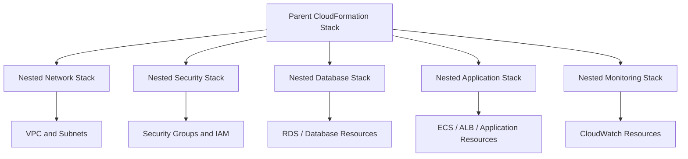
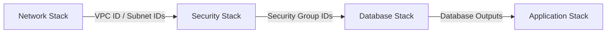
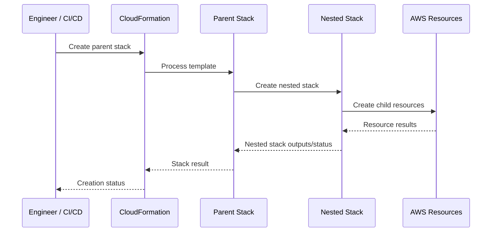

# 09- Nested Stacks

## Overview

Nested stacks are CloudFormation stacks created and managed from within a parent CloudFormation stack. They allow a large infrastructure template to be decomposed into smaller, reusable templates while preserving a single parent stack as the primary deployment boundary.

A parent stack references child templates using the `AWS::CloudFormation::Stack` resource:

```yaml
Resources:
  NetworkStack:
    Type: AWS::CloudFormation::Stack
    Properties:
      TemplateURL: https://example-bucket.s3.amazonaws.com/network.yaml
```

The resulting hierarchy is:

```text
Parent Stack
    |
    +---- Network Stack
    |
    +---- Database Stack
    |
    +---- Application Stack
```

Nested stacks are primarily useful when one logical infrastructure system is large enough that maintaining everything in one template becomes difficult. They provide modularity without turning every component into an independently managed top-level stack.

## Why Nested Stacks Exist

A single production CloudFormation template can become difficult to maintain:

```text
application.yaml
├── VPC
├── Subnets
├── Security Groups
├── IAM
├── RDS
├── ElastiCache
├── ECS
├── ALB
├── CloudWatch
└── Application configuration
```

As the infrastructure grows, the template can become difficult to:

- Review.
- Test.
- Reuse.
- Understand.
- Change safely.
- Assign ownership for.
- Navigate during incident response.

Nested stacks provide a modular structure:

```text
root.yaml
    |
    +---- network.yaml
    |
    +---- security.yaml
    |
    +---- database.yaml
    |
    +---- application.yaml
    |
    +---- monitoring.yaml
```

The parent stack remains the primary orchestration point while each child stack owns a coherent infrastructure component.

## Nested Stack Architecture



The important relationship is:

```text
Parent Stack
    |
    +---- creates/updates child stacks
              |
              +---- creates/updates child resources
```

The parent stack controls the lifecycle of its nested stacks.

## Nested Stack vs Top-Level Stack

Nested stacks and independent CloudFormation stacks solve different architectural problems.

| Area | Nested Stack | Top-Level Stack |
|---|---|---|
| Parent-child relationship | Yes | No |
| Lifecycle | Controlled by parent | Independent |
| Deployment boundary | Parent stack | Individual stack |
| Template modularity | Strong | Strong |
| Independent deployment | Limited | Yes |
| Cross-stack sharing | Through parent outputs/parameters | Through exports, SSM, parameters, etc. |
| Best use | Components of one logical system | Independently managed systems |
| Ownership | Usually centralized | Can be independently owned |
| Deletion | Parent lifecycle affects child | Independent |
| Operational isolation | Lower | Higher |

A useful rule is:

> Use nested stacks to modularize one infrastructure lifecycle; use independent stacks when components need independent lifecycle management.

## When to Use Nested Stacks

Nested stacks are appropriate when:

- A CloudFormation template is becoming too large.
- Infrastructure naturally decomposes into components.
- Components are deployed together.
- You want reusable infrastructure modules.
- A parent stack should own the complete lifecycle.
- Teams need cleaner template boundaries.
- You want to reduce duplication across similar infrastructure definitions.

Typical examples include:

```text
Application Stack
    |
    +---- Network
    +---- Security
    +---- Database
    +---- Compute
    +---- Monitoring
```

## When Not to Use Nested Stacks

Avoid nested stacks when components need independent operational lifecycles.

For example:

```text
Shared VPC
      |
      +---- Application A
      +---- Application B
      +---- Application C
```

If the VPC is independently owned and must remain available while applications are deployed or removed, it generally should not be a child stack of one application.

Instead:

```text
VPC Stack
   |
   +---- Independent lifecycle

Application A Stack
   |
   +---- Independent lifecycle

Application B Stack
   |
   +---- Independent lifecycle
```

This reduces accidental coupling.

## Basic Nested Stack Structure

A parent template can reference a child template using `AWS::CloudFormation::Stack`.

### Parent Template

```yaml
AWSTemplateFormatVersion: "2010-09-09"
Description: Parent application infrastructure

Resources:
  NetworkStack:
    Type: AWS::CloudFormation::Stack
    Properties:
      TemplateURL: https://my-cfn-templates.s3.amazonaws.com/network.yaml

  DatabaseStack:
    Type: AWS::CloudFormation::Stack
    Properties:
      TemplateURL: https://my-cfn-templates.s3.amazonaws.com/database.yaml
```

### Child Template

```yaml
AWSTemplateFormatVersion: "2010-09-09"
Description: Network infrastructure

Resources:
  VPC:
    Type: AWS::EC2::VPC
    Properties:
      CidrBlock: 10.0.0.0/16
      Tags:
        - Key: Name
          Value: application-vpc
```

The parent creates the nested stack, and the nested stack creates the VPC.

## `AWS::CloudFormation::Stack`

The `AWS::CloudFormation::Stack` resource represents a nested CloudFormation stack.

Important properties include:

| Property | Purpose |
|---|---|
| `TemplateURL` | Location of the child template |
| `Parameters` | Values passed from parent to child |
| `Tags` | Tags associated with the nested stack |
| `TimeoutInMinutes` | Creation timeout for the nested stack |
| `NotificationARNs` | SNS notification configuration |
| `RoleARN` | IAM role used for stack operations |
| `DeletionPolicy` | Controls deletion behavior |
| `UpdateReplacePolicy` | Controls replacement behavior |

The most important property is usually `TemplateURL`.

## Template Storage

Nested stack templates are typically stored in Amazon S3.

Example:

```text
s3://my-cfn-templates/
├── root.yaml
├── network.yaml
├── security.yaml
├── database.yaml
└── application.yaml
```

The parent references the child:

```yaml
Resources:
  NetworkStack:
    Type: AWS::CloudFormation::Stack
    Properties:
      TemplateURL: https://my-cfn-templates.s3.amazonaws.com/network.yaml
```

### Production Considerations

The child template must be accessible to CloudFormation.

For production:

- Keep templates in controlled S3 buckets.
- Restrict write access.
- Version templates through Git.
- Publish approved artifacts through CI/CD.
- Avoid manually editing production templates.
- Use consistent artifact naming.
- Keep parent and child template versions synchronized.

## Passing Parameters to Nested Stacks

The parent can pass parameters to the child stack.

### Child Template

```yaml
Parameters:
  VpcCidr:
    Type: String
    Description: CIDR block for the VPC

Resources:
  VPC:
    Type: AWS::EC2::VPC
    Properties:
      CidrBlock: !Ref VpcCidr
```

### Parent Template

```yaml
Parameters:
  EnvironmentVpcCidr:
    Type: String
    Default: 10.0.0.0/16

Resources:
  NetworkStack:
    Type: AWS::CloudFormation::Stack
    Properties:
      TemplateURL: https://my-cfn-templates.s3.amazonaws.com/network.yaml
      Parameters:
        VpcCidr: !Ref EnvironmentVpcCidr
```

The data flow is:

```text
Parent Parameter
       |
       v
Parent Stack
       |
       | Parameters
       v
Nested Stack
       |
       v
Child Resource
```

This allows the parent to control configuration without duplicating infrastructure definitions.

## Passing Multiple Parameters

```yaml
Resources:
  DatabaseStack:
    Type: AWS::CloudFormation::Stack
    Properties:
      TemplateURL: https://my-cfn-templates.s3.amazonaws.com/database.yaml
      Parameters:
        Environment: !Ref Environment
        VpcId: !GetAtt NetworkStack.Outputs.VpcId
        DatabaseSubnetIds: !GetAtt NetworkStack.Outputs.DatabaseSubnetIds
```

This is one of the primary mechanisms for connecting nested stacks.

## Nested Stack Outputs

Child stacks can expose outputs.

### Child Stack

```yaml
Outputs:
  VpcId:
    Description: ID of the VPC
    Value: !Ref VPC

  VpcCidr:
    Description: VPC CIDR block
    Value: !GetAtt VPC.CidrBlock
```

The parent can consume those outputs.

```yaml
Resources:
  NetworkStack:
    Type: AWS::CloudFormation::Stack
    Properties:
      TemplateURL: https://my-cfn-templates.s3.amazonaws.com/network.yaml

  ApplicationStack:
    Type: AWS::CloudFormation::Stack
    Properties:
      TemplateURL: https://my-cfn-templates.s3.amazonaws.com/application.yaml
      Parameters:
        VpcId: !GetAtt NetworkStack.Outputs.VpcId
```

The relationship becomes:

```text
Network Nested Stack
        |
        | Outputs.VpcId
        v
Parent Stack
        |
        | Parameter: VpcId
        v
Application Nested Stack
```

## `Fn::GetAtt` and Nested Stack Outputs

For a nested stack resource:

```yaml
NetworkStack:
  Type: AWS::CloudFormation::Stack
```

the parent can access child outputs with:

```yaml
!GetAtt NetworkStack.Outputs.VpcId
```

Equivalent long-form syntax:

```yaml
Fn::GetAtt:
  - NetworkStack
  - Outputs.VpcId
```

This is a key pattern for passing values between nested stacks.

## Dependency Flow

Suppose the architecture is:

```text
Network
   |
   v
Security
   |
   v
Database
   |
   v
Application
```

The parent can express these dependencies through parameter references.



For example:

```yaml
Resources:
  NetworkStack:
    Type: AWS::CloudFormation::Stack
    Properties:
      TemplateURL: https://my-cfn-templates.s3.amazonaws.com/network.yaml

  DatabaseStack:
    Type: AWS::CloudFormation::Stack
    Properties:
      TemplateURL: https://my-cfn-templates.s3.amazonaws.com/database.yaml
      Parameters:
        VpcId: !GetAtt NetworkStack.Outputs.VpcId
```

CloudFormation can infer the dependency from the reference.

## Explicit `DependsOn`

When a dependency cannot be expressed through a value reference, `DependsOn` can be used.

```yaml
Resources:
  ApplicationStack:
    Type: AWS::CloudFormation::Stack
    DependsOn:
      - DatabaseStack
    Properties:
      TemplateURL: https://my-cfn-templates.s3.amazonaws.com/application.yaml
```

Prefer implicit dependencies through references when possible.

```yaml
VpcId: !GetAtt NetworkStack.Outputs.VpcId
```

is generally preferable to adding unnecessary:

```yaml
DependsOn:
```

because the data dependency itself expresses the relationship.

## Nested Stack Lifecycle

The parent stack controls the lifecycle of the nested stack.

```text
Parent CREATE
     |
     v
Nested Stack CREATE
     |
     v
Child Resources CREATE
```

During update:

```text
Parent UPDATE
     |
     v
Nested Stack UPDATE
     |
     v
Child Resources UPDATE
```

During deletion:

```text
Parent DELETE
     |
     v
Nested Stack DELETE
     |
     v
Child Resources DELETE
```

This lifecycle coupling is the defining characteristic of nested stacks.

## Creation Flow



A nested stack is not merely a file include. It is an actual CloudFormation stack resource managed as part of the parent stack lifecycle.

## Updating Nested Stacks

If the child template changes, update the parent stack so CloudFormation processes the new child template reference.

For example:

```bash
aws cloudformation update-stack \
  --stack-name production-platform \
  --template-body file://root.yaml
```

If the child template is stored at the same S3 URL, the deployment process should ensure CloudFormation receives the intended updated template artifact.

A production pipeline should avoid ambiguous mutable template references where reproducibility matters.

## Template Versioning

A common production problem is:

```text
root.yaml
    |
    +---- network.yaml
```

where `network.yaml` is continuously overwritten.

A deployment may then become difficult to reproduce.

Prefer immutable or version-controlled artifacts.

For example:

```text
artifacts/
├── network/
│   ├── v1/
│   └── v2/
├── database/
│   ├── v1/
│   └── v2/
```

The exact artifact strategy depends on the CI/CD platform, but the important principle is:

> A production infrastructure deployment should be reproducible from a known set of template artifacts.

## Nested Stack Updates and Resource Replacement

Nested stacks do not eliminate normal CloudFormation update semantics.

A change in a child template can cause:

```text
Child Template Change
        |
        v
CloudFormation Evaluation
        |
        +---- In-place update
        |
        +---- Replacement
        |
        +---- Deletion + recreation
```

For stateful resources such as RDS, understand replacement behavior before deploying.

Use policies such as:

```yaml
Resources:
  Database:
    Type: AWS::RDS::DBInstance
    DeletionPolicy: Snapshot
    UpdateReplacePolicy: Snapshot
```

when appropriate for the resource and recovery strategy.

## Deletion Behavior

Deleting the parent stack normally causes nested stacks to be deleted as part of the parent lifecycle.

Therefore:

```text
Delete Parent
     |
     +---- Delete Network Stack
     +---- Delete Database Stack
     +---- Delete Application Stack
```

This can have significant consequences.

Do not place independently managed production data stores inside an application parent stack unless the deletion lifecycle is deliberately designed.

## Protecting Stateful Resources

Nested stacks do not automatically protect databases.

Use appropriate deletion policies:

```yaml
Resources:
  Database:
    Type: AWS::RDS::DBInstance
    DeletionPolicy: Snapshot
    UpdateReplacePolicy: Snapshot
```

For critical production databases, consider whether the database should be completely outside the nested stack hierarchy.

For example:

```text
Platform Stack
    |
    +---- Network
    +---- Security
    +---- Application

Database Stack
    |
    +---- RDS
```

This gives the database an independent lifecycle.

## Nested Stack Outputs and Root Outputs

The parent can expose nested stack outputs as its own outputs.

```yaml
Outputs:
  VpcId:
    Description: Application VPC ID
    Value: !GetAtt NetworkStack.Outputs.VpcId
```

This allows consumers of the parent stack to access important values without needing to inspect child stacks.

```text
Nested Network Stack
        |
        v
    VpcId output
        |
        v
Parent Stack Output
        |
        v
External Consumer
```

## Nested Stacks vs Cross-Stack References

There are two different patterns:

### Nested Stack Composition

```text
Parent
  |
  +---- Network
  +---- Database
  +---- Application
```

### Independent Stack Composition

```text
Network Stack
     |
     +---- Export VPC ID
                |
                v
Application Stack
```

The first creates a lifecycle hierarchy.

The second creates independently managed stacks that exchange values.

## Choosing Between the Two

| Requirement | Nested Stack | Independent Stack |
|---|---:|---:|
| Components always deploy together | Strong fit | Possible |
| Independent lifecycle | Poor fit | Strong fit |
| Modular template organization | Strong fit | Strong fit |
| Shared infrastructure | Usually poor fit | Strong fit |
| Application-specific infrastructure | Strong fit | Strong fit |
| Central reusable infrastructure | Possible | Usually better |
| Independent team ownership | Limited | Stronger |
| Parent controls deletion | Yes | No |
| Cross-application reuse | Limited | Strong |

A practical decision rule:

```text
Same lifecycle?
    |
   Yes
    |
    v
Nested Stack

Independent lifecycle?
    |
   Yes
    |
    v
Separate Stack
```

## Nested Stacks and Reusability

Nested templates can be reused across multiple parent templates.

For example:

```text
network.yaml
     |
     +---- application-a/root.yaml
     |
     +---- application-b/root.yaml
     |
     +---- application-c/root.yaml
```

This reduces duplication.

However, reusable does not mean universally appropriate.

A child template should have:

- Clear inputs.
- Clear outputs.
- Predictable behavior.
- Minimal assumptions.
- Documented dependencies.
- Stable interfaces.

Think of a nested stack template similarly to a software module.

```text
Input
  |
  v
Nested Stack
  |
  v
Output
```

## Nested Stack Interface Design

A well-designed nested stack has a small interface.

Example:

```yaml
Parameters:
  VpcCidr:
    Type: String

  Environment:
    Type: String
```

Outputs:

```yaml
Outputs:
  VpcId:
    Value: !Ref VPC

  PublicSubnetIds:
    Value: !Join
      - ","
      - !Ref PublicSubnets
```

The parent should not need to know how the child creates the resources.

This creates encapsulation:

```text
Parent
  |
  | Inputs
  v
+------------------+
| Network Stack    |
|                  |
| VPC              |
| Subnets          |
| Route Tables     |
+------------------+
  |
  | Outputs
  v
Parent
```

## Nested Stack Interface Stability

Changing a child stack's parameters or outputs can affect multiple parent templates.

Therefore, treat the child template's interface as an API.

For example:

```text
network.yaml

Inputs:
    VpcCidr
    Environment

Outputs:
    VpcId
    PublicSubnetIds
    PrivateSubnetIds
```

Avoid casually renaming:

```text
VpcId -> NetworkId
```

if multiple parent stacks consume the output.

This is infrastructure API compatibility.

## Parameter Validation

Nested stack parameters should use strong validation.

```yaml
Parameters:
  Environment:
    Type: String
    AllowedValues:
      - development
      - staging
      - production

  VpcCidr:
    Type: String
    Default: 10.0.0.0/16
```

This prevents invalid inputs from reaching resource creation.

For complex validation, complement CloudFormation validation with CI/CD checks and static analysis.

## Security Considerations

Nested stacks inherit the security implications of their resources and IAM configuration.

Important areas include:

- S3 access to child templates.
- IAM roles used by CloudFormation.
- Sensitive parameter handling.
- Resource policies.
- Cross-stack references.
- Template modification permissions.
- CI/CD artifact integrity.

Do not place secrets directly into child templates:

```yaml
Password: "production-secret"
```

Use appropriate secret-management mechanisms such as:

- AWS Secrets Manager.
- Systems Manager Parameter Store.
- Dynamic references where appropriate.

## Template Bucket Security

The S3 bucket containing nested templates is part of the deployment supply chain.

Protect it accordingly.

Recommended controls include:

- Block unintended public access.
- Restrict write permissions.
- Enable encryption where appropriate.
- Enable versioning where useful.
- Restrict CI/CD publishing permissions.
- Audit access.
- Avoid allowing application workloads to modify infrastructure artifacts.

A compromised child template can become a supply-chain attack against the entire infrastructure deployment.

## IAM Role Considerations

A nested stack can specify a CloudFormation service role:

```yaml
Resources:
  ApplicationStack:
    Type: AWS::CloudFormation::Stack
    Properties:
      TemplateURL: https://my-cfn-templates.s3.amazonaws.com/application.yaml
      RoleARN: arn:aws:iam::111111111111:role/cloudformation-deployment-role
```

The role should have only the permissions necessary to manage the declared resources.

Do not treat nested stacks as a reason to grant broad administrator permissions.

## Monitoring

Monitor nested stacks through:

- CloudFormation events.
- Stack status.
- Child stack status.
- CloudTrail.
- CI/CD pipeline results.
- CloudWatch where relevant.

Useful CLI commands include:

```bash
aws cloudformation describe-stacks \
  --stack-name production-platform
```

List stack resources:

```bash
aws cloudformation list-stack-resources \
  --stack-name production-platform
```

Nested stacks appear as stack resources in the parent.

## Finding Nested Stack Resources

```bash
aws cloudformation list-stack-resources \
  --stack-name production-platform
```

The output can contain:

```text
LogicalResourceId: NetworkStack
ResourceType: AWS::CloudFormation::Stack
PhysicalResourceId: arn:aws:cloudformation:...
```

The physical resource ID identifies the nested stack.

You can then inspect that nested stack separately:

```bash
aws cloudformation describe-stack-resources \
  --stack-name <nested-stack-name-or-id>
```

This is useful during troubleshooting.

## Troubleshooting Nested Stacks

A common failure chain is:

```text
Parent Stack
     |
     v
Nested Stack FAILED
     |
     v
Child Resource FAILED
```

The parent status may only tell you that the nested stack failed.

The useful debugging path is:

```text
Parent Stack
    |
    v
Nested Stack Resource
    |
    v
Nested Stack Events
    |
    v
Failed Resource
    |
    v
Root Cause
```

Start with CloudFormation events:

```bash
aws cloudformation describe-stack-events \
  --stack-name production-platform
```

Then inspect the nested stack events:

```bash
aws cloudformation describe-stack-events \
  --stack-name <nested-stack-id>
```

## Common Nested Stack Failure Causes

Typical failures include:

| Failure | Likely Cause |
|---|---|
| Template inaccessible | S3 permissions or invalid URL |
| Nested stack creation failed | Child resource failure |
| Parameter validation failure | Parent passed invalid value |
| IAM failure | Missing CloudFormation permissions |
| Resource already exists | Naming or ownership conflict |
| Update rollback | Child resource could not be updated |
| Dependency failure | Required parent output unavailable |
| Replacement failure | Resource replacement constraints |
| Region-specific failure | Resource unavailable or configuration differs |

Debug the lowest-level failed resource rather than stopping at the parent error.

## Rollback Behavior

If a child stack fails during creation or update, the parent stack can also fail and enter rollback behavior.

Conceptually:

```text
Parent Update
      |
      v
Child Update
      |
      v
Resource Failure
      |
      v
Child Rollback
      |
      v
Parent Rollback
```

The exact final state depends on the operation and configured stack policies.

For production systems, understand rollback behavior before deploying changes to stateful infrastructure.

## `ContinueUpdateRollback`

If a parent stack becomes stuck in `UPDATE_ROLLBACK_FAILED`, CloudFormation provides mechanisms to continue rollback.

Example:

```bash
aws cloudformation continue-update-rollback \
  --stack-name production-platform
```

When nested stacks are involved, identify the resources preventing rollback before attempting recovery.

Do not use rollback recovery commands blindly. Understand which resources are inconsistent and whether skipping a resource is safe.

## Stack Policies

Stack policies can protect critical resources from unintended updates.

For example, a production database may require stronger protection than application resources.

Nested stacks do not remove the need for stack-level protection.

Consider:

- Stack policies.
- Deletion policies.
- Update replacement policies.
- IAM access controls.
- CI/CD approval gates.

## Change Sets

Change sets can be used to preview CloudFormation changes before execution.

For a parent stack containing nested stacks, inspect the proposed changes carefully.

The objective is:

```text
Template Change
      |
      v
Change Set
      |
      v
Inspect Parent + Nested Changes
      |
      v
Approval
      |
      v
Execute
```

For production infrastructure, change review is especially important when child stacks contain:

- RDS.
- IAM.
- VPC networking.
- Security groups.
- Load balancers.
- Stateful resources.

## CI/CD Workflow

A production nested-stack repository can be structured as:

```text
cloudformation/
├── root.yaml
├── nested/
│   ├── network.yaml
│   ├── security.yaml
│   ├── database.yaml
│   ├── application.yaml
│   └── monitoring.yaml
└── scripts/
    └── deploy.sh
```

A CI/CD pipeline can:

```text
Commit
  |
  v
Template Validation
  |
  v
Static Analysis
  |
  v
Upload Child Templates
  |
  v
Deploy Parent
  |
  v
Monitor Nested Stacks
  |
  v
Validate Infrastructure
```

The pipeline should publish child templates before deploying a parent template that references them.

## Template Validation

Validate CloudFormation templates before deployment:

```bash
aws cloudformation validate-template \
  --template-body file://root.yaml
```

Validate individual nested templates as well:

```bash
aws cloudformation validate-template \
  --template-body file://nested/network.yaml
```

Validation catches structural and syntax problems but does not guarantee that deployment will succeed.

Complement it with:

- `cfn-lint`.
- IAM policy analysis.
- Security scanning.
- Change sets.
- Integration testing where practical.

## Deployment Ordering

If the parent references nested outputs:

```text
Network
   |
   v
Database
   |
   v
Application
```

CloudFormation can infer dependencies through references.

Avoid manually encoding every possible dependency with `DependsOn`.

Prefer:

```yaml
VpcId: !GetAtt NetworkStack.Outputs.VpcId
```

over:

```yaml
DependsOn:
  - NetworkStack
```

when the value dependency already exists.

## Performance and Scalability

Nested stacks can improve maintainability but do not eliminate CloudFormation deployment limits or operational complexity.

A very deep hierarchy can make troubleshooting harder:

```text
Root
 |
 +-- Level 1
      |
      +-- Level 2
           |
           +-- Level 3
                |
                +-- Resource
```

Prefer shallow, meaningful hierarchies.

A practical architecture might be:

```text
Root
 |
 +-- Network
 +-- Security
 +-- Database
 +-- Application
 +-- Monitoring
```

rather than many layers of tiny nested stacks.

## Depth and Complexity

Nested stacks are most valuable when the boundaries represent meaningful infrastructure domains.

Good:

```text
Network
Security
Database
Application
Monitoring
```

Less useful:

```text
Vpc
Subnet
RouteTable
Route
SecurityGroup
```

Creating a nested stack for every small resource can produce excessive orchestration overhead and make the infrastructure harder to understand.

## Cost Considerations

Nested stacks themselves are primarily a CloudFormation organization mechanism.

The significant costs come from the AWS resources they create.

However, operational complexity can have indirect cost:

- Longer deployments.
- More difficult troubleshooting.
- More CI/CD complexity.
- More template artifacts.
- More infrastructure dependencies.

Use nested stacks to reduce engineering complexity, not simply to increase the number of templates.

## Disaster Recovery

Nested stacks improve infrastructure reproducibility because infrastructure can be represented as version-controlled templates.

However, they do not provide data backup.

For a system containing:

```text
Network
Database
Application
```

the nested stack can recreate infrastructure, but database data still requires:

- Backups.
- Snapshots.
- Replication.
- Recovery testing.
- Defined RPO.
- Defined RTO.

Infrastructure-as-code and data recovery are complementary concerns.

## Production Best Practices

### Keep Child Stacks Cohesive

Each nested template should represent a meaningful infrastructure domain.

### Keep the Hierarchy Shallow

Avoid unnecessary levels of nesting.

### Define Stable Interfaces

Treat child parameters and outputs like APIs.

### Version Template Artifacts

Use reproducible deployment artifacts.

### Keep Stateful Resources Carefully Isolated

Do not couple critical databases to application deletion unless that lifecycle is intentional.

### Secure the Template Bucket

The S3 location containing child templates is part of the infrastructure supply chain.

### Use Least Privilege

CloudFormation execution roles should contain only required permissions.

### Validate Every Template

Validate both the parent and nested templates in CI/CD.

### Use Change Sets for High-Risk Changes

Review proposed resource modifications before execution.

### Monitor Child Stacks

When debugging, inspect the nested stack's own events rather than relying solely on the parent's status.

### Avoid Excessive Parameter Overrides

Keep nested stack interfaces small and predictable.

## Common Mistakes

### Treating Nested Stacks as Simple File Includes

A nested stack is an actual CloudFormation stack resource with its own lifecycle and events.

### Making Every Resource a Nested Stack

This creates unnecessary complexity.

Use nested stacks for meaningful infrastructure boundaries.

### Passing Too Many Parameters

A child stack with dozens of tightly coupled parameters has a poorly designed interface.

Prefer cohesive inputs and meaningful outputs.

### Forgetting `TemplateURL`

Nested stacks require the child template to be available at the referenced location.

### Using an Inaccessible S3 Template

A valid URL is not sufficient if CloudFormation cannot access the object.

### Mutating Templates Without Versioning

If child templates change without a reproducible artifact strategy, deployments become difficult to audit and reproduce.

### Coupling Production Databases to Parent Deletion

Deleting the parent can affect nested database stacks.

Use appropriate deletion policies or independent stacks for critical stateful infrastructure.

### Ignoring Child Stack Events

The parent may report a generic nested-stack failure. The actual root cause is usually deeper in the child stack's events.

### Overusing `DependsOn`

References already establish dependencies. Excessive explicit dependencies make templates harder to reason about.

### Assuming Nested Stacks Provide Independent Deployment

They do not. Their lifecycle is controlled by the parent.

### Treating Nested Outputs as Global Exports

Nested stack outputs are exposed to the parent through `Fn::GetAtt`. They are not automatically organization-wide CloudFormation exports.

### Sharing One Nested Stack Across Multiple Parents at Runtime

A nested stack belongs to its parent. If infrastructure needs to be shared independently by multiple applications, an independent stack is usually a better design.

## Interview Traps

### What Is a Nested Stack?

A nested stack is a CloudFormation stack created as a resource within another CloudFormation stack using `AWS::CloudFormation::Stack`.

### Why Use Nested Stacks?

They provide template modularity and allow a large infrastructure definition to be divided into smaller components while preserving a common parent lifecycle.

### How Does a Parent Pass Parameters to a Nested Stack?

Use the `Parameters` property:

```yaml
Resources:
  NetworkStack:
    Type: AWS::CloudFormation::Stack
    Properties:
      TemplateURL: https://example.com/network.yaml
      Parameters:
        VpcCidr: !Ref VpcCidr
```

### How Does a Parent Read Nested Stack Outputs?

Use:

```yaml
!GetAtt NetworkStack.Outputs.VpcId
```

### What Is the Difference Between Nested Stacks and Cross-Stack References?

Nested stacks create a parent-child lifecycle relationship.

Cross-stack references allow independently managed stacks to exchange exported values.

### Should a Shared VPC Be a Nested Stack of Every Application?

No.

A shared VPC normally requires an independent lifecycle. Making it a nested stack of an application unnecessarily couples network infrastructure to that application's lifecycle.

### What Happens When the Parent Stack Is Deleted?

Nested stacks are part of the parent stack's lifecycle and are normally deleted with the parent, subject to applicable resource policies.

### Can Nested Stacks Be Reused?

Yes. The same child template can be referenced by multiple parent templates, provided its interface and deployment assumptions are appropriate.

### How Do You Debug a Nested Stack Failure?

Start with the parent stack event, identify the nested stack resource, then inspect the nested stack's events to find the underlying failed resource.

### Can Nested Stacks Have Their Own Parameters?

Yes. Parameters defined in the child template can be supplied by the parent through the nested stack resource's `Parameters` property.

### Can Nested Stacks Have Outputs?

Yes. Child outputs can be exposed to the parent through:

```yaml
!GetAtt ChildStack.Outputs.OutputName
```

### Are Nested Stacks Independently Deployable?

Not in the same sense as top-level stacks. Their lifecycle is controlled by the parent stack.

### When Should You Prefer Separate Stacks?

Use separate stacks when components require:

- Independent deployment.
- Independent ownership.
- Independent deletion.
- Independent rollback.
- Reuse across multiple applications.
- Long-lived shared infrastructure.

## CLI Reference

| Operation | Command |
|---|---|
| Validate parent | `aws cloudformation validate-template --template-body file://root.yaml` |
| Validate child | `aws cloudformation validate-template --template-body file://network.yaml` |
| Create parent | `aws cloudformation create-stack --stack-name <name> --template-body file://root.yaml` |
| Update parent | `aws cloudformation update-stack --stack-name <name> --template-body file://root.yaml` |
| Describe stack | `aws cloudformation describe-stacks --stack-name <name>` |
| List resources | `aws cloudformation list-stack-resources --stack-name <name>` |
| Describe events | `aws cloudformation describe-stack-events --stack-name <name>` |
| Continue rollback | `aws cloudformation continue-update-rollback --stack-name <name>` |
| Create change set | `aws cloudformation create-change-set --stack-name <name> --change-set-name <change-set> --template-body file://root.yaml` |

## Production Design Example

A production Django/FastAPI platform could use:

```text
production-platform
│
├── network.yaml
│   ├── VPC
│   ├── Public Subnets
│   ├── Private Subnets
│   └── Route Tables
│
├── security.yaml
│   ├── Security Groups
│   └── IAM Roles
│
├── database.yaml
│   └── RDS
│
├── application.yaml
│   ├── ECS / Compute
│   ├── ALB
│   └── Application configuration
│
└── monitoring.yaml
    ├── CloudWatch
    └── Alarms
```

The parent coordinates deployment:

```text
                         Parent Stack
                              |
        +---------------------+---------------------+
        |           |          |          |          |
        v           v          v          v          v
     Network     Security   Database   Application Monitoring
        |           |          |          |          |
        +-----------+----------+----------+----------+
                              |
                         Application
                              |
                    +---------+---------+
                    |                   |
                 Django              FastAPI
                    |                   |
                    +---------+---------+
                              |
                         PostgreSQL
```

The parent should expose only the outputs required by external consumers.

## Key Takeaways

- Nested stacks allow a large CloudFormation deployment to be divided into smaller child templates.
- A nested stack is represented by the `AWS::CloudFormation::Stack` resource.
- The parent stack controls the lifecycle of its nested stacks.
- Nested stacks are best suited to components that share a common deployment and deletion lifecycle.
- Use independent top-level stacks when infrastructure requires an independent lifecycle.
- Child templates are commonly stored in Amazon S3 and referenced with `TemplateURL`.
- The parent can pass configuration to child stacks through the `Parameters` property.
- Child stacks can expose values through `Outputs`.
- Parent stacks consume child outputs with `Fn::GetAtt`, commonly using `!GetAtt ChildStack.Outputs.OutputName`.
- Parameter and output interfaces should be treated like APIs and kept small and stable.
- References between nested stacks can automatically establish CloudFormation dependencies.
- `DependsOn` should be used when an explicit dependency is required but cannot be represented through a resource reference.
- Nested stacks do not eliminate normal CloudFormation update, replacement, rollback, or deletion behavior.
- Parent deletion can trigger nested stack deletion, making lifecycle design especially important for stateful resources.
- Use `DeletionPolicy` and `UpdateReplacePolicy` appropriately for critical resources such as databases.
- Keep nested stack hierarchies shallow and organized around meaningful infrastructure boundaries.
- Avoid creating a nested stack for every small resource.
- Secure the S3 location containing child templates because it is part of the infrastructure deployment supply chain.
- Version and publish nested templates through CI/CD for reproducible deployments.
- Validate both parent and child templates before deployment.
- When troubleshooting, follow the failure from the parent stack to the nested stack and finally to the failed resource.
- Nested stacks improve modularity but do not provide independent lifecycle management.
- Nested stacks and cross-stack references solve different problems: nested stacks provide lifecycle hierarchy, while independent stacks provide lifecycle isolation.
- For shared infrastructure such as organization-wide networking, independent stacks are often more appropriate than application-owned nested stacks.
- Treat nested stack interfaces, template artifacts, IAM permissions, and deletion behavior as production architecture concerns rather than merely CloudFormation syntax.