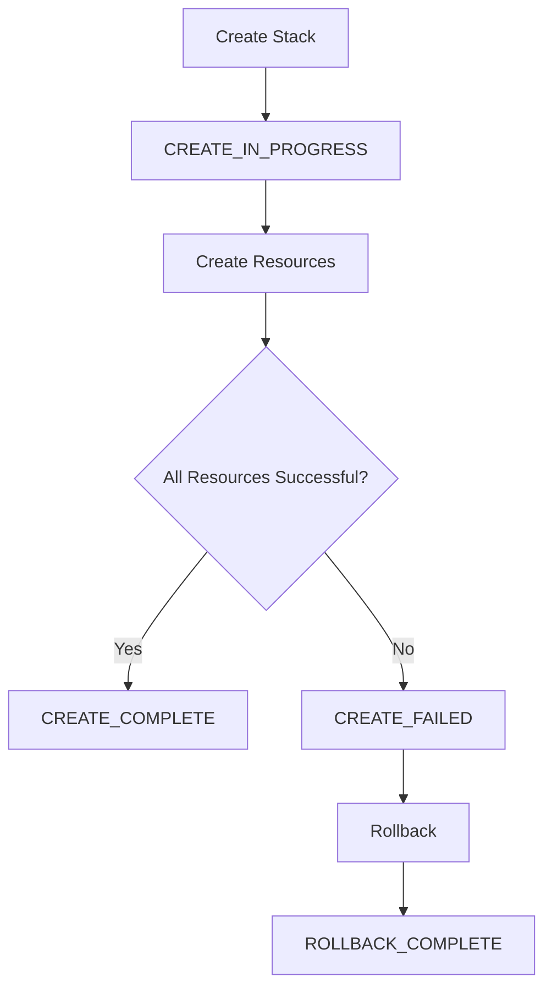
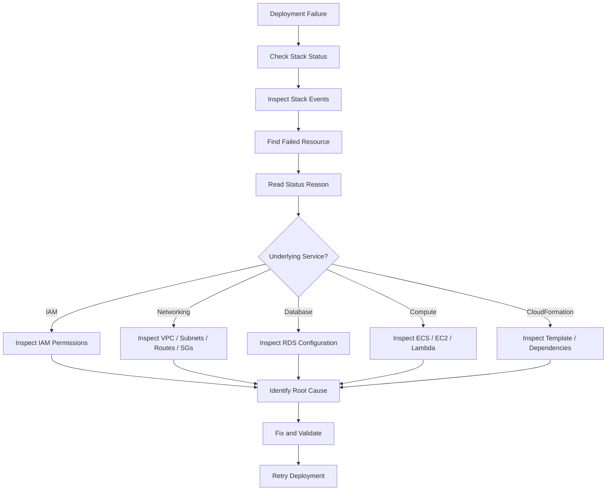

# 10- Stack Events and Diagnostics

## Overview

CloudFormation stack events are the primary operational mechanism for understanding what happened during stack creation, update, rollback, replacement, and deletion.

Every resource operation generates events that describe its lifecycle transition, status, and—when available—the reason for failure. For production infrastructure, CloudFormation events should be treated as the first layer of deployment diagnostics.

A useful troubleshooting model is:

```text
Deployment
    |
    v
CloudFormation Stack
    |
    v
Stack Events
    |
    v
Failed Resource
    |
    v
Resource-Specific Error
    |
    v
Root Cause
```

The key distinction is between the **stack status** and the **resource-level event**.

A stack may report:

```text
UPDATE_FAILED
```

while the actual cause is a specific resource such as:

```text
AWS::IAM::Role
AWS::EC2::SecurityGroup
AWS::RDS::DBInstance
AWS::Lambda::Function
```

Effective diagnosis therefore requires drilling down from the stack to the resource that actually failed.

## Why Stack Events Matter

CloudFormation is an orchestration engine. A single template can create or modify dozens or hundreds of AWS resources.

When one operation fails, the top-level error is often insufficient to explain the problem.

For example:

```text
CloudFormation
    |
    +-- VPC                    CREATE_COMPLETE
    +-- Subnet                 CREATE_COMPLETE
    +-- SecurityGroup          CREATE_COMPLETE
    +-- IAM Role               CREATE_FAILED
    +-- Lambda Function        CREATE_FAILED
    +-- Stack                  ROLLBACK_IN_PROGRESS
```

The stack status only tells you that the deployment failed.

The resource events tell you **where and why** it failed.

## Stack Status vs Resource Status

| Level | Example | Purpose |
|---|---|---|
| Stack | `CREATE_COMPLETE` | Overall stack lifecycle |
| Stack | `UPDATE_ROLLBACK_FAILED` | Overall deployment failure |
| Resource | `CREATE_FAILED` | Specific resource operation failed |
| Resource | `UPDATE_IN_PROGRESS` | Resource is being modified |
| Resource | `DELETE_COMPLETE` | Resource deletion completed |
| Reason | `AccessDenied` | Often contains the immediate failure cause |

A production troubleshooting workflow should normally move from:

```text
Stack Status
    ↓
Resource Status
    ↓
Status Reason
    ↓
AWS Service
    ↓
Underlying Configuration / Permission / Dependency
```

## CloudFormation Event Lifecycle

CloudFormation emits events as resources move through lifecycle states.

A simplified creation flow is:



During a successful deployment:

```text
CREATE_IN_PROGRESS
       |
       +-- Resource A CREATE_IN_PROGRESS
       +-- Resource B CREATE_IN_PROGRESS
       +-- Resource C CREATE_IN_PROGRESS
       |
       +-- Resource A CREATE_COMPLETE
       +-- Resource B CREATE_COMPLETE
       +-- Resource C CREATE_COMPLETE
       |
       v
CREATE_COMPLETE
```

During failure:

```text
CREATE_IN_PROGRESS
       |
       +-- Resource A CREATE_COMPLETE
       +-- Resource B CREATE_FAILED
       |
       v
ROLLBACK_IN_PROGRESS
       |
       +-- Resource A DELETE_IN_PROGRESS
       |
       v
ROLLBACK_COMPLETE
```

## Stack Event Structure

A CloudFormation event contains information such as:

| Field | Purpose |
|---|---|
| `StackId` | Stack ARN |
| `EventId` | Unique event identifier |
| `StackName` | Stack name |
| `LogicalResourceId` | Logical ID from the template |
| `PhysicalResourceId` | Actual AWS resource identifier |
| `ResourceType` | CloudFormation resource type |
| `Timestamp` | Event timestamp |
| `ResourceStatus` | Current resource lifecycle status |
| `ResourceStatusReason` | Explanation for the status |
| `ResourceProperties` | Relevant resource properties when available |

The most important fields during troubleshooting are generally:

```text
LogicalResourceId
ResourceType
ResourceStatus
ResourceStatusReason
Timestamp
PhysicalResourceId
```

## Logical Resource ID

The logical resource ID comes from the CloudFormation template.

Example:

```yaml
Resources:
  ApplicationRole:
    Type: AWS::IAM::Role
```

The logical resource ID is:

```text
ApplicationRole
```

If an event reports:

```text
LogicalResourceId: ApplicationRole
```

you can immediately locate the corresponding resource in the template.

## Physical Resource ID

The physical resource ID identifies the actual AWS resource.

For example:

```text
LogicalResourceId:
    ApplicationRole

PhysicalResourceId:
    arn:aws:iam::123456789012:role/production-application-role
```

The distinction is important:

```text
Logical ID
    |
    | CloudFormation abstraction
    v
Physical ID
    |
    | Actual AWS resource
    v
AWS Service
```

During troubleshooting, the physical ID can be used to inspect the resource directly through its AWS service.

## `describe-stack-events`

The primary CLI command for inspecting events is:

```bash
aws cloudformation describe-stack-events \
  --stack-name production-platform
```

This returns recent stack events.

A typical workflow is:

```bash
aws cloudformation describe-stack-events \
  --stack-name production-platform
```

Then identify:

```text
CREATE_FAILED
UPDATE_FAILED
DELETE_FAILED
ROLLBACK_FAILED
```

and inspect the associated `ResourceStatusReason`.

## Filtering Events

The AWS CLI supports JMESPath queries.

For example:

```bash
aws cloudformation describe-stack-events \
  --stack-name production-platform \
  --query "StackEvents[?contains(ResourceStatus, 'FAILED')]"
```

To display useful diagnostic fields:

```bash
aws cloudformation describe-stack-events \
  --stack-name production-platform \
  --query "StackEvents[?contains(ResourceStatus, 'FAILED')].[Timestamp,LogicalResourceId,ResourceType,ResourceStatus,ResourceStatusReason]" \
  --output table
```

This produces a much more focused troubleshooting view.

## Finding the Most Recent Failure

A useful diagnostic command is:

```bash
aws cloudformation describe-stack-events \
  --stack-name production-platform \
  --query "StackEvents[?ResourceStatus=='CREATE_FAILED'].[Timestamp,LogicalResourceId,ResourceType,ResourceStatusReason]" \
  --output table
```

For updates:

```bash
aws cloudformation describe-stack-events \
  --stack-name production-platform \
  --query "StackEvents[?ResourceStatus=='UPDATE_FAILED'].[Timestamp,LogicalResourceId,ResourceType,ResourceStatusReason]" \
  --output table
```

For deletion:

```bash
aws cloudformation describe-stack-events \
  --stack-name production-platform \
  --query "StackEvents[?ResourceStatus=='DELETE_FAILED'].[Timestamp,LogicalResourceId,ResourceType,ResourceStatusReason]" \
  --output table
```

## Stack Status Inspection

Before inspecting events, check the overall stack state:

```bash
aws cloudformation describe-stacks \
  --stack-name production-platform \
  --query "Stacks[0].[StackName,StackStatus,StackStatusReason]" \
  --output table
```

Typical states include:

| Status | Meaning |
|---|---|
| `CREATE_IN_PROGRESS` | Creation is running |
| `CREATE_COMPLETE` | Creation succeeded |
| `CREATE_FAILED` | Creation failed |
| `UPDATE_IN_PROGRESS` | Update is running |
| `UPDATE_COMPLETE` | Update succeeded |
| `UPDATE_FAILED` | Update failed |
| `UPDATE_ROLLBACK_IN_PROGRESS` | Update rollback is running |
| `UPDATE_ROLLBACK_COMPLETE` | Rollback completed |
| `UPDATE_ROLLBACK_FAILED` | Rollback could not complete |
| `DELETE_IN_PROGRESS` | Deletion is running |
| `DELETE_FAILED` | Deletion failed |
| `DELETE_COMPLETE` | Deletion completed |

The status determines the next diagnostic action.

## Event Ordering

CloudFormation event output can appear counterintuitive because events are generally returned newest first.

For example:

```text
2026-08-13 10:05:12  UPDATE_FAILED
2026-08-13 10:05:10  SecurityGroup UPDATE_FAILED
2026-08-13 10:05:09  SecurityGroup UPDATE_IN_PROGRESS
2026-08-13 10:05:05  VPC UPDATE_IN_PROGRESS
```

Read the event sequence chronologically when reconstructing what happened.

A useful mental model is:

```text
Oldest
  |
  v
Operation starts
  |
  v
Resource transitions
  |
  v
Failure occurs
  |
  v
Rollback begins
  |
  v
Newest
```

## Status Reason

`ResourceStatusReason` is often the most valuable diagnostic field.

Example:

```text
Resource handler returned message:
"User is not authorized to perform: iam:CreateRole"
```

This immediately suggests an IAM problem rather than a CloudFormation syntax problem.

Another example:

```text
Resource handler returned message:
"Cannot update the stack because the specified resource is in use."
```

The next step is to investigate the referenced AWS service and resource.

Do not treat the status reason as the complete root cause in every situation. It is the immediate information CloudFormation received from the underlying resource provider.

## Diagnostic Classification

Most failures can initially be classified into a small number of categories.

| Category | Typical Example |
|---|---|
| Template | Invalid property or resource definition |
| IAM | `AccessDenied` |
| Dependency | Referenced resource unavailable |
| Configuration | Invalid service configuration |
| Quota | AWS service limit exceeded |
| Naming | Resource name already exists |
| State | Resource is in an incompatible state |
| Networking | Subnet, route, security group, or connectivity problem |
| Region | Resource or feature unavailable in region |
| Service-specific | Underlying AWS service rejected operation |

This classification helps determine where to investigate next.

## Common Failure: IAM Permissions

Example event:

```text
CREATE_FAILED
Resource handler returned message:
"User is not authorized to perform: iam:CreateRole"
```

Diagnostic path:

```text
CloudFormation
    |
    v
CREATE_FAILED
    |
    v
IAM Role
    |
    v
AccessDenied
    |
    v
CloudFormation execution identity
    |
    v
Missing IAM permission
```

Check the role or identity used for the deployment.

For service-role-based deployments, verify the CloudFormation execution role and its permissions.

## Common Failure: Resource Already Exists

Example:

```text
CREATE_FAILED
Resource of type AWS::S3::Bucket with identifier
"production-assets" already exists.
```

Possible causes include:

- Resource was manually created.
- Resource belongs to another stack.
- Resource name is globally or regionally unique.
- Previous deployment left the resource behind.

Do not immediately delete the existing resource.

First determine ownership:

```text
Existing Resource
      |
      +---- Managed by another stack?
      |
      +---- Managed manually?
      |
      +---- Leftover from previous deployment?
```

## Common Failure: Resource Replacement

A CloudFormation update may require replacement rather than in-place modification.

The event sequence can look like:

```text
UPDATE_IN_PROGRESS
      |
      v
Replacement Required
      |
      v
New Resource Creation
      |
      v
Old Resource Removal
```

For stateful resources, replacement can be high risk.

Review change sets and resource documentation before approving such changes.

## Common Failure: Dependency Problems

A resource may depend on another resource that failed.

Example:

```text
NetworkStack
     |
     v
Subnet
     |
     v
Database
```

If the subnet fails:

```text
Subnet CREATE_FAILED
       |
       v
Database CREATE_FAILED
```

The database failure may be a downstream symptom.

Always identify the **first meaningful failure** in the dependency chain.

## First Failure vs Cascading Failures

This is one of the most important CloudFormation troubleshooting principles.

Suppose events show:

```text
Resource A   CREATE_FAILED
Resource B   CREATE_FAILED
Resource C   CREATE_FAILED
Resource D   CREATE_FAILED
```

Do not assume all four resources independently failed.

The sequence may actually be:

```text
Resource A
    |
    X FAILURE
    |
    v
Resource B cannot initialize
    |
    v
Resource C cannot initialize
    |
    v
Resource D cannot initialize
```

Investigate the earliest meaningful failure first.

## Nested Stack Diagnostics

Nested stacks require another level of inspection.

Example:

```text
Root Stack
    |
    +---- NetworkStack
    |
    +---- ApplicationStack
              |
              X CREATE_FAILED
```

The parent may report:

```text
ApplicationStack CREATE_FAILED
```

That is not necessarily the root cause.

Follow the hierarchy:

```text
Root Stack
    |
    v
ApplicationStack
    |
    v
Application Resource
    |
    v
Underlying AWS Service
```

Inspect the nested stack separately.

```bash
aws cloudformation describe-stack-events \
  --stack-name <nested-stack-id>
```

This is especially important when using nested CloudFormation architectures.

## Stack Resource Inspection

Use:

```bash
aws cloudformation list-stack-resources \
  --stack-name production-platform
```

This helps map:

```text
Logical Resource ID
        |
        v
Physical Resource ID
        |
        v
AWS Resource
```

Example:

```text
ApplicationRole
    |
    v
arn:aws:iam::123456789012:role/production-app-role
```

Once you know the physical resource ID, inspect it through the relevant AWS service.

## Event-Based Debugging Workflow

A reliable production workflow is:



## Production Troubleshooting Procedure

### Check Stack Status

```bash
aws cloudformation describe-stacks \
  --stack-name production-platform \
  --query "Stacks[0].[StackStatus,StackStatusReason]" \
  --output table
```

### Inspect Failed Events

```bash
aws cloudformation describe-stack-events \
  --stack-name production-platform \
  --query "StackEvents[?contains(ResourceStatus, 'FAILED')].[Timestamp,LogicalResourceId,ResourceType,ResourceStatusReason]" \
  --output table
```

### Identify the First Meaningful Failure

Look for the earliest failure that explains downstream failures.

### Inspect the Resource

Use:

```bash
aws cloudformation list-stack-resources \
  --stack-name production-platform
```

### Inspect the Underlying AWS Service

For example:

```text
IAM Role       -> IAM
RDS Instance   -> RDS
Lambda         -> Lambda
ECS Service    -> ECS
SecurityGroup  -> EC2
S3 Bucket      -> S3
```

### Determine Whether Rollback Is Safe

Do not blindly retry production infrastructure operations.

Check whether:

- A resource was partially created.
- A resource was replaced.
- Data is involved.
- A rollback is still running.
- The stack is stuck.
- A manual intervention occurred.

## Monitoring Long-Running Deployments

For deployments that may take several minutes, inspect events repeatedly.

```bash
aws cloudformation describe-stack-events \
  --stack-name production-platform \
  --output table
```

You can also monitor stack status:

```bash
aws cloudformation describe-stacks \
  --stack-name production-platform \
  --query "Stacks[0].StackStatus"
```

For CI/CD, the pipeline should wait for a terminal CloudFormation state rather than assuming the API call itself represents deployment completion.

## Waiters

The AWS CLI provides CloudFormation wait commands.

For stack creation:

```bash
aws cloudformation wait stack-create-complete \
  --stack-name production-platform
```

For updates:

```bash
aws cloudformation wait stack-update-complete \
  --stack-name production-platform
```

For deletion:

```bash
aws cloudformation wait stack-delete-complete \
  --stack-name production-platform
```

This is useful in CI/CD automation.

Example:

```bash
aws cloudformation update-stack \
  --stack-name production-platform \
  --template-body file://root.yaml

aws cloudformation wait stack-update-complete \
  --stack-name production-platform
```

The deployment process should capture the command's exit status and fail the pipeline when the waiter reports failure.

## Event Monitoring in CI/CD

A production deployment pipeline can follow:

```text
Git Commit
    |
    v
Validate Template
    |
    v
Create Change Set
    |
    v
Review / Approval
    |
    v
Execute Change Set
    |
    v
Wait for Completion
    |
    +---- Success
    |
    +---- Failure
             |
             v
       Collect Events
             |
             v
       Fail Pipeline
```

A useful pipeline diagnostic output should include:

```text
Stack Name
Stack Status
Failed Logical Resource
Resource Type
Status Reason
Deployment Timestamp
```

This is more actionable than simply returning:

```text
CloudFormation deployment failed.
```

## Stack Events and Change Sets

Change sets answer:

> What is CloudFormation planning to change?

Stack events answer:

> What actually happened during the operation?

They solve different problems.

| Tool | Primary Purpose |
|---|---|
| Change Set | Preview proposed changes |
| Stack Events | Diagnose actual lifecycle events |
| Stack Status | Determine overall state |
| CloudTrail | Audit API activity |
| Service Logs | Diagnose application/service behavior |

A mature deployment workflow uses them together.

## CloudTrail and Stack Events

CloudFormation events describe CloudFormation's resource lifecycle.

CloudTrail provides an audit trail of API activity.

For example:

```text
CloudFormation Event
       |
       v
IAM Role CREATE_FAILED
       |
       v
CloudTrail
       |
       v
API call / identity / timestamp
```

CloudTrail is particularly useful when the event indicates:

```text
AccessDenied
UnauthorizedOperation
Invalid permissions
Unexpected API call
```

Use CloudTrail to answer questions such as:

- Which identity performed the operation?
- Which API call occurred?
- When did it occur?
- Which AWS resource was targeted?
- What was the source context?

## CloudFormation Events vs Application Logs

CloudFormation events should not be confused with application logs.

For a Lambda deployment:

```text
CloudFormation Events
    |
    +---- Was the Lambda resource created?
    +---- Did the update succeed?
    +---- Did CloudFormation receive an error?

Lambda Logs
    |
    +---- Did the function execute?
    +---- What happened during runtime?
    +---- What exception occurred?
```

For an ECS deployment:

```text
CloudFormation
    |
    +---- ECS Service resource status

ECS / CloudWatch
    |
    +---- Task startup
    +---- Container failure
    +---- Application logs
```

Use the appropriate diagnostic layer.

## Diagnostic Layers

A production AWS deployment can be diagnosed across multiple layers:

```text
Layer 1: CloudFormation
    |
    | Stack lifecycle
    v
Layer 2: AWS Resource
    |
    | Resource state
    v
Layer 3: AWS Service
    |
    | Service-specific diagnostics
    v
Layer 4: Application
    |
    | Runtime behavior
    v
Layer 5: Logs / Metrics / Traces
```

Do not keep investigating CloudFormation if the event already indicates that the failure is inside the application runtime.

## Rollback Diagnostics

A failed update can enter:

```text
UPDATE_ROLLBACK_IN_PROGRESS
```

The stack is attempting to return to its previous known state.

Monitor:

```bash
aws cloudformation describe-stacks \
  --stack-name production-platform \
  --query "Stacks[0].StackStatus"
```

And inspect events:

```bash
aws cloudformation describe-stack-events \
  --stack-name production-platform \
  --query "StackEvents[?contains(ResourceStatus, 'ROLLBACK')].[Timestamp,LogicalResourceId,ResourceType,ResourceStatus,ResourceStatusReason]" \
  --output table
```

Do not start another update while the stack is still in a state that does not accept updates.

## `UPDATE_ROLLBACK_FAILED`

A particularly important operational state is:

```text
UPDATE_ROLLBACK_FAILED
```

This means CloudFormation could not complete the rollback.

Typical causes include:

- Resource was manually modified.
- Resource was deleted outside CloudFormation.
- Dependency state changed.
- Permissions required for rollback are missing.
- A resource cannot return to the previous configuration.

Inspect events first.

```bash
aws cloudformation describe-stack-events \
  --stack-name production-platform
```

Then determine which resource prevented rollback.

## Continuing a Failed Rollback

CloudFormation supports:

```bash
aws cloudformation continue-update-rollback \
  --stack-name production-platform
```

Use this carefully.

If a specific resource must be skipped:

```bash
aws cloudformation continue-update-rollback \
  --stack-name production-platform \
  --resources-to-skip LogicalResourceId
```

Skipping a resource can leave the actual AWS resource state inconsistent with the CloudFormation template.

Therefore, skipped resources should be treated as technical debt requiring reconciliation.

## Resource State Drift

A CloudFormation event can reveal an operation failure, but it does not replace drift detection.

For example:

```text
CloudFormation expects:
SecurityGroup rule A

Actual AWS state:
SecurityGroup rule B
```

If someone manually changes resources outside CloudFormation, future deployments can behave unexpectedly.

Use CloudFormation drift detection when infrastructure state may have diverged.

## Common Diagnostic Patterns

### `AccessDenied`

```text
Likely area:
IAM

Investigate:
- CloudFormation execution role
- Resource service role
- IAM policy
- SCP
- Permission boundary
- Resource policy
```

### `Resource already exists`

```text
Likely area:
Resource ownership / naming

Investigate:
- Existing resource
- Stack ownership
- Resource import requirements
- Naming strategy
```

### `Invalid parameter`

```text
Likely area:
Template or configuration

Investigate:
- Parameter value
- AllowedValues
- Resource property
- AWS service requirements
```

### `Dependency failed`

```text
Likely area:
Earlier resource failure

Investigate:
- First failed event
- Dependency chain
- Explicit DependsOn
- Resource references
```

### `Timeout`

```text
Likely area:
Resource provisioning or custom resource

Investigate:
- Underlying service
- Network access
- Custom resource Lambda
- Resource provider
- Service quotas
```

## Custom Resource Diagnostics

Custom resources require special attention.

For example:

```text
CloudFormation
     |
     v
AWS::CloudFormation::CustomResource
     |
     v
Lambda
     |
     v
External API / AWS API
```

If a custom resource fails, CloudFormation events may contain only the failure reported by the custom resource provider.

Continue investigation in:

- Lambda logs.
- CloudWatch Logs.
- IAM permissions.
- Network connectivity.
- External API responses.

For production custom resources, ensure the implementation emits actionable error messages.

## Event Retention Considerations

Stack events are operational evidence, but they should not be treated as the sole long-term audit system.

For long-term auditability and investigation, combine:

- CloudFormation events.
- CloudTrail.
- CI/CD logs.
- CloudWatch Logs.
- Application logs.
- Infrastructure monitoring.

This provides a broader deployment history than stack events alone.

## Security Considerations

Stack events can expose operational information such as:

- Resource names.
- ARNs.
- Configuration details.
- Error messages.
- Infrastructure topology.

Avoid placing secrets in resource names, descriptions, or error messages.

Do not assume that masking secrets in application configuration is sufficient if sensitive values are also embedded elsewhere in the infrastructure definition.

Use:

- Secrets Manager.
- Parameter Store.
- Dynamic references.
- Least-privilege IAM.
- Restricted CloudFormation access.

## Production Best Practices

### Always Inspect Events After a Failed Deployment

Do not stop at:

```text
UPDATE_FAILED
```

Identify the failing resource and reason.

### Find the Earliest Meaningful Failure

Later failures are often cascading symptoms.

### Inspect Nested Stack Events

A parent nested-stack failure often hides the actual resource failure.

### Use Change Sets Before High-Risk Updates

Especially for:

- IAM.
- RDS.
- Networking.
- Security groups.
- Stateful resources.

### Integrate Diagnostics Into CI/CD

Capture stack status and failed resource information automatically.

### Use CloudTrail for API-Level Investigation

CloudFormation events and CloudTrail provide complementary information.

### Avoid Manual Resource Modification

Manual changes create state divergence and complicate future deployments.

### Preserve Deployment Evidence

Retain:

- Template version.
- Change set.
- Stack events.
- Pipeline logs.
- CloudTrail records.

This supports incident investigation and compliance requirements.

## Common Mistakes

### Looking Only at the Stack Status

```text
UPDATE_FAILED
```

does not identify the root cause.

Inspect stack events.

### Reading Only the Last Event

The latest event may be a rollback status rather than the original failure.

Inspect the event sequence.

### Assuming Every `FAILED` Resource Is the Root Cause

Some failures are downstream effects.

Find the earliest meaningful failure.

### Ignoring Nested Stack Events

A nested stack resource failing does not necessarily mean the nested stack itself is the root cause.

Inspect the child stack.

### Retrying Without Understanding the Failure

Blind retries can:

- Repeat the same failure.
- Trigger additional replacements.
- Complicate rollback.
- Increase production risk.

### Ignoring Physical Resource IDs

The physical resource ID lets you connect CloudFormation events to the actual AWS resource.

### Debugging CloudFormation When the Problem Is the Application

CloudFormation may successfully create an ECS service or Lambda function while the application itself fails at runtime.

Move to ECS, Lambda, CloudWatch, or application logs when appropriate.

### Using `--resources-to-skip` Without Reconciliation

Skipping rollback for a resource can leave CloudFormation and AWS state inconsistent.

### Exposing Secrets in Error Messages

Never use sensitive values as resource names, descriptions, or diagnostic strings.

## Interview Traps

### What Are CloudFormation Stack Events?

They are lifecycle events generated as CloudFormation creates, updates, deletes, or rolls back stack resources.

### Which CLI Command Shows Stack Events?

```bash
aws cloudformation describe-stack-events \
  --stack-name <stack-name>
```

### What Is the Most Important Field During Troubleshooting?

Usually:

```text
ResourceStatusReason
```

combined with:

```text
LogicalResourceId
ResourceType
ResourceStatus
Timestamp
```

### Why Is `UPDATE_FAILED` Not Enough?

It describes the stack-level result but does not necessarily identify the underlying resource or AWS service failure.

### How Do You Find the Root Cause of a Nested Stack Failure?

Trace:

```text
Parent Stack
    |
    v
Nested Stack Resource
    |
    v
Nested Stack Events
    |
    v
Failed Child Resource
    |
    v
Status Reason
```

### What Is the Difference Between CloudFormation Events and CloudTrail?

CloudFormation events describe stack and resource lifecycle transitions.

CloudTrail records AWS API activity and provides audit information about identities, API calls, and timestamps.

### What Is `UPDATE_ROLLBACK_FAILED`?

It means CloudFormation attempted to roll back an update but could not complete the rollback.

### How Do You Recover From `UPDATE_ROLLBACK_FAILED`?

First identify the resource preventing rollback. After resolving the underlying issue, use:

```bash
aws cloudformation continue-update-rollback \
  --stack-name <stack-name>
```

Use resource skipping only when the consequences are understood.

### Why Should You Find the First Failure?

Later failures may be cascading effects of an earlier dependency failure.

### What Is a Physical Resource ID?

It identifies the actual AWS resource represented by a CloudFormation logical resource.

### Are CloudFormation Events Application Logs?

No. They describe infrastructure lifecycle operations. Application runtime behavior must be investigated through the relevant service and application logging systems.

### How Should Stack Diagnostics Be Integrated Into CI/CD?

A pipeline should:

1. Deploy or execute a change set.
2. Wait for a terminal stack state.
3. Detect failure.
4. Retrieve relevant stack events.
5. Report failed logical resources and status reasons.
6. Fail the deployment with actionable diagnostics.

## CLI Reference

| Operation | Command |
|---|---|
| Describe stack | `aws cloudformation describe-stacks --stack-name <name>` |
| Show events | `aws cloudformation describe-stack-events --stack-name <name>` |
| List resources | `aws cloudformation list-stack-resources --stack-name <name>` |
| Describe resources | `aws cloudformation describe-stack-resources --stack-name <name>` |
| Wait for create | `aws cloudformation wait stack-create-complete --stack-name <name>` |
| Wait for update | `aws cloudformation wait stack-update-complete --stack-name <name>` |
| Wait for delete | `aws cloudformation wait stack-delete-complete --stack-name <name>` |
| Continue rollback | `aws cloudformation continue-update-rollback --stack-name <name>` |
| Filter failed events | `aws cloudformation describe-stack-events --stack-name <name> --query "StackEvents[?contains(ResourceStatus, 'FAILED')]"` |

## Production Diagnostic Checklist

When a CloudFormation deployment fails:

```text
[ ] Check StackStatus
[ ] Check StackStatusReason
[ ] Inspect stack events
[ ] Identify failed logical resource
[ ] Identify resource type
[ ] Read ResourceStatusReason
[ ] Identify the earliest meaningful failure
[ ] Check PhysicalResourceId
[ ] Inspect the underlying AWS service
[ ] Check IAM permissions
[ ] Check dependencies
[ ] Check service quotas
[ ] Check networking
[ ] Check whether manual changes occurred
[ ] Inspect nested stack events if applicable
[ ] Determine rollback state
[ ] Avoid blind retries
[ ] Validate the fix
[ ] Retry only when the stack is in a valid state
[ ] Capture deployment evidence
```

## Key Takeaways

- CloudFormation stack events are the primary first-level diagnostic source for infrastructure deployment failures.
- `describe-stack-events` is the main CLI command for inspecting lifecycle events.
- Stack status tells you the overall state; resource events usually provide the actionable failure information.
- `LogicalResourceId`, `ResourceType`, `ResourceStatus`, `ResourceStatusReason`, `PhysicalResourceId`, and `Timestamp` are the most useful diagnostic fields.
- `ResourceStatusReason` often identifies the immediate cause but may not represent the complete root cause.
- Always investigate the earliest meaningful failure rather than assuming every failed resource is an independent problem.
- Many later `FAILED` events are cascading effects of an earlier dependency failure.
- Nested stack failures require drilling down from the parent stack into the nested stack's own events.
- Physical resource IDs connect CloudFormation abstractions to the actual AWS resources that need inspection.
- `UPDATE_ROLLBACK_FAILED` requires careful investigation before recovery actions are taken.
- `continue-update-rollback` should be used only after understanding the resource preventing rollback.
- `--resources-to-skip` can leave CloudFormation and actual AWS state inconsistent and should not be treated as a normal fix.
- Change sets and stack events solve different problems: change sets preview changes, while events explain what actually happened.
- CloudTrail complements CloudFormation events by providing API-level audit information.
- CloudFormation events are not application logs; runtime failures must be investigated through the underlying AWS service and application observability systems.
- CI/CD pipelines should wait for terminal CloudFormation states and surface actionable event information when deployments fail.
- Avoid blind retries because repeated infrastructure operations can increase production risk.
- Manual modification of CloudFormation-managed resources makes event diagnosis and future reconciliation harder.
- Custom resources require diagnostics across CloudFormation, Lambda, CloudWatch Logs, IAM, networking, and any external dependencies involved.
- Stack events should be combined with CloudTrail, CI/CD logs, CloudWatch Logs, metrics, and application telemetry for production-grade observability.
- Never expose secrets through resource names, descriptions, template values, or diagnostic messages.
- The core troubleshooting pattern is: **Stack Status → Stack Events → Failed Resource → Status Reason → Underlying AWS Service → Root Cause**.