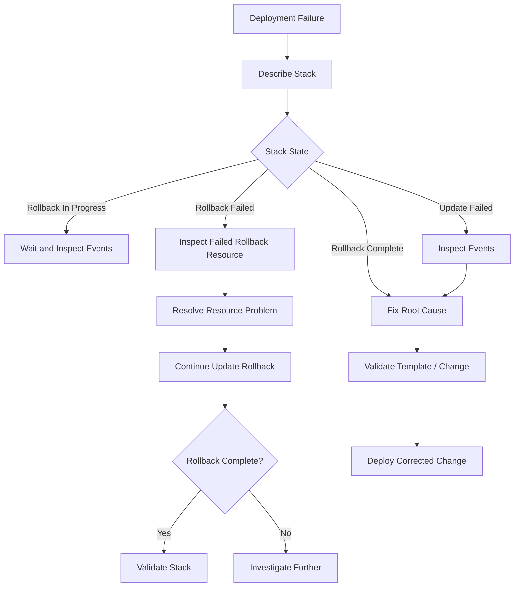
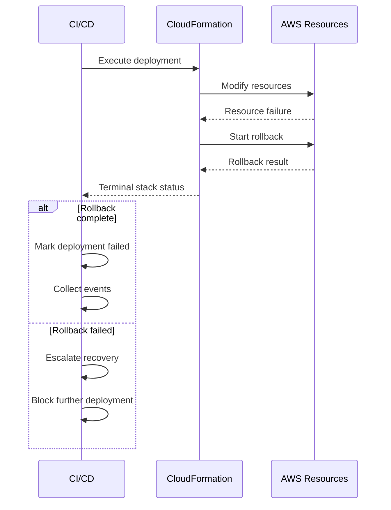

# 11- Rollback and Recovery Commands

## Overview

CloudFormation rollback is the mechanism used to return infrastructure toward a previously known state when a stack operation cannot complete successfully.

Rollback becomes particularly important during production updates because an infrastructure change can partially succeed before another resource fails. CloudFormation attempts to reverse the changes it can safely reverse, but rollback itself can also fail.

The key operational states are:

| Stack State | Meaning |
|---|---|
| `CREATE_FAILED` | Stack creation failed |
| `ROLLBACK_IN_PROGRESS` | CloudFormation is reverting creation changes |
| `ROLLBACK_COMPLETE` | Creation rollback completed |
| `UPDATE_FAILED` | Stack update failed |
| `UPDATE_ROLLBACK_IN_PROGRESS` | CloudFormation is reverting an update |
| `UPDATE_ROLLBACK_COMPLETE` | Update rollback completed |
| `UPDATE_ROLLBACK_FAILED` | CloudFormation could not complete the rollback |
| `DELETE_FAILED` | Stack deletion could not complete |

The important production principle is:

> **Do not execute recovery commands until you understand the stack's current state and the resource preventing progress.**

## Rollback Lifecycle

A typical successful update looks like:

```text
UPDATE_IN_PROGRESS
       |
       v
Resource Changes
       |
       v
UPDATE_COMPLETE
```

A failed update may follow:

```text
UPDATE_IN_PROGRESS
       |
       v
Resource Update
       |
       X
       |
       v
UPDATE_ROLLBACK_IN_PROGRESS
       |
       v
Restore Previous State
       |
       v
UPDATE_ROLLBACK_COMPLETE
```

If rollback itself cannot complete:

```text
UPDATE_ROLLBACK_IN_PROGRESS
       |
       X
       |
       v
UPDATE_ROLLBACK_FAILED
```

At that point, another update should generally not be attempted until the stack is recovered.

## Why Rollback Can Fail

Rollback is not guaranteed to be reversible.

CloudFormation may be unable to restore a resource because:

- A resource was manually modified.
- A resource was deleted outside CloudFormation.
- Required IAM permissions are missing.
- A dependent resource is unavailable.
- A resource has entered an incompatible state.
- A physical resource cannot be recreated with its previous configuration.
- A custom resource fails during rollback.
- An external dependency prevents recovery.
- A stateful resource cannot safely return to its previous state.

For this reason, rollback is an orchestration process rather than a transactional database rollback.

## Inspect the Current Stack State

Before recovery, inspect the stack:

```bash
aws cloudformation describe-stacks \
  --stack-name production-platform \
  --query "Stacks[0].[StackName,StackStatus,StackStatusReason]" \
  --output table
```

This establishes whether the stack is:

- Still updating.
- Rolling back.
- Waiting for recovery.
- Already complete.
- In a terminal failure state.

Never assume the stack state from the command that initiated the deployment.

## Inspect Stack Events

The first recovery diagnostic command should normally be:

```bash
aws cloudformation describe-stack-events \
  --stack-name production-platform
```

For failed events:

```bash
aws cloudformation describe-stack-events \
  --stack-name production-platform \
  --query "StackEvents[?contains(ResourceStatus, 'FAILED')].[Timestamp,LogicalResourceId,ResourceType,ResourceStatus,ResourceStatusReason]" \
  --output table
```

Focus on:

```text
LogicalResourceId
ResourceType
ResourceStatus
ResourceStatusReason
PhysicalResourceId
Timestamp
```

Find the earliest meaningful failure rather than assuming the final rollback event is the root cause.

## Recovery Decision Flow



## Automatic Rollback During Stack Creation

During creation, CloudFormation can roll back resources that were successfully created before the failure.

Example:

```text
VPC             CREATE_COMPLETE
Subnet          CREATE_COMPLETE
SecurityGroup   CREATE_COMPLETE
IAM Role        CREATE_FAILED
                    |
                    v
              ROLLBACK_IN_PROGRESS
                    |
                    v
VPC             DELETE_COMPLETE
Subnet          DELETE_COMPLETE
SecurityGroup   DELETE_COMPLETE
                    |
                    v
              ROLLBACK_COMPLETE
```

Inspect the final state:

```bash
aws cloudformation describe-stacks \
  --stack-name production-platform \
  --query "Stacks[0].StackStatus"
```

If the result is:

```text
"ROLLBACK_COMPLETE"
```

the failed creation was rolled back successfully.

## `continue-update-rollback`

The most important recovery command for a failed update rollback is:

```bash
aws cloudformation continue-update-rollback \
  --stack-name production-platform
```

It instructs CloudFormation to continue the rollback operation.

Before running it, determine why the rollback stopped.

Example workflow:

```bash
aws cloudformation describe-stacks \
  --stack-name production-platform \
  --query "Stacks[0].StackStatus"
```

Then:

```bash
aws cloudformation describe-stack-events \
  --stack-name production-platform \
  --query "StackEvents[?contains(ResourceStatus, 'FAILED')].[LogicalResourceId,ResourceType,ResourceStatus,ResourceStatusReason]" \
  --output table
```

Resolve the underlying problem and then:

```bash
aws cloudformation continue-update-rollback \
  --stack-name production-platform
```

## When to Use `continue-update-rollback`

Use it when:

- The stack is `UPDATE_ROLLBACK_FAILED`.
- The underlying blocker has been identified.
- The blocker has been corrected or otherwise addressed.
- CloudFormation needs to resume the interrupted rollback.

Do not use it simply because the deployment failed.

For example:

```text
UPDATE_FAILED
```

does not automatically mean:

```bash
continue-update-rollback
```

is the correct command.

First determine whether CloudFormation is actually stuck in:

```text
UPDATE_ROLLBACK_FAILED
```

## Continue Rollback With Resource Skipping

CloudFormation supports skipping specific resources:

```bash
aws cloudformation continue-update-rollback \
  --stack-name production-platform \
  --resources-to-skip LogicalResourceId
```

Multiple resources can be specified:

```bash
aws cloudformation continue-update-rollback \
  --stack-name production-platform \
  --resources-to-skip AppDatabase AppService
```

Resource skipping is a high-risk recovery mechanism.

It tells CloudFormation to continue without successfully rolling back the specified resources.

That can result in:

```text
CloudFormation State
        |
        X
        |
        v
Actual AWS Resource State
```

The template and actual infrastructure may no longer agree.

## When Resource Skipping May Be Appropriate

Resource skipping can be appropriate when:

- The resource is preventing rollback.
- The resource has already reached the intended state.
- The resource cannot be rolled back safely.
- The operator understands the resulting state divergence.
- The resource will be reconciled afterward.

It should not be used as a generic way to force CloudFormation through an error.

## Resource Skipping Risks

Consider:

```text
Template:
Database = configuration A

Actual Resource:
Database = configuration B
```

If the database is skipped during rollback:

```text
CloudFormation
    |
    | believes resource was handled
    v
Template State

Actual AWS Resource
    |
    | different configuration
    v
Drift
```

Potential consequences include:

- Future updates behaving unexpectedly.
- Drift detection reporting differences.
- Resource replacement during a later deployment.
- Operational confusion.
- Incorrect assumptions about infrastructure state.

Always document skipped resources and reconcile them afterward.

## `UPDATE_ROLLBACK_FAILED`

This is one of the most important CloudFormation recovery states.

It means:

```text
Update failed
    |
    v
Rollback started
    |
    v
Rollback encountered another failure
    |
    v
UPDATE_ROLLBACK_FAILED
```

The stack is not in a normal update-ready state.

Start with:

```bash
aws cloudformation describe-stack-events \
  --stack-name production-platform \
  --query "StackEvents[?ResourceStatus=='UPDATE_FAILED'].[Timestamp,LogicalResourceId,ResourceType,ResourceStatusReason]" \
  --output table
```

Also inspect rollback failures:

```bash
aws cloudformation describe-stack-events \
  --stack-name production-platform \
  --query "StackEvents[?contains(ResourceStatus, 'ROLLBACK')].[Timestamp,LogicalResourceId,ResourceType,ResourceStatus,ResourceStatusReason]" \
  --output table
```

## Common Rollback Failure: Manual Resource Deletion

Suppose CloudFormation manages:

```text
AWS::EC2::SecurityGroup
```

but an administrator deletes the security group manually.

CloudFormation may later attempt to modify or restore it and fail because the physical resource no longer exists.

The diagnostic chain becomes:

```text
CloudFormation
    |
    v
Logical Resource
    |
    v
Physical Resource
    |
    X
Resource Missing
```

The correct response is to understand the expected infrastructure state before deciding whether to recreate, import, or otherwise reconcile the resource.

## Common Rollback Failure: Manual Modification

Manual modifications can cause rollback operations to fail because CloudFormation's expected state differs from the actual AWS resource state.

Example:

```text
CloudFormation expected:
SecurityGroup rule A

Manual change:
SecurityGroup rule B

Rollback:
Restore rule A
       |
       X
Unexpected resource state
```

Avoid modifying CloudFormation-managed resources directly unless the operational procedure explicitly requires it.

## Common Rollback Failure: IAM Permissions

Rollback requires permissions too.

It is incorrect to assume that only the forward deployment requires authorization.

For example:

```text
Create Resource
     |
     v
Forward operation succeeds

Rollback
     |
     v
Delete / Modify Resource
     |
     X
AccessDenied
```

A CloudFormation execution role must have the permissions necessary for both normal resource operations and the expected rollback path.

## Common Rollback Failure: Stateful Resources

Stateful resources such as databases require additional caution.

A failed update involving:

```text
AWS::RDS::DBInstance
```

may involve:

- Replacement.
- Snapshot behavior.
- Parameter changes.
- Storage changes.
- Dependency changes.
- Data preservation requirements.

Never treat a database rollback like a stateless application deployment.

For production databases, understand:

- Whether the change requires replacement.
- Whether a snapshot is created.
- Whether deletion protection applies.
- Whether the resource is retained.
- Whether restoring the previous CloudFormation configuration actually restores the previous data state.

## `DeletionPolicy` and Rollback

`DeletionPolicy` controls what CloudFormation does with a resource when it is removed from a stack or when the stack is deleted.

Common policies include:

```yaml
Resources:
  Database:
    Type: AWS::RDS::DBInstance
    DeletionPolicy: Snapshot
```

Other important policies include:

```text
Delete
Retain
Snapshot
```

These policies are especially relevant to recovery because deleting a stack and rolling back a deployment can involve resource deletion.

Do not assume `DeletionPolicy` means CloudFormation will restore a resource to a previous state during every rollback scenario. Its behavior depends on the specific lifecycle operation and resource.

## `UpdateReplacePolicy`

`UpdateReplacePolicy` controls what happens to an existing physical resource when CloudFormation replaces it during an update.

Example:

```yaml
Resources:
  Database:
    Type: AWS::RDS::DBInstance
    UpdateReplacePolicy: Snapshot
    DeletionPolicy: Snapshot
```

This is particularly important for stateful resources.

A useful distinction is:

| Policy | Primary Concern |
|---|---|
| `DeletionPolicy` | Resource removal from stack / stack deletion |
| `UpdateReplacePolicy` | Old physical resource during replacement |

## Rollback and Resource Replacement

Some updates cannot be performed in place.

Example:

```text
Old Resource
     |
     | Replacement required
     v
New Resource
     |
     v
CloudFormation switches dependency
     |
     v
Old Resource removed according to policy
```

If the new resource fails:

```text
Old Resource
     |
     v
Replacement attempt
     |
     X
New Resource creation fails
     |
     v
Rollback
```

The exact behavior depends on the resource type and update operation.

For production infrastructure, inspect the change set before approving changes that may cause replacement.

## Change Sets Before Recovery

Before attempting another forward deployment, inspect what CloudFormation plans to change.

Create a change set:

```bash
aws cloudformation create-change-set \
  --stack-name production-platform \
  --change-set-name recovery-validation \
  --template-body file://template.yaml \
  --change-set-type UPDATE
```

Inspect it:

```bash
aws cloudformation describe-change-set \
  --stack-name production-platform \
  --change-set-name recovery-validation
```

Look for:

```text
Action: Add
Action: Modify
Action: Remove
Replacement: True
```

Do not execute a recovery deployment until potentially destructive changes are understood.

## Stack Deletion During Recovery

Delete a stack with:

```bash
aws cloudformation delete-stack \
  --stack-name production-platform
```

Monitor:

```bash
aws cloudformation wait stack-delete-complete \
  --stack-name production-platform
```

Inspect events if deletion fails:

```bash
aws cloudformation describe-stack-events \
  --stack-name production-platform \
  --query "StackEvents[?ResourceStatus=='DELETE_FAILED'].[Timestamp,LogicalResourceId,ResourceType,ResourceStatusReason]" \
  --output table
```

Deletion should not be used as a generic recovery mechanism for production stacks.

## `DELETE_FAILED`

A stack can enter:

```text
DELETE_FAILED
```

when one or more resources cannot be deleted.

Common causes include:

- Dependency still exists.
- Resource is protected.
- Resource is in use.
- IAM permissions are insufficient.
- Resource has a deletion policy such as `Retain`.
- External dependencies prevent deletion.

Inspect the specific resource first.

## Retained Resources

A resource configured with:

```yaml
DeletionPolicy: Retain
```

may remain after stack deletion.

This is often appropriate for important stateful resources.

Example:

```yaml
Resources:
  ProductionDatabase:
    Type: AWS::RDS::DBInstance
    DeletionPolicy: Retain
```

After stack deletion:

```text
CloudFormation Stack
        |
        X
        |
        v
Stack Removed

RDS Database
        |
        v
Retained
```

Retained resources must be tracked operationally because they are no longer managed by that stack.

## Rollback and Nested Stacks

Nested stacks add another recovery layer.

```text
Root Stack
    |
    +-- NetworkStack
    |
    +-- ApplicationStack
            |
            +-- Service
            +-- IAM Role
            +-- Load Balancer
```

A child stack failure can cause the parent stack to enter rollback.

Inspect the parent:

```bash
aws cloudformation describe-stack-events \
  --stack-name root-stack
```

Then inspect the child stack:

```bash
aws cloudformation describe-stack-events \
  --stack-name application-stack
```

The child stack often contains the actual resource-level failure.

## Rollback and Custom Resources

Custom resources can make rollback significantly more complex.

Example:

```text
CloudFormation
     |
     v
Custom Resource
     |
     v
Lambda
     |
     +-- AWS API
     |
     +-- External API
```

If the custom resource does not correctly implement rollback behavior, CloudFormation may become stuck.

Investigate:

```text
CloudFormation Events
        |
        v
Custom Resource
        |
        v
Lambda
        |
        v
CloudWatch Logs
        |
        v
External Dependency
```

Custom resource handlers should:

- Return explicit success or failure.
- Handle retries safely.
- Be idempotent.
- Avoid irreversible operations where possible.
- Produce actionable logs.

## Waiting During Recovery

CloudFormation operations are asynchronous.

Do not interpret the API request itself as proof of completion.

For example:

```bash
aws cloudformation continue-update-rollback \
  --stack-name production-platform
```

should be followed by state monitoring:

```bash
aws cloudformation wait stack-update-complete \
  --stack-name production-platform
```

However, after a rollback operation, verify the resulting state explicitly rather than relying only on a generic waiter.

```bash
aws cloudformation describe-stacks \
  --stack-name production-platform \
  --query "Stacks[0].StackStatus"
```

## CI/CD Recovery Pattern

A production pipeline should treat rollback as a controlled state machine.



A robust pipeline should:

1. Execute the change.
2. Wait for a terminal state.
3. Detect failure.
4. Collect stack events.
5. Determine whether rollback completed.
6. Block subsequent deployments if the stack is unrecoverable.
7. Alert the responsible engineering team.
8. Preserve deployment evidence.

## Recovery State Matrix

| Stack State | Recommended Action |
|---|---|
| `UPDATE_IN_PROGRESS` | Wait and monitor |
| `UPDATE_COMPLETE` | Validate deployment |
| `UPDATE_FAILED` | Inspect events and current state |
| `UPDATE_ROLLBACK_IN_PROGRESS` | Wait and monitor rollback |
| `UPDATE_ROLLBACK_COMPLETE` | Fix root cause before retry |
| `UPDATE_ROLLBACK_FAILED` | Diagnose blocker and continue rollback |
| `ROLLBACK_IN_PROGRESS` | Wait and inspect events |
| `ROLLBACK_COMPLETE` | Fix original creation failure before retry |
| `DELETE_IN_PROGRESS` | Wait and monitor |
| `DELETE_FAILED` | Identify undeletable resource |
| `DELETE_COMPLETE` | Confirm retained resources if applicable |

## Safe Recovery Procedure

A production recovery sequence should look like:

```text
1. Stop additional deployments
        |
        v
2. Inspect StackStatus
        |
        v
3. Inspect Stack Events
        |
        v
4. Identify blocking resource
        |
        v
5. Inspect physical resource
        |
        v
6. Identify root cause
        |
        v
7. Correct underlying issue
        |
        v
8. Continue rollback if required
        |
        v
9. Verify terminal state
        |
        v
10. Validate infrastructure
        |
        v
11. Review change set
        |
        v
12. Retry deployment
```

## Operational Safeguards

### Stop Concurrent Deployments

Do not allow multiple CI/CD workflows to modify the same stack concurrently.

Use deployment locking or pipeline concurrency controls.

### Protect Stateful Resources

For production databases and other critical resources, combine:

- `DeletionPolicy`.
- `UpdateReplacePolicy`.
- Backups.
- Snapshots.
- Deletion protection where supported.
- Explicit change-set review.

### Preserve Deployment Artifacts

Keep:

- Template version.
- Parameter values or parameter references.
- Change set.
- Stack events.
- CI/CD logs.
- CloudTrail records.

### Use Least-Privilege Roles

The CloudFormation execution role must have enough permission to perform expected operations and rollback actions without granting unnecessary administrative access.

### Avoid Manual Changes

Manual modifications make rollback and reconciliation harder.

If emergency changes are unavoidable, document them and reconcile the CloudFormation state afterward.

## Common Mistakes

### Running `continue-update-rollback` Without Diagnosis

The command is not a universal recovery command.

First determine why rollback failed.

### Using `--resources-to-skip` as a Shortcut

Skipping resources can create infrastructure drift.

Use it only when the resulting state is understood and can be reconciled.

### Deploying While Rollback Is Still Running

CloudFormation operations are asynchronous.

Wait for a valid terminal state.

### Deleting a Production Stack to "Fix" It

Stack deletion can be destructive.

It should never be the default response to a failed update.

### Ignoring Stateful Resources

Databases, file systems, and other stateful services require backup and retention planning.

### Assuming Rollback Restores Data

CloudFormation rollback restores infrastructure configuration where possible. It is not a general-purpose application-data rollback mechanism.

### Ignoring Manual Changes

Out-of-band changes can prevent rollback from returning resources to the expected state.

### Forgetting Retained Resources

`DeletionPolicy: Retain` can leave resources behind after stack deletion.

Track those resources explicitly.

### Retrying With the Same Broken Template

If the underlying configuration has not changed, the deployment will likely fail again.

### Ignoring Permissions During Rollback

The execution role needs permissions for rollback operations as well as forward operations.

## Security Considerations

Rollback operations can modify or delete infrastructure.

Protect recovery commands through:

- IAM least privilege.
- MFA for sensitive manual operations.
- Controlled production access.
- CI/CD approval gates.
- CloudTrail auditing.
- Change-set review.
- Separation of deployment and administrative roles.

Treat commands such as:

```bash
aws cloudformation delete-stack
```

and:

```bash
aws cloudformation continue-update-rollback
```

as operationally sensitive actions.

## Monitoring and Alerting

Monitor CloudFormation stack states that require human intervention:

```text
UPDATE_ROLLBACK_FAILED
DELETE_FAILED
ROLLBACK_FAILED
```

Useful alert information includes:

```text
Stack Name
AWS Account
AWS Region
Stack Status
Failed Logical Resource
Resource Type
Status Reason
Deployment ID
Commit SHA
Deployment Actor
```

This turns an infrastructure failure into an actionable incident rather than a generic CI/CD failure.

## Disaster Recovery Considerations

Rollback and disaster recovery are related but different.

| Mechanism | Purpose |
|---|---|
| CloudFormation rollback | Restore infrastructure toward a previous stack state |
| Database backup | Restore application data |
| Snapshot | Preserve resource state |
| Multi-AZ | Improve availability |
| Cross-region architecture | Improve regional resilience |
| Disaster recovery plan | Define restoration strategy |

Do not use CloudFormation rollback as a substitute for backups or disaster recovery.

## Interview Traps

### What Does `continue-update-rollback` Do?

It resumes an interrupted CloudFormation update rollback, typically when a stack is in `UPDATE_ROLLBACK_FAILED`.

### When Should You Use `--resources-to-skip`?

Only when a specific resource is preventing rollback and you understand that skipping it can leave the resource state inconsistent with the CloudFormation template.

### Does Rollback Guarantee Complete Restoration?

No. Resource state, external changes, permissions, dependencies, and service-specific behavior can prevent a complete rollback.

### Is CloudFormation Rollback the Same as Database Transaction Rollback?

No.

CloudFormation orchestrates infrastructure changes. It is not an ACID transaction across AWS resources.

### What Should You Do First With `UPDATE_ROLLBACK_FAILED`?

Inspect stack events and identify the resource preventing rollback.

### Why Can Manual Changes Cause Rollback Failures?

CloudFormation operates from its recorded/template-managed state. Out-of-band changes can make the expected rollback operation incompatible with the actual resource state.

### What Is the Difference Between `DeletionPolicy` and `UpdateReplacePolicy`?

`DeletionPolicy` primarily controls what happens when a resource is removed from the stack or the stack is deleted.

`UpdateReplacePolicy` controls what happens to the old physical resource when an update requires replacement.

### Should You Delete a Failed Production Stack?

Not by default. First determine whether the stack can be recovered and whether deletion would destroy important resources.

### What Is the Main Recovery Principle?

**Understand the stack state → identify the blocking resource → fix the underlying problem → continue recovery → verify state → deploy again.**

## CLI Reference

| Operation | Command |
|---|---|
| Check stack state | `aws cloudformation describe-stacks --stack-name <name>` |
| Inspect events | `aws cloudformation describe-stack-events --stack-name <name>` |
| List resources | `aws cloudformation list-stack-resources --stack-name <name>` |
| Continue rollback | `aws cloudformation continue-update-rollback --stack-name <name>` |
| Skip resources during rollback | `aws cloudformation continue-update-rollback --stack-name <name> --resources-to-skip <logical-id>` |
| Delete stack | `aws cloudformation delete-stack --stack-name <name>` |
| Wait for deletion | `aws cloudformation wait stack-delete-complete --stack-name <name>` |
| Wait for update | `aws cloudformation wait stack-update-complete --stack-name <name>` |
| Create change set | `aws cloudformation create-change-set --stack-name <name> --change-set-name <name> --template-body file://template.yaml --change-set-type UPDATE` |
| Inspect change set | `aws cloudformation describe-change-set --stack-name <name> --change-set-name <name>` |

## Production Recovery Checklist

```text
[ ] Stop concurrent deployments
[ ] Check StackStatus
[ ] Check StackStatusReason
[ ] Inspect stack events
[ ] Identify the earliest meaningful failure
[ ] Identify the blocking logical resource
[ ] Inspect ResourceStatusReason
[ ] Inspect PhysicalResourceId
[ ] Check IAM permissions
[ ] Check dependencies
[ ] Check manual/out-of-band changes
[ ] Check resource state
[ ] Check whether data is involved
[ ] Check DeletionPolicy
[ ] Check UpdateReplacePolicy
[ ] Determine whether rollback is still running
[ ] If UPDATE_ROLLBACK_FAILED, identify the blocker
[ ] Fix the underlying problem
[ ] Continue rollback if appropriate
[ ] Avoid resource skipping unless fully understood
[ ] Verify terminal stack state
[ ] Validate infrastructure state
[ ] Check for drift where appropriate
[ ] Review the next change set
[ ] Retry deployment only after recovery
[ ] Preserve events and deployment evidence
```

## Key Takeaways

- CloudFormation rollback is an infrastructure recovery mechanism, not an ACID transaction.
- Always inspect the current `StackStatus` before executing a recovery command.
- `describe-stack-events` is the primary diagnostic tool for identifying rollback blockers.
- `UPDATE_ROLLBACK_FAILED` indicates that an update rollback itself could not complete.
- `continue-update-rollback` is used to resume an interrupted update rollback after the underlying blocker has been addressed.
- `--resources-to-skip` is a high-risk recovery mechanism because skipped resources can leave CloudFormation and actual AWS state inconsistent.
- Manual resource changes and deletions are common causes of rollback failures.
- Rollback operations require appropriate IAM permissions just like forward deployments.
- Stateful resources such as RDS require special consideration because infrastructure rollback does not automatically mean application-data rollback.
- `DeletionPolicy` and `UpdateReplacePolicy` should be deliberately configured for important resources.
- Change sets should be used to understand potentially destructive recovery deployments before execution.
- Never use stack deletion as the default solution for a failed production update.
- Nested stacks require diagnostics at both parent and child stack levels.
- Custom resources require investigation beyond CloudFormation events, including Lambda logs and external dependencies.
- CI/CD systems should block subsequent deployments when a stack requires manual recovery.
- CloudFormation rollback is not a replacement for backups, snapshots, or a disaster recovery strategy.
- The safe recovery sequence is: **inspect state → inspect events → identify blocker → fix root cause → continue rollback → verify state → validate → deploy**.